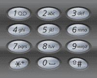

# 快手 2020 校园招聘秋招笔试--工程 B 试卷

## 1

攻击者使用无效 IP 地址，利用 TCP 连接的三次握手过程，连续发送会话请求，使受害主机处于开放会话的请求之中，直至连接超时，最终因耗尽资源而停止响应。这种攻击被称为

正确答案: C   你的答案: 空 (错误)

```cpp
DNS 欺骗攻击
```

```cpp
DDoS 攻击
```

```cpp
SYN Flooding 攻击
```

```cpp
重放攻击
```

本题知识点

Java 工程师 C++工程师 快手 2020

讨论

[牛客 hch](https://www.nowcoder.com/profile/555027400)

DNS 欺骗：冒充域名，把原来查询的 ip 改为其他 IPddos:大量合法的服务器向某一目标不断发送请求，导致其他用户无法使用 syn flooding 就是本题

发表于 2020-04-12 10:22:25

* * *

[掌心里的小雨](https://www.nowcoder.com/profile/86073671)

*   **DNS 欺骗攻击**：DNS（Domin Name Sever）是域名服务器，作用是**把某一台主机发过来地址解析成目标地址的 IP 地址**，再发回给主机，主机拿着这个 IP 地址去访问。而 DNS 解析的过程如下：1.拿到地址，去访问权威服务器，拿到 com 域名权威服务器 IP 地址，比如 A；2.然后向 com 域名权威服务器询问 XXX.com 子域 DNS 服务器的地址，比如 B；3.最后向 XXX.com 子域服务器询问`www.XXX.com`的 IP 地址，比如 C，把此时的 IP 地址 C 返回给主机，主机拿着 C 去访问。而**DNS 欺骗攻击就是在第三步的时候冒充子域 DNS 服务器给了一个假的 IP 地址，如 D**，最后主机拿着 D 去访问了。
*   **DDoS 攻击**：Dos 攻击叫拒绝服务攻击，如向一台服务器发送大量的 IP 数据报，使服务器要花很多时间处理所接收到的数据报，导致合法用户被拒绝服务。
*   **SYN Flooding 攻击**和 TCP 的三次握手过程有关。三次握手过程大概是：一、客户端发送 SYN 给服务器，**此时服务器内部会建立请求控制块；**二、服务器响应 SYN/ACK 给客户端；三、客户端收到 SYN-ACK 之后向服务器发送 ACK，服务器收到最后一个握手 ACK 报文后，控制块会转换成为正式的连接控制块。如果迟迟未收到最后的那个 ACK 报文，服务器会通过定时器重发 SYN-ACK，直至超时，销毁请求控制块；SYN Flooding 攻击是通过伪造的 IP 地址，大量的向服务器发送 SYN 报文，**服务器不断的申请资源建立控制块**，从而大量占用资源直至资源耗尽，使正常请求服务变慢，或者完全停止服务；
*   **重放攻击**：重复的会话请求就是重放攻击，可能是因为用户重复发起请求，也可能是因为请求被攻击者获取，然后重新发给服务器。

发表于 2020-06-09 19:59:52

* * *

[Mengzyy](https://www.nowcoder.com/profile/209750)

SYN Flooding 攻击不是 DDoS 攻击的一种吗？？

发表于 2020-03-30 19:36:48

* * *

## 2

A,B 两台机器都正常工作,B 机器未监听任何端口.如果 A 机器向 B 机器 80 端口发送 SYN 包,会收到何种类型的回包?

正确答案: A   你的答案: 空 (错误)

```cpp
RST 包
```

```cpp
ACK 包
```

```cpp
FIN 包
```

```cpp
无回应
```

本题知识点

Java 工程师 C++工程师 快手 2020

讨论

[小李今天刷题了吗👀](https://www.nowcoder.com/profile/104246017)

RST 包用来强制关闭 TCP 链接。 什么时候发送 RST 包      1\.  建立连接的 SYN 到达某端口，但是该端口上没有正在 监听的服务。       2\. TCP 收到了一个根本不存在的连接上的分节。       3\. 请求超时。 使用 setsockopt 的 SO_RCVTIMEO 选项设置 recv 的超时时间。接收数据超时时，会发送 RST 包。

编辑于 2020-03-19 23:59:37

* * *

## 3

awk 里的内置变量 NF 指的是

正确答案: A   你的答案: 空 (错误)

```cpp
以指定分隔符号作为分隔的列数
```

```cpp
AWK 处理文件的个数
```

```cpp
单个输入文件记录的行数
```

```cpp
所有输入文件记录的行数
```

本题知识点

Java 工程师 C++工程师 快手 2020

讨论

[掌心里的小雨](https://www.nowcoder.com/profile/86073671)

考点：Linux

*   awk 是行处理器，通常用来格式化文本信息，在处理庞大文件时不会出现内存溢出或是处理缓慢的问题，
*   awk 处理过程: 依次对每一行进行处理，然后输出
*   awk 的内置变量 NF、NR、FNR、FS、OFS、RS、ORS
    *   **NF 字段个数，（读取的列数）**
    *   NR 记录数（行号），从 1 开始，新的文件延续上面的计数，新文件不从 1 开始
    *   FS 输入字段分隔符，默认是空格
    *   FNR 读取文件的记录数（行号），从 1 开始，新的文件重新从 1 开始计数
    *   OFS 输出字段分隔符 默认也是空格
    *   RS 输入行分隔符，默认为换行符
    *   ORS 输出行分隔符，默认为换行符

编辑于 2020-06-09 20:15:37

* * *

[跪求一个 offer 啊啊啊啊啊啊](https://www.nowcoder.com/profile/510282628)

这东西能记得住吗

发表于 2020-12-14 13:50:23

* * *

[lyden999](https://www.nowcoder.com/profile/621814613)

NF command keeps a count of the number of fields within the current input record.

发表于 2020-04-01 16:47:41

* * *

## 4

堆排序的额外空间复杂度是（）

正确答案: C   你的答案: 空 (错误)

```cpp
O(n)
```

```cpp
O(logn)
```

```cpp
O(1)
```

```cpp
视情况而定
```

本题知识点

Java 工程师 C++工程师 快手 2020

讨论

[掌心里的小雨](https://www.nowcoder.com/profile/86073671)

*   堆排序**构建堆**的时间复杂度是 O(n);
*   **重建堆**的时间复杂度是 O(nlogn);
*   **最好，最坏，平均**时间复杂度是 O(nlogn)；
*   空间复杂度是：O(1)，仅用一个用来交换的暂存单元。

发表于 2020-06-09 20:25:39

* * *

[Mengzyy](https://www.nowcoder.com/profile/209750)

堆排序属于原地排序

发表于 2020-03-30 19:41:06

* * *

[求个 offer 呀？](https://www.nowcoder.com/profile/380523)

这道题不考虑在调整元素位置时，递归调用时栈的空间吗？

发表于 2020-04-12 15:26:27

* * *

## 5

给定 `` ``， `div#a` 和 `div#b` 的宽度分别是【100%即其父容器宽度】

正确答案: B   你的答案: 空 (错误)

```cpp
100%, 100%
```

```cpp
100px, 100%
```

```cpp
100%, 100px
```

```cpp
100px, 100px
```

本题知识点

Java 工程师 C++工程师 快手 2020

讨论

[牛客 789725240 号](https://www.nowcoder.com/profile/789725240)

个人愚见：第一个 div#a 设置 float 属性，使得它脱离元素特性控制，这样子它里面的 div 就能够并排放置，所以 div#a 的宽度就是里面放的 div 的 100px；而第二个 div#b 没设置的情况下就和父容器宽度一致。

发表于 2020-07-26 12:32:54

* * *

## 6

以下代码的输出结果是// counter.jslet counter = 10;
export default counter;

// index.js
import myCounter from "./counter";
myCounter += 1;
console.log(myCounter);

正确答案: C   你的答案: 空 (错误)

```cpp
10
```

```cpp
11
```

```cpp
Error
```

```cpp
NaN
```

本题知识点

Java 工程师 C++工程师 快手 2020

讨论

[米勒的画](https://www.nowcoder.com/profile/9774451)

引入的模块是 只读 的: 不能修改引入的模块。只有导出他们的模块才能修改其值。

给 myCounter 增加一个值的时候会抛出一个异常：myCounter 是只读的，不能被修改。

发表于 2020-04-11 15:29:50

* * *

[lyden999](https://www.nowcoder.com/profile/621814613)

imported variables are live read-only view, so it cannot be assigned outside of its original module otherwise an error will occur

发表于 2020-04-01 16:58:42

* * *

[掌心里的小雨](https://www.nowcoder.com/profile/86073671)

*   let 语句声明一个块级作用域的本地变量，并且可选的将其初始化为一个值
*   let 允许你声明一个作用域被限制在块级中的变量、语句或者表达式。

发表于 2020-06-09 20:42:07

* * *

## 7

对字符串 HI_KWAI 中的字符进行二进制编码，使得字符串的编码长度尽可能短，最短长度为

正确答案: C   你的答案: 空 (错误)

```cpp
7
```

```cpp
14
```

```cpp
18
```

```cpp
22
```

本题知识点

Java 工程师 C++工程师 快手 2020

讨论

[Hokii_](https://www.nowcoder.com/profile/55849086)

1.统计字符出现个数 H 1I  2_ 1K 1W 1A 12.构造哈夫曼树每个人的结果可能不一样，左标 0，右标 1如图为一种构造方法 3.得到每个字符对应编码 H 000I  10_ 001K 010W 011A 114.得到原字符串编码 HI_KWAI：000100010100111110 共 18 位

发表于 2020-03-23 14:29:16

* * *

[姜晓阳](https://www.nowcoder.com/profile/9340608)

g..

发表于 2020-07-07 18:49:56

* * *

[AJQK](https://www.nowcoder.com/profile/388843733)

我怎么算的哈夫曼树是 16 啊 求解析

发表于 2020-03-19 14:46:30

* * *

## 8

无向图 G 有 20 条边，有 4 个度为 4 的顶点，6 个度为 3 的顶点，其余顶点度小于 3，则 G 最多有多少个顶点

正确答案: B   你的答案: 空 (错误)

```cpp
14
```

```cpp
16
```

```cpp
18
```

```cpp
20
```

本题知识点

Java 工程师 C++工程师 快手 2020

讨论

[无限苦肉盖神](https://www.nowcoder.com/profile/152165957)

做错了。
回过头来思考一下：
总度数=边数乘以*2=20 乘*2=40
剩余的度数=总度数-4 乘*4-6 乘*3=6
想要顶点最多，应该是一度就分配给一个顶点吧。所以是 4+6+6=16 顶点

编辑于 2020-03-28 16:18:38

* * *

## 9

3 的方幂及不相等的 3 的方幂的和排列成递增序列{1,3,4,9,10,12,13…}，则数列第 100 项是

正确答案: C   你的答案: 空 (错误)

```cpp
975
```

```cpp
976
```

```cpp
981
```

```cpp
982
```

本题知识点

Java 工程师 C++工程师 快手 2020

讨论

[吃**的蜗牛](https://www.nowcoder.com/profile/238090891)

第 1 位，1 的二进制为 001，第 1 位数为 3 的 0 次方（1）第 2 位，2 的二进制为 010，第 2 位数为 3 的 1 次方（3）第 3 位，3 的二进制为 011，第 3 位数为 3 的 0 次方+3 的 1 次方（4）...第 100 位，100 的二进制为 1100100，第 100 位为 3 的 6 次方+3 的 5 次方+3 的平方（981）

发表于 2020-04-02 18:29:22

* * *

[绝色人才](https://www.nowcoder.com/profile/7789724)

①  3^n 这个数所在位置是 2^n。比如 1=3⁰，位置 2⁰；9=3²，位置 2²。^(② {1,3,4,9} 后面的数的生成方法是 9 加上前面的每一个数。如)^(9+1=10) ^(9+3=12) ^(9+4=13) ^(    后面紧接着就是第 2³=8 个数了，值为 3³=27。后面的数也按照上述做法用 27 加上前面每一个数。)
③ 求第 100 项的值。第 100 项是在第 2⁶=64 项的后面再数 36 项，值应该为 3⁶+全部数列的第 36 项。④ 求第 36 项的值。第 36 项是第 2⁵=32 项后面再数 4 项，值应该为 3⁵+全部数列的第 4 项，第 4 项是 9。所以，第 100 项的值为  3⁶+3⁵+9=981。

发表于 2020-03-23 22:38:01

* * *

## 10

最长递增子序列（LIS）问题是指，在一个给定的数值序列中，找到一个子序列，使得这个子序列元素的数值依次递增，并且这个子序列的长度尽可能地大。比如{2,1,4,2,3,7,4,7,19} 的 LIS 是 {1,2,3,4,7,19}，长度是 6。考虑大小为 N 的数组，获取其 LIS 的最小时间和空间复杂度分别为：

正确答案: D   你的答案: 空 (错误)

```cpp
N²，N²
```

```cpp
NlogN，N²
```

```cpp
NlogN，NlogN
```

```cpp
NlogN，N
```

本题知识点

Java 工程师 C++工程师 快手 2020

讨论

[佳烁](https://www.nowcoder.com/profile/678878791)

参见 LeetCode 题库第 300 题题解

发表于 2020-04-29 02:48:01

* * *

## 11

F(x)=1 (x<=1), F(n)=25*F(n/5)+n² 求 F(n)的时间复杂度:

正确答案: D   你的答案: 空 (错误)

```cpp
O(n*log(n))
```

```cpp
O(log(n))
```

```cpp
O(n)
```

```cpp
O(n²*log(n))
```

本题知识点

Java 工程师 C++工程师 快手 2020

讨论

[Mengzyy](https://www.nowcoder.com/profile/209750)

对于 T(n) = a*T(n/b)+c*n^k;T(1) = c 这样的递归关系，有这样的结论：

if (a > b^k)   T(n) = O(n^(logb(a)));logb(a)b 为底 a 的对数
if (a = b^k)   T(n) = O(n^k*logn);
if (a < b^k)   T(n) = O(n^k);

发表于 2020-03-30 19:45:29

* * *

[认真内推，开心搬砖](https://www.nowcoder.com/profile/7675930)

T(n) = 25T(n/5)+n² 的时间复杂度 - CTHON - 博客园 [`www.cnblogs.com/cthon/p/9533083.html`](https://www.cnblogs.com/cthon/p/9533083.html)，没看懂 x = lg 5 n 是怎么来的

发表于 2020-04-11 07:54:48

* * *

## 12

A，B，C，D 都为 32 位整型，基于以下给定的 C，D 能否得出 A，B

正确答案: C   你的答案: 空 (错误)

```cpp
C=A+B,D=A-B
```

```cpp
C=A*B,D=A/B
```

```cpp
C=A+B,D=B
```

```cpp
C=A-B,D=(A+B)>>1
```

本题知识点

Java 工程师 C++工程师 快手 2020

讨论

[牛客网不知名网友](https://www.nowcoder.com/profile/313988986)

A：C=A+B,D=A-B，正常运算是 C + D 或者 C - D 进行运算，这两种运算都可能导致 结果越界。B：C=A*B,D=A/B，显然当 A 为 0 的情况我们无法通过 C,D 获取 B 的值 C：C=A+B,D=B，正确是因为 C-D 可以获得 A 而且 A 保证是 32 位整数不会越界, D = B 可以获得 B 的值 D：C=A-B,D=(A+B)>>1 同 A

发表于 2020-04-11 13:31:08

* * *

## 13

文法 G：S->abSba|c 所识别的语言是：

正确答案: C   你的答案: 空 (错误)

```cpp
(abcba)*
```

```cpp
abc*ba
```

```cpp
(ab)*c(ba)*
```

```cpp
ab(ab)*c(ba)*ba
```

本题知识点

Java 工程师 C++工程师 快手 2020

讨论

[牛客 205392791 号](https://www.nowcoder.com/profile/205392791)

S 可以直接生成 c，没有两边的 ab 和 ba，那么答案就应该是 C 啊

发表于 2020-03-21 10:44:22

* * *

[--ASCII--](https://www.nowcoder.com/profile/488622518)

我觉得应该是这样的：(ab)^nc(ba)^n,n>=0

发表于 2022-01-08 09:55:02

* * *

## 14

假定+，*和&分别表示加法、乘法和指数运算，且计算符优先级顺序从高到低依次为：+，*和&，运算符运算时遵循左结合率，则：2+1*2&1*2&2 的值为：

正确答案: D   你的答案: 空 (错误)

```cpp
10
```

```cpp
18
```

```cpp
324
```

```cpp
1296
```

本题知识点

Java 工程师 C++工程师 快手 2020

讨论

[acniX](https://www.nowcoder.com/profile/547163415)

注意题干，&代表的是指数运算：原式=3*2&1*2&2        =6&2&2=6^(2²)=1296

发表于 2020-04-12 15:14:34

* * *

## 15

下面哪个数据库不属于 NoSQL 的范畴？

正确答案: D   你的答案: 空 (错误)

```cpp
HBase
```

```cpp
Cassandra
```

```cpp
MongoDB
```

```cpp
PostgreSQL
```

本题知识点

Java 工程师 C++工程师 快手 2020

讨论

[yellow0523](https://www.nowcoder.com/profile/991597070)

PostgreSQL 是关系型数据库。

发表于 2020-03-23 23:06:57

* * *

[认真内推，开心搬砖](https://www.nowcoder.com/profile/7675930)

Hbase、Cassandra 是按列存储，MongoDB 是文档存储，都是 NoSql

发表于 2020-04-11 10:06:35

* * *

[掌心里的小雨](https://www.nowcoder.com/profile/86073671)

*   关系型数据库：是指采用了关系模型来组织数据的数据库，关系模型指的就是二维表格模型
    *   常见的关系型数据库：Oracle，SQL Server，Sybase，DB2，Access，MySql，VFP，INGRES
*   非关系型数据库，以键值对进行存储，
    *   常见的非关系型数据库（NoSQL）:SQLite, Redis ,MongoDB ,Cassandra , Voldemort, CouchDB, LevelDB

发表于 2020-06-09 21:39:46

* * *

## 16

体育课的铃声响了，同学们都陆续地奔向操场，按老师的要求从高到矮站成一排。每个同学按顺序来到操场时，都从排尾走向排头，找到第一个比自己高的同学，并站到他的后面，这种站队的方法类似下列哪种算法（）

正确答案: B   你的答案: 空 (错误)

```cpp
冒泡排序
```

```cpp
插入排序
```

```cpp
归并排序
```

```cpp
快速排序
```

本题知识点

Java 工程师 C++工程师 快手 2020

## 17

int i=0; try{    i++;    return i;} catch(Exception e){    i++;} finally {    i++;}这段代码的返回值是什么

正确答案: B   你的答案: 空 (错误)

```cpp
0
```

```cpp
1
```

```cpp
2
```

```cpp
3
```

本题知识点

Java 工程师 C++工程师 快手 2020

讨论

[牛客 205392791 号](https://www.nowcoder.com/profile/205392791)

如果 try 或 catch 中有 return 语句，finally 中对返回变量的改变不会影响最终的返回结果

发表于 2020-03-21 11:00:57

* * *

## 18

当（）时，进程从执行状态转变为就绪状态

正确答案: B   你的答案: 空 (错误)

```cpp
进程被调度程序选中
```

```cpp
时间片到
```

```cpp
等待某一事件
```

```cpp
等待的事件发生
```

本题知识点

Java 工程师 C++工程师 快手 2020

讨论

[掌心里的小雨](https://www.nowcoder.com/profile/86073671)


编辑于 2020-06-09 21:45:30

* * *

## 19

在 MySQL 的众多存储引擎中，只有 InnoDB 支持事务，关于事物隔离级别，以下说法错误的是（）

正确答案: C   你的答案: 空 (错误)

```cpp
Read uncommitted、Read committed 、Repeatable read、Serializable 四种隔离级别并行性能依次降低，安全性依次提高。
```

```cpp
脏读是某一事务读取了另外一个事务未提交的数据，不可重复读是读取了其他事务提交的数据，脏读和不可重复读都可以通过事物隔离级别控制。
```

```cpp
RR 隔离级别，只能返回比当前事务早的提交插入、更新、删除值。
```

```cpp
RR 和 RC 隔离级别都存在幻读，RR 隔离级别幻读可以通过 next-key lock 避免。
```

本题知识点

Java 工程师 C++工程师 快手 2020

讨论

[最后的失败者](https://www.nowcoder.com/profile/599496999)

RR 隔离级别下，在之前的删除值应该是不能返回的吧

发表于 2020-04-15 16:22:59

* * *

[认真内推，开心搬砖](https://www.nowcoder.com/profile/7675930)

RR 隔离级别下，有读锁但没有范围锁，其他事物无法修改在读的，但可以增加数据，也就是说 RR 级别下可以返回插入值

发表于 2020-04-11 10:39:13

* * *

## 20

给定一个字符串集合，集合大小为 n，n=6000000, 请问从集合中查询字符串，以下算法中最快速的是哪一个？

正确答案: C   你的答案: 空 (错误)

```cpp
skiplist（跳表）
```

```cpp
B 树
```

```cpp
哈希表
```

```cpp
红黑树
```

本题知识点

Java 工程师 C++工程师 快手 2020

讨论

[牛客 294022129 号](https://www.nowcoder.com/profile/294022129)

数组查，链表改（增删），这是这两个各自的长处

发表于 2020-03-17 00:29:49

* * *

[Elevenoo](https://www.nowcoder.com/profile/129733053)

哈希表查询时间复杂度为 O(1)

发表于 2020-03-29 00:12:11

* * *

## 21

 给定一个数组，每个元素范围是 0~K（K < 整数最大值 2³²），将该数组分成两部分，使得 |S1- S2|最小，其中 S1 和 S2 分别是数组两部分的元素之和。 

本题知识点

Java 工程师 C++工程师 快手 2020

讨论

[牛客 464471497 号](https://www.nowcoder.com/profile/464471497)

 ```cpp
#include <iostream>
(720)#include <numeric>
using namespace std;

int main(void){
    int n;
    cin>>n;
    long num[n];
    for(int i=0;i<n;i++)cin >> num[i];

    long sum = accumulate(num,num+n,0);
    long half = sum/2;

    long dp[half+1] = {0};

    for(int i=0;i<n;i++)
        for(long j=half;j>=num[i];j--)
            dp[j] = max(dp[j],dp[j-num[i]]+num[i]);

    cout << sum - 2*dp[half] << endl;

    return 0;
}
```

发表于 2020-04-13 22:34:25

* * *

[孟煜](https://www.nowcoder.com/profile/234611596)

Python 下测试出现问题解决：
python 下测试出越界问题，通过抛出异常分析错误原因为第二行没有输入，自己填补上就可以了。出现问题的测试用例为

```cpp
3
1 2 1000
```

可以 hard code 里面补充，即可通过测试。

```cpp
try:
    n = eval(input())
    line =  input()
    if line == "":
        line = "1 2 1000"
    str = line.split(" ")
    for o in range(len(str)):
        str[o] = eval(str[o])
    str.sort(reverse=True)
    catchlist = []
    half = sum(str)/2
    catchlist.append(str[0])
    min = half
    def checkmin (x):
        global min
        if x < min:
            min = x
        return min
    del str[0]
    if catchlist[0] > half:
        print(catchlist[0] - sum(str))
    else:
        i = 0
        cmax = catchlist[0]
        while i < len(str):
            if cmax + str[i]> half:
                checkmin(cmax + str[i] - half)
                i += 1
            elif cmax + str[i] < half:
                catchlist.append(str[i])
                cmax += str[i]
                checkmin(half - cmax)
                del str[i]
            else:
                cmax += str[i]
                break

        print(int(abs(cmax-half)*2))
except:
    print(line)
    print(n)

```

编辑于 2020-04-21 22:37:53

* * *

[rainbow_w](https://www.nowcoder.com/profile/169266257)

#include <iostream>#include<vector>
#include<algorithm>
#define INT_MIN -100000
using  namespace std;
int main()
{
    int n;          //长度,使用 01 背包，牺牲了空间复杂度
    cin >> n;
    vector<int> v(n);
    int sum = 0;
    for (int i = 0; i<n; i++)
    {
        cin >> v[i];
        sum += v[i];
    }
    int mid = sum >> 1;                //最大到中间即可
    vector<int> f(mid + 1, INT_MIN);
    f[0] = 0;
    for (int i = 0; i<n; i++)
    {
        for (int j = mid; j>=v[i]; j--)
            f[j] = max(f[j], f[j - v[i]] + v[i]);
    }
    int result = 0;
    for (int i = mid; i>0; i--)
    {
        if (f[i] > 0)
        {
            result = i;
            break;
        }
    }
    cout << sum - 2 * result << endl;
    return 0;
}

发表于 2020-08-17 11:21:30

* * *

## 22

给定一个未排序数组,找出其中最长的等差数列(无需保证数字顺序)。

本题知识点

Java 工程师 C++工程师 快手 2020

讨论

[牛客 496912358 号](https://www.nowcoder.com/profile/496912358)

```cpp
import java.util.*;
public class Main{
    public static void main(String[] args){
        Scanner sc = new Scanner(System.in);
        int m = sc.nextInt();
        if(m==0){
            System.out.println(0);
            return;
        }else if(m==1){
            System.out.println(1);
            return;
        }
        int[] ints = new int[m];
        int index = 0;
        Map<Integer,Map<Integer,Integer>> map = new HashMap<>();
        while(sc.hasNext()){
            ints[index] = Integer.parseInt(sc.next());
            map.put(index,new HashMap<>());
            index++;
        }
        int mnum = Integer.MIN_VALUE;
        Arrays.sort(ints);
        int diff = 0;
        for(int i=1;i<ints.length;i++){
            for(int j=0;j<i;j++){
                diff = ints[i] - ints[j];
                if(!map.get(j).containsKey(diff)){
                    map.get(i).put(diff,2);
                }else{
                    int p = map.get(j).get(diff)+1;
                    map.get(i).put(diff,p);
                }
                mnum = Math.max(map.get(i).get(diff),mnum);
            }
        }
        System.out.println(mnum);
    }
}

```

首先把数组进行排序，这样就可以按照顺序来遍历，并且这样可以根据 j 值获得 j 之前方差为 diff 的等差数列长度。使用一个 map key==下标 i，value==map（这个 map key==方差 diff，value==下标为 j，方差为 diff 的数列长度）。用两层循环来寻找数列，首先求数组中 i 与 j 的差 diff，然后在 map 寻找是否存在下标为 j，方差为 diff 的数列，如果不存在说明 i 到 j 是新数列，不然 map 的 value+1。其实就是利用 map 保存到下标为 j，方差为 diff 的数列长度。

发表于 2020-03-21 23:21:34

* * *

[rainbow_w](https://www.nowcoder.com/profile/169266257)

#include<iostream>//遍历的方法解决，时间复杂度居然过去了
#include<vector>
#include<algorithm>
using namespace std;
int main()
{
    int n;
    cin>>n;
    if(n==1)
    {
        cout<<1<<endl;
        return 0;
    }
    vector<int> v(n);
    vector<vector<int>> f(n,vector<int>(n,0));
    for(int i=0;i<n;i++)
    {
        cin>>v[i];
    }
    sort(v.begin(),v.end());
    int result=0;
   for(int start=0;start<n;start++)             //遍历起点
   {
       for(int next=start+1;next<n;next++)     //遍历下一个点
       {
           int cha = v[next] - v[start];
           int t=next;
           int temp=2;
           for(int end=next+1;end<n;end++)            //遍历终点
           {
               if(v[end]-v[t]==cha)
               {
                   temp++;
                   t=end;
               }
           }
           result=max(result,temp);               
       }
   }
    cout<<result<<endl;
    return 0;
}

发表于 2020-08-17 16:54:31

* * *

[Cyan1956](https://www.nowcoder.com/profile/487142704)

[集合划分问题 Golang 动态规划 01 背包](https://blog.csdn.net/Cyan1956/article/details/105753225)

[最长等差数列问题 Golang 暴力法](https://blog.csdn.net/Cyan1956/article/details/105753204)

[字母组合 Golang](https://blog.csdn.net/Cyan1956/article/details/105753274)
[验证 IP 地址 Golang](https://blog.csdn.net/Cyan1956/article/details/105753236)

这个代码可能不简洁，但是绝对简单易懂。
首先将序列 nums 排个序，然后取第一个 first 元素 f，再取第二个 second 元素 s，算出差 d，那么我们的下一个期望值就是 nums[s]+d，遍历剩余的数组，碰到了期望就计数+1，期望值+d，继续遍历。
目前只想到了这样朴素的方法，如果你想到了什么奇技淫巧，不妨评论一下吧。

```cpp
package main

import (
    "fmt"
    "sort"
)

func main()  {
    var n,tp int
    var nums []int
    fmt.Scan(&n)
    for i:=0;i<n;i++{
        fmt.Scan(&tp)
        nums= append(nums, tp)
    }
        if n<=2{
        fmt.Println(n)
        return
    }
    sort.Ints(nums)
    max:=0
    for f:=0;f<n;f++{
        for s:=f+1;s<n;s++{
            cnt:=2
            d:=nums[s]-nums[f]
            exp:=nums[s]+d
            for k:=s+1;k<n;k++{
                if nums[k]==exp{
                    cnt++
                    exp+=d
                }
            }
            if cnt>max{
                max=cnt
            }
        }
    }
    fmt.Println(max)
}
```

发表于 2020-04-25 18:10:42

* * *

## 23

给定一个仅包含数字 2-9 的字符串，返回所有它能表示的字母组合，按照字典序升序排序,如果有重复的结果需要去重

给出数字到字母的映射如下（与电话按键相同）。注意 1 不对应任何字母。



本题知识点

Java 工程师 C++工程师 快手 2020

讨论

[牛客 496912358 号](https://www.nowcoder.com/profile/496912358)

```cpp
import java.util.*;
public class Main{
    public static void main(String[] args){
        Scanner sc = new Scanner(System.in);
        String num = sc.nextLine();
        Map<Character,String> map = new HashMap<>();
        map.put('2',"abc");
        map.put('3',"def");
        map.put('4',"ghi");
        map.put('5',"jkl");
        map.put('6',"mno");
        map.put('7',"pqrs");
        map.put('8',"tuv");
        map.put('9',"wxyz");
        List<String> list = new ArrayList<>();
        findA(map,list,num,0,"");
        System.out.println(list);
    }
    public static List<String> findA(Map<Character,String> map,List<String> list,String num,int index,String s){
        if(index == num.length()){
            list.add(s);
            return list;
        }
        String p = map.get(num.charAt(index));
        for(int i=0;i<p.length();i++){
            findA(map,list,num,index+1,s+p.charAt(i));
        }
        return list;
    }
}
```

发表于 2020-03-22 01:52:51

* * *

[牛客 45647705 号](https://www.nowcoder.com/profile/45647705)

```cpp
import java.util.List;
import java.util.ArrayList;
import java.util.HashMap;
import java.util.Scanner;
public class Main{
    public static List<String> lettersCombinations(String digits){
        if(digits == null || digits.length() == 0)    return new ArrayList<>();
        List<String> res = new ArrayList<>();
        if(digits.length() != 0)    backtrack(res, "", digits);
        return res;
    }

    public static void backtrack(List<String> res, String combination, String next_digit){
        HashMap<String,String> map = new HashMap<>();
        map.put("2","abc");
        map.put("3","def");
        map.put("4","ghi");
        map.put("5","jkl");
        map.put("6","mno");
        map.put("7","pqrs");
        map.put("8","tuv");
        map.put("9","wxyz");
        if(next_digit.length() == 0){
            res.add(combination);
        }else{
            String digit = next_digit.substring(0,1);
            String letters = map.get(digit);
            for(int i = 0; i < letters.length(); i++){
                String letter = letters.substring(i, i + 1);
                backtrack(res,combination + letter,next_digit.substring(1));
            }
        }  

    }
    public static void main(String[] args){
        Scanner in = new Scanner(System.in);
        String str = in.nextLine();
        System.out.println(lettersCombinations(str));
    }
}
```

发表于 2020-08-21 11:18:55

* * *

[rainbow_w](https://www.nowcoder.com/profile/169266257)

#include <string>#include<iostream>
#include<vector>
using namespace std;
static vector<vector<char>> biao = { { 'a','b','c' },{ 'd','e','f' },{ 'g','h','i' },{ 'j','k','l' },{ 'm','n','o' },{ 'p','q','r','s' },{ 't','u','v' },{ 'w','x','y','z' } };
//temp 存放实时的字符串，用于添加到结果中，result 为结果，l 为所需结果的长度，index 为当前到第几个数，shu 为 main 中输入的数字串，panduan 为标记能不能走的表
void dfs(string temp, vector<string>& result, int l, int index, string shu, vector<vector<int>> panduan)
{
    if (temp.size() == l)
    {
        result.push_back(temp);
        return;
    }
    int a = shu[index] - '0';
    for (int i = 0; i<biao[a - 2].size(); i++)
      dfs(temp + biao[a - 2][i], result, l, index+1, shu, panduan);
}
int main()
{
    int a;
    cin >> a;
    string shu;
    while (a>0)
    {
        char t= (a % 10 + '0');
        shu=t+shu;
        if ((a % 10)<2)
        {
            return 0;
        }
        a = a / 10;
    }
    vector<string> result;
    vector<vector<int>> panduan(8, vector<int>(3, 0));      //标记有没有走过
    //一开始以为要回溯，后来发现不需要，panduan 数组不需要定义
    string temp;
    dfs(temp, result, shu.size(), 0, shu, panduan);
    cout << '[';
    int l = result.size();
    for (int i = 0; i<l; i++)
    {
        cout << result[i];
        if (i<l - 1)
            cout << ", ";
        else
            cout << ']' << endl;
    }
    return 0;
}

发表于 2020-08-17 11:38:03

* * *

## 24

编写一个函数来验证输入的字符串是否是有效的 IPv4 或 IPv6 地址

IPv4 地址由十进制数和点来表示，每个地址包含 4 个十进制数，其范围为 0 - 255， 用(".")分割。比如，172.16.254.1；
同时，IPv4 地址内的数不会以 0 开头。比如，地址 172.16.254.01 是不合法的。

IPv6 地址由 8 组 16 进制的数字来表示，每组表示 16 比特。这些组数字通过 (":")分割。比如,  2001:0db8:85a3:0000:0000:8a2e:0370:7334 是一个有效的地址。而且，我们可以加入一些以 0 开头的数字，字母可以使用大写，也可以是小写。所以， 2001:db8:85a3:0:0:8A2E:0370:7334 也是一个有效的 IPv6 address 地址 (即，忽略 0 开头，忽略大小写)。

然而，我们不能因为某个组的值为 0，而使用一个空的组，以至于出现 (::) 的情况。 比如， 2001:0db8:85a3::8A2E:0370:7334 是无效的 IPv6 地址。
同时，在 IPv6 地址中，多余的 0 也是不被允许的。比如， 02001:0db8:85a3:0000:0000:8a2e:0370:7334 是无效的。

说明: 你可以认为给定的字符串里没有空格或者其他特殊字符。

本题知识点

Java 工程师 C++工程师 快手 2020

讨论

[信纸鹤不愿意飞](https://www.nowcoder.com/profile/842938118)

```cpp
//这里没什么好的办法，只能分别写函数判断是否是 IPv4 或者是 IPv6 的地址
//根据条件直接写，顺利一遍 AC
// 但是 02001:0db8:85a3:0001:0001:8a2e:0370:7334    的地址合法吗？
#include<iostream>
#include<vector>
#include<string>
using namespace std;

bool checkIPv4(string input)
{
    bool flag = false;
    for (int i = 1; i <= 3; ++i)
    {
        if (input[i] == '.')
            flag=flag|| true;
    }
    if (!flag) return false;
    //假设是 IPv4 的地址

    string tmpStr{};
    for (int i = 0; i < input.size(); ++i)
    {
        if (input[i] == '.')
        {
            int tmpNum = std::stoi(tmpStr);
            if (tmpStr.size() >= 2 && tmpStr[0] == '0' || tmpNum > 255)
                return false;
            tmpStr = "";
        }
        else if (input[i] >= '0' && input[i] <= '9')
        {
            tmpStr += input[i];
        }
        else
            return false;
    }
    int tmpNum=std::stoi(tmpStr);
    if (tmpStr.size() >= 2 && tmpStr[0] == '0'||tmpNum>255)
        return false;
    return true;
}

bool checkIPv6(string input)
{
    bool flag = false;
    for (int i = 1; i <= 5; ++i)
    {
        if (input[i] == ':')
            flag=flag|| true;
    }
    if (!flag) return false;
    //假设是 IPv6 的地址

    string tmpStr{};
    int tmpNum = 0;
    for (int i = 0; i < input.size(); ++i)
    {
        if (input[i] == ':')
        {
            if (tmpStr.size() > 1 && tmpNum == 0||tmpStr.empty())
                return false;
            tmpStr = "";
            tmpNum = 0;
        }
        else if (input[i] >= '0' && input[i] <= '9')
        {
            tmpStr += input[i];
            tmpNum = tmpNum * 16 + (input[i] - '0');
        }
        else if (input[i] >= 'A' && input[i] <= 'Z')
        {
            tmpStr += input[i];
            tmpNum = tmpNum * 16 + (input[i] - 'A') + 10;;
        }
        else if (input[i] >= 'a' && input[i] <= 'z')
        {
            tmpStr += input[i];
            tmpNum = tmpNum * 16 + (input[i] - 'a') + 10;;
        }
        else
            return false;
    }
    if (tmpStr.size() > 1 && tmpNum == 0||tmpStr.empty())
            return false;

    return true;
}

int main()
{
    string address{};
    cin >> address;
    if (checkIPv4(address))
        std::cout << "IPv4" << std::endl;
    else if (checkIPv6(address))
        std::cout << "IPv6" << std::endl;
    else
        std::cout << "Neither" << std::endl;

    return 0;
}
```

编辑于 2020-07-10 09:53:18

* * *

[ADPX 丶](https://www.nowcoder.com/profile/663268252)

```cpp
import java.util.*;
/**
 * 非正则解法
 */
public class Main{

    public static void main(String[] args){

        Scanner sc = new Scanner(System.in);
        String ip = sc.nextLine();
        String ans = validate(ip);
        System.out.println(ans);
    }

    private static String validate(String ip){

        // 1 表示是 IPv4， 2 表示是 IPv6, 表示是 "Neither"
        int check = check(ip);
        // 进一步判断 IPv4
        if(check == 1 && checkIpv4(ip)) return "IPv4";
        // 进一步判断 IPv6
        if(check == 2 && checkIPv6(ip)) return "IPv6";
        return "Neither";
    }

    /**
     * 检查给定的字符串 IP 格式是否符合。
     * 如果是 IPv4 格式，返回 1.
     * 如果是 IPv6 格式，返回 2.
     * 都不是返回 0.
     */
    private static int check(String ip){

        // 存在字符 ':',判断是否是 IPv6
        if(ip.lastIndexOf(':') != -1) {
            // 如果是 IPv6，不能有字符点
            if(ip.lastIndexOf('.') != -1) return 0;
            // 长度必须在[15,39] 之间
            if(ip.length() < 15 || ip.length() > 39) return 0;
            // 结尾不能是 ':'
            if(ip.lastIndexOf(':') == ip.length() - 1) return 0;
            // 开头不能是 ':'
            if(ip.indexOf(':') == 0) return 0;
            return 2;
        }
        // 存在字符 '.',判断是否是 IPv4
        if(ip.lastIndexOf('.') != -1){

            // 如果是 IPv4，不能有字符 ':'
            if(ip.lastIndexOf(':') != -1) return 0;
            // // 长度必须在[7,15] 之间
            if(ip.length() < 7 || ip.length() > 15) return 0;
            // 结尾不能是 '.'
            if(ip.lastIndexOf('.') == ip.length() - 1) return 0;
            // 开头不能是 '.'
            if(ip.indexOf('.') == 0) return 0;
            return 1;
        }
        return 0;
    }

    private static boolean checkIPv6(String ip) {

        // 格式符合的 IPv6
        char[] chars = ip.toCharArray();
        int low = 0;
        int points = 0;
        for (int i = 0; i < chars.length; i++) {
            if(!isVaildLetter(chars[i])) return false;
            if(chars[i] != ':') continue;
            ++points;
            if(!isVaild_ip6(chars,low,i - 1)) return false;
            low = i + 1;
        }
        return points == 7 && isVaild_ip6(chars,low,chars.length - 1);
    }

    /**
     * 2001:db8:85a3:0:0:8A2E:0370:7334  ==> 合法
     * 02001:0db8:85a3:0000:0000:8a2e:0370:7334  ==> 不合法
     */
    private static boolean isVaild_ip6(char[] chars, int low, int high) {

        if(high - low > 3) return false;
        if(chars[low] == ':') return false;
        return true;
    }

    private static boolean isVaildLetter(char c){

        return (c >= '0' && c <= '9') || (c >= 'a' && c <= 'f') || (c >= 'A' && c <= 'F') || c == ':';
    }

    private static boolean checkIpv4(String ip) {

        // 格式符合条件的 IPv4
        char[] chars = ip.toCharArray();
        int low = 0;
        // 记录字符 '.' 的个数，必须是 3 个。
        int points = 0;

        for (int i = 0; i < chars.length; i++) {
            // IPv4 字符只能是 数字以及字符 '.'
            if(!isNumber(chars[i])) return false;
            if(chars[i] != '.') continue;
            ++points;
            // 判断数字是否符合
            if(!isVaild_ip4(chars,low,i - 1)) return false;
            low = i + 1;
        }
        return points == 3 && isVaild_ip4(chars,low,chars.length - 1);

    }

    /**
     * 判断 ipv4 当前的数字是否符合
     */
    private static boolean isVaild_ip4(char[] cs,int low, int high){

        // 个数不能大于 3
        if(high - low > 2) return false;
        // 开头不能是 '.',如 "123..3.4"
        if(cs[low] == '.') return false;
        // 只有 1 位，返回 true
        if(high == low) return true;
        // 如果是 2 位，开头不能是 '0',其他情况都是 true.
        if(cs[low] == '0') return false;
        if(high == low + 1) return true;
        // 如果是 3 位，限制在 "255" 之内即可
        if(cs[low] == '1') return true;
        if(cs[low] > '2') return false;
        if(cs[low + 1] > '5') return false;
        if(cs[low + 1] < '5') return true;
        if(cs[high] > '5') return false;
        return true;
    }

    private static boolean isNumber(char c) {
        return c >= '0' && c <= '9' || c == '.';
    }
}
```

编辑于 2020-05-31 23:20:21

* * *

[Cyan1956](https://www.nowcoder.com/profile/487142704)

[集合划分问题 Golang 动态规划 01 背包](https://blog.csdn.net/Cyan1956/article/details/105753225)
[最长等差数列问题 Golang 暴力法](https://blog.csdn.net/Cyan1956/article/details/105753204)
[字母组合 Golang](https://blog.csdn.net/Cyan1956/article/details/105753274)

[验证 IP 地址 Golang](https://blog.csdn.net/Cyan1956/article/details/105753236)

正则表达式解比我这个更好。

```cpp
package main

import (
    "fmt"
    "strconv"
    "strings"
)

func main()  {
    s:=""
    fmt.Scan(&s)
    //含.可能是 ipv4
    if strings.Contains(s,"."){//ipv4
        if strings.Contains(s,".."){
            fmt.Println("Neither")
            return
        }
        nums:=strings.Split(s,".")
        for _,num:=range nums{
            //不是 0，但是以 0 开头
            if string(num[0])=="0"&&num!="0"{
                fmt.Println("Neither")
                return
            }
            //解析为整数
            n,err:=strconv.Atoi(num)
            //无法解析的非法值
            if err!=nil{
                fmt.Println("Neither")
                return
            }
            //范围限制
            if n<0||n>255{
                fmt.Println("Neither")
                return
            }
        }
        fmt.Println("IPv4")
    //含:可能是 ipv4
    }else if strings.Contains(s,":"){//ipv6
        if strings.Contains(s,"::"){
            fmt.Println("Neither")
            return
        }
        nums:=strings.Split(s,":")
        for _,num:=range nums{
            //以 00 开头
            if string(num[0])=="0"&& len(num)>1 &&string(num[1])=="0"{
                fmt.Println("Neither")
                return
            }
            //解析为 16 进制整数
            n,err:=strconv.ParseInt(num,16,64)
            //无法解析的非法值
            if err!=nil{
                fmt.Println("Neither")
                return
            }
            //范围限制
            if n<0||n>16*16*16*16-1{
                fmt.Println("Neither")
                return
            }
        }
        fmt.Println("IPv6")
    }else{
        fmt.Println("Neither")
    }
}
```

发表于 2020-04-25 18:12:07

* * *</string></iostream></iostream>