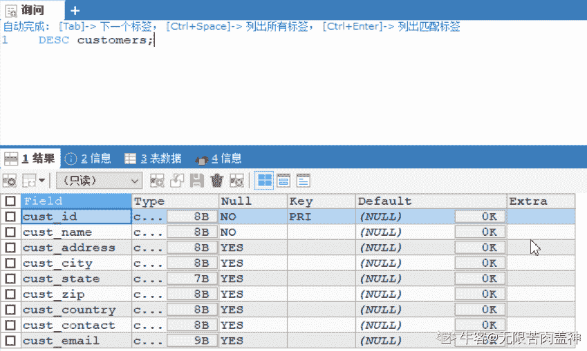
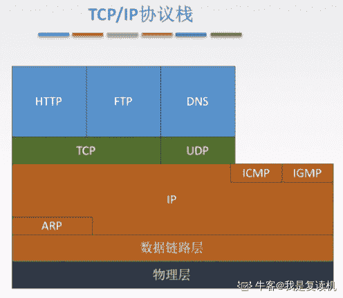
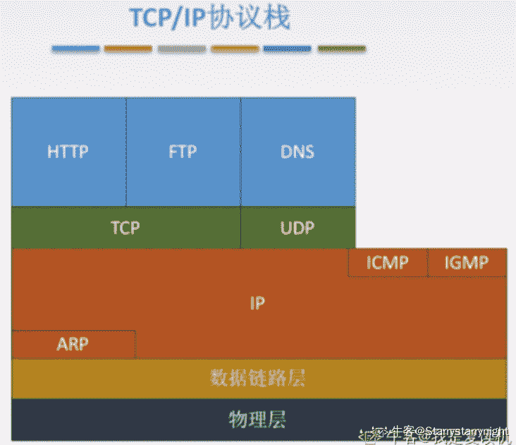

# 快手 2020 校园招聘秋招笔试--工程 C 试卷

## 1

关于 java 的异常处理机制，以下说法正确的是:

正确答案: A   你的答案: 空 (错误)

```cpp
当某个线程抛出 OutOfMemoryError 时，其他线程有可能不受影响
```

```cpp
当大量抛出 RuntimeException 时，不会影响系统的吞吐量
```

```cpp
java.lang.Exception 是 java.lang.Error 的父类
```

```cpp
finally 块代码一定会被执行
```

本题知识点

Java 工程师 C++工程师 快手 2020

讨论

[i 止于至善](https://www.nowcoder.com/profile/749096385)

try 块中如果有 System.exit(0);代码就会不执行 finally 块代码

发表于 2020-03-18 15:00:12

* * *

[清雪冰橙](https://www.nowcoder.com/profile/514769)

执行完 try..catch 之后，一定会执行 finally 里的代码.. 除了个别情况不会执行 finally, 如下:

*   情况一: try-catch 异常退出

    ```cpp
    try{
      ...
      System.exit(1);
    }finally{
      打印("finally");
    }
    ```

*   情况二: 无限循环

    ```cpp
    try{
      while(true);
    }finally{}
    ```

*   情况三: 线程被杀死
    执行 try,finally 的线程被杀死时，finally 也无法执行.

发表于 2020-04-20 19:22:24

* * *

[zhuyoubin](https://www.nowcoder.com/profile/8063197)

finally 中第一行代码出现异常，则不会执行之后的代码

发表于 2020-03-13 20:13:59

* * *

## 2

函数 a 定义如下: int a(int tab){   int n=tab-1;   n |= n >> 1;   n |= n >> 2;   n |= n >> 4;   n |= n >> 8;   n |= n >> 16;   return n;} 调用函数 a(666)返回的结果是:

正确答案: C   你的答案: 空 (错误)

```cpp
666
```

```cpp
512
```

```cpp
1023
```

```cpp
511
```

本题知识点

Java 工程师 C++工程师 快手 2020

讨论

[^O²⁰¹⁸⁰⁹¹¹²⁰⁰⁹²⁶](https://www.nowcoder.com/profile/740713568)

因为是或，所以只会比原来的数大，果断选 1023

发表于 2020-03-18 16:13:08

* * *

[CrownP](https://www.nowcoder.com/profile/647149673)

665 的二进制数为：1010001111512 256 128 64 32 16 8 4 2 1
   1   0      1    0   0   0  1 1 1 1 或运算 |  ：只有同 0 才为 0 拿 n |  (n>>1) 做例子，n>>1 位变成了 0101000111，与 1010001111 相或得到 1111001111 当 n | (n>>2) 时，结果就已经变成了 1111111111，所以为 1023                                       

发表于 2020-03-17 17:06:17

* * *

[AT_Field](https://www.nowcoder.com/profile/816500695)

学 Java 的建议看一下 HashMap 的源码，其中找到大于等于当前值的 2 的 n 次幂就是用的这个方法。

发表于 2020-03-21 22:29:22

* * *

## 3

关于 mysql，下面说法不正确的是:

正确答案: C   你的答案: 空 (错误)

```cpp
mysql 中的“utf8”类型最大只支持 3 个 bytes
```

```cpp
desc 关键字可以作为 table 的字段名
```

```cpp
filesort 是通过读取磁盘文件进行排序，会极大降低查询性能
```

```cpp
smallint 占用 2 个 bytes 的存储空间
```

本题知识点

Java 工程师 C++工程师 快手 2020

讨论

[Empirefree](https://www.nowcoder.com/profile/2048299)

 filesort 并不是磁盘文件进行排序，只是进行了一个排序操作，但是查询次数过多确实会对性能造成影响

发表于 2020-03-15 09:14:36

* * *

[尤明明](https://www.nowcoder.com/profile/618737491)

utf8 不是真正的 utf-8,utf8mb4 才是真正的 utf-8

utf-8 每个字符最多支持四个字节，而 utf8 每个字符最多支持 3 个字节

发表于 2020-03-16 21:16:58

* * *

[无限苦肉盖神](https://www.nowcoder.com/profile/152165957)

我试过了，哪怕是关键字，也是可以作为列名的。之所以可以这样，我觉得人家可以根据 desc 在 sql 语句中的位置来判断它是列名还是关键字

发表于 2020-03-25 16:35:45

* * *

## 4

在几进制下，123*234=28560 是成立的？

正确答案: C   你的答案: 空 (错误)

```cpp
6
```

```cpp
10
```

```cpp
12
```

```cpp
14
```

本题知识点

Java 工程师 C++工程师 快手 2020

讨论

[牛客 144012262 号](https://www.nowcoder.com/profile/144012262)

先按照十进制，3*4=28782，个位为 2。但是实际个位为 0，那么肯定是进位了。而四个答案中只有六进制和十二进制有可能。接下来与十进制的结果相比，28560 小于 28782，那么此进制只能是大于“十”的进制，即十二进制。

编辑于 2020-04-04 23:09:42

* * *

[小呆江](https://www.nowcoder.com/profile/35667236)

3*4=12

发表于 2020-03-13 22:22:35

* * *

[我与风来](https://www.nowcoder.com/profile/38456892)

28560 最后一位为 0，想想十进制最后一位为 0 的情况，可以是 2 * 5 进位余 0，所以，这道题 3 * 4 = 12 ，果断进位，然后余 0；

发表于 2020-03-27 13:34:01

* * *

## 5

查找表结构用以下哪一项( )

正确答案: D   你的答案: 空 (错误)

```cpp
FIND
```

```cpp
SELETE
```

```cpp
ALTER
```

```cpp
DESC
```

本题知识点

Java 工程师 C++工程师 快手 2020

讨论

[Zz__](https://www.nowcoder.com/profile/977951492)

```cpp
desc tabl_name;
```

显示表结构，字段类型，主键，是否为空等属性，但不显示外键。

发表于 2020-03-24 11:06:51

* * *

[牛客 268870485 号](https://www.nowcoder.com/profile/268870485)

DESC 是啥东西啊？

发表于 2020-03-18 17:06:54

* * *

[无限苦肉盖神](https://www.nowcoder.com/profile/152165957)



发表于 2020-03-25 16:39:48

* * *

## 6

如何强制垃圾回收器立即回收一个对象？

正确答案: D   你的答案: 空 (错误)

```cpp
调用 System.gc()方法
```

```cpp
调用 Runtime.gc()方法
```

```cpp
将对象赋值 null
```

```cpp
无法强制垃圾回收器立即执行
```

本题知识点

Java 工程师 C++工程师 快手 2020

讨论

[牛客 279500088 号](https://www.nowcoder.com/profile/279500088)

system.gc 可以提醒垃圾回收执行，不能强制

发表于 2020-03-17 23:19:51

* * *

[牛客 688192107 号](https://www.nowcoder.com/profile/688192107)

A 是 B 的简写

发表于 2020-04-21 20:35:03

* * *

[人微言轻少说话](https://www.nowcoder.com/profile/484435937)

没有方法可以强行回收垃圾，只能提高优先级

发表于 2020-08-17 13:51:52

* * *

## 7

关于 sleep()和 wait()，以下描述错误的一项是（ ）

正确答案: D   你的答案: 空 (错误)

```cpp
sleep 是线程类（Thread）的方法，wait 是 Object 类的方法；
```

```cpp
sleep 不释放对象锁，wait 放弃对象锁；
```

```cpp
sleep 暂停线程、但监控状态仍然保持，结束后会自动恢复；
```

```cpp
wait 后进入等待锁定池，只有针对此对象发出 notify 方法后获得对象锁进入运行状态。
```

本题知识点

Java 工程师 C++工程师 快手 2020

讨论

[bugkiller_czs](https://www.nowcoder.com/profile/5054270)

```cpp

```
wait 后进入等待锁定池，只有针对此对象发出 notify 方法后获得对象锁进入就绪状态。
```cpp

```

发表于 2020-03-14 11:19:22

* * *

[小李今天刷题了吗👀](https://www.nowcoder.com/profile/104246017)

如果线程调用了对象的 wait()方法，那么线程便会处于该对象的等待池中，等待池中的线程不会去竞争该对象的锁。 当有线程调用了对象的 notifyAll()方法（唤醒所有 wait 线程）或 notify()方法（只随机唤醒一个 wait 线程），被唤醒的的线程便会进入该对象的锁池中，锁池中的线程会去竞争该对象锁。 优先级高的线程竞争到对象锁的概率大，假若某线程没有竞争到该对象锁，它还会留在锁池中，唯有线程再次调用 wait()方法，它才会重新回到等待池中。而竞争到对象锁的线程则继续往下执行，直到执行完了 synchronized 代码块，它会释放掉该对象锁，这时锁池中的线程会继续竞争该对象锁。

发表于 2020-03-19 23:30:40

* * *

[明小天](https://www.nowcoder.com/profile/541333097)

wait 后的线程进入到等待队列中，针对此对象发出 notify 方法或者 notifyall 方***使该线程进入到该对象的同步队列中，在同步队列中的线程通过竞争获得对象的锁之后进入运行状态。

发表于 2020-03-30 09:56:41

* * *

## 8

下列协议中，将 MAC 地址转为 IP 地址的协议是

正确答案: B   你的答案: 空 (错误)

```cpp
ARP
```

```cpp
RARP
```

```cpp
ARQ
```

```cpp
ICMP
```

本题知识点

Java 工程师 C++工程师 快手 2020

讨论

[我是复读机](https://www.nowcoder.com/profile/162099353)

ARP（Address Resolution Protocol）地址解析协议，是根据 IP 地址获取物理地址的一个 TCP/IP 协议；RARP（Reverse Address Resolution Protocol）反向地址转换协议 

发表于 2020-03-16 23:57:54

* * *

[Empirefree](https://www.nowcoder.com/profile/2048299)

ARP：IP 到 MAC      RARP：MAC 到 IP  

发表于 2020-03-15 09:21:51

* * *

## 9

从通信协议的角度来看，路由器是在哪个层次上实现网络互连的？

正确答案: C   你的答案: 空 (错误)

```cpp
物理层
```

```cpp
链路层
```

```cpp
网络层
```

```cpp
传输层
```

本题知识点

Java 工程师 C++工程师 快手 2020

讨论

[Empirefree](https://www.nowcoder.com/profile/2048299)

集线器：物理层交换机：数据链路层路由器：网络层

发表于 2020-03-15 09:23:08

* * *

## 10

在 TCP/IP 体系结构中，直接为 ICMP 提供服务的协议是 ___。

正确答案: B   你的答案: 空 (错误)

```cpp
PPP
```

```cpp
IP
```

```cpp
UDP
```

```cpp
TCP
```

本题知识点

Java 工程师 C++工程师 快手 2020

讨论

[我是复读机](https://www.nowcoder.com/profile/162099353)



发表于 2020-03-21 19:23:57

* * *

[牛客 591778969 号](https://www.nowcoder.com/profile/591778969)

ICMP：控制报文协议，用于在 IP 主机和路由之间传递控制信息

发表于 2020-03-20 10:16:40

* * *

[Starrystarrynight](https://www.nowcoder.com/profile/646482967)

ICMP 协议主要用来检测网络通信故障和实现链路追踪，最典型的应用就是 PING 和 tracerooute。

发表于 2020-04-20 11:06:59

* * *

## 11

下列关于进程和线程的叙述中，正确的是 ______。

正确答案: A   你的答案: 空 (错误)

```cpp
不管系统是否支持线程，进程都是资源分配的基本单位
```

```cpp
线程是资源分配的基本单位，进程是调度的基本单位
```

```cpp
系统级线程和用户级线程的切换都需要内核的支持
```

```cpp
同一进程中的各个线程拥有各自不同的地址空间
```

本题知识点

Java 工程师 C++工程师 快手 2020

讨论

[bugkiller_czs](https://www.nowcoder.com/profile/5054270)

进程是系统分配资源的最小单位，使用独立的内存空间线程是程序执行的最小单位，共享进程的内存空间

```cpp
不管系统是否支持线程，进程都是资源分配的基本单位
```

发表于 2020-03-14 11:23:17

* * *

[小李今天刷题了吗👀](https://www.nowcoder.com/profile/104246017)

进程是资源分配的最小单位，线程是 CPU 调度的最小单位。进程切换需要内核转换，线程不需要。 同一进程内线程共享的环境包括：进程代码段、进程的公有数据(利用这些共享的数据，线程很容易的实现相互之间的通讯)、进程打开的文件描述符、信号的处理器、进程的当前目录和进程用户 ID 与进程组 ID。 进程拥有这许多共性的同时，还拥有自己的个性。有了这些个性，线程才能实现并发性。这些个性包括： 1.线程 ID 每个线程都有自己的线程 ID，这个 ID 在本进程中是唯一的。进程用此来标 识线程。 2.寄存器组的值 由于线程间是并发运行的，每个线程有自己不同的运行线索，当从一个线 程切换到另一个线程上时，必须将原有的线程的寄存器集合的状态保存，以便 将来该线程在被重新切换到时能得以恢复。 3.线程的堆栈 堆栈是保证线程独立运行所必须的。 线程函数可以调用函数，而被调用函数中又是可以层层嵌套的，所以线程 必须拥有自己的函数堆栈，使得函数调用可以正常执行，不受其他线程的影 响。 4.错误返回码 由于同一个进程中有很多个线程在同时运行，可能某个线程进行系统调用 后设置了 errno 值，而在该线程还没有处理这个错误，另外一个线程就在此时 被调度器投入运行，这样错误值就有可能被修改。 所以，不同的线程应该拥有自己的错误返回码变量。 5.线程的信号屏蔽码 由于每个线程所感兴趣的信号不同，所以线程的信号屏蔽码应该由线程自 己管理。但所有的线程都共享同样的信号处理器。 6.线程的优先级 由于线程需要像进程那样能够被调度，那么就必须要有可供调度使用的参 数，这个参数就是线程的优先级。 涉及多线程程序涉及的时候经常会出现一些令人难以思议的事情，用堆和栈分配一个变量可能在以后的执行中产生意想不到的结果，而这个结果的表现就是内存的非法被访问，导致内存的内容被更改。 　　理解这个现象的两个基本概念是：在一个进程的线程共享堆区，而进程中的线程各自维持自己堆栈。

编辑于 2020-03-19 23:39:14

* * *

[RedPage](https://www.nowcoder.com/profile/210457275)

C：用户级线程是指不需要内核支持而在用户程序中实现的线程，它的内核的切换是由用户态程序自己控制内核的切换，不需要内核的干涉。但是它不能像内核级线程一样更好的运用多核 CPU。D：一个进程中的所有线程共享该进程的地址空间，但它们有各自独立的（/私有的）栈(stack)。堆(heap)的分配与栈有所不同，一般是一个进程有一个 C 运行时堆，这个堆为本进程中所有线程共享。

发表于 2020-03-22 12:08:12

* * *

## 12

若某单处理器多进程系统中有多个就绪态进程，则下列关于处理机调度的叙述中，错误的是 _____。

正确答案: C   你的答案: 空 (错误)

```cpp
在进程结束时能进行处理机调度
```

```cpp
创建新进程后能进行处理机调度
```

```cpp
在进程处于临界区时不能进行处理机调度
```

```cpp
在系统调用完成并返回用户态时能进行处理机调
```

本题知识点

Java 工程师 C++工程师 快手 2020

讨论

[Empirefree](https://www.nowcoder.com/profile/2048299)

和王道 408 上面一题弄混了，王道上面有一题是创立新进程后不能立刻进行调度，因为还有就绪进程在等待（大致是这么个意思），但是上面还一题就是这个：只要不破坏临界资源就可进行调度

发表于 2020-03-15 09:29:48

* * *

[softwareGxy](https://www.nowcoder.com/profile/560840485)

进程处于临界区时只要不破坏临界资源就可以进行处理机调度

发表于 2020-03-26 10:55:08

* * *

[牛客 215826543 号](https://www.nowcoder.com/profile/215826543)

个人想法：处理机调度分高级调度，中级调度和低级调度。进程处于临界区不能进行低级调度（把进程从就绪态变为执行态，俗话说就是用 cpu），但是可以进行高级调度，把外存的作业调入内存变为就绪态。
 发表于 2021-05-28 21:38:30

* * *

## 13

关于 TCP 协议的描述，以下错误的是？

正确答案: B   你的答案: 空 (错误)

```cpp
面向连接
```

```cpp
可提供多播服务
```

```cpp
可靠交付
```

```cpp
报文头部长，传输开销大
```

本题知识点

Java 工程师 C++工程师 快手 2020

讨论

[softwareGxy](https://www.nowcoder.com/profile/560840485)

**小结 TCP 与 UDP 的区别：**
1.基于连接与无连接；
2.对系统资源的要求（TCP 较多，UDP 少）；
3.UDP 程序结构较简单；
4.流模式与数据报模式 ；
5.TCP 保证数据正确性，UDP 可能丢包，TCP 保证数据顺序，UDP 不保证。

发表于 2020-03-26 11:05:46

* * *

[小李今天刷题了吗👀](https://www.nowcoder.com/profile/104246017)

排除法

发表于 2020-03-19 23:39:56

* * *

[J.Tu](https://www.nowcoder.com/profile/761923435)

广播和多播仅应用于 UDP？

发表于 2020-03-31 15:59:10

* * *

## 14

元素 a，b，c，d，e 依次进入初始为空的栈中，若元素进栈后可停留、可出栈，直到所有元素都出栈，则在所有可能的出栈序列中，以元素 d 开头的序列个数是

正确答案: B   你的答案: 空 (错误)

```cpp
3
```

```cpp
4
```

```cpp
5
```

```cpp
6
```

本题知识点

Java 工程师 C++工程师 快手 2020

讨论

[zjuiuczy](https://www.nowcoder.com/profile/886786664)

_c_b_a_，四个 _ 处插入 e

发表于 2020-03-22 07:04:47

* * *

[明小天](https://www.nowcoder.com/profile/541333097)

考虑到题目要求是 d 先出栈，所以 abcd 的入栈顺序已经确定，e 的入栈和出栈决定有几种顺序。1.abcd 依次入栈，d 出栈，e 入栈，然后剩下的出栈顺序为 ecba2.abcd 依次入栈，d 出栈，c 出栈，e 入栈，e 出栈，剩下的出栈顺序 ba3.abcd 依次入栈，d 出栈，c 出栈，b 出栈，e 入栈，e 出栈，a 出栈 4.abcd 依次入栈，d 出栈，c 出栈，b 出栈，a 出栈，e 入栈，e 出栈，a 出栈 

发表于 2020-03-30 10:13:18

* * *

[bugkiller_czs](https://www.nowcoder.com/profile/5054270)

栈：后进先出 d e c b ad c e b ad c b e ad c b a e

发表于 2020-03-14 11:24:49

* * *

## 15

有关 C++程序运行时的函数地址，下列说法正确的是

正确答案: C   你的答案: 空 (错误)

```cpp
每个函数的地址都是固定的，同一个程序重复运行多次，每次函数地址都一样
```

```cpp
每个函数的地址是不固定的，但在操作系统版本、硬件版本不变的情况下是固定的，同一个程序重复在相同软硬件环境下运行多次，每次函数地址都一样
```

```cpp
地址是否固定要看系统配置和编译选项，如果开启了地址随机化，那地址是每次都变的，如果没开启，那么地址每次都一样。
```

```cpp
每个函数的地址都是不定的，同一个程序重复运行多次，每次地址都不同
```

本题知识点

Java 工程师 C++工程师 快手 2020

讨论

[牛客 813391565 号](https://www.nowcoder.com/profile/813391565)

数据区（全局变量、常量、静态变量），代码区每次运行时在内存中地址由链接选项决定，如果开启随机基址。如果选择固定基址，则每次运行时函数地址固定。但是堆和栈会不一样。

随机基址可以提高程序安全性，保护关键代码数据地址，提高黑客入侵难度。

发表于 2020-04-12 18:34:11

* * *

## 16

下列有关于关键字“堆”的描述中，错误的是

正确答案: D   你的答案: 空 (错误)

```cpp
堆是优先级队列的底层实现形式，有 N 个元素的优先级队列进行一次结构调整的时间复杂度为 logN
```

```cpp
堆内存是一种动态分配的内存，其实际占用内存空间的大小随着程序的运行可以动态调整
```

```cpp
堆是一种线性数据结构，其特点是先进后出
```

```cpp
在 C 语言中，堆内存是线程隔离的，不同线程访问的是各自的堆空间，无法互相访问
```

本题知识点

Java 工程师 C++工程师 快手 2020

讨论

[ac23](https://www.nowcoder.com/profile/735495065)

C 选项中“堆栈”这个词用得很不好，到底是堆还是栈让人混淆，这里我就认为是堆，堆底层用二叉树实现，不是线性结构的

发表于 2020-03-22 14:39:27

* * *

[小李今天刷题了吗👀](https://www.nowcoder.com/profile/104246017)

线程之间可以访问啊，要不然怎么会有线程之间通信方式。

发表于 2020-03-19 23:41:45

* * *

[达尔文的猹](https://www.nowcoder.com/profile/58908799)

我竟然以为说的是二叉堆

发表于 2020-03-14 08:42:38

* * *

## 17

关于 TCP 协议状态描述正确的是

正确答案: A   你的答案: 空 (错误)

```cpp
只有执行主动关闭端才会出现 TIME_WAIT
```

```cpp
当接受到 FIN 报文时，会进入 CLOSING 状态
```

```cpp
数据传输完成后发送 FIN 报文后进入 TIME_WAIT 状态
```

```cpp
client 和 server 端最终都会经历 TIME_WAIT 状态
```

本题知识点

Java 工程师 C++工程师 快手 2020

讨论

[bugkiller_czs](https://www.nowcoder.com/profile/5054270)

四次挥手 client 发送 FIN 给 server 进入 FIN_Wait1server 接受 client 的 FIN,发送 ACK 给 client 进入 close_wait，client 接收到进入 FIN_wait2server 发送 FIN 给 client 进入 last_ack 状态,client 接收到进入 time_wait 状态 client 发送 ACK 给 server,有 2MSL 的等待时间，保证连接的关闭，client 进入 close 状态，server 接收到进入 close 状态

发表于 2020-03-14 11:31:47

* * *

[softwareGxy](https://www.nowcoder.com/profile/560840485)

**TCP****建立连接要进行 3 次握手,而断开连接要进行 4 次**

1 当主机 A 完成数据传输后,将控制位 FIN 置 1,提出停止 TCP 连接的请求
2  主机 B 收到 FIN 后对其作出响应,确认这一方向上的 TCP 连接将关闭,将 ACK 置 1
3 由 B 端再提出反方向的关闭请求,将 FIN 置 1
4 主机 A 对主机 B 的请求进行确认,将 ACK 置 1,双方向的关闭结束.
由 TCP 的三次握手和四次断开可以看出,TCP 使用面向连接的通信方式,大大提高了数据通信的可靠性,使发送数据端
和接收端在数据正式传输前就有了交互,为数据正式传输打下了可靠的基础
**名词解释** ACK  TCP 报头的控制位之一,对数据进行确认.确认由目的端发出,用它来告诉发送端这个序列号之前的数据段
都收到了.比如,确认号为 X,则表示前 X-1 个数据段都收到了,只有当 ACK=1 时,确认号才有效,当 ACK=0 时,确认号无效,这时会要求重传数据,保证数据的完整性.
SYN  同步序列号,TCP 建立连接时将这个位置 1
FIN  发送端完成发送任务位,当 TCP 完成数据传输需要断开时,提出断开连接的一方将这位置 1

发表于 2020-03-26 11:12:41

* * *

[尘封的蓝忆](https://www.nowcoder.com/profile/579045801)

client 的状态:fin_wait1，fin_wait2，time_wait，close; server 的状态:lock,close

发表于 2020-03-18 09:37:37

* * *

## 18

关于 epoll 和 select 的区别，哪个说法是错误的？

正确答案: D   你的答案: 空 (错误)

```cpp
epoll 和 select 都是 I/O 多路复用的技术，都可以实现同时监听多个 I/O 事件的状态。
```

```cpp
epoll 相比 select 效率更高，主要是基于其操作系统支持的 I/O 事件通知机制，而 select 是基于轮询机制。
```

```cpp
epoll 支持水平触发和边沿触发两种模式。
```

```cpp
select 能并行支持 I/O 比较小，且无法修改。
```

本题知识点

Java 工程师 C++工程师 快手 2020

讨论

[qwertyuoiplh](https://www.nowcoder.com/profile/316397384)

select 默认的句柄数量为 1024，但可通过修改宏定义或编译内核修改句柄数量

发表于 2020-03-19 19:08:45

* * *

[梦河](https://www.nowcoder.com/profile/568925429)

大佬，什么书籍有讲这个？

发表于 2020-09-28 21:14:49

* * *

## 19

给定一个整型数组 L，数组长度为 n，数组元素取值范围[1,n],（n>2000)，请问最快速找出一个缺失值的时间复杂度是多少？

正确答案: B   你的答案: 空 (错误)

```cpp
O(log(n))
```

```cpp
O(n)
```

```cpp
O(n*log(n))
```

```cpp
O(n²)
```

本题知识点

Java 工程师 C++工程师 快手 2020

讨论

[softwareGxy](https://www.nowcoder.com/profile/560840485)

数组并非有序，所以只能通过遍历查找，时间复杂度为 O(n)

发表于 2020-03-26 11:34:55

* * *

[格拉摩根键圣](https://www.nowcoder.com/profile/335405317)

遍历一遍数组求和，然后和完整的不缺数字的期待和相减就能得到缺失的那个数字了，O(n)复杂度

发表于 2020-03-14 19:04:09

* * *

[Empirefree](https://www.nowcoder.com/profile/2048299)

俺以为是要将 N 个元素直接按值存储到数组，这样数组直接就是有序的了，然后就可以二分查找 log(n)，题意理解有误，QAQ

发表于 2020-03-15 09:39:39

* * *

## 20

已知一个线性表（38，25，74，63，52，48），假定采用散列函数 h（key) = key%7 计算散列地址，并散列存储在散列表 A【0....6】中，若采用线性探测方法解决冲突，则在该散列表上进行等概率成功查找的平均查找长度为

正确答案: C   你的答案: 空 (错误)

```cpp
1.5
```

```cpp
1.7
```

```cpp
2.0
```

```cpp
2.3
```

本题知识点

Java 工程师 C++工程师 快手 2020

讨论

[牛客 591778969 号](https://www.nowcoder.com/profile/591778969)

链接：[`www.nowcoder.com/questionTerminal/c7b93c48965c45caa8496da5240b9079?toCommentId=62282`](https://www.nowcoder.com/questionTerminal/c7b93c48965c45caa8496da5240b9079?toCommentId=62282)
来源：牛客网
**平均查找长度=总的查找次数/元素数****总的查找次数：** 38%7=3 （第 1 次出现 3，无冲突，放在位置 3，**查找次数为 1**）25%7=4（第 1 次出现 4，无冲突，放在位置 4，**查找次数为 1**）74%7=4（第 2 次出现 4，有冲突，放在位置 5，**查找次数为 2**）63%7=0（第 1 次出现 0，无冲突，放在位置 0，**查找次数为 1**）52%7=3（第 2 次出现 3，有冲突，发现冲突 3,4,5，故只能放到 6，**查找次数为 4**）48%7=6 （第 1 次出现 6，有冲突，发现冲突 6,0，故只能放到 1，**查找次数为 3**）**1+1+2+1+4+3=12****元素数=6****所以：平均查找长度=12/6=2**

发表于 2020-03-20 11:11:30

* * *

[Empirefree](https://www.nowcoder.com/profile/2048299)

裂开，算都能算错来：1+1+2+1+4+3,，还有一种变态问题就是求查找不成功的平均长度

发表于 2020-03-15 09:46:58

* * *

## 21

小明最近在做病毒自动检测，他发现，在某些 library 的代码段的二进制表示中，如果包含子串并且恰好有 k 个 1，就有可能有潜在的病毒。library 的二进制表示可能很大，并且子串可能很多，人工分析不可能，于是他想写个程序来先算算到底有多少个子串满足条件。如果子串内容相同，但是开始或者结束位置不一样，则被认为是不同的子串。注：子串一定是连续的。例如"010"有 6 个子串，分别是 "0, "1", "0", "01", "10", "010"

本题知识点

Java 工程师 C++工程师 快手 2020

讨论

[pmad](https://www.nowcoder.com/profile/33830038)

动态规划思路，当前状态依赖前 k 个状态并且需维护当前状态为后面服务，需要 k+1 空间，但是需要开辟 k+2 个空间，其中一个空间来消除掉之前状态的值。

```cpp
import java.util.*;
public class Main{
    public static void main(String[] args){
        Scanner scanner=new Scanner(System.in);
        int k=scanner.nextInt();
        scanner.nextLine();
        String s=scanner.nextLine();
        int num=0,len=s.length();
        int[] dp=new int[k+2];
        long result=0;
        dp[0]=1;
        for(char c:s.toCharArray()){
            if(c=='1') num++;
            if(num-k>=0) result+=dp[(num-k)%(k+2)];
            dp[(num+1)%(k+2)]=0;
            dp[num%(k+2)]++;
        }
        System.out.println(result);
    }
}
```

发表于 2020-03-16 02:37:23

* * *

[泽阳 Alex](https://www.nowcoder.com/profile/388543916)

首先来回顾一下题意：

```cpp
这是一个子串满足问题，输入一个由 0，1 字符组成的字符串 str，求满足包含 k 个 1 的连续字串个数。
毫不夸张的说，可能大部分人第一眼就是求出所有子串，再计数所有满足 k 的子串，但仔细一想，问题没有那么简单！

思路就是，采用滑动窗口的方式，从字符串数组左侧依次向右滑动，直至满足 k 个 1，在下一个数不为 1 且数组不越界的情况下窗口向右滑动，同时计数。
核心代码如下：

```

```cpp

```
public class Main {
    public static int NumSubString(int k, String str) {
        char[] chars = str.toCharArray();
        int res = 0;
        int len = chars.length;
        for (int i = 0; i < len; i++) {
            if (chars[i] == '1') {
                res++;
            }
        }
        if (res < k) {
            return 0;
        }
        res = 0;
        for (int i = 0; i < len; i++) {
            /*滑动索引*/
            int index = i;
            int count = 0;
            while (count < k && index < len) {
                if (chars[index] == '1' && ++count == k) {
                    res++;
                    index++;
                    break;
                }
                index++;
            }
            /*满足 k 后继续右滑*/
            while (index < len && chars[index] != '1') {
                res++;
                index++;
            }
        }
        return res;
    }

    public static void main(String[] args) {
        Scanner sc = new Scanner(System.in);
        int k = sc.nextInt();
        sc.nextLine();
        String str = sc.next();
        System.out.println(NumSubString(k,str));
    }
```cpp

```

```cpp 
```

编辑于 2020-04-11 23:12:07

* * *

[奶茶妹夫](https://www.nowcoder.com/profile/6106500)

```cpp
package 快手 2020 校园招聘秋招笔试工程 C 试卷;
import java.lang.*;
import java.util.*;

/**
 * Project: 通过率：100%
 * Author : en_zhao
 * Email  : 
 * Date   : 2020/08/03
 */

public class Main001{
    public static void main(String[] args){

        Scanner sc = new Scanner(System.in);
        int k = sc.nextInt();
        sc.nextLine();
        String str = sc.nextLine();
        //防溢出
        long res = 0;
        long[] sum = new long[str.length() + 1];
        char[] str_arr = str.toCharArray();
        int count = 0;
        //时间：O(n)扫描  空间: O(n)
        //sum[i]表示第(i+1)个 1 左边的 0 的个数
        //最后 记录末尾 0 的个数 数据可能造成空间浪费
        for(int i = 0;i < str.length();i++){
            if(str_arr[i] == '1'){
                count++;
            }else{ //记录第 n 个 1 左边 0 的个数
                sum[count]++;
            }
        }

                //计算 res
        if(k == 0){ // 当 k==0 直接求连续 0 的子串之和
            for(int i = 0; i <= count;i++){
                res += sum[i]*(sum[i]+1)/2;
            }
        }else{ // 当 k!=0 求左右两边的子串组合（+1 是因为空串""）
            for(int i = 0; i + k <= count;i++){
                res += (sum[i]+1) * (sum[i+k] + 1);
            }
        }

        System.out.println(res);

    }
}
```

编辑于 2020-08-03 19:15:33

* * *

## 22

现在你的班级刚刚参加了一个只有单选题的考试。班级一共 n 个学生，考试有 m 个问题。每个题目都有 5 个可选答案（A，B，C，D，E）。并且每个题目只有一个正确答案。每个题目的分数并不一样，第 i 个题目的分数用 a[i]表示。如果题目没答对该题会获得 0 分。考试结束后，每个学生都记得自己的答案，但是他们还不知道正确答案是什么。如果非常乐观的考虑，他们班级最多可能得到多少分呢？

本题知识点

Java 工程师 C++工程师 快手 2020

讨论

[UPMagic](https://www.nowcoder.com/profile/4079837)

max 求解就行了

```cpp
import java.util.*;

public class Main {
    public static void main(String[] arg){
        Scanner in = new Scanner(System.in);
        int n = in.nextInt();
        int m = in.nextInt();
        String[] sl = new String[n];
        for (int i=0;i<n;i++){
            sl[i] = in.next();
        }
        int total = 0;
        for (int i=0;i<m;i++){
            int sc = in.nextInt();
            int max=0;
            int[] d = new int[5];
            for(String s : sl){
                int index = (int)s.charAt(i)-(int)'A';
                d[index]++;
                max = Math.max(max,d[index]);
            }
            total += (max*sc);
        }
        System.out.println(total);
    }
}
```

发表于 2020-08-25 11:23:45

* * *

[Puleya](https://www.nowcoder.com/profile/520290023)

使用 HashMap 求每一个题目答案相同的最大人数

```cpp
import java.util.*;
public class Main{
    public static void main(String[] args){
        Scanner sc=new Scanner(System.in);
        int n=sc.nextInt();
        int m=sc.nextInt();
        sc.nextLine();
        char[][] ans=new char[n][m];
        for(int i=0;i<n;i++){
            String s=sc.nextLine();
            ans[i]=Arrays.copyOf(s.toCharArray(),m);
        }
        int[] score=new int[m];
        for(int i=0;i<m;i++){
            score[i]=sc.nextInt();
        }
        int res=0;
        for(int j=0;j<m;j++){
            int tmp=0;
            HashMap<Integer,Integer> map=new HashMap<>();
            for(int i=0;i<n;i++){
                int key=ans[i][j]-'A';
                if(map.containsKey(key)){
                    int t=map.get(key);
                    map.put(key,t+1);
                    tmp=Math.max(tmp,t+1);
                }else{
                    map.put(key,1);
                    tmp=Math.max(1,tmp);
                }
            }
            res+=tmp*score[j];
        }
        System.out.println(res);
    }
}

```

发表于 2020-04-11 17:13:37

* * *

[泽阳 Alex](https://www.nowcoder.com/profile/388543916)

重点在于求班级同学每道题公共答案最多的选项然后依次乘以 score 里每道题的分值就是最大和了.Java 实现如下：

```cpp
import java.util.*;
public class Main {
    public static int MaxScore(int n, int m, String[] answer, int[] score) {
        int res = 0;
        int index = 0;
        for (int i = 0; i < m; i++) {
            /*每道题有 5 个答案*/
            int[] count = {0, 0, 0, 0, 0};
            int max = 0;
            for (int j = 0; j < n; j++) {
                if (answer[j].charAt(i) == 'A') {
                    max = max > ++count[0] ? max : count[0];
                } else if (answer[j].charAt(i) == 'B') {
                    max = max > ++count[1] ? max : count[1];
                } else if (answer[j].charAt(i) == 'C') {
                    max = max > ++count[2] ? max : count[2];
                } else if (answer[j].charAt(i) == 'D') {
                    max = max > ++count[3] ? max : count[3];
                } else if (answer[j].charAt(i) == 'E') {
                    max = max > ++count[4] ? max : count[4];
                }
            }
            res += max * score[index++];
        }
        return res;
    }

    public static void main(String[] args) {
        Scanner sc = new Scanner(System.in);

        int n = sc.nextInt();
        int m = sc.nextInt();
        String[] str = new String[n];
        int[] score = new int[m];

        for (int i = 0; i < n; i++) {
            str[i] = sc.next();
        }
        for (int i = 0; i < m; i++) {
            score[i] = sc.nextInt();

        }
        System.out.println(MaxScore(n, m, str, score));
    }
}

```

发表于 2020-04-08 16:14:24

* * *

## 23

给定一组石头，每个石头有一个正数的重量。每一轮开始的时候，选择两个石头一起碰撞，假定两个石头的重量为 x，y，x<=y,碰撞结果为
1\. 如果 x==y，碰撞结果为两个石头消失
2\. 如果 x != y，碰撞结果两个石头消失，生成一个新的石头，新石头重量为 y-x

最终最多剩下一个石头为结束。求解最小的剩余石头质量的可能性是多少。

本题知识点

Java 工程师 C++工程师 快手 2020

讨论

[pmad](https://www.nowcoder.com/profile/33830038)

简单说下思路，利用 0-1 背包方法求出能将石头合并成 2 堆的情况，dp[j]代表是否能将石头分成其中一堆为 j，另一堆为(sum-j)，其中一堆的最小值肯定不超过总和的一半，最后最接近的两堆即为最小值

```cpp
import java.util.*;
public class Main{
    public static void main(String[] args){
        Scanner scanner=new Scanner(System.in);
        int n=scanner.nextInt(),sum=0,result=0;
        int[] nums=new int[n+1];
        for(int i=1;i<=n;i++) {
            nums[i]=scanner.nextInt();
            sum+=nums[i];
        }
        boolean[] dp=new boolean[sum/2+1];
        dp[0]=true;
        for(int i=1;i<=n;i++)
            for(int j=sum/2;j>=nums[i];j--)
                dp[j]|=dp[j-nums[i]];

        for(int j=sum/2;j>=0;j--)
            if(dp[j]) {
               result=Math.abs(j-(sum-j));
               break;
            }
        System.out.println(result);
    }
}
```

编辑于 2020-03-16 11:23:34

* * *

[快手校招实习社招内推](https://www.nowcoder.com/profile/624054897)

转换为 0-1 背包问题

```cpp
#include <iostream>
(720)#include <vector>
#include <algorithm>
using namespace std;

class Solution
{
    public:
        int test(int n, vector<int> weights)
        {
            int sum = 0;
            for (int weight:weights)
            {
                sum+=weight;
            }
            int maxCapcity = sum/2;
            vector<int> dp(maxCapcity+1,0);
            for (int i=0;i<n;i++)
            {
                for (int j=maxCapcity;j>=weights[i];j--)
                {
                    dp[j] = max(dp[j],dp[j-weights[i]]+weights[i]);
                }
            }
            return sum - 2*dp[maxCapcity];
        }
};

int main()
{
    int n;
    cin >> n;
    vector<int> weights(n);
    for (int i=0;i<n;i++)
    {
        cin >> weights[i];
    }
    int res = Solution().test(n,weights);
    cout << res;
    return 0;
}
```

发表于 2020-03-21 18:02:59

* * *

[远征的梦想](https://www.nowcoder.com/profile/216070581)

```cpp
import java.util.Scanner;

public class Main {

    public static void main(String[] args) {
        Scanner sc = new Scanner(System.in);

        int rockNum = Integer.parseInt(sc.nextLine());
        int[] rockWeights = new int[rockNum];
        String[] strs = sc.nextLine().split(" ");
        int sumWeight = 0;
        for (int i = 0; i < rockNum; i++) {
            rockWeights[i] = Integer.parseInt(strs[i]);
            sumWeight += rockWeights[i];
        }

        int[] dp = new int[(sumWeight / 2) + 1];
        for (int rockWeight : rockWeights) {
            for (int i = sumWeight / 2; i >= rockWeight; i--) {
                dp[i] = Math.max(dp[i], dp[i - rockWeight] + rockWeight);
            }
        }
        System.out.println(sumWeight - 2 * dp[sumWeight / 2]);
    }

}

```

发表于 2020-04-11 16:15:47

* * *

## 24

在你面前有 n 个蓄水池，他们组成了树形结构（由 n-1 条边连接）。蓄水池节点编号从 1 开始到 n。对每个蓄水池节点来说，他的儿子蓄水池节点都摆放在他的下面，并且和它用水管相连，根据重力，水会向下流动。现在我们要在蓄水池上做一些操作：1\. 把节点 v 填满水。然后 v 的所有儿子节点水也会被填满 2\. 清空节点 v 的水。然后 v 所有的父亲节点水都会被清空 3\. 询问每个蓄水池节点是否有水。初始状态时候，每个节点都是空的。现在我们会依次进行一系列操作，我们想提前知道每次操作后的结果，你能帮忙解决吗？

本题知识点

Java 工程师 C++工程师 快手 2020

讨论

[QK 康哥在此](https://www.nowcoder.com/profile/381986293)

```cpp
#include<iostream>
(720)#include<vector>
#include<map>
using namespace std;
void dfs(map<int,vector<int>> mp,vector<int> &v,int k,int m)
{
    int index;v[k]=m;
    for(int i=0;i<mp[k].size();i++)
        {
            index=mp[k][i];
            v[index]=m;
            dfs(mp,v,index,m);
        }
}
int main()
{
    int n;cin>>n;map<int,vector<int>> mp1,mp2;
    vector<int> v(n+1,0);
    vector<int> res;
    int a,b;
    while(n>1)
        {
            cin>>a>>b;
            if(a>b)
                swap(a,b);
            mp1[a].push_back(b);
            mp2[b].push_back(a);
            n--;
        }
    int num;cin>>num;
    while(num--)
    {
        cin>>a>>b;
        if(a==1)
            dfs(mp1,v,b,1);
        else if(a==2)
            dfs(mp2,v,b,0);
        else{
            res.push_back(v[b]);
        }
    }
    for(int i=0;i<res.size();i++)
        cout<<res[i]<<endl;
    system("pause");
    return 0;
}
```

map<int ,vector>  mp1,mp2;分别是某个蓄水池的子节点和父节点的链表，然后一个简单的 dfs 即可。此题的难点我觉得是输入，特么的 按照用例是默认 数字小的是数字大的 父节点。题目上又没有说清楚。

发表于 2020-03-18 17:58:54

* * *

[pmad](https://www.nowcoder.com/profile/33830038)

思路：先创建 HashSet 数组建图，创建 full 数组表示当前节点是否有水，在根据条件进行充水或者清水

```cpp
import java.util.*;
public class Main{
    static HashSet<Integer>[] adj;
    static boolean[] full;
    public static void main(String[] args){
        Scanner scanner=new Scanner(System.in);
        int n=scanner.nextInt();
        adj=new HashSet[n+1];
        full=new boolean[n+1];
        for(int i=0;i<=n;i++) adj[i]=new HashSet<>();
        for(int i=0;i<n-1;i++){
            int a=scanner.nextInt(),b=scanner.nextInt();
            adj[a].add(b);
            adj[b].add(a);
        }
        int q=scanner.nextInt();
        while(q-->0){
            int method=scanner.nextInt(),v=scanner.nextInt();
            switch(method){
                case 1:
                    flood(v);
                    break;
                case 2:
                    clear(v);
                    break;
                case 3:
                    System.out.println(full[v]==true?1:0);
                    break;
            }
        }
    }

    public static void flood(int v){
        full[v]=true;
        for(int w:adj[v]) if(w>v) flood(w);
    }

    public static void clear(int v){
        full[v]=false;
        for(int w:adj[v]) if(w<v) clear(w);
    }
}
```

发表于 2020-03-16 12:03:15

* * *

[奶茶妹夫](https://www.nowcoder.com/profile/6106500)

```cpp
import java.util.*;

class node{
    boolean water = false;
    List<Integer> list_son;
    List<Integer> list_parent;

    node(){
        list_son = new ArrayList<>();
        list_parent = new ArrayList<>();
    }
}

public class Main {

    static HashMap<Integer , node> hashMap = new HashMap<>();

    public static void main(String[] args) {
        Scanner sc = new Scanner(System.in);
        int n = sc.nextInt();
        sc.nextLine();
        int[] a = new int[n];
        int[] b = new int[n];
        for(int i = 0;i < n - 1; i ++){
            a[i] = sc.nextInt();
            b[i] = sc.nextInt();
            sc.nextLine();
        }
        int q = sc.nextInt();
        sc.nextLine();
        int[] c = new int[q];
        int[] v = new int[q];
        for(int i = 0;i < q;i++){
            c[i] = sc.nextInt();
            v[i] = sc.nextInt();
            sc.nextLine();
        }

        //构建树形关系
        //初始化
        for(int i = 1;i <= n;i++){
            hashMap.put(i,new node());
        }
        //构建树形关系 小操作数是大操作数的父亲
        for(int i = 0;i < n-1;i++){
            int max = Math.max(a[i],b[i]);
            int min = Math.min(a[i],b[i]);
            hashMap.get(min).list_son.add(max);
            hashMap.get(max).list_parent.add(min);
        }
        //模拟操作
        for(int i = 0; i< q;i++){
            if(c[i] == 1){ //填满
                q_true(v[i]);
            }else if(c[i] == 2){//清空
                q_false(v[i]);
            }else{//输出
                System.out.println(hashMap.get(v[i]).water?1:0);
            }
        }

    }

    public static void q_true(int nodeId){
        //设置
        hashMap.get(nodeId).water = true;
        //递归
        if(hashMap.get(nodeId).list_son.size() == 0){
            return;
        }else{
            for(Integer son_id:hashMap.get(nodeId).list_son){
                q_true(son_id);
            }
        }
    }

    public static void q_false(int nodeId){
        //设置
        hashMap.get(nodeId).water = false;
        //递归
        if(hashMap.get(nodeId).list_parent.size() == 0){
            return;
        }else{
            for(Integer parent_id:hashMap.get(nodeId).list_parent){
                q_false(parent_id);
            }
        }
    }
}
```

编辑于 2020-08-03 21:16:31

* * *