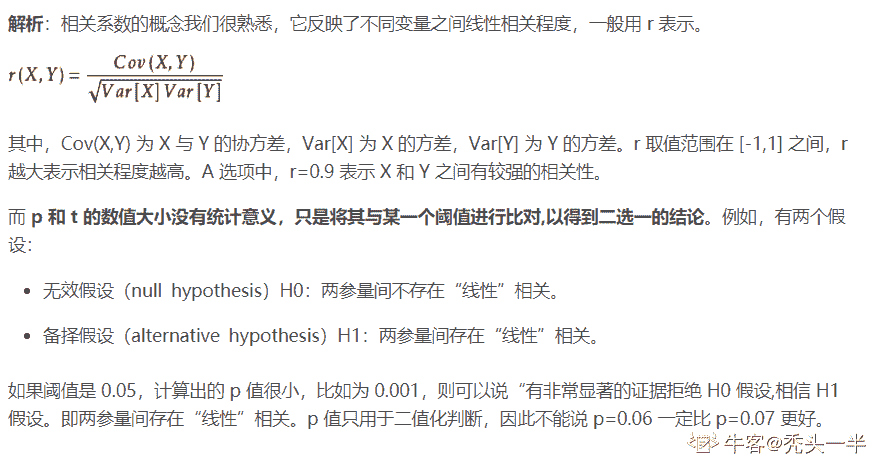

# 快手 2020 校园招聘秋招笔试--算法 A 试卷

## 1

梯度下降算法正确的步骤是什么？1\. 计算预测值与真实值之间的误差 2\. 迭代更新，直到找到最优权重 3\. 把输入传入网络，得到输出值 4\. 初始化随机权重和偏差 5\. 对每一个产生误差的神经元，改变相应的值以减小误差

正确答案: D   你的答案: 空 (错误)

```cpp
1，2，3，4，5
```

```cpp
5，4，3，2，1
```

```cpp
3，2，1，5，4
```

```cpp
4，3，1，5，2
```

本题知识点

算法工程师 快手 2020

## 2

小于 1000 并且不能被 3、5 整除的正整数个数为？

正确答案: A   你的答案: 空 (错误)

```cpp
533
```

```cpp
467
```

```cpp
600
```

```cpp
500
```

本题知识点

算法工程师 快手 2020

讨论

[等你下课呀](https://www.nowcoder.com/profile/528373597)

能被 3 整除的共有 333 个，能被 5 整除的共有 199 个，二者有交叉，即能同时被 3 和 5 整除的共有 66 个。所以能被 3 整除或能被 5 整除的共有 333+199-66=466 个，则答案为 999-466=533 个。

发表于 2020-03-20 10:34:46

* * *

[Dancer_Wu](https://www.nowcoder.com/profile/439771817)

以前做过类似的一道题，大体思路：能被 3，5 整除，3，5 的最小公倍数 15 ；1-15 中有 7 个满足条件；16-30 同样有 7 个,31-45.........;999/15=66......9;66*7+4=466;999-466=533;

发表于 2020-03-30 23:26:06

* * *

[FantDing_nk](https://www.nowcoder.com/profile/848375)

计算出答案之后要用 999 去减

发表于 2020-03-20 17:40:58

* * *

## 3

一个袋子里放着 5 个红球，6 个白球，现在随机从袋子里取两个球，取完之后发现这两个球的颜色相同，问这两个球是红色的概率是多少？

正确答案: B   你的答案: 空 (错误)

```cpp
18.2
```

```cpp
40
```

```cpp
43
```

```cpp
45.5
```

本题知识点

算法工程师 快手 2020

讨论

[FantDing_nk](https://www.nowcoder.com/profile/848375)


发表于 2020-03-20 17:40:07

* * *

[海康威视校招内推](https://www.nowcoder.com/profile/303088069)

选项少写了%

发表于 2020-03-28 10:36:51

* * *

[Itachi1007](https://www.nowcoder.com/profile/49966860)

红色 5C2=10，白色 6C2=15，所以概率为 10/（10+15）为 40%

发表于 2020-03-15 14:42:46

* * *

## 4

已知 char str[20]=“0123456789” ， 则 strlen(str) 和 sizeof(str)的结果是？

正确答案: A   你的答案: 空 (错误)

```cpp
10，20
```

```cpp
20，10
```

```cpp
11，20
```

```cpp
20，11
```

本题知识点

算法工程师 快手 2020

讨论

[牛客 Cver](https://www.nowcoder.com/profile/1897620)

int a=strlen(str); //a=10; >>>> strlen 计算字符串的长度，以结束符 0x00 为字符串结束。 int b=sizeof(str); //而 b=20; >>>> sizeof 计算的则是分配的数组 str[20] 所占的内存空间的大小，不受里面存储的内容改变。

发表于 2020-03-14 11:06:28

* * *

## 5

在 Logistic Regression 中，如果同时加入 L1 和 L2 范数，下列描述错误的是

正确答案: D   你的答案: 空 (错误)

```cpp
可以做特征选择,并在一定程度上防止过拟合
```

```cpp
能解决维度灾难问题
```

```cpp
能加快计算速度
```

```cpp
可以获得更准确的结果
```

本题知识点

算法工程师 快手 2020

讨论

[给我一个 offer 叭！！！](https://www.nowcoder.com/profile/1409891)

增加了正则项，可以使部分参数趋向于零，减小了模型的复杂程度，所以一定程度上提高了计算速度。

发表于 2020-03-16 12:13:32

* * *

[offerdaydaycome](https://www.nowcoder.com/profile/887596621)

找的是错误的！！

发表于 2020-03-21 23:21:13

* * *

[牛客 801099174 号](https://www.nowcoder.com/profile/801099174)

Lasso  和 Ridge 其实是惩罚项，加上去的误差会高于最小二乘法得出来的误差。 通俗的理解是，为了我更好的 test（检验）结果，所以我在我的 train（训练集）里面牺牲一点拟合程度。

发表于 2020-03-29 01:14:12

* * *

## 6

下列哪一项能反映出 X 和 Y 之间的强相关性？

正确答案: A   你的答案: 空 (错误)

```cpp
相关系数的 r 值为 0.9
```

```cpp
对于无效假设 β=0 的 p 值为 0.0001
```

```cpp
对于无效假设 β=0 的 t 值为 30
```

```cpp
其他说法都不对
```

本题知识点

算法工程师 快手 2020

讨论

[秃头一半](https://www.nowcoder.com/profile/962451314)

****

发表于 2020-04-10 09:54:50

* * *

[等你下课呀](https://www.nowcoder.com/profile/528373597)

无效假设就是零假设。。

发表于 2020-03-20 10:45:05

* * *

## 7

“有监督学习会有过拟合的问题，无监督学习没有过拟合的问题” 以上说法是否正确

正确答案: A   你的答案: 空 (错误)

```cpp
不正确
```

```cpp
正确
```

本题知识点

算法工程师 快手 2020

## 8

下列哪一项在神经网络中引入了非线性

正确答案: B   你的答案: 空 (错误)

```cpp
SGD
```

```cpp
激活函数
```

```cpp
卷积函数
```

```cpp
都不正确
```

本题知识点

算法工程师 快手 2020

讨论

[河妖鱼鱼](https://www.nowcoder.com/profile/495916020)

ReLU 激活函数不是线性

发表于 2020-03-21 20:59:34

* * *

## 9

若某算法的计算时间表示为递推关系式：

T(N)=2T(N/2)+NlogN

T(1)=1

则该算法的时间复杂度为( )。

正确答案: C   你的答案: 空 (错误)

```cpp
O(Nsqrt(N))
```

```cpp
O(NlogN)
```

```cpp
O(N(logN)²)
```

```cpp
O(N²logN)
```

```cpp
O(N²)
```

本题知识点

算法工程师 快手 2020

讨论

[junex](https://www.nowcoder.com/profile/4200275)

不生产答案，只是答案的搬运工：[`www.cnblogs.com/oier/p/9454539.html`](https://www.cnblogs.com/oier/p/9454539.html)

发表于 2020-03-30 21:11:49

* * *

[放弃幻想，准备战斗](https://www.nowcoder.com/profile/6544134)


发表于 2020-06-22 22:15:22

* * *

[FantDing_nk](https://www.nowcoder.com/profile/848375)

*   百度“主定理”
*   
*   存在与相当
*   所以为

发表于 2020-03-20 17:57:32

* * *

## 10

有一个卷积层，其参数如下，kernel size 为 3*3*8，kernel 个数为 16，stride 为 2，padding 为 1，输入特征图尺寸为 128*128*8，那么在不考虑偏置的条件下这一层卷积的计算量（每做一次乘法或加法计算量累积一次）是多少？

正确答案: A   你的答案: 空 (错误)

```cpp
9371648
```

```cpp
37486592
```

```cpp
4718592
```

```cpp
18874368
```

本题知识点

算法工程师 快手 2020

讨论

[songbo0925](https://www.nowcoder.com/profile/357361582)

 （8*9 + 8*9 -1）*64*64*16=9371648

发表于 2020-03-21 11:20:40

* * *

[牛客 414701068 号](https://www.nowcoder.com/profile/414701068)

首先，两个 3*3 的小方块对应位置相乘再相加，总共要 17 次运算。8 层就需要 136 次。此时分别得到 8 个数，求和需 7 次。一共是 143 次

发表于 2020-04-26 05:32:20

* * *

[zq 纸飞机](https://www.nowcoder.com/profile/340815625)

计算后的 feature map 大小：（128+2*1-3）/2+1 = 64

所以：64**64**16*个元素，每个元素需要进行的计算次数为：（3**3=9 次乘法+8 次加法）*8 个层数+7 次加法=143

143**64**64*16 = 9371648

发表于 2021-06-26 15:37:47

* * *

## 11

一根木棒，截成三截，组成三角形的概率是多少。

正确答案: C   你的答案: 空 (错误)

```cpp
0.6
```

```cpp
0.5
```

```cpp
0.25
```

```cpp
0.125
```

本题知识点

算法工程师 快手 2020

讨论

[给我一个 offer 叭！！！](https://www.nowcoder.com/profile/1409891)

画图求解概率 x+y>1-x-yx+1-x-y>yx-y<1-x-y

发表于 2020-03-16 12:34:50

* * *

[牛客 943846962 号](https://www.nowcoder.com/profile/943846962)

几何概率 0.125/0.5

编辑于 2020-04-18 11:20:01

* * *

[312 的 LG](https://www.nowcoder.com/profile/502652541)

我是这样想的 根据三角形的定义 两边之和大于第三边。木棍截断为同长度的概率为 1/2，在选择较长的一根进行裁断的概率为 1/2，因此相乘为 1/4

发表于 2020-08-13 18:47:52

* * *

## 12

int f(int x) {    if(x <= 2)        return1;    returnf(x - 2) + f(x - 4) + 1;}请问当调用 f(10)时， f() 被调用多少次？

正确答案: B   你的答案: 空 (错误)

```cpp
14
```

```cpp
15
```

```cpp
20
```

```cpp
24
```

本题知识点

算法工程师 快手 2020

讨论

[牛客 371566134 号](https://www.nowcoder.com/profile/371566134)

F10 = 1+F8+F6F8 = 1+F6+F4F6 = 1+F4+F2 F4 = 1+F2+F0 = 1+1+1=3 再把 F4 带回去，F6 = 1+3+1 =5F8 = 1+5+3 =9F10 = 1+9+5=15

发表于 2020-03-22 02:08:27

* * *

## 13

关于矩阵的广义逆，下列表述不正确的是

正确答案: D   你的答案: 空 (错误)

```cpp
若矩阵 A 的广义逆为 B，则 A*B*A=A，B*A*B=B
```

```cpp
若矩阵 A 的广义逆为 B，则 A*B 和 B*A 都是对称阵。
```

```cpp
矩阵 A 一定存在确定唯一的广义逆。
```

```cpp
矩阵 A 可能不存在广义逆。
```

本题知识点

算法工程师 快手 2020

讨论

[XCRobert](https://www.nowcoder.com/profile/82937677)

矩阵一定存在确定唯一的广义逆

发表于 2020-03-21 21:01:51

* * *

## 14

关于 C++11 中的 std::vector 的说法正确的是

正确答案: D   你的答案: 空 (错误)

```cpp
使用 std::vector::data()取到的地址在 vector 的整个生命周期中均可以使用
```

```cpp
std::vector<T>中的 T 类型必须支持拷贝构造函数
```

```cpp
其元素访问效率比单纯使用数组要快
```

```cpp
可能会占用比实际放入元素所需更多的内存
```

本题知识点

算法工程师 快手 2020

## 15

如图是 gdb 调试时某个崩溃发生后堆栈的内容。以下说法错误的是

正确答案: D   你的答案: 空 (错误)

```cpp
有可能是空指针导致的
```

```cpp
这个进程肯定有多个线程
```

```cpp
图中可以看到函数的入口地址
```

```cpp
scoped_refptr.h 肯定有 bug
```

本题知识点

算法工程师 快手 2020

## 16

某算法的时间复杂度递归公式为
T(n)=1,n=1
T(n)=4T(n/2)+n，n>1
则它的总时间复杂度

正确答案: D   你的答案: 空 (错误)

```cpp
O(n)
```

```cpp
O(logn)
```

```cpp
O(nlogn)
```

```cpp
O(n²)
```

本题知识点

算法工程师 快手 2020

讨论

[区柱](https://www.nowcoder.com/profile/797107545)

根据主定理，log2 4 = 2 > 1，符合第一种情况，所以复杂度为 O（n^log2 4）= O(n²)

发表于 2020-03-21 01:58:29

* * *

## 17

若一棵二叉树的前序遍历为 a, e, b, d, c，后序遍历为 b, c, d, e, a，则根节点的孩子节点为

正确答案: A   你的答案: 空 (错误)

```cpp
只有 e
```

```cpp
有 e、b
```

```cpp
有 e、c
```

```cpp
无法确定
```

本题知识点

算法工程师 快手 2020

讨论

[tecwang](https://www.nowcoder.com/profile/6828475)

前序遍历时，序列的第一个元素为根节点。
后序遍历时，序列的最后一个元素为根节点。
且前序遍历时，根节点后的第一个节点为左子树根节点。
后序遍历时，根节点的前一个结点为右子树根节点。
本题的左右子树节点都指向 e，说明二叉树根节点只有 e 一个元素。

发表于 2020-06-04 15:34:20

* * *

[无刚](https://www.nowcoder.com/profile/966813350)

前序遍历时，根节点后的第一个节点为左子树的根节点；后续遍历时，根节点前的第一个节点为右字数的根节点；本题左右子树节点重复，断定 a 只有一个孩子节点。

发表于 2020-04-23 22:45:16

* * *

[哦不](https://www.nowcoder.com/profile/419497063)

a

发表于 2020-05-13 21:21:24

* * *

## 18

以下与数据结构的存储结构无关的术语是（）

正确答案: D   你的答案: 空 (错误)

```cpp
循环队列
```

```cpp
链表
```

```cpp
哈希表
```

```cpp
栈
```

本题知识点

算法工程师 快手 2020

讨论

[牛客 Cver](https://www.nowcoder.com/profile/1897620)

所谓"存储结构无关"是指既可以用数组实现,又可以用链表实现。

发表于 2020-03-14 11:47:59

* * *

[人云亦云](https://www.nowcoder.com/profile/598753180)

栈是逻辑结构

发表于 2020-04-11 22:48:17

* * *

[多学点儿吧](https://www.nowcoder.com/profile/104793770)

栈是逻辑结构，不是存储结构，两者不要混淆

发表于 2020-07-05 10:46:22

* * *

## 19

下列叙述中正确的是（）

正确答案: A   你的答案: 空 (错误)

```cpp
线性表是线性结构
```

```cpp
栈与队列是非线性结构
```

```cpp
线性链表是非线性结构
```

```cpp
二叉树是线性结构
```

本题知识点

算法工程师 快手 2020

讨论

[offerdaydaycome](https://www.nowcoder.com/profile/887596621)

常用的线性结构有：线性表，栈，队列，双队列，串。关于广义表、数组，是一种非线性的数据结构。常见的非线性结构有：二维数组，多维数组，广义表，树(二叉树等)，图

发表于 2020-03-22 01:34:11

* * *

[给我一个 offer 叭！！！](https://www.nowcoder.com/profile/1409891)

线性结构 1．集合中必存在唯一的一个"第一个元素"；2．集合中必存在唯一的一个"最后的元素"；3．除最后元素之外，其它数据元素均有唯一的"后继"；4．除第一元素之外，其它数据元素均有唯一的"前驱"。

发表于 2020-03-16 14:07:53

* * *

## 20

将 50 个红球和 50 个白球放到两个盒子中，放法不限，从中抽出一个球，那么抽到的是红球的最大概率是

正确答案: D   你的答案: 空 (错误)

```cpp
1/2
```

```cpp
2/3
```

```cpp
13/18
```

```cpp
74/99
```

本题知识点

算法工程师 快手 2020

讨论

[给我一个 offer 叭！！！](https://www.nowcoder.com/profile/1409891)

一个盒子中放入 1 个红球，另一个盒子放入 49 个红球和 50 个白球概率就是 1/2+1/2 * 49/99=74/99

发表于 2020-03-16 14:15:00

* * *

[牛客 Cver](https://www.nowcoder.com/profile/1897620)

```cpp
一个盒子放一个红球，另一个盒子放 49 个红球和 50 个白球，这样取出红球的概率是 49.49%或 100%之间。
```

发表于 2020-03-14 11:49:57

* * *

## 21

求解一元一次方程的正整数解

本题知识点

算法工程师 快手 2020

讨论

[Mia 真的很想找工作](https://www.nowcoder.com/profile/846723513)

```cpp
eq = input()
eq1 = eq.replace("=","-(") + ")"
c = eval(eq1, {'X': 1j})
print(int(-c.real/c.imag))
```

发表于 2020-03-22 11:32:00

* * *

[Dancer_Wu](https://www.nowcoder.com/profile/439771817)

Cpp 硬刚

```cpp
#include<iostream>
(720)#include<vector>
#include<cmath>
(808)#include<string>
#include<algorithm>
(831)#include<map>
#include<regex>
using namespace std;
int main()           
{  

	string s;
	regex pattern("[+-]*[0-9]*[*]*X");
	regex patterns("[+-]*[0-9]+");
	regex patternss("[+-]*[0-9]+[*][0-9]+");
	smatch result;
	while (getline(cin,s))
	{
		vector<string>contain_x;
		vector<string> con_contant;
		vector<string> con_contant_multi;
		int location_equal=s.find("=");
		string sub = s.substr(0, location_equal);
		string sub_end = s.substr(location_equal+1);
		//cout << sub_end << endl;
		string::const_iterator str = sub.begin();
		string::const_iterator str_end = sub.end();
		//************ 1
		while (regex_search(str, str_end, result, pattern))
		{
			string a = result[0];
			contain_x.push_back(a);
			str = result[0].second;
		}
		int ans= 0;     //左侧变量
		for (int i = 0; i < contain_x.size(); i++)
		{
			string k = contain_x[i];
			if (contain_x[i] == "X" || contain_x[i] == "+X") ans += 1;
			else if (contain_x[i] == "-X") ans -= 1;
			else
			{
				if (contain_x[i].find('*')) contain_x[i].erase(contain_x[i].find('*'), 2);
				int z = atoi(contain_x[i].c_str());
				ans += z;

			}
			int lo = sub.find(k);
			sub.erase(lo,k.size());

		}
		//cout << ans << endl;
		//cout << sub << endl;
	     	//*******************2
		str = sub.begin();
		str_end = sub.end();
		int ans_tant = 0;    //左侧常量
		while (regex_search(str, str_end, result, patternss))
		{
			string a = result[0];
			con_contant_multi.push_back(a);
			str = result[0].second;
		}
		for (int i = 0; i < con_contant_multi.size(); i++)
		{
			string a = con_contant_multi[i].substr(0, con_contant_multi[i].find('*'));
			string b = con_contant_multi[i].substr(con_contant_multi[i].find('*') + 1);
			int aa = atoi(a.c_str());
			int bb = atoi(b.c_str());
			ans_tant += (aa*bb);
			int lo = sub.find(con_contant_multi[i]);
			sub.erase(lo, con_contant_multi[i].size());
		}

		//**********3
		str = sub.begin();
		str_end = sub.end();
		while (regex_search(str, str_end, result, patterns))
		{
			string a = result[0];
			con_contant.push_back(a);
			str = result[0].second;
		}
		for (int i = 0; i < con_contant.size(); i++)
		{
			ans_tant += atoi(con_contant[i].c_str());
		}
		//cout << ans_tant << endl;

		                                                                //右端
		contain_x.clear();
		con_contant.clear();
		con_contant_multi.clear();
		str = sub_end.begin();
		str_end = sub_end.end();
		while (regex_search(str, str_end, result, pattern))
		{
			string a = result[0];
			contain_x.push_back(a);
			str = result[0].second;
		}
		int ans_right = 0;      //右侧变量
		for (int i = 0; i < contain_x.size(); i++)
		{
			string k = contain_x[i];
			if (contain_x[i] == "X" || contain_x[i] == "+X") ans_right += 1;
			else if (contain_x[i] == "-X") ans_right -= 1;
			else
			{
				if (contain_x[i].find('*')) contain_x[i].erase(contain_x[i].find('*'), 2);
				int z = atoi(contain_x[i].c_str());
				ans_right += z;

			}
			int lo = sub_end.find(k);
			sub_end.erase(lo, k.size());

		}
		//cout << ans_right << endl;
		//***************2
		str = sub_end.begin();
		str_end = sub_end.end();
		int ans_tant_right = 0;       //右侧常量
		while (regex_search(str, str_end, result, patternss))
		{
			string a = result[0];
			con_contant_multi.push_back(a);
			str = result[0].second;
		}
		for (int i = 0; i < con_contant_multi.size(); i++)
		{
			string a = con_contant_multi[i].substr(0, con_contant_multi[i].find('*'));
			string b = con_contant_multi[i].substr(con_contant_multi[i].find('*') + 1);
			int aa = atoi(a.c_str());
			int bb = atoi(b.c_str());
			ans_tant_right += (aa*bb);
			int lo = sub_end.find(con_contant_multi[i]);
			sub_end.erase(lo, con_contant_multi[i].size());
		}

///***********3
		str = sub_end.begin();
		str_end = sub_end.end();
		while (regex_search(str, str_end, result, patterns))
		{
			string a = result[0];
			con_contant.push_back(a);
			str = result[0].second;
		}

		for (int i = 0; i < con_contant.size(); i++)
		{
			ans_tant_right += atoi(con_contant[i].c_str());
		}
	//	cout << ans_tant_right << endl;

		int vertix_x = ans - ans_right;
		int constantss = ans_tant_right - ans_tant;
		if (vertix_x*constantss <= 0||constantss%vertix_x!=0) cout << -1 << endl;
		else cout << constantss / vertix_x << endl;
	}
}

```

发表于 2020-03-30 22:32:54

* * *

[zq 纸飞机](https://www.nowcoder.com/profile/340815625)

思路：

python 头铁解：由于题目中不会出现括号，所以减小了难度

1.  将字符串转为队列，在这个过程中同时将每个数字完整地从字符串中摘出来，作为队列的元素
2.  逐一出队元素，进行计算
    1.  循环的策略是每次处理一个子表达式
        1.  子表达式的形式是(+/-)(number/X)(*)(number/X)
            1.  比如，对于 100*X-20+3*X=10*X，有四个子表达式：100*X、-20、+3*X、10*X
        2.  特点：只有一个+号或-号，或者隐含+号
        3.  若带有 X 则计算更新 X 的系数
        4.  若不带 X 则计算更新常数项
    2.  注意：
        1.  =号的处理
        2.  不带+/-号的子表达式
        3.  =号前后表达式符号的区别

```cpp
# https://www.nowcoder.com/questionTerminal/a1c5a3bec29b427dbc0340aff192187b
# /Users/charleyzhao/code/Python/rush/ks_find_solution.py
# X+7+8=100

from queue import Queue

# 从左向右构建完整数字
def get_full_number(eq_str, p_start):
    number = 0
    while not (eq_str[p_start] in ['X', '+', '-', '*', '=']):
        number = number*10 + int(eq_str[p_start])
        p_start = p_start + 1
        if p_start >= len(eq_str):
            break
    return number, p_start

# 将 str 转换为 queue，方便数字的表示
def str_to_queue(eq_str):
    eq_len = len(eq_str)
    eq_queue = Queue(maxsize=0)
    p_strat = 0
    while p_strat < eq_len:
        if not (eq_str[p_strat] in ['X', '+', '-', '*', '=']):
            number, p_strat = get_full_number(eq_str, p_strat)
            eq_queue.put(number)
        else:
            eq_queue.put(eq_str[p_strat])
            p_strat = p_strat + 1
    eq_queue.put('end')  # 终结标识
    return eq_queue

def main(eq_str):
    eq_queue = str_to_queue(eq_str)

    x_head = 0  # 记录系数
    y = 0  # 记录常数
    flag = 1  # 标记等号前后
    sol = -1  # 保存结果

    # 整个表达式由子表达式(+/-)(number/X)(*)(number/X)和=组成
    e1 = eq_queue.get()
    while e1 != 'end':
        x_head_i = 1
        y_i = 1
        if e1 == '=':
            flag = -1
            e1 = eq_queue.get()
            continue
        elif e1 == '+':
            flag_i = 1
        elif e1 == '-':
            flag_i = -1
        elif e1 == 'X':
            flag_i = 1
            y_i = 0
        else:  # 数字
            flag_i = 1
            x_head_i = e1
            y_i = e1

        e2 = eq_queue.get()
        while not (e2 in ['+', '-', '=', 'end']):
            if e2 == 'X':
                y_i = 0
                e2 = eq_queue.get()
            elif e2 == '*':
                e2 = eq_queue.get()
                continue
            else:
                y_i = y_i*e2
                x_head_i = x_head_i*e2
                e2 = eq_queue.get()
        if y_i != 0:
            x_head_i = 0
        x_head = x_head + flag*x_head_i
        y = y + flag*y_i
        e1 = e2

    if x_head == 0:
        sol = -1
    else:
        sol = int((-y)/x_head)
        e = (-y) % x_head
        if e != 0 or sol < 0:
            sol = -1

    return sol

if __name__ == '__main__':
    eq_str = input()
    print(main(eq_str))
```

编辑于 2021-05-30 16:43:06

* * *

## 22

因为公司有免费健身福利，快手程序员老铁们都很爱健身，而且他们健身时像工作一样充满效率。他们把健身过程神奇的简化了出来：健身有 N 种锻炼方式可选，器材可看成在一条直线上。每种锻炼方式距门口 Xi 米，因为有的器材上可以支持多种锻炼方式，因此有可能出现两种锻炼方式的距离是一样的，即 Xa = Xb。

老铁们一进健身房门口就开启健身形态，每走 1 米，就能获得 1 点锻炼效果值，而每种锻炼方式也有 Ei 的效果值，锻炼的过程就是从门口走到某种锻炼方式锻炼，然后到下一个方式锻炼，最后返回门口的过程。需要注意的是，锻炼过程中老铁们不会为了获得效果而刻意走回头路。

老铁们很想知道如果想选择某几种锻炼方式，怎样获得最大锻炼效果。

本题知识点

算法工程师 快手 2020

讨论

[冰糖雪梨 ls](https://www.nowcoder.com/profile/468346289)

思路:ei 是能量，dist 是距离要求解 max(e1+e2+e3+…+en)+max(dist*2)而 dist 和 e1 有关，即求解 max(e1,e2,e3+en-1)+max(en)+max(dist*2)此时可看出，前 n-1 个一定是 val 的最大值，而 max(en)+max(dist*2)可以看到要么是 1.en+dist*2 的和的值最大，否则 2.val 最大，dist 是前面的某个 n 的值。所以应该找出前 k-1 个最大的 E，剩下的如果器材 A 的 d 比前面选的 k-1 个器材要大，那么最后一个器材就选 A；否则，就选 value 第 k 大的器材。python 版本 100%通过：

```cpp
N=int(input())
distance = input().split()
exp = input().split()

max_to_choose=[]
for i in range(0,N):
    info={'dist':int(distance[i]),'exp':int(exp[i])}
    max_to_choose.append(info)
max_exp=sorted(max_to_choose,key=lambda info:info['exp'],reverse=True) # 按照健身效果排序，由于排序保证是稳定的。所以健身效果相同时，距离大的在后面

max_dist=0
kmax_save=0
kmax_exp=[]
save_index=0
for i in range(0,N):
    if(i>0):
        kmax_save=kmax_save+max_exp[i-1]['exp']
        kmax_exp.append(kmax_save)
        if(max_exp[i-1]['dist']>max_dist):
            max_dist=max_exp[i-1]['dist']
    else:
        kmax_exp.append(0)
    maxval=0
    value=0
    if(save_index<=i):
        for k in range(i,N):
            value=max_exp[k]['exp']+max_exp[k]['dist']*2
            if(value>maxval):
                maxval=value
                save_index=k
    # 从剩下的里找出 2d+V 最大的的器材 A
    if(max_dist<max_exp[save_index]['dist']):
        kmax_exp[i]=kmax_exp[i]+2*max_exp[save_index]['dist']+max_exp[save_index]['exp']
    else:
        kmax_exp[i]=kmax_exp[i]+2*max_dist+max_exp[i]['exp']

for km in kmax_exp:
    print(km)
```

c 语言版本：80%通过

```cpp
#include <stdio.h>
#include <stdlib.h>
void quick_sort(int s,int k,int a[][2])
{
    if(s<k)
    {
        int i=s,j=k;
        int tmp=a[i][0];
        int tmp2=a[i][1];
        while(i<j)
        {

            while(i<j && a[j][0]<tmp)
            {
                j--;
            }
            if(i<j)
            {
                a[i][0]=a[j][0];
                a[i][1]=a[j][1];
                i++;
            }

            while(i<j && a[i][0]>=tmp)
            {
                i++;
            }
            if(i<j)
            {
                a[j][0]=a[i][0];
                a[j][1]=a[i][1];
                j--;
            }
        }
        a[i][0]=tmp;
        a[i][1]=tmp2;
        quick_sort(s,i-1,a);
        quick_sort(i+1,k,a);
    }
}

void print(int a[][2],int p,int e)
{
    int i=0;
    for(i=p; i<=e; i++)
    {
        printf("exp:%d dist:%d\n",a[i][0],a[i][1]);
    }
    printf("\n");
}

void print_re(int kmax_exp[])
{
    int i=0;
    while(kmax_exp[i])
    {
        printf("%d\n",kmax_exp[i]);
        i++;
    }
}
int info[100000][2]= {0};
int kmax_exp[100000]= {0};
int choosed=0;

int main()
{
    int i=0,n=0;
    scanf("%d",&n);
    for(i=0; i<n; i++)
    {
        scanf("%d",&info[i][1]);
    }
    for(i=0; i<n; i++)
    {
        scanf("%d",&info[i][0]);
    }
    quick_sort(0,n-1,info); //复杂度 n2
    //print(info,0,n-1);
    int k=0;
    int max_dist=0;
    int kmax_save=0;

    int save_index=-1;
    for(i=0; i<n; i++)
    {
        //先选 k-1 个 value 最大的器材
        if(i>0) //由于前 k-1 个始终相同，直接保存结果
        {
            kmax_save=kmax_save+info[i-1][0];
            kmax_exp[i]=kmax_save;
            choosed=i-1; //标记前 i-1 个为已经选择
            if(info[i-1][1]>max_dist)
            {
                max_dist=info[i-1][1];//保存最大距离
            }
        }
        //for(k=0;k<n;k++){
        //    printf("%d ",choosed[k]);
        //}
        //printf("\n");
        //print_re(kmax_exp);
        int exp=info[i][0]; //保存第 k 大的经验值
        int maxval=0;
        int value=0;
        //只有当 en+dist*2 最大的值被作为前面的
        //选择了之后才需要重新选择。从第 k 个开始找。
        if(save_index<=i)
        {
            for(k=i; k<n; k++)
            {
                //从剩下 n-i 个里面的选择一个 en+dist*2 最大的
                value=info[k][0]+info[k][1]*2;
                if(value>maxval)
                {
                    maxval=value;
                    save_index=k;//保存选择的这个剩下最大的器材的索引
                }
            }
        }
        //printf("maxdist:%d maxval: %d save_index:%d \n",max_dist,maxval,save_index);
        if(max_dist<info[save_index][1])
        {
            kmax_exp[i]=kmax_exp[i]+2*info[save_index][1]+info[save_index][0];
        }
        else
        {
            kmax_exp[i]=kmax_exp[i]+2*max_dist+exp;
        }
    }
    print_re(kmax_exp);
    return 0;
}

```

编辑于 2020-04-16 02:11:57

* * *

[小菜鸡呀呀呀](https://www.nowcoder.com/profile/133967944)

声明：通过这道题的几份代码都是错的，能 AC 可能是因为测试数据设计不合理。以下是我的 3 份代码，欢迎大家一起讨论。

```cpp
# coding:utf-8
import sys
import heapq
if __name__ == '__main__':
    n = int(sys.stdin.readline().strip())
    distance_list = map(int, str(sys.stdin.readline().strip()).split())
    val_list = map(int, str(sys.stdin.readline().strip()).split())
    distance_val_list = []
    for i in range(n):
        distance_val_list.append((distance_list[i], val_list[i]))
    distance_val_list.sort(key=lambda x: x[0])

    # 可以证明选择 k+1 种锻炼方式可由选择 k 种锻炼方式扩展一个节点生成，维护两个堆，时间复杂度为 O(nlogn)，得分 100
    left_heap = []
    right_heap = []
    farthest_index = -1
    chosen_set = set()
    for i in range(n):
        heapq.heappush(
            right_heap, (-(2 * distance_val_list[i][0] + distance_val_list[i][1]), i))
        heapq.heappush(
            left_heap, (-distance_val_list[i][1], i))
    ans = 0
    while left_heap or right_heap:
        right_val = 0
        right_index = -1
        left_val = 0
        left_index = -1
        while right_heap and (right_heap[0][1] in chosen_set or right_heap[0][1] < farthest_index):
            heapq.heappop(right_heap)
        if right_heap:
            right_val, right_index = -right_heap[0][0], right_heap[0][1]
            if farthest_index >= 0:
                right_val -= 2 * distance_val_list[farthest_index][0]
        while left_heap and left_heap[0][1] in chosen_set:
            heapq.heappop(left_heap)
        if left_heap:
            left_val, left_index = -left_heap[0][0], left_heap[0][1]
        if not (left_heap or right_heap):
            break
        if left_val > right_val:
            heapq.heappop(left_heap)
            chosen_set.add(left_index)
            ans += left_val
        else:
            heapq.heappop(right_heap)
            chosen_set.add(right_index)
            farthest_index = right_index
            ans += right_val
        print ans

    # 可以证明选择 k+1 种锻炼方式可由选择 k 种锻炼方式扩展一个节点生成，线性查找，时间复杂度为 O(n²)，得分 60
    farthest_index = -1
    count = 0
    chosen_set = set()
    ans = 0
    while count < n:
        max_val = 0
        index = -1
        for i in range(n):
            if i not in chosen_set:
                if i < farthest_index:
                    val = distance_val_list[i][1]
                elif i > farthest_index:
                    if farthest_index < 0:
                        val = 2 * \
                            distance_val_list[i][0] + distance_val_list[i][1]
                    else:
                        val = 2 * \
                            (distance_val_list[i][0] - distance_val_list[farthest_index]
                             [0]) + distance_val_list[i][1]
                else:
                    assert False
                if val > max_val:
                    max_val = val
                    index = i
        chosen_set.add(index)
        if index > farthest_index:
            farthest_index = index
        ans += max_val
        print ans
        count += 1

    # 没有用上边两种方法用到的结论，直接暴力 dp（实际上可以用一维数组，懒得写了），时间复杂度为 O(n³)，得分 40
    dp = [[] for i in range(n)]
    for j in range(n):
        dp[0].append(2 * distance_val_list[j][0] + distance_val_list[j][1])
    for i in range(1, n):
        for j in range(0, n):
            if i > j:
                dp[i].append(0)
            else:
                max_val = 0
                for k in range(0, j):
                    max_val = max(
                        max_val, dp[i - 1][k] + 2 * (distance_val_list[j][0] - distance_val_list[k][0]))
                dp[i].append(max_val + distance_val_list[j][1])
    for i in range(n):
        print max(dp[i])
```

编辑于 2020-03-22 15:09:17

* * *

[石郎](https://www.nowcoder.com/profile/181241898)

写了个题解，见[`blog.nowcoder.net/n/5da1252373094874b96f8a5a6b3c7a8f`](https://blog.nowcoder.net/n/5da1252373094874b96f8a5a6b3c7a8f)

发表于 2020-04-29 14:07:56

* * *

## 23

给定一个字符串，请你找出其中不含有重复字符的 最长子串 的长度。

本题知识点

算法工程师 快手 2020

讨论

[给我一个 offer 叭！！！](https://www.nowcoder.com/profile/1409891)

```cpp
遍历
s=str(input())
tmp=list(s)
res=[]
count=[]
for i in range(len(tmp)):
    for j in range(i,len(tmp)):
        if tmp[j] not in res:
            res.append(tmp[j])
        else:
            break
    count.append(len(res))
    res=[]
print(max(count))
```

发表于 2020-03-16 14:16:26

* * *

[gywy](https://www.nowcoder.com/profile/151698285)

双指针思想

```cpp
#include <iostream>
#include <string>
#include <algorithm>

using namespace std;

const int N = 30;
int f[N];
int ans;

int main()
{
    string s;
    cin >> s;
    int i = 0;
    for (int j = 0; j < s.size(); j ++)
    {
        f[s[j] - 'a']++;
        while (i < j && f[s[j] - 'a'] > 1)
        {
            f[s[i] - 'a'] --;
            i ++;
        }
        ans = max(ans, j - i + 1);
    }
    cout << ans << endl;
    return 0;
}
```

编辑于 2020-03-15 21:28:43

* * *

[零葬](https://www.nowcoder.com/profile/75718849)

使用双指针

```cpp
import java.io.BufferedReader;
import java.io.InputStreamReader;
import java.io.IOException;

public class Main {
    public static void main(String[] args) throws IOException {
        BufferedReader br = new BufferedReader(new InputStreamReader(System.in));
        String str;
        while((str = br.readLine()) != null)
            System.out.println(solve(str));
    }

    private static int solve(String s) {
        int left = 0, right = 0;
        int maxLen = 0;
        boolean[] used = new boolean[128];
        while(right < s.length()){
            if(!used[s.charAt(right)]){
                used[s.charAt(right)] = true;
                right ++;
            }else{
                maxLen = Math.max(maxLen, right - left);
                while(left < right && s.charAt(left) != s.charAt(right)){
                    used[s.charAt(left)] = false;
                    left ++;
                }
                left ++;
                right ++;
            }
        }
        maxLen = Math.max(maxLen, right - left);
        return maxLen;
    }
}
```

发表于 2020-10-18 18:50:25

* * *

## 24

某个推荐系统会推荐出一系列的视频和图片结果，视频用 V 表示，图片用 P 表示，现在需要对推荐系统返回的结果进行打散，使得【图片 P】的结果每 N 个里面最多出现 1 个，并且保证图片最早出现的位置不变，图片之前的相对顺序不变；
例如："V_0", "V_1", "V_2", "P_3", "P_4", "P_5", "V_6", "P_7", "V_8", "V_9"
表示： 10 个结果中，位置 [0 1 2 6 8 9] 是 视频 V 的结果；位置 [3 4 5 7] 是 图片 P 的结果；
如果 要求 图片 P 每 3 个里最多出 1 个，那么打散后的结果为： "V_0", "V_1", "V_2", "P_3", "V_6", "V_8", "P_4", "V_9" （P_5 和 P_7 满足不了打散要求 被删除）
如果 要求 图片 P 每 2 个里最多出 1 个，那么打散后的结果为： "V_0", "V_1", "V_2", "P_3", "V_6", "P_4", "V_8", "P_5", "V_9", "P_7" 

本题知识点

算法工程师 快手 2020

讨论

[Dancer_Wu](https://www.nowcoder.com/profile/439771817)

设置两个指针，一个序列移动指针，一个从当前移动指针向后，查找未被访问的 V 指针；移动指针移动并输出，当前为 P 时，后面连续输出 n-1 个 V 访问过的 V，置 0；遍历完序列或者 V 全部置 0，结束

```cpp

```
#include<iostream>
(720)#include<vector>
#include<string>
using namespace std;
struct PV    //元素以及访问标记
{
	string s;
	int single;

};
int main()           
{  
	string s;
	int n, m;
	while (cin >> n >> m)
	{
		vector<PV> cons;   //元素容器
		vector<string> anscon; //输出序列
		for (int i = 0; i < m; i++)
		{
			PV a;
			cin >> a.s;
			a.single = 1;  //初始->1
			cons.push_back(a);
		}
		int pmove; //序列遍历指针
		int pvmove=0;   //V 查找指针
		int anscount = 0;  //输出的个数
		for (pmove = 0; pmove < cons.size(); pmove++)
		{
		  if (cons[pmove].s[0] == 'V'&&cons[pmove].single == 1)
		   {
				anscon.push_back(cons[pmove].s);
				anscount++;
				cons[pmove].single = 0;
		   }
			else if (cons[pmove].s[0] == 'P'&&pvmove<cons.size())
			{
				anscon.push_back(cons[pmove].s);
				anscount++;
				pvmove = pmove;  //从当前位置向后查找
				int count = n - 1;
				while (pvmove < cons.size() && count>0)
				{
					if (cons[pvmove].s[0] == 'V'&&cons[pvmove].single == 1)
					{
						anscon.push_back(cons[pvmove].s);
						anscount++;
						cons[pvmove].single = 0;
						count--;
					}
					if(count!=0) pvmove++;
				}
				if (pvmove >=cons.size()) break;
			}		
		}
		    cout << anscount << endl;
		    for (int i = 0; i < anscon.size(); i++)
			   cout << anscon[i] << endl;
	}

}
```cpp

```

发表于 2020-03-31 12:57:28

* * *

[零葬](https://www.nowcoder.com/profile/75718849)

每 N 个推荐结果出现一次图片，说明图片与图片之间至少间隔 N-1 个视频

```cpp
import java.io.BufferedReader;
import java.io.InputStreamReader;
import java.io.IOException;
import java.util.ArrayList;
import java.util.LinkedList;
import java.util.Queue;

public class Main {
    public static void main(String[] args) throws IOException {
        BufferedReader br = new BufferedReader(new InputStreamReader(System.in));
        String strN;
        while((strN = br.readLine()) != null) {
            int N = Integer.parseInt(strN);    // 每 N 个结果里最多出 1 个图片结果
            String strM = br.readLine();
            int M = Integer.parseInt(strM);    // M 个待处理的推荐结果
            int lastP = -N;                    // 最后一个图片在推荐列表中的位置
            Queue<String> pList = new LinkedList<>();
            ArrayList<String> result = new ArrayList<>();
            // 图片与图片之间至少要隔 N-1 个视频才满足题意
            for(int i = 0; i < M; i++){
                String elem = br.readLine();
                if(elem.charAt(0) == 'P'){
                    pList.offer(elem);
                    // 满足间隔了，插入图片，并更新最后一张图片的位置
                    if(result.size() - lastP >= N){
                        result.add(pList.poll());
                        lastP = result.size() - 1;
                    }
                }else{
                    result.add(elem);
                    if(result.size() - lastP >= N && pList.size() > 0){
                        result.add(pList.poll());
                        lastP = result.size() - 1;
                    }
                }
            }
            // 输出推荐列表大小
            System.out.println(result.size());
            // 输出推荐结果
            for(String content: result)
                System.out.println(content);
        }
    }
}
```

发表于 2020-10-18 19:11:13

* * *

[MIN 大小姐](https://www.nowcoder.com/profile/897984594)

Python3：

```cpp
# 每 n 个中最多出现一个 P，则输出应该是 P,V,V,V(n-1 个),P，V,V,V(n-1 个),P,...
def rebuild(s,n):
    if len(s) == 1 and n == 1:
        return s
    res = [] (3391)#结果序列
    v = [] # V 序列
    p = [] (3392)# P 序列
    flag = -1 #记录第一个 P 是否出现
    for item in s:
        (3393)#开始先往 res 放，直到 res 中出现一个 p 时停止
        if flag == -1:
            #如果是 P 且之前没出现过，将其加入 res
            if 'P' in item:
                res.append(item)
                flag = 1 (3394)#到此时 res 中有若干个 V 和 1 个 P，且 P 在最后 res = [V1,V2,V3,P4]
            else:
                #还没出现 P，且当前不是 P，将 V 加入 res
                res.append(item)
        (3395)#res 中第一个 P 已经出现，开始往 v 和 p 队列中加
        else:
            if 'P' in item:
                p.append(item)
            else:
                v.append(item)
    i,j = 0,0
    # res=[v1,v2,v3,p4]
    (3396)# v = [v7,v9]
    # p = [p5,p6,p8]
    (3397)#在 v 和 p 都没遍历完之前，每次往 res 中加 n-1 个 v，一个 P，如果中途 v 到头，返回 res 即可
    while i < len(v) and j<len(p):
        flag2 = -1#记录 res 的 p 后是否已经有 n-1 个 V
        (3398)#在 res 的 P 后加 n-1 个 V
        for k in range(n-1):
            # 假设 n=3 时，需要在 res 中增加两个 V
            if i<len(v):
                res.append(v[i])
                i+=1
            else: (3399)#还没达到 n-1 个 V，v 就到头了，即 v 遍历完了 p 还没完，return res 即可
                return res
        flag2 = 1
        if flag2 == 1:
            if j<len(p):
                res.append(p[j])
                j+=1
    # p 完了 v 还没完，直接把剩下的都加入 res 即可
    while i<len(v):
        res.append(v[i])
        i+=1
    return res

n = int(input())
(3400)# m = int(input())
s = []
while True:
    line = input()
    if not line:
        break
    s.append(line)
res =rebuild(s,n)
print(len(res))
for i in res:
    print(i)
```

发表于 2020-03-23 15:58:35

* * *