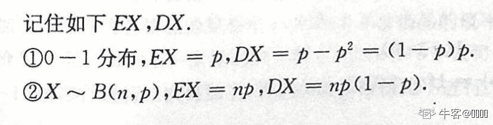
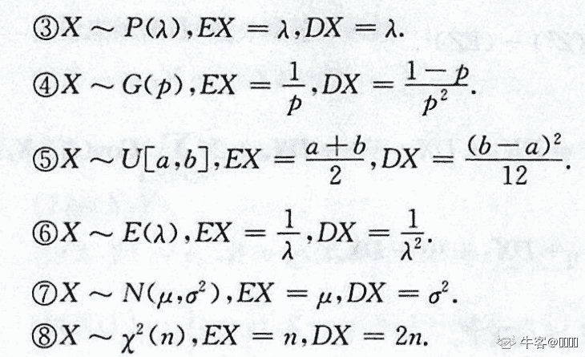
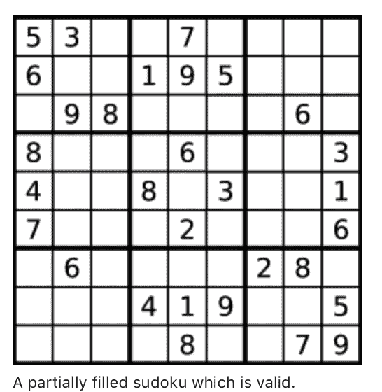

# 快手 2020 校园招聘秋招笔试--算法 B 试卷

## 1

在进程状态转换中，不可能发生的状态转换是

正确答案: D   你的答案: 空 (错误)

```cpp
就绪态→运行态
```

```cpp
运行态→就绪态
```

```cpp
运行态→等待态
```

```cpp
等待态→运行态
```

本题知识点

算法工程师 快手 2020

讨论

[我不喜欢有昵称](https://www.nowcoder.com/profile/96467569)

就绪 ↹运行 →等待 →就绪

发表于 2020-03-18 16:12:08

* * *

## 2

为了对紧急进程或重要进程进行调度,调度算法应采用

正确答案: B   你的答案: 空 (错误)

```cpp
先进先出调度算法
```

```cpp
优先数法
```

```cpp
最短作业优先调度
```

```cpp
定时轮转法
```

本题知识点

算法工程师 快手 2020

讨论

[逆袭的黑马](https://www.nowcoder.com/profile/508968808)

我觉得调度就该是先到先处理的规则

发表于 2020-05-13 21:39:26

* * *

[WinnieNiu](https://www.nowcoder.com/profile/89362936)

优先数法，实际上说的是优先级吧😂

发表于 2020-04-12 08:10:01

* * *

## 3

已经获得除(   )以外的所有运行所需资源的进程处于就绪状态。

正确答案: C   你的答案: 空 (错误)

```cpp
存储器
```

```cpp
打印机
```

```cpp
CPU
```

```cpp
磁盘空间
```

本题知识点

算法工程师 快手 2020

讨论

[零葬](https://www.nowcoder.com/profile/75718849)

获得 CPU 后就开始运行了，所以获得除 CPU 之外的所有资源时是处于就绪状态

发表于 2020-12-17 16:49:53

* * *

## 4

并发性是指若干事件在(   )发生。

正确答案: B   你的答案: 空 (错误)

```cpp
同一时刻
```

```cpp
同一时间间隔内
```

```cpp
不同时刻
```

```cpp
不同时间间隔内
```

本题知识点

算法工程师 快手 2020

讨论

[后知后觉诶](https://www.nowcoder.com/profile/968643987)

**并发是在一段时间内宏观上多个程序同时运行，并行是在某一时刻，真正有多个程序在运行。**

发表于 2020-03-26 20:51:42

* * *

[秃头一半](https://www.nowcoder.com/profile/962451314)

 **你吃饭吃到一半，电话来了，你一直到吃完了以后才去接，这就说明你不支持并发也不支持并行。
你吃饭吃到一半，电话来了，你停了下来接了电话，接完后继续吃饭，这说明你支持并发。
你吃饭吃到一半，电话来了，你一边打电话一边吃饭，这说明你支持并行。

并发的关键是你有处理多个任务的能力，不一定要同时。
并行的关键是你有同时处理多个任务的能力。

所以我认为它们最关键的点就是：是否是『同时』
作者：知乎用户
链接：[`www.zhihu.com/question/33515481/answer/58849148`](https://www.zhihu.com/question/33515481/answer/58849148)
来源：知乎
著作权归作者所有。商业转载请联系作者获得授权，非商业转载请注明出处。**

发表于 2020-04-12 10:38:14

* * *

[zzhxufeng](https://www.nowcoder.com/profile/158953357)

宏观上“同时”，微观上“不同时”。B 同一时间间隔内，从宏观上来看是对的。C 的话应该要描述的更准确一些才对：同一时间间隔内的不同时刻。

发表于 2020-06-10 10:21:25

* * *

## 5

将计算机系统中某一部件的处理速度提高为原来的 10 倍，但该部件的处理时间占整个系统运行时间的 60%，则系统加速比约为

正确答案: B   你的答案: 空 (错误)

```cpp
1.6
```

```cpp
2.2
```

```cpp
6
```

```cpp
10
```

本题知识点

算法工程师 快手 2020

讨论

[拿到正式 offer 就改名](https://www.nowcoder.com/profile/9311410)

假设提升前需要运行时间 100，其中处理时间 100*0.6=60，加速后处理时间 60*0.1=6，加速后总运行时间 40+6=46，100/46=2.17

发表于 2020-03-19 20:22:35

* * *

[人云亦云](https://www.nowcoder.com/profile/598753180)

约等于 2.2?

发表于 2020-04-13 21:27:22

* * *

## 6

下列命题中正确的是?

正确答案: C   你的答案: 空 (错误)

```cpp
欧拉图的子图一定是欧拉图
```

```cpp
哈密顿图的子图一定是哈密顿图
```

```cpp
平面图的子图一定是平面图
```

```cpp
树的子图一定是树
```

本题知识点

算法工程师 快手 2020

讨论

[yumemi](https://www.nowcoder.com/profile/308200895)

&

把二叉树竖着砍，就不是二叉树了

发表于 2020-04-08 19:28:01

* * *

[junex](https://www.nowcoder.com/profile/4200275)

什么奇怪的题目。。

发表于 2020-04-01 10:27:42

* * *

[放弃幻想，准备战斗](https://www.nowcoder.com/profile/6544134)

子图可以不连通

发表于 2020-05-28 08:36:12

* * *

## 7

盒中有 6 只灯泡,其中有 4 只正品,2 只次品;随机地从盒中任取 2 只灯泡,这两只灯泡至少有一只正品的概率为

正确答案: B   你的答案: 空 (错误)

```cpp
8/15
```

```cpp
14/15
```

```cpp
4/9
```

```cpp
8/9
```

本题知识点

算法工程师 快手 2020

讨论

[8+7](https://www.nowcoder.com/profile/466890248)

一共有 C(6,2)=15 种取法，取两只坏的只有一种可能。1-1/15=14/15

发表于 2020-03-20 08:44:43

* * *

[牛客 74470003 号](https://www.nowcoder.com/profile/74470003)

至少有一只，大于等于 1😂

发表于 2020-12-20 11:31:17

* * *

[zherCyber](https://www.nowcoder.com/profile/8496905)

一共有 C(6,2)=15 种取法，取两只好的有 C(4,2)=6 种取法，取一好一坏有 C(4,1)*C(2,1)=8 种取法，（6+8）/15=14/15

发表于 2020-04-18 18:23:30

* * *

## 8

三个人独立的破译一个密码，他们能破译的概率分别为 1/5、1/4、1/3，则密码能被破译的概率为：

正确答案: C   你的答案: 空 (错误)

```cpp
0.3
```

```cpp
0.4
```

```cpp
0.6
```

```cpp
0.78
```

本题知识点

算法工程师 快手 2020

讨论

[一只没有眼睛](https://www.nowcoder.com/profile/7576787)

三人同时不能破译的概率为 4/5 x 3/4 x 2/3 = 0.4,所以破译出来的概率为 0.6

发表于 2020-03-21 23:40:32

* * *

[yumemi](https://www.nowcoder.com/profile/308200895)

&

反向思维

发表于 2020-04-08 19:30:51

* * *

[unn123](https://www.nowcoder.com/profile/572455668)

只要一个人能破译出来，密码则能破译。

发表于 2020-09-06 15:55:13

* * *

## 9

下面哪一项分布的数学期望与方差相等？

正确答案: D   你的答案: 空 (错误)

```cpp
01 分布
```

```cpp
二项分布
```

```cpp
正态分布
```

```cpp
泊松分布
```

本题知识点

算法工程师 快手 2020

讨论

[zherCyber](https://www.nowcoder.com/profile/8496905)



发表于 2020-04-18 18:29:31

* * *

## 10

下列哪一项不是基于比较的排序算法？

正确答案: B   你的答案: 空 (错误)

```cpp
冒泡排序
```

```cpp
桶排序
```

```cpp
直接插入排序
```

```cpp
堆排序
```

本题知识点

算法工程师 快手 2020

讨论

[逆袭的黑马](https://www.nowcoder.com/profile/508968808)

不了解桶排序

发表于 2020-05-13 22:24:08

* * *

## 11

两个人玩游戏，有 n 个石子，两个人轮流取，每次取至少 1 个至多 5 个石子，取走最后一个石子的人胜利。当石子数 n 为以下哪一项时后手必胜？

正确答案: D   你的答案: 空 (错误)

```cpp
99
```

```cpp
100
```

```cpp
101
```

```cpp
102
```

本题知识点

算法工程师 快手 2020

讨论

[lonsty](https://www.nowcoder.com/profile/294169262)

以各取一次为**一个回合**，因每一次取数范围在[1, 5]，做为后手有一个优势，他可以保证每一回合所取石子之和为**6**，所以只要满足 6 的倍数，后手都能取完最后的石子。

发表于 2020-03-15 15:48:47

* * *

## 12

 向量 X=[1, 2, -3, 4, -5, 0, 0]的 L1 范数是？

正确答案: D   你的答案: 空 (错误)

```cpp
-1
```

```cpp
1
```

```cpp
7
```

```cpp
15
```

本题知识点

算法工程师 快手 2020

讨论

[我不喜欢有昵称](https://www.nowcoder.com/profile/96467569)

L0 范数是指向量中非零元素的个数 L1 范数是指向量中各个元素绝对值之和 L2 范数是指向量中各元素的平方和然后再平方根

发表于 2020-03-16 13:34:21

* * *

[逆袭的黑马](https://www.nowcoder.com/profile/508968808)

就是计算每项数值的绝对值之和

发表于 2020-05-13 22:26:36

* * *

## 13

FFT 时间复杂度是多少？

正确答案: D   你的答案: 空 (错误)

```cpp
O(N2)
```

```cpp
O(N)
```

```cpp
O(log2N)
```

```cpp
O(N*log2N)
```

本题知识点

算法工程师 快手 2020

讨论

[我不喜欢有昵称](https://www.nowcoder.com/profile/96467569)

FFT 快速傅立叶变换算法 O(NlogN)

发表于 2020-03-16 13:36:02

* * *

## 14

以下哪一项不属于 NoSQL（非关系型）数据库

正确答案: B   你的答案: 空 (错误)

```cpp
Redis
```

```cpp
MySQL
```

```cpp
MongoDB
```

```cpp
HBase
```

本题知识点

算法工程师 快手 2020

讨论

[Top10go](https://www.nowcoder.com/profile/692508976)

NOSQL 典型产品 memcached （纯内存），redis（持久化缓存），mongodb（文档的数据库）

发表于 2020-04-01 11:10:01

* * *

## 15

从 54 张扑克牌中随机抽 2 张,抽到 2 个 A 的概率是多少?

正确答案: A   你的答案: 空 (错误)

```cpp
C(4,2)/C(54,2)
```

```cpp
C(4,2)/C(52,2)
```

```cpp
C(2,4)/C(2,54)
```

```cpp
C(2,4)/C(2,52)
```

本题知识点

算法工程师 快手 2020

讨论

[yumemi](https://www.nowcoder.com/profile/308200895)

&

A 有 4 张，所以 4 张 A 里取 2 张 A 的所有组合是 c (4,2)。54 张里取到 2 张 A 的所有组合是 c(54,2)

发表于 2020-04-08 19:34:13

* * *

## 21

给定一个数独板的输入，确认当前的填法是否合法。合法的输入需要满足以下三个条件：1\. 每一行的 9 个格子中是 1-9 的 9 个数字，且没有重复 2\. 每一列的 9 个格子中是 1-9 的 9 个数字，且没有重复 3\. 9 个 3*3 的小格子中是 1-9 的 9 个格子，且没有重复

本题知识点

算法工程师 快手 2020

讨论

[xiaoehaier](https://www.nowcoder.com/profile/122955)

```cpp
vector<int> row(9, 0);
vector<int> col(9, 0);
vector<int> block(9, 0);

int main()
{
    string r;
    for(int i=0; i<9; ++i){
        cin >> r;
        for(int j=0; j<9; ++j){
            if(r[j] == 'X') continue;
            int tmp = 1 << (r[j] - '0');
            if(row[i] & tmp || col[j] & tmp
              || block[i/3*3+j/3] & tmp){
                cout << "false";
                return 0;
            }

            row[i] |= tmp;
            col[j] |= tmp;
            block[i/3*3+j/3] |= tmp;
        }
    }
    cout << "true";
    return 0;
}
```

发表于 2020-04-30 10:46:03

* * *

[零葬](https://www.nowcoder.com/profile/75718849)

```cpp
import java.io.BufferedReader;
import java.io.InputStreamReader;
import java.io.IOException;

public class Main {
    public static void main(String[] args) throws IOException {
        BufferedReader br = new BufferedReader(new InputStreamReader(System.in));
        char[][] board = new char[9][9];
        char[] rowArr;
        String row;
        while((row = br.readLine()) != null){
            rowArr = row.trim().toCharArray();
            for(int j = 0; j < 9; j++) board[0][j] = rowArr[j];
            for(int i = 1; i < 9; i++){
                rowArr = br.readLine().trim().toCharArray();
                for(int j = 0; j < 9; j++) board[i][j] = rowArr[j];
            }
            System.out.println(solve(board));
        }
    }

    private static boolean solve(char[][] board) {
        // 记录某行，某位数字是否已经被摆放
        boolean[][] row = new boolean[9][9];
        // 记录某列，某位数字是否已经被摆放
        boolean[][] col = new boolean[9][9];
        // 记录某 3x3 宫格内，某位数字是否已经被摆放
        boolean[][] block = new boolean[9][9];

        for(int i = 0; i < 9; i++){
            for(int j = 0; j < 9; j++){
                if(board[i][j] != 'X'){
                    int idx = board[i][j] - '1';           // 数字 board[i][j]的行列索引
                    int blockIdx = i / 3 * 3 + j / 3;      // 九宫格块的索引
                    if (row[i][idx] || col[j][idx] || block[blockIdx][idx]) {
                        // 如果这个数字在限定范围内已经被使用过了，则返回 false
                        return false;
                    } else {
                        // 否则更新状态
                        row[i][idx] = true;
                        col[j][idx] = true;
                        block[blockIdx][idx] = true;
                    }
                }
            }
        }
        // 通过所有检查，返回 true
        return true;
    }
}
```

发表于 2020-10-19 22:09:06

* * *

[爱笑的漠](https://www.nowcoder.com/profile/1579302)

这是 leetcode 第 36 题 原题

```cpp
res = []
for i in range(9):
    res.append(input())
from collections import defaultdict
row, col, grid = defaultdict(list), defaultdict(list), defaultdict(list)
flag = True
for i in range(9):
    for j in range(9):
        k = i//3*3 + j//3
        if res[i][j] != 'X':
            if res[i][j] in row[i]&nbs***bsp;res[i][j] in col[j]&nbs***bsp;res[i][j] in grid[k]:
                flag = False
                break
            else:
                row[i].append(res[i][j])
                col[j].append(res[i][j])
                grid[k].append(res[i][j])
    if not flag:
        break
if flag:
    print('true')
else:
    print('false')

```

发表于 2020-08-19 19:02:13

* * *

## 16

关于鞍点上的 hessian 矩阵哪个描述是正确的

正确答案: D   你的答案: 空 (错误)

```cpp
正定矩阵
```

```cpp
负定矩阵
```

```cpp
半正定矩阵
```

```cpp
其他均不正确
```

本题知识点

算法工程师 快手 2020

讨论

[牛客 964377539 号](https://www.nowcoder.com/profile/964377539)

[`blog.csdn.net/qq_26598445/article/details/80910366`](https://blog.csdn.net/qq_26598445/article/details/80910366)鞍点（saddle point)这个词来自的图形，在 x 轴方向向上曲，在 y 轴方向向下曲，像马鞍，鞍点为（0，0）。

神经网络优化问题中的鞍点即一个维度向上倾斜且另一维度向下倾斜的点。

鞍点：梯度等于零，在其附近 Hessian 矩阵有正的和负的特征值，行列式小于 0，即是不定的。

发表于 2020-03-22 15:27:26

* * *

[比如说](https://www.nowcoder.com/profile/8750023)

关于鞍点上的 hessian 矩阵有正的和负的特征值，行列式小于 0，所以是不定矩阵 发表于 2020-03-20 17:05:17

* * *

## 17

a,b,c,d,e 共 5 个人，从中选一个组长和一个副组长，不能是同一人，但 a 不能当组长。不同的选法总数是？

正确答案: B   你的答案: 空 (错误)

```cpp
20
```

```cpp
16
```

```cpp
10
```

```cpp
6
```

本题知识点

算法工程师 快手 2020

讨论

[融 360 内推](https://www.nowcoder.com/profile/598880162)

从 5 个人里面挑选 2 个人，一个组长，一个副组长，共有 种。再减去 A 当组长的情况，即另外 4 个人选一个为副组长共有种选法，答案即为 20-4=16 种。

编辑于 2020-03-26 10:38:06

* * *

[海康威视校招内推](https://www.nowcoder.com/profile/303088069)

选除 a 之外的人当组长，有 4 种。再从剩下的人选副组长有 4 种，4*4 =16

发表于 2020-03-29 21:26:50

* * *

## 22

我们知道每一个大于 1 的整数都一定是质数或者可以用质数的乘积来表示，如 10=2*5。现在请设计一个程序，对于给定的一个(1，N] 之间的正整数（N 取值不超过 10 万），你需要统计(1，N] 之间所有整数的质数分解后，所有质数个数的总个数。举例，输入数据为 6，那么满足(1,6] 的整数为 2，3，4，5，6，各自进行质数分解后为：2=>2，3=>3，4=>2*2，5=>5，6=>2*3。对应的质数个数即为 1，1，2，1，2。最后统计总数为 7

本题知识点

算法工程师 快手 2020

讨论

[炼丹师~](https://www.nowcoder.com/profile/401483527)

动态规划。dp[i]表示数字 i 有多少质数相乘。1.若 i 本身为质数，dp[i] = 12.若 i 不为质数，则可以写成 i = j*k 的形式，由于是自底向上的动态规划，dp[j]，dp[k]已经求出，则 dp[i] = dp[j]+dp[k]j 是从 2 到 sqrt(i)遍历，找到的第一个能够整除 i 的数。

```cpp
import math
N = int(input())

dp = [1]*(N+1)
for num in range(3,N+1):
    for i in range(2, math.ceil(math.sqrt(num))+1):
        if num%i == 0:
            d = int(num/i)
            dp[num] = dp[i]+dp[d]
            break
print(sum(dp[2:]))
```

编辑于 2020-04-25 15:25:47

* * *

[零葬](https://www.nowcoder.com/profile/75718849)

采用暴力算法只通过了 80%啊

```cpp
import java.io.BufferedReader;
import java.io.InputStreamReader;
import java.io.IOException;

public class Main {
    public static void main(String[] args) throws IOException {
        BufferedReader br = new BufferedReader(new InputStreamReader(System.in));
        String strNum;
        while((strNum = br.readLine()) != null){
            int num = Integer.parseInt(strNum);
            System.out.println(solve(num));
        }
    }

    private static int solve(int num) {
        int count = 0;
        for(int i = 2; i <= num; i++)
            count += primeFactorNum(i);
        return count;
    }

    // 求解一个数由几个质数相乘得到
    private static int primeFactorNum(int num) {
        int count = 0;
        int primeNumber = 2;    // 最小质数
        while(primeNumber <= num){
            if(num % primeNumber == 0){
                // num 可以被 primeNumber 整除，因此 primeNumber 为 num 的质数因子
                num /= primeNumber;
                count ++;
            }else{
                primeNumber ++;
            }
        }
        return count;
    }
}
```

发表于 2020-10-19 22:10:09

* * *

[BlackCarDriver](https://www.nowcoder.com/profile/1425406)

Oh my god...看了评论区才发现原来暴力也可以。。。我的思路：

```cpp
const int RANG = 100001;
ARRAY prime;		   //RANG 以内的质数
ARRAY record(RANG, 0);	//record[n]: n 的质因数个数

//初始化 Prime[]
void initPrime(){
	bool isPrime[RANG];
	memset(isPrime, false, sizeof(isPrime));
	for (int i = 2; i < RANG; i++){
		if (!isPrime[i]){
			prime.push_back(i);
			int t = i;
			while (t>0 && t < RANG){	//大失误：当 t 大于 500000 后，t*t 可能溢出，导致非法访问
				isPrime[t] = true;
				t += i;		//大失误：这里写成了 t*=t;
			}
		}
	}
	return;
}

//求 n 的质因子个数
int getPrimeNum(int n){
	if (binary_search(prime.begin(), prime.end(), n) == true){	//二分搜索优化
		record[n] = 1;
		return 1;
	}
	int count = 0;
	int tn = n;
	for (int i = 0; i < prime.size() && prime[i] <= n; i++){
		if (tn % prime[i] == 0){
			count = record[tn / prime[i]] + 1;	//通过动态规划思想的优化
			break;
		}
	}
	record[n] = count;
	return count;
}

int main(){
	initPrime();
	int n;
	cin >> n;
	int count = 0; 
	for (int i = 2; i <= n; i++){
		count += getPrimeNum(i);
	}
	cout << count << endl;
	return 0;
}

```

发表于 2020-04-12 21:32:26

* * *

## 18

梯度下降法等正确步骤是？1\. 计算预测值和真实值之间等误差 2\. 迭代跟新，直到找到最佳权重 3\. 把输入传入网络，得到输出值 4\. 初始化随机权重和偏差 5\. 对每一个产生误差对神经元，改变相应对（权重）值以减小误差

正确答案: D   你的答案: 空 (错误)

```cpp
1，2，3，4，5
```

```cpp
5，4，3，2，1
```

```cpp
3，2，1，5，4
```

```cpp
4，3，1，5，2
```

本题知识点

算法工程师 快手 2020

讨论

[逆袭的黑马](https://www.nowcoder.com/profile/508968808)

一般第一步都需要初始化操作

发表于 2020-05-13 22:27:25

* * *

## 19

在 8 位二进制补码中，10101010 表示的数是十进制下的( )。

正确答案: D   你的答案: 空 (错误)

```cpp
170
```

```cpp
-170
```

```cpp
86
```

```cpp
-86
```

本题知识点

算法工程师 快手 2020

讨论

[快乐的循环链表](https://www.nowcoder.com/profile/126753761)

对于正数，其原码、反码和补码都相同，第一位符号位始终为 0。对于负数，以-3 为例。原码为 10000011，第一位符号位为 1；反码是在原码的基础上，符号位不变，其他位取反，得到 11111100；补码则是在其反码的基础上加 1，得到 11111101。根据补码可知此数为负，倒推即可，10101010 先减 1，得到反码 10101001，再将除符号位之外取反，得到原码 11010110，符号位 1 代表-，剩下 1010110 代表的十进制是 64+16+4+2=86，所以答案是-86。

发表于 2020-03-22 15:15:48

* * *

[逆袭的黑马](https://www.nowcoder.com/profile/508968808)

不理解补码的概念

发表于 2020-05-13 22:28:18

* * *

## 20

下列 Python 程序的运行结果是( )

```cpp
def P(x):
    y = reduce(lambda x, y: x * y, map(int, str(x)))
    return y and not x % y
def Q(x):
    return P(x) and P(x + 1)
print sum(Q(x) for x in xrange(2019))
```

正确答案: C   你的答案: 空 (错误)

```cpp
11
```

```cpp
12
```

```cpp
13
```

```cpp
14
```

本题知识点

算法工程师 快手 2020

讨论

[天鹅的梦](https://www.nowcoder.com/profile/156339698)

P(x）为 1 的条件：计算数字 x 各位数的乘积，乘积不为 0 且 x 能够整除该乘积。只有 x 和 x+1 的 P（x）均满足上述条件 Q（x）才为 1，其他情况都是 0，在加法中不考虑。满足条件的 x 有：1 到 8，11，111，1111，1112，1115，总共为 8+5=13

发表于 2020-03-21 20:34:27

* * *

[牛客 642687959 号](https://www.nowcoder.com/profile/642687959)

**reduce()** 函数会对参数序列中元素进行累积。

```cpp
reduce(function, iterable[, initializer])
```

函数将一个数据集合 iterable 中的所有数据进行函数 function 中的操作，用传给 reduce 中的函数 function（有两个参数）先对集合中的第 1、2 个元素进行操作，得到的结果再与第三个数据用 function 函数运算，最后得到一个结果。y = reduce(lambda x, y: x * y, map(int, str(x)))
y 返回 x 作为字符串的各个位上数字累乘的结果 P(x)返回乘积 y 不为 0 且 x 能够整除该乘积 y 的逻辑判断值
Q(x)返回 P(x)∧P(x+1)的逻辑判断值 

发表于 2020-06-30 12:26:22

* * *

[yumemi](https://www.nowcoder.com/profile/308200895)

&

1-8，除以本身

11 能整除 1 12 能整除 2

111 和 1111 同理

1112 整除 2，1113 整除 3

1115 整除 5，1116 整除 6

1 2 3 4 5 6 7 8 11 111 1111 1112 1115 共 13 个

发表于 2020-04-08 19:38:04

* * *

## 23

已知两个字符串 strA 和 strB，求将 strA 转换成 strB 所需的最小编辑操作次数。许可的编辑操作包括将一个字符替换成另一个字符，插入一个字符，删除一个字符。

本题知识点

算法工程师 快手 2020

讨论

[BlackCarDriver](https://www.nowcoder.com/profile/1425406)

一道经典的动态规划题目。

```cpp
//动态规划递归解法
string a, b;
//minTimes[i][j] => b.subStr(0,j) 需要最少多少次操作才能变 a.subStr(0,i)
vector< vector<int> > minTimes;

int GetMinTimes(int i, int y){
	if (i < 0 || y<0 ){
		return 100000000;
	}
	if (minTimes[i][y] >= 0){
		return minTimes[i][y];
	}
	int modify = GetMinTimes(i - 1, y - 1) + (a[i] == b[y] ? 0 : 1);
	int insert = GetMinTimes(i, y - 1) + 1;
	int remove = GetMinTimes(i - 1, y) + 1;
	int res = min(modify, min(insert, remove));
	minTimes[i][ y]= res;
	return res;
}
int main(){
	getline(cin, a);	//失误：使用 cin>>不能适应带有空格的字符串
	getline(cin, b);
	minTimes.assign(a.length(), vector<int>(b.length(), -1));
	minTimes[0][0] = (a[0] ==b[0]?0:1);
	cout << GetMinTimes(a.length()-1, b.length()-1) << endl;
	return 0;
}
```

发表于 2020-04-12 21:35:26

* * *

[零葬](https://www.nowcoder.com/profile/75718849)

```cpp
import java.io.BufferedReader;
import java.io.InputStreamReader;
import java.io.IOException;

public class Main {
    public static void main(String[] args) throws IOException {
        BufferedReader br = new BufferedReader(new InputStreamReader(System.in));
        String word1;
        while((word1 = br.readLine()) != null){
            String word2 = br.readLine();
            System.out.println(solve(word1, word2));
        }
    }

    private static int solve(String word1, String word2) {
        int len1 = word1.length(), len2 = word2.length();
        // dp[i][j]表示从 word1[:i]变到 word2[:j]需要的步数
        int[][] dp = new int[len1 + 1][len2 + 1];
        for(int i = 1; i <= len1; i++)
            dp[i][0] = dp[i - 1][0] + 1;
        for(int j = 1; j <= len2; j++)
            dp[0][j] = dp[0][j - 1] + 1;
        for(int i = 1; i <= len1; i++){
            for(int j = 1; j <= len2; j++){
                if(word1.charAt(i - 1) == word2.charAt(j - 1))  // 如果 word1[i - 1] = word[j - 1]则什么都不用做
                    dp[i][j] = dp[i - 1][j - 1];
                else      // 否则哪种编辑方式用的步数少就用哪种
                    dp[i][j] = 1 + Math.min(dp[i - 1][j - 1], Math.min(dp[i][j - 1], dp[i - 1][j]));
            }
        }
        return dp[len1][len2];
    }
}
```

发表于 2020-10-19 22:11:45

* * *

[冉兮兮](https://www.nowcoder.com/profile/213885286)

```cpp

import java.util.Scanner; 
public class Main {
    public static void main(String[] args) {
        Scanner scanner = new Scanner(System.in);
        String strA = scanner.nextLine();
        String strB = scanner.nextLine();
        scanner.close();
        int up=0,down=0;
        int lenA = strA.length();
        int lenB = strB.length();
        int dp[][]=new int[lenB+1][lenA+1];
        dp[0][0]=0;
        for (int i = 0; i <= lenB; i++) dp[i][0]=i;
        for (int i = 0; i <= lenA; i++) dp[0][i]=i;

        for (int ii = 1; ii <= lenB; ii++) {
            int i=ii-1;
            for (int jj=1;jj<=lenA;jj++){
                int j=jj-1;
                if(strB.charAt(i) == strA.charAt(j)){
                    dp[ii][jj]=dp[i][j];// 相等为对角线解
                }else if(dp[ii][j] == dp[i][jj]){
                    dp[ii][jj]=dp[i][j]+1;//上方的值 == 左方的值 当前值=左上值+1
                }else {
                    //上方的值 != 左方的值 当前值=min(左值,上值)+1
                    dp[ii][jj]=Math.min(dp[ii][j],dp[i][jj])+1;
                }
            }
        }
        System.out.println(dp[lenB][lenA]);

    }
}
//        FreshMeat 
//        FishAndMeat
//        0   1   2   3   4   5   6   7   8   9
//        1   0   1   2   3   4   5   6   7   8
//        2   1   1   2   3   4   5   6   7   8
//        3   2   2   2   2   3   4   5   6   7
//        4   3   3   3   3   2   3   4   5   6
//        5   4   4   4   4   3   3   4   5   6
//        6   5   5   5   5   4   4   4   5   6
//        7   6   6   6   6   5   5   5   5   6
//        8   7   7   7   7   6   5   6   6   6
//        9   8   8   7   8   7   6   5   6   7
//        10   9   9   8   8   8   7   6   5   6
//        11   10   10   9   9   9   8   7   6   5  
```

 发表于 2020-06-04 10:49:47

* * *

## 24

输入一个英文句子, 词之间有 1 个或者若干个空格，句子以英文标点"."结尾。要求颠倒该句子中的词语顺序，并且词之间有且只有一个空格，结尾仍然是"."，结尾的"."与前一个单词之间无空格。

本题知识点

算法工程师 快手 2020

讨论

[零葬](https://www.nowcoder.com/profile/75718849)

优雅的 python 写法，不包括注释只需三行

```cpp
# 去掉句末的句点
sentence = input()[:-1]
# 取出单词
wordList = [word for word in sentence.split(' ') if len(word) > 0]
# 句子反转并补上句号
print(' '.join(wordList[::-1]) + '.')
```

发表于 2020-10-19 20:38:07

* * *

[牛奶泡泡糖](https://www.nowcoder.com/profile/33750295)

思路：翻转单词，再整体翻转，就是倒序

```cpp
def rev(arr):
    lens=len(arr)
    if lens==1:
        return arr
    l=lens//2
    for i in range(l):
        tmp=arr[i]
        j=lens-i-1
        arr[i]=arr[j]
        arr[j]=tmp
    return arr
s=list(input().split())
flag=0
if s[-1]==".":
    s=s[:len(s)-1]
    flag=1
for arr in s:
    arr=rev(list(x for x in arr))
    arr="".join(arr)
s=rev(s)
s=" ".join(s)
if flag==1:
    s=s+"."
print(s)
```

编辑于 2020-04-13 18:57:09

* * *

[牛客 753087731 号](https://www.nowcoder.com/profile/753087731)

```cpp
list = input()[:-1].split()
list.reverse()
print(' '.join(list), end='.')
```

发表于 2020-04-12 02:41:51

* * *