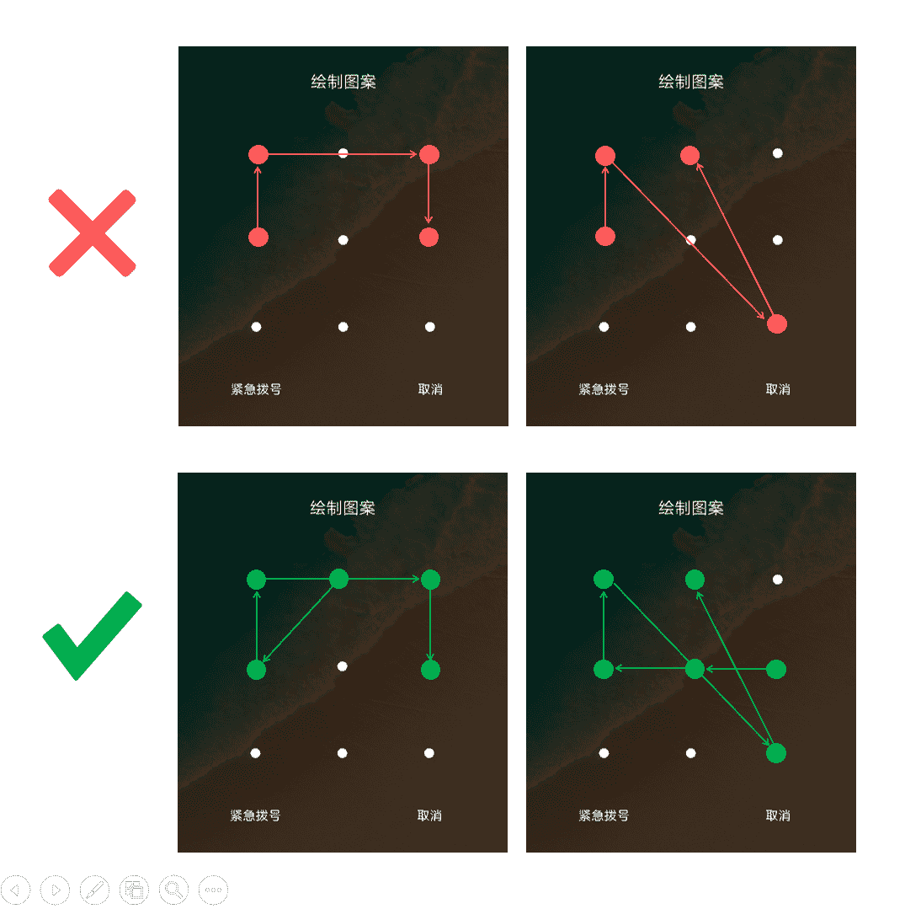

# vivo2020 届春季校园招聘在线编程考试

## 1

现有一个 3x3 规格的 Android 智能手机锁屏程序和两个正整数 m 和 n ，请计算出使用最少 m 个键和最多 n 个键可以解锁该屏幕的所有有效模式总数。其中有效模式是指：1、每个模式必须连接至少 m 个键和最多 n 个键；2、所有的键都必须是不同的；3、如果在模式中连接两个连续键的行通过任何其他键，则其他键必须在模式中选择，不允许跳过非选择键（如图）；4、顺序相关，单键有效（这里可能跟部分手机不同）。输入：m,n 代表允许解锁的最少 m 个键和最多 n 个键 输出：满足 m 和 n 个键数的所有有效模式的总数 

本题知识点

Java 工程师 C++工程师 前端工程师 安卓工程师 iOS 工程师 算法工程师 大数据开发工程师 信息技术岗 运维工程师 安全工程师 数据分析师 数据库工程师 游戏研发工程师 vivo 2020

讨论

[L.S.C](https://www.nowcoder.com/profile/8617391)

```cpp
# Python3 dfs
# 所有方向
di = [(1,0), (-1,0), (0,1), (0,-1), (1,1), (-1,-1), (1,-1), (-1,1), (1,2), (1,-2), (-1,2), (-1,-2), (2,1), (2,-1),(-2,1),(-2,-1)]
# 可跨一个点的方向
ds = [(1,0), (-1,0), (0,1), (0,-1), (1,1), (-1,-1), (1,-1), (-1,1)]
# 9 个点
nodes = {(0,0), (0,1), (0,2), (1,0), (1,1), (1,2), (2,0), (2,1), (2,2)}
def dfs(x, y, visited, count):
    visited.add((x, y))
    count -= 1
    ans = 0
    if count == 0:
        ans += 1
    else:
        for d in di:
            if (x+d[0], y+d[1]) in visited or (x+d[0], y+d[1]) not in nodes:
                if d not in ds:
                    continue
                else:
                    dx = d[0] * 2
                    dy = d[1] * 2
                    if (x+dx, y+dy) in nodes and (x+dx, y+dy) not in visited:
                        ans += dfs(x+dx, y+dy, visited, count)                       
            else:
                ans += dfs(x+d[0], y+d[1], visited, count)
    visited.remove((x, y))
    return ans

ans = [0] * 10
for count in range(1, 10):
    for i in range(3):
        for j in range(3):
            visited = set()
            ans[count] += dfs(i, j, visited, count)
# ans[i]即为 i 个键的结果数
# ans = [0, 9, 56, 320, 1624, 7152, 26016, 72912, 140704, 140704]
print(ans)

```

 编辑于 2020-04-02 18:52:08

* * *

[BlackCarDriver](https://www.nowcoder.com/profile/1425406)

可以通过 DFS 的方式先计算出刚好按下 n 个键时有多少种组合，然后求出 S[n]至 S[M]的和。DFS 的主要难度在于，下一步可以与当前的位置不直接相连。这时分两种情况：1\. 普通的八个方向 （上下左右以及其 45 度夹角方向）：若这八个方向都已经越界或走过了，则这时无路可走。若是普通的 DFS 则返回，但是九宫格解锁可以跳过相邻的一格。注意只能在这八个方向跳多一步，相当于踩着已经被按下的位置再沿着相同方向走一步。
2.其余的八个方向其余的八个方向虽然不直接与当前位置直接相连，但是它与当前位置的连线不会触碰到其他位置，因此也可以直接到达。以下为 DFS 代码

```cpp
int dir[16][2] = {		//16 个方向
	{ -1, 0 }, { -1, 1 }, { 0, 1 }, { 1, 1 },
	{ 1, 0 }, { 1, -1 }, { 0, -1 }, { -1, -1 },
	{-2, 1 }, { -1, 2 }, { 1, 2 }, { 2, 1 },
	{ 2, -1 }, { 1, -2 }, { -1, -2 }, { -2, -1 } 
};

int isVisit[5][5];	//是否已按下

bool canVisit(int i, int j){	//判断能否按下
	if (i < 1 || i>3 || j < 1 || j>3 || isVisit[i][j]) return false;
	return true;
}

int times[10];

//d:已经被选中的键的个数(深度)
void DFS(int i, int j, int d){
	if (d == 9){
		return;
	}
	isVisit[i][j] = true;
	times[d++] ++;

	//选择下一个键
	for (int y = 0; y < 16; y++){
		int ni = i + dir[y][0], nj = j + dir[y][1];
		if (canVisit(ni, nj)){	//该点未被选择
			DFS(ni, nj, d);
		}
		else if (y < 8){	//这步最关键，前 8 个方向的键若被按下了，可以选择同样方向但更远一步的位置
			ni += dir[y][0];
			nj += dir[y][1];
			if (canVisit(ni, nj) ){	//该点未被选择
				DFS(ni, nj, d);
			}
		}
	}
	isVisit[i][j] = false;
	return;
}
```

solution：

```cpp
class Solution {
public:
    int solution(int m, int n) {
        if(m > n){    //易被忽略
            return 0;
        }
        m = (m<0? 0: m);    //参数检查必须有
        n = (n>9? 9:n);
        int tmp[] = {0, 9, 56, 320, 1624, 7152, 26016, 72912, 140704, 140704 };
        int ans = 0;
        for(int i=m; i<=n; i++){
           ans += tmp[i];
       }
       return ans;
    }
};
```

发表于 2020-04-01 21:43:16

* * *

[myyhdmz](https://www.nowcoder.com/profile/922919830)

```cpp
class Solution {
public:
    void move(vector<vector<int> >& board, int i, int j, int k, int m, int n, int& ans){
        // 如果已经走过的点数大于等于 m，则是有效路径，ans++
        if(k >= m) ans ++;
        // 如果已经走过的点数等于 n，则不需要继续探索，故返回
        if(k == n) return;
        // 如果已经走过的点数小于 n，则还可以继续探索
        for(int dx=-2; dx<=2; dx++){
            for(int dy=-2; dy<=2; dy++){
                if(i+dx>=0 && i+dx<=2 && j+dy>=0 && j+dy<=2 && board[i+dx][j+dy]==0){
                    // 如果两点之间没有第三个点（条件：dx%2 || dy%2），则无需判断是否经过“已经过”的点
                    // 如果两点之间有第三个点，则需要判断这个点是否是已经走过的点
                    if(dx%2 || dy%2 || (!(dx%2) && !(dy%2) && board[i+dx/2][j+dy/2]==1)){
                        board[i+dx][j+dy] = 1;
                        move(board, i+dx, j+dy, k+1, m, n, ans);
                        board[i+dx][j+dy] = 0;
                    }
                }
            }
        }

        return;
    }

    int solution(int m, int n) {
        // write code here
        vector<vector<int> > board(3, vector<int>(3, 0));
        int ans = 0;
        // 如果 n 等于 0，则直接返回 0
        if(n == 0) return ans;

        // 选择棋盘上任意一点作为起点
        for(int i=0; i<3; i++){
            for(int j=0; j<3; j++){
                board[i][j] = 1;
                move(board, i, j, 1, m, n, ans);
                board[i][j] = 0;
            }
        }
        return ans;
    }
};

```

发表于 2020-04-21 19:06:47

* * *

## 2

现给定任意正整数 n，请寻找并输出最小的正整数 m（m>9），使得 m 的各位（个位、十位、百位 ... ...）之乘积等于 n，若不存在则输出 -1。

本题知识点

Java 工程师 C++工程师 前端工程师 安卓工程师 iOS 工程师 算法工程师 大数据开发工程师 信息技术岗 运维工程师 安全工程师 数据分析师 数据库工程师 游戏研发工程师 vivo 2020

讨论

[Cyan1956](https://www.nowcoder.com/profile/487142704)

[[编程题]数位之积](https://www.nowcoder.com/profile/487142704/codeBookDetail?submissionId=72034268)
对于小于 10 的数 n，输出 1n。
对于大于 10 的数，需要分解为若干个个位数之积，数字的个数尽可能少。这个数字可以分解为以 9，8，...，2 的因子之积。然后从小到大输出即可。
我也写了第三题的答案，[[编程题]vivo 智能手机产能 只需两行 数学解法](https://blog.csdn.net/Cyan1956/article/details/105341974)

```cpp
class Solution {
public:
    /**
     * 输入一个整形数值，返回一个整形值
     * @param n int 整型 n>9
     * @return int 整型
     */
    int solution(int n) {
        // write code here
        if (n < 10) return 10 + n;
        int res = 0, base = 1;
        for (int i = 9; i > 1; i--) {
            while (n % i == 0) {
                res += i * base;
                base*=10;
                n /= i;
            }
        }
        if (n > 1) return -1;
        else return res;
    }
};
```

发表于 2020-04-06 13:06:44

* * *

[一只弱小的 Kid](https://www.nowcoder.com/profile/1733825)

```cpp
# 输入一个整形数值，返回一个整形值
(3783)# @param n int 整型 n>9
# @return int 整型
(3784)# 递归迭代 9-2 判断是否取余等于 0，然后返回统计好的数 
class Solution:
    def solution(self , n ):
        # write code here
        r = self.Func(n)
        if r>0:
            return r
        return -1
    def Func(self,n):
        if n <10 :
            return n
        for i in range(9,1,-1):
            if n%i == 0 :
                return self.Func(n/i)*10+i;
        return -1
```

发表于 2020-03-26 22:16:28

* * *

[我想要个 offer 啊啊啊啊](https://www.nowcoder.com/profile/841609)

其实只要看能否被 2,3,5,7 四个质数分解就行，不能就是-1，能的话，尽量保留小的质数，让大的质数相乘。

发表于 2020-06-06 15:09:50

* * *

## 3

在 vivo 产线上，每位职工随着对手机加工流程认识的熟悉和经验的增加，日产量也会不断攀升。假设第一天量产 1 台，接下来 2 天(即第二、三天)每天量产 2 件，接下来 3 天(即第四、五、六天)每天量产 3 件 ... ... 以此类推，请编程计算出第 n 天总共可以量产的手机数量。

本题知识点

Java 工程师 C++工程师 前端工程师 安卓工程师 iOS 工程师 算法工程师 大数据开发工程师 信息技术岗 运维工程师 安全工程师 数据分析师 数据库工程师 游戏研发工程师 vivo 2020

讨论

[xiaoehaier](https://www.nowcoder.com/profile/122955)

```cpp
class Solution {
public:
    /**
     *
     * @param n int 整型 第 n 天
     * @return int 整型
     */
    int solution(int n) {
        // write code here
        int ans = 0;
        for(int i=1; n>0; ++i){
            ans += i * min(i, n);
            n -= i;
        }
        return ans;
    }
};
```

发表于 2020-04-27 14:11:11

* * *

[牛客 282922249 号](https://www.nowcoder.com/profile/282922249)

纯数学解法，首先等差数列求和 1+2+3+4+。。。。+k=k(k+1)/2，令它等于 n，解出向下归整后的最大 K（一元二次方程求根公式），然后计算到 K 时一共有多少天，再用 n 减去就是多出来的天数（例 n=11，k=4，到 k 处一共 10 天，多出 1 天），最后利用平方和求结果 res，res=(1*1+2*2+3*3+4*4+。。。。+k*k)+多出来的天数*（k+1）；public int solution (intn) {        int k = (int)((Math.sqrt(1+8*n)-1)/2);        int remain = n-k*(k+1)/2;        int res = k*(k+1)*(2*k+1)/6+remain*(k+1);        return res;    }

发表于 2020-04-20 11:01:59

* * *

[牛客 577957613 号](https://www.nowcoder.com/profile/577957613)

我觉得我第一次代码写这么挺简洁的

```cpp
 ```
class Solution:
    def solution(self , n ):
        ans = 0
        i = 1
        while n - i > 0:
            ans += (i * i)
            n -= i
            i += 1
        ans += (i * n)
        return ans
```cpp 
```

编辑于 2020-04-12 22:29:23

* * *