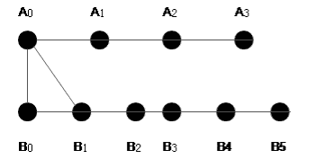

# 深信服校园招聘 c/c 软件开发 H 卷

## 1


如图所示，平面上有两条平行的线段，上面的线段有 A0~A3 4 个点，下面的线段有 B0 到 B5 6 个点，现在需要把所有的点都连接起来，有如下约束：

每个端点，都至少有一条到另一平行线上端点的连线；
连线之间不能有交叉（除了端点，线与线之间不能有连接的地方）；

请问，总共有多少种连法？1

你的答案 (错误)

1 参考答案 (1) 56

本题知识点

C++工程师 深信服

讨论

[牛客 546664151 号](https://www.nowcoder.com/profile/546664151)

```cpp
#include<iostream>
using namespace std;
int main() {
	int num = 0;
	for (int a = 0; a < 6; a++) {          // 从 A0 开始连，有 6 种连法
		for (int b = a; b < 6; b++) {      // A0 连好后，连 A1
			for (int c = b; c < 6; c++) {  // A1 连好后，连 A2
				num++;                     // A3 就不需要管了，数量+1
			}
		}
	}
	cout << num << endl;
	return 0;
}
```

如果先从 A0 开始连，有六种连接方式：B0                                                                  B0、B1                                                                  B0、B1、B2                                                                  B0、B1、B2、B3                                                                  B0、B1、B2、B3、B4                                                              B0、B1、B2、B3、B4、B5

发表于 2020-05-26 11:46:44

* * *

[何人听我楚狂声的小迷弟](https://www.nowcoder.com/profile/138827679)

试了两种搜索，答案都是 231..是我题意没理解对吗

```cpp
#include<bits/stdc++.h>
using namespace std;
const int maxn = 1e3+5;
typedef long long ll;

int ans=0;
int A[4],B[6];
int cnt;
void dfs(int a,int b,int last){ //上边第 a 个尝试连接第 b 个 last 是上一次 a 连接的 b 是哪个
    if(a==4){
        if(B[0]&&B[1]&&B[2]&&B[3]&&B[4]&&B[5]) ans++; //所有 a 都有连接且所有 b 都有被连接
        return;
    }
    if(b==6){
        if(last!=-1) dfs(a+1,last,-1); //当前 a 对下面所有 b 都尝试过且有连接，连接 a+1
        return;
    }

    dfs(a,b+1,last);

    A[a]++,B[b]++;
    dfs(a,b+1,b);
    A[a]--,B[b]--;
}

int main(){
    dfs(0,0,-1);
    printf("%d\n",ans);
    return 0;
}

```

发表于 2020-05-14 19:00:42

* * *

## 2

JSON 是一种可以用来保存配置的数据格式，其结构为树状。

JSON 中某个子节点的位置可以 JSON 路径的形式表示，JSON 路径类似 UNIX 文件路径，以'/'分隔父子节点名。JSON 路径中不会出现空格。

如下 JSON 值中
mem -- daemons -- findme
    |          |- waccd
    |
    |- apps -- appd

findme 子节点的 JSON 路径为： /mem/daemons/findme
appd 子节点的 JSON 路径为：/mem/apps/appd
waccd 子节点的 JSON 路径为：/mem/daemons/waccd

有一个列表用来描述各 JSON 子节点是否允许用户编辑。如下：
Y /mem/daemons/findme
N /mem/daemons
Y /mem

如果有设置用户对某个子节点的权限，则实际权限为该设定权限，否则继承其父节点的可访问性，对根节点的默认访问权限为 N。

本题知识点

C++工程师 深信服

讨论

[精益求精 BKB](https://www.nowcoder.com/profile/363685504)

前缀树

/mem/start 将这样一个字符串拆分成 mem start 两单词， 每个单词为一个前缀

前缀树的属性：

    1\. 当前文件夹是否有权限
    2.当前文件夹是否是继承父目录的权限
    3.当前文件夹的子目录
    4.当前文件夹的名字

前缀树的操作：

    1\. 插入
    2\. 查询
    3\. 更新所有文件夹的权限信息

主程序 读入所有信息

    1\. 将待查询的信息，先存在一个 vector 中
    2\. 将其余信息 用于构建前缀树

构建前缀树的过程

    1\. vector<string> str 中保存了路径中的 名字信息（利用 split 函数 拆分字符串）
    2\. 检查 map 中是否有 str[i] 这个文件夹的名字， 如果 map 中没有， 则创建一个文件夹，并赋予父目录的权限
    3\. 然后 node 指向 map[str[i]] 这个节点
查询前缀树的过程：    1\. 逐个判断 path 中的名字是否在前缀树出现
    2\. 如果没有出现 则返回当前 node 的权限

```cpp
#include<iostream>
(720)#include<vector>
#include<map>
(747)#include<unordered_map>
using namespace std;

class Trie {
public:
    bool hava_Authority = false;
    bool isInherient = true;
    unordered_map<string, Trie*> ls;
    string name;
    Trie(bool au, string str) {
        hava_Authority = au;
        name = str;
    }
    Trie() {

    }
    void insert(bool au, vector<string> str) {
        if (str.empty()) {
            this->isInherient = false;
            this->hava_Authority = true;
            return;
        }
        Trie* node = this;
        for (int i = 0; i < str.size(); i++) {
            if (node->ls.find(str[i]) == node->ls.end()) {
                Trie* tmp = new Trie(node->hava_Authority, str[i]);
                node->ls.insert(make_pair(str[i], tmp));
            }
            node = node->ls.find(str[i])->second;
        }
        if (node->isInherient)
            node->hava_Authority = au;
        node->isInherient = false;
    }

    bool query(vector<string> str) {
        Trie* node = this;
        for (int i = 0; i < str.size(); i++) {
            if (node->ls.find(str[i]) == node->ls.end()) {
                break;
            }
            node = node->ls.find(str[i])->second;
        }
        return node->hava_Authority;
    }

    void update() {
        Trie* node = this;
        for (auto it = node->ls.begin(); it != node->ls.end(); it++) {
            if (it->second->isInherient) {
                node->ls[it->first]->hava_Authority = node->hava_Authority;
            }
            node->ls[it->first]->update();
        }
    }
};

vector<string> split(string str) {
    str += "/";
    str = str.substr(1);
    vector<string> res;
    string tmp;
    for (int i = 0; i < str.size(); i++) {
        if (str[i] == '/') {
            if (tmp.size())
                res.push_back(tmp);
            continue;
        }
        tmp += str[i];
    }
    return res;
}

int main() {
    Trie* root = new Trie();
    int n;
    cin >> n;
    vector<vector<string>> query;
    while (n--) {
        string t;
        cin >> t;
        query.push_back(split(t));
    }
    cin >> n;
    string a, b;
    while (n--) {
        cin >> a >> b;
        if (a == "Y") {
            root->insert(true, split(b));
        }
        else {
            root->insert(false, split(b));
        }
    }
    root->update();
    for (int i = 0; i < query.size(); i++) {
        if (root->query(query[i])) {
            cout << "Y\n";
        }
        else {
            cout << "N\n";
        }
    }
    return 0;

}
```

发表于 2020-05-11 22:32:16

* * *

[OFFER/OFFER](https://www.nowcoder.com/profile/203895943)

字符串遍历

```cpp
#include <bits/stdc++.h>
using namespace std;
int main()
{
    int m,n;
    cin >> m;
    vector<string> unchecked(m, "");
    vector<string> ret;
    unordered_map<string, string> paths;
    for(int i = 0;i < m;i++)
    {
        cin >> unchecked[i];
    }
    cin >> n;
    string au, path;
    for(int i = 0; i < n;i++)
    {
        cin >> au >> path;
        paths.insert(make_pair(path, au));
    }
    //处理结果
    for(string str : unchecked)
    {
        //未检测的路径和之前的匹配
        if(paths.find(str) != paths.end())
        {
            ret.push_back(paths[str]);
            continue;
        }
        //字符串等于/
        if(str.find_last_of('/') == 0)
        {
            if(paths.find("/") != paths.end())
                ret.push_back(paths["/"]);
            else
                ret.push_back("N");
            continue;
        }
        //检测匹配不到的字符串
        while(str.size() && paths.find(str) == paths.end())
        {
            str = str.substr(0, str.find_last_of('/'));
        }
        // 匹配到或者字符串为空
        if(str.size())
        {
            ret.push_back(paths[str]);
        }else
        {
            if(paths.find("/") != paths.end())
                ret.push_back(paths["/"]);
            else
                ret.push_back("N");
        }
    }
    //打印结果
    for(string str : ret)
        cout << str << endl;
    return 0;
}
```

发表于 2022-03-18 16:25:51

* * *

[牛客 222409273 号](https://www.nowcoder.com/profile/222409273)

```cpp
#include <bits/stdc++.h>
int main(){
    using namespace std;
    int k,n;
    cin >> k;
    vector<string> uncheck;//待检测的字符串
    unordered_map<string, char> index;//已知的路径和它的值
    for(int i=0;i<k;i++){
        string str1;
        cin >> str1;
        uncheck.push_back(str1);//读入待检测的字符串
    }
    cin >> n;
    for(int i =0;i<n;i++){
        string str2;
        char key;
        cin >> key;
        cin >> str2;
        if(!index.count(str2))
        index[str2] = key;//读入路径和值，如果路径相同，以第一个路径值为准
    }
    for(int i =0;i<k;i++){
        string str = uncheck[i];//待检测字符串读入 str
        int j = str.size()-1;
        if(index.count(str)){
            cout << index[str] <<endl;
            continue;
        }
        while(j>0){
            if(str[j]=='/'){
                if(index.count(str.substr(0,j))){
                    cout << index[str.substr(0,j)] <<endl;
                    break;
                }
            }
            j--;
        }
        if(j==0){
            if(index.count("/"))
                cout << 'Y' <<endl;
            else
                cout << 'N' <<endl;
        }
    }
}
```

 发表于 2021-09-14 23:36:01

* * *

## 3

信服君接到一项任务需要制作一个手机号码查询系统，输入连续的数字后，需要显示所有包含该连续数字的手机号。为了验证算法，信服君目前只需输出手机号的个数即可。

本题知识点

C++工程师 深信服

讨论

[何人听我楚狂声的小迷弟](https://www.nowcoder.com/profile/138827679)

```cpp
#include<bits/stdc++.h>
using namespace std;
const int maxn = 1e3+5;
typedef long long ll;

unordered_map<string,bool>vis;
unordered_map<string,int>cnt;

int main(){
    ios::sync_with_stdio(false);
    cin.tie(0);
	int n,m;
	cin>>n>>m;
	string s;
	while(n--){
		cin>>s;
		if(vis.count(s)) continue;
		vis[s]=true;
		set<string>st;
		for(int i=0;i<11;i++){
			for(int j=i;j<11;j++){
				st.insert(s.substr(i,j-i+1));
			}
		}
		for(auto t:st) cnt[t]++;
	}
	while(m--){
		cin>>s;
		cout<<cnt[s]<<'\n';
	}
    return 0;
}
```

发表于 2020-05-14 19:04:17

* * *

[ldu_revolIA](https://www.nowcoder.com/profile/7999373)

```cpp
//map 去重+双 hash+散列表，内存差点炸了，精打细算一下刚刚好
/*author: revolIA*/
#include<bits/stdc++.h>
using namespace std;
typedef long long ll;
typedef pair<unsigned int,unsigned int> pll;
inline pll operator - (pll a,pll b){return make_pair((a.first -  b.first),(a.second - b.second));}
inline pll operator * (pll a,pll b){return make_pair((a.first *  b.first),(a.second * b.second));}
inline pll operator + (pll a,pll b){return make_pair((a.first +  b.first),(a.second + b.second));}
inline pll operator + (pll a,int b){return make_pair((a.first +  b      ),(a.second + b       ));}
const int maxn = 1e6+7;
const pll p = {23,2333};
int n,m;
char opt[20];
int head[maxn],Next[maxn],cnt;
pair<pll,int> val[maxn];
int Find(pll x){
    int pos = (int)(x.first*x.second%maxn);
    for(int i=head[pos];i;i=Next[i])if(x == val[i].first)
        return i;
    return -1;
}
void Insert(pll x){
    int pos = Find(x);
    if(~pos){
        val[pos].second++;
        return;
    }
    pos = (int)(x.first*x.second%maxn);
    val[++cnt] = {x,1};
    Next[cnt] = head[pos];
    head[pos] = cnt;
}
map<pll,bool> vis,tvis;
int main(){
    scanf("%d%d",&n,&m);
    for(int i=1;i<=n;i++){
        scanf("%s",opt+1);
        pll ans = {0,0};
        for(int i=1;i<=11;i++)ans = ans*p+opt[i];
        if(tvis.count(ans))
            continue;
        tvis[ans] = 1;
        vis.clear();
        for(int l=1;l<=11;l++){
            ans = {0,0};
            for(int r=l;r<=11;r++){
                ans = ans*p+opt[r];
                if(!vis.count(ans)){
                    ++vis[ans];
                    Insert(ans);
                }
            }
        }
    }
    for(int i=1;i<=m;i++){
        scanf("%s",opt+1);
        pll tmp = {0,0};
        for(int j=1;opt[j];j++){
            tmp = tmp*p+opt[j];
        }
        int pos = Find(tmp);
        printf("%d\n",pos!=-1?val[pos].second:0);
    }
    return 0;
}
```

发表于 2020-05-01 11:13:42

* * *

[wy 无语](https://www.nowcoder.com/profile/929619933)

bool isphonenum(string str)
{
    if (str.length() != 11) //长度必须 11 位
        return false;
    if (str[0] == 0)  //首位不能为 0
        return false;
    for (int i = 0; i < 11; i++)
    {
        if (!isdigit(str[i]))  //每一位都为数字
            return false;
    }
    return true;
}
int main(){    int N, M;    cin >> N >> M;
    vector<string> phonenum;
    vector<int> count;
    while (N--)
    {
        string str;
        cin >> str;
        if (isphonenum(str))
        {
            phonenum.push_back(str);
        }
    }
    while (M--)
    {
        int temp = 0;
        string str;
        cin >> str;
        if (str == "")
            continue;
        for (int i = 0; i < phonenum.size(); i++)
        {
            if (phonenum[i].find(str) != string::npos)
                temp++;
        }
        count.push_back(temp);
    }
    for (int i = 0; i < count.size(); i++)
    {
        cout << count[i] << endl;
    }
return 0;}

发表于 2022-03-18 17:09:56

* * *

## 4

信服君最近在研究一种有趣的数字串，例如 11135917171513...，你可能发现了，除了开始的三个数字为 1 以外，后面的数字均由三位数字相加得到，现在信服君想知道在给定任意起始三个数字后，第 n 位是多少。

本题知识点

C++工程师 深信服

讨论

[LucasLu](https://www.nowcoder.com/profile/321295826)

测试的样例应该有问题吧例如 8 0 0 手算出来后面是 713115 的循环，不可能出现 6

发表于 2020-05-14 17:31:58

* * *

[牛客 744401791 号](https://www.nowcoder.com/profile/744401791)

找规律，到后边的字符串一定是同一个字符串重复出现的，不然 10e9 肯定会超时。比如：用例 1 1 1 101113591717151391313711911113591717151391313711911113591717151391313711911113591717151391313711911113591717151391313711911113591717151391313711911113591717151391313......用例 2 3 9 10023914149141491414914149141491414914149141491414914149141491414914149141491414914149141491414914149141491414914149141491414914149141491414914149141491414914149141491414914....用例 2 6 8 972307520268161512811102351067131157131157131157131157131157131157131157131157131157131157131157131157131157131157131157131157131157131157131157131157131157131157......等等但是对于用例 1 5 7 245505930157131157131157131157131157131157131157131157131157131157131157131157131157131157131157131157131157131157131157131157131157131157131157131157131157131157....得到的字符串没有 0，不知道答案的 0 那里来的。
10
2 6 8 972307520
7 0 9 81366660
5 2 6 729532386
7 6 1 515853342
5 5 1 11691568
4 7 4 156507358
1 5 7 245505930
8 0 0 95224738
5 9 2 197774376
2 4 8 135229014
得到的结果是：6022311601

```cpp
#include <iostream>
#include <sstream>
#include <vector>

using namespace std;

string num2str(int num)
{
    string str;
    stringstream ss;
    ss<<num;
    ss>>str;
    return str;
}

string numString(int a, int b, int c, int n)
{
    string str;
    str += num2str(a);
    str += num2str(b);
    str += num2str(c);
    for(int i = 0; i < n; i++)
    {
        int sum = a + b + c;
        str += num2str(sum);
        int len = str.size() - 1;
        a = str[len - 2] - '0';
        b = str[len - 1] - '0';
        c = str[len] - '0';
    }
    return str;
}

vector<pair<int, int> >minperiod(string str)
{
    int len = str.size();
    int i = 0;
    int j = 0;
    bool is_p = false;//标志是否需要重新找
    int begin_index = i;
    int period = 0;//周期
    int k = 0;//i,j 加上周期的次数
    for(;i < len / 2&&j < len;)//最多遍历字符串的一半
    {
        int index = str.find(str[i], j+1);
        if(index != -1 && !is_p)//找到截取字符串判断是否一样
        {
            j = index;
            period = j - i;
            string tmp1 = str.substr(i, period);
            string tmp2 = str.substr(j, period);
            if(tmp1 == tmp2)//相等继续截取等距离的字符串判断
            {
                i = i + period;
                j = j + period;
                k++;
                is_p = true;
            }
        }
        else if(!is_p)//不相等 j 往后移
        {
            j++;
            if(j > len / 2)//j 超过字符串一半时，i 往后移
            {
                i++;
                begin_index = i;//记录 i 移动的距离
                j = i + 1;//更新 j
            }
        }
        if(is_p)//相等继续截取等距离的字符串判断
        {
            string tmp1 = str.substr(i, period);
            string tmp2 = str.substr(j, period);
            //cout<<"tmp1:"<<tmp1<<endl<<"tmp2:"<<tmp2<<endl;
            if(tmp1 == tmp2)
            {
                i = i + period;
                j = j + period;
                k++;
                is_p = true;
            }
            else
            {
                is_p = false;
                i = i - (period * k);;//i 回退到原始位置
                j = j - (period * k) + 1;//j 回退到原始位置+1
                k = 0;//周期次数归零
            }
        }

    }
    vector<pair<int, int> >ans;
    ans.push_back(make_pair(begin_index, j - i));//返回周期开始的位置和周期的长度
    return ans;
}

int main()
{
    int t;
    cin>>t;
    while(t--)
    {
        int a, b, c, n;
        cin>>a>>b>>c>>n;
        string ans = numString(a, b, c, 100);
        //cout<<ans<<endl;
        vector<pair<int, int> > p = minperiod(ans);
        int begin_index = p[0].first;
        int period = p[0].second;
        int tmp = begin_index >= 1 ? begin_index - 1 : begin_index;
        int k = (n - begin_index) % period + tmp;
        cout<<ans[k]<<endl;
    }
    return 0;
}

```

编辑于 2020-09-24 14:07:05

* * *

[黑客帝 GUO](https://www.nowcoder.com/profile/370750064)

我真找不到规律吧？ 关键是他的 n 最大居然是 10⁹，说明不能用算的？以下代码自测没问题

```cpp
#include "stdlib.h"
#include "stdio.h"
#include "string.h"
int Get_num(int *num, int numsize, int n)
{
	int temp_1 = num[0], temp_2 = num[1],temp_3 = num[2];//初始值赋值
	int temp = num[0] + num[1] + num[2];//第一次计算 temp
	int count = 3;
	while (count < n)
	{
		if (temp > 9)
		{
			temp_1 = temp_3;
			temp_2 = temp / 10;
			temp_3 = temp % 10;
			temp = temp_1 + temp_2 + temp_3;
			count += 2;
		}
		else
		{
			temp_1 = temp_2;
			temp_2 = temp_3;
			temp_3 = temp;
			temp = temp_1 + temp_2 + temp_3;
			count++;
		}
	}
	return temp_3;
}

int main()
{
	int T;
	int i, n;
	int num[3] = { 0 };
	int result[1000] = { 0 };
	scanf("%d",&T);
	for (i = 0; i < T; i++)
	{
		scanf("%d %d %d %d",&num[0],&num[1],&num[2],&n);
		result[i] = Get_num(num, 3, n);
		printf("%d\n", result[i]);
	}	
	return 0;
}
```

发表于 2020-08-24 16:36:20

* * *