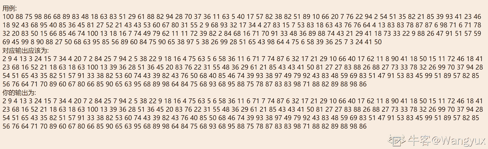
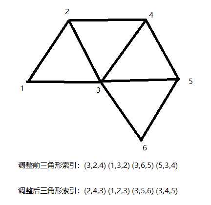
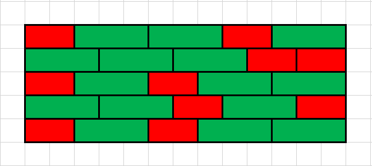
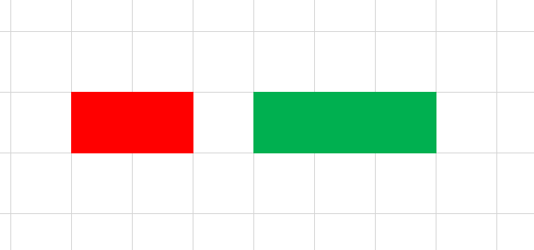
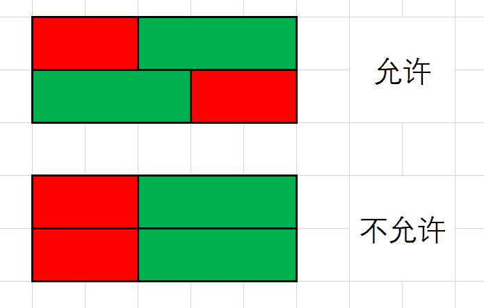
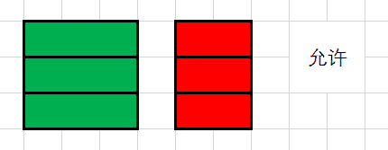
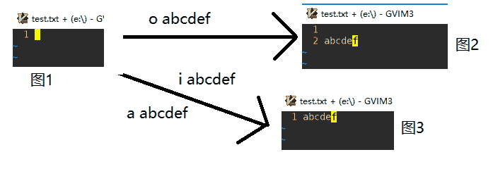
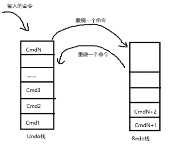
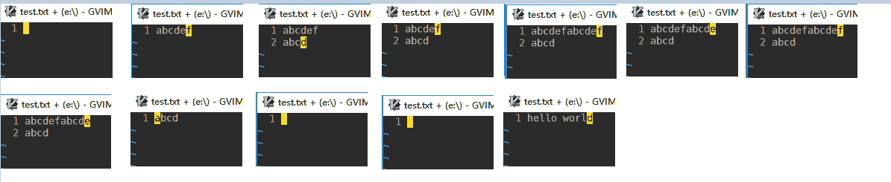

# 网易互娱雷火事业群笔试-游戏研发工程师（第二批）

## 1

【注意：本题按通过的 Case 比例给分】
给定 N 个矩形，每个矩形宽 W 米高 H 米请按以下规则将这 N 个矩形排序，输出排序后的矩形列表

排序规则：
面积小的矩形排在面积大的矩形前面
面积相同的矩形，按照宽高比排序，宽高比大的矩形排在宽高比小的矩形前面
宽高比的定义为 min(W/H, H/W)
面积和宽高比都相同的矩形，按照宽排序，宽度更小的矩形排在宽度更大的矩形前面

本题知识点

游戏研发工程师 网易雷火

讨论

[TCPMcR](https://www.nowcoder.com/profile/106712137)

4ms 376k

```cpp
#include <bits/stdc++.h>
using namespace std;

#define INF 1e-9

struct node {
    int w, h;
};

bool cmp(node a, node b) {
    if (a.w * a.h < b.w * b.h) return true;
    else if (a.w * a.h > b.w * b.h) return false;
    else {
        double wa = a.w, ha = a.h, wb = b.w, hb = b.h;
        double v1 = min(wa / ha, ha / wa);
        double v2 = min(wb / hb, hb / wb);
        if (v1 - v2 < -INF) return false;
        else if (v1 - v2 > INF) return true;
        else {
            if (a.w < b.w) return true;
            else return false;
        }
    }
}

int main() {

    int n;
    scanf("%d", &n);
    vector<node> res(n);
    for (int i = 0; i < n; ++i) {
        scanf("%d%d", &res[i].w, &res[i].h);
    }
    sort(res.begin(), res.end(), cmp);
    for (int i = 0; i < n; ++i) {
        i == n - 1 ? printf("%d %d\n", res[i].w, res[i].h) : printf("%d %d ", res[i].w, res[i].h);
    }

    return 0;
}
```

 发表于 2020-06-19 20:38:50

* * *

[看海的小宇~](https://www.nowcoder.com/profile/926914251)

```cpp
import java.util.Arrays;
import java.util.Scanner;

public class Main {
    public static void main(String[] args) {
        Scanner sc = new Scanner(System.in);
        int n = sc.nextInt();
        int[] w = new int[2*n];
        for (int i = 0; i <2*n ; i++) {
            w[i] = sc.nextInt();
        }

        for (int i = 0; i <2*n ; i+=2) {
            for (int j = i+2; j <2*n ; j+=2) {
                if(w[j]*w[j+1]<w[i]*w[i+1]){
                    swap(w,j,i);
                    swap(w,j+1,i+1);
                }else if ((w[j]*w[j+1]==w[i]*w[i+1])&&(Math.min(w[j]/w[j+1],w[j+1]/w[j])>Math.min(w[i]/w[i+1],w[i+1]/w[i]))){
                    swap(w,j,i);
                    swap(w,j+1,i+1);
                }else if ((w[j]*w[j+1]==w[i]*w[i+1])&&(Math.min(w[j]/w[j+1],w[j+1]/w[j])==Math.min(w[i]/w[i+1],w[i+1]/w[i]))&&w[j]<w[i]){
                    swap(w,j,i);
                    swap(w,j+1,i+1);
                }
            }
        }
        for (int i = 0; i < 2*n ; i++) {
            if(i!=2*n-1) {
                System.out.print(w[i] + " ");
            }else {
                System.out.print(w[i]);
            }
        }

    }

    public static void swap(int[] arr,int i,int j){
        int t = arr[i];
        arr[i] = arr[j];
        arr[j] = t;
    }

}
```

 哪里有错???????? 

编辑于 2020-05-12 15:58:59

* * *

[牛客 585309717 号](https://www.nowcoder.com/profile/585309717)

```cpp
#include <iostream>
#include <vector>
#include <algorithm>
#include <utility>

using namespace std;

bool cmp1(pair<int, int>a, pair<int, int>b) {//根据面积排序
	return a.first*a.second < b.first*b.second;
}

bool cmp2(pair<int, int>a, pair<int, int>b) {//根据宽高比排序
	int t1 = a.first, t2 = a.second, t3 = b.first, t4 = b.second;
	if (t1 > t2) swap(t1, t2);
	if (t3 > t4) swap(t3, t4);
	return t1 * t4 > t3 * t2;
}

bool cmp3(pair<int, int>a, pair<int, int>b) {//根据宽度排序
	return a.first < b.first;
}
int main() {
	int N;
	pair<int, int>matrix;
	vector<pair<int, int>>que;
	cin >> N;
	for (int i = 0; i < N; ++i) {
		cin >> matrix.first >> matrix.second;
		que.push_back(matrix);
	}
	stable_sort(que.begin(), que.end(), cmp3);//sort 会改变元素的相对位置
	stable_sort(que.begin(), que.end(), cmp2);
	stable_sort(que.begin(), que.end(), cmp1);
	for (int i = 0; i < N; ++i) {
		cout << que[i].first << ' ' << que[i].second << ' ';
	}
	return 0;
}

```

运行时间 2ms，占用内存 396KB 能用 STL 就坚决不自己写。为了避免浮点数运算的技术陷阱，尽量把减除改成加乘，或者干脆弄成整数再算。

发表于 2021-08-08 14:00:12

* * *

## 2

【注意：本题按通过的 Case 比例给分】
三角网格是计算机图形学中表示物体的常用形式，我们常用一个顶点索引和三角形索引表示具体网格。在一个三角网格中，如果两个三角形共用同一条边则称这两个三角形是相连的，如果一个三角网格的任意两个三角形都直接或间接相连，则称这个三角网格是连通的。
如果一个三角网格可以展开成平面图，这称这个三角网格为平面三角网格，在平面三角网格中，单个三角形的顶点可以有顺时针或者逆时针两种排列，代表了三角形两种不同的朝向。
给定一个 N 个顶点，M 个三角形组成的平面连通三角网格，需要你调整所有三角形索引的顶点顺序，使得所有三角形都和输入的第一个三角形具有相同的朝向，并且在每个三角形内部，序号最小的顶点放在首位。


本题知识点

游戏研发工程师 网易雷火

讨论

[牛客 311818866 号](https://www.nowcoder.com/profile/311818866)

这题能不来来个明白人说说啥意思

发表于 2021-09-17 20:26:21

* * *

[cxcxc](https://www.nowcoder.com/profile/269228156)

```cpp
#include<iostream>
#include<vector>
using namespace std;

//找出三角形最小顶点位置
int minx(vector<int> tri){
    if(tri[0] < tri[1] && tri[0] < tri[2]){
        return 0;
    }
    else if(tri[1] < tri[0] && tri[1] < tri[2]){
        return 1;
    }
    else return 2;
}
//将三角最小顶点位置移动到头部
void move(vector<int> &tri){
    int x = minx(tri);
    if(x == 1){
        int temp = tri[0];
        tri[0] = tri[1];
        tri[1] = tri[2];
        tri[2] = temp;
    }
    if(x == 2){
        int temp = tri[1];
        tri[1] = tri[0];
        tri[0] = tri[2];
        tri[2] = temp;
    }
    return;
}
//调换三角形三个顶点顺序
void change(vector<int> &tri){
    int temp = tri[0];
    tri[0] = tri[2];
    tri[2] = temp;
    return;
}

void func(int num,vector<vector<int>> &triangle){
    move(triangle[num]);//将当前三角形最小顶点到开头，其他顶点也相应变换
    triangle[num][3] = 1;//表明该三角形已经修改过
    for(int i = 0; i < triangle.size(); i++){
        //对于遍历、修改过的三角形
        if(triangle[i][3] == 1) continue;
        else{
            for(int j = 0; j < 3; j++){
                //该三角形与 num 三角形相邻且旋转顺序相反
                if((triangle[i][j%3] == triangle[num][0] && triangle[i][(j+1)%3] == triangle[num][1])
                  ||(triangle[i][j%3] == triangle[num][1] && triangle[i][(j+1)%3] == triangle[num][2])
                  ||(triangle[i][j%3] == triangle[num][2] && triangle[i][(j+1)%3] == triangle[num][0])){
                    //调换顺序
                    change(triangle[i]);
                    //把最小的放在最前面
                    func(i,triangle);
                }
                //该三角形与 num 三角形相邻且旋转顺序相同
                else if((triangle[i][j%3] == triangle[num][1] && triangle[i][(j+1)%3] == triangle[num][0])
                  ||(triangle[i][j%3] == triangle[num][2] && triangle[i][(j+1)%3] == triangle[num][1])
                  ||(triangle[i][j%3] == triangle[num][0] && triangle[i][(j+1)%3] == triangle[num][2])){
                    func(i,triangle);
                }
                //该三角形与 num 三角形不相邻 不管
            }
            //for 遍历一个三角形
        }
    }//for 遍历所有三角形
    return;
}

int main(){
    int N,M;
    scanf("%d%d",&N,&M);
    vector<vector<int>> triangle(M,vector<int>(4,0));
    int m = 0;
    while(m < M){
        scanf("%d%d%d",&triangle[m][0],&triangle[m][1],&triangle[m][2]);
        m++;
    }
    func(0,triangle);
    m=0;
    while(m < M){
        cout << triangle[m][0] <<" "<< triangle[m][1] << " " << triangle[m][2] << endl;
        m++;
    }
    return 0;
}
```

发表于 2020-12-10 21:41:13

* * *

[Zaneking](https://www.nowcoder.com/profile/544940433)

注意好 ai,bi,ci 的方向即可，类似于 bfs 扩展，注意分类讨论。时间复杂度 n²，数据比较小，一般是能过的#include<iostream>#include<algorithm>
#include<map>
#include<cstring>
using namespace std;
struct node
{
    int ai;
    int bi;
    int ci;
};
int main()
{
    int N;
    int M;
    cin>>N>>M;
    node n[M+1];
    //cout<<"***"<<endl;
    int visited[N+1][N+1];
    for(int i=0;i<M;i++)
    {
        int ai,bi,ci;
        cin>>ai;
        int pos=0;
        int pos_val=ai;
        cin>>bi;
        if(bi<pos_val)
        {
            pos=1;
            pos_val=bi;
        }
        cin>>ci;
        if(ci<pos_val)
        {
            pos=2;
            pos_val=ci;
        }
        if(pos==0)
        {
            n[i].ai=ai;
            n[i].bi=bi;
            n[i].ci=ci;
        }
        else if(pos==1)
        {
            n[i].ai=bi;
            n[i].bi=ci;
            n[i].ci=ai;
        }
        else
        {
            n[i].ai=ci;
            n[i].bi=ai;
            n[i].ci=bi;
        }
    }
    int flag=M;
    int record[M+1];
    memset(record,0,sizeof(record));
    memset(visited,0,sizeof(visited));
    int pos=0;
    //cout<<"***"<<endl;

    while(flag!=0)
    {
        if(record[pos]==0)
        {
            //cout<<pos<<endl;
            if(pos==0)
            {
                visited[n[pos].ai][n[pos].bi]=1;
                visited[n[pos].bi][n[pos].ci]=1;
                visited[n[pos].ci][n[pos].ai]=1;
                visited[n[pos].bi][n[pos].ai]=2;
                visited[n[pos].ci][n[pos].bi]=2;
                visited[n[pos].ai][n[pos].ci]=2;
                record[pos]=1;
                flag--;
            }
            else
            {
               if(visited[n[pos].bi][n[pos].ci]!=0)
               {
                   if(visited[n[pos].bi][n[pos].ci]==1)
                   {
                       int temp=n[pos].bi;
                       n[pos].bi=n[pos].ci;
                       n[pos].ci=temp;
                   }
                   visited[n[pos].ai][n[pos].bi]=1;
                    visited[n[pos].bi][n[pos].ci]=1;
                    visited[n[pos].ci][n[pos].ai]=1;
                    visited[n[pos].bi][n[pos].ai]=2;
                    visited[n[pos].ci][n[pos].bi]=2;
                    visited[n[pos].ai][n[pos].ci]=2;
                   record[pos]=1;
                   flag--;
               }
               else
               {
                   if(visited[n[pos].ci][n[pos].ai]!=0)
                   {
                       if(visited[n[pos].ci][n[pos].ai]==1)
                       {

                           int temp=n[pos].bi;
                           n[pos].bi=n[pos].ci;
                           n[pos].ci=temp;

                       }
                       visited[n[pos].ai][n[pos].bi]=1;
                        visited[n[pos].bi][n[pos].ci]=1;
                        visited[n[pos].ci][n[pos].ai]=1;
                        visited[n[pos].bi][n[pos].ai]=2;
                        visited[n[pos].ci][n[pos].bi]=2;
                        visited[n[pos].ai][n[pos].ci]=2;
                       record[pos]=1;
                       flag--;
                   }
                   else
                   {
                       if(visited[n[pos].ai][n[pos].bi]!=0)
                       {
                           if(visited[n[pos].ai][n[pos].bi]==1)
                           {

                               int temp=n[pos].bi;
                               n[pos].bi=n[pos].ci;
                               n[pos].ci=temp;

                           }
                           visited[n[pos].ai][n[pos].bi]=1;
                            visited[n[pos].bi][n[pos].ci]=1;
                            visited[n[pos].ci][n[pos].ai]=1;
                            visited[n[pos].bi][n[pos].ai]=2;
                            visited[n[pos].ci][n[pos].bi]=2;
                            visited[n[pos].ai][n[pos].ci]=2;
                           record[pos]=1;
                           flag--;
                       }
                   }
               }
            }
        }
        pos=(pos+1)%M;
    }

    for(int i=0;i<M;i++)
    {
        cout<<n[i].ai<<" "<<n[i].bi<<" "<<n[i].ci<<endl; 
    }

}

发表于 2021-12-16 15:50:10

* * *

## 3

【注意：本题按通过的 Case 比例给分】
钱老板去国外度了个假，刚回到公司就收到了 n 封催促工作完成的邮件。每项工作都有完成截止日期 deadline，钱老板做每项工作都会花去 cost 天，而且不能中断。
请你帮钱老板安排一下完成工作的顺序，以减少总的工作推迟时间。

本题知识点

游戏研发工程师 网易雷火

讨论

[金际一线天](https://www.nowcoder.com/profile/9845954)

感谢评论区提供的思路,特地去学习了状态压缩 DP 的思路,算现学现卖吧

*   dp[1 << 20] : 保存每个状态下的推迟时间
*   sum[1 << 20] : 保存每个状态下的花费的天数

```cpp
#include <iostream>
#include <vector>
#include <utility>
#include <cstring>
#include <cstdlib>
#include <algorithm>
#define INF 0x3f3f3f3f
using namespace std;

int dp[1 << 20], sum[1 << 20];

int main(int argc, char* argv[]){

    using pair_t = pair<int, int>;
    int n;
    cin >> n;
    vector<pair_t> works(n);
    const int maxn = (1 << n);
    memset(dp, INF, sizeof(dp));
    dp[0] = 0;
    for(int i = 0; i < n; i++) cin >> works[i].first >> works[i].second;
    for(int i = 0; i < maxn; i++){
        for(int j = 0; j < n; j++){
            if(!(i & (1 << j))) {
                int u = i | (1 << j);
                sum[u] = sum[i] + works[j].second;
                dp[u] = min(dp[u], dp[i] + max(0, sum[u] - works[j].first));
            }
        }
    }
    cout << dp[maxn-1] << endl;
    return 0;
}
```

编辑于 2020-08-07 16:47:45

* * *

[yQpy.](https://www.nowcoder.com/profile/79816031)

```cpp
n=int(input())
a=[]
for _ in range(n): a.append(list(map(int,input().split())))
cache={}
def dfs(d,k):
    if k in cache:return cache[k]
    if k==(1<<n)-1:return 0
    res=1e9
    for i in range(n):
        if 1<<i&k!=0:continue
        res=min(res,dfs(d+a[i][1],k|1<<i)+max(0,a[i][1]+d-a[i][0]))
    cache[k]=res
    return res
print(dfs(0,0))
```

AC 85%

```cpp
#include "stdafx.h"
#include <iostream>
#include <vector>
#include <map>
#include <algorithm>
using namespace std;
int n = 0;
vector<pair<int, int>> a(25);
map<int, int> cache;
int dfs(int d, int k){
	if (cache.find(k) != cache.end()) return cache[k];
	if (k == (1 << n) - 1) return 0;
	int res = 1e9;
	for (int i = 0; i < n; i++){
		if (((1 << i)&k) != 0) continue;
		res = min(res, dfs(d + a[i].second, k | (1 << i)) + max(0, a[i].second + d - a[i].first));
	}
	cache[k] = res;
	return res;
}
int main()
{
	a.clear();
	cache.clear();
	cin >> n;
	for (int i = 0; i < n; ++i) cin >> a[i].first >> a[i].second;
	cout << dfs(0, 0);
	return 0;
}

```

AC 90%

*   cache[d,k] 中 d 代表现在是第几天。k 代表任务的集合。
*   cache[d,k]表示做完 k 任务集合里面所有任务所需要推迟的最短时间。
*   对推过程见代码。

编辑于 2020-08-11 18:55:20

* * *

[.201909162145527](https://www.nowcoder.com/profile/699501595)

用例:
2
34 74
43 57

对应输出应该为:

111

你的输出为:

88 这个有问题啊，怎么都得不到 111 啊，88 才是对的吧

发表于 2020-06-12 15:01:03

* * *

## 4

【注意：本题按通过的 Case 比例给分】
分数的分子和分母为互质数的分数叫最简分数。 最简分数的分数的分子与分母没有除 1 以外的其他公约数。 最简分数又叫既约分数，既约分数可理解成已经约分过的分数，也就是分子和分母是互质数的分数。例如：
2/3, 1/10, 99/100 等等都是最简分数
而
2/4, 5/10, 20/30 等等都不是最简分数

对于任意一个正整数 N，以 N 为分母并以小于等于 N 的正整数作为分子的分数都有 N 个
例如，当 N=6 时，一共有以下 6 个分数：
1/6, 2/6, 3/6, 4/6, 5/6, 6/6
其中的最简分数有两个，分别是：
1/6, 5/6

我们定义一个叫做“最简分数比”的函数 F，这个函数的定义是：

F(x) = (以 x 为分母并以小于等于 x 的正整数作为分子的最简分数个数) / x

例如，F(6) = 2/6 ~= 0.333333

在这个问题中，只有一个输入数据 N，请计算出所有小于等于 N 的正整数中，最小的 F(n)数值，换句话说，对 1 到 N 的所有正整数 x 都计算 F(x)并找出这 N 个 F 值中的最小值 Fmin

本题知识点

游戏研发工程师 网易雷火

讨论

[tentes](https://www.nowcoder.com/profile/417360412)

简单来说，质因子种类越多的数越可能产生非最简分数，从而使 F(x)越小。因此，我们可以得到一串序列：1、2（1 * 2）、6（1*2*3）、30（1*2*3*5）……这些数就是对应范围内使得 F(x)最小的数。本答案在本地事先计算出每一个数的 F(x)值，存储在数组中并根据输入的 n 确定输出。 ```cpp
#include <iostream>
#include <iomanip>
using namespace std;

int main()
{
    int n;
    cin >> n;

    int target[10] = {1, 2, 6, 30, 210, 2310, 30030, 510510, 9699690, 223092870};
    double result[10] = {1.000000, 0.500000, 0.333333, 0.266667, 0.228571, 0.207792, 0.191808, 0.180525, 0.171024, 0.163588};

    int i = 0;
    if (n >= target[9])
        cout << "0.163588" << endl;
    else
    {
        while (n >= target[i])
            i++;
        cout << setiosflags(ios::fixed) << fixed << setprecision(6) << result[i - 1] << endl;
    }

    return 0;
}
``` 

发表于 2021-03-31 14:24:10

* * *

[牛客 616556522 号](https://www.nowcoder.com/profile/616556522)

你真牛逼

发表于 2021-03-30 19:25:02

* * *

[gywy](https://www.nowcoder.com/profile/151698285)


直觉上看，n 的质因子个数越多，这个比例越小。
其次，质因子越小，这个比例越小。
另外，因式分解中每个质因子的次数对欧拉函数没有影响。

因此，可以贪心来做，选择从 2 开始连续的质数，使得这些质数的乘积小于等于 n。

（贪心的正确性暂时没有想出怎么证明）

```cpp
#include <iostream>
using namespace std;
const int N = 100010;
bool st[N];
int primes[N], cnt, n;
int main() {
    scanf("%d", &n);
    for (int i = 2; i < N; i ++) {
        if (!st[i]) primes[cnt ++] = i;
        for (int j = 0; primes[j] < N / i; j ++) {
            st[i * primes[j]] = true;
            if (i % primes[j] == 0) break;
        }
    }
    int up = 1;
    int down = 1;
    for (int i = 0; i < cnt; i ++) {
        if ((long long)down * primes[i] <= n) down *= primes[i], up *= primes[i] - 1;
        else break;
    }
    double ratio = (double) up / (double) down;
    printf("%.6lf\n", ratio);
    return 0;
}
```

编辑于 2020-05-18 19:47:03

* * *

## 5

【注意：本题按通过的 Case 比例给分】


小军接到一项工作，要用红色和绿色两种砖块建一面宽度 W 高度 H 的墙

小军只有以下两种砖块可以用：



红色砖块宽度 2，高度 1

绿色砖块宽度 3，高度 1

每种砖块只能按照以上的横向摆放，不能竖起来

横向两块方块之间是有缝的，因此为了让建好墙更稳固，小军会避免在任意相邻的两行间，除了左右两侧以外，出现任何上下对齐的砖缝，请参看下图：

上面一种建造方式是允许的，而下面一种建造方式不允许特别的，下面这两种宽度为 3 和 2 的墙也是允许的 

给定一面墙的宽度和高度后，请帮小军计算在以上规则允许的前提下，一共有多少种不同的建墙方式

本题知识点

游戏研发工程师 网易雷火

讨论

[Cyan1956](https://www.nowcoder.com/profile/487142704)

[[编程题]小军砌墙 难得离谱 讲的明白 位运算+动态规划](https://blog.csdn.net/Cyan1956/article/details/106060789)

这套题真的难的离谱，2 小时做完的都是些什么神仙？

截止 5 月 11 日，还没有题解，就让我来抛砖引玉吧。

首先咱们最容易想到的是类似 dfs 那种递归算法，这个我也贴在后面了，但是超时了。

我重点来讲解下面的 位运算+动态规划 算法。

首先我们来考虑铺一行的可能性，我们定义一个函数 f(pos int)来从 pos 位置开始铺砖，那么：
1.我们可以铺一块 2 格的红砖，然后调用 f(pos+2)
2.我们可以铺一块 3 格的绿砖，然后调用 f(pos+3)

然后在递归搜索的过程中用什么记录状态呢，可以用 bool 值数组来记录，为 1 表示一块转结束的位置。
例如 w=9 时可以得到下列状态码：
S1:010101001
S2:010100101
S3:010010101
S4:001010101
S5:001001001

要存储这样的状态码可能最容易想到的是 bool 数组，但是注意到题干里限制了 2 <= W <= 30，因此咱们可以大胆一点，可以使用 int32 来作为 32 位 bool 来用，省空间是小事，主要是后面我们需要对比两行的间隙，相比与遍历两个 bool 数组，直接对两个 int32 进行 位与 效率就高多了。

好了，咱们现在有了铺满 9 格的 5 种可行的状态码，那么只有一行的时候每种状态码都只可能出现 1 次，咱们可以建立一个数组 dp[5]来记录每种状态码可能出现的次数，其中每个元素均为 1。

那多行呢？题干要求相邻的两行不能出现任何上下对齐的砖缝。
那怎么判断缝隙对没对齐呢？很简单，位与一下。
比如我们当时按 S1 铺第 1 行，按 S3 铺第 2 行是否符合要求？
只需要将两个状态码 位与，得 S:010000001，除了末尾，中间有一处对齐了，因此非法。
如果两个状态码 位与 得 S:000000001，则中间没有对齐的缝隙，这个组合是合法的。

进一步，我们可以根据上一行的可能性数组和状态转移来计算。
例如，容易判断 S2,S3->S5 可行，那么这一行按照 S5 来铺的可能性等于上一行按 S2，S3 来铺的可能性之和，实际上就是运用动态规划的思想。

下面是 Golang 代码，没有什么高级语法，就算你学的 Java/Python 等应该也都能读懂。

如果这篇解答对你有帮助，不妨点个赞吧！

```cpp
//位运算+动态规划
package main

import "fmt"

var w,h int

//可行的间隙码
var gaps []int

//铺一行
func f(pos int,gap int){
    if pos>w{            //越界
        return
    }else if pos==w{    //已铺完
        gaps=append(gaps, gap)
    }else{                //未铺完
        f(pos+2,gap<<2+1)
        f(pos+3,gap<<3+1)
    }
}

func main() {
    fmt.Scan(&w,&h)

    //不多于三行只有一种可能性
    if w<=3{
        fmt.Println(1)
        return
    }

    //开始搜索可行状态码
    f(0,0)

    //输出可行的间隙码
    //for _,v:=range gaps{
    //    fmt.Printf("S%d:%09b\n",i+1,v )
    //}

    //dp[i]表示当前行按照 S[i]来铺的可能性
    dp:=make([]int, len(gaps))

    //初始化，单行的时候每一种状态均为 1
    for i:=0;i< len(dp);i++{
        dp[i]++
    }

    //动态规划
    for i:=1;i<h;i++{
        tmp:=make([]int, len(gaps))
        for j:=0;j< len(dp);j++{
            for k:=0;k< len(dp);k++{
                if gaps[j]&gaps[k]==1 {
                    tmp[k]+=dp[j]
                }
            }
        }
        dp=tmp
    }

    //可能性求和
    ans:=0
    for _,v:=range dp{
        ans+=v
    }
    fmt.Println(ans)
}
```

```cpp
//暴力搜索
package main

import "fmt"

var w,h int

type list []int

func (l list)has(i int) bool {
    for _,v:=range l{
        if v==i{
            return true
        }
    }
    return false
}

func f(line,pos int,preGaps,curGaps []int) int {
    if list(preGaps).has(pos) || pos>=w-1 || line>=h {
        return 0
    }else {
        ans:=0
        curGaps= append(curGaps, pos)
        if pos<w-3{
            ans+= f(line,pos+2,preGaps,curGaps)
            ans+= f(line,pos+3,preGaps,curGaps)
            return ans
        }else{
            if line==h-1{
                ans++
            }else{
                ans+= f(line+1,2,curGaps,make([]int,0))
                ans+= f(line+1,3,curGaps,make([]int,0))
            }
        }
        curGaps=curGaps[:len(curGaps)-1]
        return ans
    }
}

func main() {
    fmt.Scan(&w,&h)
    if w<=3{
        fmt.Println(1)
        return
    }
    ans:=0
    ans+=f(0,2,make([]int,0),make([]int,0))
    ans+=f(0,3,make([]int,0),make([]int,0))
    fmt.Println(ans)
}
```

发表于 2020-05-11 19:27:54

* * *

[yQpy.](https://www.nowcoder.com/profile/79816031)

*   dfs1 用于求每一层总共的砌砖方法。

例如 w=9 时可以得到下列砌砖方法： S1:010101001
S2:010100101
S3:010010101
S4:001010101
S5:001001001 *   dp[i][j]表示第 i 层中第 j 种砌砖的方法总共有多少种摆法。
*   dp[i][j]=sum(dp[i-1][k])  其中 k 是上一层中所有与 j 满足除了末尾都不重叠的砌法。例如 S2,S3 与 S5。

**下面贴出 c++和 python 版本，python 日常超时** 

```cpp
#include <iostream>
#include <vector>
#include <algorithm>
using namespace std;
int w, h;
vector<int> state;
long long dp[15][2000];
void dfs1(int i, int now, vector<int>& state){
	if(((1<<w)&now)!=0){state.push_back(now); return; }
	vector<int> a = { 2, 3 };
	for (auto &x :a){
		if (i + x>w) continue;
		int mask = 1 << (i + x);
		dfs1(i + x, now | mask, state);
	}
}
int main(){
	cin >> w >> h;
	for (int i = 0; i < 15; i++)
	for (int j = 0; j < 2000; j++)
		dp[i][j] = 1;
	dfs1(0, 0, state);
	int n = state.size();
	long long res = 0;
	for (int i = 1; i<h; i++)
	for (int j = 0; j < n; j++)
	{
		dp[i][j] = 0;
		for (int k = 0; k < n; k++){
			if ((state[k] & state[j]) != (1 << w)) continue;
			dp[i][j] += dp[i - 1][k];
		}
	}
	for (int i = 0; i < n; ++i) res += dp[h - 1][i];
	cout << res;
	return 0;
}

```

```cpp
w,h=map(int,input().split())
state=[]
def dfs1(i,now):
    if 1<<w & now !=0:
        state.append(now)
        return
    for x in [2,3]:
        if i+x>w: continue
        mask=1<<(i+x)
        dfs1(i+x,now|mask)
dfs1(0,0)
dp=[[1]*len(state) for _ in range(h)]
for i in range(1,h):
    for j in range(len(state)):
        dp[i][j]=0
        for k in range(len(state)):
            if state[k]&state[j]!=1<<w:continue
            dp[i][j]+=dp[i-1][k]
res=0
for i in range(len(state)): res+=dp[h-1][i]
print(res)
```

编辑于 2020-08-11 01:08:11

* * *

[bill201903142152402](https://www.nowcoder.com/profile/175391207)

例如 w=9 时可以得到下列砌砖方法： S1:010101001
S2:010100101
S3:010010101
S4:001010101
S5:001001001

```cpp
#include<iostream>
#include<vector>
using namespace std;
int w,h;
vector<int >state;
vector<int >block = {2,3}; 
//穷举所有可能的组合
void dfs(int pos, int cur_state, vector<int>& state ) {
    if( (1<<w)& cur_state ) state.push_back(cur_state);
    else {
        for(auto& i : block){
            if( pos + i > w )continue;      //如果往后面添加一块砖超过宽度就舍弃
            dfs(pos + i, cur_state | (1<< (pos + i)), state);  //未越界就添加
        }
    }
}
int main() {
    cin >> w >> h;
    dfs(0, 0, state);
    int total_kinds = state.size();     //所有排列可能的种类
    vector<vector<long long>> dp(h, vector<long long >(total_kinds, 0));   //dp[i][j] --代表第 i 行第 j 中排列方式可能出现的情况

      //第一行无限制，所有每种排列可能出现的情况都是 1
    for(int i = 0; i < total_kinds; ++i) {
        dp[0][i] = 1;
    }
    //从第二行开始，遍历每种情况和 state 库里的情况对比
    for(int i = 1; i < h; ++i) {
        for(int j = 0; j < total_kinds; ++j) {
            for(int k = 0; k < total_kinds; ++k){
                if( (state[j] & state[k]) != (1 << w) )continue;  //将两个状态码位与，除了末尾，还有一处对齐，非法舍弃。
                dp[i][j] += dp[i-1][k];    //合法情况，累加起来
            }
        }
    }
    long long ans = 0;
    for(int i = 0; i < total_kinds; ++i) {
        ans += dp[h-1][i];
    }
    cout<<ans;
}
```

 编辑于 2022-03-17 11:58:12

* * *

## 6

【注意：本题按通过的 Case 比例给分】 本题需要让你实现一个类似 vi 的基于命令模式的文本编辑器，但仅需要少数几个命令。

先介绍一下光标(上图中最左边的是编辑器显示的行号，用来展示用，并不是文本真正的内容，请忽略)：

1.该编辑器里的光标是类似 vi 编辑器里命令模式那样，停留在一个字符上方，而不是字符与字符之间。

2.编辑器文本为空的时候（初始时，或者把内容全部删除以后），会显示一个空行，光标停留在那行行首（如图 1）。此时执行 o 命令的话，在下方插入一行（如图 2）。

3.当光标停留在一个空行的时候，光标会显示在行首，但此时执行 i 命令和 a 命令的效果是一样的（如图 3）。  再介绍一下撤销（undo）和重做(redo)命令：

1.编辑器的 undo 和 redo 操作跟 vi 编辑器的一样，是一个基于栈式的撤销功能。每当玩家输入一个命令的时候，如果可撤销的话（见第二条），就该操作压进 Undo 栈里，栈的大小为无限大，允许撤销全部的操作。

2.只有真正改变编辑器内文本的命令才会进入 Undo 栈，比如 g 命令，以及未对文本发生修改的 d 命令，还有 undo、redo 命令本身都是不可撤销的，即不会进入 Undo 栈。

3.当执行 undo 命令的时候，如果 Undo 栈里有元素，则从栈顶弹出最后一个命令，撤销掉该命令，光标回到执行该命令前的位置，并且将命令压入 Redo 栈里。

4.当执行 redo 命令的时候，如果 Redo 栈里有元素，则从栈顶弹出最后一个被撤销的命令，重新执行该命令，光标回到执行该命令后的位置，并且将命令重新压入 Undo 栈里。

5.当执行 undo 或 redo 命令的时候，如果相应的栈里没有元素，则不进行任何操作，忽略该命令。

6.当执行任何输入的命令的时候，都会清空 Redo 栈，即用 undo 撤销一个命令 C 的时候，再执行输入的其他命令以后，则不能再用 redo 功能重做上一次撤销的命令 C。

完整的命令列表为：

 g x y： 移动光标命令，将光标移动到第 x 行，第 y 列上方。当 x 超过总行数时，则为最后一行。当 y 超过该行列数的时候，则为最后一列。

i str：在光标所在字符前插入 str 这句话，光标最终会停留在这句话的最后一个字符上。注意，str 必定不为空，但是里面可能包含空格。

a str：在光标所在字符后插入 str 这句话，其他同上。

o str：在光标所在行的下面另起一新行插入 str 这句话，其他同上。

dd：删除光标所在行，光标最终会停留在下一行的首字符上。如果删除的是最后一行，则停留在最后一行的首字符上。

d n：从光标所在位置开始，往右删除 n 个字符（输入保证 n>0），最多只会删除到行尾，不会跨过当前行。光标最终停留在删除以后的下一个字符位置上。

undo：撤销上一个对文本发生改动的命令，光标也回到上一个命令执行前所在的位置。如果没命令可以撤销，则什么都不做。

redo：重新执行上一个撤销的命令，光标也回到上一个命令执行后所在的位置。如果没有已经撤销的命令，则什么都不做。注意，如果 undo 了一个命令，再执行新的命令，则也不能 redo。

其中命令名字与参数、参数与参数中间都是用一个空格分割

下图为测试用例例子里的的编辑器里的展示

 

本题知识点

游戏研发工程师 网易雷火

讨论

[牛客 616556522 号](https://www.nowcoder.com/profile/616556522)

太简单了,但是输入框太小了,过程写不下

发表于 2021-03-30 19:27:18

* * *

[Nagichan](https://www.nowcoder.com/profile/5412105)

shabi 网易，专门出垃圾笔试题目。首先有几个坑点，没有删除任何字符的 d 命令不会被加入 redo 栈。还有几个定义上的疏漏，敢问笔试哪个大神把这道题完美 a 出来了？爬

发表于 2022-03-03 21:49:14

* * *

[牛客 98996621 号](https://www.nowcoder.com/profile/98996621)

同样的代码，同样的输入，自测输入的结果和提交运行的结果不一样！我麻了

发表于 2022-01-26 00:32:29

* * *