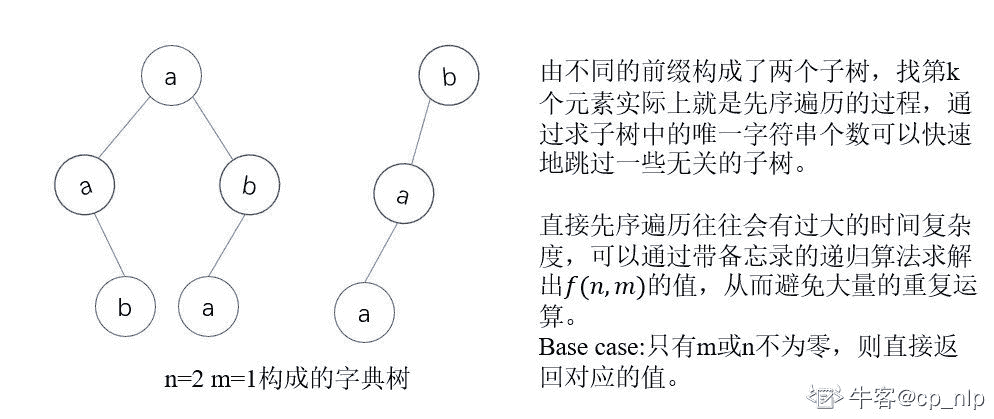

# 拼多多 2020 校招部分编程题合集

## 1

多多鸡有 N 个魔术盒子（编号 1～N），其中编号为 i 的盒子里有 i 个球。
多多鸡让皮皮虾每次选择一个数字 X（1 <= X <= N），多多鸡就会把球数量大于等于 X 个的盒子里的球减少 X 个。
通过观察，皮皮虾已经掌握了其中的奥秘，并且发现只要通过一定的操作顺序，可以用最少的次数将所有盒子里的球变没。
那么请问聪明的你，是否已经知道了应该如何操作呢？

本题知识点

Java 工程师 C++工程师 PHP 工程师 golang 工程师 前端工程师 安卓工程师 iOS 工程师 算法工程师 大数据开发工程师 信息技术岗 拼多多 2020

讨论

[Cyan1956](https://www.nowcoder.com/profile/487142704)

[CSDN [编程题]多多的魔术盒子](https://blog.csdn.net/Cyan1956/article/details/106218982)

这道题最容易想到的就是不停从中值减少，我也是这样的解法。

@牛客 625413878 号的代码非常简洁。数字转二进制，位数就是结果，太秀了,不发出来可惜了。
已经提醒本人写题解，等他写了我就删除这部分。

```cpp
n = int(input())

for i in range(n):
    x = int(input())
    print(len(bin(x))-2)
```

这是我的代码。

```cpp
package main

import "fmt"

func main() {
    var t,n int
    fmt.Scan(&t)
    for i:=0;i<t;i++{
        fmt.Scan(&n)
        ans:=1
        for ;n>1;n/=2{
            ans++
        }
        fmt.Println(ans)
    }
}
```

发表于 2020-05-19 17:24:12

* * *

[梦心尘](https://www.nowcoder.com/profile/1055306)

要用最少的次数把所有盒子减到 0，第一次必然是减少中间盒子的球数比如 1，2，3，4，5， 第一次减 3 得到 1，2，0，1，2 ,这时我们可以看到左右两边相等的，分冶求解

```cpp
import java.util.Scanner;

public class Main {
    public static void main(String[] args) {
        Scanner sc = new Scanner(System.in);
        int num = sc.nextInt();
        for (int i = 0;i<num;i++){
            int n = sc.nextInt();
            System.out.println(cal(n));
        }

    }

    public static int cal(int n){
        if (n==1) return 1;
        if (n==2) return 2;
        else return 1+cal(n/2);
    }

}
```

发表于 2020-05-20 09:31:27

* * *

[叶离殇 7](https://www.nowcoder.com/profile/876587448)

```cpp
import java.util.Scanner;
public class Main {
    public static void main(String[] args) {
        //根据规律可知，即算出该十进制的二进制表示的位数
        //比如 5，二进制表示为 101，位数为 3，则最少操作次数为 3
        Scanner sc = new Scanner(System.in);
        //接收测试用例个数
        int count = sc.nextInt();
        //创建数组接收
        int[] nums = new int[count];
        //创建结果数组
        int[] ans = new int[count];
        while (sc.hasNext()){
            for (int i = 0; i <count ; i++) {
                nums[i] = sc.nextInt();
                int temp = nums[i];
                String s = Integer.toBinaryString(temp);
                ans[i] = s.length();
            }
            for (int i:ans) {
                System.out.println(i);
            }
        }
    }
}
```

通过所有用例。

发表于 2020-06-01 15:22:55

* * *

## 2

数列 {An} 为 N 的一种排列。例如 N=3，可能的排列共 6 种：

```cpp
1, 2, 3
1, 3, 2
2, 1, 3
2, 3, 1
3, 1, 2
3, 2, 1
```

定义函数 F: 其中|X|表示 X 的绝对值。现在多多鸡想知道，在所有可能的数列 {An} 中，F(N)的最小值和最大值分别是多少。

本题知识点

Java 工程师 C++工程师 PHP 工程师 golang 工程师 前端工程师 安卓工程师 iOS 工程师 算法工程师 大数据开发工程师 信息技术岗 拼多多 2020

讨论

[lobos](https://www.nowcoder.com/profile/479512186)

这是在考阅读理解吧 F(1)=A1F(2) = |F(1)-A2| =|A1-A2|F(3) = |F(2)-A3| =||A1-A2|-A3|而 A1A2A3 是 123 的某种排列当 [A1 A2 A3 ]=[3,2,1]时，带入上述公式 F(3)= ||3-2|-1|=|1-1|=0 ，是最小值当 [A1 A2 A3 ] =[2,1,3]时，带入上述公式 F(3)=||2-1|-3|=|1-3|=2, 是最大值

发表于 2021-04-27 14:15:01

* * *

[牛客 471811548 号](https://www.nowcoder.com/profile/471811548)

看了半天题目没看懂

发表于 2020-08-04 21:38:01

* * *

[梦心尘](https://www.nowcoder.com/profile/1055306)

题目一开始没读懂，意思是：在{An}的所有排列中，能让 F(N)取得的最大最小值为多少。

每四个数 例如 5，6，7，8，我们把它们两两一组 |||8-6|-7|-5|=0，最小值是 0；猜测最小值的变化也是 4 个一组

看到 min 只有 2 种取值。0，1，最大值自然就是 N-getmin(N-1)

```cpp
import java.util.Scanner;

public class Main {
    public static void main(String[] args) {
        Scanner sc = new Scanner(System.in);
        int nums = sc.nextInt();
        for (int i = 0; i<nums; i++){
            int N = sc.nextInt();
            maxandmin(N);
        }
    }

    public static void maxandmin(int N){
        if (N==1||N==2){
            System.out.println("1 1");
            return;
        }
        //之后每 4 个一组 0011
        int min = getmin(N);
        int max = N-getmin(N-1);
        System.out.println(min + " " + max);
    }

    public static int getmin(int N){
        int temp = (N-2)%4;
        if (temp==1 || temp==2){
            return 0;
        }
        else return 1;
    }

}
```

编辑于 2020-05-21 17:35:53

* * *

## 3

多多鸡打算造一本自己的电子字典，里面的所有单词都只由 a 和 b 组成。
每个单词的组成里 a 的数量不能超过 N 个且 b 的数量不能超过 M 个。
多多鸡的幸运数字是 K，它打算把所有满足条件的单词里的字典序第 K 小的单词找出来，作为字典的封面。

本题知识点

Java 工程师 C++工程师 PHP 工程师 golang 工程师 前端工程师 安卓工程师 iOS 工程师 算法工程师 大数据开发工程师 信息技术岗 拼多多 2020

讨论

[我不想当大白菜](https://www.nowcoder.com/profile/2462790)

由不同的前缀`a`和`b`构成了两个子树，找第 k 个元素实际上就是先序遍历的过程，通过求子树中的唯一字符串个数可以快速地跳过一些无关的子树。

直接先序遍历往往会有过大的时间复杂度，可以通过带备忘录的递归算法求解出 f(n,m)的值，从而避免大量的重复运算。

Base case:只有 m 或 n 不为零，则直接返回对应的值。



```cpp
# 计算包含 N 个 a 和 M 个 b 的子字典树包含的 unique 字符串的个数，从而和 K 进行
# 比较，以便选择跳过该子树或者进入该子树
count_dict = {}
def calc_subtree_str_num(N,M):
    if (N,M) in count_dict.keys():
        return count_dict[(N,M)]
    elif N == 0:
        count_dict[(N,M)] = M
    elif M == 0:
        count_dict[(N,M)] = N
    else:
        #分别以 a 和 b 得到的两个子树的个数统计加上 a 和 b 这两个节点
        count_dict[(N,M)] = calc_subtree_str_num(N-1,M) + calc_subtree_str_num(N,M-1) + 2
    return count_dict[(N,M)]

def main():
    N,M,K = list(map(int,input().split()))

    res = ""
    #当 K=0 时就找到了对应的字符串
    while K > 0:
        # 一般情况 N 和 M 都存在
        if N > 0 and M > 0:
            #获取当前情况下左子树的字符串个数，如果大于 K 说明结果在右子树
            left_str_cnt = calc_subtree_str_num(N-1, M)+1
            if K <= left_str_cnt:
                # 说明第 k 个在 a 子树下，添加字符'a'，并继续循环向下判断
                res += 'a'
                K -= 1 
                N -= 1
            else:
                # 在右子树下，K 可以跳过 left_str_cnt+1 个值，1 为左子树根节点'a'，配合上前缀也是一个 unique 的 str
                res += 'b'
                K -= (left_str_cnt + 1)
                M -= 1
        #其他情况，N=0 或者 M=0 时只需要一直添加字符即可,因为题上的说明不用考虑不存在
        elif N == 0 and M > 0:
            res += 'b'
            K -= 1
            M -= 1
        elif M == 0 and N > 0:
            res += 'a'
            K -= 1
            N -= 1
    return res

print(main())
```

发表于 2020-07-09 21:44:46

* * *

[胡胡达](https://www.nowcoder.com/profile/559369302)

```cpp
 ```
回溯不可以的话，相当 N 特别大，所以考虑用字典序在 O（N）复杂度下解决该问题。 
字典序又叫 trie 树，该算法思想在实际生活中大量应用。 
默认大家有 trie 树的基础知识，下面这种方式就是根据构建的字典序进行适当的剪枝，因为我们并不需要遍历每一颗树。 只需要通过数学公式推导出我们想要的结果在哪个子树即可。
本题相当于有两个树，以 a 开头和以 b 开头的两颗二叉树。 每一次的 cal_step 函数是返回以当前节点"a"或者"b"开头的前序遍历需要经过的步数，这个不是由动态规划得到一个 dp 二维数组，然后直接返回即可。 
这里说一下动态规划的递推公式： dp[i][j] = dp[i-1][j] + 1 + dp[i][j-1] + 1 什么意思呢？ 我看评论里也有人说了，就是返回以"a"开头的和以"b"开头的个数。 可能有人还是不理解，这个时候拿出笔来写一写就明白了。
比如 a[2][1] = dp[1][1] + dp[2][0] + 2 dp[1][1] + 1 是以"a"开头的个数，即我们可以固定一个"a"在开头
这样就少了一个 a 可以用，那么只剩下了[a,b]可以组合 即：a,ab,ba,b; 然后再和固定的 a 开头的字母"a"组合，即 aa,aab,aba,ab，这个时候组合就相当于是 dp[1][1] 
以 a 开头的组合显然少了一个"a"这个特殊的组合，显然 dp[1][1] + 1 才是以"a"开头的组合个数。
题解如下： 

```cpp line = list(map(int,sys.stdin.readline().strip().split()))
n = line[0]
m = line[1]
k = line[2]
class Solution:
    map = dict()
    def findKthNumber(self, n: int, m: int, k: int) -> int:
        # dp[i][j] 表示 i 个 a,j 个 b 所能构成的字母组合
        dp = [[0] * (m + 1) for _ in range(n + 1)]
        for i in range(n + 1):
            dp[i][0] = i
        for i in range(m + 1):
            dp[0][i] = i
        for i in range(1, n + 1):
            for j in range(1, m + 1):
                # i 个 a 和 j 个 b 组成的个数为以 a 开头的和以 b 开头的加上特殊的 a 和 b
                dp[i][j] = dp[i - 1][j] + dp[i][j - 1] + 2
        def cal_step(n, m):
                return dp[n][m] + 1
        cur = "a"
        # 第一次，应该是以'a'开头的
        n -= 1
        k -= 1
        while k > 0 and (n or m):
            step = cal_step(n, m)
            if step <= k:  # k 在下一个子树中
                k -= step
                # 此时的 n,m 是为了计算 dp[m][n]
                # 一轮过后，需要计算以 b 开头的，所以 m-=1,n+=1
                n += 1
                m -= 1
                cur = cur[:-1] + "b"
            else:  # 在子树中
                k -= 1
                if n:
                    cur += "a"
                    n -= 1
                else:
                    cur += "b"
                    m -= 1
        return cur
print(Solution().findKthNumber(n, m, k)) 
```

编辑于 2020-07-02 20:57:33

* * *

[朋友你好啊](https://www.nowcoder.com/profile/9854369)

我来解释一下为什么其他回答的递归为 dp[m][n] = dp[m][n - 1] + dp[m-1][n] + 2 吧。假设 m 个 a，n 个 b：那么第一个字母为 a 的个数为 dp[m - 1][n] + 1 （额外加 1 是为了包括总长度为 1 的情况, 即'a'）那么第一个字母为 b 的个数为 dp[m][n - 1] + 1 （额外的 1 是为了包括总长度为 1 的情况，即'b'）所以，dp[m][n] = dp[m][n - 1] + dp[m-1][n] + 2。

发表于 2020-06-01 22:15:42

* * *

## 4

```cpp
扔 n 个骰子，第 i 个骰子有可能投掷出 Xi 种等概率的不同的结果，数字从 1 到 Xi。所有骰子的结果的最大值将作为最终结果。求最终结果的期望。
```

本题知识点

Java 工程师 C++工程师 PHP 工程师 golang 工程师 前端工程师 安卓工程师 iOS 工程师 算法工程师 大数据开发工程师 信息技术岗 拼多多 2020

讨论

[牛奶泡泡糖](https://www.nowcoder.com/profile/33750295)

```cpp
#这里需要懂一点概率论的知识，p(x=k)=p(x<=k)-p(x<=k-1)
#以两个筛子为例，可以转化为求联合概率分布的面积/总面积
#期望就是 p(k)*k 求和
def main(n,nums):
    total=1
    maxs=max(nums)
    ans=0
    pre=0
    for i in range(1,maxs+1):
        cur=1
        for j in range(n):
            cur*=min(i,nums[j])/nums[j]
        ans +=(cur-pre)*i
        pre=cur
    return ans

n=int(input())
nn=list(map(int,input().split()))
ans=main(n,nn)
print("%.2f" % ans)
```

以两个筛子，最大值为 2,3 为例可以得出，总概率分布的面积为 2*3=6 对 1 来说，最大值为 1 的概率就是 1*1 的正方形，概率为 cur=1/2*1/3=1/6  对 2 来说，最大值为 2 的概率就是 2*2 的正方形减去 1*1 的正方形，也就是 cur-pre=2/2*2/3-1/6 =3/6 对 3 来说，最大值为 3 的概率就是面积为 6 的长方形减去面积为 4 的情况 2，也就是 2/2*3/3-4/6 综上，求得 nums 的 max 值，对其 i 遍历           对于每个 i，计算 i 的概率 cur           ans=(cur-pre)*i

发表于 2020-07-02 17:36:52

* * *

[忘忧小仙](https://www.nowcoder.com/profile/7801587)

```cpp
def frac(a, b):
    if a > b:
        return 1
    if a <= b:
        return a / b

n = int(input())
x = list(map(int, input().split()))

m = max(x)
sum = 0
temp0 = 0
temp1 = 1
for i in range(1, m + 1):
    for j in x:
        temp1 *= frac(i, j)
    sum += (temp1 - temp0) * i
    temp0 = temp1
    temp1 = 1
print("{:.2f}".format(sum))

```

发表于 2020-08-08 14:31:49

* * *

[Cyan1956](https://www.nowcoder.com/profile/487142704)

[csdn [编程题]骰子期望](https://blog.csdn.net/Cyan1956/article/details/106217482)

这套卷子做下来感觉很难受，每道题都有思路，但是只有第一道题完美通过，做题速度堪忧。
本想把 5 道题都做了整一套题解，但是明天有华为笔试，我得去刷华为面经了，先写两道吧，剩下的后面再更新。

还是结合例子来讲。
4 颗🎲，
最大值：25 9 10 43。

因为每颗骰子的结果都是独立的，同时每一面出现的可能都是相同的，因此可以用可能性相除得概率。

总的可能性为 种。

最大值为 k（例如 k=5）的可能性怎么求呢？
我们先求所有骰子值的情况：
然后再求所有骰子值的情况：
（如果 k 大于某一个骰子的最大值 x，乘数取 x。）

那么我们将前者减去后者，就可以得到：
所有骰子值并且不全部的情况，
换句话说必定存在。

实际上得到的就是最大值为 k 的所有可能性。将一类可能性除以总的可能性得概率，概率乘数值再求和得期望。

还有一个细节值得一提，我最开始的做法是
将每一类可能性 乘以 其最大值 求和之后 再除以 总的可能性，这样会溢出。

所以不能等到最后再除，求和的过程中顺便除一下就不会溢出了。

代码是 golang，但没什么高级语法，写其他语言的应该也能轻松读懂。

```cpp
package main

import "fmt"

func min(a,b int) int {
    if a<b{
        return a
    }else {
        return b
    }
}

func main() {
    var n,num int
    total:=1
    max:=0
    //fmt.Println(min)
    var nums []int
    fmt.Scan(&n)
    for i:=0;i<n;i++{
        fmt.Scan(&num)
        if num>max{
            max=num
        }
        total*=num
        nums= append(nums,num )
    }
    var ans float64
    pre:=0.0
    for i:=1;i<=max;i++{
        cur:=1.0
        for j:=0;j<n;j++{
            cur*=float64(min(i,nums[j]))/float64(nums[j])
        }
        ans+=(cur-pre)*float64(i)
        pre=cur
    }
    fmt.Printf("%.2f",ans)
}
```

编辑于 2020-05-19 17:04:11

* * *

## 5

在一块长为 n，宽为 m 的场地上，有 n✖️m 个 1✖️1 的单元格。每个单元格上的数字就是按照从 1 到 n 和 1 到 m 中的数的乘积。具体如下 n = 3, m = 31   2   32   4   63   6   9 给出一个查询的值 k，求出按照这个方式列举的的数中第 k 大的值 v。例如上面的例子里，从大到小为(9, 6, 6, 4, 3, 3, 2, 2, 1)k = 1, v = 9k = 2, v = 6k = 3, v = 6...k = 8, v = 2k = 9, v = 1

本题知识点

Java 工程师 C++工程师 PHP 工程师 golang 工程师 前端工程师 安卓工程师 iOS 工程师 算法工程师 大数据开发工程师 信息技术岗 拼多多 2020

讨论

[✭](https://www.nowcoder.com/profile/296604434)

```cpp

```
import sys
def findMNK(m, n, k):
    #M*N 的矩阵，其数值范围在 1 到 M*N 之间,题目给出长为 n，宽(高)为 m,即矩阵为 m 行 n 列
    left, right = 1, m*n
    while left < right:#循环跳出条件为 left==right，区间左闭右开寻找
        mid = (left+right)//2#二分取中间值
        #求 N*M 的矩阵中有 cnt 个元素小于等于 mid
        #矩阵每一行的数据可以表示为[1*i,2*i,3*i,...n*i]
        cnt = 0
        #for i in range(1, m+1):
            #cnt += min(mid//i, n)
        #简化上续循环次数
        row = mid//n#根据矩阵的排列，可以直接求出前 row 行的数均小于 mid
        cnt += row*n 
        for i in range(row+1, m+1):
            cnt += mid//i
        if cnt<k:
            left = mid+1
        else:
            # 对于 cnt==k 的情况，此时的 mid 可能不在二维表中，但是此时 mid 一定比正确答案大
            right = mid
    return left
ls = [int(i) for i in sys.stdin.readline().split()]
n, m, k = ls[0], ls[1], ls[2]
k = m*n-k+1#转化为求第 m*n-k 小的数
print(findMNK(m, n, k))
```cpp

```

编辑于 2020-07-31 17:25:46

* * *

[never&doubt](https://www.nowcoder.com/profile/3579635)

置顶的二分查找思路的 java 版本，java 版本里有一个比较隐晦的 int 溢出问题，会导致 divide zero 异常,或者只有 90%AC（题目会提示出现数组越界等错误/或者只有 90%AC）

```cpp
import java.util.*;
public class Main {
    public static void problem5_2020() {
        Scanner scanner = new Scanner(System.in);
        int n = scanner.nextInt();
        int m = scanner.nextInt();
        int k = scanner.nextInt();
        int left = 1;
        int right = m * n;
        k = m * n - k + 1;
        while (left < right) {
            // 注意 int 类型溢出问题！
            int mid = (int)(((long)left + right) / 2);
            // 求小于等于 mid 的数量
            int row = mid / m;
            int count = row * m;
            for (int i = row + 1; i <= n; i++) {
                count += mid / i;
            }
            if (count < k) {
                left = mid + 1;
            } else {
                right = mid;
            }
        }
        System.out.println(left);
    }

    public static void main(String[] args) {
        problem5_2020();
    }
}
```

 编辑于 2020-08-14 11:24:43

* * *

[可乐+冰❄️](https://www.nowcoder.com/profile/374183416)

```cpp
import java.util.Scanner;

public class Main{
    public static void main(String[] args) {
        Scanner in = new Scanner(System.in);
        int N = in.nextInt();
        int M = in.nextInt();
        int K = in.nextInt();
        int l = 0;
        int h = M * N;
        //反向序号
        K = M * N - K + 1;
        while (l <= h) {
            int mid = l + (h - l) / 2;
            // 假定以 mid 作为最大数的所在行 curRow; 由矩阵的特点可知：
            // curRow 的上一行所有的数都将小于 mid，缩小查找范围
            int curRow = mid / M;
            // 同理，获取所在列 curCol；
            int curCol = mid / N;
            int cnt = curRow * M + curCol * (N - curRow);
            // 剩下右下角一个小矩形
            for (int i = curRow + 1; i <= N; i++) {
                for (int j = curCol + 1; j <= M && (i * j <= mid); j++) {
                    cnt++;
                }
            }
            if (cnt >= K) {
                h = mid - 1;
            } else {
                l = mid + 1;
            }
        }
        System.out.println(l);
    }
}
```

发表于 2020-07-30 10:04:02

* * *