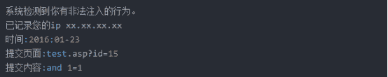

# 深信服校园招聘安全攻防 C 卷

## 1

func:        mov     ecx, eax        lea     edx, [ecx+1]loop:        mov     al, [ecx]        inc     ecx        test    al, al        jnz     loop        sub     ecx, edx        mov     eax, ecx        retreverse:        mov     ebp, eax  ;eax 为输入的参数 1        mov     edi, edx  ;edx 为输入的参数 2        mov     esi, ebx  ;ebx 为输入的参数 3        mov     eax, ebp        call    func        push    eax        xor     ebx, ebx        xor     ecx, ecx        xor     ebp, ebp        jmp     label4label1:        lea     eax, [ebp*4]        add     eax, edi        mov     eax, [eax]        cmp     eax, ecx        jbe     label2        mov     ebx, ecx        mov     ecx, eax        jmp     label3label2:        cmp     eax, ebx        jbe     label3        mov     ebx, eaxlabel3:        inc     ebplabel4:        cmp     ebp, esi        jb      label1        pop     eax        add     eax, ebx        add     eax, ecx        ret 以上为汇编码的两个函数 func 和 reverse，分析这两个函数并编写等价的 C 代码函数

你的答案

本题知识点

安全工程师 深信服

讨论

[Fabulous201903300954972](https://www.nowcoder.com/profile/654511711)

```cpp
int func(char *pchar){
	char* p = pchar + 1;
	while(*(pchar++) != 0);
	return (int)pchar - (int)p;

}
int reverse(char* pchar, int* pint, int arg3){
	int len = func(pchar);
	int i = 0, ebx = 0, ecx = 0;
	while(i < arg3){
		if(pint[i] <= ecx){
			if(pint[i] <= ebx)i++;
			else ebx = pint[i++];
		}
		else{
			ebx = ecx;
			ecx = pint[i++];
		}
	}
	len += ebx;
	len += ecx;
	return len;
}
避免麻烦，直接使用寄存器名当变量名。
```

发表于 2020-08-20 10:05:29

* * *

## 2

请回答如下端口默认对应的服务，以及在渗透测试过程中我们可以从哪些角度考虑其安全问题。

端口：21、22、873、1433、3306、6379、11211

你的答案

本题知识点

安全工程师 深信服

讨论

[赫金鹏](https://www.nowcoder.com/profile/932543048)

 | 端口 | 服务 | 说明 |
| 21 | FTP | 匿名访问\弱口令 |
| 22 | SSH | 弱口令 |
| 873 | rsync | 未授权访问\弱口令 |
| 1433 | mssql | 弱口令 |
| 3306 | mysql | 弱口令 |
| 6379 | redis | 一般无验证，直接访问 |
| 11211 | memcache | 内存泄露\未授权访问 | 

编辑于 2020-09-15 21:50:12

* * *

## 3

某系统存在防注入模块，注入时会被提示：



如何利用这个防注入系统拿 shell？

你的答案

本题知识点

安全工程师 深信服

讨论

[yuanli2021](https://www.nowcoder.com/profile/584877902)

既然回显 IP，可以尝试 burp 抓包进行 http 头部注入（X-fowarded-for 字段注入）。 尝试一句话？eval（$_post["a"]）;

发表于 2021-03-19 00:03:01

* * *

[NeptLiang](https://www.nowcoder.com/profile/2066322)

直接和面试官说上菜刀吗

发表于 2020-10-22 13:07:05

* * *

[牛客 624135866 号](https://www.nowcoder.com/profile/624135866)

****

发表于 2020-09-16 21:08:12

* * *

## 4

发现 test.jsp?id=1234 注入点，你有哪几种思路获取 webshell，哪种是优选？

你的答案

本题知识点

安全工程师 深信服

讨论

[牛客 58532540 号](https://www.nowcoder.com/profile/58532540)

通过查数据库找到一些有用的用户名，密码，去登录目标管理员账户上传 webshell。一种是直接通过 sql 写 web shell 到目标文件系统中，但是要求有 root 权限以及写文件的权限，可以通过查询来看是否有权限。一般第二种写文件是优选

发表于 2020-10-15 01:06:22

* * *

## 1

func:        mov     ecx, eax        lea     edx, [ecx+1]loop:        mov     al, [ecx]        inc     ecx        test    al, al        jnz     loop        sub     ecx, edx        mov     eax, ecx        retreverse:        mov     ebp, eax  ;eax 为输入的参数 1        mov     edi, edx  ;edx 为输入的参数 2        mov     esi, ebx  ;ebx 为输入的参数 3        mov     eax, ebp        call    func        push    eax        xor     ebx, ebx        xor     ecx, ecx        xor     ebp, ebp        jmp     label4label1:        lea     eax, [ebp*4]        add     eax, edi        mov     eax, [eax]        cmp     eax, ecx        jbe     label2        mov     ebx, ecx        mov     ecx, eax        jmp     label3label2:        cmp     eax, ebx        jbe     label3        mov     ebx, eaxlabel3:        inc     ebplabel4:        cmp     ebp, esi        jb      label1        pop     eax        add     eax, ebx        add     eax, ecx        ret 以上为汇编码的两个函数 func 和 reverse，分析这两个函数并编写等价的 C 代码函数

你的答案

本题知识点

安全工程师 深信服

讨论

[Fabulous201903300954972](https://www.nowcoder.com/profile/654511711)

```cpp
int func(char *pchar){
	char* p = pchar + 1;
	while(*(pchar++) != 0);
	return (int)pchar - (int)p;

}
int reverse(char* pchar, int* pint, int arg3){
	int len = func(pchar);
	int i = 0, ebx = 0, ecx = 0;
	while(i < arg3){
		if(pint[i] <= ecx){
			if(pint[i] <= ebx)i++;
			else ebx = pint[i++];
		}
		else{
			ebx = ecx;
			ecx = pint[i++];
		}
	}
	len += ebx;
	len += ecx;
	return len;
}
避免麻烦，直接使用寄存器名当变量名。
```

发表于 2020-08-20 10:05:29

* * *

## 2

请回答如下端口默认对应的服务，以及在渗透测试过程中我们可以从哪些角度考虑其安全问题。

端口：21、22、873、1433、3306、6379、11211

你的答案

本题知识点

安全工程师 深信服

讨论

[赫金鹏](https://www.nowcoder.com/profile/932543048)

 | 端口 | 服务 | 说明 |
| 21 | FTP | 匿名访问\弱口令 |
| 22 | SSH | 弱口令 |
| 873 | rsync | 未授权访问\弱口令 |
| 1433 | mssql | 弱口令 |
| 3306 | mysql | 弱口令 |
| 6379 | redis | 一般无验证，直接访问 |
| 11211 | memcache | 内存泄露\未授权访问 | 

编辑于 2020-09-15 21:50:12

* * *

## 3

某系统存在防注入模块，注入时会被提示：


如何利用这个防注入系统拿 shell？

你的答案

本题知识点

安全工程师 深信服

讨论

[yuanli2021](https://www.nowcoder.com/profile/584877902)

既然回显 IP，可以尝试 burp 抓包进行 http 头部注入（X-fowarded-for 字段注入）。 尝试一句话？eval（$_post["a"]）;

发表于 2021-03-19 00:03:01

* * *

[NeptLiang](https://www.nowcoder.com/profile/2066322)

直接和面试官说上菜刀吗

发表于 2020-10-22 13:07:05

* * *

[牛客 624135866 号](https://www.nowcoder.com/profile/624135866)

****

发表于 2020-09-16 21:08:12

* * *

## 4

发现 test.jsp?id=1234 注入点，你有哪几种思路获取 webshell，哪种是优选？

你的答案

本题知识点

安全工程师 深信服

讨论

[牛客 58532540 号](https://www.nowcoder.com/profile/58532540)

通过查数据库找到一些有用的用户名，密码，去登录目标管理员账户上传 webshell。一种是直接通过 sql 写 web shell 到目标文件系统中，但是要求有 root 权限以及写文件的权限，可以通过查询来看是否有权限。一般第二种写文件是优选

发表于 2020-10-15 01:06:22

* * *