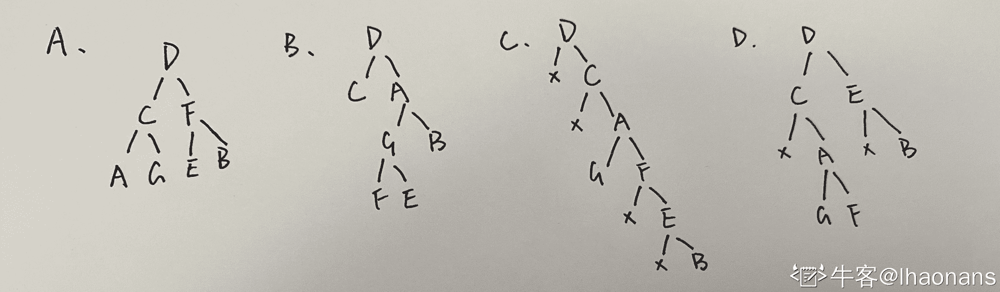
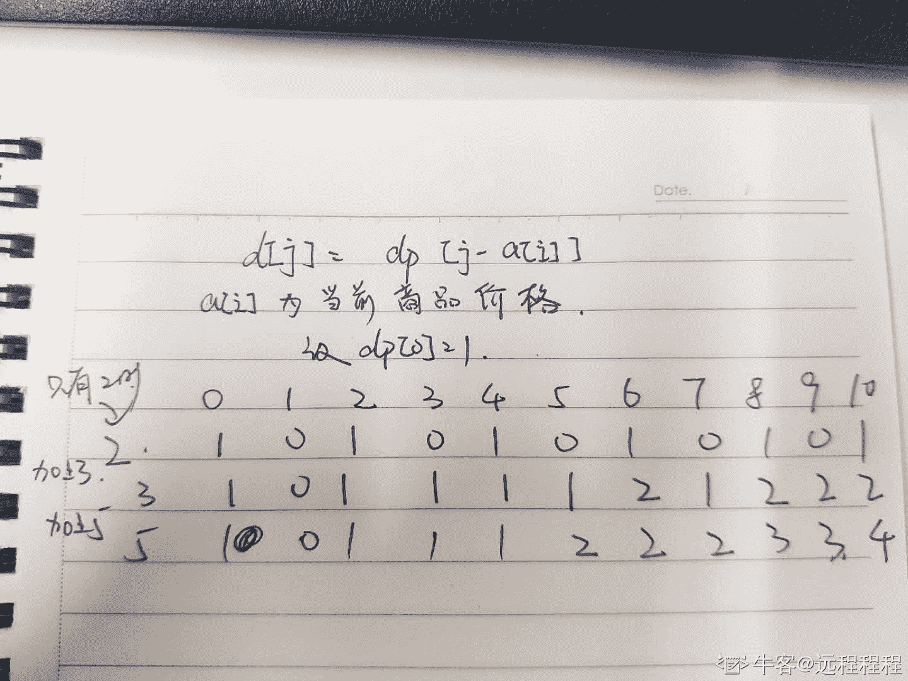

# 小红书 2020 校招测试开发&后端笔试题卷一

## 1

假如一个作业的页面走向是:1,2,3,4,2,1,5,2,1。当内存块数量为 3 时,请问 LRU,FIFO 这两种置换算法的缺页次数各是多少? () 

正确答案: B   你的答案: 空 (错误)

```cpp
7,5 
```

```cpp
6,7
```

```cpp
3,6 
```

```cpp
6,5
```

本题知识点

Java 工程师 C++工程师 测试开发工程师 小红书 2020

讨论

[蛙酱 20200704](https://www.nowcoder.com/profile/656497018)

LRU: least recently used    内存为 3，读 1,2,3,4,2,1,5,2,1    1, 2, 3 为 3 次 page fault 读 4 时，4 取代 1，page fault，内存为 4,2,3     读 2 时，2 存在    读 1 时，page fault.                 内存更新为 4,2,1    读 5，page fault，                  内存更新为 5,2,1    读 2，2 存在    读 1，1 存在总共 6 次 page fault.FIFO: First in First out1,2,3 为 3 次 page fault.            内存更新为 1,2,3     读 4, page fault.                     内存更新为 4,2,3    读 2，2 存在    读 1，page fault.                   内存更新为 4,1,3    读 5，page fault.                   内存更新为 4,1,5    读 2，page fault                    内存更新为 2,1,5    读 1，1 存在总共 7 次 page fault. 

发表于 2020-07-05 09:55:26

* * *

## 2

以下关于 sql 查询语句执行顺序描述正确的是：（）

正确答案: C   你的答案: 空 (错误)

```cpp
select->from->where->group by→having→order by
```

```cpp
from->where->select->group by→having→order by
```

```cpp
from->where->group by→having→select→order by
```

```cpp
select->from->group by→having→where→order by
```

本题知识点

Java 工程师 C++工程师 测试开发工程师 小红书 2020

讨论

[弱得很](https://www.nowcoder.com/profile/2418914)

(7) SELECT

(8) DISTINCT <select_list>

(1) FROM <left_table>

(3) <join_type> JOIN <right_table>

(2) ON <join_condition>

(4) WHERE <where_condition>

(5) GROUP BY <group_by_list>

(6) HAVING <having_condition>

(9) ORDER BY <order_by_condition>

(10) LIMIT <limit_number>标号为执行顺序

发表于 2020-07-08 18:38:43

* * *

[今天也要好好学习呀 959](https://www.nowcoder.com/profile/525369328)

select 语句关键字的定义顺序并不代表这是执行顺序，执行顺序为：from -- on  -- where -- group by -- having -- select -- distinct -- order by -- limit

发表于 2020-09-09 18:52:19

* * *

[黑闪⚡](https://www.nowcoder.com/profile/962532797)

选 A 吧？

发表于 2020-06-30 14:54:29

* * *

## 3

一位老师有 2 个推理能力很强的学生，他告诉学生他手里有以下的牌： 
黑桃：2 ， 5 ， 7 ， 9 ， J ， K
红心：3 ， 4 ， 9 ， J ， K
梅花：5 ， 8 ， 9 ， Q
方块：2 ， 7 ， 8
然后从中拿出一张牌，告诉 A 这张牌的大小，告诉了 B 这张牌的花色；
A：我不知道这张是什么牌
B：我就知道你肯定不知道这张是什么牌
A：现在我知道
B：现在我也知道了
请问这张是什么牌？（）

正确答案: E   你的答案: 空 (错误)

```cpp
黑桃 7
```

```cpp
黑桃 K 
```

```cpp
红心 K  
```

```cpp
梅花 5 
```

```cpp
方片 8
```

```cpp
梅花 9
```

```cpp
 方片 7 
```

本题知识点

Java 工程师 C++工程师 测试开发工程师 小红书 2020

讨论

[野生的桔子](https://www.nowcoder.com/profile/6880361)

很有意思的一道题。没想到 4 句话都是有意义的，而且环环相扣。句 1：排除了只出现一次的值（3，Q）；句 2：花色中所有的值都至少出现两次，排除红心和梅花；句 3：排除 2 和 7，此时还剩 5 种可能（黑桃 5、9、J、K 和方块 8）句 4：如果是黑桃的话，B 不能唯一确定哪张牌，只能是方块。

发表于 2020-08-09 22:13:33

* * *

[NLES201902262146361](https://www.nowcoder.com/profile/544855414)

由第一个条件可知，这个数字必须出现两种以上花色；由第二个条件可知，这种花色的所有数字必须出现两次以上，所以排除红心、梅花，只剩黑桃和方块；由第三个条件可知，这个数字在黑桃和方块仅出现一次；由第四个条件可知，这种花色里符合以上条件的数字唯一，所以排除黑桃，只剩方块 8；

发表于 2020-06-14 09:22:22

* * *

[广州市民林先生](https://www.nowcoder.com/profile/241061362)

首先，这两个学生都知道所有的牌，因为他们老师都告诉他们了。
下面来看这四句话：
① A 说他不知道是啥（因为他不知道花色），那也就说这张牌的数字不是唯一的，存在不同花色但同样数字的牌，排除掉红心 3，4 和梅花 Q
② B 说他自己肯定知道 A 不知道是什么牌，说明 B 心里有数（他从花色判断），他知道 A 拿的牌并不是唯一的，因为如果是唯一的，那 A 自己就知道肯定是红心 3，红心 4 或者梅花 Q 了，因为上面 A 已经知道只有这三张牌的唯一的。所以排除红心，梅花。
③这时候剩黑桃和方块。A 听了 B 的那句话，就知道自己的牌肯定是黑桃或者方块。而又因为 2 和 7 都在黑桃和方块中出现，所以肯定不对(因为如果是 2 和 7，那俩人都无法确定是 2 还是 7)，直接排除，此时剩 5,8,9,J,K

④B 听了 A 上一句话，他也就知道了不是 2 和 7，那肯定就是 8 了嘛，因为如果是另外 4 张，他俩人又无法确定是哪一张了。谈话到此结束，方块 7!

发表于 2020-11-29 13:52:47

* * *

## 4

下列排序算法在最好情况下的时间复杂度为 O(n)的是()

正确答案: C D E   你的答案: 空 (错误)

```cpp
 堆排序
```

```cpp
快速排序
```

```cpp
冒泡排序 
```

```cpp
插入排序
```

```cpp
桶排序    
```

本题知识点

Java 工程师 C++工程师 测试开发工程师 小红书 2020

讨论

[medikament](https://www.nowcoder.com/profile/1604162)

正好一数一个桶

发表于 2020-08-29 11:38:51

* * *

[黑闪⚡](https://www.nowcoder.com/profile/962532797)

桶排序不是都是 O(n x k)吗？选 CD 吧

发表于 2020-06-30 14:59:35

* * *

## 5

如果一个二叉树的先序遍历是：DCAGFEB，那么它的中序遍历可能是：()

正确答案: A B C D   你的答案: 空 (错误)

```cpp
ACGDEFB
```

```cpp
CDFGEAB
```

```cpp
DCGAFEB
```

```cpp
CGAFDEB
```

本题知识点

Java 工程师 C++工程师 测试开发工程师 小红书 2020

讨论

[lhaonans](https://www.nowcoder.com/profile/140686555)



发表于 2020-07-07 14:37:15

* * *

[露西恩缇努维尔](https://www.nowcoder.com/profile/408614969)

C 项比较复杂，被 C 坑了。

发表于 2020-09-06 16:23:33

* * *

[蛙酱 20200704](https://www.nowcoder.com/profile/656497018)

A， B obviously 可以，我来画下 C 和 DC：    D            C                A            G    F                     E                        BD:               D            C            E                A            B            G    F

发表于 2020-07-05 10:07:25

* * *

## 6

某小红薯在小红书的活动中抽奖中了一定价值的薯券，这些薯券可以用来购买一批商品，求有多少种购买组合。其中一件商品可以买多件。输 入:薯券金额、商品分别价格输出 :组合数

本题知识点

C++工程师 测试开发工程师 Java 工程师 小红书 2020

讨论

[暮雨今夕；](https://www.nowcoder.com/profile/5013893)

与力扣 [面试题 08.11\. 硬币](https://leetcode-cn.com/problems/coin-lcci/) 这题一样

```cpp
import java.util.*;

public class Main {

    public static void main(String[] args) {
        Scanner in = new Scanner(System.in);
        int n = in.nextInt();
        String s = in.next();
        String[] tmp = s.substring(1, s.length() - 1).split(",");
        int[] arr = new int[n + 1];
        int[] p = new int[tmp.length];
        for(int i = 0; i < tmp.length; i++) {
            p[i] = Integer.parseInt(tmp[i]);
        }

        arr[0] = 1;

        for(int a : p) {
            for(int i = a; i < arr.length; i++) {
                arr[i] = (arr[i] + arr[i - a]);
            }
        }

        System.out.println(arr[n]);
    }

}
```

编辑于 2020-06-20 16:13:26

* * *

[v 无风](https://www.nowcoder.com/profile/3660003)

解题思路: 动态规划/背包问题
定义数组 dp[i][j]表示金额为 j 的情况下，对于前 i 种商品，最多可以有多少种组合。
初始状态：
dp[...][0] = 1 表示在金额为 0 的情况下，无论有几种商品，只能有一种组合，那就是什么都不取这一种。
状态转移：
如果不选择当前第 i 个商品，组合数 dp[i-1][j]
如果选择当前第 i 个商品，组合数 dp[i][j-v[i-1]]

得出状态转移方程:
dp[i][j] = dp[i-1][j] + dp[i][j-v[i]] (v[i]表示商品的最大金额)

解释: dp[2][10] = dp[1][10] + dp[2][10-5] = 2 + 2 = 4

|  | 0 | 1 | 2 | 3 | 4 | 5 | 6 | 7 | 8 | 9 | 10 |
| 2 | 1 | 0 | 1 | 0 | 1 | 0 | 1 | 0 | 1 | 0 | 1 |
| 2,3 | 1 | 0 | 1 | 1 | 1 | 1 | 2 | 1 | 2 | 1 | 2 |
| 2,3,5 | 1 | 0 | 1 | 1 | 1 | 2 | 2 | 2 | 3 | 3 | 4 |

```cpp
//代码如下
import java.util.*;
public class Main {
    public int solution(int a[],int v){
        int dp[][] = new int[a.length][v+1];
        for (int i = 0; i < dp.length; i++) {
            dp[i][0]=1;
            for (int j = 1; j < dp[i].length; j++) {
                if(i==0){
                    if(j<a[i]){
                        dp[i][j]=0;
                    }else {
                        dp[i][j]=dp[i][j-a[i]];
                    }
                }else {
                    if(j<a[i]){
                        dp[i][j]=dp[i-1][j];
                    }else {
                        dp[i][j]=dp[i-1][j]+dp[i][j-a[i]];
                    }
                }
            }
        }
        return dp[dp.length-1][v];
    }
    public static void main(String[] args) {

        Scanner scanner = new Scanner(System.in);
        String s = scanner.nextLine();
        String[] s1 = s.split(" ");
        int v = Integer.parseInt(s1[0]);
        String[] s2 = s1[1].substring(1,s1[1].length()-1).split(",");
        int[] a = new int[s2.length];
        for (int i = 0; i < a.length; i++) {
            a[i] = Integer.parseInt(s2[i]);
        }
        System.out.println(new Main().solution(a, v));
    }
}
```

编辑于 2020-10-04 00:24:34

* * *

[爱因斯坦锋](https://www.nowcoder.com/profile/4063310)

刚开始格式输入错误都有 10%的正确率。。。其实就是动态规划。
dp[j]为当前价格 j 时的方案数，dp[0]就是价格为 0 时有一种方案（不给就好了），然后从每张券开始遍历就好了。

```cpp
#include<iostream>
#include<vector>
using namespace std;
int main(){
	int n, i= 0;
	cin>>n;
	int dp[10000] = {0};
	dp[0] = 1;
	vector<int> data;
	string Stringdata;
	cin>>Stringdata;
	while (i < Stringdata.length())
	    {
	        if (Stringdata[i] != ' ' && Stringdata[i] != '[' && Stringdata[i] != ',' && Stringdata[i] != ']')
	        {
	            int sum = 0;
	            while (Stringdata[i] != ',' && Stringdata[i] != ']')
	            {
	                sum *= 10;
	                sum += Stringdata[i] - '0';
	                i++;
	            }
	            data.push_back(sum);
	        }
	        else
	        {
	            i++;
	        }
	    }
	for(int c = 0; c < data.size(); c++){
		for(int j = data[c]; j <= n; j++){
			dp[j] += dp[j-data[c]];
		}
	}
	cout<<dp[n]<<endl;
}

```

发表于 2020-07-02 20:49:17

* * *

## 7

薯队长带着小红薯参加密室逃脱团建游戏，首先遇到了反转游戏，小红薯们根据游戏提示收集了多个单词线索，并将单词按要求加一个空格组 成了句子，最终要求把句子按单词反转解密。 说明：收集的时候单词前后可能会有多个空格，反转后单词不能有多个空格，具体见输入输出样例。

本题知识点

前端工程师 小红书 2020 C++工程师 测试开发工程师 Java 工程师 安卓工程师 iOS 工程师 算法工程师

讨论

[Janesummer1175](https://www.nowcoder.com/profile/6046109)

function reverseStr (str) {
    var s = str.match(/[^\s]+/g)
    s = s.reverse()
    return s.join(' ')
}

发表于 2020-06-12 13:46:09

* * *

[我不想当大白菜](https://www.nowcoder.com/profile/2462790)

```cpp
words = input().split()[::-1]
print(" ".join(words))
```

发表于 2020-07-04 12:19:05

* * *

[青椒牛客](https://www.nowcoder.com/profile/854162394)

```cpp
#include <iostream>
#include <string>

using namespace std;

int main(){
    string str;
    getline(cin,str);
    string ans="";
    int n=str.size();
    int i=n-1,j=n-1;
    while(j>=0){
        if(str[j] != ' '){
            for(i=j;i>=0;i--){
                if(str[i] == ' ')
                    break;
            }
            ans+=str.substr(i+1,j-i);
            ans+=" ";
            j=i;
        }
        j--;
    }
    ans.erase(ans.end()-1);
    cout<<ans<<endl;
    return 0;
}

```

编辑于 2020-09-15 11:24:02

* * *

## 8

 薯队长写了 n 篇笔记，编号从 1~n,每篇笔记都获得了不少点赞数。    薯队长想从中选出一些笔记，作一个精选集合。挑选的时候有两个规则： 1.不能出现连续编号的笔记。 2.总点赞总数最多 如果满足 1，2 条件有多种方案，挑选笔记总数最少的那种

本题知识点

前端工程师 小红书 2020 C++工程师 测试开发工程师 Java 工程师 安卓工程师 iOS 工程师 算法工程师

讨论

[✭](https://www.nowcoder.com/profile/296604434)

类似打家劫舍的问题。利用动态规划 dp[i] = x 表示从 i 开始选笔记，最大点赞数为 x。dpNum[i]表示此时选取的次数动态转移方程为 dp[i] = max(dp[i+1], dp[i+2]+nums[i])由于本题还需要求次数，所以再构造一个 dpNum 数组，用来存储得到 dp[i]时，选取的笔记次数。状态方程与 dp 数组类似，当选取了 nums[i]，则 dpNum[i] = dpNum[i+2]+1,否则在不选取的情况下，dpNum[i]=dpNum[i+1]从后往前迭代求解，所以数组需初始化大小为 n+2,初值均为 0(方便求解 dp[n-1])

```cpp
import sys
n = eval(input())
nums = [int(i) for i in sys.stdin.readline().split()]
dp = [0 for _ in range(n+2)]
dpNum = [0 for _ in range(n+2)]
num = 0
for i in range(n-1, -1, -1):
    if dp[i+1] < dp[i+2]+nums[i]:
        dp[i] = dp[i+2]+nums[i]
        dpNum[i] = dpNum[i+2]+1
    else:
        dp[i] = dp[i+1]
        dpNum[i] = dpNum[i+1]
print(dp[0], dpNum[0])
```

编辑于 2020-06-26 11:49:10

* * *

[广州市民林先生](https://www.nowcoder.com/profile/241061362)

**思路：要在一个连续的数组里面选 k 个数，使得这 k 个数的点赞最多，并且还不能选编号连续的数（比如选了 nums[i]，就不能选 nums[i + 1]，只能选 nums[i + 2]........），那也就是说：要得到最大的点赞量，要看你前面是怎么选的，那既然后面的结果受前面的选择所影响，很容易联想到动态规划，因为通俗地讲，动态规划就是一个递推式，由前面推到后面，我们需要推到第 n 个数，从第 1 个数开始推。这样，我们定义 dp(n + 1)，dp[i]就表示选到第 i 个数的时候，能获得的最大点赞数。最终的 dp[n]就该是需要输出的最大点赞数。****那接下来就是怎么推的问题了。首先，遇到一个数 nums[i]，我有两种选择：选这个数，那么意味着我前面的 nums[i - 1]不能选，只能选 nums[i - 2]；不选这个数呢？那么意味着我可以选 nums[i - 1]，由于我要取最大点赞数，所以取它们俩的大者 赋值到 dp[i]即可，以此类推到 n。****至此，基本思路讲解完毕，现在还有一个问题，我们需要统计选了几个数。这个比较简单，选一个就+1,嘛，所以 count[i] = count[i - 2] + 1; 或者 count[i] = count[i - 1]，这时候应该可以理解这两句话的含义了吧，就是选与不选 nums[i]的问题了。下面看代码：**

```cpp
#include <iostream>
#include <vector>
using namespace std;

// dp[i]: 从第一篇笔记开始选到第 i 篇, 所能得到的最大点赞数。
// count[i]: 此时选取的笔记数量
int main(){
    int n, val;
    cin >> n;
    vector<int> vec(n + 1, 0);
    for(int i = 1; i <= n; ++i){
        cin >> val;
        vec[i] = val;
    }
    vector<int> dp(n + 1, 0);  
    vector<int> count(n + 1, 0);
    dp[1] = vec[1];  //选第一篇笔记, 最大点赞数自然就是 vec[1]
    count[1] = 1;    //选了一个数
    for(int i = 2; i <= n; ++i){
        //选了 dp[i - 2], 就不能选 dp[i - 1], 但可以选 veci
        if(dp[i - 1] < dp[i - 2] + vec[i]){
            dp[i] = dp[i - 2] + vec[i];
            count[i] = count[i - 2] + 1;
        } else{
            //不选 dp[i - 2]和 vec[i]
            dp[i] = dp[i - 1];
            count[i] = count[i - 1];
        }
    }
    cout << dp[n] << ' ' << count[n] << endl;
    return 0;
}
```

最后，leetcode 337 题 打家劫舍 III，思路类似，只不过从数组变成二叉树，感兴趣的可以试试。https://leetcode-cn.com/problems/house-robber-iii/

编辑于 2020-11-29 13:02:46

* * *

[融 360 内推](https://www.nowcoder.com/profile/598880162)

参考了大佬们的解法。

```cpp
def getMaxStar(n,nums):
    dp = [0 for _ in range(n+1)]
    dp2 = [0 for _ in range(n+1)]
    dp[1] = nums[0]
    dp2[1] = 1
    for i in range(2,n+1):
        if dp[i-1] < dp[i-2]+nums[i-1]:
            dp[i] = dp[i-2]+nums[i-1]
            dp2[i] = dp2[i-2]+1
        else:
            dp[i] = dp[i-1]
            dp2[i] = dp2[i-1]
    print(dp[-1], dp2[-1])

n = eval(input())
nums = [int(i) for i in input().split()]
getMaxStar(n, nums)

```

 编辑于 2020-07-21 18:22:00

* * *

## 9

薯队长来到了迷宫的尽头，面前出现了 N 只魔物，Hi 表示第 i 只魔物的血量，薯队长需要在 T 个回合内击败所有魔物才能获胜。每个回合薯队长可 以选择物理攻击一只魔物，对其造成 1 点伤害（物理攻击次数无上限）;        或者消耗 1 点法力释放必杀技对其造成固定 X 点伤害（薯队长开始拥有 M 点法力）。问 X 至少多大，薯队长才有机会获胜；如果无论如何都无法在 T 回合内获胜，则输出-1 

本题知识点

前端工程师 小红书 2020 C++工程师 测试开发工程师 Java 工程师 安卓工程师 iOS 工程师 算法工程师

讨论

[我不想当大白菜](https://www.nowcoder.com/profile/2462790)

考察点：二分搜索、贪心
参考了@Cyan1956 大佬的代码，python 实现

*   思路：沿着`[0,max_hp]`的范围搜索最合适的伤害值，注意对一些特殊情形的处理。
*   使用函数`check_valid`判断当前技能伤害能否过关
    *   首先是根据法力值的大小先对整体的怪物进行伤害，**只求打满最大的伤害而不去补刀**
    *   之后根据剩余的血量重排序，此时：
        *   如果没有了法力值，则只需要判断血量和是不是大约剩余轮数。
        *   如果剩余法力值，则根据重排序的结果，**优先清掉血量高的怪物**，之后再判断剩余的轮数够不够清掉所有的怪物。

```cpp
def check_valid(num, turn, magic, hps, damage):
    # 使用技能造成伤害但不补刀，最后剩下法力值的时候在进行补刀
    i = 0
    for i in range(num):
        # 释放技能的次数为整除的次数或者是魔力值的次数，取小的那个

        spell_time = min(hps[i] // damage, magic)
        hps[i] -= spell_time * damage
        turn -= spell_time
        magic -= spell_time
        if magic == 0: break
    # 去除刚好整除的值

    hps = sorted(hps)
    i = 0
    if hps[-1] == 0:return True
    while hps[i] == 0:
        i += 1
    hps = hps[i:]
    # 普攻或者技能能够清掉

    if sum(hps) <= turn : return True
    if len(hps) <= magic:
        return True

    # 还剩余法力值，此时怪物的血量必定都小于技能伤害，按血量从高到低使用技能

    else:
        last = len(hps) - 1
        while magic > 0:
            last -= 1
            magic -= 1
            turn -= 1
        # 无法力值，判断能否用普攻清完

        hps = hps[:last+1]
        return turn >= sum(hps)

def main():
    num, turn, magic = list(map(int, input().split()))
    hps = list(map(int, input().split()))

    #回合不够必定输

    if len(hps) > turn: return -1

    # 法力值为零且血量和大于回合数 必定输
    if magic == 0 and sum(hps) > turn: return -1

    left, right = 0, int(max(hps))
    while left < right:
        mid = (left + right) // 2
        # 注意 python 浅拷贝的坑

        if check_valid(num, turn, magic, hps.copy(), damage=mid):
            right = mid
        else:
            left = mid+1
    # 如果 left = max(hps)，同样是不存在伤害值满足条件，left 一直右移直到越界

    return left if left < max(hps) else -1

print(main())
```

发表于 2020-07-06 22:33:53

* * *

[Cyan1956](https://www.nowcoder.com/profile/487142704)

[[编程题]击败魔物 小红书 二分查找](https://blog.csdn.net/Cyan1956/article/details/106746409)

我们把问题分解成两个子问题：

1.已知 必杀技伤害 X 验证能否获胜
2.二分查找能够获胜的最小伤害 X

考虑二分查找的上下边界：

*   平 A 即可取胜，此时为 X 的下界 0
*   技能秒杀任意怪，此时为 X 的上界为怪物的最大血量，伤害更高没有意义

```cpp
package main

import (
    "fmt"
    "sort"
)

//求和
func sum(arr []int) (ans int) {
    for _,v:=range arr{
        ans+=v
    }
    return
}

//求较小值
func min(i,j int) int {
    if i<j{
        return i
    }else{
        return j
    }
}

//验证能否获胜
func f(ohs []int,n,t,m,x int) bool {
    hs:=make([]int, len(ohs))
    copy(hs,ohs)
    for i,v:=range hs{
         d:=min(v/x,m)
         hs[i]-=d*x
         m-=d
         t-=d
         if m==0{
            break
         }
    }
    sort.Ints(hs)
    i:=0
    for ;hs[i]==0;i++{}
    hs=hs[i:]
    if len(hs)==0{
        return true
    }
    n= len(hs)
    if n<=m{
        return true
    }else{
        hs=hs[:n-m]
        t-=m
        return t>=sum(hs)
    }
}

func main() {
    var n,t,m,h int

     //回合数小于怪物数，必失败
    if t<n{
        fmt.Println(-1)
        return
    }

     //法力值大于回合数时多的也没用
    if m>t{
        m=t
    }

     //获取怪物血量
    var hs []int
    fmt.Scan(&n,&t,&m)
    for i:=0;i<n;i++{
        fmt.Scan(&h)
        hs = append(hs, h)
    }

     //平 A 取胜
    if t>sum(hs){
        fmt.Println(0)
        return
    }

    sort.Ints(hs)

    //二分查找
    l,r:=0,hs[len(hs)-1]
    if !f(hs,n,t,m,r){
        fmt.Println(-1)
        return
    }
    for l<r-1{
        mid:=(l+r)/2
        if f(hs,n,t,m,mid){
            r=mid
        }else{
            l=mid
        }
    }
    fmt.Println(r)
}
```

发表于 2020-06-14 15:29:52

* * *

[UPMagic](https://www.nowcoder.com/profile/4079837)

java100%case 通过代码如下：

```cpp
import java.util.*;
public class Main{
    public static void main(String[] args){
        Scanner in = new Scanner(System.in);
        int n = in.nextInt();
        int t = in.nextInt();
        int m = in.nextInt();
        Integer[] h = new Integer[n];
        int maxH=0,totalH=0;
        //获取怪物血量输入，顺便找出最大怪物血量，顺便计算怪物总血量。
        for (int i=0;i<h.length;i++){
            int s = in.nextInt();
            h[i] = s;
            maxH=Math.max(maxH,s);
            totalH+=s;
        }
        //如果怪物总血量小于回合数，说明平 A 就能解决所有怪物，所以必杀技伤害为最低 0
        if(totalH<=t){
            System.out.println(0);
            return;
        }
        //把怪物的血量从大到小排序
        Arrays.sort(h,Collections.reverseOrder());
        /*从 2 到最大怪兽血量 maxH，进行升序循环判断，找到第一个伤害就是，最低必杀技伤害
        Q:为什么从 2 开始？A:因为普工伤害为 1，必杀技小于等于普工伤害时，都使用普工解决就可以
        */
        for (int i=2;i<=maxH;i++){
            //判断该必杀技伤害是否能够通关
            if(dfs(h,t,m,i,totalH)){
                System.out.println(i);
                return;
            }
        }
        System.out.println(-1);
    }
    public static boolean dfs(Integer[] h,int t,int m,int x,int totalH){
        //判断回合数是否大于蓝量
        if(t>m){
            //看所有蓝量用完后再在回合内使用普工时，所能造成的总血量是否大于怪物总血量，如果不行，则无法通关
            if(t-m+m*x>=totalH){
                /**
                怪物血量大于必杀技伤害的，每一个都使用必杀技，确保必杀技伤害不溢出。
                **/
                Integer[] ht = Arrays.copyOf(h,h.length);
                int j=0;
                for(int i=0;i<h.length&&m>0&&h[i]>=x;i++){
                    int st = h[i]/x;
                    int sx = h[i]%x;
                    if(st<=m){
                        ht[i] = sx;
                        totalH -= st*x;
                        m-=st;
                        t-=st;
                    }else{
                        ht[i] -= m*x;
                        totalH -= m*x;
                        m=0;
                        t-=m;
                    }
                }
                //如果必杀技使用完毕，则只能进行平砍，判断怪物总剩余血量是否小于等于剩余回合数就行
                if(m==0){
                    return totalH<=t-m;
                }else {
                    //如果必杀技未使用完毕，则直接对剩余血量最多的怪再次使用必杀技，确保必杀技利益最大化。
                    //怪物剩余血量再排序
                    Arrays.sort(ht, Collections.reverseOrder());
                    //由于 java 最后 10%的案例超时，所以判断了一下剩余蓝量是否大于怪物数量的一半
                    if(m>ht.length/2){
                        //如果超过一半，则只需计算另外一半未死的怪物血量就是剩余怪物总血量
                        totalH = 0;
                        for (int i = m; i < ht.length; i++) {
                            totalH += ht[i];
                        }
                    }else {
                        //如果没有超过一半，则每一只怪死掉后，总血量减去该怪物的剩余血量就行
                        for (int i = 0; i < m; i++) {
                            totalH -= ht[i];
                        }
                    }
                    //通过以上步骤算出怪物剩余总血量，如果小于使用全部技能后的回合数，就能平 A 通关了，如果不行则不能进行通关操作
                    return totalH <= t - m;
                }
            }else{
                return false;
            }
        }else{
            //如果回合数小于等于蓝量，则全程使用必杀技，看是否通关。
            //直接回合数*必杀技看是否大于怪物总血量
            return t*x>=totalH;
        }
    }
}

```

发表于 2020-08-21 17:37:16

* * *