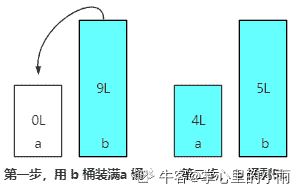
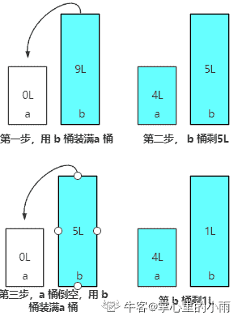
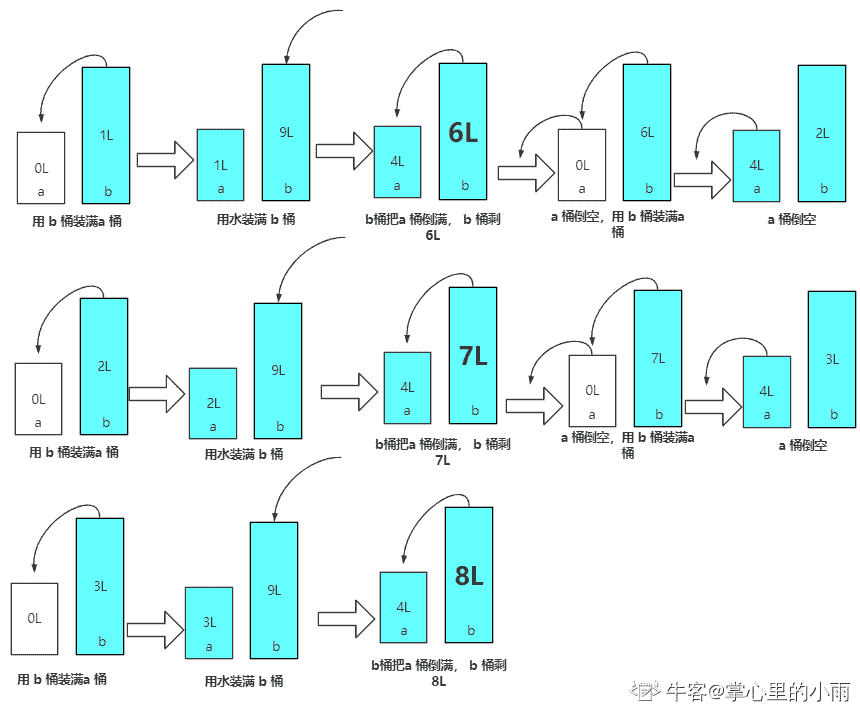
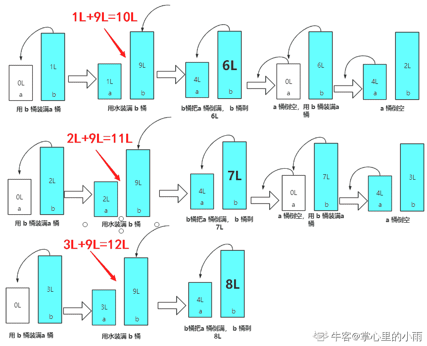

# 小红书 2020 校招测试开发&后端笔试题卷一

## 1

一个栈的入栈序列为 ABCDEF, 则不可能的出栈序列为 ()

正确答案: D   你的答案: 空 (错误)

```cpp
DEFCBA
```

```cpp
DCEFBA
```

```cpp
FEDCBA
```

```cpp
FECDBA
```

```cpp
 ABCDEF
```

```cpp
 ADCBFE
```

本题知识点

Java 工程师 C++工程师 测试开发工程师 小红书 2020

讨论

[掌心里的小雨](https://www.nowcoder.com/profile/86073671)

说一下自己的想法吧，这种题目就是从上到下逐个排除。

*   A 选项：先压入 ABC，再压入 D，**弹出 D**；再压入 E，**弹出 E**；再压入 F，**弹出 F**；**再依次弹出 CBA**，满足入栈顺序，所以出栈顺序为 DEFCBA。

*   B 选项：先压入 AB,再压入 CD，**弹出 DC**；再压入 E，**弹出 E**；再压入 F，**弹出 F**；**再依次弹出 BA**，满足入栈顺序，所以出栈顺序为 DCEFBA。

*   C 选项：这个选项不再赘述，因为是**入栈顺序的倒序**，全部一起进，一起出，所以出栈顺序为 DCEFBA。

*   D 选项：先假设弹出的 FE 是正确的，但是出栈时 C 出现在 D 的前面，因为 C 一定是比 D 先入栈的，所以 D 先出栈，选项错误，选 D

*   E 选项：与入栈顺序一致，所以是入一个，弹出一个，满足入栈顺序，所以出栈顺序为 ABCDEF。

*   F 选项：先压入 A,**弹出 A**，再压入 BCD，**弹出 DCB**；再压入 EF，**弹出 FE**，满足入栈顺序，所以出栈顺序为 ADCBFE。

*   选项太多，就不画图了，如有说的不妥的地方，望指正，谢谢！

发表于 2020-06-03 20:41:15

* * *

## 2

224 个叶子节点的完全二叉树, 最多有几个结点（）

正确答案: B   你的答案: 空 (错误)

```cpp
447
```

```cpp
448
```

```cpp
449
```

```cpp
450
```

本题知识点

Java 工程师 C++工程师 测试开发工程师 小红书 2020

讨论

[雁过无痕 2019](https://www.nowcoder.com/profile/863375103)

二叉树具有性质：1、度为 0 的结点个数=度为 2 的结点个数+1，即 n0=n2+1（其中 n0 表示度为 0 的结点个数，n2 表示度为 2 的结点个数）。注 ：二叉树的度代表某个结点的孩子或者说直接后继的个数。2、完全二叉树中度为 1 的结点个数要么 0 个，要么 1 个。3、二叉树结点个数 n=n0+n1+n2 综合性质，结合题目有 n0=224，故 224=n2+1，得 n2=224-1=223。当为度 0 的结点存在时，结点总数为 n=n0+n1+n2=224+0+223=447。当为度 1 的结点存在时，结点总数为 n=n0+n1+n2=224+1+223=448。 故最多为 448 个，选 B

发表于 2020-06-02 08:51:15

* * *

[邢哈哈 _](https://www.nowcoder.com/profile/917010997)

刚开始想错了，其实这个题还有一种比较麻烦一些的做法，利用满二叉树的性质，每层有 2 的 n 次方-1 个结点，第 9 层则为 256 个叶子，比 224 大，因此需要减。第 9 层减 2 个，第 8 层多 1 个，最终凑成 224 需要第 9 层减 64 个，剩 192 个，前 8 层共有 2 的 8 次方减 1，也就是 255 个，加起来为 447 个，还可以再加一个叶子，第 8 层则少一个叶子，答案为 448.

发表于 2020-07-22 10:30:48

* * *

[克己守心](https://www.nowcoder.com/profile/547883349)

1、度为 0 的结点个数=度为 2 的结点个数+1，即 n0=n2+1（其中 n0 表示度为 0 的结点个数，n2 表示度为 2 的结点个数）。注 ：二叉树的度代表某个结点的孩子或者说直接后继的个数。

2、完全二叉树中度为 1 的结点个数要么 0 个，要么 1 个。

3、二叉树结点个数 n=n0+n1+n2

综合性质，结合题目有 n0=224，故 224=n2+1，得 n2=224-1=223。

当为度 1 的结点不存在时，结点总数为 n=n0+n1+n2=224+0+223=447。

当为度 1 的结点存在时，结点总数为 n=n0+n1+n2=224+1+223=448。

故最多为 448 个，选 B

发表于 2020-06-28 11:59:41

* * *

## 3

散列表中解决冲突的方法有（） 

正确答案: C D   你的答案: 空 (错误)

```cpp
平方取中法
```

```cpp
除留余数法
```

```cpp
再散列法
```

```cpp
开放寻址法
```

本题知识点

Java 工程师 C++工程师 测试开发工程师 小红书 2020

讨论

[黑闪⚡](https://www.nowcoder.com/profile/962532797)

平方取中法和除数留余法属于哈希函数，另外还有直接定址法和随机数法，而解决哈希冲突的方法有，开放地址法（再哈希，二次探测、线性探测）和常用的链地址法

发表于 2020-06-30 14:40:19

* * *

## 4

UDP 报头中没有下面那些信息:() 

正确答案: A B C   你的答案: 空 (错误)

```cpp
目的地址
```

```cpp
窗口大小
```

```cpp
序列号
```

```cpp
检验和
```

本题知识点

Java 工程师 C++工程师 测试开发工程师 小红书 2020

讨论

[Andrewzc](https://www.nowcoder.com/profile/624789258)

UDP 报文段结构：源端口号，目的端口号，长度，检验和，应用数据

发表于 2020-06-27 20:56:43

* * *

## 5

无限多水源 一个 4L 无刻度桶, 一个 9L 无刻度桶, 那么只利用这两个桶, 可以获得的水量有()

正确答案: A B C D   你的答案: 空 (错误)

```cpp
1
```

```cpp
5
```

```cpp
8
```

```cpp
11
```

本题知识点

Java 工程师 C++工程师 测试开发工程师 小红书 2020

讨论

[掌心里的小雨](https://www.nowcoder.com/profile/86073671)

说一下我自己的想法：

*   首先审题，无限多水，两个桶，分别是 4L,9L，只能用桶，所以针对四个选项我的想法是：
*   先说 B 选项，因为是最容易想到的，详细见下图
    
*   然后是 A 选项，详细见下图
    
*   对于这个选项，可以总结为，可以出现水量=（水量小的水量~水量打的水量）这些范围内的水量都可以，如 4L,5L,6L，7L，8L,9L,详细见下图
    
*   对于这个选项，可以总结为，可以出现水量=（水量小的水量+水量打的水量）这些范围内的水量都可以，如 10L,11L,12L，13L
    
*   解释的如不妥的，望告知，谢谢！

编辑于 2020-06-03 22:41:28

* * *

[北木南](https://www.nowcoder.com/profile/938914221)

实话说，只要能整出来 1L 水，是个整数 L 水都能整出来

发表于 2020-06-24 13:17:45

* * *

[牛客 706612486 号](https://www.nowcoder.com/profile/706612486)

我能说，我做题时连题意都没看懂吗？看了解析才知道！难道只有我一个人？

发表于 2020-10-05 15:45:13

* * *

## 6

薯队长写了一篇笔记草稿，请你帮忙输出最后内容。 1.输入字符包括，"("    ,    ")"    和    "<"和其他字符。 2.其他字符表示笔记内容。 3.()之间表示注释内容，任何字符都无效。    括号保证成对出现。 4."<"表示退格,    删去前面一个笔记内容字符。括号不受"<"影响    。 

本题知识点

前端工程师 小红书 2020 C++工程师 测试开发工程师 Java 工程师 安卓工程师 iOS 工程师 算法工程师

讨论

[weiyinfu](https://www.nowcoder.com/profile/8575360)

就问问你们，谁有我短？

```cpp
s=input().strip()
a=[]
left=0
for i in s:
    if i=='(':
        left+=1
        continue
    if left:
        if i==')':
            left-=1
        continue
    if i=='<':
        a.pop()
    else:
        a.append(i)
s=''.join(a)
print(s)
```

发表于 2020-06-22 12:44:25

* * *

[你有猫饼嘛 i](https://www.nowcoder.com/profile/391134424)

```cpp
import java.util.ArrayList;
import java.util.List;
import java.util.Scanner;

public class Main {
    public static void main(String[] args) {
        Scanner scanner = new Scanner(System.in);
        StringBuffer stringBuffer = new StringBuffer();
        stringBuffer = new StringBuffer(scanner.nextLine());
        List<Integer> k = new ArrayList<>();
        //用一个列表来装括号的匹配
        //遇见‘（’添加首次匹配位置进去
        //遇见‘）’从最后一次‘（’匹配位置开始删除字符串
        for(int i = 0; i < stringBuffer.length();){
            if(stringBuffer.charAt(i)=='(') {
                k.add(i);
                i++;
            }
            else if(stringBuffer.charAt(i)=='<'&&k.size()==0) {
                stringBuffer.delete(i - 1, i + 1);
                i = i - 1;
            }
            else if(stringBuffer.charAt(i)==')') {
                stringBuffer.delete(k.get(k.size() - 1),i + 1);
                i = k.get(k.size() - 1);
                k.remove(k.size() - 1);
            }
            else
                i++;
        }
        System.out.println(stringBuffer);
    }
}
```

发表于 2020-08-05 21:01:30

* * *

[准备脱非入欧](https://www.nowcoder.com/profile/964977041)

在下拙见

```cpp
function fun(str) {
      var stack = [];
      str = str.split("");
      var res = '';
      for (var i = 0; i < str.length; i++) {
        if(str[i] != "(" && str[i] != ")" && stack.length == 0){
          res += str[i]
        }
        if(str[i] == "(" ){
          stack.push(i)
        }
        if(str[i] == ")"){
          stack.pop()
        }
      }
      res = res.split("");
      for(var i = 0 ; i < res.length ; i++){
        if(res[i] == "<"){
          res.splice(i-1,2);
          i--;
          i--;
        }
      };
       return res.toString().replace(/\,/g,"")
    }
```

发表于 2020-07-07 19:35:01

* * *

## 7

薯队长最近在玩一个迷宫探索类游戏，迷宫是一个 N*N 的矩阵形状，其中会有一些障碍物禁止通过。这个迷宫还有一个特殊的设计，它的左右 边界以及上下边界是连通的，比如在(2,n)的位置继续往右走一格可以到(2,1)，    在(1,2)的位置继续往上走一格可以到(n,2)。请问薯队长从起点位置 S，最少走多少格才能到达迷宫的出口位置 E。 

本题知识点

前端工程师 小红书 2020 C++工程师 测试开发工程师 Java 工程师 安卓工程师 iOS 工程师 算法工程师

讨论

[FCWang](https://www.nowcoder.com/profile/501844930)

```cpp
n = int(input())
grid, S_OR = [], []
for i in range(n):
    crow = list(input())
    if 'S' in crow:
        S_OR = [i, crow.index('S')]
    grid.append(crow)

def BFS(grid, S_OR, n):
    dx, dy = [1, -1, 0, 0], [0, 0, 1, -1]
    queue = [S_OR]
    visited = [[False for _ in range(n)] for _ in range(n)]
    visited[S_OR[0]][S_OR[1]] = True
    step = 0
    while queue:
        step += 1
        len_queue = len(queue)
        for _ in range(len_queue):
            q = queue.pop(0)
            for _x, _y in zip(dx, dy):
                x, y = (q[0] + _x + n) % n, (q[1] + _y + n) % n
                if not visited[x][y] and grid[x][y] != '#':
                    if grid[x][y] == 'E':
                        return step
                    queue.append([x, y])
                    visited[x][y] = True
    return -1

print(BFS(grid, S_OR, n))
```

发表于 2020-08-29 20:16:41

* * *

[准备脱非入欧](https://www.nowcoder.com/profile/964977041)

亲测可过 不过牛客网的输入有点烦 代码将就看一下吧

```cpp
function node(x, y, layer) {
      this.x = x;
      this.y = y;
      this.layer = layer;
    }
    function fn(a, arr) {
      var xStart = -1, yStart = -1;
      var xEnd = -1, yEnd = -1;
      var count = 0;
      for (var i = 0; i < arr.length; i++) {
        for (var k = 0; k < arr[0].length; k++) {
          if (arr[i][k] == 's') {
            xStart = i;
            yStart = k;
          }
          if (arr[i][k] == 'e') {
            xEnd = i;
            yEnd = k;
          }
        }
      }
      var stack = [];
      stack.push(new node(xStart,yStart,0));
      var newArr = arr.slice();
      var x = -1 , y = -1;
      //---------------------------------------bfs
      while(stack.length > 0){
        var temp = stack.shift();
        if(temp.x == xEnd && temp.y == yEnd){
          return temp.layer
        }
        x = temp.x + 1 ; y = temp.y;
        if(x == a) x = 0;
        if(newArr[x][y] != '#') {stack.push(new node(x , y , temp.layer + 1)) ; newArr[x][y] = '#'};
        //---------------
        x = temp.x - 1 ; y = temp.y;
        if(x == -1) x = a - 1;
        if(newArr[x][y] != '#') {stack.push(new node(x , y , temp.layer + 1)) ; newArr[x][y] = '#'};
        //-------------
        x = temp.x  ; y = temp.y + 1;
        if(y == a) y = 0;
        if(newArr[x][y] != '#') {stack.push(new node(x , y , temp.layer + 1)) ; newArr[x][y] = '#'};
        //-----------------
        x = temp.x  ; y = temp.y - 1;
        if(y == -1) y = a - 1;
        if(newArr[x][y] != '#') {stack.push(new node(x , y , temp.layer + 1)) ; newArr[x][y] = '#'};

      }
      return "-1"
    }
    var a = 5, arr = [[1, '#', 1, 1, 1], [1, 1, '#', 's', 1], [1, 'e', '#', '#', '#'], [1, 1, 1, 1, 1], [1, 1, 1, 1, 1]]
    fn(a, arr)
```

发表于 2020-07-08 17:16:49

* * *

[独 259](https://www.nowcoder.com/profile/1548511)

这一题的测试用例不完整，，，下面是我的思路，大佬可以点评一下使用两个二维数组，将起点步数设为 0。广度遍历的思想。用队列记录点，当一个新点出队时，检查上下左右四个点(注意连通性条件)。如果这些点是墙，我们就不处理。否则，若点未访问过或者之前的步数太多(走的太麻烦)，跟新步数并把这一点入队。(我的疑问就是这里，走的太麻烦的点还要入队吗？自我感觉，广度遍历不需要，因为广度不会出现这种情况，但是深度遍历是需要的) 

```cpp
n = int(input())
mat = [[0] * n] * n
result = [[-1] * n for _ in range(n)]
for i in range(n):
    mat[i] = list(input())
queue = []

for i in range(n):
    for j in range(n):
        if mat[i][j] == 'S':
            queue.append([i, j])
            result[i][j] = 0
        if mat[i][j] == 'E':
            end = [i, j]
while queue:
    point = queue.pop(0)
    x = point[0]
    y = point[1]
    left = [x, n - 1] if y == 0 else [x, y - 1]
    right = [x, 0] if y == n - 1 else [x, y + 1]
    up = [n-1, y] if x == 0 else [x - 1, y]
    down = [0, y] if x == n - 1 else [x + 1, y]
    near_p = [left, right, up, down]
    for point in near_p:
        if mat[point[0]][point[1]] != '#':
            if result[point[0]][point[1]] == -1&nbs***bsp;result[point[0]][point[1]] > result[x][y] + 1:
                queue.append(point)
                result[point[0]][point[1]] = result[x][y] + 1
print(result[end[0]][end[1]])
```

编辑于 2020-06-11 15:19:29

* * *

## 8

在游戏中，击败魔物后，薯队长获得了 N 件宝物，接下来得把这些宝物卖给宝物回收员来赚点小钱。这个回收员有个坏毛病，每次卖给他一件宝 物后，之后他就看不上比这件宝物差的宝物了。在这个世界中，衡量宝物的好坏有两个维度，稀有度 X 和实用度 H，回收员在回收一个宝物 A 后，下一个宝物的稀有度和实用度都不能低于宝物 A。那么薯队长如何制定售卖顺序，才能卖给回收员宝物总个数最多。 

本题知识点

前端工程师 小红书 2020 C++工程师 测试开发工程师 Java 工程师 安卓工程师 iOS 工程师 算法工程师

讨论

[21CenturyBoy](https://www.nowcoder.com/profile/84805169)

```cpp
按照一个维度排序后按照另一个维度寻找最长增加子序列即可，这个是>=的比较简单一点，注意不能用 O(n2)，要二分查找优化

import java.util.*;
public class Main {
    public static void main(String[] args) {
        Scanner scanner = new Scanner(System.in);
        int n = scanner.nextInt();
        int[][] ans = new int[n][2];
        for(int i=0;i<n;i++){
            ans[i][0] = scanner.nextInt();
            ans[i][1] = scanner.nextInt();
        }
        Arrays.sort(ans,(a,b)->a[0]!=b[0]?a[0]-b[0]:a[1]-b[1]);
        int[] arr = new int[n];
        for(int i=0;i<n;i++)arr[i] = ans[i][1];
        System.out.println(LIS(arr));
    }
    public static int LIS(int[] arr){
        int[] dp = new int[arr.length];
        int res = 0;
        for(int num:arr){
            int l = 0,r = res;
            while (l<r){
                int m = (l+r)/2;
                if(dp[m]<num)l = m+1;
                else r = m;
            }
            dp[l] = num;
            if(l==res)res++;
        }
        return res;
    }
}
```

 发表于 2020-06-07 13:42:37

* * *

[准备脱非入欧](https://www.nowcoder.com/profile/964977041)

牛客网 的输入输出 真的 蛮搞人心态的 调整输入输出时间 跟 写代码时间一样长 做一道题花两道题时间😂😂 ```cpp
var num = readline();
var arr= [];
var n = null;
while(n = readline()){
    n=n.split(" ").map(item => {
        return Number(item)
    })
    arr.push(n)
}
arr.sort((d1, d2) => {
        return d1[0] != d2[0] ? d1[0] - d2[0] : d1[1] - d2[1]
      });
function LIS(num, arr) {
      var temp = [];
      for (var i = 0; i < num; i++) {
        temp.push(arr[i][1]);
      }
      let newArr = new Array(num);
      newArr[0] = temp[0]
      let end = 0;
      for (var k = 0; k < num; k++) {
        if (temp[k] > newArr[end]) {
          end++;
          newArr[end] = temp[k];
        } else {
          let left = 0 ;
          let right = end ;
          while(left < right){
            let mid = left + ((right - left) >> 1);
            if(newArr[mid] < temp[k]){
              left = mid + 1;
            } else {
              right = mid;
            }
          }
          newArr[left] = temp[k]
        }
      }
      return end + 1
    }
      console.log(LIS(num, arr)) ;
``` 

发表于 2020-07-09 21:26:13

* * *

[我不想当大白菜](https://www.nowcoder.com/profile/2462790)

分析

*   思路 先对数组排序(sort 函数会同时对两个维度排序，第一个维度相同时会比较第二个维度)，然后在另一个维度上搜索最长上升子序列。

```cpp
 input: [[32],[11],[13],[12]]

sorted(input):[[11],[12],[13],[32]]
```

*   时间复杂度的限制：在找最长上升子序列时不能使用 DP 方法(O(N²))，考虑通过二分查找来找到 LIS。
*   **LIS 的二分查找算法**：[参考: leetcode 300.最长上升子序列](https://leetcode-cn.com/problems/longest-increasing-subsequence/solution/zui-chang-shang-sheng-zi-xu-lie-by-leetcode-soluti/)
    *   构造单调上升数组 res，对原数组 nums 逐个遍历：
        *   如果 nums[i]>res[-1]，说明满足上升条件，将其插入数组中；
        *   否则，通过二分查找 res 数组中刚好比它大的值并进行替换。**当完成多次替换后该数组的最大值会减小，从而能向 res 中添加一些原数组中较小的值。**
    *   计算数组的长度得到 LIS 的最大值。
*   注意二分搜索时的边界以及返回值选择

```cpp
def binary_search(nums,left,right,val):
    mid = 0
    while left < right:
        mid = (left+right) // 2
        if val > nums[mid]:
            left = mid +1
        else:
            right = mid
    return left

def LIS(N,prices):
    res = []
    for i in range(N):
        if not res or prices[i] > res[-1]:
            res.append(prices[i])
        else:
            idx = binary_search(res, 0, len(res), prices[i])
            res[idx] = prices[i]
    return len(res)

def main():
    N = int(input())
    prices = []
    for i in range(N):
        prices.append(list(map(int,input().split())))
    prices.sort()
    h = [a[1] for a in prices]
    return LIS(N,h)

print(main())
```

编辑于 2020-07-06 22:30:59

* * *