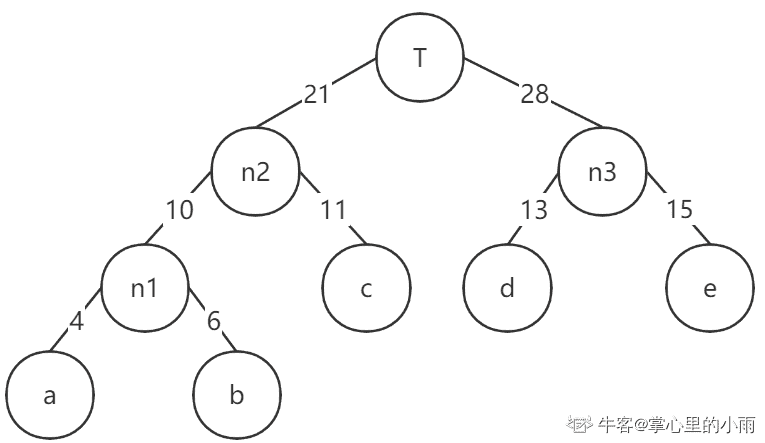
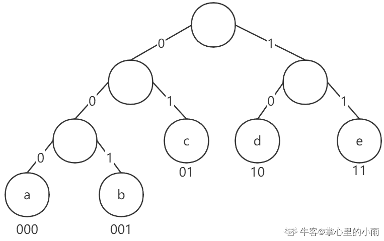
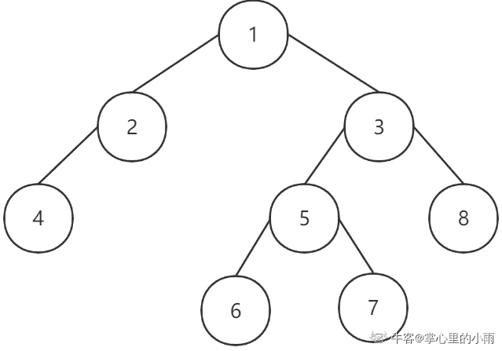

# 小红书 2020 校招测试开发&后端笔试题卷三

## 1

 a,b,c,d,e 对应出现的频率为 4，6，11，13，15；以下符合哈夫曼编码的选项是？（） 

正确答案: B   你的答案: 空 (错误)

```cpp
a=000、b=01、c=001、d=10、e=11
```

```cpp
a=000、b=001、c=01、d=10、e=11
```

```cpp
a=010、b=001、c=01、d=11、e=10
```

```cpp
a=000、b=10、c=001、d=11、e=01
```

本题知识点

Java 工程师 C++工程师 测试开发工程师 小红书 2020

讨论

[掌心里的小雨](https://www.nowcoder.com/profile/86073671)

哈夫曼编码

*   哈夫曼编码的目的就是数据压缩，加密解密，将出现频率低的放在二叉树的靠最下面的层，从而使频率高的能被更快的找到，实现数据压缩的功能
*   主要的编码过程是：
*   1.由于题目中这个频率是排好序的，可以看做有序序列。先取两个最小（a,b）作为一个新结点 n1 的两个子结点，相对较小的是左孩子，新结点的频率就是 a,b 两个频率的相加，即 4+6=10；然后将新结点 n1 替换 a，b 插入有序序列，整个就是{n1,c,d,e};
*   然后再取最小的两个结点（n1,c），产生的新结点 n2 的频率为 10+11=21，继续替换 n1，c 插入有序序列，整个就是{d,e,n2};
*   然后再取最小的两个结点（d,e），产生的新结点 n3 的频率为 13+15=28，继续替换 d，e 插入有序序列，序列就剩 2 个结点，小的作为左结点，大的是右节点，共同指向根结点 T，最后哈夫曼树就可画出来了。
    
*   最后将左分支改为 0，右分支改为 1，哈夫曼编码就是从树根到叶子所经过的 0 和 1 组成的，从这里可以看出，a 的频率最低，出现在最低层的叶子结点，达到数据压缩的目的
    
*   本人基础有所欠缺，如有解释不对的地方，望指出，谢谢！

编辑于 2020-06-03 11:12:46

* * *

## 2

对一棵先序遍历节点编号为 12435678，中序遍历为 42165738 的二叉树，进行左子节点优先的广度优先遍历，搜索到编号为 6 的节点需要几次查询（） 

正确答案: C   你的答案: 空 (错误)

```cpp
5
```

```cpp
6
```

```cpp
7
```

```cpp
8
```

本题知识点

Java 工程师 C++工程师 测试开发工程师 小红书 2020

讨论

[掌心里的小雨](https://www.nowcoder.com/profile/86073671)

*   首先，根据先序遍历可以确定第一个**1 为根节点**，然后找到 1 在中序遍历的位置，通过观察可以确定，2 和 4 为 1 的左子孙，进而确定 4 是 2 的孩子，1 的左子树确定。
*   然后 6,5,7,3,8 是 1 的右子孙，再观察先序遍历，**排除已经确定的 1,2,4，接下来是 3，然后就可以确定 3 是 1 的右孩子**，再根据中序遍历找到 3 的位置，可以知道，8 是 3 的右孩子，6,5,7 是 3 的左子孙，按照上面同理，可以得出，5 是 3 的左孩子，6 是 5 的左孩子，7 是 5 的右孩子，这个时候这个二叉树就可以画出来了。
    
*   再然后根据题目的意思，左节点优先，所以广度优先遍历，是**从上到下对每一层依次访问**，在每一层，**从左到右访问节点**，所以顺序是，1,2,3,4,5,8,**6**,7

编辑于 2020-08-14 22:13:58

* * *

## 3

某一个子网的子网掩码为 255.255.255.240，该子网中最多可以有多少主机？（） 

正确答案: B   你的答案: 空 (错误)

```cpp
13
```

```cpp
14
```

```cpp
15
```

```cpp
16
```

本题知识点

Java 工程师 C++工程师 测试开发工程师 小红书 2020

讨论

[掌心里的小雨](https://www.nowcoder.com/profile/86073671)

根据子网掩码为 255.255.255.240 第 4 位 240，转换为二进制为 11110000，因为**前四位为 1**，所以前四位用于 net_id,后四位为 host_id，可以划分**16**个子网（ ）,每一个子网可以容纳**14**个主机（ ），减掉的那两个地址指定为**直接广播地址**和**受限广播地址** ***   本人基础有所欠缺，如有解释不对的地方，望指出，谢谢！** 

编辑于 2020-06-03 11:13:46

* * *

[CodeStudents](https://www.nowcoder.com/profile/904304792)

256-240=16.然后减去 2 即为 14\.

比方说是 192.168.1.16 255.255.255.224，这样子的形式我们又要怎么计算主机数量呢？

我们要知道子网掩码是 0—255，这里面有 256 个数，则我们用 256 减去 224，得到 32，得出来的和上面一样，需要去掉网络地址和广播地址，则这个可用主机地址的数量就为 30。

发表于 2020-08-31 15:59:52

* * *

[LeeeeeMOON](https://www.nowcoder.com/profile/879222207)

C 类地址，。前 24 位网络号，255-240=15，主机号有 4 位，可划分 16 个子网。但是，全 0 是网络地址，全 1 是广播地址，所以最多可以有 14 个主机

发表于 2020-09-01 11:40:17

* * *

## 4

盒子里面装有外观一样但是笔迹颜色不同的笔共 8 支，其中黑色 5 支，蓝色 3 支，请问从盒子里面随机拿出 3 支笔，至少拿到 2 个蓝色的笔概率是 ()

正确答案: D   你的答案: 空 (错误)

```cpp
3/8
```

```cpp
2/3
```

```cpp
9/28
```

```cpp
2/7
```

本题知识点

Java 工程师 C++工程师 测试开发工程师 小红书 2020

讨论

[掌心里的小雨](https://www.nowcoder.com/profile/86073671)


发表于 2020-06-02 18:39:03

* * *

[Louis.Liu1](https://www.nowcoder.com/profile/909891291)

大佬们结题思路可以是这样的吗  黑色笔 5 支标记为(1,2,3,4,5),蓝色笔 3 支标记为(a,b,c) 求组合排列中有两个字母的几率

发表于 2020-12-07 17:17:33

* * *

[跪求一个 offer 啊啊啊啊啊啊](https://www.nowcoder.com/profile/510282628)

忘光了

发表于 2020-11-30 22:49:07

* * *

## 5

下面关于数据库索引的描述正确的有（）

正确答案: A C D   你的答案: 空 (错误)

```cpp
唯一索引列允许空值；
```

```cpp
使用 in 查询，联合索引不生效；
```

```cpp
 MySQL 的索引能使用 B+树或 hash 实现；
```

```cpp
查询条件的顺序不会影响联合索引的生效；
```

本题知识点

Java 工程师 C++工程师 测试开发工程师 小红书 2020

讨论

[小小莫疯](https://www.nowcoder.com/profile/699013377)

索引是否生效主要取决于字段类型：

1\. 如果字段类型为字符串，需要给 in 查询中的数值与字符串值都需要添加引号，索引才能起作用。

2\. 如果字段类型为 int，则 in 查询中的值不需要添加引号，索引也会起叙用。

IN 的字段，在联合索引中，按以上方法，也会起作用。

3.mysql 查询优化器认为全表扫描时如果速度大于使用索引，就会不用索引，你可以使用 FORCE INDEX 强制 mysql 使用索引

发表于 2020-06-06 19:33:51

* * *

[牛客 250618492 号](https://www.nowcoder.com/profile/250618492)

查询条件的顺序不会影响联合索引的生效；不好说，如果查询条件当中有大于或者小于呢？只有在字段全是等于的情况下才不影响调整顺序

发表于 2020-09-18 11:08:58

* * *

## 6

某小红薯在小红书的活动中抽奖中了一定价值的薯券，这些薯券可以用来购买一批商品，求有多少种购买组合。其中一件商品可以买多件。输 入:薯券金额、商品分别价格输出 :组合数

本题知识点

C++工程师 测试开发工程师 Java 工程师 小红书 2020

讨论

[暮雨今夕；](https://www.nowcoder.com/profile/5013893)

与力扣 [面试题 08.11\. 硬币](https://leetcode-cn.com/problems/coin-lcci/) 这题一样

```cpp
import java.util.*;

public class Main {

    public static void main(String[] args) {
        Scanner in = new Scanner(System.in);
        int n = in.nextInt();
        String s = in.next();
        String[] tmp = s.substring(1, s.length() - 1).split(",");
        int[] arr = new int[n + 1];
        int[] p = new int[tmp.length];
        for(int i = 0; i < tmp.length; i++) {
            p[i] = Integer.parseInt(tmp[i]);
        }

        arr[0] = 1;

        for(int a : p) {
            for(int i = a; i < arr.length; i++) {
                arr[i] = (arr[i] + arr[i - a]);
            }
        }

        System.out.println(arr[n]);
    }

}
```

编辑于 2020-06-20 16:13:26

* * *

[v 无风](https://www.nowcoder.com/profile/3660003)

解题思路: 动态规划/背包问题
定义数组 dp[i][j]表示金额为 j 的情况下，对于前 i 种商品，最多可以有多少种组合。
初始状态：
dp[...][0] = 1 表示在金额为 0 的情况下，无论有几种商品，只能有一种组合，那就是什么都不取这一种。
状态转移：
如果不选择当前第 i 个商品，组合数 dp[i-1][j]
如果选择当前第 i 个商品，组合数 dp[i][j-v[i-1]]

得出状态转移方程:
dp[i][j] = dp[i-1][j] + dp[i][j-v[i]] (v[i]表示商品的最大金额)

解释: dp[2][10] = dp[1][10] + dp[2][10-5] = 2 + 2 = 4

|  | 0 | 1 | 2 | 3 | 4 | 5 | 6 | 7 | 8 | 9 | 10 |
| 2 | 1 | 0 | 1 | 0 | 1 | 0 | 1 | 0 | 1 | 0 | 1 |
| 2,3 | 1 | 0 | 1 | 1 | 1 | 1 | 2 | 1 | 2 | 1 | 2 |
| 2,3,5 | 1 | 0 | 1 | 1 | 1 | 2 | 2 | 2 | 3 | 3 | 4 |

```cpp
//代码如下
import java.util.*;
public class Main {
    public int solution(int a[],int v){
        int dp[][] = new int[a.length][v+1];
        for (int i = 0; i < dp.length; i++) {
            dp[i][0]=1;
            for (int j = 1; j < dp[i].length; j++) {
                if(i==0){
                    if(j<a[i]){
                        dp[i][j]=0;
                    }else {
                        dp[i][j]=dp[i][j-a[i]];
                    }
                }else {
                    if(j<a[i]){
                        dp[i][j]=dp[i-1][j];
                    }else {
                        dp[i][j]=dp[i-1][j]+dp[i][j-a[i]];
                    }
                }
            }
        }
        return dp[dp.length-1][v];
    }
    public static void main(String[] args) {

        Scanner scanner = new Scanner(System.in);
        String s = scanner.nextLine();
        String[] s1 = s.split(" ");
        int v = Integer.parseInt(s1[0]);
        String[] s2 = s1[1].substring(1,s1[1].length()-1).split(",");
        int[] a = new int[s2.length];
        for (int i = 0; i < a.length; i++) {
            a[i] = Integer.parseInt(s2[i]);
        }
        System.out.println(new Main().solution(a, v));
    }
}
```

编辑于 2020-10-04 00:24:34

* * *

[爱因斯坦锋](https://www.nowcoder.com/profile/4063310)

刚开始格式输入错误都有 10%的正确率。。。其实就是动态规划。
dp[j]为当前价格 j 时的方案数，dp[0]就是价格为 0 时有一种方案（不给就好了），然后从每张券开始遍历就好了。

```cpp
#include<iostream>
#include<vector>
using namespace std;
int main(){
	int n, i= 0;
	cin>>n;
	int dp[10000] = {0};
	dp[0] = 1;
	vector<int> data;
	string Stringdata;
	cin>>Stringdata;
	while (i < Stringdata.length())
	    {
	        if (Stringdata[i] != ' ' && Stringdata[i] != '[' && Stringdata[i] != ',' && Stringdata[i] != ']')
	        {
	            int sum = 0;
	            while (Stringdata[i] != ',' && Stringdata[i] != ']')
	            {
	                sum *= 10;
	                sum += Stringdata[i] - '0';
	                i++;
	            }
	            data.push_back(sum);
	        }
	        else
	        {
	            i++;
	        }
	    }
	for(int c = 0; c < data.size(); c++){
		for(int j = data[c]; j <= n; j++){
			dp[j] += dp[j-data[c]];
		}
	}
	cout<<dp[n]<<endl;
}

```

发表于 2020-07-02 20:49:17

* * *

## 7

薯队长写了一篇笔记草稿，请你帮忙输出最后内容。 1.输入字符包括，"("    ,    ")"    和    "<"和其他字符。 2.其他字符表示笔记内容。 3.()之间表示注释内容，任何字符都无效。    括号保证成对出现。 4."<"表示退格,    删去前面一个笔记内容字符。括号不受"<"影响    。 

本题知识点

前端工程师 小红书 2020 C++工程师 测试开发工程师 Java 工程师 安卓工程师 iOS 工程师 算法工程师

讨论

[weiyinfu](https://www.nowcoder.com/profile/8575360)

就问问你们，谁有我短？

```cpp
s=input().strip()
a=[]
left=0
for i in s:
    if i=='(':
        left+=1
        continue
    if left:
        if i==')':
            left-=1
        continue
    if i=='<':
        a.pop()
    else:
        a.append(i)
s=''.join(a)
print(s)
```

发表于 2020-06-22 12:44:25

* * *

[你有猫饼嘛 i](https://www.nowcoder.com/profile/391134424)

```cpp
import java.util.ArrayList;
import java.util.List;
import java.util.Scanner;

public class Main {
    public static void main(String[] args) {
        Scanner scanner = new Scanner(System.in);
        StringBuffer stringBuffer = new StringBuffer();
        stringBuffer = new StringBuffer(scanner.nextLine());
        List<Integer> k = new ArrayList<>();
        //用一个列表来装括号的匹配
        //遇见‘（’添加首次匹配位置进去
        //遇见‘）’从最后一次‘（’匹配位置开始删除字符串
        for(int i = 0; i < stringBuffer.length();){
            if(stringBuffer.charAt(i)=='(') {
                k.add(i);
                i++;
            }
            else if(stringBuffer.charAt(i)=='<'&&k.size()==0) {
                stringBuffer.delete(i - 1, i + 1);
                i = i - 1;
            }
            else if(stringBuffer.charAt(i)==')') {
                stringBuffer.delete(k.get(k.size() - 1),i + 1);
                i = k.get(k.size() - 1);
                k.remove(k.size() - 1);
            }
            else
                i++;
        }
        System.out.println(stringBuffer);
    }
}
```

发表于 2020-08-05 21:01:30

* * *

[准备脱非入欧](https://www.nowcoder.com/profile/964977041)

在下拙见

```cpp
function fun(str) {
      var stack = [];
      str = str.split("");
      var res = '';
      for (var i = 0; i < str.length; i++) {
        if(str[i] != "(" && str[i] != ")" && stack.length == 0){
          res += str[i]
        }
        if(str[i] == "(" ){
          stack.push(i)
        }
        if(str[i] == ")"){
          stack.pop()
        }
      }
      res = res.split("");
      for(var i = 0 ; i < res.length ; i++){
        if(res[i] == "<"){
          res.splice(i-1,2);
          i--;
          i--;
        }
      };
       return res.toString().replace(/\,/g,"")
    }
```

发表于 2020-07-07 19:35:01

* * *

## 8

 薯队长写了 n 篇笔记，编号从 1~n,每篇笔记都获得了不少点赞数。    薯队长想从中选出一些笔记，作一个精选集合。挑选的时候有两个规则： 1.不能出现连续编号的笔记。 2.总点赞总数最多 如果满足 1，2 条件有多种方案，挑选笔记总数最少的那种

本题知识点

前端工程师 小红书 2020 C++工程师 测试开发工程师 Java 工程师 安卓工程师 iOS 工程师 算法工程师

讨论

[✭](https://www.nowcoder.com/profile/296604434)

类似打家劫舍的问题。利用动态规划 dp[i] = x 表示从 i 开始选笔记，最大点赞数为 x。dpNum[i]表示此时选取的次数动态转移方程为 dp[i] = max(dp[i+1], dp[i+2]+nums[i])由于本题还需要求次数，所以再构造一个 dpNum 数组，用来存储得到 dp[i]时，选取的笔记次数。状态方程与 dp 数组类似，当选取了 nums[i]，则 dpNum[i] = dpNum[i+2]+1,否则在不选取的情况下，dpNum[i]=dpNum[i+1]从后往前迭代求解，所以数组需初始化大小为 n+2,初值均为 0(方便求解 dp[n-1])

```cpp
import sys
n = eval(input())
nums = [int(i) for i in sys.stdin.readline().split()]
dp = [0 for _ in range(n+2)]
dpNum = [0 for _ in range(n+2)]
num = 0
for i in range(n-1, -1, -1):
    if dp[i+1] < dp[i+2]+nums[i]:
        dp[i] = dp[i+2]+nums[i]
        dpNum[i] = dpNum[i+2]+1
    else:
        dp[i] = dp[i+1]
        dpNum[i] = dpNum[i+1]
print(dp[0], dpNum[0])
```

编辑于 2020-06-26 11:49:10

* * *

[广州市民林先生](https://www.nowcoder.com/profile/241061362)

**思路：要在一个连续的数组里面选 k 个数，使得这 k 个数的点赞最多，并且还不能选编号连续的数（比如选了 nums[i]，就不能选 nums[i + 1]，只能选 nums[i + 2]........），那也就是说：要得到最大的点赞量，要看你前面是怎么选的，那既然后面的结果受前面的选择所影响，很容易联想到动态规划，因为通俗地讲，动态规划就是一个递推式，由前面推到后面，我们需要推到第 n 个数，从第 1 个数开始推。这样，我们定义 dp(n + 1)，dp[i]就表示选到第 i 个数的时候，能获得的最大点赞数。最终的 dp[n]就该是需要输出的最大点赞数。****那接下来就是怎么推的问题了。首先，遇到一个数 nums[i]，我有两种选择：选这个数，那么意味着我前面的 nums[i - 1]不能选，只能选 nums[i - 2]；不选这个数呢？那么意味着我可以选 nums[i - 1]，由于我要取最大点赞数，所以取它们俩的大者 赋值到 dp[i]即可，以此类推到 n。****至此，基本思路讲解完毕，现在还有一个问题，我们需要统计选了几个数。这个比较简单，选一个就+1,嘛，所以 count[i] = count[i - 2] + 1; 或者 count[i] = count[i - 1]，这时候应该可以理解这两句话的含义了吧，就是选与不选 nums[i]的问题了。下面看代码：**

```cpp
#include <iostream>
#include <vector>
using namespace std;

// dp[i]: 从第一篇笔记开始选到第 i 篇, 所能得到的最大点赞数。
// count[i]: 此时选取的笔记数量
int main(){
    int n, val;
    cin >> n;
    vector<int> vec(n + 1, 0);
    for(int i = 1; i <= n; ++i){
        cin >> val;
        vec[i] = val;
    }
    vector<int> dp(n + 1, 0);  
    vector<int> count(n + 1, 0);
    dp[1] = vec[1];  //选第一篇笔记, 最大点赞数自然就是 vec[1]
    count[1] = 1;    //选了一个数
    for(int i = 2; i <= n; ++i){
        //选了 dp[i - 2], 就不能选 dp[i - 1], 但可以选 veci
        if(dp[i - 1] < dp[i - 2] + vec[i]){
            dp[i] = dp[i - 2] + vec[i];
            count[i] = count[i - 2] + 1;
        } else{
            //不选 dp[i - 2]和 vec[i]
            dp[i] = dp[i - 1];
            count[i] = count[i - 1];
        }
    }
    cout << dp[n] << ' ' << count[n] << endl;
    return 0;
}
```

最后，leetcode 337 题 打家劫舍 III，思路类似，只不过从数组变成二叉树，感兴趣的可以试试。https://leetcode-cn.com/problems/house-robber-iii/

编辑于 2020-11-29 13:02:46

* * *

[融 360 内推](https://www.nowcoder.com/profile/598880162)

参考了大佬们的解法。

```cpp
def getMaxStar(n,nums):
    dp = [0 for _ in range(n+1)]
    dp2 = [0 for _ in range(n+1)]
    dp[1] = nums[0]
    dp2[1] = 1
    for i in range(2,n+1):
        if dp[i-1] < dp[i-2]+nums[i-1]:
            dp[i] = dp[i-2]+nums[i-1]
            dp2[i] = dp2[i-2]+1
        else:
            dp[i] = dp[i-1]
            dp2[i] = dp2[i-1]
    print(dp[-1], dp2[-1])

n = eval(input())
nums = [int(i) for i in input().split()]
getMaxStar(n, nums)

```

 编辑于 2020-07-21 18:22:00

* * *

## 9

在游戏中，击败魔物后，薯队长获得了 N 件宝物，接下来得把这些宝物卖给宝物回收员来赚点小钱。这个回收员有个坏毛病，每次卖给他一件宝 物后，之后他就看不上比这件宝物差的宝物了。在这个世界中，衡量宝物的好坏有两个维度，稀有度 X 和实用度 H，回收员在回收一个宝物 A 后，下一个宝物的稀有度和实用度都不能低于宝物 A。那么薯队长如何制定售卖顺序，才能卖给回收员宝物总个数最多。 

本题知识点

前端工程师 小红书 2020 C++工程师 测试开发工程师 Java 工程师 安卓工程师 iOS 工程师 算法工程师

讨论

[21CenturyBoy](https://www.nowcoder.com/profile/84805169)

```cpp
按照一个维度排序后按照另一个维度寻找最长增加子序列即可，这个是>=的比较简单一点，注意不能用 O(n2)，要二分查找优化

import java.util.*;
public class Main {
    public static void main(String[] args) {
        Scanner scanner = new Scanner(System.in);
        int n = scanner.nextInt();
        int[][] ans = new int[n][2];
        for(int i=0;i<n;i++){
            ans[i][0] = scanner.nextInt();
            ans[i][1] = scanner.nextInt();
        }
        Arrays.sort(ans,(a,b)->a[0]!=b[0]?a[0]-b[0]:a[1]-b[1]);
        int[] arr = new int[n];
        for(int i=0;i<n;i++)arr[i] = ans[i][1];
        System.out.println(LIS(arr));
    }
    public static int LIS(int[] arr){
        int[] dp = new int[arr.length];
        int res = 0;
        for(int num:arr){
            int l = 0,r = res;
            while (l<r){
                int m = (l+r)/2;
                if(dp[m]<num)l = m+1;
                else r = m;
            }
            dp[l] = num;
            if(l==res)res++;
        }
        return res;
    }
}
```

 发表于 2020-06-07 13:42:37

* * *

[准备脱非入欧](https://www.nowcoder.com/profile/964977041)

牛客网 的输入输出 真的 蛮搞人心态的 调整输入输出时间 跟 写代码时间一样长 做一道题花两道题时间😂😂 ```cpp
var num = readline();
var arr= [];
var n = null;
while(n = readline()){
    n=n.split(" ").map(item => {
        return Number(item)
    })
    arr.push(n)
}
arr.sort((d1, d2) => {
        return d1[0] != d2[0] ? d1[0] - d2[0] : d1[1] - d2[1]
      });
function LIS(num, arr) {
      var temp = [];
      for (var i = 0; i < num; i++) {
        temp.push(arr[i][1]);
      }
      let newArr = new Array(num);
      newArr[0] = temp[0]
      let end = 0;
      for (var k = 0; k < num; k++) {
        if (temp[k] > newArr[end]) {
          end++;
          newArr[end] = temp[k];
        } else {
          let left = 0 ;
          let right = end ;
          while(left < right){
            let mid = left + ((right - left) >> 1);
            if(newArr[mid] < temp[k]){
              left = mid + 1;
            } else {
              right = mid;
            }
          }
          newArr[left] = temp[k]
        }
      }
      return end + 1
    }
      console.log(LIS(num, arr)) ;
``` 

发表于 2020-07-09 21:26:13

* * *

[我不想当大白菜](https://www.nowcoder.com/profile/2462790)

分析

*   思路 先对数组排序(sort 函数会同时对两个维度排序，第一个维度相同时会比较第二个维度)，然后在另一个维度上搜索最长上升子序列。

```cpp
 input: [[32],[11],[13],[12]]

sorted(input):[[11],[12],[13],[32]]
```

*   时间复杂度的限制：在找最长上升子序列时不能使用 DP 方法(O(N²))，考虑通过二分查找来找到 LIS。
*   **LIS 的二分查找算法**：[参考: leetcode 300.最长上升子序列](https://leetcode-cn.com/problems/longest-increasing-subsequence/solution/zui-chang-shang-sheng-zi-xu-lie-by-leetcode-soluti/)
    *   构造单调上升数组 res，对原数组 nums 逐个遍历：
        *   如果 nums[i]>res[-1]，说明满足上升条件，将其插入数组中；
        *   否则，通过二分查找 res 数组中刚好比它大的值并进行替换。**当完成多次替换后该数组的最大值会减小，从而能向 res 中添加一些原数组中较小的值。**
    *   计算数组的长度得到 LIS 的最大值。
*   注意二分搜索时的边界以及返回值选择

```cpp
def binary_search(nums,left,right,val):
    mid = 0
    while left < right:
        mid = (left+right) // 2
        if val > nums[mid]:
            left = mid +1
        else:
            right = mid
    return left

def LIS(N,prices):
    res = []
    for i in range(N):
        if not res or prices[i] > res[-1]:
            res.append(prices[i])
        else:
            idx = binary_search(res, 0, len(res), prices[i])
            res[idx] = prices[i]
    return len(res)

def main():
    N = int(input())
    prices = []
    for i in range(N):
        prices.append(list(map(int,input().split())))
    prices.sort()
    h = [a[1] for a in prices]
    return LIS(N,h)

print(main())
```

编辑于 2020-07-06 22:30:59

* * *