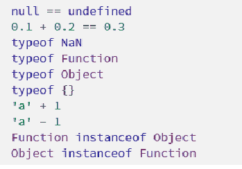
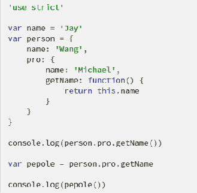
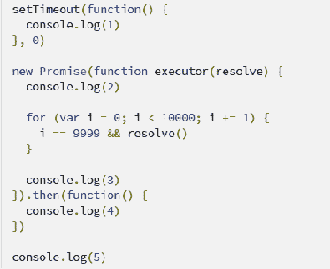
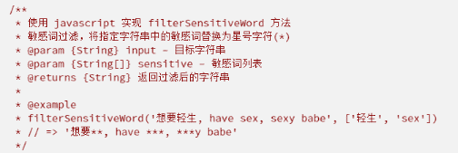
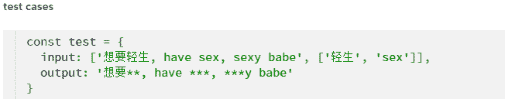
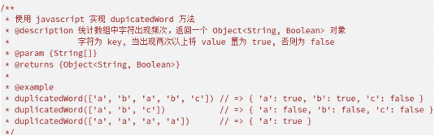
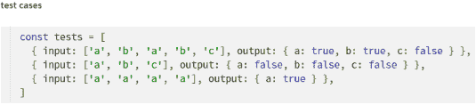

# 小红书 2020 校招前端笔试题卷二

## 1

下列说法错误的是（）

正确答案: A B   你的答案: 空 (错误)

```cpp
当前域的 cookie 都可以通过 js 在当前域下获取
```

```cpp
JSONP 是 XMLHttpRequest 中的一种
```

```cpp
同源策略是浏览器的安全策略
```

```cpp
 localStorage API 不支持设置过期时间
```

本题知识点

前端工程师 小红书 2020

讨论

[牛客 820178772 号](https://www.nowcoder.com/profile/820178772)

A.对于一些保密性较高的 cookie 后端可以通过设置 HttpOnly 标记 cookie 只能通过 http 传递，前端 js 无法读取；B.JSONP 用的是 html 的 script 标签，xmlhttprequest 是浏览器内置的 HTTP 相关对象，两者不同。

发表于 2020-07-22 16:30:21

* * *

## 2

下列说法正确的是（）

正确答案: B C   你的答案: 空 (错误)

```cpp
setTimeout(foo, 0) 这行代码可以等价替换为 foo()
```

```cpp
使用 Object.assign(obj1, obj2) 可以实现对象的浅拷贝
```

```cpp
 for...in 循环只能遍历对象上的可枚举属性
```

```cpp
Object.keys() 可以遍历出对象原型链上的属性
```

本题知识点

前端工程师 小红书 2020

讨论

[peggy201802280105595](https://www.nowcoder.com/profile/9847471)

ES5 引入了 Object.keys 方法，成员是参数对象自身的（不含继承的）所有可遍历（ enumerable ）属性的键名。for...in 循环对象的所有枚举属性(包括原型上)，然后再使用 hasOwnProperty()方法来忽略继承属性;获取实例对象 obj 的原型对象，有三种方法
obj.__proto__ 
obj.constructor.prototype 
Object.getPrototypeOf(obj) 
上面三种方法之中，前两种都不是很可靠。 
最新的 ES6 标准规定，__proto__ 属性只有浏览器才需要部署，其他环境可以不部署。而 obj.constructor.prototype 在手动改变原型对象时，可能会失效。

发表于 2020-06-02 17:22:53

* * *

## 3

下列说法正确的是（）

正确答案: A C D   你的答案: 空 (错误)

```cpp
requestAnimationFrame(foo) 确保使浏览器在下一次重绘之前调用 foo 方法
```

```cpp
在 addEventListener 的处理方法中使用 e.preventDefault() 可以阻止事件冒泡
```

```cpp
 把 <script> 标签的引入放在文档末尾可以确保脚本下载和执行均在文档解析完成后发生
```

```cpp
多个 <script> 标签使用 defer 属性引入脚本时，可以确保脚本的执行是按照其被引入的顺序的
```

本题知识点

前端工程师 小红书 2020

讨论

[peggy201802280105595](https://www.nowcoder.com/profile/9847471)

addEventListener 函数第三个参数 useCapture，参数值是布尔值，默认是 false。当 useCapture 为 false 时，事件处理采取事件冒泡的原则，当 userCapture 为 true 时，则采取事件捕获的原则

发表于 2020-06-02 17:33:44

* * *

[牛客 589890733 号](https://www.nowcoder.com/profile/589890733)

D 选项，可以参考一下[`discourse.mozilla.org/t/async-v-s-defer/53819/3`](https://discourse.mozilla.org/t/async-v-s-defer/53819/3)，我简单总结一下：如果没有 defer 和 async，DOM 的构建运行到 js 脚本在 html 文件中的位置时会停止，转去执行 js，如果 js 文件还没下载完成，还需要等 js 文件下载完成才能开始执行，执行完之后，再接着构建 DOM。而如果添加了 defer 或 async，那么这个 js 脚本的下载(注意是下载过程)就不会阻塞 DOM 构建，这是他们的共同点。不同点有两个，(1)async 脚本下载完成后会立刻执行，如果 DOM 尚未构建完成，就会暂停构建 DOM 转而执行这个 async 脚本，也就是说 async 脚本的执行是有可能阻塞 DOM 构建的，而 defer 脚本，会等待 DOM 构建完成后才执行，即使它已经下载好了；(2)如果有多个 async 脚本，他们的执行顺序并不保证和他们在 html 文件中的顺序一致，其实应该就是下载完成的顺序，而 defer 会按照他们在 html 文件中的顺序执行。

编辑于 2022-01-28 16:59:41

* * *

## 4

JavaScript 严格模式下有哪些不同？

你的答案

本题知识点

前端工程师 小红书 2020

讨论

[找呀找朋友](https://www.nowcoder.com/profile/8174627)

严格模式指的是 js 引擎以严格模式去执行，我们只要在代码前或者函数前添加“use strict”就可以开启严格模式了。在严格模式下对 js 代码的执行添加了一些限制，主要是为了保证代码在安全环境中执行，减少不必要的错误，为了消除 js 中的一些不严谨、不合理、不安全的地方，它代表了 js 一种更加合理、更加安全、更加规范的一个发展方向。在严格模式下，在全局执行上下文的 this 和全局执行上下文的函数内 this 不再指向 windon 对象；变量必须先声明再使用，不存在变量提升；var 声明的变量不允许重复声明同一个变量；

发表于 2020-07-28 16:12:37

* * *

[何小变](https://www.nowcoder.com/profile/886518012)

严格模式下，变量必须声明再使用。严格模式下，预编译时 this 为 undefined；严格模式下，不支持 arguments、caller、callee、with；严格模式下，拒绝重复的属性和参数；严格模式下，局部的 this 必须被赋值、赋值什么就是什么。

发表于 2020-09-25 08:54:20

* * *

[牛客 551826535 号](https://www.nowcoder.com/profile/551826535)

严格模式下，变量必须声明再使用。 严格模式下，预编译时 this 为 undefined； 严格模式下，不支持 arguments、caller、callee、with； 严格模式下，拒绝重复的属性和参数； 严格模式下，局部的 this 必须被赋值、赋值什么就是什么。

发表于 2021-02-19 09:50:33

* * *

## 5

请给出下列代码的输出：

你的答案

本题知识点

前端工程师 小红书 2020

讨论

[墨沫漠茉](https://www.nowcoder.com/profile/149300444)

第二条，0.1+0.2 会等于 0.30000000000000004

发表于 2020-10-02 00:11:12

* * *

[Ly924102832](https://www.nowcoder.com/profile/225735940)

'a1'这个题目是不是该写成'a'+'1'

发表于 2020-10-22 10:39:48

* * *

## 6

请描述打印结果并解释原因：

你的答案

本题知识点

前端工程师 小红书 2020

讨论

[找呀找朋友](https://www.nowcoder.com/profile/8174627)

"use strict"声明以严格模式执行输出：“Michael”解释：这里是 person.pro 调用了 getName(),getName()里面的 this 指向了 person.pro,所以这里的 this.name == "Michael"输出：error 报错解释：将 person.pro.getName 方法赋给了 pepole,然后在全局执行上下文中调用了 pepole(),因为是在严格模式下执行，所以 pepole()里面的 this 是指向 undefined,undefined 又获取 name 属性，最后导致报错

发表于 2020-07-28 16:14:46

* * *

[牛客 820178772 号](https://www.nowcoder.com/profile/820178772)

1.第一个打印是 person.pro.getName 的结果，getName 返回的结果是 this.name，因为 this 指向的是调用函数的环境对象，getName 函数是由 person.pro 调用的，所以 this 指向的是 person.pro，this.name 为 person.pro.name 即'Michael'。2.由开始的字符串'use strict'知道本代码段使用的是严格模式，在严格模式下，this 的指向不能全局变量，为全局的会报错。参考：[`www.ruanyifeng.com/blog/2013/01/javascript_strict_mode.html?utm_source=tuicool&utm_medium=referral`](http://www.ruanyifeng.com/blog/2013/01/javascript_strict_mode.html?utm_source=tuicool&utm_medium=referral)测试代码： ```cpp
'use strict'
var name = 'Jay'
var person ={
    name : 'Wang',
    pro:{
        name:'Michael',
        getName:function(){
                return this.name;
        }    
    }
}
console.log(person.pro.getName());
var pepole = person.pro.getName;//这里我猜是‘=’的。。。
console.log(pepole());
``` 

发表于 2020-07-22 17:58:39

* * *

## 7

请表述以下代码的执行结果和原因：

你的答案

本题知识点

前端工程师 小红书 2020

讨论

[找呀找朋友](https://www.nowcoder.com/profile/8174627)

将定时器 setTimeout 里面的回调函数添加到宏任务队列中；实例化 Promise 对象，同步执行执行器函数输出 2，改变 promise 对象的状态为 resolve，输出 3，将 then 回调函数添加到微任务队列中；输出 5；同步代码执行完毕，执行异步任务；查看微任务队列，执行 then 回调函数，输出 4；微任务队列执行完毕，查看宏任务队列，执行 setTimeout 的回调函数，输出 1。结果：2 3 5 4 1

发表于 2020-07-28 16:15:11

* * *

[牛客 682345279 号](https://www.nowcoder.com/profile/682345279)

先是同步任务包括 new Promise(function())里面的任务和 console.log(5)从上到下顺序，然后是微任务这里是 then 里面的，然后是宏任务 setTimeout（）里的

发表于 2021-03-06 16:56:37

* * *

[卖女孩的小小火柴](https://www.nowcoder.com/profile/4669936)

3 也会打印吗

发表于 2020-07-05 11:53:59

* * *

## 8

JavaScript 严格模式下有哪些不同？

你的答案

本题知识点

前端工程师 小红书 2020

讨论

[夏夜里的晚风](https://www.nowcoder.com/profile/58050086)

在严格模式下，在全局执行上下文的 this 和全局执行上下文的函数内 this 不再指向 windon 对象；变量必须先声明再使用，不存在变量提升；var 声明的变量不允许重复声明同一个变量。 1.  不允许使用未声明的变量。对象也是一个变量。
2.  不允许对变量或函数使用 delete 操作符
3.  不允许变量重名

4.  不允许使用八进制
5.  禁止 this 关键字指向全局对象
6.  不可在 if 内部声明函数 

编辑于 2020-11-09 19:20:17

* * *

[牛客 520782121 号](https://www.nowcoder.com/profile/520782121)

使用了严格模式后，定义一个变量必须在前进行变量声明否则会报错，静默失败升级为错误，普通函数调用或匿名函数自调中的 this 不再默认指向 window，而是 undefined，禁止使用 arguments.callee。

发表于 2020-09-18 14:29:04

* * *

## 9



你的答案

本题知识点

前端工程师 小红书 2020

讨论

[上岸酱](https://www.nowcoder.com/profile/768369819)

function fn(str,arr){        for(let item of arr){            let len = item.length            let ret = new RegExp(`${item}`,'g')            str = str.replace(ret,'*'.repeat(len))        }        return str     }console.log(fn('想要轻生，have sex,sexy,babe',['轻生','sex']))

发表于 2020-06-15 01:45:49

* * *

[DoubleAm](https://www.nowcoder.com/profile/849243490)

function hxb(str,arr){ 
 return str.replace(new RegExp(arr.join("|"),'g'),"**"); 
 }
hxb(test.input[0],test.input[1]);

发表于 2020-10-14 10:37:04

* * *

[AngelSum](https://www.nowcoder.com/profile/309639941)

```cpp
function foo(str,arr){
    for(let item of arr){
        let len = item.length
        let rgx = new RegExp(`${item}`,'g')
        str = str.replace(rgx,'*'.repeat(len))
    }
    return str
}
```

发表于 2020-10-06 19:39:53

* * *

## 10



你的答案

本题知识点

前端工程师 小红书 2020

讨论

[某不知名用户](https://www.nowcoder.com/profile/294697890)

```cpp
function duplicates (arr) {
  let obj = {};
  arr.forEach((str) => {
    obj[str] = typeof obj[str] === 'undefined' ? false: true;
  });

  return obj;
}
```

发表于 2020-06-30 18:59:33

* * *

[来个 offerbei](https://www.nowcoder.com/profile/918961569)

function dupicatedWord(array){ let obj ={}; for(item of array){ obj[item]= obj.hasOwnProperty(item); } return obj; }

发表于 2020-11-04 11:38:10

* * *

[Mr.Jidt](https://www.nowcoder.com/profile/9081062)

function Count (arr = []) {    let newArr = arr.reduce((t, v) => (t[v] = (t[v] || 0) + 1, t), {})
    for (let i = 0; i < Object.values(newArr).length; i++) {        newArr[Object.keys(newArr)[i]] = Boolean(Object.values(newArr)[i] - 1)    }    return newArr}

发表于 2020-09-08 11:42:43

* * *

## 11

薯队长写了一篇笔记草稿，请你帮忙输出最后内容。 1.输入字符包括，"("    ,    ")"    和    "<"和其他字符。 2.其他字符表示笔记内容。 3.()之间表示注释内容，任何字符都无效。    括号保证成对出现。 4."<"表示退格,    删去前面一个笔记内容字符。括号不受"<"影响    。 

本题知识点

前端工程师 小红书 2020 C++工程师 测试开发工程师 Java 工程师 安卓工程师 iOS 工程师 算法工程师

讨论

[weiyinfu](https://www.nowcoder.com/profile/8575360)

就问问你们，谁有我短？

```cpp
s=input().strip()
a=[]
left=0
for i in s:
    if i=='(':
        left+=1
        continue
    if left:
        if i==')':
            left-=1
        continue
    if i=='<':
        a.pop()
    else:
        a.append(i)
s=''.join(a)
print(s)
```

发表于 2020-06-22 12:44:25

* * *

[你有猫饼嘛 i](https://www.nowcoder.com/profile/391134424)

```cpp
import java.util.ArrayList;
import java.util.List;
import java.util.Scanner;

public class Main {
    public static void main(String[] args) {
        Scanner scanner = new Scanner(System.in);
        StringBuffer stringBuffer = new StringBuffer();
        stringBuffer = new StringBuffer(scanner.nextLine());
        List<Integer> k = new ArrayList<>();
        //用一个列表来装括号的匹配
        //遇见‘（’添加首次匹配位置进去
        //遇见‘）’从最后一次‘（’匹配位置开始删除字符串
        for(int i = 0; i < stringBuffer.length();){
            if(stringBuffer.charAt(i)=='(') {
                k.add(i);
                i++;
            }
            else if(stringBuffer.charAt(i)=='<'&&k.size()==0) {
                stringBuffer.delete(i - 1, i + 1);
                i = i - 1;
            }
            else if(stringBuffer.charAt(i)==')') {
                stringBuffer.delete(k.get(k.size() - 1),i + 1);
                i = k.get(k.size() - 1);
                k.remove(k.size() - 1);
            }
            else
                i++;
        }
        System.out.println(stringBuffer);
    }
}
```

发表于 2020-08-05 21:01:30

* * *

[准备脱非入欧](https://www.nowcoder.com/profile/964977041)

在下拙见

```cpp
function fun(str) {
      var stack = [];
      str = str.split("");
      var res = '';
      for (var i = 0; i < str.length; i++) {
        if(str[i] != "(" && str[i] != ")" && stack.length == 0){
          res += str[i]
        }
        if(str[i] == "(" ){
          stack.push(i)
        }
        if(str[i] == ")"){
          stack.pop()
        }
      }
      res = res.split("");
      for(var i = 0 ; i < res.length ; i++){
        if(res[i] == "<"){
          res.splice(i-1,2);
          i--;
          i--;
        }
      };
       return res.toString().replace(/\,/g,"")
    }
```

发表于 2020-07-07 19:35:01

* * *

## 12

薯队长最近在玩一个迷宫探索类游戏，迷宫是一个 N*N 的矩阵形状，其中会有一些障碍物禁止通过。这个迷宫还有一个特殊的设计，它的左右 边界以及上下边界是连通的，比如在(2,n)的位置继续往右走一格可以到(2,1)，    在(1,2)的位置继续往上走一格可以到(n,2)。请问薯队长从起点位置 S，最少走多少格才能到达迷宫的出口位置 E。 

本题知识点

前端工程师 小红书 2020 C++工程师 测试开发工程师 Java 工程师 安卓工程师 iOS 工程师 算法工程师

讨论

[FCWang](https://www.nowcoder.com/profile/501844930)

```cpp
n = int(input())
grid, S_OR = [], []
for i in range(n):
    crow = list(input())
    if 'S' in crow:
        S_OR = [i, crow.index('S')]
    grid.append(crow)

def BFS(grid, S_OR, n):
    dx, dy = [1, -1, 0, 0], [0, 0, 1, -1]
    queue = [S_OR]
    visited = [[False for _ in range(n)] for _ in range(n)]
    visited[S_OR[0]][S_OR[1]] = True
    step = 0
    while queue:
        step += 1
        len_queue = len(queue)
        for _ in range(len_queue):
            q = queue.pop(0)
            for _x, _y in zip(dx, dy):
                x, y = (q[0] + _x + n) % n, (q[1] + _y + n) % n
                if not visited[x][y] and grid[x][y] != '#':
                    if grid[x][y] == 'E':
                        return step
                    queue.append([x, y])
                    visited[x][y] = True
    return -1

print(BFS(grid, S_OR, n))
```

发表于 2020-08-29 20:16:41

* * *

[准备脱非入欧](https://www.nowcoder.com/profile/964977041)

亲测可过 不过牛客网的输入有点烦 代码将就看一下吧

```cpp
function node(x, y, layer) {
      this.x = x;
      this.y = y;
      this.layer = layer;
    }
    function fn(a, arr) {
      var xStart = -1, yStart = -1;
      var xEnd = -1, yEnd = -1;
      var count = 0;
      for (var i = 0; i < arr.length; i++) {
        for (var k = 0; k < arr[0].length; k++) {
          if (arr[i][k] == 's') {
            xStart = i;
            yStart = k;
          }
          if (arr[i][k] == 'e') {
            xEnd = i;
            yEnd = k;
          }
        }
      }
      var stack = [];
      stack.push(new node(xStart,yStart,0));
      var newArr = arr.slice();
      var x = -1 , y = -1;
      //---------------------------------------bfs
      while(stack.length > 0){
        var temp = stack.shift();
        if(temp.x == xEnd && temp.y == yEnd){
          return temp.layer
        }
        x = temp.x + 1 ; y = temp.y;
        if(x == a) x = 0;
        if(newArr[x][y] != '#') {stack.push(new node(x , y , temp.layer + 1)) ; newArr[x][y] = '#'};
        //---------------
        x = temp.x - 1 ; y = temp.y;
        if(x == -1) x = a - 1;
        if(newArr[x][y] != '#') {stack.push(new node(x , y , temp.layer + 1)) ; newArr[x][y] = '#'};
        //-------------
        x = temp.x  ; y = temp.y + 1;
        if(y == a) y = 0;
        if(newArr[x][y] != '#') {stack.push(new node(x , y , temp.layer + 1)) ; newArr[x][y] = '#'};
        //-----------------
        x = temp.x  ; y = temp.y - 1;
        if(y == -1) y = a - 1;
        if(newArr[x][y] != '#') {stack.push(new node(x , y , temp.layer + 1)) ; newArr[x][y] = '#'};

      }
      return "-1"
    }
    var a = 5, arr = [[1, '#', 1, 1, 1], [1, 1, '#', 's', 1], [1, 'e', '#', '#', '#'], [1, 1, 1, 1, 1], [1, 1, 1, 1, 1]]
    fn(a, arr)
```

发表于 2020-07-08 17:16:49

* * *

[独 259](https://www.nowcoder.com/profile/1548511)

这一题的测试用例不完整，，，下面是我的思路，大佬可以点评一下使用两个二维数组，将起点步数设为 0。广度遍历的思想。用队列记录点，当一个新点出队时，检查上下左右四个点(注意连通性条件)。如果这些点是墙，我们就不处理。否则，若点未访问过或者之前的步数太多(走的太麻烦)，跟新步数并把这一点入队。(我的疑问就是这里，走的太麻烦的点还要入队吗？自我感觉，广度遍历不需要，因为广度不会出现这种情况，但是深度遍历是需要的) 

```cpp
n = int(input())
mat = [[0] * n] * n
result = [[-1] * n for _ in range(n)]
for i in range(n):
    mat[i] = list(input())
queue = []

for i in range(n):
    for j in range(n):
        if mat[i][j] == 'S':
            queue.append([i, j])
            result[i][j] = 0
        if mat[i][j] == 'E':
            end = [i, j]
while queue:
    point = queue.pop(0)
    x = point[0]
    y = point[1]
    left = [x, n - 1] if y == 0 else [x, y - 1]
    right = [x, 0] if y == n - 1 else [x, y + 1]
    up = [n-1, y] if x == 0 else [x - 1, y]
    down = [0, y] if x == n - 1 else [x + 1, y]
    near_p = [left, right, up, down]
    for point in near_p:
        if mat[point[0]][point[1]] != '#':
            if result[point[0]][point[1]] == -1&nbs***bsp;result[point[0]][point[1]] > result[x][y] + 1:
                queue.append(point)
                result[point[0]][point[1]] = result[x][y] + 1
print(result[end[0]][end[1]])
```

编辑于 2020-06-11 15:19:29

* * *

## 13

在游戏中，击败魔物后，薯队长获得了 N 件宝物，接下来得把这些宝物卖给宝物回收员来赚点小钱。这个回收员有个坏毛病，每次卖给他一件宝 物后，之后他就看不上比这件宝物差的宝物了。在这个世界中，衡量宝物的好坏有两个维度，稀有度 X 和实用度 H，回收员在回收一个宝物 A 后，下一个宝物的稀有度和实用度都不能低于宝物 A。那么薯队长如何制定售卖顺序，才能卖给回收员宝物总个数最多。 

本题知识点

前端工程师 小红书 2020 C++工程师 测试开发工程师 Java 工程师 安卓工程师 iOS 工程师 算法工程师

讨论

[21CenturyBoy](https://www.nowcoder.com/profile/84805169)

```cpp
按照一个维度排序后按照另一个维度寻找最长增加子序列即可，这个是>=的比较简单一点，注意不能用 O(n2)，要二分查找优化

import java.util.*;
public class Main {
    public static void main(String[] args) {
        Scanner scanner = new Scanner(System.in);
        int n = scanner.nextInt();
        int[][] ans = new int[n][2];
        for(int i=0;i<n;i++){
            ans[i][0] = scanner.nextInt();
            ans[i][1] = scanner.nextInt();
        }
        Arrays.sort(ans,(a,b)->a[0]!=b[0]?a[0]-b[0]:a[1]-b[1]);
        int[] arr = new int[n];
        for(int i=0;i<n;i++)arr[i] = ans[i][1];
        System.out.println(LIS(arr));
    }
    public static int LIS(int[] arr){
        int[] dp = new int[arr.length];
        int res = 0;
        for(int num:arr){
            int l = 0,r = res;
            while (l<r){
                int m = (l+r)/2;
                if(dp[m]<num)l = m+1;
                else r = m;
            }
            dp[l] = num;
            if(l==res)res++;
        }
        return res;
    }
}
```

 发表于 2020-06-07 13:42:37

* * *

[准备脱非入欧](https://www.nowcoder.com/profile/964977041)

牛客网 的输入输出 真的 蛮搞人心态的 调整输入输出时间 跟 写代码时间一样长 做一道题花两道题时间😂😂 ```cpp
var num = readline();
var arr= [];
var n = null;
while(n = readline()){
    n=n.split(" ").map(item => {
        return Number(item)
    })
    arr.push(n)
}
arr.sort((d1, d2) => {
        return d1[0] != d2[0] ? d1[0] - d2[0] : d1[1] - d2[1]
      });
function LIS(num, arr) {
      var temp = [];
      for (var i = 0; i < num; i++) {
        temp.push(arr[i][1]);
      }
      let newArr = new Array(num);
      newArr[0] = temp[0]
      let end = 0;
      for (var k = 0; k < num; k++) {
        if (temp[k] > newArr[end]) {
          end++;
          newArr[end] = temp[k];
        } else {
          let left = 0 ;
          let right = end ;
          while(left < right){
            let mid = left + ((right - left) >> 1);
            if(newArr[mid] < temp[k]){
              left = mid + 1;
            } else {
              right = mid;
            }
          }
          newArr[left] = temp[k]
        }
      }
      return end + 1
    }
      console.log(LIS(num, arr)) ;
``` 

发表于 2020-07-09 21:26:13

* * *

[我不想当大白菜](https://www.nowcoder.com/profile/2462790)

分析

*   思路 先对数组排序(sort 函数会同时对两个维度排序，第一个维度相同时会比较第二个维度)，然后在另一个维度上搜索最长上升子序列。

```cpp
 input: [[32],[11],[13],[12]]

sorted(input):[[11],[12],[13],[32]]
```

*   时间复杂度的限制：在找最长上升子序列时不能使用 DP 方法(O(N²))，考虑通过二分查找来找到 LIS。
*   **LIS 的二分查找算法**：[参考: leetcode 300.最长上升子序列](https://leetcode-cn.com/problems/longest-increasing-subsequence/solution/zui-chang-shang-sheng-zi-xu-lie-by-leetcode-soluti/)
    *   构造单调上升数组 res，对原数组 nums 逐个遍历：
        *   如果 nums[i]>res[-1]，说明满足上升条件，将其插入数组中；
        *   否则，通过二分查找 res 数组中刚好比它大的值并进行替换。**当完成多次替换后该数组的最大值会减小，从而能向 res 中添加一些原数组中较小的值。**
    *   计算数组的长度得到 LIS 的最大值。
*   注意二分搜索时的边界以及返回值选择

```cpp
def binary_search(nums,left,right,val):
    mid = 0
    while left < right:
        mid = (left+right) // 2
        if val > nums[mid]:
            left = mid +1
        else:
            right = mid
    return left

def LIS(N,prices):
    res = []
    for i in range(N):
        if not res or prices[i] > res[-1]:
            res.append(prices[i])
        else:
            idx = binary_search(res, 0, len(res), prices[i])
            res[idx] = prices[i]
    return len(res)

def main():
    N = int(input())
    prices = []
    for i in range(N):
        prices.append(list(map(int,input().split())))
    prices.sort()
    h = [a[1] for a in prices]
    return LIS(N,h)

print(main())
```

编辑于 2020-07-06 22:30:59

* * *