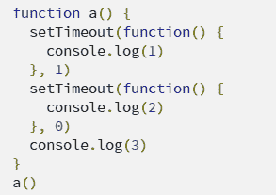
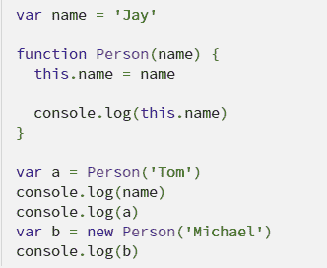
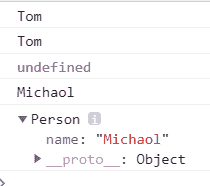
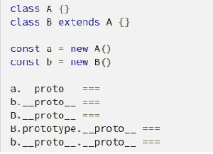
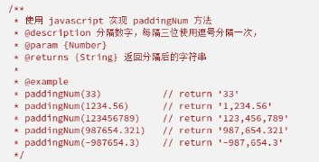
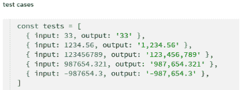
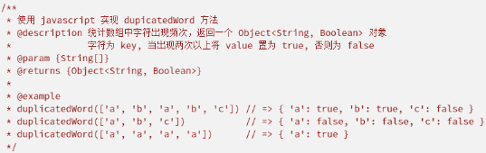
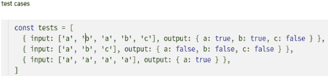

# 小红书 2020 校招前端笔试题卷三

## 1

下列说法正确的是（）

正确答案: B C   你的答案: 空 (错误)

```cpp
setTimeout(foo, 0) 这行代码可以等价替换为 foo()
```

```cpp
使用 Object.assign(obj1, obj2) 可以实现对象的浅拷贝
```

```cpp
for...in 循环可以遍历对象自身及其原型链上的可枚举属性
```

```cpp
Object.keys() 可以遍历出对象原型链上的属性
```

本题知识点

前端工程师 小红书 2020

讨论

[25+](https://www.nowcoder.com/profile/108288735)

for in 循环是遍历对象上的每一个可枚举属性,包括原型链上面的可枚举属性,obeject.keys()只是遍历自身的可枚举属性,不可以遍历原型链上的可枚举属性,object.assign()对象的拷贝,用于将所有可枚举属性的值从一个或多个源对象复制到目标对象,将他返回到目标对象

发表于 2020-07-05 10:51:44

* * *

[蹲在旮旯的木鱼](https://www.nowcoder.com/profile/176988994)

注意第二个选项，写的是可以，不是必须的

发表于 2020-06-05 15:57:28

* * *

[凸必囊波丸](https://www.nowcoder.com/profile/190780)

for in 可以遍历原型链上的属性 而 Object.keys 只可以遍历自身的可枚举属性

发表于 2020-10-23 12:41:35

* * *

## 2

下列结果返回 true 的是（）

正确答案: A C   你的答案: 空 (错误)

```cpp
 null == undefined
```

```cpp
null === undefined
```

```cpp
null === null
```

```cpp
 NaN == null
```

```cpp
NaN === NaN
```

```cpp
Infinity + 1 !== Infinity
```

本题知识点

前端工程师 小红书 2020

讨论

[洱海（▿）](https://www.nowcoder.com/profile/775237523)

NaA 与任何不相等 ===是严格相等，会比较值和类型，null 和 undefined 是不同种类型，但值相等

发表于 2020-06-15 10:33:03

* * *

[25+](https://www.nowcoder.com/profile/108288735)

NaN(not a number),它是表示是否为 number 类型的一种状态:是或否,并不是返回了一个确切的值,那么他的数字范围就不是一个数字,而是一个范围

发表于 2020-07-05 10:33:24

* * *

## 3

以下代码的运行结果是？()

正确答案: A   你的答案: 空 (错误)

```cpp
321
```

```cpp
123
```

```cpp
213
```

```cpp
312
```

本题知识点

前端工程师 小红书 2020

讨论

[spring-breeze](https://www.nowcoder.com/profile/688356177)

setTimeout 有最小时间限制 4ms(但是实际上不是准确的,最小时间限制并不在 ecma 规范中,这题出的属实不行),所以 0 和 1 其实没区别

编辑于 2020-07-04 13:37:43

* * *

[刘江 a](https://www.nowcoder.com/profile/307678714)

312

发表于 2020-06-16 21:37:04

* * *

[code 翔](https://www.nowcoder.com/profile/998110650)

火狐：321 其他浏览器：312node：312

发表于 2020-07-05 17:33:13

* * *

## 4

请给出打印出的值：

你的答案

本题知识点

前端工程师 小红书 2020

讨论

[凌哲 OLAP](https://www.nowcoder.com/profile/127102354)

使用 new 操作符时，构造函数内的 this 就指向相应的实例化对象；
未使用 new 操作符时，为普通函数调用，全局函数内的 this 指向 window。

所以语句 var a = Person('Tom') 将全局范围内的 name 变量改成了 Tom，故第二行输出为 Tom。

编辑于 2020-06-18 17:08:56

* * *

[夏小虾](https://www.nowcoder.com/profile/5521349)

Person("Tom") 相当于只是执行 Person 函数，里面没有返回值，所以 console.log(a)输出 undefined。

发表于 2020-06-07 15:01:17

* * *

[梦阳的梦](https://www.nowcoder.com/profile/437964903)



发表于 2020-06-12 15:02:23

* * *

## 5

请表述以下代码的执行结果和原因：


你的答案

本题知识点

前端工程师 小红书 2020

讨论

[找呀找朋友](https://www.nowcoder.com/profile/8174627)

ES6 中的 class 继承中将父类的原型对象作为了子类的原型对象的原型对象，所以 B.prototype.__proto__ === A.prototype,   b.__proto__.__proto__ === A.prototype

发表于 2020-07-24 23:00:55

* * *

[夏木是天才](https://www.nowcoder.com/profile/665205700)

```cpp
class A{}
      class B extends A{}
      const a=new A()
      const b=new B()
      console.log(a.__proto__===A.prototype)
      console.log(b.__proto__===B.prototype)
      console.log(B.__proto__===A)
      console.log(B.prototype.__proto__===A.prototype)
      console.log(b.__proto__.__proto__===A.prototype)
      console.log('-----------------------')
      console.log(b.__proto__===B.prototype)
      console.log(b.__proto__.__proto__===A.prototype)
      console.log(b.__proto__.__proto__.__proto__===Object.prototype)
      console.log(b.__proto__.__proto__.__proto__.__proto__===Object.prototype.__proto__)
      console.log(b.__proto__.__proto__.__proto__.__proto__===null)
      console.log('-----------------------')
      console.log(a.__proto__===A.prototype)
      console.log(a.__proto__.__proto__===Object.prototype)
      console.log(a.__proto__.__proto__.__proto__===null)
```

发表于 2021-07-06 16:32:19

* * *

[BubbleTg](https://www.nowcoder.com/profile/3275039)

感觉我的理解能力好差呀。看了几遍才看懂题目。**

发表于 2020-12-28 10:35:26

* * *

## 6

请用 HTML+CSS 实现一个定宽定高元素在容器中的水平和垂直居中。

你的答案

本题知识点

前端工程师 小红书 2020

讨论

[找呀找朋友](https://www.nowcoder.com/profile/8174627)

// flex 实现.father{
                display: flex;
                justify-content: center;
                align-items: center;
            }
// 利用绝对布局.father{
                position: relative;
            }
            .son{
                position: absolute;
                left: 50%;
                top: 50%;
                transform: translate(-50%, -50%);
            }
// 同绝对布局.father{
                position: relative;
            }
            .son{
                position: absolute;
                left: 0;
                top: 0;
                right: 0;
                bottom: 0;
                margin: auto;
            }

发表于 2020-07-24 23:05:48

* * *

[挖个窟窿过年](https://www.nowcoder.com/profile/488771072)

```cpp
<div class="container">
    <div class="item"></div>
</div>
```

```cpp
.container {
    display:flex;
}
.item {
    margin:auto;
}
```

发表于 2020-06-19 16:52:22

* * *

[Hayleyll](https://www.nowcoder.com/profile/139978290)

```cpp
.father{
    width:600px;
    height:800px;
    border: 1px solid #fff;
    display:flex;
}
.son{
    width:200px;
    height:400px;
    background-color:#fff;
    margin:auto;
}

```

发表于 2020-06-23 17:08:48

* * *

## 7



你的答案

本题知识点

前端工程师 小红书 2020

讨论

[不岁月不负卿](https://www.nowcoder.com/profile/379168914)

function paddingNum(number){    return number.toLocaleString()}
console.log(paddingNum(1236699.12))

发表于 2020-06-07 10:46:06

* * *

[上岸酱](https://www.nowcoder.com/profile/768369819)

function paddingNum(num) {
            let [integer, point] = num.toString().split(".")
            let res
            let reg = /(\d{3})(?=\d)/g
            let newStr = integer.split("").reverse().join("").replace(reg, (match, $1) => {
                return match + ","
            })
            newStr = newStr.split("").reverse().join("")
            point ? res = newStr + "." + point : res = newStr
            return res

        }

        console.log(paddingNum(33))
        console.log(paddingNum(1234.56))
        console.log(paddingNum(123456789))
        console.log(paddingNum(987654.321))
        console.log(paddingNum(-987654.3))

发表于 2020-08-12 21:35:43

* * *

[牛客 265365728 号](https://www.nowcoder.com/profile/265365728)

    function paddingNum(num) {
            var str = new String(num)
            var left = '';
            var right = []
            var pointIndex = str.indexOf('.')
            if (pointIndex != -1) {
                //处理左边
                for (var i = 0; i < pointIndex; i++) {
                    left += str[i];
                }
                var leftRes = Number(left).toLocaleString()
                console.log(`左边：${leftRes}`)
            } else {
                leftRes = undefined
            }

            //处理右边            
            var rightstr = '' //先将右边的数字倒序
            var rightRes1 = '' //处理完成后再倒回来
            //倒序
            for (var i = str.length - 1; i >= pointIndex + 1; i--) {
                rightstr += str[i]
            }
            //处理
            var rightRes = Number(rightstr).toLocaleString()

            //再倒回来
            for (var i = rightRes.length - 1; i >= 0; i--) {
                rightRes1 += rightRes[i]
            }
            console.log(`右边：${rightRes1}`)

            //输出结果
            if (leftRes) {
                var res = leftRes + '.' + rightRes1
                console.log(res)
            } else {
                var res = rightRes1
                console.log(res)
            }

        }
        paddingNum(33213.45565)

发表于 2020-07-09 22:40:54

* * *

## 8



你的答案

本题知识点

前端工程师 小红书 2020

讨论

[不岁月不负卿](https://www.nowcoder.com/profile/379168914)

function dupicateWord(arr) {    let obj = {}    arr.forEach((ele) => {        let keys = Object.keys(obj);        if (!keys.includes(ele)) {            obj[ele]=false        } else {            obj[ele]= true        }    })    return obj}
console.log(dupicateWord(['1','2','1','3']))

发表于 2020-06-07 10:32:01

* * *

[胡笳乐不乐](https://www.nowcoder.com/profile/509381230)

function duplicatedWord(chars) {    var map = new Map();    for (var i = 0; i < chars.length; i++) {        if (map.has(chars[i])) {            map.set(chars[i], 'true');            continue;        } else {            map.set(chars[i], 'false');        }
    }    return map;}

发表于 2020-06-12 16:55:43

* * *

[牛客 684853555 号](https://www.nowcoder.com/profile/684853555)

function duplicatedWord(array) {    var newset = new Set()    var obj = {}    array.forEach(value => {        var flag = newset.has(value)        if(flag){            obj[value] = flag        }else{            obj[value] =flag        }        newset.add(value)    });    return obj}console.log(duplicatedWord(['1','a','a','2','1','3','2','1']));

发表于 2020-06-28 22:38:00

* * *

## 9

薯队长写了一篇笔记草稿，请你帮忙输出最后内容。 1.输入字符包括，"("    ,    ")"    和    "<"和其他字符。 2.其他字符表示笔记内容。 3.()之间表示注释内容，任何字符都无效。    括号保证成对出现。 4."<"表示退格,    删去前面一个笔记内容字符。括号不受"<"影响    。 

本题知识点

前端工程师 小红书 2020 C++工程师 测试开发工程师 Java 工程师 安卓工程师 iOS 工程师 算法工程师

讨论

[weiyinfu](https://www.nowcoder.com/profile/8575360)

就问问你们，谁有我短？

```cpp
s=input().strip()
a=[]
left=0
for i in s:
    if i=='(':
        left+=1
        continue
    if left:
        if i==')':
            left-=1
        continue
    if i=='<':
        a.pop()
    else:
        a.append(i)
s=''.join(a)
print(s)
```

发表于 2020-06-22 12:44:25

* * *

[你有猫饼嘛 i](https://www.nowcoder.com/profile/391134424)

```cpp
import java.util.ArrayList;
import java.util.List;
import java.util.Scanner;

public class Main {
    public static void main(String[] args) {
        Scanner scanner = new Scanner(System.in);
        StringBuffer stringBuffer = new StringBuffer();
        stringBuffer = new StringBuffer(scanner.nextLine());
        List<Integer> k = new ArrayList<>();
        //用一个列表来装括号的匹配
        //遇见‘（’添加首次匹配位置进去
        //遇见‘）’从最后一次‘（’匹配位置开始删除字符串
        for(int i = 0; i < stringBuffer.length();){
            if(stringBuffer.charAt(i)=='(') {
                k.add(i);
                i++;
            }
            else if(stringBuffer.charAt(i)=='<'&&k.size()==0) {
                stringBuffer.delete(i - 1, i + 1);
                i = i - 1;
            }
            else if(stringBuffer.charAt(i)==')') {
                stringBuffer.delete(k.get(k.size() - 1),i + 1);
                i = k.get(k.size() - 1);
                k.remove(k.size() - 1);
            }
            else
                i++;
        }
        System.out.println(stringBuffer);
    }
}
```

发表于 2020-08-05 21:01:30

* * *

[准备脱非入欧](https://www.nowcoder.com/profile/964977041)

在下拙见

```cpp
function fun(str) {
      var stack = [];
      str = str.split("");
      var res = '';
      for (var i = 0; i < str.length; i++) {
        if(str[i] != "(" && str[i] != ")" && stack.length == 0){
          res += str[i]
        }
        if(str[i] == "(" ){
          stack.push(i)
        }
        if(str[i] == ")"){
          stack.pop()
        }
      }
      res = res.split("");
      for(var i = 0 ; i < res.length ; i++){
        if(res[i] == "<"){
          res.splice(i-1,2);
          i--;
          i--;
        }
      };
       return res.toString().replace(/\,/g,"")
    }
```

发表于 2020-07-07 19:35:01

* * *

## 10

 薯队长写了 n 篇笔记，编号从 1~n,每篇笔记都获得了不少点赞数。    薯队长想从中选出一些笔记，作一个精选集合。挑选的时候有两个规则： 1.不能出现连续编号的笔记。 2.总点赞总数最多 如果满足 1，2 条件有多种方案，挑选笔记总数最少的那种

本题知识点

前端工程师 小红书 2020 C++工程师 测试开发工程师 Java 工程师 安卓工程师 iOS 工程师 算法工程师

讨论

[✭](https://www.nowcoder.com/profile/296604434)

类似打家劫舍的问题。利用动态规划 dp[i] = x 表示从 i 开始选笔记，最大点赞数为 x。dpNum[i]表示此时选取的次数动态转移方程为 dp[i] = max(dp[i+1], dp[i+2]+nums[i])由于本题还需要求次数，所以再构造一个 dpNum 数组，用来存储得到 dp[i]时，选取的笔记次数。状态方程与 dp 数组类似，当选取了 nums[i]，则 dpNum[i] = dpNum[i+2]+1,否则在不选取的情况下，dpNum[i]=dpNum[i+1]从后往前迭代求解，所以数组需初始化大小为 n+2,初值均为 0(方便求解 dp[n-1])

```cpp
import sys
n = eval(input())
nums = [int(i) for i in sys.stdin.readline().split()]
dp = [0 for _ in range(n+2)]
dpNum = [0 for _ in range(n+2)]
num = 0
for i in range(n-1, -1, -1):
    if dp[i+1] < dp[i+2]+nums[i]:
        dp[i] = dp[i+2]+nums[i]
        dpNum[i] = dpNum[i+2]+1
    else:
        dp[i] = dp[i+1]
        dpNum[i] = dpNum[i+1]
print(dp[0], dpNum[0])
```

编辑于 2020-06-26 11:49:10

* * *

[广州市民林先生](https://www.nowcoder.com/profile/241061362)

**思路：要在一个连续的数组里面选 k 个数，使得这 k 个数的点赞最多，并且还不能选编号连续的数（比如选了 nums[i]，就不能选 nums[i + 1]，只能选 nums[i + 2]........），那也就是说：要得到最大的点赞量，要看你前面是怎么选的，那既然后面的结果受前面的选择所影响，很容易联想到动态规划，因为通俗地讲，动态规划就是一个递推式，由前面推到后面，我们需要推到第 n 个数，从第 1 个数开始推。这样，我们定义 dp(n + 1)，dp[i]就表示选到第 i 个数的时候，能获得的最大点赞数。最终的 dp[n]就该是需要输出的最大点赞数。****那接下来就是怎么推的问题了。首先，遇到一个数 nums[i]，我有两种选择：选这个数，那么意味着我前面的 nums[i - 1]不能选，只能选 nums[i - 2]；不选这个数呢？那么意味着我可以选 nums[i - 1]，由于我要取最大点赞数，所以取它们俩的大者 赋值到 dp[i]即可，以此类推到 n。****至此，基本思路讲解完毕，现在还有一个问题，我们需要统计选了几个数。这个比较简单，选一个就+1,嘛，所以 count[i] = count[i - 2] + 1; 或者 count[i] = count[i - 1]，这时候应该可以理解这两句话的含义了吧，就是选与不选 nums[i]的问题了。下面看代码：**

```cpp
#include <iostream>
#include <vector>
using namespace std;

// dp[i]: 从第一篇笔记开始选到第 i 篇, 所能得到的最大点赞数。
// count[i]: 此时选取的笔记数量
int main(){
    int n, val;
    cin >> n;
    vector<int> vec(n + 1, 0);
    for(int i = 1; i <= n; ++i){
        cin >> val;
        vec[i] = val;
    }
    vector<int> dp(n + 1, 0);  
    vector<int> count(n + 1, 0);
    dp[1] = vec[1];  //选第一篇笔记, 最大点赞数自然就是 vec[1]
    count[1] = 1;    //选了一个数
    for(int i = 2; i <= n; ++i){
        //选了 dp[i - 2], 就不能选 dp[i - 1], 但可以选 veci
        if(dp[i - 1] < dp[i - 2] + vec[i]){
            dp[i] = dp[i - 2] + vec[i];
            count[i] = count[i - 2] + 1;
        } else{
            //不选 dp[i - 2]和 vec[i]
            dp[i] = dp[i - 1];
            count[i] = count[i - 1];
        }
    }
    cout << dp[n] << ' ' << count[n] << endl;
    return 0;
}
```

最后，leetcode 337 题 打家劫舍 III，思路类似，只不过从数组变成二叉树，感兴趣的可以试试。https://leetcode-cn.com/problems/house-robber-iii/

编辑于 2020-11-29 13:02:46

* * *

[融 360 内推](https://www.nowcoder.com/profile/598880162)

参考了大佬们的解法。

```cpp
def getMaxStar(n,nums):
    dp = [0 for _ in range(n+1)]
    dp2 = [0 for _ in range(n+1)]
    dp[1] = nums[0]
    dp2[1] = 1
    for i in range(2,n+1):
        if dp[i-1] < dp[i-2]+nums[i-1]:
            dp[i] = dp[i-2]+nums[i-1]
            dp2[i] = dp2[i-2]+1
        else:
            dp[i] = dp[i-1]
            dp2[i] = dp2[i-1]
    print(dp[-1], dp2[-1])

n = eval(input())
nums = [int(i) for i in input().split()]
getMaxStar(n, nums)

```

 编辑于 2020-07-21 18:22:00

* * *

## 11

在游戏中，击败魔物后，薯队长获得了 N 件宝物，接下来得把这些宝物卖给宝物回收员来赚点小钱。这个回收员有个坏毛病，每次卖给他一件宝 物后，之后他就看不上比这件宝物差的宝物了。在这个世界中，衡量宝物的好坏有两个维度，稀有度 X 和实用度 H，回收员在回收一个宝物 A 后，下一个宝物的稀有度和实用度都不能低于宝物 A。那么薯队长如何制定售卖顺序，才能卖给回收员宝物总个数最多。 

本题知识点

前端工程师 小红书 2020 C++工程师 测试开发工程师 Java 工程师 安卓工程师 iOS 工程师 算法工程师

讨论

[21CenturyBoy](https://www.nowcoder.com/profile/84805169)

```cpp
按照一个维度排序后按照另一个维度寻找最长增加子序列即可，这个是>=的比较简单一点，注意不能用 O(n2)，要二分查找优化

import java.util.*;
public class Main {
    public static void main(String[] args) {
        Scanner scanner = new Scanner(System.in);
        int n = scanner.nextInt();
        int[][] ans = new int[n][2];
        for(int i=0;i<n;i++){
            ans[i][0] = scanner.nextInt();
            ans[i][1] = scanner.nextInt();
        }
        Arrays.sort(ans,(a,b)->a[0]!=b[0]?a[0]-b[0]:a[1]-b[1]);
        int[] arr = new int[n];
        for(int i=0;i<n;i++)arr[i] = ans[i][1];
        System.out.println(LIS(arr));
    }
    public static int LIS(int[] arr){
        int[] dp = new int[arr.length];
        int res = 0;
        for(int num:arr){
            int l = 0,r = res;
            while (l<r){
                int m = (l+r)/2;
                if(dp[m]<num)l = m+1;
                else r = m;
            }
            dp[l] = num;
            if(l==res)res++;
        }
        return res;
    }
}
```

 发表于 2020-06-07 13:42:37

* * *

[准备脱非入欧](https://www.nowcoder.com/profile/964977041)

牛客网 的输入输出 真的 蛮搞人心态的 调整输入输出时间 跟 写代码时间一样长 做一道题花两道题时间😂😂 ```cpp
var num = readline();
var arr= [];
var n = null;
while(n = readline()){
    n=n.split(" ").map(item => {
        return Number(item)
    })
    arr.push(n)
}
arr.sort((d1, d2) => {
        return d1[0] != d2[0] ? d1[0] - d2[0] : d1[1] - d2[1]
      });
function LIS(num, arr) {
      var temp = [];
      for (var i = 0; i < num; i++) {
        temp.push(arr[i][1]);
      }
      let newArr = new Array(num);
      newArr[0] = temp[0]
      let end = 0;
      for (var k = 0; k < num; k++) {
        if (temp[k] > newArr[end]) {
          end++;
          newArr[end] = temp[k];
        } else {
          let left = 0 ;
          let right = end ;
          while(left < right){
            let mid = left + ((right - left) >> 1);
            if(newArr[mid] < temp[k]){
              left = mid + 1;
            } else {
              right = mid;
            }
          }
          newArr[left] = temp[k]
        }
      }
      return end + 1
    }
      console.log(LIS(num, arr)) ;
``` 

发表于 2020-07-09 21:26:13

* * *

[我不想当大白菜](https://www.nowcoder.com/profile/2462790)

分析

*   思路 先对数组排序(sort 函数会同时对两个维度排序，第一个维度相同时会比较第二个维度)，然后在另一个维度上搜索最长上升子序列。

```cpp
 input: [[32],[11],[13],[12]]

sorted(input):[[11],[12],[13],[32]]
```

*   时间复杂度的限制：在找最长上升子序列时不能使用 DP 方法(O(N²))，考虑通过二分查找来找到 LIS。
*   **LIS 的二分查找算法**：[参考: leetcode 300.最长上升子序列](https://leetcode-cn.com/problems/longest-increasing-subsequence/solution/zui-chang-shang-sheng-zi-xu-lie-by-leetcode-soluti/)
    *   构造单调上升数组 res，对原数组 nums 逐个遍历：
        *   如果 nums[i]>res[-1]，说明满足上升条件，将其插入数组中；
        *   否则，通过二分查找 res 数组中刚好比它大的值并进行替换。**当完成多次替换后该数组的最大值会减小，从而能向 res 中添加一些原数组中较小的值。**
    *   计算数组的长度得到 LIS 的最大值。
*   注意二分搜索时的边界以及返回值选择

```cpp
def binary_search(nums,left,right,val):
    mid = 0
    while left < right:
        mid = (left+right) // 2
        if val > nums[mid]:
            left = mid +1
        else:
            right = mid
    return left

def LIS(N,prices):
    res = []
    for i in range(N):
        if not res or prices[i] > res[-1]:
            res.append(prices[i])
        else:
            idx = binary_search(res, 0, len(res), prices[i])
            res[idx] = prices[i]
    return len(res)

def main():
    N = int(input())
    prices = []
    for i in range(N):
        prices.append(list(map(int,input().split())))
    prices.sort()
    h = [a[1] for a in prices]
    return LIS(N,h)

print(main())
```

编辑于 2020-07-06 22:30:59

* * *