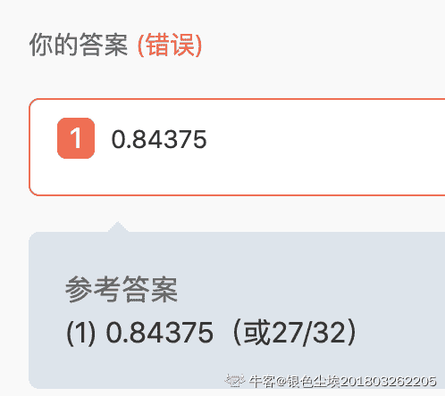

# 小红书 2020 校招数据分析笔试题

## 1

如果做一个活动，目标是 50w 流水，假设活动页面的用户付费转化率是 0.4%，假定单个用户可带来的平均收入是 20 元； 需要给页面带来 1W 流量（UV）才有可能达成目标？

你的答案 (错误)

1 参考答案 (1) 625

本题知识点

数据分析师 小红书 2020

讨论

[遥望星空~~脚踏实地](https://www.nowcoder.com/profile/789114749)

流量=总用户数=普通用户数+付费用户数用户付费转化率=付费用户数/总流量*100%由题可知，不妨设流量为 m 人，则有 0.4%m*20=500000 解得：m=625w

发表于 2020-09-03 19:19:03

* * *

[zhaotinglalala](https://www.nowcoder.com/profile/506335640)

销量=单价*UV*转化率

发表于 2020-06-03 14:02:31

* * *

[滑雪场的飞机](https://www.nowcoder.com/profile/446794351)

用户数=总收入/ARPU(单个用户可带来的平均收入)=50W/20=2.5W 流量=用户数/付费转化率=2.5w/0.4%=625w

发表于 2020-06-30 20:15:32

* * *

## 2

若单元格 B2=30，B3=40，B4=52，则函数 SUM（B2，B4）的值为 1

你的答案 (错误)

1 参考答案 (1) 82

本题知识点

数据分析师 小红书 2020

讨论

[牛客 534696897 号](https://www.nowcoder.com/profile/534696897)

sum(B2:B4)与 sum(B2,B4)的区别

发表于 2020-07-26 22:37:39

* * *

## 3

事务的执行结果必须使事务从一个状态转变到另一个一致性状态，是指事务的 1 性。

你的答案 (错误)

1 参考答案 (1) 一致

本题知识点

数据分析师 小红书 2020

讨论

[TITITian_](https://www.nowcoder.com/profile/587014453)

事务的四个特性

*   **原子性**：一个事务是一个不可分割的工作单位，事务中包括的诸操作要么都做，要么都不做。
*   **一致性**：事务必须是使数据库从一个一致性状态变到另一个一致性状态。一致性与原子性是密切相关的。
*   **隔离性**：一个事务的执行不能被其他事务干扰。即一个事务内部的操作及使用的数据对并发的其他事务是隔离的，并发执行的各个事务之间不能互相干扰。
*   **持久性**：持久性也称永久性，指一个事务一旦提交，它对数据库中数据的改变就应该是永久性的。接下来的其他操作或故障不应该对其有任何影响。

编辑于 2020-06-15 19:36:45

* * *

[银色尘埃 201803262205167](https://www.nowcoder.com/profile/1953648)

我写个"一致"你说我错？？ 题干中明明有”性“字吗。服了

发表于 2020-07-02 14:31:45

* * *

[yeshall](https://www.nowcoder.com/profile/593082445)

啊这

发表于 2020-08-10 20:04:02

* * *

## 4

若单元格 B2=30，B3=40，B4=52，则函数 SUM（B2:B4）的值为 1

你的答案 (错误)

1 参考答案 (1) 122

本题知识点

数据分析师 小红书 2020

讨论

[June499](https://www.nowcoder.com/profile/381614803)

sum(B2,B4)是指 B2 和 B4 相加，sum(B2:B4)是指从 B2 加到 B4，就包括其中的 B3

发表于 2020-10-31 19:17:47

* * *

[offer 你看看我吧](https://www.nowcoder.com/profile/324573768)

sum（B2:B4）和 sum（B2，B4）是有区别的呀

发表于 2020-08-15 07:46:08

* * *

## 5

假设一个元组在子查询 1 中出现 3 次，在子查询 2 中出现 2 次，则该元组在“子查询 1 union 子查询 2” 中出现几次 1

你的答案 (错误)

1 参考答案 (1) 1

本题知识点

数据分析师 小红书 2020

讨论

[为了肥牛冲冲冲](https://www.nowcoder.com/profile/68518359)

发表于 2020-06-29 22:40:32

* * *

[节奏大魔王](https://www.nowcoder.com/profile/357527082)

union 联合查询自动去重，若要显示所有结果使用 union all 语句

发表于 2020-06-04 14:15:26

* * *

## 6

小红书人脸识别系统识别当前进入小红书公司人员的身份，此系统一共识别三种不同的人员：员工，送餐员和陌生人。哪种学习方法适合此种应用需求 1。

你的答案 (错误)

1 参考答案 (1) 多分类

本题知识点

数据分析师 小红书 2020

讨论

[二十支箭](https://www.nowcoder.com/profile/769703833)

服了，我还以为要写具体的机器学习算法呢……

发表于 2020-08-18 23:34:48

* * *

[tainangao](https://www.nowcoder.com/profile/954604842)

神经网络 得罪了出题者了吗？

发表于 2020-10-16 09:17:39

* * *

[Jackey_Yu1996](https://www.nowcoder.com/profile/384038906)

填多分类问题为什么不对。。

发表于 2020-08-24 01:57:55

* * *

## 7

抽样估计的优良标准有三个：1 、2  、3 ；影响时间序列的因素有四个： 4 、 5 、6 、7    。

你的答案 (错误)

1234567 参考答案 (1) 无偏性
(2) 一致性
(3) 有效性
(4) 长期趋势
(5) 季节变动
(6) 循环波动
(7) 不规则波动

本题知识点

数据分析师 小红书 2020

讨论

[tainangao](https://www.nowcoder.com/profile/954604842)

牛客网好歹也是个技术类网站，就不能用技术解决一下技术问题？

发表于 2020-10-16 09:19:40

* * *

[银色尘埃 201803262205167](https://www.nowcoder.com/profile/1953648)

就这？？

发表于 2020-07-02 14:32:30

* * *

[对方正在输入中...201910161737103](https://www.nowcoder.com/profile/252626543)

看不懂，why?

发表于 2020-06-18 09:31:53

* * *

## 8

请给出三种常见的聚类算法:1 、2 、3 。

你的答案 (错误)

123 参考答案 (1) K-means 聚类、K-中心点聚类、CLARANS 算法,DIANA 算法、BIRCH 算法、Chameleon 算法
(2) EM 算法
(3) OPTICS 算法、DBSCAN 算法

本题知识点

数据分析师 小红书 2020

讨论

[June499](https://www.nowcoder.com/profile/381614803)

一个字母没有大写也会判定是错的，真的是醉了。

发表于 2020-10-31 19:33:52

* * *

[david185](https://www.nowcoder.com/profile/236949164)

人才！

发表于 2020-09-21 22:19:11

* * *

[银色尘埃 201803262205167](https://www.nowcoder.com/profile/1953648)

不敢问？？

发表于 2020-07-02 14:33:02

* * *

## 9

一家玩具厂生产一款毛绒玩具小熊，生产 9 只需要 90 元成本，产量增加到 11 只则需要 100 元，由此可知，生产该款玩具的边际成本为 1。

你的答案 (错误)

1 参考答案 (1) 5

本题知识点

数据分析师 小红书 2020

讨论

[牛客 716228073 号](https://www.nowcoder.com/profile/716228073)

边际成本= 总成本变化量（10）/总产量变化量（2） = 5

发表于 2020-06-29 09:20:50

* * *

[Jackey_Yu1996](https://www.nowcoder.com/profile/384038906)

写 5 元为什么不对。。

发表于 2020-08-24 01:59:42

* * *

[TITITian_](https://www.nowcoder.com/profile/587014453)

**边际成本**（Marginal cost），是指在任何产量水平上，增加一个单位产量所需要增加的工人工资、原材料和燃料等变动成本。例：生产某种产品 100 个单位时，总成本为 10000 元，单位产品成本为 100 元。若生产 101 个时，其总成本 10090 元。即：边际成本=（10090-10000）/（101-100）=90 元。

发表于 2020-06-15 19:59:12

* * *

## 10

X 服从区间（1,5）上的均匀分布，求对 X 进行 3 次独立观测中，至少有 2 次的观测值大于 2 的概率 1。

你的答案 (错误)

1 参考答案 (1) 0.84375（或 27/32）

本题知识点

数据分析师 小红书 2020

讨论

[shaohuaqingfu](https://www.nowcoder.com/profile/538644039)

均匀分布>2 的概率：3/4 至少两次：2 或 3 则：C²[3   * 3/4 * 3/4*1/4+C3[3  ]* 3/4 * 3/4*3/4=27/32]

发表于 2020-06-09 15:27:42

* * *

[银色尘埃 201803262205167](https://www.nowcoder.com/profile/1953648)

文字识别不出来就算了，数字都是别不了？？

发表于 2020-07-02 14:33:49

* * *

[Xxxmmmm](https://www.nowcoder.com/profile/397809357)

发表于 2021-03-25 18:38:47

* * *

## 11

Sql 函数： substring('109.120.59.63',5,3) =1。

你的答案 (错误)

1 参考答案 (1) 120

本题知识点

数据分析师 小红书 2020

讨论

[一只笑笑鸭](https://www.nowcoder.com/profile/848116130)

从第 5 个字符开始，截取 3 个字符

发表于 2020-06-10 15:44:30

* * *

[Ice_jing 上岸](https://www.nowcoder.com/profile/196964908)

'120'

发表于 2020-08-03 15:12:01

* * *

## 12

Sql 函数：regexp_replace('foobar', 'oo|ar', '') =1。

你的答案 (错误)

1 参考答案 (1) fb

本题知识点

数据分析师 小红书 2020

讨论

[yeshall](https://www.nowcoder.com/profile/593082445)

regexp-replace（srting，a，b），将 string 字符串中的 a 部分替换成 b

发表于 2020-08-11 23:49:38

* * *

[哒哒哒大头](https://www.nowcoder.com/profile/994908329)

我多此一举加了个''

发表于 2021-08-20 15:39:47

* * *

## 13

Sql 函数：round(8.4%4 , 2)=1。

你的答案 (错误)

1 参考答案 (1) 0.40

本题知识点

数据分析师 小红书 2020

讨论

[为了肥牛冲冲冲](https://www.nowcoder.com/profile/68518359)

知识点 1：%,整除取余，8.4 整除 4 后余 0.4。知识点 2：ROUND(X,D)： 返回参数 X 的四舍五入的有 D 位小数的一个数字。如果 D 为 0，结果将没有小数点或小数部分。

发表于 2020-06-29 18:27:44

* * *

[泡泡保温杯](https://www.nowcoder.com/profile/965564601)

想和大家讨论一下，这个应该取两位小数，答案应该是 0.40 才对呀？

发表于 2020-06-29 13:45:05

* * *

[12313242](https://www.nowcoder.com/profile/281228597)

答案错了

发表于 2020-09-24 11:48:40

* * *

## 14

如果做一个活动，目标是 50w 流水，假设活动页面的用户付费转化率是 0.4%，假定单个用户可带来的平均收入是 20 元； 需要给页面带来 1W 流量（UV）才有可能达成目标？

你的答案 (错误)

1 参考答案 (1) 625

本题知识点

数据分析师 小红书 2020

讨论

[史蒂芬不得分](https://www.nowcoder.com/profile/276024851)

UV = 流水 / 转化 rate / 单用户收入

发表于 2020-09-13 12:30:59

* * *