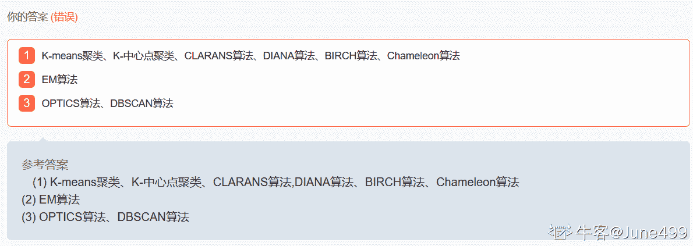
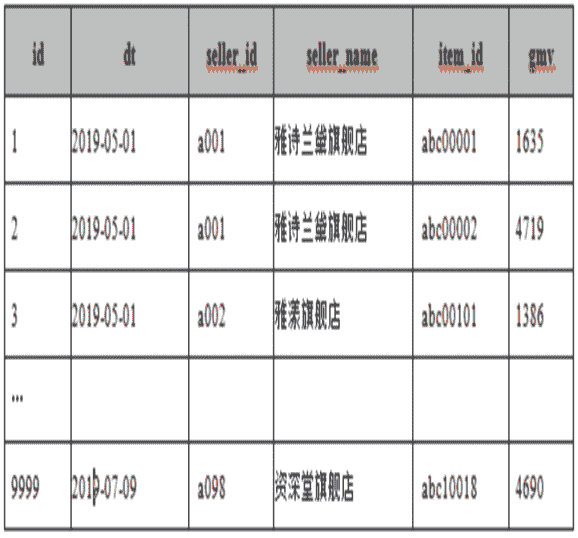
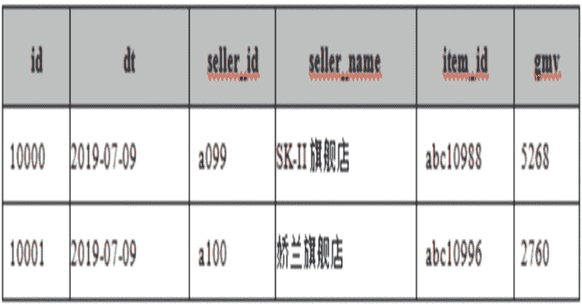

# 小红书 2020 校招数据分析笔试题卷一

## 1

对于任意事件 A、B，有如下（ ）成立

正确答案: A   你的答案: 空 (错误)

```cpp
P(AB)<=(P(A)+P(B))/2
```

```cpp
P(AB)<=P(A)P(B)
```

```cpp
P(AB)>=(P(A)+P(B))/2
```

```cpp
P(AB)>=P(A)P(B)
```

本题知识点

数据分析师 小红书 2020

讨论

[找 Eli 内推字节呀](https://www.nowcoder.com/profile/273227331)

P(AB)=P(A)*P(B|A)=P(B)*P(A|B)2P(AB)=P(A)*P(B|A)+P(B)*P(A|B)P(AB)=(P(A)*P(B|A)+P(B)*P(A|B))/2 由于：P(B|A)<=1,P(A|B)<=1 所以：P(A)*P(B|A)+P(B)*P(A|B)<=P(A)+P(B)因此：P(AB)<=(P(A)+P(B))/2 

发表于 2020-06-14 18:16:30

* * *

[有点饿](https://www.nowcoder.com/profile/660613520)

D 选项：

假设 A=B，0<P(A)<1；那么，P(AB)=P(A)=P(B)>P(A)P(B)

发表于 2022-01-13 14:21:58

* * *

## 2

在小红书用户今天是否打开 app 与前一日用户是否打开过 app 有关，今天使用过小红书 app，则明天会使用 app 的概率为 0.8；如果今天不使用，则明天使用的概率为 0.5。那么，如果周一用户使用过小红书 app，那么周三继续会使用 app 的概率为（）

正确答案: C   你的答案: 空 (错误)

```cpp
0.5
```

```cpp
0.64
```

```cpp
0.74
```

```cpp
0.82
```

本题知识点

数据分析师 小红书 2020

讨论

[Maple_2005](https://www.nowcoder.com/profile/203246634)

0.8*0.8+0.2*0.5=0.74

发表于 2020-06-13 17:19:55

* * *

## 3

失语症是指由于神经中枢病损导致抽象信号思维障碍，而丧失口语、文字的表达和领悟能力的临床症候群。根据上述定义，下列可能患失语症的是（）

正确答案: D   你的答案: 空 (错误)

```cpp
“狼孩”回归社会后无法与人进行言语交流
```

```cpp
幼时高烧听力受损致使发音有极大缺陷，影响交流
```

```cpp
因受刺激精神失常，造成言语理解和表达上的困难
```

```cpp
因车祸头部受创，虽能模仿他人言语但经常答非所问
```

本题知识点

数据分析师 小红书 2020

讨论

[新取个名字吧](https://www.nowcoder.com/profile/72230128)

此题易错选 C 项。“受刺激精神失常”是精神上的问题，而其神经中枢本身没有问题。

发表于 2020-07-28 13:59:35

* * *

[Risun](https://www.nowcoder.com/profile/927743843)

换言之，头部硬件出问题了。

发表于 2021-09-10 09:05:30

* * *

## 4

以下哪些数据可以评估用户黏性？（）

正确答案: C   你的答案: 空 (错误)

```cpp
核心行为频次
```

```cpp
当天活跃数据
```

```cpp
回访数据
```

```cpp
当天收入数据
```

本题知识点

数据分析师 小红书 2020

## 5

评估模型之后得出模型存在偏差，下列哪种方法可能解决这一问题？（）

正确答案: B   你的答案: 空 (错误)

```cpp
减少模型特征中的数量
```

```cpp
向模型中增加更多的特征
```

```cpp
增加更多的数据
```

```cpp
其他选项均正确
```

本题知识点

数据分析师 小红书 2020

讨论

[余笙笙](https://www.nowcoder.com/profile/798522245)

过拟合 高方差 低偏差 欠拟合 低方差 高偏差 ，高偏差意味模型不够复杂(欠拟合)，为了模型更加的强大，我们需要向特征空间中增加特征。增加样本能够降低方差

发表于 2020-06-18 15:33:00

* * *

[牛客 533965087 号](https://www.nowcoder.com/profile/533965087)

增加数据量不是可以同时减 bias 和 variance 吗？

发表于 2020-07-17 12:06:30

* * *

[CultyZoo](https://www.nowcoder.com/profile/797637396)

偏差又没说是过拟合还是欠拟合，题目不严谨

发表于 2021-10-06 17:02:03

* * *

## 6

已知电商平台各店铺每日销售额，使用 EXCEL 数据透视表查看今年各店铺每月销售额，在字段列表的操作为（）

正确答案: C   你的答案: 空 (错误)

```cpp
筛选器：年|列:月|行：日|值：销售额|值字段设置：计数
```

```cpp
筛选器：月|列:店铺|行：日|值：销售额|值字段设置：计数
```

```cpp
筛选器：年|列:月|行：店铺|值：销售额|值字段设置：求和
```

```cpp
筛选器：年|列:月|行：店铺|值：销售额|值字段设置：计数
```

本题知识点

数据分析师 小红书 2020

讨论

[淡影琉璃](https://www.nowcoder.com/profile/616331860)

已知的是每日的销售额，因此要求每月的就要求和。只有一个答案是求和

发表于 2020-08-04 19:50:49

* * *

## 7

请输入正确的 vlookup 公式查询当前用户 id 的性别（）

正确答案: B   你的答案: 空 (错误)

```cpp
a==VLOOKUP(用户 id,A2:C6,用户 id,1)
```

```cpp
a==VLOOKUP(用户 id,A2:C6,性别,1)
```

```cpp
a==VLOOKUP(性别,A2:C6,用户 id,1)
```

```cpp
a==VLOOKUP(性别,A2:C6,性别,1)
```

本题知识点

数据分析师 小红书 2020

讨论

[秃头的代码菜鸟](https://www.nowcoder.com/profile/969387274)

VLOOKUP(要查找的值，查找的区域，查找区域返回的列，查找模式)第 4 个参数，查找模式：0 表示精确匹配，1 表示模糊匹配

发表于 2020-09-22 10:55:51

* * *

[BrendaShi](https://www.nowcoder.com/profile/84621692)

a==(lookup_value, table_array, col_index_num, [range_lookup])

发表于 2020-09-11 16:00:39

* * *

## 8

SQL 语句中与 Having 子句同时使用的语句是（）

正确答案: A   你的答案: 空 (错误)

```cpp
group by
```

```cpp
left join
```

```cpp
order by
```

```cpp
limit
```

本题知识点

数据分析师 小红书 2020

讨论

[秃头的代码菜鸟](https://www.nowcoder.com/profile/969387274)

where 与 have 的区别：（常问）
where 子句的作用是在对查询结果进行分组前，将不符合 where 条件的行去掉，即**在分组之前过滤数据**，条件中不能包含聚组函数，使用 where 条件显示特定的行。having 子句的作用是筛选满足条件的组，即**在分组之后过滤数据**，条件中经常包含聚组函数，使用 having 条件显示特定的组，也可以使用多个分组标准进行分组。

发表于 2020-09-22 10:58:34

* * *

[骑猪撇标枪](https://www.nowcoder.com/profile/514526220)

having 的使用条件是分组后筛选，也就是先分组，再 having，即用在 group by 之后

发表于 2020-08-08 00:04:52

* * *

## 9

0 到 1000 当中有多少个数字带有 1 （）

正确答案: A   你的答案: 空 (错误)

```cpp
272
```

```cpp
273
```

```cpp
300
```

```cpp
301
```

本题知识点

数据分析师 小红书 2020

讨论

[鲁迅鲁小姐](https://www.nowcoder.com/profile/125651951)

不包含 1 的数字有 9 的 3 次方=729 个，所以包含 1 的数字有 1001-729=272 个。

编辑于 2020-06-17 22:39:28

* * *

[星星小王子](https://www.nowcoder.com/profile/546903214)

可以这样理解：1000-不含 1 的数首先个位数：不含 1 的数，即 2~9，8 个十位数：十位 2~9 即 8 个，个位 0~9 不含 1 即 9 个数 = 72 个百位数：百位 8 个，十位 9 个，个位 9 个=648 个 1000-728=272

发表于 2020-06-18 12:06:07

* * *

[牛客 883267277 号](https://www.nowcoder.com/profile/883267277)

穷举 20+99+19*8+1

发表于 2020-06-15 21:39:34

* * *

## 10

某运河中客船和货船的数量之比是 5:1，客船中途停修的概率为 0.05，货船为 0.02，今有一辆船中途停船修理，求该船是客船的概率（）

正确答案: D   你的答案: 空 (错误)

```cpp
20/27
```

```cpp
5/6
```

```cpp
5/7
```

```cpp
25/27
```

本题知识点

数据分析师 小红书 2020

讨论

[是要成为 datascientist 的人](https://www.nowcoder.com/profile/77963746)

考察条件概率、贝叶斯概率、全概率公式：设：事件 A = {船是客船} 事件 B = {船是货船}事件 C = {船中途停修}目前已知：P(A) = 5/6  P(B) = 1/6  P(C|A) = 0.05 = 1/20 P(C|B) = 0.02 = 1/50 现在要求的是：P(A|C) = ?由条件概率公式可知 P(A|C) = P(AC)/P(C)P(AC) = P(A) * P(C|A) = 5/6 * 1/20 P(C) = P(A)*P(C|A) + P(B)*P(C|B) = 5/6 * 1/20 + 1/6 * 1/50 所以 P(A|C) = ( 5/6 * 1/20 ) / (5/6 * 1/20 + 1/6 * 1/50) = 25/27

发表于 2020-06-13 08:29:16

* * *

[牛客 984348614 号](https://www.nowcoder.com/profile/984348614)

有 600 艘船，其中 500 客船，100 货船，客船坏了 25，货船坏了 2

发表于 2021-04-26 16:05:18

* * *

## 11

在 EXCEL 输入以零开头的文本型数字时需在输入的数据前面加（ ）

正确答案: B   你的答案: 空 (错误)

```cpp
“
```

```cpp
‘
```

```cpp
：
```

```cpp
不加
```

本题知识点

数据分析师 小红书 2020

## 12

 抽样调查遵循的原则是 ( )

正确答案: C   你的答案: 空 (错误)

```cpp
随意性原则
```

```cpp
可比性原则
```

```cpp
随机原则
```

```cpp
全面性原则
```

本题知识点

数据分析师 小红书 2020

## 13

 为描述身高与体重之间是否有某种关系，适合采用的图形是 （）

正确答案: B   你的答案: 空 (错误)

```cpp
直方图
```

```cpp
散点图
```

```cpp
条形图
```

```cpp
环形图
```

本题知识点

数据分析师 小红书 2020

讨论

[匪我](https://www.nowcoder.com/profile/755733111)

散点图可以用来刻画两个变量之间是否具有相关关系

发表于 2020-09-23 20:53:22

* * *

## 14

已知随机变量ξ服从二项分布，且 Eξ=2.4，Dξ=1.44，则参数 n,p 分别为（    ）

正确答案: B   你的答案: 空 (错误)

```cpp
6, 0.6
```

```cpp
6, 0.4
```

```cpp
9, 0.2
```

```cpp
24, 0.1
```

本题知识点

数据分析师 小红书 2020

讨论

[Maple_2005](https://www.nowcoder.com/profile/203246634)

Eξ=np=2.4，Dξ=np(1-p)=1.44，

发表于 2020-06-15 11:53:00

* * *

## 15

如果小明喜欢表演，则他报考戏剧学院，如果他不喜欢表演，则他可以成为戏剧理论家。如果他不报考戏剧学院，则不能成为戏剧理论家。由此可推出小明将：（）

正确答案: D   你的答案: 空 (错误)

```cpp
不喜欢表演。
```

```cpp
成为戏剧理论家。
```

```cpp
不报考戏剧学院。
```

```cpp
报考戏剧学院。
```

本题知识点

数据分析师 小红书 2020

讨论

[这里有一个按钮](https://www.nowcoder.com/profile/279912165)

喜欢表演->报考戏剧学院
不喜欢表演->成为理论家
不报考戏剧学院->不能成为理论家 ==> 成为理论家->报考戏剧学院
 ==> 不喜欢表演->成为理论家->报考戏剧学院
所以喜欢不喜欢都会报考戏剧学院

发表于 2020-08-12 19:50:56

* * *

[蒸鱼不是鱼](https://www.nowcoder.com/profile/527831870)

第三句逆否可知成为戏剧专家则必需报考学院，第二句可以就代表有机会做戏剧专家，既然有机会了那一定报考了，否则是一点机会都没有

发表于 2020-06-26 20:38:38

* * *

## 16

四位老师在高考前对某毕业班学生的前景进行预测,他们特别关注班里的两个尖子生。
张老师说:“如果小明能考上北大,那么小强也能考上北大。”
李老师说:“依我看这个班没有人能考上北大。”
王老师说:“不管小强能否考上北大,但小明考不上北大。”
赵老师说:“我看小强考不上北大,但小明能考上北大。”
高考结果证明,四位老师中只有一人的推测成立。
如果上述断定是真的,则以下哪项也一定是真的？（）

正确答案: D   你的答案: 空 (错误)

```cpp
李老师的推测成立。
```

```cpp
王老师的推测成立。
```

```cpp
如果小强考不上北大,则张老师的推测成立。
```

```cpp
如果小强考上了北大,则张老师的推测成立。
```

本题知识点

数据分析师 小红书 2020

讨论

[JJJJJJJJJJ 小 Y](https://www.nowcoder.com/profile/184835331)

张老师：小明 =>小强，即-小强=>-小明赵老师：-小强且小明张老师和赵老师的推测矛盾，必有一真，故李老师王老师的推测都为假王老师：-小明 假，即小明考上了所以，如果小强也考上了，则说明张老师推测成立

发表于 2020-08-20 15:23:04

* * *

[shineinlove](https://www.nowcoder.com/profile/472300907)

李老师和王老师可能同时对，小明考不上，存在没一个人考得上的可能性，没一个考得上，小明肯定考不上也是正确的，而只有一个人是正确的，所以李老师和王老师都是错的。剩下 C、D 选项，张老师推论成立，小强考不上证明不了张老师的推论，只有小强考上了才能证明张老师的推论。

发表于 2020-09-30 20:03:56

* * *

## 17

以下说法正确的是（）

正确答案: A B C   你的答案: 空 (错误)

```cpp
假设检验基本思想的依据是小概率事件原理
```

```cpp
若 X 服从参数为λ的泊松分布，则 EX=DX
```

```cpp
样本方差 = 是母体方差 DX 的无偏估计
```

```cpp
一组数据,均值>中位数>众数,则这组数据钟型
```

本题知识点

数据分析师 小红书 2020

讨论

[内卷制造机](https://www.nowcoder.com/profile/438641594)

钟形曲线是正态分布曲线

发表于 2020-07-05 11:30:16

* * *

[254834](https://www.nowcoder.com/profile/8044149)

无偏估计是没有 bias，不是说样本方差就等于母体反差了

发表于 2021-08-20 18:09:35

* * *

[工作顺利 jl](https://www.nowcoder.com/profile/896221227)

假设检验中所谓“小概率事件”，并非逻辑中的绝对矛盾，而是基于人们在实践中广泛采用的原则，即小概率事件在一次试验中是几乎不发生的，但概率小到什么程度才能算作“小概率事件”，显然，“小概率事件”的概率越小，否定原假设 H0 就越有说服力，常记这个概率值为α(0<α<1)，称为检验的显著性水平。对于不同的问题，检验的显著性水平α不一定相同，一般认为，事件发生的概率小于 0.1、0.05 或 0.01 等，即“小概率事件

发表于 2020-09-21 10:39:06

* * *

## 18

常用的最优模型选择方法是哪些？（）

正确答案: A B C   你的答案: 空 (错误)

```cpp
增加正则化项
```

```cpp
交叉验证
```

```cpp
增加罚项
```

```cpp
增加更多特征
```

本题知识点

数据分析师 小红书 2020

讨论

[牛客 121131197 号](https://www.nowcoder.com/profile/121131197)

模型选择就是选择在未知数据集上预测性能较好的模型，两种常用的模型选择方法：正则化与交叉验证。正则化是结构风险最小化策略的实现，实在经验风险上加一个正则化项或罚项。正则化项一般是模型复杂度的单调递增函数，模型复杂度越大，正则化值就越大。Source：[`zhuanlan.zhihu.com/p/41344759`](https://zhuanlan.zhihu.com/p/41344759)

发表于 2020-12-27 05:50:35

* * *

## 19

事件 A 和事件 B 相互独立，发生 A 的概率是 0.1，发生 B 的概率是 0.2，那么下列哪些选项是正确的（）

正确答案: B C   你的答案: 空 (错误)

```cpp
发生 A 或发生 B 的概率是 0.3
```

```cpp
发生 A 且发生 B 的概率是 0.02
```

```cpp
A 和 B 都不发生的概率是 0.72
```

```cpp
发生 A 但不发生 B 的概率是 0.1
```

本题知识点

数据分析师 小红书 2020

讨论

[哒哒哒哒哒哒哒哒哒哒](https://www.nowcoder.com/profile/570533800)

选项 A 应该是错误的吧？发生 A 或发生 B 的概率应该为 
才对。
因为事件和事件相互独立，所以（选项 B 正确）。

发表于 2020-06-02 10:50:56

* * *

[BBLL 的 B](https://www.nowcoder.com/profile/524193106)

或概率（不包含且） ： A 不发生的概率  1- P（A） = 0.9 B 不发生的概率  1- P（B） = 0.8P（AB 不发生） = 0.8*0.9 = 0.72 （C 对）A 且 B 都发生 = 0.1*0.2 = 0.02 （B 对）发生 A 或 B 的概率=1 -P（AB 不发生）-P（A 且 B 都发生 ）=0.26（A 错）发生 A 且不发生 B 的概率=0.1 *（1-0.2） =0.08 （D 错）

发表于 2021-04-01 19:19:25

* * *

## 20

在一个正态分布中，95%的 z 的取值都在-1.96 和 1.96 之间，下列哪些选项是正确的（）

正确答案: A C   你的答案: 空 (错误)

```cpp
值在-1.96 之下或在 1.96 之上的百分比是 5%
```

```cpp
值仅小于-1.96 的百分比是 5%
```

```cpp
值仅大于 1.96 的百分比是 2.5%
```

```cpp
值在 1.96 和 0 之间的百分比是 95%
```

本题知识点

数据分析师 小红书 2020

讨论

[挚白](https://www.nowcoder.com/profile/690510950)

选项 A 错了吧，"或"应该改成"和"才是对的

发表于 2020-11-05 10:34:51

* * *

## 21

下列选项中，反映数据离散程度的是（）

正确答案: A B E   你的答案: 空 (错误)

```cpp
方差
```

```cpp
标准差
```

```cpp
众数
```

```cpp
中位数
```

```cpp
极差
```

本题知识点

数据分析师 小红书 2020

讨论

[牛客 699402776 号](https://www.nowcoder.com/profile/699402776)

众数和中位数描述的是数据的集中趋势

发表于 2020-08-27 16:45:14

* * *

## 22

关于正态分布,下列说法正确的是（）

正确答案: A B D   你的答案: 空 (错误)

```cpp
正态分布具有集中性和对称性
```

```cpp
正态分布的均值和方差能够决定正态分布的位置和形态
```

```cpp
正态分布的偏度为 0，峰度为 1
```

```cpp
标准正态分布的均值为 0，方差为 1
```

本题知识点

数据分析师 小红书 2020

讨论

[zxcv0112358](https://www.nowcoder.com/profile/473856205)

 *   ```cpp
    正态分布的偏度为 0，峰度为 3
    ``` 

发表于 2021-03-29 10:15:38

* * *

[牛客 682451688 号](https://www.nowcoder.com/profile/682451688)

那这题 正态分布的峰都是多少

发表于 2021-03-28 23:57:39

* * *

## 23

若单元格 B2=30，B3=40，B4=52，则函数 SUM（B2，B4）的值为 1

你的答案 (错误)

1 参考答案 (1) 82

本题知识点

数据分析师 小红书 2020

讨论

[zxcv0112358](https://www.nowcoder.com/profile/473856205)

SUM（B2，B4）   的值为 82SUM（B2:B4） 的值为 122

发表于 2020-06-12 21:01:19

* * *

[牛客 879563449 号](https://www.nowcoder.com/profile/879563449)

sum(a, b) 指的是 a+bsum(a:b) 才是 a-b 的所有值之和

发表于 2021-03-31 01:04:02

* * *

[牛客 682451688 号](https://www.nowcoder.com/profile/682451688)

考，大意了

发表于 2021-03-28 23:58:14

* * *

## 24

假设一个元组在子查询 1 中出现 3 次，在子查询 2 中出现 2 次，则该元组在“子查询 1 union all 子查询 2” 中出现几次 1

你的答案 (错误)

1 参考答案 (1) 5

本题知识点

数据分析师 小红书 2020

讨论

[这里有一个按钮](https://www.nowcoder.com/profile/279912165)

假设一个元组在子查询 1 中出现 m 次，在子查询 2 中出现 n 次，该元组在“子查询 1 Union ALL 子查询 2”中出现 m + n 次。
Union：对两个结果集进行并集操作，不包括重复行，同时进行默认规则的排序； Union All：对两个结果集进行并集操作，包括重复行，不进行排序；

发表于 2020-08-12 20:04:00

* * *

[牛客 848542795 号](https://www.nowcoder.com/profile/848542795)

union 1 次，union all 5 次

发表于 2020-07-21 12:16:06

* * *

## 25

小红书人脸识别系统识别当前进入小红书公司人员的身份，此系统一共识别三种不同的人员：员工，送餐员和陌生人。哪种学习方法适合此种应用需求 1

你的答案 (错误)

1 参考答案 (1) 多分类

本题知识点

数据分析师 小红书 2020

讨论

[西瓜撞地球~](https://www.nowcoder.com/profile/144545784)

填分类居然是错的

发表于 2020-07-19 16:36:28

* * *

[June499](https://www.nowcoder.com/profile/381614803)


编辑于 2020-10-31 20:54:20

* * *

## 26

抽样估计的优良标准有三个：   1   、2   、3    ；影响时间序列的因素有四个：4  、5  、6 、7   。

你的答案 (错误)

1234567 参考答案 (1) 无偏性
(2) 一致性
(3) 有效性
(4) 长期趋势
(5) 季节变动
(6) 循环波动
(7) 不规则波动

本题知识点

数据分析师 小红书 2020

讨论

[runpingl](https://www.nowcoder.com/profile/679120204)

抽样估计的优良标准应满足以下三个方面的条件:

1.  无偏性。即要求所有可能样本指标的平均数（样本指标的数学期望）与被估计的总体参数之间没有偏差。虽然每一次的样本指标值和总体指标值之间都可能有误差，但在多次反复的估计中，所有抽样指标值的平均数应该等于所估计的总体指标值本身，即用样本指标去估计总体参数，平均说来是没有偏误的。

2.  一致性。用统计量估计总体参数要求当样本的单位数充分大时，抽样指标也充分地靠近总体指标。就是说，随着样本单位数 n 的无限增加，统计量和未知的总体参数之差的绝对值小于任意小的数，它的概率也趋近于 1，即实际上是几乎肯定的。

3.  有效性。以统计量估计总体参数时，优良估计量的方差应该比其他估计量的方差小。例如用样本平均数或总体某一变量值来估计总体平均数，虽然两者都是无偏的，而且在每一次估计中，两种估计量和总体平均数都可能有离差，但样本平均数更靠近于总体平均数的周围，平均说来其离差比较小。所以对比说来，抽样平均数是更为有效的估计量。

主要的时间序列因素有以下四种：    （1）长期趋势（Seuclar trend）。它是事物在长时期内增减的变动趋势。    （2）季节变动（Seasonal vari-tion）。是在每期内重复出现的周期性变动。一般季节变动周期为 12 个月。通常农产品的季节变动大于工业产品，销费品大于生产资料，非耐用品大于耐用品。    （3）循环变动（Cyelical variction）。它是以期数为周期而重复出现的周期性变动。由于这种周期性变动的周期长短不规律，预测方法也无规律可循。一般在短期预测中把循环变动因素当作长期趋势的一部分，不单独分析。    （4）不规则变动（Irreglar variation）。指由各种复杂因素引起的，在时间序列曲线上形成很多微小波动性变动。这种变动也无规律可循，难以预测分析，在时间序列中，通常是采用移动平均法或指数平滑法，以消除被动的干扰。

发表于 2021-08-29 17:16:09

* * *

## 27

请给出三种常见的聚类算法:1 、2、3  。

你的答案 (错误)

123 参考答案 (1) K-means 聚类、K-中心点聚类、CLARANS 算法,DIANA 算法、BIRCH 算法、Chameleon 算法
(2) EM 算法
(3) OPTICS 算法、DBSCAN 算法

本题知识点

数据分析师 小红书 2020

讨论

[蒸饺](https://www.nowcoder.com/profile/652165453)

推荐知乎一篇文章，深入浅出聚类算法：[`zhuanlan.zhihu.com/p/43651469`](https://zhuanlan.zhihu.com/p/43651469)

发表于 2020-10-17 10:15:31

* * *

[June499](https://www.nowcoder.com/profile/381614803)

我是重新做了一遍。牛客应该优化一下检查系统了。


编辑于 2020-11-02 17:11:00

* * *

## 28

Sql 函数： substring('109.120.59.63',5,3) = 1。

你的答案 (错误)

1 参考答案 (1) 120

本题知识点

数据分析师 小红书 2020

讨论

[你说是的](https://www.nowcoder.com/profile/1067434)

0.substring(arg1, arg2, arg3)， arg1：待处理字符串；arg2：截取开始下标（本题为 1）；arg3：截取字符串长度（从 1 开始到 2 再到 0，共三个字符），所以为 109.【120】.59.63，【】中是被截取的内容。1.与 Java 等语言中的 substring 函数以 0 为索引开头不同，sql 中以 1 为索引开头。

发表于 2020-08-31 19:55:45

* * *

[妙不可言找工作](https://www.nowcoder.com/profile/772137720)

. 为字符串类型，占两个字节

发表于 2020-06-09 12:54:46

* * *

## 29

某电商有 100 家店铺，每家店铺每天销售商品和销售额 gmv 的数据存放在 purchase 表中，现需统计 5 月和 6 月，总 gmv 中，两个月分别的贡献前 50% gmv 的店铺名，请使用一句 SQL1
有店铺销量表 purchase：  输出结果如下表：

你的答案 (错误)

1 参考答案 (1) select concat('2019M',month), seller_name from  (select month(dt) as month, seller_name, sum(gmv) as totalgmv from purchase where month(dt) in ('5' ,'6')  group by month(dt),seller_name) a join (select month, seller_name, percentile(totalgmv, 0.5) as mid From (select month(dt) as month, seller_name, sum(gmv) as totalgmv from purchase where month(dt) in ('5' ,'6')  group by month(dt),seller_name) c Group by month, seller_name) b On a.month = b.month and a.seller_name = b.seller_name where totalgmv > mid

本题知识点

数据分析师 小红书 2020

讨论

[董慧芳](https://www.nowcoder.com/profile/834446827)

1、先求出 5,6 月每家店铺总的 gmv -->totalgmv 同时按照月份和店铺进行分组：group by month(dt) seller_name 使用 where 进行筛选: where month in ('5','6')作为临时表 c

```cpp
select month(dt) as month, seller_name, sum(gmv) as totalgmv 
from purchase 
where month(dt) in ('5' ,'6')  
group by month(dt),seller_name
```

2.从临时表 c 中筛选贡献前 50%的店铺，此时还是要注意加上筛选条件即按照月份和店铺进行分组：group by month(dt) seller_name 这些符合条件的数据作为临时表 b

```cpp
select month, seller_name, percentile(totalgmv, 0.5)as mid
from c group by month(dt) seller_name
```

3.再求出 5,6 月每家店铺总的 gmv 与符合条件的临时表 b 内联，*表示要求查询的内容

```cpp
select * select month(dt) as month, seller_name, sum(gmv) as totalgmv 
from purchase 
where month(dt) in ('5' ,'6')  
group by month(dt),seller_name) a join  b  a.month = b.month and a.seller_name = b.seller_name 
where totalgmv > mid
```

总觉得输出不用 concat 呢，就是直接 dt 不就行，最后呈现的结果也不是 2019-09 呀?

发表于 2020-09-02 15:38:41

* * *

[牛客 592090629 号](https://www.nowcoder.com/profile/592090629)

select convert(varchar(7),dt,120),seller_name--查询字段
from 
(select month(dt)as month ,seller_name,sum(gmv) as totalgmv from purchase where month(dt) in('5','6') group by month(dt),seller_name) a --建立表 a 筛选每个店铺 5、6 月份的销售总额
join--做表链接加入中位数的条件列
(select month, seller_name, percentile(totalgmv, 0.5) as mid 
from (select month(dt) as month ,seller_name,sum(gmv) as totalgmv from purchase where month(dt) in('5','6')group by month(dt),seller_name) c --建立表 c 提高查询效率,计算 5、6 月的销售总额的中位数
group by month,seller_name) b--链接 a、b 表
on a.month=b.month and a.seller_name = b.seller_name --链接条件
where totalgmv > mid--过滤条件贡献率大于 50%

发表于 2021-02-22 14:26:37

* * *

## 30

如果做一个活动，目标是 50w 流水，假设活动页面的用户付费转化率是 0.4%，假定单个用户可带来的平均收入是 20 元； 需要给页面带来 1W 流量（UV）才有可能达成目标？

你的答案 (错误)

1 参考答案 (1) 625

本题知识点

数据分析师 小红书 2020

讨论

[我不是跳跳虎](https://www.nowcoder.com/profile/668490602)

0.4%*uv*20/10000 >=50

发表于 2022-01-17 18:56:40

* * *

[有点饿](https://www.nowcoder.com/profile/660613520)

已知页面转化率为 0.4%，那么就代表每 100 个人会转化 0.4 个用户，又因为每个用户的平均收入为 20 元，所以每一百个用户会带来 0.4*20=8 元的利润。题目要求 50w 的流水，因此需要 UV 为 50w/8*100=625w

发表于 2022-01-13 17:15:16

* * *

[无敌大花彪](https://www.nowcoder.com/profile/519851144)

20*0.4% *UV = 50w

发表于 2020-06-25 15:18:13

* * *