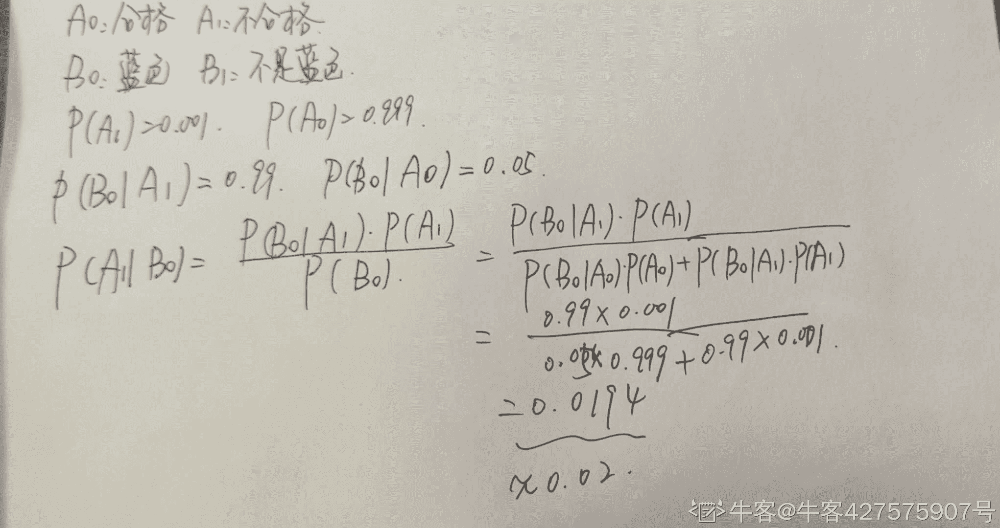
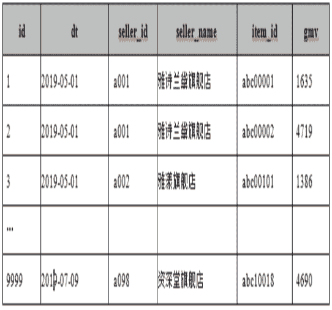
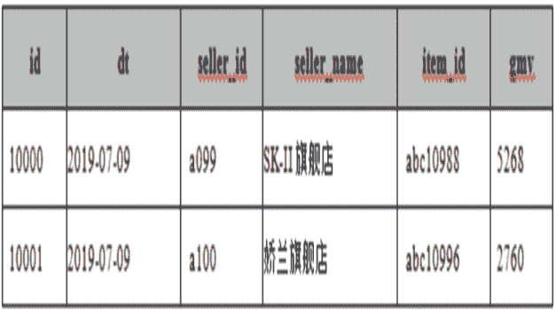

# 小红书 2020 校招数据分析笔试题卷二

## 1

设 A B C 为三件事件，且 A B 相互独立，则以下结论中不正确的是（）

正确答案: D   你的答案: 空 (错误)

```cpp
若 P(C)=1，则(AC)与(BC)也独立
```

```cpp
若 P(C)=1，则(A∩C）与 B 也独立
```

```cpp
若 P(C)=0，则(A∩C）与 B 也独立
```

```cpp
若 C 属于 B，则 A 与 C 也独立
```

本题知识点

数据分析师 小红书 2020

讨论

[小镇划水家](https://www.nowcoder.com/profile/167182159)

绞尽脑汁想了一个解释：主要是这个属于怎么理解，是只要符合 B 是不是都叫属于 B 呢？假设今天下雨是 A，明天下雨是 B，那么 C={今天和明天都下雨}这个事件是属于“明天下雨”的吧，然而 C 和 A 显然不独立。

发表于 2020-09-12 07:58:17

* * *

[找 Eli 内推字节呀](https://www.nowcoder.com/profile/273227331)

A、B 相互独立
则，P(AB)/P(A)＝P(B)

C∈B 时
P(AC)/P(A)＝P(C)
不一定成立

发表于 2020-06-13 21:16:24

* * *

[牛客 661236677 号](https://www.nowcoder.com/profile/661236677)

C 属于 B，是元素与集合的关系 ；C 包含于 B，是集合 C 中的所有元素都在集合 B 中，是集合与集合的关系

发表于 2021-04-22 15:20:22

* * *

## 2

假设出现在小红书首页的笔记，三十次曝光至少会被点开一次的概率是 0.95，请问，十次曝光被点开的概率是多少（）

正确答案: A   你的答案: 空 (错误)

```cpp
0.63
```

```cpp
0.5
```

```cpp
0.32
```

```cpp
0.85
```

本题知识点

数据分析师 小红书 2020

讨论

[季夏十一](https://www.nowcoder.com/profile/756293425)

这里的 30 次曝光相当于做了 30 次独立实验，记用户点开的一次为事件 A。三十次曝光至少被点开一次的概率为 0.95，考虑对立面，三十次曝光一次也没有点开的概率为 0.05，由于是相互独立的，即(1-A)³⁰=0.05。同理，考虑十次曝光没有点开的概率则是（1-A）¹⁰最后用 1-（1-A）¹⁰即可（还要用计算器😅）

发表于 2020-08-12 11:35:00

* * *

[早起的虫儿 e](https://www.nowcoder.com/profile/894801862)

“30 次曝光至少点击一次的概率为 0.95”30 次曝光，每次曝光是否点击都是独立事件，故做了 30 次独立事件。则 30 次曝光都没有点击的概率是 0.05 设每次点击的概率为 a,则有（1-a)³⁰=0.05  问：10 次曝光至少点击 1 次的概率是多少？即求{1-（1-a)¹⁰}(1-a)¹⁰ ={(1-a)³⁰}^(1/3)=0.5^(1/3)    计算可知 0.4³=0.064>0.5   0.3³ = 0.027<0.5 故  0.3<(1-a)¹⁰ <0.4,  0.6< 1-(1-a)¹⁰  <0.7  选 A

发表于 2022-03-02 14:30:17

* * *

## 3

劳动法律关系变更：指劳动者同用人单位依据劳动法律规范，变更其原来确定的权利义务内容。劳动法律关系变更一般是因发生变更工作地方、工种和工作职务的劳动法律事实而引起的。根据以上定义，下面哪种行为属于劳动法律关系变更（  ）

正确答案: A   你的答案: 空 (错误)

```cpp
东方公司会计王明因有挪用公款行为，经公司总经理办公会议讨论决定，将王明调到仓储部门做保管员
```

```cpp
朝阳物业公司物业保管员陈进因盗窃公司电脑一台而被开除
```

```cpp
大学应届毕业生，经过层层面试和笔试，终被用人单位录用
```

```cpp
商场营业员小李与商场签订的五年合同到期
```

本题知识点

数据分析师 小红书 2020

## 4

只访问了入口页面（例如首页）就离开的访问量与所产生总访问量的百分比是（）

正确答案: B   你的答案: 空 (错误)

```cpp
访问率
```

```cpp
跳出率
```

```cpp
转化率
```

```cpp
流失率
```

本题知识点

数据分析师 小红书 2020

讨论

[工作顺利 jl](https://www.nowcoder.com/profile/896221227)

跳出率是指在只访问了入口页面（例如网站首页）就离开的访问量与所产生总访问量的百分比。跳出率计算公式：跳出率=访问一个页面后离开网站的次数/总访问次数；访问率（reach）是有多少不同的人参观访问一个网站查看广告以及这些人们成为一个广告瞄准的对象的百分比。 转化率=（产生购买行为的客户人数 / 所有到达店铺的访客人数）× 100%。流失率=流失人数/总人数 

发表于 2020-09-15 18:24:54

* * *

## 5

AARRR 模型不包含以下哪个环节？（）

正确答案: B   你的答案: 空 (错误)

```cpp
Acquisition
```

```cpp
Requirement
```

```cpp
Retention
```

```cpp
Revenue
```

本题知识点

数据分析师 小红书 2020

讨论

[工作顺利 jl](https://www.nowcoder.com/profile/896221227)

Acquisition 获取用户 Activation 提高活跃度 Retention 提高留存率 Revenue 获取收入 Refer     自传播

发表于 2020-09-15 18:26:53

* * *

## 6

下列属于无监督学习的是（）

正确答案: A   你的答案: 空 (错误)

```cpp
K-means
```

```cpp
SVM
```

```cpp
最大熵模型
```

```cpp
CRF
```

本题知识点

数据分析师 小红书 2020

## 7

用算法拦截可疑笔记，描述拦截的笔记中有多少是真的可疑笔记是（）

正确答案: D   你的答案: 空 (错误)

```cpp
AUC
```

```cpp
ROC
```

```cpp
Recall
```

```cpp
Precision
```

本题知识点

数据分析师 小红书 2020

讨论

[芋头稀饭](https://www.nowcoder.com/profile/967133833)

Precision：抓的人里面有几个是真的坏人 Recall：坏人里面有几人被抓

发表于 2020-08-13 09:18:25

* * *

[暮雨潇潇 _1 号](https://www.nowcoder.com/profile/197197062)

Precision：查准率
Recall：查全率

发表于 2020-09-02 09:08:45

* * *

[早起的虫儿 e](https://www.nowcoder.com/profile/894801862)

ROC:所有样本在不同阈值下在 FPR-TPR 图中所形成的曲线 AUC:ROC 曲线合 x 坐标轴所围成的面积，（0，1），越接近 0 模型的预测效果越好 Recall：召回率 Recall = FP/(FP+TN)Precision：精确率,在所有预测预测为正例中属于真的正例的概率。Precision = TP/(TP+FP)

发表于 2022-03-02 15:22:03

* * *

## 8

请输入正确的 vlookup 公式查询当前用户 id 的性别（）

正确答案: B   你的答案: 空 (错误)

```cpp
a==VLOOKUP(用户 id,A2:C6,用户 id,1)
```

```cpp
a==VLOOKUP(用户 id,A2:C6,性别,1)
```

```cpp
a==VLOOKUP(性别,A2:C6,用户 id,1)
```

```cpp
a==VLOOKUP(性别,A2:C6,性别,1)
```

本题知识点

数据分析师 小红书 2020

讨论

[牛牛鱼](https://www.nowcoder.com/profile/238776009)

**VLOOKUP(lookup_value, table_array, col_index_num, [range_lookup])。**

**书生**表述就是**VLOOKUP(查找值，查找范围，查找列数，精确匹配或者近似匹配）****[`jingyan.baidu.com/article/73c3ce28db4da4e50243d95c.html`](https://jingyan.baidu.com/article/73c3ce28db4da4e50243d95c.html)** 

发表于 2021-03-29 19:27:12

* * *

## 9

请写出 sql 计算每年不同用户发布的笔记数量（）

正确答案: A   你的答案: 空 (错误)

```cpp
select year,userid,sum(num) as num from  temp2 group by 1,2
```

```cpp
select year,userid,count(num) as num from  temp2 group by 1,2
```

```cpp
select year,userid,count(num) as num from  temp2
```

```cpp
select userid,count(num) as num from  temp2 group by 1
```

本题知识点

数据分析师 小红书 2020

讨论

[武浩](https://www.nowcoder.com/profile/70622993)

sum 的对象是样本值，count 的对象是样本本身

发表于 2020-08-14 11:44:18

* * *

## 10

 EXCEL 中，“abc1134”位于 G3 单元格，如何取出它的前 3 位 （ ）

正确答案: B   你的答案: 空 (错误)

```cpp
Left(G3,1,3)
```

```cpp
Left(G3,3)
```

```cpp
Right(G3,1,3)
```

```cpp
Right（G3,3）
```

本题知识点

数据分析师 小红书 2020

讨论

[牛牛鱼](https://www.nowcoder.com/profile/238776009)

left 函数的语法格式:    =left(text,num_chars) text 代表用来截取的单元格内容。num_chars 代表从左开始截取的字符数。[`jingyan.baidu.com/article/a65957f48dabb324e67f9bda.html`](https://jingyan.baidu.com/article/a65957f48dabb324e67f9bda.html)

发表于 2021-03-29 19:28:49

* * *

[牛客 290679890 号](https://www.nowcoder.com/profile/290679890)

答案为 B 

发表于 2020-07-21 14:45:04

* * *

## 11

 某学校男生升学率下降了，女生升学率也下降了，那么总体升学率  （）

正确答案: D   你的答案: 空 (错误)

```cpp
增加
```

```cpp
下降
```

```cpp
不变
```

```cpp
不确定
```

本题知识点

数据分析师 小红书 2020

讨论

[灰原雾](https://www.nowcoder.com/profile/389827333)

这是比例陷阱，说一个极端例子：去年男生录取 1/2，女生 9/20，总录取率是 10/22，也就是 1000/2200。今年男生录取 999/2000，女生录取 1/3，都下降了，但是总录取率是 1000/2003。简单地说，两个比例是不能直接相加的，因为分母不同，影响率也不同。

发表于 2020-08-20 17:12:09

* * *

[r 的绝对值](https://www.nowcoder.com/profile/790247280)

辛普森悖论

发表于 2020-08-01 11:00:57

* * *

[2htttttttttt](https://www.nowcoder.com/profile/704487070)

我认为题目有歧义，如果是答案 B，那应该表达的是升学人数下降，而非升学率，升学率是一个百分数，分母在你确定了百分比的时候已经确定，题目想出的意思和表达出来的意思不同，应作修改。

发表于 2021-08-30 15:35:02

* * *

## 12

一个部门 1/2 为数据开发，2/5 为软件开发，1/4 两者都是，那么两者都不是的比例？（）

正确答案: B   你的答案: 空 (错误)

```cpp
0.23
```

```cpp
0.35
```

```cpp
0.4
```

```cpp
0.32
```

本题知识点

数据分析师 小红书 2020

讨论

[暮雨潇潇 _1 号](https://www.nowcoder.com/profile/197197062)

[1-P(A)][1-P(B)]=1-P(A)-P(B)+P(A)P(B)

发表于 2020-09-02 09:12:02

* * *

[Maple_2005](https://www.nowcoder.com/profile/203246634)

1-（1/2+2/5-1/4）=0.35

发表于 2020-06-03 00:47:04

* * *

## 13

在仓库中对某种商品进行合格性检验，已知这种商品的不合格率为 0.001，即 1000 件商品中会有一件次品。现有现有一种快速检验商品方法，它的准确率是 0.99，即在商品确实是次品的情况下，它有 99%的可能抽检显示蓝色。它的误报率是 5%，即在商品不是次品情况下，它有 5%的可能抽检显示蓝色。现有有一件商品检验结果为蓝色，请问这件商品是次品的可能性有多大？（）

正确答案: B   你的答案: 空 (错误)

```cpp
0.01
```

```cpp
0.02
```

```cpp
0.03
```

```cpp
0.04
```

本题知识点

数据分析师 小红书 2020

讨论

[sky 游荡](https://www.nowcoder.com/profile/543255165)


发表于 2020-06-23 22:30:27

* * *

[牛客 427575907 号](https://www.nowcoder.com/profile/427575907)



发表于 2020-09-18 11:53:09

* * *

[牛客 522821795 号](https://www.nowcoder.com/profile/522821795)

采用贝叶斯公式求解

发表于 2020-08-28 20:54:14

* * *

## 14

抽取 30 个电话咨询的用户，计算出他们的电话咨询时间的方差。要用样本方差推断总体方差，假定前提是所有用户的电话咨询时间应服从(   )

正确答案: D   你的答案: 空 (错误)

```cpp
F 分布
```

```cpp
T 分布
```

```cpp
卡方分布
```

```cpp
正态分布
```

本题知识点

数据分析师 小红书 2020

## 15

只要前提正确且逻辑推理结构有效，则结论必然正确。根据以上判断，以下哪几种情况是可能出现的?（）
 I．结论正确且前提正确，但逻辑结构是无效的。
Ⅱ．逻辑推理结构有效且结论正确，但前提是错误的。
Ⅲ．前提错误且逻辑结构无效，但结论正确。
Ⅳ．前提错误且逻辑结构无效，结论也是错误的。

正确答案: A   你的答案: 空 (错误)

```cpp
Ⅰ、Ⅱ、Ⅲ和Ⅳ
```

```cpp
仅Ⅰ和Ⅳ
```

```cpp
仅Ⅰ、Ⅱ和Ⅳ
```

```cpp
仅Ⅰ、Ⅲ和Ⅳ
```

本题知识点

数据分析师 小红书 2020

讨论

[Maple_2005](https://www.nowcoder.com/profile/203246634)

有效前提+正确逻辑→正确结论；有前面两个一定能推出后者，但是没前面两者也有可能得到后者；

发表于 2020-06-03 00:52:05

* * *

## 16

关于 T 检验描述正确的是（）

正确答案: A B D   你的答案: 空 (错误)

```cpp
T 检验是对样本均值差别显著性进行的检验
```

```cpp
配对 T 检验其本质就是单样本的 T 检验
```

```cpp
进行 T 检验的前提是其检验对象的总体需要服从正态分布
```

```cpp
在进行两独立样本 T 检验之前，需要先检查方差是否齐性
```

本题知识点

数据分析师 小红书 2020

讨论

[董慧芳](https://www.nowcoder.com/profile/834446827)

补充：配对样本 t 检验不需要方差齐性

发表于 2020-09-02 16:53:05

* * *

[牛客 574291906 号](https://www.nowcoder.com/profile/574291906)

这真的不选 C 吗？？

发表于 2020-08-28 10:28:57

* * *

[找 Eli 内推字节呀](https://www.nowcoder.com/profile/273227331)

1.无论哪种 T 检验、都要数据服从正态或者近似正态分布。正态性的检验方法有：正态图、正态性检验、P-P 图/Q-Q 图等。

2.独立样本的 T 检验，除了要满足正态性，还需要满足方差齐性的前提条件。在方差齐性的情况下才可以使用 T 检验，如果方差不齐性，则应采用校正 T 检验。

发表于 2020-06-13 21:17:55

* * *

## 17

以下哪些统计方法可以用来分类？（）

正确答案: A B C D E   你的答案: 空 (错误)

```cpp
K 近邻法
```

```cpp
支持向量机
```

```cpp
贝叶斯网络
```

```cpp
神经网络
```

```cpp
决策树
```

本题知识点

数据分析师 小红书 2020

讨论

[苏格拉底有话说](https://www.nowcoder.com/profile/402740710)

为什么给人错误的答案呢？决策树不能分类？

发表于 2020-07-24 17:15:44

* * *

[牛客 341231500 号](https://www.nowcoder.com/profile/341231500)

K 近邻能分类？聚类任务和分类任务还是有区别的吧

发表于 2021-05-09 00:00:25

* * *

[可乐熊🍓](https://www.nowcoder.com/profile/698739627)

决策树可以用于分类，比如 ID3，C4.5 和 CART 都可以用于分类，并且其中 CART 不仅可以用于分类也可以用于回归。

发表于 2020-10-10 15:00:29

* * *

## 18

关于分类模型的评价指标的工具是 ROC 曲线，下列说法正确的是（）

正确答案: A B   你的答案: 空 (错误)

```cpp
ROC 曲线会经过(0,0)与(1,1)这两点
```

```cpp
当测试集中的正负样本的分布变化的时候，ROC 曲线能够保持不变
```

```cpp
ROC 曲线上的面积越大，分类器的效果越好
```

```cpp
ROC 可以直接应用于多类问题
```

本题知识点

数据分析师 小红书 2020

讨论

[新取个名字吧](https://www.nowcoder.com/profile/72230128)

ROC 曲线和 AUC 的优势：不受类分布的影响，适合与评估、比较类分布不平衡的数据集。但是 ROC 和 AUC 仅适合于两类问题 ,对多类问题 ,无法直接应用。

发表于 2020-07-28 12:14:44

* * *

[牛客 451131670 号](https://www.nowcoder.com/profile/451131670)

ROC 曲线不受样本不均衡的影响

发表于 2020-08-10 23:52:27

* * *

[旧城俨然回眸笑](https://www.nowcoder.com/profile/6223383)

ROC 会过（1，1）？ 还是说这不是我知道的那个 ROC

发表于 2020-06-19 15:48:01

* * *

## 19

下述关于数据库系统错误的说法是（）

正确答案: B D   你的答案: 空 (错误)

```cpp
数据库系统减少了数据冗余
```

```cpp
数据库系统避免了一切冗余
```

```cpp
数据库的一致性是指数据库中多个有关联的表中数据需要一致。
```

```cpp
数据库系统比文件系统能管理更多的数据
```

本题知识点

数据分析师 小红书 2020

## 20

在一个正态分布中，95%的 z 的取值都在-1.96 和 1.96 之间，下列哪些选项是正确的（）

正确答案: A C   你的答案: 空 (错误)

```cpp
值在-1.96 之下或在 1.96 之上的百分比是 5%
```

```cpp
值仅小于-1.96 的百分比是 5%
```

```cpp
值仅大于 1.96 的百分比是 2.5%
```

```cpp
值在 1.96 和 0 之间的百分比是 95%
```

本题知识点

数据分析师 小红书 2020

讨论

[2htttttttttt](https://www.nowcoder.com/profile/704487070)

A 不是 2.5%？

发表于 2021-08-30 15:40:29

* * *

[PKU_xiaowei](https://www.nowcoder.com/profile/291394677)

c 也错了吧，又没说均值是 0

发表于 2020-07-26 17:32:31

* * *

## 21

如果做一个活动，目标是 50w 流水，假设活动页面的用户付费转化率是 0.4%，假定单个用户可带来的平均收入是 20 元； 需要给页面带来 1W 流量（UV）才有可能达成目标？

你的答案 (错误)

1 参考答案 (1) 625

本题知识点

数据分析师 小红书 2020

讨论

[旧城俨然回眸笑](https://www.nowcoder.com/profile/6223383)

x * 0.004 * 20 = 50W

发表于 2020-06-19 15:49:10

* * *

## 22

若单元格 B2=30，B3=40，B4=52，则函数 SUM（B2:B4）的值为 1

你的答案 (错误)

1 参考答案 (1) 122

本题知识点

数据分析师 小红书 2020

讨论

[牛客 660645581 号](https://www.nowcoder.com/profile/660645581)

Excel？sum 函数相加

发表于 2020-07-27 15:38:00

* * *

## 23

假设一个元组在子查询 1 中出现 3 次，在子查询 2 中出现 2 次，则该元组在“子查询 1 union 子查询 2” 中出现几次 1

你的答案 (错误)

1 参考答案 (1) 1

本题知识点

数据分析师 小红书 2020

讨论

[追光的人](https://www.nowcoder.com/profile/564732436)

union 不是不去重么

发表于 2020-06-24 16:26:28

* * *

## 24

某电商有 100 家店铺，每家店铺每天销售商品和销售额 gmv 的数据存放在 purchase 表中，现需统计 5 月和 6 月，总 gmv 中，两个月分别的贡献前 50% gmv 的店铺，请使用一句 SQL1
有店铺销量表 purchase：输出结果如下表：

你的答案 (错误)

1 参考答案 (1) select concat('2019M',month), seller_name from  (select month(dt) as month, seller_name, sum(gmv) as totalgmv from purchase where month(dt) in ('5' ,'6')  group by month(dt),seller_name) a join (select month, seller_name, percentile(totalgmv, 0.5) as mid From (select month(dt) as month, seller_name, sum(gmv) as totalgmv from purchase where month(dt) in ('5' ,'6')  group by month(dt),seller_name) c Group by month, seller_name) b On a.month = b.month and a.seller_name = b.seller_name where totalgmv > mid

本题知识点

数据分析师 小红书 2020

讨论

[枝木木](https://www.nowcoder.com/profile/470432270)

select  id, dt, seller_id, seller_name, item_id, gvmfrom(        (select *, month(dt) as mon, sum(gmv) as sum_gmv, rank() over(partition by month(dt) order by sum(gmv) desc)  as ran         from purchase         where month(dt) in (5,6)         group by seller_id, month(dt)) a          # 算 gmv 的总和， 根据 gmv 总和排序， 找月份是 5，6 月份的，并且保存单独月份方便后面分类    left join         (select count(seller_id) as cnt,  month(dt) as mon         from purchase         group by month(dt)) b          # 算出每个月份有多少商铺    on a.mon = b.mon) c           #按月份 join，后面是每月有记录的店铺数，方便后面直接计算 where c.ran <= 0.5*c.cnt          #排名号小于店铺数量*0.5 的店铺名，就是总 gmv 排名前 50%的店铺

发表于 2020-08-08 22:05:17

* * *

[牛客 443351510 号](https://www.nowcoder.com/profile/443351510)

```cpp

```
# 参考答案有点复杂，主要是通过 percentile 函数取出前 50%的 gmv 具体是多少，在多用一个字查询查出哪些店铺 gmv 超过 50%的店家 gmv
(select p.seller_name
       month(p.dt) as month,
       sum(p.gmv) as total_gmv,
from purchase p 
where month(p.dt) in (5,6)
group by p.seller_id, month(p.dt)) c
```cpp

join 

(select a.seller_name, a.month, percentile(a.total_gmv,0.5) as mid

from 

(select p.seller_name
       month(p.dt) as month,

sum(p.gmv) as total_gmv,

from purchase p 

where month(p.dt) in (5,6)

group by p.seller_id, month(p.dt)) a 

group by a.month, a.seller_name) b on c.seller_name=b.seller_name and c.month=b.month

where c.total_gmv>b.mid

```

发表于 2021-08-21 07:47:23

* * *

[迈斯陈](https://www.nowcoder.com/profile/783219456)

链接：[`www.nowcoder.com/questionTerminal/be517fb03c854905be5acb706b680199?orderByHotValue=1&page=5&onlyReference=false`](https://www.nowcoder.com/questionTerminal/be517fb03c854905be5acb706b680199?orderByHotValue=1&page=5&onlyReference=false)
来源：牛客网

select concat('2019M',month), seller_name from  (select month(dt) as month, seller_name, sum(gmv) as totalgmv from purchase where month(dt) in ('5' ,'6')  group by month(dt),seller_name) a join (select month, seller_name, percentile(totalgmv, 0.5) as mid From (select month(dt) as month, seller_name, sum(gmv) as totalgmv from purchase where month(dt) in ('5' ,'6')  group by month(dt),seller_name) c Group by month, seller_name) b On a.month = b.month and a.seller_name = b.seller_name where totalgmv > mid

发表于 2020-08-23 10:41:01

* * *