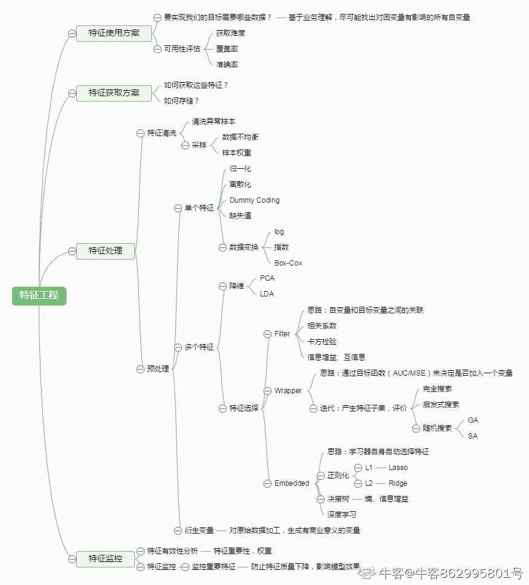
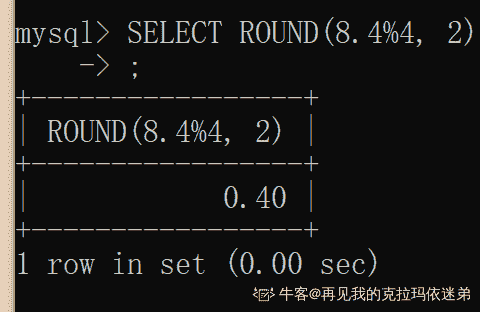
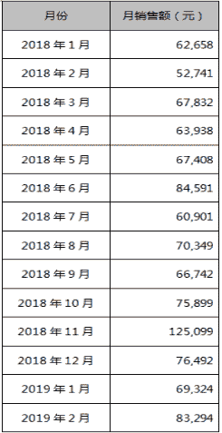

# 小红书 2020 校招数据分析笔试题卷三

## 1

对于任意事件 A、B，有如下（ ）成立

正确答案: C   你的答案: 空 (错误)

```cpp
P(A∪B)=P(A)+P(B)
```

```cpp
P(A-B)=P(A)-P(B)
```

```cpp
P(A∪B)=P(A)+P(B)-P(A∩B)
```

```cpp
P(A∩B)=P(A)P(B)
```

本题知识点

数据分析师 小红书 2020

讨论

[内卷制造机](https://www.nowcoder.com/profile/438641594)

P(A+B)=P(A∪B)P(AB)=P(A∩B)即 P(A+B) = P(A)+P(B)-P(AB) 

发表于 2020-07-05 20:14:12

* * *

[牛客 866225660 号](https://www.nowcoder.com/profile/866225660)

概率的性质
加法公式：对任意两个事件 A, B，有 
减法公式：对任意两个事件 A, B，有 

发表于 2021-10-18 20:27:39

* * *

## 2

在小红书用户今天是否打开 app 与前一日用户是否打开过 app 有关，今天使用过小红书 app，则明天会使用 app 的概率为 0.8；如果今天不使用，则明天使用的概率为 0.5。那么，如果周一用户使用过小红书 app，那么周三继续会使用 app 的概率为（）

正确答案: C   你的答案: 空 (错误)

```cpp
0.5
```

```cpp
0.64
```

```cpp
0.74
```

```cpp
0.82
```

本题知识点

数据分析师 小红书 2020

讨论

[陌上云飞](https://www.nowcoder.com/profile/925793167)

周三会继续使用 APP，分为两种情况周二使用和不使用。若周二使用 APP 概率 0.8*0.8。周二不使用 0.2*0.5，两个结果相加即为最终的概率

发表于 2020-06-11 20:28:20

* * *

[牛客 866225660 号](https://www.nowcoder.com/profile/866225660)

0.8*0.8 + 0.2*0.5 = 0.74

发表于 2021-10-18 20:30:26

* * *

## 3

假设出现在小红书首页的笔记，三十次曝光至少会被点开一次的概率是 0.95，请问，十次曝光被点开的概率是多少（）

正确答案: A   你的答案: 空 (错误)

```cpp
0.63
```

```cpp
0.5
```

```cpp
0.32
```

```cpp
0.85
```

本题知识点

数据分析师 小红书 2020

讨论

[蹦蹦糖](https://www.nowcoder.com/profile/102431135)

= 三十次曝光被打开一次 = 三十次曝光一次没有被打开


发表于 2020-06-02 18:02:30

* * *

[牛客 601716808 号](https://www.nowcoder.com/profile/601716808)

不好意思 我是来提示一楼 A=三十次曝光被至少打开一次

发表于 2021-01-08 15:00:13

* * *

[EllaChang](https://www.nowcoder.com/profile/514882940)

所以手头一定要有计算器嘛....没有计算器怎么估算呢

发表于 2021-05-27 14:04:56

* * *

## 4

标准差是用来描述数据离散程度。那么标准差是（）

正确答案: D   你的答案: 空 (错误)

```cpp
离差和的算术平方根
```

```cpp
算术平均数的算术平方根
```

```cpp
极差的算术平方根
```

```cpp
方差的算术平方根
```

本题知识点

数据分析师 小红书 2020

讨论

[阿俍](https://www.nowcoder.com/profile/2847133)

极差是最大值减最小值方差是每个值与平均值的差的平方和的平均值

发表于 2020-08-28 17:29:05

* * *

## 5

反向诱导是指政府、媒体等主体所采取的措施或者宣传活动，在实际的社会生活中不但没有收到预期的效果，反而导致了与预期相反的社会现象大量出现。（）

正确答案: C   你的答案: 空 (错误)

```cpp
某影院为了让观众摘下帽子，在银幕上打出通告：“本院允许老年人戴帽观赏。”结果通告一出，许多观众纷纷摘下了帽子
```

```cpp
某单位要求员工统一着装，结果招致单位很多女员工的强烈反对，最后只好不了了之
```

```cpp
高温季节供水相对紧张，某市自来水公司贴出告示，告知市民近期不会停水，结果导致很多市民在家中大量囤水备用
```

```cpp
某电视台播放预防心理疾病的讲座，很多市民对号入座，觉得自己得了心理疾病，纷纷打电话咨询
```

本题知识点

数据分析师 小红书 2020

讨论

[董慧芳](https://www.nowcoder.com/profile/834446827)

A 和 D 好像都打到了预期的目标，D 是说想让大家预防，大家去咨询了也算一种预防吧。B 答案不了了之，与刚开始的统一着装的要求不明确。相对来讲 C 比较符合，本来是让大家不要紧张，结果还是引起了囤水现象。

发表于 2020-09-03 09:00:07

* * *

## 6

哪些种分析方法能有效定位到问题所处环节？

正确答案: A   你的答案: 空 (错误)

```cpp
漏斗分析
```

```cpp
Abtest
```

```cpp
内外因分析法
```

```cpp
用户分群
```

本题知识点

数据分析师 小红书 2020

讨论

[牛客 862995801 号](https://www.nowcoder.com/profile/862995801)

链接：[`www.nowcoder.com/questionTerminal/e9ac3b05b6604775a3d50bc067eb545c?toCommentId=2534444`](https://www.nowcoder.com/questionTerminal/e9ac3b05b6604775a3d50bc067eb545c?toCommentId=2534444)
来源：牛客网
1\. 漏斗分析 --- 展现出各个阶段的转化率，通过漏斗各环节相关数据的比较,能够直观地发现和说明问题所在，从而找到优化方向。2\. A/B 测试 --- 同一个目标制定两个方案，让一部分用户使用 A 方案，另一部分用户使用 B 方案，记录下用户的使用情况，看哪个方案更符合设计。3\. 内外因分析法 --- 申论答题思路，内因就是相关主体自身的原因，外因就是主体之外的因素。4\. 用户分群 --- 进行用户画像的关键数据分析模型，将用户信息标签化分群，便于进行后续分析。

发表于 2020-07-18 19:33:55

* * *

## 7

机器学习在做特征选择时，可以用哪种方法？（）

正确答案: E   你的答案: 空 (错误)

```cpp
卡方
```

```cpp
信息增益
```

```cpp
平均互信息
```

```cpp
期望交叉熵
```

```cpp
选项都对
```

本题知识点

数据分析师 小红书 2020

讨论

[牛客 862995801 号](https://www.nowcoder.com/profile/862995801)



发表于 2020-07-18 19:48:17

* * *

## 8

下列回归分析不能用来预测连续因变量的是（）

正确答案: B   你的答案: 空 (错误)

```cpp
线性回归
```

```cpp
逻辑回归
```

```cpp
多项式回归
```

```cpp
岭回归
```

本题知识点

数据分析师 小红书 2020

讨论

[旧城俨然回眸笑](https://www.nowcoder.com/profile/6223383)

逻辑回归，Logistic Regression 实质是分类算法

发表于 2020-06-16 19:30:42

* * *

## 9

SQL 语句中与 Having 子句同时使用的语句是（）

正确答案: A   你的答案: 空 (错误)

```cpp
group by
```

```cpp
left join
```

```cpp
order by
```

```cpp
limit
```

本题知识点

数据分析师 小红书 2020

## 10

关于 logistic 回归算法，以下说法不正确的是（）

正确答案: B   你的答案: 空 (错误)

```cpp
logistic 回归是当前业界比较常用的算法，用于估计某种事物的可能性
```

```cpp
logistic 回归的目标变量可以是离散变量也可以是连续变量
```

```cpp
logistic 回归的结果并非数学定义中的概率值
```

```cpp
logistic 回归的自变量可以是离散变量也可以是连续变量
```

本题知识点

数据分析师 小红书 2020

讨论

[牛客 389234614 号](https://www.nowcoder.com/profile/389234614)

逻辑回归就是一分类算法

发表于 2020-07-13 15:35:58

* * *

## 11

Excel 中，当前工作表上有一个学生信息列表，包含学号、姓名、年龄、班级，若想查询某班级的平均年龄，以下最合适的方法是（）

正确答案: C   你的答案: 空 (错误)

```cpp
排序
```

```cpp
筛选
```

```cpp
数据透视表
```

```cpp
建立图表
```

本题知识点

数据分析师 小红书 2020

讨论

[牛客 806312442 号](https://www.nowcoder.com/profile/806312442)

直接选中范围应该就可以了

发表于 2021-06-24 11:50:42

* * *

[牛客 931495855 号](https://www.nowcoder.com/profile/931495855)

为啥不能筛选后直接右键选中范围，直接看下方栏平均值呢😥

发表于 2020-09-23 13:51:32

* * *

[牛客 489864972 号](https://www.nowcoder.com/profile/489864972)

数据透视表

发表于 2020-08-20 15:54:45

* * *

## 12

已知随机变量ξ服从二项分布，且 Eξ=2.4，Dξ=1.44，则参数 n,p 分别为（    ）

正确答案: B   你的答案: 空 (错误)

```cpp
6, 0.6
```

```cpp
6, 0.4
```

```cpp
9, 0.2
```

```cpp
24, 0.1
```

本题知识点

数据分析师 小红书 2020

讨论

[旧城俨然回眸笑](https://www.nowcoder.com/profile/6223383)

二项分布：E=npD = np(1-p)

发表于 2020-06-16 19:31:40

* * *

## 13

一个部门 1/2 为数据开发，2/5 为软件开发，1/4 两者都是，那么两者都不是的比例？（）

正确答案: B   你的答案: 空 (错误)

```cpp
0.23
```

```cpp
0.35
```

```cpp
0.4
```

```cpp
0.32
```

本题知识点

数据分析师 小红书 2020

讨论

[旧城俨然回眸笑](https://www.nowcoder.com/profile/6223383)

1-（1/2 +2/5-1/4）

发表于 2020-06-16 19:32:12

* * *

[牛客 866225660 号](https://www.nowcoder.com/profile/866225660)

翻译题目，已知：P(A) = 1/2, P(B) = 2/5, P(AB) = 1/4, 求  ？解：

发表于 2021-10-18 20:50:52

* * *

[请求转运的弟弟](https://www.nowcoder.com/profile/612134320)

画出集合

发表于 2021-03-28 13:45:02

* * *

## 14

以下表的设计，最合理的是（）

正确答案: A   你的答案: 空 (错误)

```cpp
学生{id,name,age}, 学科{id,name}, 成绩{学生 id,学科 id,成绩}
```

```cpp
学生{id,name,age}, 成绩{学生 id,学科 id,学科 name,成绩}
```

```cpp
成绩{学生 id,学生 name,学生 age,学科 id,学科名称,成绩}
```

```cpp
学科{id,name}, 成绩{学生 id,学生姓名,学生 age,学科 id,成绩}
```

本题知识点

数据分析师 小红书 2020

讨论

[一之明](https://www.nowcoder.com/profile/648393335)

数据库表的三范式， 第一范式:确保每一列的原子性 具体来说就是将数据库表中的所有字段都设置为不可拆分的原子值。第二范式：确保每列都和主键相关。第三范式：确保每列都和主键直接相关而不是间接相关。

发表于 2020-07-10 19:08:15

* * *

## 15

某一时间段各类商品销售量如下图：
需统计以下公式所示数据 =SUM(SUMIF(C2:C7,{"<10","<6"})*{1,-1})请问，该公式返回值为（）

正确答案: C   你的答案: 空 (错误)

```cpp
23
```

```cpp
9
```

```cpp
14
```

```cpp
22
```

本题知识点

数据分析师 小红书 2020

讨论

[牛客 840369562 号](https://www.nowcoder.com/profile/840369562)

最终的确是求销售量在 6<=x<10 内的数值之和。SUMIF(C2:C7,{"<10","<6"})返回{23，9}，分别对 C2:C7 中<10、<6 的数据进行求和，即 SUM(4,5,6,8)，SUM(4,5)。SUM(SUMIF(C2:C7,{"<10","<6"})*{1,-1})经过上一步，转为 SUM({23,9}*{1,-1})，即 23-9=14。

发表于 2020-07-04 09:55:57

* * *

[蹦蹦糖](https://www.nowcoder.com/profile/102431135)

sumif(c2:c7,{"<10","<6"}*{1,-1})表示 x<10 与 x>=6 范围相交，即 6<=x<10,所以为 6+8=14

发表于 2020-06-02 18:34:11

* * *

## 16

在中国，只有北海道连锁店经营日式快餐。如果上述断定为真，以下哪项不可能为真？（）
Ⅰ．苏州的北海道连锁店不经营日式快餐。
Ⅱ．杭州的樱花连锁店经营日式快餐。
Ⅲ．台州的北海道连锁店经营韩式快餐。

正确答案: B   你的答案: 空 (错误)

```cpp
只有Ⅰ。
```

```cpp
只有Ⅱ。
```

```cpp
只有Ⅲ。
```

```cpp
只有Ⅰ和Ⅱ。
```

本题知识点

数据分析师 小红书 2020

讨论

[牛客 665946122 号](https://www.nowcoder.com/profile/665946122)

b

发表于 2021-11-10 20:06:04

* * *

[偷星的猫](https://www.nowcoder.com/profile/970541912)

只有， 应该是两个都是唯一的

发表于 2020-08-31 21:14:48

* * *

## 17

以下说法正确的是（）

正确答案: A B C   你的答案: 空 (错误)

```cpp
方差分析可以用于两个样本均数的比较
```

```cpp
完全随机设计更适合样本对象变异不太大的资料
```

```cpp
在随机区组设计中，每一个区组内的例数都等于处理数
```

```cpp
在随机区组设计中，区组内以及区组间的差异都越小越好
```

本题知识点

数据分析师 小红书 2020

讨论

[零葬](https://www.nowcoder.com/profile/75718849)

对于随机区组设计：将整个试验区分成若干个区组，要求各区组内环境变异尽可能小，而各区组间的变异可以较大，可通过方差分析将误差从组间变异中分离出来。区组数与重复数相同，区组内例数与试验处理数相同，试验处理在区组内随机排列。

编辑于 2020-10-21 17:31:57

* * *

## 18

以下哪些统计方法可以用来分类？（）

正确答案: A B C D E   你的答案: 空 (错误)

```cpp
K 近邻法
```

```cpp
支持向量机
```

```cpp
贝叶斯网络
```

```cpp
神经网络
```

```cpp
决策树
```

本题知识点

数据分析师 小红书 2020

## 19

SQL 语言中，增加新的列用户性别到 temp1 中，以下不可以实现的是（）

正确答案: A C D   你的答案: 空 (错误)

```cpp
alter table add columns(gender,string)
```

```cpp
alter table add column(gender,string)
```

```cpp
alter table change column(gender,string)
```

```cpp
alter table change columns(gender,string)
```

本题知识点

数据分析师 小红书 2020

讨论

[牛客 471972220 号](https://www.nowcoder.com/profile/471972220)

答案是不是应该是 ACD

发表于 2020-08-05 11:49:18

* * *

[牛客 182266295 号](https://www.nowcoder.com/profile/182266295)

选项里表名都没写，搞毛

发表于 2020-07-13 14:35:26

* * *

[牛客 267309741 号](https://www.nowcoder.com/profile/267309741)

B 为什么不能实现欸

发表于 2020-06-30 11:49:52

* * *

## 20

概率抽样一般包括 （）

正确答案: B C D E   你的答案: 空 (错误)

```cpp
重点抽样
```

```cpp
分层抽样
```

```cpp
简单随机抽样
```

```cpp
整群抽样
```

```cpp
系统抽样
```

本题知识点

数据分析师 小红书 2020

讨论

[牛客 862995801 号](https://www.nowcoder.com/profile/862995801)

抽样调查是从调查对象中随机抽取一部分单位进行调查，并用这部分单位的调查结果推断总体数量特征的一种科学方法。
重点调查指在调查 i 对象中选取一部分重点单独位进行调查以了解总 zhi 体的情况典型调查指在调查 i 对象中选取一部分具有代表性的单位进行全面深入的调查用以了解总体的一般情况。概率抽样是指在调查总体样本中的每个单位都具有同等可能性被抽中的机会。概率抽样包括有[简单随机抽样](https://baike.baidu.com/item/%E7%AE%80%E5%8D%95%E9%9A%8F%E6%9C%BA%E6%8A%BD%E6%A0%B7)、系统抽样（[等距抽样](https://baike.baidu.com/item/%E7%AD%89%E8%B7%9D%E6%8A%BD%E6%A0%B7)）、[分层抽样](https://baike.baidu.com/item/%E5%88%86%E5%B1%82%E6%8A%BD%E6%A0%B7)（[类型抽样](https://baike.baidu.com/item/%E7%B1%BB%E5%9E%8B%E6%8A%BD%E6%A0%B7)）、[整群抽样](https://baike.baidu.com/item/%E6%95%B4%E7%BE%A4%E6%8A%BD%E6%A0%B7)、多段抽样、PPS 抽样和户内抽样[`baike.baidu.com/item/%E6%A6%82%E7%8E%87%E6%8A%BD%E6%A0%B7/4000916?fr=aladdin`](https://baike.baidu.com/item/%E6%A6%82%E7%8E%87%E6%8A%BD%E6%A0%B7/4000916?fr=aladdin)

发表于 2020-07-22 11:43:22

* * *

## 21

下列关于平滑预测法的说法，正确的有 （）

正确答案: A C   你的答案: 空 (错误)

```cpp
平滑法的目的是消除时间序列的不规则成分所引起的随机波动
```

```cpp
平滑法适合于有季节性波动的时间序列的预测
```

```cpp
平滑预测法包括移动平均法和指数平滑法
```

```cpp
平滑法对于数据的要求较高
```

```cpp
  平滑法可以对远期进行的较精准预测
```

本题知识点

数据分析师 小红书 2020

讨论

[找 Eli 内推字节呀](https://www.nowcoder.com/profile/273227331)

“平滑法：目的是“消除”时间序列的不规则成分所引起的随机波动，被称为平滑法。包括：移动平均法和指数平滑法等。平滑法适合于平稳时间序列的预测，即没有明显的趋势、循环和季节波动的时间序列。平滑法简单易用，对数据的要求最低，通常对于近期(如下一期)的预测具有较高的精度。”

发表于 2020-06-13 11:01:58

* * *

[呀~](https://www.nowcoder.com/profile/801470408)

简单指数平滑法是针对平稳时间序列的，二次指数平滑针对与有线性趋势的序列，季节指数平滑法才适用于有季节性变化的序列。平滑法一般只进行短期预测的。其方法比较简单，对数据的要求也没那么高。

发表于 2020-07-01 20:38:28

* * *

## 22

关于正态分布,下列说法正确的是（）

正确答案: A B D   你的答案: 空 (错误)

```cpp
正态分布具有集中性和对称性
```

```cpp
正态分布的均值和方差能够决定正态分布的位置和形态
```

```cpp
正态分布的偏度为 0，峰度为 1
```

```cpp
标准正态分布的均值为 0，方差为 1
```

本题知识点

数据分析师 小红书 2020

讨论

[牛客 862995801 号](https://www.nowcoder.com/profile/862995801)

链接：[`www.nowcoder.com/questionTerminal/263580ec6fa144a39e2c0455c51033df?source=relative`](https://www.nowcoder.com/questionTerminal/263580ec6fa144a39e2c0455c51033df?source=relative)
来源：牛客网
Kurtosis(峰度): 是对 Sample 构成的分布的峰值是否突兀或是平坦的描述。          
计算时间序列 x 的峰度，峰度用于度量 x 偏离某分布的情况，正态分布的峰度为 3。当时间序列的曲线峰值比正态分布的高时，峰度大于 3;当比正态分布的低时，峰度小于 3。 
Skewness(偏度)： 是对 Sample 构成的分布的对称性状况的描述。
计算时间序列 x 的偏度，偏度用于衡量 x 的对称性。若偏度为负，则 x 均值左侧的离散度比右侧强;若偏度为正，则 x 均值左侧的离散度比右侧弱。对于正态分布(或严格对称分布)偏度等于 0

发表于 2020-07-18 20:45:18

* * *

## 23

事务的执行结果必须使事务从一个状态转变到另一个一致性状态，是指事务的 1。

你的答案 (错误)

1 参考答案 (1) 一致性

本题知识点

数据分析师 小红书 2020

讨论

[牛客 427575907 号](https://www.nowcoder.com/profile/427575907)

事务的四大特性：原子性、一致性、隔离性、永久性。原子性指事务中包含的所有操作要么全部成功，要么全部失败回滚。一致性指事务必须使数据库从一个一致性状态变换到另一个一致性状态。隔离性指多个并发事务之间要相互隔离。永久性指事务一旦提交，对数据库的改变是永久性的，即使是数据库系统出现故障，也不会丢失提交事务的操作。

发表于 2020-09-10 15:12:43

* * *

## 24

Sql 函数：regexp_replace('foobar', 'oo|ar', '') =1。

你的答案 (错误)

1 参考答案 (1) fb

本题知识点

数据分析师 小红书 2020

讨论

[24248888](https://www.nowcoder.com/profile/380202622)

Replace 是将第一个 foobar 取代，取代的是在第二个引号‘oo,ar’，取代为在第三个引号，取代为空值  

发表于 2020-08-11 20:28:31

* * *

## 25

Sql 函数：round(8.4%4 , 2)=1。

你的答案 (错误)

1 参考答案 (1) 0.40

本题知识点

数据分析师 小红书 2020

讨论

[蹦蹦糖](https://www.nowcoder.com/profile/102431135)

8.4%4 取模为 0.4，求二位小数位 0.40。

编辑于 2021-02-20 10:20:07

* * *

[再见我的克拉玛依迷弟](https://www.nowcoder.com/profile/518570745)



发表于 2020-07-18 11:55:34

* * *

[鲨陷小吃](https://www.nowcoder.com/profile/159437926)

%取余数，8.4 除以 4 等于 2，余 0.4；取两位小数，故得 0.40

发表于 2021-03-18 15:02:04

* * *

## 26

假设一个元组在子查询 1 中出现 3 次，在子查询 2 中出现 2 次，则该元组在“子查询 1 union 子查询 2” 中出现几次 1

你的答案 (错误)

1 参考答案 (1) 1

本题知识点

数据分析师 小红书 2020

讨论

[蹦蹦糖](https://www.nowcoder.com/profile/102431135)

union all 不去重，union 去重

发表于 2020-06-02 18:49:42

* * *

## 27

请给出三种常见的聚类算法:1 、2、3 。

你的答案 (错误)

123 参考答案 (1) K-means 聚类、K-中心点聚类、CLARANS 算法,DIANA 算法、BIRCH 算法、Chameleon 算法
(2) EM 算法
(3) OPTICS 算法、DBSCAN 算法

本题知识点

数据分析师 小红书 2020

讨论

[牛客 316689989 号](https://www.nowcoder.com/profile/316689989)

DBSCAN. K means. EM

发表于 2021-08-21 05:21:14

* * *

## 28

有下面这么一段话：
“大家好，我是小秋老师。这学期我们一共有三门课，语文，算术，英语。希望大家好好学习，争取期末班级平均成绩第一。为了让我们的成绩更好，我们会每个月进行一次摸底考试。考完之后我们会按照成绩排座位。并且成绩不好的学生每天都要参与到当月的卫生打扫。关于打扫卫生，以后我们的卫生打扫将由每个小组轮流打扫，每次学校检查之前要进行一次大扫除，争取我们每次都能得到第一。以后每次的月考我们也会按照小组进行 PK，每次的 PK 成绩会挂在光荣榜上。光荣榜上还会对读课外书多的同学进行表扬，各个小组也要进行读书的 PK，优胜的小组会发放奖品，争取每个月我们班级的读书量也是第一。希望大家好好学习，天天向上，争创优秀班级。”
请整理小秋老师想要表达的内容。

你的答案

本题知识点

数据分析师 小红书 2020

讨论

[牛客 643159008 号](https://www.nowcoder.com/profile/643159008)

chinese,,math,englishavg(grade)

发表于 2020-08-25 21:21:11

* * *

[stefan666](https://www.nowcoder.com/profile/662675419)

课程：一共 3 门；分别是语文、数学、英语目标：整体目标是争创优秀班级；        有三个小目标：争取期末班级平均成绩第一、学校检查大扫除争取每次第一、争取每个月读书量第一标准：每个月进行月考；按照成绩进行安排座位奖惩制度：考的好的挂在光荣榜上，会对读课外书多的同学进行表扬，优胜的小组会发放奖品                  考的不好的学生每天都要参与到当月的卫生打扫其他内容：打扫卫生每个小组轮流打扫      总之，小秋老师希望我们在新的学期好好学习，认真听讲，在竞争中学习，能够有一个很好的学习氛围。

发表于 2020-10-19 11:11:47

* * *

[木小胖](https://www.nowcoder.com/profile/163918203)

1.目的：1.期末班级均分第一。2.每月学校大扫除第一。3.每月班级读书量第一。2.做法：1.每月都有月考。2.分小组，小组轮流打扫卫生，小组考试和读书 PK。3.奖惩措施：对个人：1.每次月考后按成绩排位。2.成绩差的每天都要打扫卫生。3.读书多的同学会被表扬。对小组：1.成绩好的小组上光荣榜。2.读书 PK 获胜的小组会发放奖品这样写是不是就错了？？？

发表于 2020-08-30 18:18:22

* * *

## 29

一家店铺 2018 年 11 月做了大量活动促销和推广带来了很高的销量，今年 8 月份店庆，计划在 8 月也进行一次大规模促销活动，已有这家店铺 2018 年 1 月至 2019 年 7 月的销售额，假设 2019 年 8 月与 2018 年 11 月促销形式、推广力度等均一样，且外界因素不作为影响因素，请预测该店 2019 年 8 月的销售额，请写下计算步骤、逻辑和最终结果；

你的答案

本题知识点

数据分析师 小红书 2020

讨论

[Nihilitior](https://www.nowcoder.com/profile/335508700)

1\. 年增长率 2\. 活动持续时间, 活动期间增长率

发表于 2020-08-31 21:16:03

* * *