# 小红书 2020 校招数据分析笔试题卷四

## 1

如果在小红书商城中某一商户给一产品定价，如果按照全网最低价 500 元定价，那么客人就一定会选择在此购买；价格每增加 1 元，客人的流失的可能性就会增加 1%。那么该商户给客人报出最优价格为（）

正确答案: C   你的答案: 空 (错误)

```cpp
520
```

```cpp
535
```

```cpp
550
```

```cpp
565
```

本题知识点

数据分析师 小红书 2020

讨论

[牛客 725398074 号](https://www.nowcoder.com/profile/725398074)

服了 明说 500 成本不好吗

发表于 2020-08-23 15:21:33

* * *

[Noodles_chen](https://www.nowcoder.com/profile/85897135)

设 x 为所涨价金额，这里 500 元是成本，求解（1-x/100）*x 的极值，x=50

发表于 2020-07-29 11:16:38

* * *

[jacky.zzz](https://www.nowcoder.com/profile/941991008)

设定价为 x，总顾客数为 m，实际成交顾客为 n，总利润为 s：由题意可知：n = 总顾客*成交率 = m *(1-(x-500)/100)总利润 s = 单件利润*成交数量 = （x-500) * n = m*(-x²/100 + 11x -3000)二元一次方程求极值问题，当 x=-b/2a 时，s 去最大值计算可知：x=550

发表于 2020-06-10 17:10:37

* * *

## 2

在一次集卡活动中，有 5 种不同的卡片以相同的概率出现，每分享一次笔记就可以得到一张卡片，集齐所有卡片所需点赞的笔记数量的期望，与以下哪个结果最为接近？（）

正确答案: B   你的答案: 空 (错误)

```cpp
9
```

```cpp
11
```

```cpp
13
```

```cpp
15
```

本题知识点

数据分析师 小红书 2020

讨论

[牛客 732230126 号](https://www.nowcoder.com/profile/732230126)

首先考虑从拥有 0 种到拥有任意 1 种卡片需要抽取的卡片数量的期望，易知 E0=1=5/5；再考虑从拥有 1 种卡片到拥有任意 2 种卡片需要抽取的卡片数量的期望，此时每抽取一张卡片，有 4/5 的概率完成此事件，因此期望 E1=5/4；
依次类推，收集 5 种卡片的期望是 E=1+5/4+5/3+5/2+5/1≈11.42

发表于 2020-06-10 22:41:22

* * *

[求职的小菜鸡](https://www.nowcoder.com/profile/944757957)

参考：[`blog.csdn.net/itnerd/article/details/82891112?utm_medium=distribute.pc_relevant.none-task-blog-BlogCommendFromMachineLearnPai2-1.nonecase&depth_1-utm_source=distribute.pc_relevant.none-task-blog-BlogCommendFromMachineLearnPai2-1.nonecase`](https://blog.csdn.net/itnerd/article/details/82891112?utm_medium=distribute.pc_relevant.none-task-blog-BlogCommendFromMachineLearnPai2-1.nonecase&depth_1-utm_source=distribute.pc_relevant.none-task-blog-BlogCommendFromMachineLearnPai2-1.nonecase)这道题目是求 m 个几何分布的和对于一个几何分布，每次成功概率为 p，期望就是 1/p，例如对于本题而言，每次独立实验，拿到某一种特定卡片 A 的概率为 1/5，那么期望就是 5，也就是说，平均拿 5 次卡片，就可以拿到其中某一种特定卡片 A。这也很好理解对于本体，多个几何分布的和假设这里面只有一种卡片，拿一次就拿齐了所有卡片，期望是 1 假设这里面有两种卡片，第一次肯定能拿到一种，那么，再拿多少次可以拿到剩下的那种呢，就又变成了一个几何分布，p = 1/2，期望是 2，也就是说，再拿 2 次，就可以拿到剩下的那一种，所以整体期望是 3 假设这里面有 3 种卡片，第一次肯定拿到了一种，期望是 1，第二次要拿另外的一种，p =  2/3，期望是 3/2，第三次要拿到第三种，p = 1/3，期望是 3，所以整体的期望是 11/2 以此类推，可以得到，若有 m 种卡片，出现概率相同，全部拿齐的期望是：
如果每次卡片出现的概率不一样，那么这 m 个几何分布的 p 值不一样，需要每一次的加和里面，把相应的概率值更换一下

编辑于 2020-06-22 17:45:10

* * *

[牛客 851303346 号](https://www.nowcoder.com/profile/851303346)

这是一个几何分布叠加问题， 几何分布的数学期望 E(X)=1/p(成功概率的倒数)， 题目***有 5 种不同的卡片， 第一次抽到一种卡片的概率为 1，期望为 1； 第二次抽中第二种卡片的概率为 4/5，则期望为 5/4； 第三次抽中第三种卡片的概率为 3/5，则期望为 5/3； 第四次抽中第四种卡片的概率为 2/5，则期望为 5/2； 第五次抽中第五种卡片的概率为 1/5，则期望为 5； 所以期望抽取的总次数为 1+5/4+5/3+5/2+5=11.42

发表于 2020-10-25 00:06:19

* * *

## 3

在 excel 中如何将列 a 的字符值与列 b 的字符值合并为一个字符串 c（）

正确答案: B   你的答案: 空 (错误)

```cpp
c=a+b
```

```cpp
c=a&b
```

```cpp
c = a and b
```

```cpp
c = a*b
```

本题知识点

数据分析师 小红书 2020

讨论

[zjq02010](https://www.nowcoder.com/profile/195290936)

这道题是不是错了，我在 wps 上测试，是 b 选项

发表于 2020-06-04 21:14:16

* * *

[肥七 _QQi](https://www.nowcoder.com/profile/372770116)

Excel 操作过，选 B

发表于 2020-06-11 15:26:31

* * *

[秃头的代码菜鸟](https://www.nowcoder.com/profile/969387274)

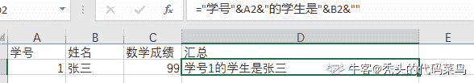

发表于 2020-10-14 09:45:23

* * *

## 4

```cpp
select count(open)  count(distinct user_id)   from   temp1
```

（）

正确答案: A   你的答案: 空 (错误)

```cpp
3，4
```

```cpp
5，5
```

```cpp
5，3
```

```cpp
3，5
```

本题知识点

数据分析师 小红书 2020

讨论

[肥七 _QQi](https://www.nowcoder.com/profile/372770116)

不懂这道题在讲什么···

发表于 2020-06-11 15:27:28

* * *

[牛客 719370446 号](https://www.nowcoder.com/profile/719370446)

表呢？

发表于 2020-07-03 17:04:36

* * *

[小橙汁](https://www.nowcoder.com/profile/158654105)

distinct 去重了不是应该比不去重少才对吗?求大佬解答

发表于 2020-10-04 16:04:13

* * *

## 5

 调查全公司 1000 名员工平均交通费用支出情况，采取不重置抽样，从其中抽取 100 名进行调查。根据以往调查可知总体方差 s²为 100，则样本均值的方差为 （）

正确答案: C   你的答案: 空 (错误)

```cpp
0.1
```

```cpp
1
```

```cpp
100/111
```

```cpp
10/111
```

本题知识点

数据分析师 小红书 2020

讨论

[牛客 188000430 号](https://www.nowcoder.com/profile/188000430)

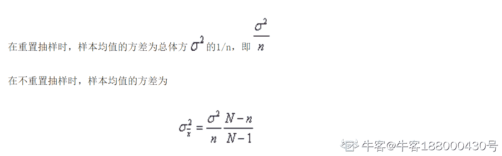

编辑于 2020-06-16 14:40:29

* * *

[牛客 653924108 号](https://www.nowcoder.com/profile/653924108)

样本方差为：S=σ²/n=100/100=1 所以求样本均值方差为：S*((N-n)/(N-1))=1*((1000-100)/(1000-1))=100/111

发表于 2020-06-15 11:35:15

* * *

## 6

已知 2-5 月环比增长速度分别为 5.6%、7.1%、8.5%、6.4%，则 5 月对比 1 月的增速是 （）

正确答案: B   你的答案: 空 (错误)

```cpp
5.6%×7.1%×8.5%×6.4%
```

```cpp
(105.6%×107.1%×108.5%×106.4%)-100%
```

```cpp
(5.6%×7.1%×8.5%×6.4%)+100%
```

```cpp
105.6%×107.1%×108.5%×106.4%
```

本题知识点

数据分析师 小红书 2020

讨论

[jacky.zzz](https://www.nowcoder.com/profile/941991008)

增速，应该要减 1 吧

发表于 2020-06-10 17:17:14

* * *

[牛客 10010195 号、](https://www.nowcoder.com/profile/838229532)

定基发展速度与环比发展速度，两者之间没有直接的换算关系，在由环比增长速度推算定基增长速度时，可先将各环比增长速度加 1 后连乘，再将结果减 1，即得定基增长速度，则定基增长速度为(107.8%×109.5%×106.2%×104.9%)-100%。故本题应选 B

编辑于 2020-10-06 16:31:21

* * *

[神秘的小明同学](https://www.nowcoder.com/profile/838751260)

考察增长速度，分为定基增长速度和环比增长速度

发表于 2020-09-28 09:09:36

* * *

## 7

“鱼与熊掌不可得兼”的意思是：（）

正确答案: B   你的答案: 空 (错误)

```cpp
要么得鱼，要么得熊掌
```

```cpp
得熊掌就不得鱼
```

```cpp
或者得鱼，或者得熊掌
```

```cpp
不得熊掌就得鱼
```

本题知识点

数据分析师 小红书 2020

讨论

[牛客 683077451 号](https://www.nowcoder.com/profile/683077451)

鱼 a 与熊掌 b 互斥，交集为空，不代表互补，因为还可以存在其它选择。ACD 选项把人的选择固定在了你要么得鱼，不得鱼就得熊掌。

发表于 2020-07-03 16:44:20

* * *

[KyleE.Z.](https://www.nowcoder.com/profile/908766700)

这题出的，唉，再下实在是想不到

发表于 2020-06-19 15:12:43

* * *

[Maple_2005](https://www.nowcoder.com/profile/203246634)

得兼和兼得不一样 得兼：一起同时得到 ，要么都得不到，要么只得到一个； 兼得：两者都得到 ，意思是不是得到这个就是得到那个。

编辑于 2020-06-01 20:41:21

* * *

## 8

以下哪些是判别模型？（）

正确答案: B C E   你的答案: 空 (错误)

```cpp
隐马尔科夫
```

```cpp
决策树
```

```cpp
支持向量机
```

```cpp
朴素贝叶斯
```

```cpp
最大熵模型
```

本题知识点

数据分析师 小红书 2020

讨论

[青春带笑 work](https://www.nowcoder.com/profile/307221123)

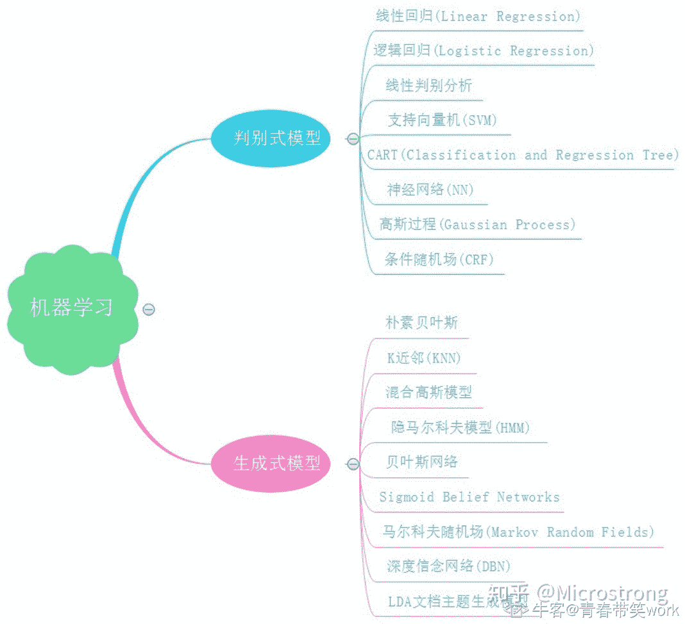

发表于 2020-07-01 14:26:54

* * *

## 9

下列 Excel 公式输入的格式中，正确的有()

正确答案: B   你的答案: 空 (错误)

```cpp
'=SUM (1, 2,…..,9,10)
```

```cpp
'=SUM(E1:E6)
```

```cpp
'=SUM(A1;E7)
```

```cpp
SUM(“18”,”25”,7)
```

本题知识点

数据分析师 小红书 2020

讨论

[风挽](https://www.nowcoder.com/profile/140797005)

D 选项开头都没有等号，应该不是对的吧。

发表于 2020-06-08 10:58:17

* * *

[时间让灵魂变得动人](https://www.nowcoder.com/profile/256572888)

a 难道因为有空格？电脑上看起来像有空格

发表于 2020-08-02 20:59:59

* * *

[AprilYY](https://www.nowcoder.com/profile/225471897)

ABC

发表于 2020-07-23 17:25:25

* * *

## 10

关于正态分布,下列说法正确的是（）

正确答案: A B D   你的答案: 空 (错误)

```cpp
正态分布具有集中性和对称性
```

```cpp
正态分布的均值和方差能够决定正态分布的位置和形态
```

```cpp
正态分布的偏度为 0，峰度为 1
```

```cpp
标准正态分布的均值为 0，方差为 1
```

本题知识点

数据分析师 小红书 2020

讨论

[呐呐呐是 locke 喔](https://www.nowcoder.com/profile/8517150)

标准正态分布的峰度和偏度都为 0

发表于 2020-07-01 14:46:26

* * *

[牛客 446046218 号](https://www.nowcoder.com/profile/446046218)

正态分布的峰度为 3

发表于 2020-06-03 16:15:46

* * *

[华山小乞丐](https://www.nowcoder.com/profile/315050602)

考察正态分布的基本知识

正态分布曲线对称，具有对称性，均值和中位数位于中央，具有集中性。
正态分布的均值决定了曲线的中央位置，方差指出了分散性，也就是方差越大，曲线越扁平、越宽，决定了其形态。
标准正态分布的均值为 0，方差为 1。
标准正态分布的偏度为 0，峰度为 0。

发表于 2021-08-26 10:49:40

* * *

## 11

X 服从区间（1,5）上的均匀分布，求对 X 进行 3 次独立观测中，至少有 2 次的观测值大于 2 的概率 1。（填空题是字符串完全匹配，答案仅供参考)

你的答案 (错误)

1 参考答案 (1) 0.84375（或 27/32）

本题知识点

数据分析师 小红书 2020

讨论

[秃头的代码菜鸟](https://www.nowcoder.com/profile/969387274)

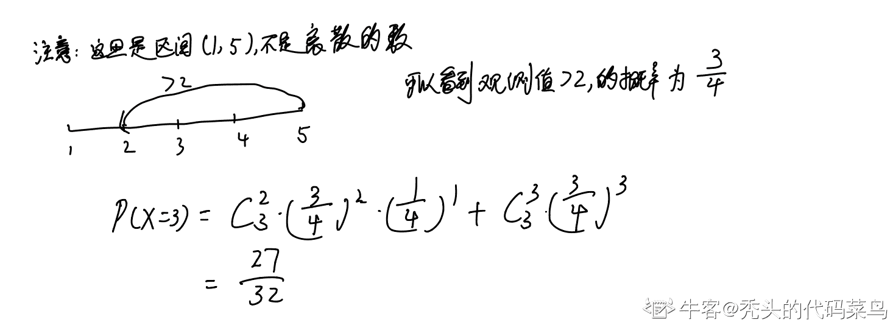

发表于 2020-10-14 10:39:25

* * *

[Maple_2005](https://www.nowcoder.com/profile/203246634)

均匀分布，大于 2 的概率为 3/4。 至少两次大于 2，意味着两次或者三次 p（A）=3*3/4*3/4*1/4+3/4*3/4*3/4=27/32

发表于 2020-06-01 20:45:24

* * *

[落是落落的落](https://www.nowcoder.com/profile/181901897)

三次独立观测满足二项分布 B~(3,3/4)  P(X=r)=C(n,r)*p^r*(1-p)^(n-r)
其中 C(n,r)表示组合数 C(n,r) = n!/r!(n-r)!则至少两次（二次或三次）    P = 3!/2!(3-2)!*(3/4)²*(1/4)+3!/3! * (3/4)³   =3*(3/4)*(3/4)*(1/4)+ (3/4)³   =27/32 

发表于 2020-07-23 15:14:30

* * *

## 12

抽样估计的优良标准有三个：  1   、2   、3       ；影响时间序列的因素有四个：4   、5   、6 、7  。

你的答案 (错误)

1234567 参考答案 (1) 无偏性
(2) 一致性
(3) 有效性
(4) 长期趋势
(5) 季节变动
(6) 循环波动
(7) 不规则波动

本题知识点

数据分析师 小红书 2020

讨论

[游泳健将 SSS](https://www.nowcoder.com/profile/242565499)

抽样估计的优良标准有三个,即:无偏性、一致性和有效性。影响时间序列的因素有四个,即:长期趋势、季节变动、循环波动和不规则波动。

发表于 2020-07-25 15:23:03

* * *

[鹿鸣松](https://www.nowcoder.com/profile/646250553)

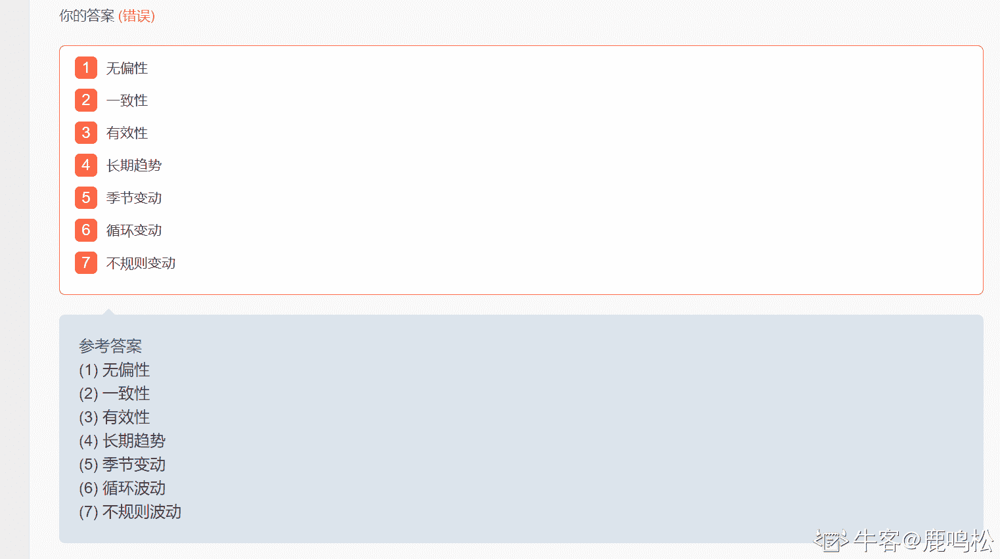喵喵喵？

发表于 2020-11-26 16:05:55

* * *

[董慧芳](https://www.nowcoder.com/profile/834446827)

是不是填的顺序不对，也不对呀？

发表于 2020-09-03 20:00:20

* * *

## 13

请给出三种常见的聚类算法:1、2 、3 。

你的答案 (错误)

123 参考答案 (1) K-means 聚类、K-中心点聚类、CLARANS 算法,DIANA 算法、BIRCH 算法、Chameleon 算法
(2) EM 算法
(3) OPTICS 算法、DBSCAN 算法

本题知识点

数据分析师 小红书 2020

讨论

[zeroplus](https://www.nowcoder.com/profile/952831948)

非得写得一直不差才行吗?

发表于 2021-01-29 23:30:19

* * *

## 14

小红书人脸识别系统识别当前进入小红书公司人员的身份，此系统一共识别三种不同的人员：员工，送餐员和陌生人。哪种学习方法适合此种应用需求 1。

你的答案 (错误)

1 参考答案 (1) 多分类

本题知识点

数据分析师 小红书 2020

讨论

[追光的人](https://www.nowcoder.com/profile/564732436)

这个不应该是监督学习么

发表于 2020-06-24 12:13:20

* * *

[火只火只](https://www.nowcoder.com/profile/243829552)

这个问题就很有歧义，不理解

发表于 2021-02-10 13:18:18

* * *

[Kayrin](https://www.nowcoder.com/profile/351128930)

人工**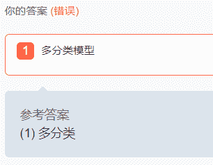

编辑于 2021-08-21 07:27:29

* * *

## 15

小红书在首页上线了一个新的模块，目的是为了提升用户的浏览时长，请设计一套分析方案，衡量模块上线后对用户停留时长是否有提升？

你的答案

本题知识点

数据分析师 小红书 2020

讨论

[肥七 _QQi](https://www.nowcoder.com/profile/372770116)

采用假设检验的方法衡量模块上线后对用户停留时长是否有提升假定，用户停留时长为 stay_time 将用户均匀分为两组，一组为对照组，一组为实验组。对照组不上线新模块，实验组上线新模块，采集对照组和实验组用户每天的浏览时长，分别为 stay_time_X0，stay_time_X1 （1）原假设：用户停留时长没有提升，即，stay_time_X0 = stay_time_X1 备择假设 ：用户停留时长提升，即，stay_time_X0 < stay_time_X1（2）选取 5%为显著性水平临界值（3）计算最小样本量，采集数据 考虑到指标的周期性，时间周期选取 2 周。
采集实验开始前一天，两组用户的数据，是否存在明显差异，如无，继续观察前两天的数据，是否存在异常。如无异常，继续采集数据。（4）使用 T 检验，计算 p 值（5）得出结论：若 p 值<5%，则推翻原假设，备择假设成立，新的模块能显著提升用户停留时长。反之，不能推翻原假设，不能判断新的模块是否能提升用户停留时长。

发表于 2020-06-11 14:36:45

* * *

[rookie_peng](https://www.nowcoder.com/profile/508307741)

1、明确目标：进行此次试验的目的是确定新模块上线后对用户停留时长是否有提升，并确定相应的指标：所有用户浏览时间长度的平均值 2、实验组与对照组的配置对照组不采取新的模块，实验组上线新的模块 3、作出假设 H0：新模块上新和用户停留时长没有提升 x>=y  H1：新模块上新和用户停留时长有提升，即 x<y 4、进行实验将用户 id 进行 hash 取模，分为 100 个桶，并为其编号，进行实验 5、取数分析待实验进行一段数据稳定后，取得相应的数据进行分析，看对照组和实验组是否存在显著性差异

发表于 2020-08-30 16:10:44

* * *

[数据小宅宅求 offer](https://www.nowcoder.com/profile/104699648)

A/B test，就 A 试验即为首页原版，记录用户浏览时长数据，B 试验即为首页增加新模块后，用户浏览时长数据；保证 A、B 试验中的用户群年龄、性别、城市等用户属性无显著性差异，设置原假设：H0：两组用户平均浏览时长相等，备择假设：H1：两组平均浏览时长不等，然后对 A、B 试验记录的用户浏览时长用 SPSS 做独立样本 t 检验，看是否存在显著性。

发表于 2020-08-19 16:07:54

* * *

## 16

下表是某电商在不同品类不同月份的销量数据
（1） 请用 sumif 或 sumifs 在 F3 单元格实现计算洗面奶在 201901 的销量
（2） 请用函数实现计算洗面奶有几个月的销量超过了 100 万
（3） 请用函数计算洗面奶这个品类的月复合增长率
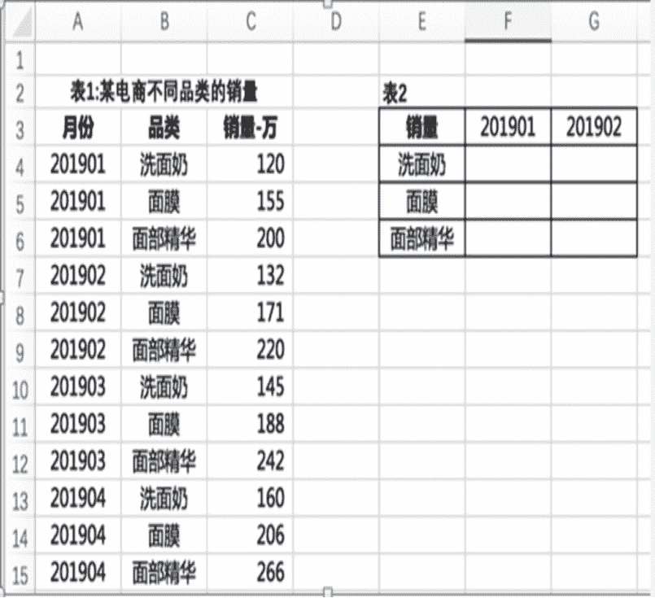

你的答案

本题知识点

数据分析师 小红书 2020

讨论

[秃头的代码菜鸟](https://www.nowcoder.com/profile/969387274)

(1)SUMIFS(C4:C15,A4:A15,F3,B4:B15,E4)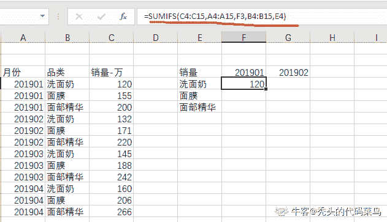(2)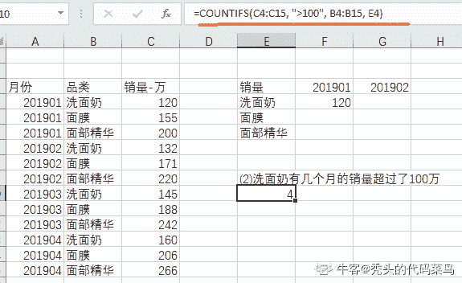(3)洗面奶月复合增长率=(现有价值/基础价值)^(1/月份数) - 1=（160/120）^(1/3)-1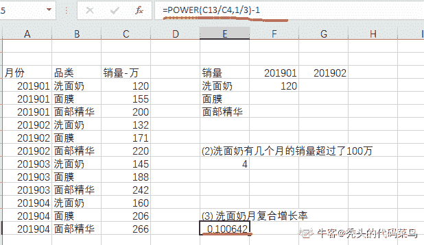

发表于 2020-10-15 00:32:00

* * *

[Fiona_Wang](https://www.nowcoder.com/profile/394330076)

1\. sumifs($C$4:$C$15,$A$4:$A$15,F3,$B$4:$B$15,"洗面奶") 2.countifs($C$4:$C$15,">100",$D$4:$D$15,"洗面奶")3.power(C13/C4,1/3)-1

发表于 2020-07-17 14:36:23

* * *

[高高兴兴拿 offer](https://www.nowcoder.com/profile/5237284)

（1）sumifs(C4:C15,A4:A15,F3,B4:B15,E4)（2）countifs(C4:C15,">100",B4:B15,E4)（3）pow(160/120,1/3)-1

发表于 2020-07-22 10:53:52

* * *

## 17

有订单事务表 orders：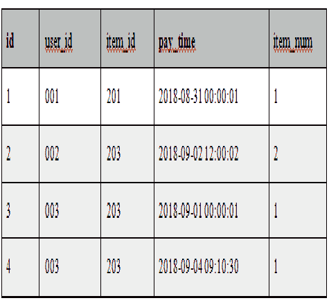
有收藏事务表 favorites：
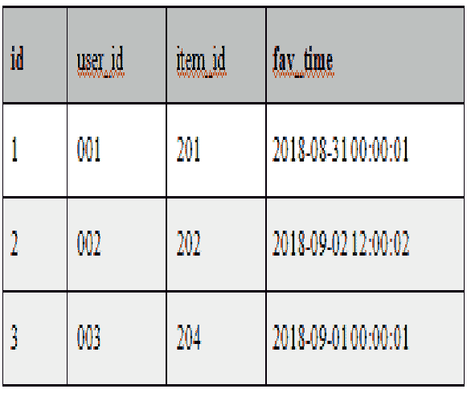
请用一句 SQL 取出所有用户对商品的行为特征，特征分为已购买、购买未收藏、收藏未购买、收藏且购买（输出结果如下表）
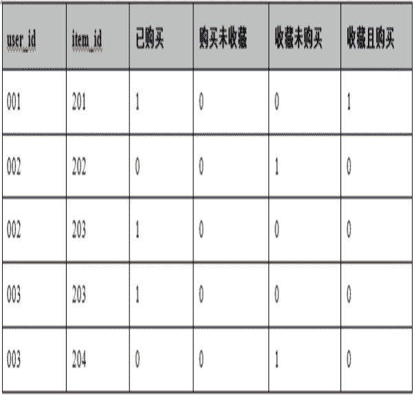

你的答案

本题知识点

数据分析师 小红书 2020

讨论

[上岸吧兄 dei](https://www.nowcoder.com/profile/646722939)

Oracle 支持 full join，mysql 是不支持 full join 的，等价于**左外连接+ union+右外连接实现**

```cpp
# 创建表&插入数据
CREATE TABLE `orders` (
`id` int(11) NOT NULL,
`user_id` char(11) NOT NULL,
`item_id` int(11) NOT NULL,
`pay_time` date NOT NULL,
`item_num` int(11) NOT NULL,
PRIMARY KEY (`id`,`user_id`,`item_id`));

INSERT INTO orders VALUES(1,'001',201,'2018-08-31',1);
INSERT INTO orders VALUES(2,'002',203,'1987-06-26',2);
INSERT INTO orders VALUES(3,'003',203,'1996-08-03',1);
INSERT INTO orders VALUES(4,'003',203,'1997-08-03',1);

CREATE TABLE `favorites` (
`id` int(11) NOT NULL,
`user_id` char(11) NOT NULL,
`item_id` int(11) NOT NULL,
`fav_time` date NOT NULL,
PRIMARY KEY (`id`,`user_id`,`item_id`));

INSERT INTO favorites VALUES(1,'001',201,'2018-08-31');
INSERT INTO favorites VALUES(2,'002',202,'1987-06-26');
INSERT INTO favorites VALUES(3,'003',204,'1996-08-03');

# MySQL 不支持
SELECT o.user_id, o.item_id, 
(CASE when o.pay_time is not null then 1 else 0 end) as '已购买',
(CASE when o.pay_time is not null and f.fav_time is null then 1 else 0 end) as '购买未收藏',
(CASE when o.pay_time is null and f.fav_time is not null then 1 else 0 end) as '收藏未购买',
(CASE when o.pay_time is not null and f.fav_time is not null then 1 else 0 end) as '收藏且购买'
FROM orders o
FULL OUTER JOIN favorites f
ON o.user_id = f.user_id
AND o.item_id = f.item_id;

# MySQL 应该这么写
SELECT o.user_id,o.item_id,
(CASE when o.pay_time is not null then 1 else 0 end) as '已购买',
(CASE when o.pay_time is not null and f.fav_time is null then 1 else 0 end) as '购买未收藏',
(CASE when o.pay_time is null and f.fav_time is not null then 1 else 0 end) as '收藏未购买',
(CASE when o.pay_time is not null and f.fav_time is not null then 1 else 0 end) as '收藏且购买'
FROM orders o 
LEFT JOIN favorites f 
ON o.user_id = f.user_id 
AND o.item_id = f.item_id
UNION
SELECT
f.user_id,f.item_id,
(CASE when o.pay_time is not null then 1 else 0 end) as '已购买',
(CASE when o.pay_time is not null and f.fav_time is null then 1 else 0 end) as '购买未收藏',
(CASE when o.pay_time is null and f.fav_time is not null then 1 else 0 end) as '收藏未购买',
(CASE when o.pay_time is not null and f.fav_time is not null then 1 else 0 end) as '收藏且购买'
FROM orders o 
RIGHT JOIN favorites f 
ON o.user_id = f.user_id 
AND o.item_id = f.item_id
ORDER BY user_id, item_id;
```

题目答案给的有问题，正确的应该是👇
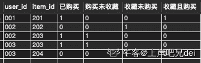

编辑于 2020-08-26 10:44:13

* * *

[牛客 267309741 号](https://www.nowcoder.com/profile/267309741)

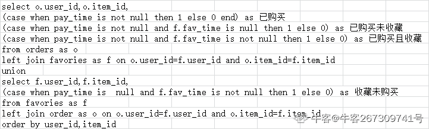

发表于 2020-06-18 12:09:09

* * *

[耀杨融一](https://www.nowcoder.com/profile/950817846)

SELECT
a.user_id,a.item_id,
(CASE when a.item_id is not null then 1 else 0 end) as '已购买',
(CASE when a.item_id is not null and b.item_id is null then 1 else 0 end) as '购买未收藏',
(CASE when a.item_id is not null and b.item_id is not null then 1 else 0 end) as '收藏且购买',
'0' as '收藏未购买'
FROM
orders a LEFT JOIN
favorites b ON
a.user_id = b.user_id AND a.item_id = b.item_id
UNION
SELECT
b.user_id,b.item_id,
(CASE when a.item_id is not null then 1 else 0 end) as '已购买',
'0'  as '购买未收藏',
(CASE when a.item_id is not null and b.item_id is not null then 1 else 0 end) as '收藏且购买',
(CASE when a.item_id is null and b.item_id is not null then 1 else 0 end) as '收藏未购买'
FROM
orders a RIGHT JOIN
favorites b ON
a.user_id = b.user_id AND a.item_id = b.item_id
ORDER BY
user_id

编辑于 2020-07-20 16:52:19

* * *

## 18

好评率是用户对产品评价的重要指标。现在需要统计 2019 年 3 月 1 日到 2019 年 3 月 31 日，用户'小张'提交的"母婴"类目"DW"品牌的好评率（好评率=“好评”评价量/总评价量），请写出 SQL/Python/其他语言查询语句:
用户评价详情表：a
字段：id（评价 id，主键），create_time（评价创建时间，格式'2019-01-01'）， user_name(用户名称)，goods_id(商品 id，外键) ，
sub_time（评价提交时间，格式'2019-01-01 23:10:32'），sat_name（好评率类型，包含：“好评”、“中评”、“差评”）
商品详情表：b
字段：goods_id（商品 id，主键），goods_name（商品类目）, brand_name(品牌名称)

你的答案

本题知识点

数据分析师 小红书 2020

讨论

[舒阿然](https://www.nowcoder.com/profile/151635684)

select sum(case when sat_name = '好评' then 1 else 0 end)/sum(case when sat_name is not null then 1 else 0 end) as 好评率 from a join b on a.goods_id = b.goods_idwhere a.user_name = '小张'and goods_name = '母婴'and brand_name = 'DW'and create_time between '2019-03-01' and '2019-03-31'

发表于 2020-07-19 22:04:12

* * *

[呀~](https://www.nowcoder.com/profile/801470408)

参考答案中 case when 中 0 应该改为 Null 吧？count 不是会把 0 也给计数下去么

发表于 2020-07-03 11:45:49

* * *

[喜欢数分的 Ray](https://www.nowcoder.com/profile/208224767)

```cpp
# 目标：计算 3-1 到 3-31（用 ceate_time 字段限定）内，母婴（关联 b 表通过 goods_name 筛选），DW（同理），的好评率
# 好评率：好评量（通过 set_name 条件判断）；总评价量：count(id),每一个 id 对应一条 review

# MySQL
select
	cat(round(sum(a.sat_name="好评")/count(a.id),2)*100,"%") as "好评率"
from a
join b
on a.goods_id = b.goods_id
where a.create_time between "2019-03-01" and "2019-03-31"
and user_name = "小张"
and b.goods_name = "母婴"
and b.brand_name = "DW"；

# Python
df_merge = pd.merge(a,b,on="goods_id",how="inner")
# 筛选小张，时间，母婴，DW 等条件对应的数据
df_query = df_merge.query("(create_time>='2019-03-01') and (create_time<='2019-03-31') and \
               (goods_name = '母婴') and (brand_name = 'DW') and (user_name = '小张')")
# 计算好评率
round((df_query["sat_name"] == "好评").sum()/df_query.shape[0],2)
```

发表于 2022-02-19 05:33:48

* * *

## 19

经过一番研究后，我们开发出了商品页面上“相关商品”模块的一个新的推荐算法，并且打算通过 AB Test（50%用户保留原先的算法逻辑为控制组，50%用户使用新的算法逻辑为实验组）来对新的算法效果进行评估。假设你是此次实验的数据分析师，请问你会如何评估控制组和实验组的表现？（假设需要数据都可取到）请按重要性列出最重要的三个指标并给出你的分析过程/思考。

你的答案

本题知识点

数据分析师 小红书 2020

讨论

[牛客 821286239 号](https://www.nowcoder.com/profile/821286239)

(1)指标：1.相关商品的点击量，直观的反映新的推荐算法推荐的商品是否吸引顾客；2.进入相关商品页面后的付费率，反映推荐商品是否是顾客所需要的；3.销售总额（GMV），反映新的推荐算法是否为商家带来更高的利润。（2）分析过程假设检验 1.设原假设为使用新的推荐算法后上述指标降低或不变，备择假设为使用新的推荐算法后上述指标增加 2.选择显著性水平临界值为 5%,采集数据选择周期时间为 2 周，在数据采集前检查两组数据是否有明显差异，若无，继续采集数据 3.使用 T 检验，计算 P 值 4.分析结论，如果 P 值小于 5%，那么原假设不成立，备择假设成立，即使用新算法后指标提升，反之无法推翻原假设，不能证明使用新算法后指标提升

编辑于 2020-09-01 18:36:54

* * *

[喜欢数分的 Ray](https://www.nowcoder.com/profile/208224767)

**Business Objective:** 新的推荐算法被用于相关商品模块，所以我们首先根据此处信息推断出此次新上线算法的商业目的是什么。推荐算法是给浏览了某些商品的用户推荐其他相关的商品，所以算法的目的可能是为了提升提升电商业务的发展，即平台的交易额。

**Pre analysis before A/B test:**

确认了目标后，可以开始设计指标确定评价算法在 control 和 treatment 两组间的好坏。为了设计指标，从用户行为路径角度出发，看看用户如何从浏览到购物：

*step 1: 分析用户行为路径，确认目标群体。*

一个用户从浏览到购买大概要经历这些流程：登录 --> 浏览商品模块 --> 浏览推荐商品 --> 将商品/推荐商品加入购物车/收藏商品 --> 进入购买页面（开始购买流程） --> 完成购买。

*Step 2: 确认 OEC，设计指标*

由于核心目标是提升小红书的电商业务增长，所以 oec 应该与该目标挂钩。首先，用户只有进入商品界面开始浏览商品时才会受到推荐算法的影响，如果推荐的商品非常准确，用户可能会点击并且收藏加购。其次，我们还需要考虑到算法带来的弊端。新的推荐算法干扰了用户的购买决策，可能推荐的商品十分准确，用户在本打算购买 A 商品的情况下，开始在推荐的商品之间徘徊，从而只是加购或者收藏，却没有购买行为。所以我们需要一个指标衡量算法给收入带来的影响。因此，我提出的指标如下：

*   **ARPU:** 每个用户贡献的平均收入。该指标直接衡量了算法带了的商业价值。用平均收入的

*   **Click Rate:** 平均点击率

*   用户收藏的平均商品数量

*   **Page-Load-time.** 同时可能新的算***给平台引入新的代码漏洞，甚至拖慢运行速度。所以我们设定"页面加载速度"为 guardrail 指标

**Design of A/B test**

对于 A/B test 的设计，我们回答以下四个问题：

*   我们选取什么作为 randomization units?

在这个业务场景中，推荐算***给浏览商品的用户推荐相关商品，所以我们选取经常浏览商品页面的用户作为随机试验单位。

*   抽取多大的样本？

在该案例中，我利用常用的公式: sample size = 分母为 minimum detectable effect。\sigma² 为样本方差，可以从总体中计算。对于小红书这种成长迅速的 startup 可能需要设定较大 minimum detectable effect，同时更新新的推荐算法需要较高的开发成本，因此我们设定 80%的 statistical power 以及 10%或者更高的 minimum detectable effect。换句话说，我们希望用 80%的统计力量观测到经常浏览商品界面的用户平均贡献收入 10%的增长变化。

*   实验应该运行多久？

为确保试验能观测到用户行为在一周中的不同时间的变化，我们至少运行试验一周以观测到 day-of-week 的影响。

**Implementation of A/B test**

1.  将用户随机拆分成 control and treatment。对于控制组我们不上线新的算法，对于实验组上线新算法。

2.  搜集数据。安排用户的 log data 以及与 app 互动的行为数据。这一步可以通过公司的数据平台实现。

3.  开始计算相关指标，置信区间，以及实施统计检验。计算定义出的 4 个指标值，为指标建立置信区间，进行假设检验。因为针对两个独立随机群体，可以采用双样本 T 检验，观测两个 variant 之间的指标均值是否有显著差异。根据 P 值和设定的 0.05 显著性水平，我们可以确认是否能够在此次试验中观测到研究影响。

4.  决策。我们需要在 statistical significance 以及 practical significance 之间权衡。如果存在 statistical significance，但是 practical significance 没有达到预定目标，我们不会实施该新算法，只能说明这个新算法是有意义的，能够带来显著的变化。如果不存在 practical significance，但是存在 practical significance，说明可能数据不足，我么可以运行后续试验，来获得更多的 statistical power。其次，我们需要在不同指标间平衡。如果观测到时间结果，并且具有实际显著意义，但是更新的算***减慢页面加载速度，从而严重影响到用户体验，我们就不应该更新算法；反之，使用新算法。

编辑于 2022-02-19 11:09:49

* * *

[牛客 123111](https://www.nowcoder.com/profile/123170557)

ctr，订单成交转化率，arpu

发表于 2020-08-14 16:22:13

* * *

## 20

如果我们发现，某店铺的 X 品类在今年 3 月的销量，比去年 3 月的销量下降了 50%，如果你是负责此次分析的数据分析师，你会如何分析？请写出你的分析思路/过程/想法。

你的答案

本题知识点

数据分析师 小红书 2020

讨论

[董慧芳](https://www.nowcoder.com/profile/834446827)

1、查明数据来源的可信性，查看数据时候正确 2、数据正确，的确下降的前提下，展开以下分析：用户分析：（1）将用户分为新用户和老用户，定位是哪个用户群体出了问题（2）假设是老用户出了问题，分析老用户的回购率，流失率以及活跃度，分析是哪个环节出了问题（3）定位了环节，再考虑从渠道方面展开分析，看看是哪个渠道出了问题；产品分析：（1）产品是否更新了，不符合消费者喜好或者还未让消费者接受（2）产品的价格是否有变动（3）产品周期性市场分析：（1）同质品类的竞争者有什么活动，互补品品类的商品有什么变化（3）有什么政策上的变化（4）市场上技术的发展趋势

编辑于 2020-09-03 20:28:10

* * *

[offer 来来来 _](https://www.nowcoder.com/profile/275568314)

1.  检验数据是否正确
2.  指标拆分

*   销量=日均销量*30=订单数*（1-订单取消率-退货率）*30；
*   退货率=退货数/订单总数，进一步分析退货原因：质量问题/恶意退货/客服服务问题；
*   订单取消率=订单取消数/订单总数，进一步分析订单取消原因，竞品性价比高/服务好/店面设计好/店铺评分高
*   订单数=咨询数*（1-咨询流失率）+加入购物车*（1-购物车流失率）+直接下单 咨询流失定位原因回复不及时/不准确
*   用户群体，老用户销量 新用户销量 不同渠道转化率

将指标与同期进行对比，定位问题同时关注关键指标 GMV 是否下降明显 发表于 2020-07-08 17:27:20

* * *

[呀~](https://www.nowcoder.com/profile/801470408)

多维度拆分分析：可以先分析是不是今年发生了什么重大事件导致的，比如市场普遍的行情情况。或者去年是因为什么商业活动（比如优惠促销）销量才比较大。

从产品本身来看，分析去年该商品的好评率以及差评率，跟今年该商品进行对比，从中发现是不是商品本身出现问题，不符合用户的需求，导致销量下降。

从用户群体方面入手，查看销量下降主要是新用户还是老用户（再次购买），如果是新用户，是不是渠道引流做得不够好，导致用户流失。

从竞品入手，竞品是不是在搞什么优惠活动，用户跑到竞争对手那里了。

编辑于 2020-07-03 09:58:59

* * *

## 21

某 APP 7 月份 DAU 比同年 5 月份上涨了 10%，作为数据分析师，你会从哪些方面分析 DAU 增长的原因？ 请列举至少两种以上拆分思路。

你的答案

本题知识点

数据分析师 小红书 2020

讨论

[李凌风](https://www.nowcoder.com/profile/477327813)

1\. 按短期和长期因素拆分此处 DAU 上升现将其拆分为长期因素和短期因素，长期因素表现在用户量的长期趋势，如一年来 app 的日活指标都是呈上升态，可估算 5 月到 7 月按既往趋势的 DAU 增长量（换算为量而非百分比），比如使用移动平均等预测手法计算；在剔除了趋势增长量的基础上，考虑短期因素，考虑在 7 月和 5 月间有无重大社会事件、商业事件，社会事件可以是某种舆论造成 App 的关注度提升，商业事件可考虑商业合作和商业活动（618），可以以各月的舆论热度作为对比的指标。2\. 按内外部变化拆分日活的变化第一是产品本身某个改动点获得认可，可以通过 abtest、用户研究等方式来检验；外部变化是市场环境，可以从市场趋势和市场竞争（交互作用）两方面来分析，市场趋势开始提倡或推动本类产品的增长（用户增长潜力），而从分割市场的角度解释市场竞争，一个固定容量的市场，一些产品倒下或增加，必将导致用户量的集中和分散，因此可考虑分析近几个月的行业舆情和竞争对手运营情况。3\. 按时空来拆分
可以将日活细拆为地区、城市的粒度，然后进行相应的对比，分析具体的日活增长点是某一个城市、还是某些城市还是所有城市，如果是某个或某几个城市，如可以分析这些城市的渗透率的变化，是否和其他日活变化不大的城市的渗透率相差较大，则可以归结于业务推广的功劳。若所有城市日活都在上升，则可以考虑该增长与野夫分析无关，考虑其他因素，如竞品退出、市场趋势、产品改进等有关

发表于 2020-06-02 21:56:25

* * *

[Ancky_w](https://www.nowcoder.com/profile/133926847)

step1：确定数据是否存在异常：基于历史数据，利用移动平均等预测方法，预测 7 月 DAU 数值，与 2-3 倍标准差做对比，判断实际数值是否处于正常范围。（也就是判断 DAU 上涨 10%这是一个趋势，还是一个问题，是长期因素导致的，还是短期内社会事件等因素导致的。）

step2：拆分数据维度：人群拆分、渠道拆分、地理拆分、内外部拆分（拆分的核心是找出哪些影响因素导致了数值的异常，从各个维度判断是整体因素还是某类因素）。

① 人群拆分：新老用户维度、性别维度、年龄维度、职业维度等等。

② 渠道拆分：从新用户的的引入渠道、APP 的跳转入/跳转出渠道、分享渠道、付费渠道等。

③ 地理拆分：从地区、城市、线级等粒度，拆分数据，分析 DAU 增长点是发生在某类城市、还是整体市场的变化。如果是在某个或某类城市的变化，则进一步分析其 DAU 增长原因。同时对比其渗透率与 DAU 变化较小的城市渗透率，判断这类城市的变化对整体 DAU 变化的影响程度。

④ 内外部拆分：内部主要指产品本身的改动点是否获得用户认可，包括产品模块的改动、产品运营策略的改动，可通过 A/B Test、用户调研等方式进行检验。  外部可以从市场趋势、市场竞争、外部舆论、社会事件、节假日、PEST 模型等因素考虑，可利用舆论热度、关键词搜索量、ADX 等指标衡量趋势类因素，也可从分隔市场角度解释市场竞争因素（在固定容量的市场环境中，一些产品的倒下或爆红，将导致用户量的集中和分散）。

step3/4/5/6/7/8/9：具体维度考察技术、产品、运营，进一步细化 DAU 增长原因，分析问题，预测 8 月趋势变化，并为后续运营策略提优化建议。

发表于 2020-07-05 10:40:44

* * *

[金丹🌟](https://www.nowcoder.com/profile/687206413)

首先看用户类别，判断新增的活跃用户是新用户还是老用户。若为新用户，则 DAU 上涨的原因是总用户数增加。若为老用户，说明 APP 的用户粘性有所增加。接下来对于新用户和老用户的分析都可以从以下三种思路出发。

‘’1\. 按短期和长期因素拆分

此处 DAU 上升现将其拆分为长期因素和短期因素，长期因素表现在用户量的长期趋势，如一年来 app 的日活指标都是呈上升态，可估算 5 月到 7 月按既往趋势的 DAU 增长量（换算为量而非百分比），比如使用移动平均等预测手法计算；在剔除了趋势增长量的基础上，考虑短期因素，考虑在 7 月和 5 月间有无重大社会事件、商业事件，社会事件可以是某种舆论造成 App 的关注度提升，商业事件可考虑商业合作和商业活动（618），可以以各月的舆论热度作为对比的指标。

2\. 按内外部变化拆分

日活的变化第一是产品本身某个改动点获得认可，可以通过 abtest、用户研究等方式来检验；外部变化是市场环境，可以从市场趋势和市场竞争（交互作用）两方面来分析，市场趋势开始提倡或推动本类产品的增长（用户增长潜力），而从分割市场的角度解释市场竞争，一个固定容量的市场，一些产品倒下或增加，必将导致用户量的集中和分散，因此可考虑分析近几个月的行业舆情和竞争对手运营情况。

3\. 按时空来拆分

可以将日活细拆为地区、城市的粒度，然后进行相应的对比，分析具体的日活增长点是某一个城市、还是某些城市还是所有城市，如果是某个或某几个城市，如可以分析这些城市的渗透率的变化，是否和其他日活变化不大的城市的渗透率相差较大，则可以归结于业务推广的功劳。若所有城市日活都在上升，则可以考虑该增长与野夫分析无关，考虑其他因素，如竞品退出、市场趋势、产品改进等有关‘’ -----引用李凌风（写得太好了）

发表于 2020-06-07 05:18:04

* * *

## 22

挑选任意一款你使用过的社区类 APP（不包括小红书），回答以下问题：
(1)描述使用这款 APP 的用户特征，并比较该 APP 用户特征与小红书用户特征的异同
(2)预估每一天有多少人在这款 app 上发布内容。请写出你需要的辅助数据，并简述预估的方法
(3)你选择的这款 APP 近期拟邀请 ABC 三组艺人中的一组开展联动活动，活动的主要目的为提升 DAU。在活动形式完全一致的前提下，你将选择哪一组？作答要求：1）简述分析思路，2）列出对应的数据指标

你的答案

本题知识点

数据分析师 小红书 2020

## 23

经过一番研究，我们决定在新用户首次激活 APP 时增加一个短视频介绍页面来增加用户对产品的感知，并且打算通过 AB Test（50%为控制组，50%的用户首次激活时会看到短视频介绍）来进行评估。假如你是此次实验的数据分析师，请问你会如何评估控制组和实验组的表现？请列出你认为重要的指标，给出分析过程和可能用到的统计方法。

你的答案

本题知识点

数据分析师 小红书 2020

讨论

[乌龟快跑 633](https://www.nowcoder.com/profile/811835309)

对比两个组当天活跃，使用功能转化率情况以及后续留存，评估视频是否对用户起到正向作用，会用到假设检验方法

发表于 2020-06-14 12:05:41

* * *

[牛客 443351510 号](https://www.nowcoder.com/profile/443351510)

1.  跳出率（未点击直接退出的用户数/总曝光数）

2.  次日留存率（第二日还登陆的用户/首次激活总用户数）

3.  访问深度

4.  介绍短视频的完播率

发表于 2021-08-21 00:54:43

* * *

[Jekity](https://www.nowcoder.com/profile/603263074)

1.监测短视频页面的跳出率，跳出率高则说明用户对这个功能比较反感

2.监测视频的播放时长，时长短则表明用户接受这个功能但内容没有吸引用户，可以通过改进内容来优化

发表于 2020-06-11 13:27:01

* * *

## 24

小红书上海办公室楼下有一便利店，面积约为 20 平方米，主要提供零食及饮料。请预估该便利店每周的营业额是多少？

你的答案

本题知识点

数据分析师 小红书 2020

讨论

[du~~](https://www.nowcoder.com/profile/479416985)

按照工作日 5 天和周末 2 天区分营业额=5*工作日平均营业额+2*休息日平均营业额每天按照 12h 营业时间计算，其中客流量大有 6h，客流量小 6h，客流量小的每小时营业额=1/2*客流量大的每小时营业额。休息日平均营业额=1/2 工作日平均营业额。工作日流量大时，每三分钟接待一人次，人均消费 30 元
1 个工作日营业额=6*20*30+6*10*30=5400 元，1 个休息日营业额=2700 元总营业额=5400*5+2700*2=32400 元

发表于 2020-08-04 23:46:31

* * *

[牛客 267309741 号](https://www.nowcoder.com/profile/267309741)

营业额 = 销量 * 单价

销量的影响因子包括库存（20 平米能装多少），消费容量（购买力）、地点（周围竞争对手的影响）。

单价的影响因子包括产品组合、竞争对手的营销活动。

项目背景：面积 20 平方米，货品是零食与饮料，主要客群是小红书员工。这里由于不了解办公楼周围环境，假设周围不存在竞争对手，且没有其他客源。

销量：以全家的陈设为参照对象，零食摆三到四个货架陈列，饮料两到三个冰柜。零食一个货架三层，每层 100 件 sku，零食库存估计 900-1200 件。饮料同理，货架三层，每层 70 件，库存 420-630 件。

小红书员工 2000 人，平均一天消费人次占 20%（包括重复消费），则一周人次达 2800，假设每周库存平均可销售 200%，则销量分别计 1800-2400 件，840-1260 件。

 单价：零食平均 7 元，饮料包括酸奶平均 7 元。

则营业额预估 （2640*7+3660*7）/2 = 22050 元

发表于 2020-06-17 22:56:03

* * *

[Aurora__](https://www.nowcoder.com/profile/783432509)

10 平放置货物 10 平顾客，可以同时容纳 5 个顾客，消费时长人均 10 分钟，一个小时客流量 30，人均消费 25 元，一天 10 个小时营业时间，每周营业额 30*25*10*7=52500 元。

发表于 2020-07-08 19:58:48

* * *

## 25

如果 APP 有一个功能是用户的位置信息能够每隔 1 分钟上传一次数据库，那么怎么发挥它的作用？ 

你的答案

本题知识点

数据分析师 小红书 2020

讨论

[牛客 188000430 号](https://www.nowcoder.com/profile/188000430)

 1.App 可以根据定位信息获取用户的生活区域，从而分析出用户的消费水平，推荐相应价格区间适合用户消费的商品。

2.App 可以根据定位信息获取用户的生活以及活动习惯，例如如果用户经常出入健身房可以推荐运动器材，如果用户经常出入服装店，美容店餐厅等地可以为用户推荐服装，美容项目等。

3.App 可以根据定位信息分析用户的职业，比如教师，医生，程序员等，为他们推荐符合他们职业需求的商品。

(仅是我的拙见，刚开始学习数据分析路还很长，各位有不同想法可以提出呀！) 

发表于 2020-06-18 18:01:33

* * *

[Aurora__](https://www.nowcoder.com/profile/783432509)

还原用户行为轨迹，交通拥堵分析，热点区域确定，各区域停留时长，从而确定用户的行为习惯，进行更好的服务提供、及消费迎合。

发表于 2020-07-08 19:59:54

* * *

[呀~](https://www.nowcoder.com/profile/801470408)

如果该 APP 是像美团这类的，可以根据用户位置实时地向用户推荐周边的生活服务，比如提供附近的商店，附近的住宿等等

发表于 2020-07-03 10:31:35

* * *