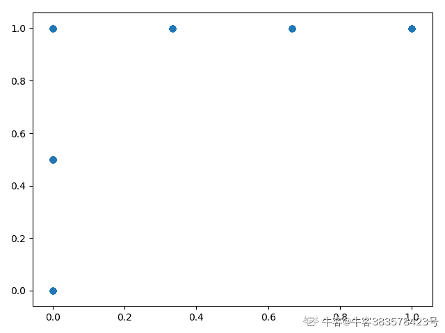
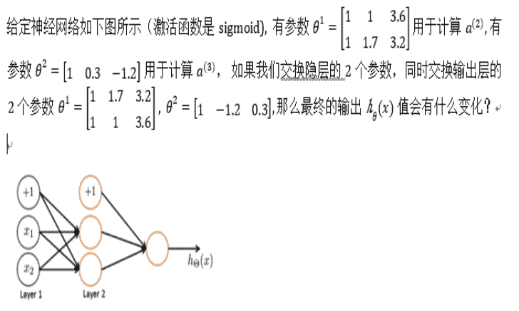

# 小红书 2020 校招算法笔试题卷一

## 1

一个高度为 100 的二叉树最小元素数目是（）

正确答案: B   你的答案: 空 (错误)

```cpp
201
```

```cpp
100
```

```cpp
199
```

```cpp
200
```

本题知识点

算法工程师 小红书 2020

讨论

[旧城俨然回眸笑](https://www.nowcoder.com/profile/6223383)

深度为 k 的二叉树，最多有 2^k-1 个节点，最少有 k 个节点。

发表于 2020-06-15 20:02:30

* * *

[Maple_2005](https://www.nowcoder.com/profile/203246634)

每层最少一个子孩，100 层就有 100 个元素

发表于 2020-06-13 11:57:27

* * *

## 2

快速排序的空间复杂度是多少？（）

正确答案: B   你的答案: 空 (错误)

```cpp
 O(N)
```

```cpp
O(logN)
```

```cpp
O(NlogN)
```

```cpp
O(1)
```

本题知识点

算法工程师 小红书 2020

讨论

[放弃幻想，准备战斗](https://www.nowcoder.com/profile/6544134)

基于循环的应该是 O(1)，基于递归的在没有辅助数组的前提下，并且平均意义下，是 O(logn)

发表于 2020-06-02 08:09:07

* * *

[Xycdada](https://www.nowcoder.com/profile/6156428)

空间复杂度，下意识时间复杂度。。。

发表于 2020-11-13 21:29:47

* * *

[Sci-Hub](https://www.nowcoder.com/profile/4641369)

注意审题:空间复杂度

发表于 2020-10-16 17:26:55

* * *

## 3

进栈顺序是 ADEFGC, 出栈顺序不可能是?（）

正确答案: C   你的答案: 空 (错误)

```cpp
 ADEFGC
```

```cpp
CGFEDA
```

```cpp
ADCEFG
```

```cpp
AEDFCG
```

本题知识点

算法工程师 小红书 2020

讨论

[旧城俨然回眸笑](https://www.nowcoder.com/profile/6223383)

C 出栈即代表整个序列都已入栈，因此出列顺序不可能为 EF

发表于 2020-06-15 20:03:50

* * *

[Cara123](https://www.nowcoder.com/profile/505323583)

栈之根本——后进先出（Last In First Out , LIFO）。  其实是这个问题描述有歧义，应该是分段入栈的顺序，也就是说，可能先入栈 a，再取出 a，入栈 b，再取出 b……，所以 D 也是可能的，也就是说，并不是等所有元素都入栈了，才开始出栈。

发表于 2021-08-20 22:23:19

* * *

## 4

设循环队列中数组的下标范围是 1～n，其头尾指针分别为 f 和 r，则其元素个数为（）

正确答案: D   你的答案: 空 (错误)

```cpp
r-f 
```

```cpp
r-f+1 
```

```cpp
 (r-f) mod n+1 
```

```cpp
(r-f+n) mod n
```

本题知识点

算法工程师 小红书 2020

讨论

[牛客 534615564 号](https://www.nowcoder.com/profile/534615564)

因为是循环队列 排除法，f 不一定比 r 小，所以 ABC 都是不一定正确。

发表于 2020-06-29 18:04:55

* * *

[橙子可以吃](https://www.nowcoder.com/profile/193380320)

1,f<r: r-f
2,f>r: (r+n)-f

两种情况以模运算表示就是 (r+n-f) MOD n

发表于 2020-10-04 11:21:42

* * *

## 5

已知数据集，有 label (0, 1) ,  当对该数据训练回归模型时，正样本全部选用， 负样本随机抽取 10%， 经过训练得到模型 F， 当 F 对某样本 X 预估 p (label = 1)  = 0.2 时，求如果不进行负样本抽样 p (label = 1)   约为多少？（）

正确答案: A   你的答案: 空 (错误)

```cpp
0.024
```

```cpp
0.026
```

```cpp
0.018
```

```cpp
0.02
```

本题知识点

算法工程师 小红书 2020

讨论

[Maple_2005](https://www.nowcoder.com/profile/203246634)

抽样情况下，p (label = 1)  = 0.2，则 p (label = 0)  = 0.8；假设抽样后正负类个数为 100，因此正类个数为 20，负类个数为 80 个，因此不抽样的时候负类个数为 800，则有,p (label = 1) = 20/（800+20）= 0.243 发表于 2020-06-13 12:02:42

* * *

[旧城俨然回眸笑](https://www.nowcoder.com/profile/6223383)

 p (label = 1)  = 0.2 即正样本 20(100%), 负样本 80(10%)，因此·正样本总数为 20， 负样本为 800， 20/820=0.024

发表于 2020-06-15 20:05:17

* * *

[牛客 299647780 号](https://www.nowcoder.com/profile/299647780)

如何解？

发表于 2020-06-02 17:59:06

* * *

## 6

有样本 (A, B, C, D, E) , 模型 A 预估值为 (0.2, 0.4, 0.7, 0.3, 0.5) , 模型 B 预估值为 (0.1, 0.3, 0.9, 0.2, 0.5) ， Y = (0, 0, 1 ,0 ,1), 请问模型 A 和 模型 B 评估指标 AUC 哪个更高 ?（）

正确答案: C   你的答案: 空 (错误)

```cpp
 A   
```

```cpp
 B.
```

```cpp
一样
```

本题知识点

算法工程师 小红书 2020

讨论

[橙子可以吃](https://www.nowcoder.com/profile/193380320)

计算 AUC 有两种方法：假设真实结果中正样本数为 M，负样本数为 N 例如，本题中 M=2,N=3,模型 A 对五个样本（假设为 a,b,c,d,f）的预测结果为(0.2, 0.4, 0.7, 0.3, 0.5) 法一：不排序，3 个正样本和 2 个负样本可以组成 3*2=6 种组合，分别为(a,c),(a,f),(b,c),(b,f),(d,c),(d,f)，对于 A，所有组合中预测的正样本概率>负样本概率的情况有全部六种情况，则 AUC=（1+1+1+1+1+1）/ 6 = 6/6 = 1 若预测的正负样本的概率值相等，则在分子中加上 0.5 法二：排序，按照预测的结果 P 将所有样本进行排序，对于 A，排序后的结果为

| ID | Pro | Label | rank |
| a | 0.2 | 0 | 1 |
| d | 0.3 | 0 | 2 |
| b | 0.4 | 0 | 3 |
| f | 0.5 | 1 | 4 |
| c | 0.7 | 1 | 5 |

套用计算公式，AUC = (正样本 rank 值加和-M*(M+1)/2) / M*N = (4+5-3) / 6 = 1
  B 的 AUC 计算公式遇上一样

编辑于 2020-10-04 11:43:35

* * *

[旧城俨然回眸笑](https://www.nowcoder.com/profile/6223383)

模型 A （00101） 模型 B（00101） 因此 AUC 一样大

发表于 2020-06-15 20:05:58

* * *

[牛客 383578423 号](https://www.nowcoder.com/profile/383578423)

两组数据的 ROC 画出来都是一样的，因此 AUC 相同，有什么快速判断的方法吗？

发表于 2020-08-15 17:42:44

* * *

## 7

有数据集 正样本 100 个， 负样本 100 个， 模型 F 对样本进行预估 预测为正样本的有 80 个 （其中真的是正样本的是 60 个）， 请问该模型的召回率是多少？（）

正确答案: A   你的答案: 空 (错误)

```cpp
60%
```

```cpp
75%
```

```cpp
70%
```

```cpp
50%
```

本题知识点

算法工程师 小红书 2020

讨论

[还是搞开发吧](https://www.nowcoder.com/profile/7719222)

准确率：所有预测正确的样本/总样本召回率：将正类预测为正类/所有真正的正类=60/100=60%

发表于 2020-06-01 21:19:56

* * *

[旧城俨然回眸笑](https://www.nowcoder.com/profile/6223383)

recall = TP/(TP+FN)  = 真正例/（真正例+假范例）

发表于 2020-06-15 20:07:22

* * *

## 8

小红书一天有约 1000000000 个笔记曝光，如果让您设计模型数据，约 10%的点击率， 您将如何拆分训练/dev/测试集？（）

正确答案: A   你的答案: 空 (错误)

```cpp
60% train . 20% dev . 20% test
```

```cpp
98% train . 1% dev . 1% test
```

```cpp
33% train . 33% dev . 33% test
```

本题知识点

算法工程师 小红书 2020

讨论

[最爱数学的人](https://www.nowcoder.com/profile/434879280)

这个样本数那么多 为什么不是 9811

发表于 2020-09-05 20:40:02

* * *

## 9



正确答案: D   你的答案: 空 (错误)

```cpp
变大 
```

```cpp
变小 
```

```cpp
可能变大也可能变小 
```

```cpp
不变
```

本题知识点

算法工程师 小红书 2020

讨论

[那就燃烧吧](https://www.nowcoder.com/profile/622900083)

Permutation invariance.每次传播都会累加，利用组合不变性所以输出不变

发表于 2020-07-05 22:35:04

* * *

## 10

你需要给小红书有一个线上服务设计一个压测工具，来模拟用户真实的请求对服务的压力，在达到目标 qps 是 100 的情况下，压测工具框架如右边的伪代码 ：  While (1) { sleep f(), async_send_request}，下面哪个 f(n) 函数更接近真实的用户请求（）

正确答案: B   你的答案: 空 (错误)

本题知识点

算法工程师 小红书 2020

讨论

[youarewhatyousay](https://www.nowcoder.com/profile/4045220)

出题人的画图，应该是想表达不同的分布
A.看起来像是对称的正态分布 B.看起来像是泊松分布（当一个随机事件，例如某电话交换台收到的呼叫、来到某公共汽车站的乘客、某放射性物质发射出的粒子、显微镜下某区域中的白血球等等，以固定的平均瞬时速率*λ*（或称密度）随机且独立地出现时，那么这个事件在单位时间（面积或体积）内出现的次数或个数就近似地服从泊松分布*P*(*λ*)。）所以用户真实的请求对服务的压力应该更接近泊松分布。

发表于 2020-09-07 18:33:10

* * *

[牛客 328052156 号](https://www.nowcoder.com/profile/328052156)

这是在找不同么

发表于 2022-03-13 18:49:58

* * *

[最爱数学的人](https://www.nowcoder.com/profile/434879280)

A 和 B 究竟啥区别

发表于 2020-09-05 20:48:11

* * *

## 11

关于 logistic 以下哪些观点是对的？（）

正确答案: A   你的答案: 空 (错误)

```cpp
如果你使用一个阈值，logistic 总能很好的完成分类问题
```

```cpp
对于 logistic regression 而言，我们有时会落入局部最优，这时候我们可以用一些算法如(BFGS ..) 来优化这个问题
```

本题知识点

算法工程师 小红书 2020

讨论

[牛客 874848655 号](https://www.nowcoder.com/profile/874848655)

个人理解：逻辑回归的损失函数之所以没有使用最小二乘法而是最大似然估计，就是因为使用最小二乘法估计的损失函数不是凸函数，会存在局部最优解，而使用最大似然估计可以转变成凸优化问题，凸函数不存在局部解，只有一个全局最优解。

发表于 2020-09-05 23:43:18

* * *

## 12

以下哪些算法属于无监督学习的范畴？

正确答案: B   你的答案: 空 (错误)

```cpp
KNN.
```

```cpp
 K-Means 
```

```cpp
GBDT 
```

```cpp
XGBoost
```

本题知识点

算法工程师 小红书 2020

讨论

[Maple_2005](https://www.nowcoder.com/profile/203246634)

k 均值聚类是无监督学习

编辑于 2020-06-02 02:16:34

* * *

## 13

下面哪些小红书场景适合用 k-means， 你拥有大量的用户访问记录数据?（）

正确答案: A   你的答案: 空 (错误)

```cpp
希望把用户自动分组
```

```cpp
希望预测用户第二天会不会再访问
```

```cpp
希望预测下个月福利社的销量
```

本题知识点

算法工程师 小红书 2020

讨论

[Maple_2005](https://www.nowcoder.com/profile/203246634)

K-means 用于分类，BC 用于预测回归

发表于 2020-06-13 12:13:08

* * *

## 14

关于 BFS DFS 正确的是？（）

正确答案: C   你的答案: 空 (错误)

```cpp
BFS 比 DFS 快
```

```cpp
对于一棵树 BFS 访问到叶子结点速度一定比 DFS 快
```

```cpp
对于图、数的存储结构，BFS、DFS 都可以遍历全部节点
```

本题知识点

算法工程师 小红书 2020

讨论

[牛客 641057618 号](https://www.nowcoder.com/profile/641057618)

bfs 广度优先搜索 dbs 深度优先搜索

发表于 2020-10-30 11:10:41

* * *

## 15

下列关于 mini-batch 的观点您同意哪些呢？（）

正确答案: B D   你的答案: 空 (错误)

```cpp
 Mini- batch 的梯度下降 单次 epoch 速度比批梯度下降快
```

```cpp
Mini- batch 的梯度下降 单次 iteration 速度比批梯度下降快
```

```cpp
 Mini- batch 比随机梯度下降噪声更大
```

```cpp
 Mini- batch 比随机梯度下降噪声更小
```

本题知识点

算法工程师 小红书 2020

讨论

[Cara123](https://www.nowcoder.com/profile/505323583)

参考：[`zhuanlan.zhihu.com/p/72929546`](https://zhuanlan.zhihu.com/p/72929546)

发表于 2021-08-20 22:54:00

* * *

[楼非楼](https://www.nowcoder.com/profile/145096710)

iteration：1 个 iteration 等于使用 batchsize 个样本训练一次；
epoch：1 个 epoch 等于使用训练集中的全部样本训练一次批梯度是一次性训练所有样本

发表于 2020-08-31 14:30:57

* * *

## 16

下面哪些场景合适使用 pca ？（）

正确答案: A   你的答案: 空 (错误)

```cpp
降低数据的维度，节约内存和存储空间
```

```cpp
降低数据维度，并作为其它有监督学习的输入
```

```cpp
 获得更多的特征
```

```cpp
替代线性回归
```

本题知识点

算法工程师 小红书 2020

讨论

[星★缘](https://www.nowcoder.com/profile/3815559)

同问，为什么不能作为其他有监督学习的输入？

发表于 2020-06-18 10:20:33

* * *

[橙子可以吃](https://www.nowcoder.com/profile/193380320)

PCA 是无监督学习降维的方法，如果是有监督学习可以使用 LDA。PCA 保留最佳描述特征（即主成分），而非分类特征，LDA 用到了类别标签，为了找到数据中具有判别性的维度，投影后不同类别尽可能区分开。

发表于 2020-10-04 12:06:46

* * *

[不可以做咸鱼了](https://www.nowcoder.com/profile/729950026)

主成分回归：？？？

发表于 2020-08-28 21:16:11

* * *

## 17

关于数组的说法正确的是？（）

正确答案: A D   你的答案: 空 (错误)

```cpp
插入元素需要移动
```

```cpp
删除不需要移动
```

```cpp
 可以顺序存储也可以链式存储
```

```cpp
可以随机访问任何节点
```

本题知识点

算法工程师 小红书 2020

讨论

[牛客 534615564 号](https://www.nowcoder.com/profile/534615564)

B 删除元素必须要移动数组剩余元素 C 数组结构在内存中是一块连续的内存快，所以只能是顺序结构 A 插入元素 必须要移动数组元素 D 正因为是连续的内存地址 所以可以根据下标进行随机访问

发表于 2020-06-29 18:11:26

* * *

[橙子可以吃](https://www.nowcoder.com/profile/193380320)

数组的存储是连续的，所以当插入或删除都需要对受影响的元素进行移动

发表于 2020-10-04 14:44:11

* * *

## 18

有数据集 A， 其中特征波动范围较大，以下哪些算法可能比较合适？（）

正确答案: A B   你的答案: 空 (错误)

```cpp
决策树
```

```cpp
gbdt
```

```cpp
DNN
```

```cpp
SVM
```

本题知识点

算法工程师 小红书 2020

讨论

[tomding](https://www.nowcoder.com/profile/745796558)

概率模型不需要归一化，因为它们不关心变量的值，而是关心变量的分布和变量之间的条件概率，如决策树、rf。
而像 adaboost、svm、lr、KNN、KMeans 之类的最优化问题就需要归一化

发表于 2020-11-17 16:51:12

* * *

## 19

薯队长带着小红薯参加密室逃脱团建游戏，首先遇到了反转游戏，小红薯们根据游戏提示收集了多个单词线索，并将单词按要求加一个空格组 成了句子，最终要求把句子按单词反转解密。 说明：收集的时候单词前后可能会有多个空格，反转后单词不能有多个空格，具体见输入输出样例。

本题知识点

前端工程师 小红书 2020 C++工程师 测试开发工程师 Java 工程师 安卓工程师 iOS 工程师 算法工程师

讨论

[Janesummer1175](https://www.nowcoder.com/profile/6046109)

function reverseStr (str) {
    var s = str.match(/[^\s]+/g)
    s = s.reverse()
    return s.join(' ')
}

发表于 2020-06-12 13:46:09

* * *

[我不想当大白菜](https://www.nowcoder.com/profile/2462790)

```cpp
words = input().split()[::-1]
print(" ".join(words))
```

发表于 2020-07-04 12:19:05

* * *

[青椒牛客](https://www.nowcoder.com/profile/854162394)

```cpp
#include <iostream>
#include <string>

using namespace std;

int main(){
    string str;
    getline(cin,str);
    string ans="";
    int n=str.size();
    int i=n-1,j=n-1;
    while(j>=0){
        if(str[j] != ' '){
            for(i=j;i>=0;i--){
                if(str[i] == ' ')
                    break;
            }
            ans+=str.substr(i+1,j-i);
            ans+=" ";
            j=i;
        }
        j--;
    }
    ans.erase(ans.end()-1);
    cout<<ans<<endl;
    return 0;
}

```

编辑于 2020-09-15 11:24:02

* * *

## 20

 薯队长写了 n 篇笔记，编号从 1~n,每篇笔记都获得了不少点赞数。    薯队长想从中选出一些笔记，作一个精选集合。挑选的时候有两个规则： 1.不能出现连续编号的笔记。 2.总点赞总数最多 如果满足 1，2 条件有多种方案，挑选笔记总数最少的那种

本题知识点

前端工程师 小红书 2020 C++工程师 测试开发工程师 Java 工程师 安卓工程师 iOS 工程师 算法工程师

讨论

[✭](https://www.nowcoder.com/profile/296604434)

类似打家劫舍的问题。利用动态规划 dp[i] = x 表示从 i 开始选笔记，最大点赞数为 x。dpNum[i]表示此时选取的次数动态转移方程为 dp[i] = max(dp[i+1], dp[i+2]+nums[i])由于本题还需要求次数，所以再构造一个 dpNum 数组，用来存储得到 dp[i]时，选取的笔记次数。状态方程与 dp 数组类似，当选取了 nums[i]，则 dpNum[i] = dpNum[i+2]+1,否则在不选取的情况下，dpNum[i]=dpNum[i+1]从后往前迭代求解，所以数组需初始化大小为 n+2,初值均为 0(方便求解 dp[n-1])

```cpp
import sys
n = eval(input())
nums = [int(i) for i in sys.stdin.readline().split()]
dp = [0 for _ in range(n+2)]
dpNum = [0 for _ in range(n+2)]
num = 0
for i in range(n-1, -1, -1):
    if dp[i+1] < dp[i+2]+nums[i]:
        dp[i] = dp[i+2]+nums[i]
        dpNum[i] = dpNum[i+2]+1
    else:
        dp[i] = dp[i+1]
        dpNum[i] = dpNum[i+1]
print(dp[0], dpNum[0])
```

编辑于 2020-06-26 11:49:10

* * *

[广州市民林先生](https://www.nowcoder.com/profile/241061362)

**思路：要在一个连续的数组里面选 k 个数，使得这 k 个数的点赞最多，并且还不能选编号连续的数（比如选了 nums[i]，就不能选 nums[i + 1]，只能选 nums[i + 2]........），那也就是说：要得到最大的点赞量，要看你前面是怎么选的，那既然后面的结果受前面的选择所影响，很容易联想到动态规划，因为通俗地讲，动态规划就是一个递推式，由前面推到后面，我们需要推到第 n 个数，从第 1 个数开始推。这样，我们定义 dp(n + 1)，dp[i]就表示选到第 i 个数的时候，能获得的最大点赞数。最终的 dp[n]就该是需要输出的最大点赞数。****那接下来就是怎么推的问题了。首先，遇到一个数 nums[i]，我有两种选择：选这个数，那么意味着我前面的 nums[i - 1]不能选，只能选 nums[i - 2]；不选这个数呢？那么意味着我可以选 nums[i - 1]，由于我要取最大点赞数，所以取它们俩的大者 赋值到 dp[i]即可，以此类推到 n。****至此，基本思路讲解完毕，现在还有一个问题，我们需要统计选了几个数。这个比较简单，选一个就+1,嘛，所以 count[i] = count[i - 2] + 1; 或者 count[i] = count[i - 1]，这时候应该可以理解这两句话的含义了吧，就是选与不选 nums[i]的问题了。下面看代码：**

```cpp
#include <iostream>
#include <vector>
using namespace std;

// dp[i]: 从第一篇笔记开始选到第 i 篇, 所能得到的最大点赞数。
// count[i]: 此时选取的笔记数量
int main(){
    int n, val;
    cin >> n;
    vector<int> vec(n + 1, 0);
    for(int i = 1; i <= n; ++i){
        cin >> val;
        vec[i] = val;
    }
    vector<int> dp(n + 1, 0);  
    vector<int> count(n + 1, 0);
    dp[1] = vec[1];  //选第一篇笔记, 最大点赞数自然就是 vec[1]
    count[1] = 1;    //选了一个数
    for(int i = 2; i <= n; ++i){
        //选了 dp[i - 2], 就不能选 dp[i - 1], 但可以选 veci
        if(dp[i - 1] < dp[i - 2] + vec[i]){
            dp[i] = dp[i - 2] + vec[i];
            count[i] = count[i - 2] + 1;
        } else{
            //不选 dp[i - 2]和 vec[i]
            dp[i] = dp[i - 1];
            count[i] = count[i - 1];
        }
    }
    cout << dp[n] << ' ' << count[n] << endl;
    return 0;
}
```

最后，leetcode 337 题 打家劫舍 III，思路类似，只不过从数组变成二叉树，感兴趣的可以试试。https://leetcode-cn.com/problems/house-robber-iii/

编辑于 2020-11-29 13:02:46

* * *

[融 360 内推](https://www.nowcoder.com/profile/598880162)

参考了大佬们的解法。

```cpp
def getMaxStar(n,nums):
    dp = [0 for _ in range(n+1)]
    dp2 = [0 for _ in range(n+1)]
    dp[1] = nums[0]
    dp2[1] = 1
    for i in range(2,n+1):
        if dp[i-1] < dp[i-2]+nums[i-1]:
            dp[i] = dp[i-2]+nums[i-1]
            dp2[i] = dp2[i-2]+1
        else:
            dp[i] = dp[i-1]
            dp2[i] = dp2[i-1]
    print(dp[-1], dp2[-1])

n = eval(input())
nums = [int(i) for i in input().split()]
getMaxStar(n, nums)

```

 编辑于 2020-07-21 18:22:00

* * *

## 21

薯队长来到了迷宫的尽头，面前出现了 N 只魔物，Hi 表示第 i 只魔物的血量，薯队长需要在 T 个回合内击败所有魔物才能获胜。每个回合薯队长可 以选择物理攻击一只魔物，对其造成 1 点伤害（物理攻击次数无上限）;        或者消耗 1 点法力释放必杀技对其造成固定 X 点伤害（薯队长开始拥有 M 点法力）。问 X 至少多大，薯队长才有机会获胜；如果无论如何都无法在 T 回合内获胜，则输出-1 

本题知识点

前端工程师 小红书 2020 C++工程师 测试开发工程师 Java 工程师 安卓工程师 iOS 工程师 算法工程师

讨论

[我不想当大白菜](https://www.nowcoder.com/profile/2462790)

考察点：二分搜索、贪心
参考了@Cyan1956 大佬的代码，python 实现

*   思路：沿着`[0,max_hp]`的范围搜索最合适的伤害值，注意对一些特殊情形的处理。
*   使用函数`check_valid`判断当前技能伤害能否过关
    *   首先是根据法力值的大小先对整体的怪物进行伤害，**只求打满最大的伤害而不去补刀**
    *   之后根据剩余的血量重排序，此时：
        *   如果没有了法力值，则只需要判断血量和是不是大约剩余轮数。
        *   如果剩余法力值，则根据重排序的结果，**优先清掉血量高的怪物**，之后再判断剩余的轮数够不够清掉所有的怪物。

```cpp
def check_valid(num, turn, magic, hps, damage):
    # 使用技能造成伤害但不补刀，最后剩下法力值的时候在进行补刀
    i = 0
    for i in range(num):
        # 释放技能的次数为整除的次数或者是魔力值的次数，取小的那个

        spell_time = min(hps[i] // damage, magic)
        hps[i] -= spell_time * damage
        turn -= spell_time
        magic -= spell_time
        if magic == 0: break
    # 去除刚好整除的值

    hps = sorted(hps)
    i = 0
    if hps[-1] == 0:return True
    while hps[i] == 0:
        i += 1
    hps = hps[i:]
    # 普攻或者技能能够清掉

    if sum(hps) <= turn : return True
    if len(hps) <= magic:
        return True

    # 还剩余法力值，此时怪物的血量必定都小于技能伤害，按血量从高到低使用技能

    else:
        last = len(hps) - 1
        while magic > 0:
            last -= 1
            magic -= 1
            turn -= 1
        # 无法力值，判断能否用普攻清完

        hps = hps[:last+1]
        return turn >= sum(hps)

def main():
    num, turn, magic = list(map(int, input().split()))
    hps = list(map(int, input().split()))

    #回合不够必定输

    if len(hps) > turn: return -1

    # 法力值为零且血量和大于回合数 必定输
    if magic == 0 and sum(hps) > turn: return -1

    left, right = 0, int(max(hps))
    while left < right:
        mid = (left + right) // 2
        # 注意 python 浅拷贝的坑

        if check_valid(num, turn, magic, hps.copy(), damage=mid):
            right = mid
        else:
            left = mid+1
    # 如果 left = max(hps)，同样是不存在伤害值满足条件，left 一直右移直到越界

    return left if left < max(hps) else -1

print(main())
```

发表于 2020-07-06 22:33:53

* * *

[Cyan1956](https://www.nowcoder.com/profile/487142704)

[[编程题]击败魔物 小红书 二分查找](https://blog.csdn.net/Cyan1956/article/details/106746409)

我们把问题分解成两个子问题：

1.已知 必杀技伤害 X 验证能否获胜
2.二分查找能够获胜的最小伤害 X

考虑二分查找的上下边界：

*   平 A 即可取胜，此时为 X 的下界 0
*   技能秒杀任意怪，此时为 X 的上界为怪物的最大血量，伤害更高没有意义

```cpp
package main

import (
    "fmt"
    "sort"
)

//求和
func sum(arr []int) (ans int) {
    for _,v:=range arr{
        ans+=v
    }
    return
}

//求较小值
func min(i,j int) int {
    if i<j{
        return i
    }else{
        return j
    }
}

//验证能否获胜
func f(ohs []int,n,t,m,x int) bool {
    hs:=make([]int, len(ohs))
    copy(hs,ohs)
    for i,v:=range hs{
         d:=min(v/x,m)
         hs[i]-=d*x
         m-=d
         t-=d
         if m==0{
            break
         }
    }
    sort.Ints(hs)
    i:=0
    for ;hs[i]==0;i++{}
    hs=hs[i:]
    if len(hs)==0{
        return true
    }
    n= len(hs)
    if n<=m{
        return true
    }else{
        hs=hs[:n-m]
        t-=m
        return t>=sum(hs)
    }
}

func main() {
    var n,t,m,h int

     //回合数小于怪物数，必失败
    if t<n{
        fmt.Println(-1)
        return
    }

     //法力值大于回合数时多的也没用
    if m>t{
        m=t
    }

     //获取怪物血量
    var hs []int
    fmt.Scan(&n,&t,&m)
    for i:=0;i<n;i++{
        fmt.Scan(&h)
        hs = append(hs, h)
    }

     //平 A 取胜
    if t>sum(hs){
        fmt.Println(0)
        return
    }

    sort.Ints(hs)

    //二分查找
    l,r:=0,hs[len(hs)-1]
    if !f(hs,n,t,m,r){
        fmt.Println(-1)
        return
    }
    for l<r-1{
        mid:=(l+r)/2
        if f(hs,n,t,m,mid){
            r=mid
        }else{
            l=mid
        }
    }
    fmt.Println(r)
}
```

发表于 2020-06-14 15:29:52

* * *

[UPMagic](https://www.nowcoder.com/profile/4079837)

java100%case 通过代码如下：

```cpp
import java.util.*;
public class Main{
    public static void main(String[] args){
        Scanner in = new Scanner(System.in);
        int n = in.nextInt();
        int t = in.nextInt();
        int m = in.nextInt();
        Integer[] h = new Integer[n];
        int maxH=0,totalH=0;
        //获取怪物血量输入，顺便找出最大怪物血量，顺便计算怪物总血量。
        for (int i=0;i<h.length;i++){
            int s = in.nextInt();
            h[i] = s;
            maxH=Math.max(maxH,s);
            totalH+=s;
        }
        //如果怪物总血量小于回合数，说明平 A 就能解决所有怪物，所以必杀技伤害为最低 0
        if(totalH<=t){
            System.out.println(0);
            return;
        }
        //把怪物的血量从大到小排序
        Arrays.sort(h,Collections.reverseOrder());
        /*从 2 到最大怪兽血量 maxH，进行升序循环判断，找到第一个伤害就是，最低必杀技伤害
        Q:为什么从 2 开始？A:因为普工伤害为 1，必杀技小于等于普工伤害时，都使用普工解决就可以
        */
        for (int i=2;i<=maxH;i++){
            //判断该必杀技伤害是否能够通关
            if(dfs(h,t,m,i,totalH)){
                System.out.println(i);
                return;
            }
        }
        System.out.println(-1);
    }
    public static boolean dfs(Integer[] h,int t,int m,int x,int totalH){
        //判断回合数是否大于蓝量
        if(t>m){
            //看所有蓝量用完后再在回合内使用普工时，所能造成的总血量是否大于怪物总血量，如果不行，则无法通关
            if(t-m+m*x>=totalH){
                /**
                怪物血量大于必杀技伤害的，每一个都使用必杀技，确保必杀技伤害不溢出。
                **/
                Integer[] ht = Arrays.copyOf(h,h.length);
                int j=0;
                for(int i=0;i<h.length&&m>0&&h[i]>=x;i++){
                    int st = h[i]/x;
                    int sx = h[i]%x;
                    if(st<=m){
                        ht[i] = sx;
                        totalH -= st*x;
                        m-=st;
                        t-=st;
                    }else{
                        ht[i] -= m*x;
                        totalH -= m*x;
                        m=0;
                        t-=m;
                    }
                }
                //如果必杀技使用完毕，则只能进行平砍，判断怪物总剩余血量是否小于等于剩余回合数就行
                if(m==0){
                    return totalH<=t-m;
                }else {
                    //如果必杀技未使用完毕，则直接对剩余血量最多的怪再次使用必杀技，确保必杀技利益最大化。
                    //怪物剩余血量再排序
                    Arrays.sort(ht, Collections.reverseOrder());
                    //由于 java 最后 10%的案例超时，所以判断了一下剩余蓝量是否大于怪物数量的一半
                    if(m>ht.length/2){
                        //如果超过一半，则只需计算另外一半未死的怪物血量就是剩余怪物总血量
                        totalH = 0;
                        for (int i = m; i < ht.length; i++) {
                            totalH += ht[i];
                        }
                    }else {
                        //如果没有超过一半，则每一只怪死掉后，总血量减去该怪物的剩余血量就行
                        for (int i = 0; i < m; i++) {
                            totalH -= ht[i];
                        }
                    }
                    //通过以上步骤算出怪物剩余总血量，如果小于使用全部技能后的回合数，就能平 A 通关了，如果不行则不能进行通关操作
                    return totalH <= t - m;
                }
            }else{
                return false;
            }
        }else{
            //如果回合数小于等于蓝量，则全程使用必杀技，看是否通关。
            //直接回合数*必杀技看是否大于怪物总血量
            return t*x>=totalH;
        }
    }
}

```

发表于 2020-08-21 17:37:16

* * *