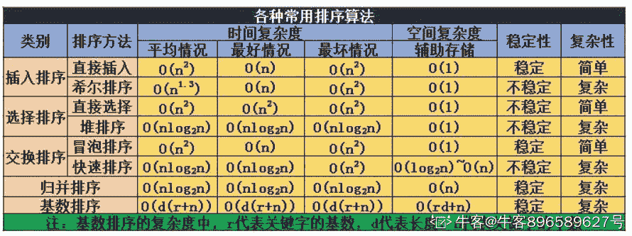
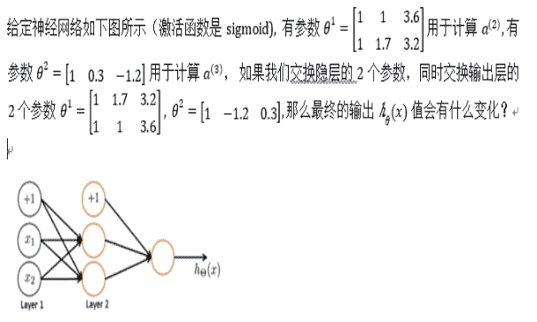
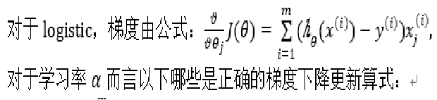
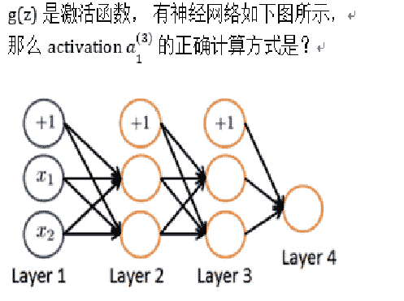

# 小红书 2020 校招算法笔试题卷二

## 1

一个高度为 200 的二叉树最小元素数目是（）

正确答案: B   你的答案: 空 (错误)

```cpp
401
```

```cpp
200
```

```cpp
199
```

```cpp
400
```

本题知识点

算法工程师 小红书 2020

讨论

[7322600](https://www.nowcoder.com/profile/7322600)

是因为根节点不能是 0？

发表于 2020-07-05 20:30:14

* * *

[很诡异](https://www.nowcoder.com/profile/151734118)

啊啊啊

发表于 2020-06-09 09:28:55

* * *

## 2

归并排序的空间复杂度是多少？（）

正确答案: A   你的答案: 空 (错误)

```cpp
O(N)
```

```cpp
O(NlogN)
```

```cpp
O(N²)
```

```cpp
 O(1)
```

本题知识点

算法工程师 小红书 2020

讨论

[牛客 896589627 号](https://www.nowcoder.com/profile/896589627)



发表于 2020-12-19 16:03:00

* * *

[20200722](https://www.nowcoder.com/profile/433084385)

**归并排序**（Merge Sort）是建立在[归并](https://baike.baidu.com/item/%E5%BD%92%E5%B9%B6/253741)操作上的一种有效，稳定的排序算法，该算法是采用[分治法](https://baike.baidu.com/item/%E5%88%86%E6%B2%BB%E6%B3%95/2407337)（Divide and Conquer）的一个非常典型的应用。将已有序的子[序列](https://baike.baidu.com/item/%E5%BA%8F%E5%88%97/1302588)合并，得到完全有序的序列；即先使每个子序列有序，再使子序列段间有序。若将两个有序表合并成一个有序表，称为二路归并。

发表于 2020-07-25 07:50:57

* * *

[最爱数学的人](https://www.nowcoder.com/profile/434879280)

看成时间复杂度...

发表于 2020-09-05 21:07:38

* * *

## 3

直接插入排序算法的时间复杂度为（）

正确答案: C   你的答案: 空 (错误)

```cpp
O(N)
```

```cpp
O(NlogN)
```

```cpp
O(N²)
```

```cpp
O(1)
```

本题知识点

算法工程师 小红书 2020

讨论

[20200722](https://www.nowcoder.com/profile/433084385)

插入排序首先需要从无序序列中取出一个值，然后在有序序列中查找该值插入的位置，在将后面的元素后移一位，所以复杂度是 O(n²);

发表于 2020-07-25 07:55:24

* * *

[牛客 896589627 号](https://www.nowcoder.com/profile/896589627)


发表于 2020-12-19 16:03:40

* * *

[多学点儿吧](https://www.nowcoder.com/profile/104793770)

1<log2n<n<nlog2n<n*n<n*n*n<2^n<n！ 时间复杂度的表

发表于 2020-07-05 10:57:32

* * *

## 4

进栈顺序是 ADEFGC, 出栈顺序不可能是?（）

正确答案: C   你的答案: 空 (错误)

```cpp
ADFEGC
```

```cpp
CGFEDA
```

```cpp
ADCEFG
```

```cpp
AEDFCG
```

本题知识点

算法工程师 小红书 2020

## 5

已知数据集，有 label (0, 1) ,  当对该数据训练回归模型时，正样本全部选用， 负样本随机抽取 10%， 经过训练得到模型 F， 当 F 对某样本 X 预估 p (label = 1)  = 0.4 时，求如果不进行负样本抽样 p (label = 1)   约为多少？（）

正确答案: A   你的答案: 空 (错误)

```cpp
0.062
```

```cpp
0.058
```

```cpp
0.068
```

```cpp
0.04
```

本题知识点

算法工程师 小红书 2020

讨论

[MIN 大小姐](https://www.nowcoder.com/profile/897984594)

在 CTR 预估中，负样本采样是一种常见的特征工程的办法。一般 CTR 预估的原始正负样本比可能达到 1:1000——1:10000 左右，为了获得更好的效果，一般需要采样到 1:5——1:15 之间。

假设采样前的 CTR 是 P，采样后的 CTR 是 P'，正样本数是 a，负样本数是 b，正样本的采样概率是 m，负样本的采样概率使 n，另 t = n/m。


化简后得到：


本题中 m=1,n=0.4 带入即可

发表于 2020-06-12 15:57:31

* * *

[zxbzsb](https://www.nowcoder.com/profile/703541613)

求解析。

发表于 2020-06-03 23:00:54

* * *

## 6

有样本 (A, B, C, D, E) , 模型 A 预估值为 (0.8, 0.4, 0.7, 0.3, 0.5) , 模型 B 预估值为 (0.1, 0.3, 0.9, 0.3, 0.5) ， Y = (0, 0, 1 ,1 ,1), 请问模型 A 和 模型 B 评估指标 AUC 哪个更高 ?（）

正确答案: B   你的答案: 空 (错误)

```cpp
 A    
```

```cpp
B. 
```

```cpp
一样
```

本题知识点

算法工程师 小红书 2020

讨论

[MIN 大小姐](https://www.nowcoder.com/profile/897984594)

计算 AUC 有两种方法：假设真实结果中正样本数为 M，负样本数为 N 例如，本题中 M=3,N=2,模型 A 对五个样本（假设为 a,b,c,d,f）的预测结果为 (0.8, 0.4, 0.7, 0.3, 0.5) 法一：不排序，3 个正样本和 2 个负样本可以组成 3*2=6 种组合，分别为(a,c),(a,d),(a,f),(b,c),(b,d),(b,f)，对于 A，所有组合中预测的正样本概率>负样本概率的情况有两种(b,c)和(b,f)，则 AUC=（0+0+0+1+0+1）/ 6 = 2/6 = 1/3 若预测的正负样本的概率值相等，则在分子中加上 0.5 法二：排序，按照预测的结果 P 将所有样本进行排序，对于 A，排序后的结果为

| ID | Pro | Label | rank |
| d | 0.3 | 1 | 1 |
| b | 0.4 | 0 | 2 |
| f | 0.5 | 1 | 3 |
| c | 0.7 | 1 | 4 |
| a | 0.8 | 0 | 5 |

套用计算公式，AUC = (正样本 rank 值加和-M*(M+1)/2) / M*N = (1+3+4-6) / 6 = 1/3
  B 的 AUC 计算公式遇上一样

发表于 2020-06-12 16:21:53

* * *

## 7

有数据集 正样本 80 个， 负样本 120 个， 模型 F 对样本进行预估 预测为正样本的有 80 个 （其中真的是正样本的是 60 个）， 请问该模型的召回率是多少？（）

正确答案: B   你的答案: 空 (错误)

```cpp
60%
```

```cpp
75%
```

```cpp
70%
```

```cpp
50%
```

本题知识点

算法工程师 小红书 2020

讨论

[向代码进击的小怪兽](https://www.nowcoder.com/profile/463075916)

召回率（recall）：预测为正例且实际为正例的样本占所有正样本的比例。精准率（precision）：预测为正例且实际为正例的样本占所有预测为正例的样本的比例。故：60/80 = 0.75

发表于 2020-08-29 21:49:34

* * *

[SpencerD](https://www.nowcoder.com/profile/608376980)

考召回率的概念，知道就简单，不知道就蒙吧

发表于 2022-01-01 11:30:20

* * *

[Romanticsummer](https://www.nowcoder.com/profile/608932324)

答案是 0.5

发表于 2020-06-28 21:18:16

* * *

## 8

我们定义，一个学习任务， 需要学习经验 E 来完成任务 T 并通过指标 P 来评估，假设我们有很多干垃圾、湿垃圾的样本图片数据，我们需要学习一个算法来进行垃圾分类，那么在这种场景下，T 是什么？（）

正确答案: C   你的答案: 空 (错误)

```cpp
预估垃圾类别的过程 
```

```cpp
都不是 
```

```cpp
分类垃圾  
```

```cpp
当前图片预估为干垃圾的概率
```

本题知识点

算法工程师 小红书 2020

## 9

 给定 4 个样本 （x, y ) in (1, 0.5) , (2, 1), (4, 2), (0, 0),  考虑到线性模型 H(x) = A + B * x, 当你使用梯度下降来估计这个模型行，你期望获得的参数是？（）

正确答案: C   你的答案: 空 (错误)

```cpp
A=1 B=0.5
```

```cpp
 A=1 B= -0.5
```

```cpp
A=0 B=0.5
```

```cpp
 A=0 B =1
```

本题知识点

算法工程师 小红书 2020

讨论

[敌不动我不动](https://www.nowcoder.com/profile/9447968)

简单的方法就是把答案直接带进去，有不符合的就不对了

发表于 2020-09-30 08:54:17

* * *

[向代码进击的小怪兽](https://www.nowcoder.com/profile/463075916)

求解析啊

发表于 2020-08-29 21:50:12

* * *

## 10



正确答案: D   你的答案: 空 (错误)

```cpp
变大 
```

```cpp
变小 
```

```cpp
可能变大也可能变小 
```

```cpp
不变
```

本题知识点

算法工程师 小红书 2020

## 11

你有一个 logistic 回归分类器，之前你设了一个阈值 >= 0.5 就是 1，<=0.5 就是 0， 这是如果你把阈值调整到了 0.9 , 下面哪些是对的？（）

正确答案: B   你的答案: 空 (错误)

```cpp
召回率不会变，准确率提高
```

```cpp
召回率降低
```

```cpp
召回率提高
```

本题知识点

算法工程师 小红书 2020

讨论

[漂亮男孩不说谎滴](https://www.nowcoder.com/profile/314656687)

recall（召回率或真阳性率 TPR）=TP/(TP+FN),其中 TP+FN 表示样本中实际为真的总数。阈值提高，预测为真的条件更严格 TP 下降，故下降

发表于 2020-08-29 12:14:32

* * *

[ZQFORWARD](https://www.nowcoder.com/profile/148018936)

Recall = TP/(TP+FN)，阈值提高 TP 减少，FN 增加，故 Recall 减小

发表于 2020-08-22 21:11:26

* * *

## 12

下面哪些情况下，协同过滤会是个不错的算法？（）

正确答案: A   你的答案: 空 (错误)

```cpp
你是小红书的算法工程师，你有不同用户喜欢不同笔记的数据，你希望找到相似的用户
```

```cpp
 你是小红书的用户，你知道自己以前的浏览记录，希望可以推荐一些新东西给自己
```

```cpp
你是小红书的作者，你知道自己每篇之前的笔记有多少点赞，想知道发一篇新笔记能够拿到多少赞
```

本题知识点

算法工程师 小红书 2020

讨论

[狂奔的菜鸡](https://www.nowcoder.com/profile/419358164)

协同过滤常常被用于分辨某类特定顾客可能感兴趣的东西，这些结论来自于对其他相似顾客对哪些产品感兴趣的分析。协同过滤以其出色的速度和健壮性，在全球互联网领域炙手可热。

发表于 2020-09-14 11:36:36

* * *

## 13

按照二叉树的定义，4 个节点的二叉树有多少种？ （）

正确答案: B   你的答案: 空 (错误)

```cpp
13
```

```cpp
14
```

```cpp
15
```

```cpp
16
```

本题知识点

算法工程师 小红书 2020

讨论

[ZQFORWARD](https://www.nowcoder.com/profile/148018936)

f(n) = (2n)! / n!(n+1)!

发表于 2020-08-22 21:13:54

* * *

[牛客 Cver](https://www.nowcoder.com/profile/1897620)

Catalan 数：1 1 2  5 14 42 132 429 1430...... 发表于 2020-09-02 11:35:09

* * *

[Mango_Lee7](https://www.nowcoder.com/profile/765876988)

共四个节点 1、每一层只有一个节点，共四层，8 种 2、第二层满节点(就是 2 个节点)，共三层，4 种 3、第二层 1 个节点且只有三层，2 种 共用 14 种

发表于 2020-06-05 01:15:55

* * *

## 14

下列排序算法中存储消耗最大的是？（）

正确答案: C   你的答案: 空 (错误)

```cpp
快速排序
```

```cpp
堆排序
```

```cpp
归并排序
```

```cpp
插入排序
```

本题知识点

算法工程师 小红书 2020

讨论

[牛客 592409894 号](https://www.nowcoder.com/profile/592409894)

快排额外空间复杂度为 O(log N)归并额外空间复杂度为 O(N)

发表于 2020-10-22 16:40:04

* * *

[楼非楼](https://www.nowcoder.com/profile/145096710)

快速排序的摹本思想是，通过一趟排序将待排序记录分割成独立的两部分，其中一部分记录的关键字均比另一部分记录的关键字小，再分别对这两部分记录继续进行排序，以达到整个序列有序；插入排序的摹本操作是指将无序序列中的各元素依次插入到已经有序的线性表中，从而得到一个新的序列：选择排序的基本思想是：扫描整个线性表，从中选出最小的元素，将它交换到表的最前面(这是它应有的位置)，然后对剩下的子表采用同样的方法，直到表空为止：归并排序是将两个或两个以上的有序表组合成一个新的有序表

发表于 2020-08-05 17:29:07

* * *

[Romanticsummer](https://www.nowcoder.com/profile/608932324)

答案是快排

发表于 2020-06-28 21:28:40

* * *

## 15

关于数组的说法正确的是？（）

正确答案: D   你的答案: 空 (错误)

```cpp
插入元素的平均时间复杂度是 o(1)
```

```cpp
删除元素的平均时间复杂度是 o(1)
```

```cpp
可以顺序存储也可以链式存储
```

```cpp
可以随机访问任何节点
```

本题知识点

算法工程师 小红书 2020

## 16

你有一个 logistic 回归分类器，之前你设了一个阈值 >= 0.5 就是 1，<=0.5 就是 0， 这是如果你把阈值调整到了 0.2 , 下面哪些是对的？（）

正确答案: C   你的答案: 空 (错误)

```cpp
召回率不会变，准确率提高
```

```cpp
召回率降低
```

```cpp
召回率提高
```

本题知识点

算法工程师 小红书 2020

讨论

[漂亮男孩不说谎滴](https://www.nowcoder.com/profile/314656687)

recall（召回率或真阳性率 TPR）=TP/(TP+FN),其中 TP+FN 表示样本中实际为真的总数。阈值降低，预测为真的条件更轻松，TP 会上升，故上升。

发表于 2020-08-29 12:30:14

* * *

## 17

已知数据集，有 label (0, 1) ,  当对该数据训练回归模型时，正样本全部选用， 负样本随机抽取 10%， 经过训练得到模型 F， 当 F 对某样本 X 预估 p (label = 1)  = 0.6 时，求如果不进行负样本抽样 p (label = 1)   约为多少？（）

正确答案: A   你的答案: 空 (错误)

```cpp
0.13
```

```cpp
0.15
```

```cpp
0.06
```

```cpp
0.08
```

本题知识点

算法工程师 小红书 2020

讨论

[ZQFORWARD](https://www.nowcoder.com/profile/148018936)

设 a 为正样本数量，b 为负样本数量，m 为正样本抽样率，n 为负样本抽样率。当不抽样时，P(label=1) = a / (a + b)当抽样时， P'(label=1) = ma / (ma + nb)本题可得，P' = ma / (ma + nb), 其中 m = 1（因为正样本全抽样），n = 0.1, 即 P' = a / (a + 0.1*b) = 0.6,而 P = a / (a + b) , 联立二式可得 P = 3 / 23， 即 0.13，选 A 

发表于 2020-08-22 21:33:08

* * *

## 18

对于样本 (A, B, C, D, E) , 已知其对应的 label 为 (0, 1, 1 ,0 ,1)，模型 A 的预估值为 (0.2, 0.4, 0.7, 0.3, 0.5), 模型 B 的预估值为(0.1, 0.3, 0.9, 0.2, 0.5)，请问模型 A 和 模型 B 的 AUC 哪个更高（）

正确答案: C   你的答案: 空 (错误)

```cpp
 A    
```

```cpp
B. 
```

```cpp
一样
```

本题知识点

算法工程师 小红书 2020

## 19

有数据集 正样本 120 个， 负样本 80 个， 模型 F 对样本进行预估 预测为正样本的有 80 个 （其中真的是正样本的是 60 个）， 请问该模型的召回率是多少？（）

正确答案: D   你的答案: 空 (错误)

```cpp
60%
```

```cpp
75%
```

```cpp
70%
```

```cpp
50%
```

本题知识点

算法工程师 小红书 2020

讨论

[牛客 896589627 号](https://www.nowcoder.com/profile/896589627)

召回率为真正除以实正

发表于 2020-12-19 15:53:48

* * *

## 20

为什么要 DNN 模型中需要规范化特征?（）

正确答案: B   你的答案: 空 (错误)

```cpp
 参数初始化更快 
```

```cpp
 损失函数收敛更快 
```

```cpp
使数据更容易可视化 
```

```cpp
减少模型过拟合可能性
```

本题知识点

算法工程师 小红书 2020

讨论

[最爱数学的人](https://www.nowcoder.com/profile/434879280)

这个不能缓解过拟合, 那为什么要做 BN

发表于 2020-09-05 21:09:28

* * *

[7322600](https://www.nowcoder.com/profile/7322600)

按理说 d 也能说得过去？

发表于 2020-07-05 20:33:16

* * *

## 21

当你使用 20 轮的梯度下降选取 α=0.3, 并且每轮计算 J(θ) ，当你发现 J(θ)一直上涨时，下面哪些结论看起来靠谱？（）

正确答案: C   你的答案: 空 (错误)

```cpp
α=0.3 是一个非常好的参数 
```

```cpp
你可以考虑用一个更大的 α=1.0
```

```cpp
你可以考虑用一个更小的 α=0.1
```

本题知识点

算法工程师 小红书 2020

讨论

[牛客 896589627 号](https://www.nowcoder.com/profile/896589627)

学习率太大，导致震荡，需要减小学习率

发表于 2020-12-19 15:52:32

* * *

## 12

下面哪些情况下，协同过滤会是个不错的算法？（）

正确答案: A   你的答案: 空 (错误)

```cpp
你是小红书的算法工程师，你有不同用户喜欢不同笔记的数据，你希望找到相似的用户
```

```cpp
 你是小红书的用户，你知道自己以前的浏览记录，希望可以推荐一些新东西给自己
```

```cpp
你是小红书的作者，你知道自己每篇之前的笔记有多少点赞，想知道发一篇新笔记能够拿到多少赞
```

本题知识点

算法工程师 小红书 2020

讨论

[狂奔的菜鸡](https://www.nowcoder.com/profile/419358164)

协同过滤常常被用于分辨某类特定顾客可能感兴趣的东西，这些结论来自于对其他相似顾客对哪些产品感兴趣的分析。协同过滤以其出色的速度和健壮性，在全球互联网领域炙手可热。

发表于 2020-09-14 11:36:36

* * *

## 23

小红书正在为用户开发一个垃圾回收分类器，并且正在为干垃圾、湿垃圾和可回收垃圾建立一个分类器。假设您的分类器获得了的训练集错误率 0.4% 和 8.2%的测试集错误率，那么下面的哪几项是值得尝试的呢？  （）

正确答案: A B C   你的答案: 空 (错误)

```cpp
添加正则项
```

```cpp
添加更多的训练数据. 
```

```cpp
减少隐藏层 (hidden layer ) 的神经元数量 
```

```cpp
添加更多测试数据 
```

```cpp
增加网络层数
```

本题知识点

算法工程师 小红书 2020

讨论

[牛客 896589627 号](https://www.nowcoder.com/profile/896589627)

训练集低测试集高是典型的过拟合，需要扩增模型，添加正则，降低模型的复杂度

发表于 2020-12-19 15:51:48

* * *

## 24

假设深网络中的批梯度下降需要很长时间才能找到一个参数值，有什么办法可以加速这个过程？（）

正确答案: A B C   你的答案: 空 (错误)

```cpp
尝试更好地随机初始化权重
```

```cpp
尝试调整学习率α
```

```cpp
尝试小批量梯度下降
```

```cpp
尝试将所有权重初始化为零
```

本题知识点

算法工程师 小红书 2020

讨论

[只要思想不滑坡](https://www.nowcoder.com/profile/852746804)

批梯度下降一次需要所有训练数据参与计算，花费时间长，内存消耗大；而小批量梯度下降一次只需要很小一部分数据，若 batch size 选择合理，不仅收敛快，梯度震荡也不会太大。

发表于 2020-06-27 10:35:13

* * *

## 25



正确答案: B C   你的答案: 空 (错误)

本题知识点

算法工程师 小红书 2020

讨论

[零葬](https://www.nowcoder.com/profile/75718849)

为什么我觉得是 BC

发表于 2021-01-08 11:01:58

* * *

## 26

 如果你有一个非常大的数据集，下面哪些算法能够在 MapReduce 的框架下并行训练？

正确答案: B C   你的答案: 空 (错误)

```cpp
 Logistic Regression 使用随机梯度下降
```

```cpp
线性回归使用批梯度下降
```

```cpp
 神经网络使用批梯度下降
```

```cpp
online learning ， 从单条记录学习
```

本题知识点

算法工程师 小红书 2020

讨论

[icicle314](https://www.nowcoder.com/profile/782478168)

批次梯度下降方法可以用到并行计算，其他两个可以利用 map 去进行并行计算，但是确无法简单合并。

发表于 2020-06-05 10:46:41

* * *

[牛客 299647780 号](https://www.nowcoder.com/profile/299647780)

```cpp
Logistic Regression 使用随机梯度下降为什么不可以？
```

发表于 2020-06-02 18:22:57

* * *

## 27

关于栈的说法正确的是？（）

正确答案: A C   你的答案: 空 (错误)

```cpp
 可以在栈顶插入元素
```

```cpp
可以随机删除元素
```

```cpp
可以获取栈长度
```

```cpp
 先进先出
```

本题知识点

算法工程师 小红书 2020

讨论

[牛客 896589627 号](https://www.nowcoder.com/profile/896589627)

栈是后来居上，先进后出

发表于 2020-12-19 15:50:12

* * *

## 28

关于基于 tcp 的 rpc 的说法正确的是？（）

正确答案: A B C D   你的答案: 空 (错误)

```cpp
短连接极限 qps 低，受限于机器端口数目
```

```cpp
短连接 server 端的链接数一般等于 qps * latency
```

```cpp
连接池的情况下每次请求都会触发 tcp connect
```

```cpp
 一般情况下服务端的 latency， 短连接 > 连接池 = 单连接
```

本题知识点

算法工程师 小红书 2020

## 29



正确答案: B D   你的答案: 空 (错误)

本题知识点

算法工程师 小红书 2020

讨论

[零葬](https://www.nowcoder.com/profile/75718849)

刚开始看选项觉得是选一个线性回归的情况，再选一个逻辑回归的情况，但仔细看看我感觉这个题应该选 BC，都是逻辑回归，如果把 D 当成线性回归的话多了个负号

编辑于 2020-12-25 17:48:35

* * *

## 30

 如果你有一个非常大的数据集，下面哪些算法能够在 MapReduce 的框架下并行训练？（）

正确答案: B C   你的答案: 空 (错误)

```cpp
 Logistic Regression 使用随机梯度下降
```

```cpp
线性回归使用批梯度下降
```

```cpp
 神经网络使用批梯度下降
```

```cpp
online learning ， 从单条记录学习
```

本题知识点

算法工程师 小红书 2020

讨论

[零葬](https://www.nowcoder.com/profile/75718849)

其实随机梯度下降现在也可以并行了

发表于 2021-01-07 10:15:38

* * *

## 27

关于栈的说法正确的是？（）

正确答案: A C   你的答案: 空 (错误)

```cpp
 可以在栈顶插入元素
```

```cpp
可以随机删除元素
```

```cpp
可以获取栈长度
```

```cpp
 先进先出
```

本题知识点

算法工程师 小红书 2020

讨论

[牛客 896589627 号](https://www.nowcoder.com/profile/896589627)

栈是后来居上，先进后出

发表于 2020-12-19 15:50:12

* * *

## 28

关于基于 tcp 的 rpc 的说法正确的是？（）

正确答案: A B C D   你的答案: 空 (错误)

```cpp
短连接极限 qps 低，受限于机器端口数目
```

```cpp
短连接 server 端的链接数一般等于 qps * latency
```

```cpp
连接池的情况下每次请求都会触发 tcp connect
```

```cpp
 一般情况下服务端的 latency， 短连接 > 连接池 = 单连接
```

本题知识点

算法工程师 小红书 2020

## 33

薯队长写了一篇笔记草稿，请你帮忙输出最后内容。 1.输入字符包括，"("    ,    ")"    和    "<"和其他字符。 2.其他字符表示笔记内容。 3.()之间表示注释内容，任何字符都无效。    括号保证成对出现。 4."<"表示退格,    删去前面一个笔记内容字符。括号不受"<"影响    。 

本题知识点

前端工程师 小红书 2020 C++工程师 测试开发工程师 Java 工程师 安卓工程师 iOS 工程师 算法工程师

讨论

[weiyinfu](https://www.nowcoder.com/profile/8575360)

就问问你们，谁有我短？

```cpp
s=input().strip()
a=[]
left=0
for i in s:
    if i=='(':
        left+=1
        continue
    if left:
        if i==')':
            left-=1
        continue
    if i=='<':
        a.pop()
    else:
        a.append(i)
s=''.join(a)
print(s)
```

发表于 2020-06-22 12:44:25

* * *

[你有猫饼嘛 i](https://www.nowcoder.com/profile/391134424)

```cpp
import java.util.ArrayList;
import java.util.List;
import java.util.Scanner;

public class Main {
    public static void main(String[] args) {
        Scanner scanner = new Scanner(System.in);
        StringBuffer stringBuffer = new StringBuffer();
        stringBuffer = new StringBuffer(scanner.nextLine());
        List<Integer> k = new ArrayList<>();
        //用一个列表来装括号的匹配
        //遇见‘（’添加首次匹配位置进去
        //遇见‘）’从最后一次‘（’匹配位置开始删除字符串
        for(int i = 0; i < stringBuffer.length();){
            if(stringBuffer.charAt(i)=='(') {
                k.add(i);
                i++;
            }
            else if(stringBuffer.charAt(i)=='<'&&k.size()==0) {
                stringBuffer.delete(i - 1, i + 1);
                i = i - 1;
            }
            else if(stringBuffer.charAt(i)==')') {
                stringBuffer.delete(k.get(k.size() - 1),i + 1);
                i = k.get(k.size() - 1);
                k.remove(k.size() - 1);
            }
            else
                i++;
        }
        System.out.println(stringBuffer);
    }
}
```

发表于 2020-08-05 21:01:30

* * *

[准备脱非入欧](https://www.nowcoder.com/profile/964977041)

在下拙见

```cpp
function fun(str) {
      var stack = [];
      str = str.split("");
      var res = '';
      for (var i = 0; i < str.length; i++) {
        if(str[i] != "(" && str[i] != ")" && stack.length == 0){
          res += str[i]
        }
        if(str[i] == "(" ){
          stack.push(i)
        }
        if(str[i] == ")"){
          stack.pop()
        }
      }
      res = res.split("");
      for(var i = 0 ; i < res.length ; i++){
        if(res[i] == "<"){
          res.splice(i-1,2);
          i--;
          i--;
        }
      };
       return res.toString().replace(/\,/g,"")
    }
```

发表于 2020-07-07 19:35:01

* * *

## 34

薯队长最近在玩一个迷宫探索类游戏，迷宫是一个 N*N 的矩阵形状，其中会有一些障碍物禁止通过。这个迷宫还有一个特殊的设计，它的左右 边界以及上下边界是连通的，比如在(2,n)的位置继续往右走一格可以到(2,1)，    在(1,2)的位置继续往上走一格可以到(n,2)。请问薯队长从起点位置 S，最少走多少格才能到达迷宫的出口位置 E。 

本题知识点

前端工程师 小红书 2020 C++工程师 测试开发工程师 Java 工程师 安卓工程师 iOS 工程师 算法工程师

讨论

[FCWang](https://www.nowcoder.com/profile/501844930)

```cpp
n = int(input())
grid, S_OR = [], []
for i in range(n):
    crow = list(input())
    if 'S' in crow:
        S_OR = [i, crow.index('S')]
    grid.append(crow)

def BFS(grid, S_OR, n):
    dx, dy = [1, -1, 0, 0], [0, 0, 1, -1]
    queue = [S_OR]
    visited = [[False for _ in range(n)] for _ in range(n)]
    visited[S_OR[0]][S_OR[1]] = True
    step = 0
    while queue:
        step += 1
        len_queue = len(queue)
        for _ in range(len_queue):
            q = queue.pop(0)
            for _x, _y in zip(dx, dy):
                x, y = (q[0] + _x + n) % n, (q[1] + _y + n) % n
                if not visited[x][y] and grid[x][y] != '#':
                    if grid[x][y] == 'E':
                        return step
                    queue.append([x, y])
                    visited[x][y] = True
    return -1

print(BFS(grid, S_OR, n))
```

发表于 2020-08-29 20:16:41

* * *

[准备脱非入欧](https://www.nowcoder.com/profile/964977041)

亲测可过 不过牛客网的输入有点烦 代码将就看一下吧

```cpp
function node(x, y, layer) {
      this.x = x;
      this.y = y;
      this.layer = layer;
    }
    function fn(a, arr) {
      var xStart = -1, yStart = -1;
      var xEnd = -1, yEnd = -1;
      var count = 0;
      for (var i = 0; i < arr.length; i++) {
        for (var k = 0; k < arr[0].length; k++) {
          if (arr[i][k] == 's') {
            xStart = i;
            yStart = k;
          }
          if (arr[i][k] == 'e') {
            xEnd = i;
            yEnd = k;
          }
        }
      }
      var stack = [];
      stack.push(new node(xStart,yStart,0));
      var newArr = arr.slice();
      var x = -1 , y = -1;
      //---------------------------------------bfs
      while(stack.length > 0){
        var temp = stack.shift();
        if(temp.x == xEnd && temp.y == yEnd){
          return temp.layer
        }
        x = temp.x + 1 ; y = temp.y;
        if(x == a) x = 0;
        if(newArr[x][y] != '#') {stack.push(new node(x , y , temp.layer + 1)) ; newArr[x][y] = '#'};
        //---------------
        x = temp.x - 1 ; y = temp.y;
        if(x == -1) x = a - 1;
        if(newArr[x][y] != '#') {stack.push(new node(x , y , temp.layer + 1)) ; newArr[x][y] = '#'};
        //-------------
        x = temp.x  ; y = temp.y + 1;
        if(y == a) y = 0;
        if(newArr[x][y] != '#') {stack.push(new node(x , y , temp.layer + 1)) ; newArr[x][y] = '#'};
        //-----------------
        x = temp.x  ; y = temp.y - 1;
        if(y == -1) y = a - 1;
        if(newArr[x][y] != '#') {stack.push(new node(x , y , temp.layer + 1)) ; newArr[x][y] = '#'};

      }
      return "-1"
    }
    var a = 5, arr = [[1, '#', 1, 1, 1], [1, 1, '#', 's', 1], [1, 'e', '#', '#', '#'], [1, 1, 1, 1, 1], [1, 1, 1, 1, 1]]
    fn(a, arr)
```

发表于 2020-07-08 17:16:49

* * *

[独 259](https://www.nowcoder.com/profile/1548511)

这一题的测试用例不完整，，，下面是我的思路，大佬可以点评一下使用两个二维数组，将起点步数设为 0。广度遍历的思想。用队列记录点，当一个新点出队时，检查上下左右四个点(注意连通性条件)。如果这些点是墙，我们就不处理。否则，若点未访问过或者之前的步数太多(走的太麻烦)，跟新步数并把这一点入队。(我的疑问就是这里，走的太麻烦的点还要入队吗？自我感觉，广度遍历不需要，因为广度不会出现这种情况，但是深度遍历是需要的) 

```cpp
n = int(input())
mat = [[0] * n] * n
result = [[-1] * n for _ in range(n)]
for i in range(n):
    mat[i] = list(input())
queue = []

for i in range(n):
    for j in range(n):
        if mat[i][j] == 'S':
            queue.append([i, j])
            result[i][j] = 0
        if mat[i][j] == 'E':
            end = [i, j]
while queue:
    point = queue.pop(0)
    x = point[0]
    y = point[1]
    left = [x, n - 1] if y == 0 else [x, y - 1]
    right = [x, 0] if y == n - 1 else [x, y + 1]
    up = [n-1, y] if x == 0 else [x - 1, y]
    down = [0, y] if x == n - 1 else [x + 1, y]
    near_p = [left, right, up, down]
    for point in near_p:
        if mat[point[0]][point[1]] != '#':
            if result[point[0]][point[1]] == -1&nbs***bsp;result[point[0]][point[1]] > result[x][y] + 1:
                queue.append(point)
                result[point[0]][point[1]] = result[x][y] + 1
print(result[end[0]][end[1]])
```

编辑于 2020-06-11 15:19:29

* * *

## 35

在游戏中，击败魔物后，薯队长获得了 N 件宝物，接下来得把这些宝物卖给宝物回收员来赚点小钱。这个回收员有个坏毛病，每次卖给他一件宝 物后，之后他就看不上比这件宝物差的宝物了。在这个世界中，衡量宝物的好坏有两个维度，稀有度 X 和实用度 H，回收员在回收一个宝物 A 后，下一个宝物的稀有度和实用度都不能低于宝物 A。那么薯队长如何制定售卖顺序，才能卖给回收员宝物总个数最多。 

本题知识点

前端工程师 小红书 2020 C++工程师 测试开发工程师 Java 工程师 安卓工程师 iOS 工程师 算法工程师

讨论

[21CenturyBoy](https://www.nowcoder.com/profile/84805169)

```cpp
按照一个维度排序后按照另一个维度寻找最长增加子序列即可，这个是>=的比较简单一点，注意不能用 O(n2)，要二分查找优化

import java.util.*;
public class Main {
    public static void main(String[] args) {
        Scanner scanner = new Scanner(System.in);
        int n = scanner.nextInt();
        int[][] ans = new int[n][2];
        for(int i=0;i<n;i++){
            ans[i][0] = scanner.nextInt();
            ans[i][1] = scanner.nextInt();
        }
        Arrays.sort(ans,(a,b)->a[0]!=b[0]?a[0]-b[0]:a[1]-b[1]);
        int[] arr = new int[n];
        for(int i=0;i<n;i++)arr[i] = ans[i][1];
        System.out.println(LIS(arr));
    }
    public static int LIS(int[] arr){
        int[] dp = new int[arr.length];
        int res = 0;
        for(int num:arr){
            int l = 0,r = res;
            while (l<r){
                int m = (l+r)/2;
                if(dp[m]<num)l = m+1;
                else r = m;
            }
            dp[l] = num;
            if(l==res)res++;
        }
        return res;
    }
}
```

 发表于 2020-06-07 13:42:37

* * *

[准备脱非入欧](https://www.nowcoder.com/profile/964977041)

牛客网 的输入输出 真的 蛮搞人心态的 调整输入输出时间 跟 写代码时间一样长 做一道题花两道题时间😂😂 ```cpp
var num = readline();
var arr= [];
var n = null;
while(n = readline()){
    n=n.split(" ").map(item => {
        return Number(item)
    })
    arr.push(n)
}
arr.sort((d1, d2) => {
        return d1[0] != d2[0] ? d1[0] - d2[0] : d1[1] - d2[1]
      });
function LIS(num, arr) {
      var temp = [];
      for (var i = 0; i < num; i++) {
        temp.push(arr[i][1]);
      }
      let newArr = new Array(num);
      newArr[0] = temp[0]
      let end = 0;
      for (var k = 0; k < num; k++) {
        if (temp[k] > newArr[end]) {
          end++;
          newArr[end] = temp[k];
        } else {
          let left = 0 ;
          let right = end ;
          while(left < right){
            let mid = left + ((right - left) >> 1);
            if(newArr[mid] < temp[k]){
              left = mid + 1;
            } else {
              right = mid;
            }
          }
          newArr[left] = temp[k]
        }
      }
      return end + 1
    }
      console.log(LIS(num, arr)) ;
``` 

发表于 2020-07-09 21:26:13

* * *

[我不想当大白菜](https://www.nowcoder.com/profile/2462790)

分析

*   思路 先对数组排序(sort 函数会同时对两个维度排序，第一个维度相同时会比较第二个维度)，然后在另一个维度上搜索最长上升子序列。

```cpp
 input: [[32],[11],[13],[12]]

sorted(input):[[11],[12],[13],[32]]
```

*   时间复杂度的限制：在找最长上升子序列时不能使用 DP 方法(O(N²))，考虑通过二分查找来找到 LIS。
*   **LIS 的二分查找算法**：[参考: leetcode 300.最长上升子序列](https://leetcode-cn.com/problems/longest-increasing-subsequence/solution/zui-chang-shang-sheng-zi-xu-lie-by-leetcode-soluti/)
    *   构造单调上升数组 res，对原数组 nums 逐个遍历：
        *   如果 nums[i]>res[-1]，说明满足上升条件，将其插入数组中；
        *   否则，通过二分查找 res 数组中刚好比它大的值并进行替换。**当完成多次替换后该数组的最大值会减小，从而能向 res 中添加一些原数组中较小的值。**
    *   计算数组的长度得到 LIS 的最大值。
*   注意二分搜索时的边界以及返回值选择

```cpp
def binary_search(nums,left,right,val):
    mid = 0
    while left < right:
        mid = (left+right) // 2
        if val > nums[mid]:
            left = mid +1
        else:
            right = mid
    return left

def LIS(N,prices):
    res = []
    for i in range(N):
        if not res or prices[i] > res[-1]:
            res.append(prices[i])
        else:
            idx = binary_search(res, 0, len(res), prices[i])
            res[idx] = prices[i]
    return len(res)

def main():
    N = int(input())
    prices = []
    for i in range(N):
        prices.append(list(map(int,input().split())))
    prices.sort()
    h = [a[1] for a in prices]
    return LIS(N,h)

print(main())
```

编辑于 2020-07-06 22:30:59

* * *