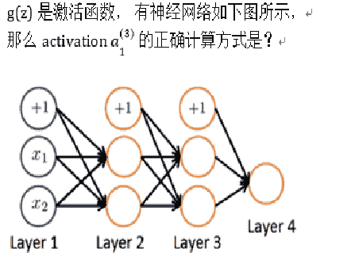

# 小红书 2020 校招算法笔试题卷三

## 1

按照二叉树的定义，4 个节点的二叉树有多少种？ （）

正确答案: B   你的答案: 空 (错误)

```cpp
13
```

```cpp
14
```

```cpp
15
```

```cpp
16
```

本题知识点

算法工程师 小红书 2020

讨论

[weiyinfu](https://www.nowcoder.com/profile/8575360)

卡特兰数设 n 个结点的二叉树有 f(n)种，对于 f(4)，分类讨论：左子树有 0 个结点，右子树有 3 个结点，种数为 f(0)*f(3)左子树有 1 个结点，右子树有 2 个结点,种数为 f(1)*f(2)左子树有 2 个结点，右子树有 1 个结点,左子树有 3 个结点，右子树有 0 个结点
f(4)=f(0)*f(3)+f(1)*f(2)+f(2)*f(1)+f(3)*f(0)f(0)=1,f(1)=1,f(2)=2,f(3)=(1,1,2)*(2,1,1)=5f(4)=(1,1,2,5)*(5,2,1,1)=14

发表于 2020-06-23 08:15:03

* * *

[鱼小雅](https://www.nowcoder.com/profile/768562901)

n 个节点的二叉树一共有((2n)!)/(n! * (n+1)!)种

发表于 2020-06-03 08:52:44

* * *

[前端 dd](https://www.nowcoder.com/profile/480305740)

二叉树节点算法（2n!）/n!*（n+1）!

发表于 2020-06-04 01:07:27

* * *

## 2

下列排序算法中存储消耗最大的是？（）

正确答案: C   你的答案: 空 (错误)

```cpp
快速排序
```

```cpp
堆排序
```

```cpp
归并排序
```

```cpp
插入排序
```

本题知识点

算法工程师 小红书 2020

讨论

[鱼小雅](https://www.nowcoder.com/profile/768562901)

空间复杂度分别是 插入排序 堆排序 o（1） 快速排序 o（logn） 归并排序 o（n）

发表于 2020-06-03 08:55:57

* * *

## 3

关于数组的说法正确的是？（）

正确答案: D   你的答案: 空 (错误)

```cpp
插入元素的平均时间复杂度是 o(1)
```

```cpp
删除元素的平均时间复杂度是 o(1)
```

```cpp
可以顺序存储也可以链式存储
```

```cpp
可以随机访问任何节点
```

本题知识点

算法工程师 小红书 2020

讨论

[牛客 214345987 号](https://www.nowcoder.com/profile/214345987)

数组的物理存储地址各个单元是连续的。

发表于 2021-09-03 11:08:33

* * *

[牛客 780265477 号](https://www.nowcoder.com/profile/780265477)

为什么 C 不正确

发表于 2020-11-12 14:39:55

* * *

[AYAYAYA666](https://www.nowcoder.com/profile/4227150)

Q 向一个有序数组中插入一个数的时间复杂度是多少?

查找插入位置如果用遍历查找的是 O(n)，用二分查找是 O(log2n)。

但是数组的插入操作需要将插入位置后的元素全部后移一位，这需要 O(n)。

所以总的时间复杂度是 O(n)。（O(n)+O(n)=O(n)，O(log2n)+O(n)=O(n)

发表于 2020-08-15 13:25:36

* * *

## 4

你有一个 logistic 回归分类器，之前你设了一个阈值 >= 0.5 就是 1，<=0.5 就是 0， 这是如果你把阈值调整到了 0.2 , 下面哪些是对的？（）

正确答案: C   你的答案: 空 (错误)

```cpp
召回率不会变，准确率提高
```

```cpp
召回率降低
```

```cpp
召回率提高
```

本题知识点

算法工程师 小红书 2020

讨论

[晴空幽兰雨](https://www.nowcoder.com/profile/573675506)

recall（召回率或真阳性率 TPR）=TP/(TP+FN),其中 TP+FN 表示样本中实际为真的总数。阈值降低，预测为真的条件更轻松，TP 会上升，故上升。

发表于 2020-09-18 09:34:43

* * *

[奔跑的飛魚](https://www.nowcoder.com/profile/7995596)

Recal = TP/(P)， 降低阈值， TP 将变大

发表于 2020-07-04 18:10:45

* * *

[TimeFrames](https://www.nowcoder.com/profile/493286830)

召回率理解成查全率就好办了

发表于 2020-06-03 22:37:19

* * *

## 5

已知数据集，有 label (0, 1) ,  当对该数据训练回归模型时，正样本全部选用， 负样本随机抽取 10%， 经过训练得到模型 F， 当 F 对某样本 X 预估 p (label = 1)  = 0.6 时，求如果不进行负样本抽样 p (label = 1)   约为多少？（）

正确答案: A   你的答案: 空 (错误)

```cpp
0.13
```

```cpp
0.15
```

```cpp
0.06
```

```cpp
0.08
```

本题知识点

算法工程师 小红书 2020

讨论

[陌上锦衣卫](https://www.nowcoder.com/profile/327658856)

抽取 10%负样本：     p (label = 1)  = 0.6  -> 正样本 60(100%),负样本 40(10%),全部负样本为 400 不进行负样本抽取： p (label = 1)  =  60/(60+400) = 0.13 

发表于 2020-06-17 16:37:32

* * *

[pwolp](https://www.nowcoder.com/profile/249697717)

基本的数学计算（虽然没有答对。。。。）设负样本的总数为 x，正样本总数为 y，那么就可以得到方程： y/(0.1x+y)=0.6，得到 y 和 x 的关系。然后求的是 y/(x+y)，就可以根据 y 和 x 的关系得到了。

发表于 2020-07-02 15:49:17

* * *

[放弃幻想，准备战斗](https://www.nowcoder.com/profile/6544134)

***迷，重采数据后模型重训练了吗？如果是，怎么能有答案，模型的训练效果完全是波动的啊

发表于 2020-06-22 21:34:10

* * *

## 6

对于样本 (A, B, C, D, E) , 已知其对应的 label 为 (0, 1, 1 ,0 ,1)，模型 A 的预估值为 (0.2, 0.4, 0.7, 0.3, 0.5), 模型 B 的预估值为(0.1, 0.3, 0.9, 0.2, 0.5)，请问模型 A 和 模型 B 的 AUC 哪个更高（）

正确答案: C   你的答案: 空 (错误)

```cpp
 A    
```

```cpp
B. 
```

```cpp
一样
```

本题知识点

算法工程师 小红书 2020

讨论

[陌上锦衣卫](https://www.nowcoder.com/profile/327658856)

[哎呀我去哦](https://www.nowcoder.com/profile/220857206)的解题思路，帮他写清楚一点

| 样本 | A | B | C | D | E |
| 模型 A 的预估值  | 0.2 | 0.4 | 0.7 | 0.3 | 0.5 |
| 模型 B 的预估值  | 0.1 | 0.3 | 0.9 | 0.2 | 0.5 |

本题样本对（一个正样本，一个负样本组成一个样本对）共有 3*2=6 个，分别是（B，A）（B，D）（C，A）（C，D）（E，A）（E，D） | 样本对 | （B，A） | （B，D） | （C，A）  | （C，D） | （E，A） | （E，D）  |
| 模型 A 的预估值  | (0.4,0.2)  | (0.4,0.3) | (0.7,0.2) | (0.7,0.3) | 0.5,0.2) | (0.5,0.3)  |
| 模型 A 的 AUC 计算  | 1 | 1 | 1 | 1 | 1 | 1 |
| 模型 B 的预估值  | (0.3,0.1) | (0.3,0.2) | (0.9,0.1) | (0.9,0.2) | (0.5,0.1) | (0.5,0.2)  |
| 模型 B 的 AUC 计算  | 1 | 1 | 1 | 1 | 1 | 1 | 模型 A 对应概率为(0.4,0.2)，(0.4,0.3)，(0.7,0.2)，(0.7,0.3)，(0.5,0.2)，(0.5,0.3)，可得其对应 AUC 为：(1+1+1+1+1+1)/6 = 1。同理，模型 B 也等于 1。

发表于 2020-06-17 17:47:13

* * *

[AYAYAYA666](https://www.nowcoder.com/profile/4227150)

AUC 最普遍的定义是 ROC 曲线下的面积。但其实另一种定义更常用，分别随机从正负样本集中抽取一个正样本，一个负样本，正样本的预测值大于负样本的概率。所以之前的层主，才要组合正负样本对

发表于 2020-08-15 13:43:38

* * *

[哎呀我去哦](https://www.nowcoder.com/profile/220857206)

本题样本对（一个正样本，一个负样本组成一个样本对）共有 3*2=6 个，分别是（B，A）（B，D）（C，A）（C，D）（E，A）（E，D）。模型 A 对应概率为(0.4,0.2)，(0.4,0.3)，(0.7,0.2)，(0.7,0.3)，(0.5,0.2)，(0.5,0.3)，可得其对应 AUC 为：(1+1+1+1+1+1)/6 = 1。同理，模型 B 也等于 1。

发表于 2020-06-11 17:15:40

* * *

## 7

有数据集 正样本 120 个， 负样本 80 个， 模型 F 对样本进行预估 预测为正样本的有 80 个 （其中真的是正样本的是 60 个）， 请问该模型的召回率是多少？（）

正确答案: D   你的答案: 空 (错误)

```cpp
60%
```

```cpp
75%
```

```cpp
70%
```

```cpp
50%
```

本题知识点

算法工程师 小红书 2020

讨论

[鱼小雅](https://www.nowcoder.com/profile/768562901)

这题做错的多半是没看清题目吧 比如我 60/120

发表于 2020-06-03 09:05:01

* * *

[牛客 896589627 号](https://www.nowcoder.com/profile/896589627)

召回率是预测正样本除以真实正样本

发表于 2020-12-19 15:41:10

* * *

[起名困难户啊啊](https://www.nowcoder.com/profile/77640305)

他测试

发表于 2020-06-30 17:01:14

* * *

## 8

为什么要 DNN 模型中需要规范化特征?（）

正确答案: B   你的答案: 空 (错误)

```cpp
 参数初始化更快 
```

```cpp
 损失函数收敛更快 
```

```cpp
使数据更容易可视化 
```

```cpp
减少模型过拟合可能性
```

本题知识点

算法工程师 小红书 2020

讨论

[鱼小雅](https://www.nowcoder.com/profile/768562901)

两种方法 1.minmax normalization（最值归一） X-Max/Min-Max 2.Standard Normalization（标准化） （X-\mu ）/\sigma 加快梯度下降、统一量纲

发表于 2020-06-03 09:10:37

* * *

## 9

当你使用 20 轮的梯度下降选取 α=0.3, 并且每轮计算 J(θ) ，当你发现 J(θ)一直上涨时，下面哪些结论看起来靠谱？（）

正确答案: C   你的答案: 空 (错误)

```cpp
α=0.3 是一个非常好的参数 
```

```cpp
你可以考虑用一个更大的 α=1.0
```

```cpp
你可以考虑用一个更小的 α=0.1
```

本题知识点

算法工程师 小红书 2020

讨论

[牛客 33112015 号](https://www.nowcoder.com/profile/33112015)

学习率过大会造成震荡

发表于 2020-06-12 19:58:47

* * *

## 10



正确答案: A   你的答案: 空 (错误)

本题知识点

算法工程师 小红书 2020

讨论

[牛客 426678560 号](https://www.nowcoder.com/profile/426678560)

这题的下标和上标是每一个看懂的，基本是蒙对的

发表于 2020-06-27 16:54:45

* * *

[A 木头菇](https://www.nowcoder.com/profile/3555308)

上标表示的是层数，下标表示节点，b 肯定不对，根据规律都可以选出来 A。。

发表于 2020-07-27 21:56:59

* * *

## 11

你有一个 logistic 回归分类器，之前你设了一个阈值 >= 0.5 就是 1，<=0.5 就是 0， 这是如果你把阈值调整到了 0.9 , 下面哪些是对的？（）

正确答案: B   你的答案: 空 (错误)

```cpp
召回率不会变，准确率提高
```

```cpp
召回率降低
```

```cpp
召回率提高
```

本题知识点

算法工程师 小红书 2020

讨论

[Invitation](https://www.nowcoder.com/profile/563182658)

召回率可以理解为查全率，阈值大了，查全率降低

发表于 2020-09-08 09:49:54

* * *

## 12

关于 online learning 哪些说法是正确的？（）

正确答案: C   你的答案: 空 (错误)

```cpp
Online learning 需要存下每一个新的样本，因为获得新样本后需要重新训练这部分数据
```

```cpp
在我们有固定训练集的时候，非常需要 Online learning
```

```cpp
Online learning 期望在一个流式的数据上进行训练
```

本题知识点

算法工程师 小红书 2020

讨论

[鱼小雅](https://www.nowcoder.com/profile/768562901)

比如实时根据客户浏览偏爱调整推荐

发表于 2020-06-03 09:12:30

* * *

## 13

小红书一个 service 的请求可以被多核并行处理的， 当 qps = 100 的时候 4 core  cpu 利用率 （40% ）, 平均相应时间 53ms， 当 qps = 150 的时候 cpu 利用率 （60 % ), 平均相应时间大约是多少？（）

正确答案: C   你的答案: 空 (错误)

```cpp
53ms
```

```cpp
 60ms
```

```cpp
70ms
```

```cpp
 35ms
```

本题知识点

算法工程师 小红书 2020

讨论

[China_NO.1](https://www.nowcoder.com/profile/410845626)

qps 是每秒查询率 相当于要处理的任务 任务从 100 变成 150 效率从 40 变成 60 时间从 53 变成多少? 53*（150/100）=80 最接近 70,因为 CPU 利用率的提高并不会增加并发数，而 qps=并发数/响应时间

发表于 2020-06-28 18:42:40

* * *

[鱼小雅](https://www.nowcoder.com/profile/768562901)

qps 是每秒查询率 相当于要处理的任务 任务从 100 变成 150 效率从 40 变成 60 时间从 53 变成多少? 53*（40/60）*（150/100）

发表于 2020-06-03 09:16:40

* * *

## 14

增加神经元的失活率 （keep_prob） 0.5 -> 0.6 ,可能会发生下面那些情况？（）

正确答案: B D   你的答案: 空 (错误)

```cpp
增加正则化影响 
```

```cpp
降低正则化影响
```

```cpp
 增加训练集错误率
```

```cpp
降低训练集错误率
```

本题知识点

算法工程师 小红书 2020

讨论

[牛客 214345987 号](https://www.nowcoder.com/profile/214345987)

题目把失活率改成存活率更好

发表于 2021-09-03 11:32:08

* * *

[。。。。。。20180704222275](https://www.nowcoder.com/profile/732320387)

Dropout 率（keep_prob）为保留一个神经元为激活状态的概率.Dropout 率越高，意味着更多神经元是激活的，正规化程度越低。Dropout 是 bagging 的近似集成，dropout 可以随机的让一部分神经元失活,这样仿佛是 bagging 的采样过程,因此可以看做是 bagging 的廉价的实现. 使用 Dropout 的目的是为了防止过拟合，增加 keep_prob，训练集的错误会降低。

发表于 2020-06-24 10:19:45

* * *

[牛客 389867859 号](https://www.nowcoder.com/profile/389867859)

正则化项一般是模型复杂度的单调递增函数，模型越复杂，正则化值就越大。所以 dropout 值越大失活的神经元数量就越多，模型的复杂度越低，从而正则化值越小。使用 dropout 是为了防止过拟合，主要是能提高测试集的准确率。而对于训练集如果本身就是欠拟合的话增大 dropout 并不会降低训练集的错误率。所以这个我认为应该选 A,C,D。个人觉得答案有问题。

发表于 2020-07-24 16:13:54

* * *

## 15

有些场景适合有监督学习，有些适合无监督，以下哪些情况更适合有监督的算法？（）

正确答案: B C D   你的答案: 空 (错误)

```cpp
给你很多篇小红书的新闻，自动将其分为”相似”的组
```

```cpp
根据一个人的喜好，预测他喜欢看小红书上的哪些笔记
```

```cpp
给 50 篇男性作者的笔记和 50 篇女性作者的笔记，预测手稿作者的性别
```

```cpp
给若干篇笔记，判断笔记是否适合儿童
```

本题知识点

算法工程师 小红书 2020

讨论

[睡着的小伙子](https://www.nowcoder.com/profile/118466744)

为啥要选 d，d 没有标签，怎么监督学习

发表于 2020-06-27 22:47:24

* * *

[牛客 838589546 号](https://www.nowcoder.com/profile/838589546)

B 不是一个推荐的场景嘛，做标注成本又高，效果又不好，毕竟人的兴趣随时变化

发表于 2020-09-09 21:30:46

* * *

[weiyinfu](https://www.nowcoder.com/profile/8575360)

话说为啥要选 B。根据一个人的喜好预测他喜欢看的内容 <=>根据一个人的喜好推荐相似的内容<=>给你很多篇小红书的新闻，自动将其分为”相似”的组所以，为啥不选 A？

发表于 2020-06-23 08:18:55

* * *

## 16

关于 MapReduce 的框架，下面说法讲道理的是?（）

正确答案: A C D   你的答案: 空 (错误)

```cpp
如果你有 1 台机器 1core， MapReduce 并没有什么用
```

```cpp
在 MapReduce 的情况下，数据需要分成 n² 份
```

```cpp
如果你有 1 台多核的机器，MapReduce 会有用
```

```cpp
MapReduce 的情况下，N 台机器就能够提供 N 倍的计算能力
```

本题知识点

算法工程师 小红书 2020

讨论

[7322600](https://www.nowcoder.com/profile/7322600)

怎么能提升 n 倍算力呢

发表于 2020-06-26 16:03:01

* * *

[牛客 214345987 号](https://www.nowcoder.com/profile/214345987)

数据备份应该是 n 份吧

发表于 2021-09-03 11:36:37

* * *

## 17

小红书正在为用户开发一个垃圾回收分类器，并且正在为干垃圾、湿垃圾和可回收垃圾建立一个分类器。假设您的分类器获得了的训练集错误率 0.4% 和 8.2%的测试集错误率，那么下面的哪几项是值得尝试的呢？  （）

正确答案: A B C   你的答案: 空 (错误)

```cpp
添加正则项
```

```cpp
添加更多的训练数据. 
```

```cpp
减少隐藏层 (hidden layer ) 的神经元数量 
```

```cpp
添加更多测试数据 
```

```cpp
增加网络层数
```

本题知识点

算法工程师 小红书 2020

讨论

[上善若水 76](https://www.nowcoder.com/profile/2969097)

可能考察的是训练过拟合怎么办

发表于 2020-07-03 19:42:01

* * *

[zhA___](https://www.nowcoder.com/profile/803362576)

模型在训练集上过拟合，此时增加网络层数会得到一个更强大的模型（过拟合++）

发表于 2020-08-02 17:38:35

* * *

[鱼小雅](https://www.nowcoder.com/profile/768562901)

为啥 d 不对啊？可能测试数据和训练数据不是独立同分布的呢 正好测的数据都是更困难的 hard sample 呢？

发表于 2020-06-03 09:25:13

* * *

## 18

小红书的笔记一共有 14 种一级类目，要你设计一个变量存储每个笔记的类目归属，哪些类型可以存储？（）

正确答案: A B C D   你的答案: 空 (错误)

```cpp
String
```

```cpp
 Enum
```

```cpp
char
```

```cpp
Int8
```

本题知识点

算法工程师 小红书 2020

讨论

[鱼小雅](https://www.nowcoder.com/profile/768562901)

Ebum 枚举是种数据类型，包含多个固定的值．在利用一组常量时可以使用枚举类型．

发表于 2020-06-03 09:26:12

* * *

## 19

薯队长写了一篇笔记草稿，请你帮忙输出最后内容。 1.输入字符包括，"("    ,    ")"    和    "<"和其他字符。 2.其他字符表示笔记内容。 3.()之间表示注释内容，任何字符都无效。    括号保证成对出现。 4."<"表示退格,    删去前面一个笔记内容字符。括号不受"<"影响    。 

本题知识点

前端工程师 小红书 2020 C++工程师 测试开发工程师 Java 工程师 安卓工程师 iOS 工程师 算法工程师

讨论

[weiyinfu](https://www.nowcoder.com/profile/8575360)

就问问你们，谁有我短？

```cpp
s=input().strip()
a=[]
left=0
for i in s:
    if i=='(':
        left+=1
        continue
    if left:
        if i==')':
            left-=1
        continue
    if i=='<':
        a.pop()
    else:
        a.append(i)
s=''.join(a)
print(s)
```

发表于 2020-06-22 12:44:25

* * *

[你有猫饼嘛 i](https://www.nowcoder.com/profile/391134424)

```cpp
import java.util.ArrayList;
import java.util.List;
import java.util.Scanner;

public class Main {
    public static void main(String[] args) {
        Scanner scanner = new Scanner(System.in);
        StringBuffer stringBuffer = new StringBuffer();
        stringBuffer = new StringBuffer(scanner.nextLine());
        List<Integer> k = new ArrayList<>();
        //用一个列表来装括号的匹配
        //遇见‘（’添加首次匹配位置进去
        //遇见‘）’从最后一次‘（’匹配位置开始删除字符串
        for(int i = 0; i < stringBuffer.length();){
            if(stringBuffer.charAt(i)=='(') {
                k.add(i);
                i++;
            }
            else if(stringBuffer.charAt(i)=='<'&&k.size()==0) {
                stringBuffer.delete(i - 1, i + 1);
                i = i - 1;
            }
            else if(stringBuffer.charAt(i)==')') {
                stringBuffer.delete(k.get(k.size() - 1),i + 1);
                i = k.get(k.size() - 1);
                k.remove(k.size() - 1);
            }
            else
                i++;
        }
        System.out.println(stringBuffer);
    }
}
```

发表于 2020-08-05 21:01:30

* * *

[准备脱非入欧](https://www.nowcoder.com/profile/964977041)

在下拙见

```cpp
function fun(str) {
      var stack = [];
      str = str.split("");
      var res = '';
      for (var i = 0; i < str.length; i++) {
        if(str[i] != "(" && str[i] != ")" && stack.length == 0){
          res += str[i]
        }
        if(str[i] == "(" ){
          stack.push(i)
        }
        if(str[i] == ")"){
          stack.pop()
        }
      }
      res = res.split("");
      for(var i = 0 ; i < res.length ; i++){
        if(res[i] == "<"){
          res.splice(i-1,2);
          i--;
          i--;
        }
      };
       return res.toString().replace(/\,/g,"")
    }
```

发表于 2020-07-07 19:35:01

* * *

## 20

 薯队长写了 n 篇笔记，编号从 1~n,每篇笔记都获得了不少点赞数。    薯队长想从中选出一些笔记，作一个精选集合。挑选的时候有两个规则： 1.不能出现连续编号的笔记。 2.总点赞总数最多 如果满足 1，2 条件有多种方案，挑选笔记总数最少的那种

本题知识点

前端工程师 小红书 2020 C++工程师 测试开发工程师 Java 工程师 安卓工程师 iOS 工程师 算法工程师

讨论

[✭](https://www.nowcoder.com/profile/296604434)

类似打家劫舍的问题。利用动态规划 dp[i] = x 表示从 i 开始选笔记，最大点赞数为 x。dpNum[i]表示此时选取的次数动态转移方程为 dp[i] = max(dp[i+1], dp[i+2]+nums[i])由于本题还需要求次数，所以再构造一个 dpNum 数组，用来存储得到 dp[i]时，选取的笔记次数。状态方程与 dp 数组类似，当选取了 nums[i]，则 dpNum[i] = dpNum[i+2]+1,否则在不选取的情况下，dpNum[i]=dpNum[i+1]从后往前迭代求解，所以数组需初始化大小为 n+2,初值均为 0(方便求解 dp[n-1])

```cpp
import sys
n = eval(input())
nums = [int(i) for i in sys.stdin.readline().split()]
dp = [0 for _ in range(n+2)]
dpNum = [0 for _ in range(n+2)]
num = 0
for i in range(n-1, -1, -1):
    if dp[i+1] < dp[i+2]+nums[i]:
        dp[i] = dp[i+2]+nums[i]
        dpNum[i] = dpNum[i+2]+1
    else:
        dp[i] = dp[i+1]
        dpNum[i] = dpNum[i+1]
print(dp[0], dpNum[0])
```

编辑于 2020-06-26 11:49:10

* * *

[广州市民林先生](https://www.nowcoder.com/profile/241061362)

**思路：要在一个连续的数组里面选 k 个数，使得这 k 个数的点赞最多，并且还不能选编号连续的数（比如选了 nums[i]，就不能选 nums[i + 1]，只能选 nums[i + 2]........），那也就是说：要得到最大的点赞量，要看你前面是怎么选的，那既然后面的结果受前面的选择所影响，很容易联想到动态规划，因为通俗地讲，动态规划就是一个递推式，由前面推到后面，我们需要推到第 n 个数，从第 1 个数开始推。这样，我们定义 dp(n + 1)，dp[i]就表示选到第 i 个数的时候，能获得的最大点赞数。最终的 dp[n]就该是需要输出的最大点赞数。****那接下来就是怎么推的问题了。首先，遇到一个数 nums[i]，我有两种选择：选这个数，那么意味着我前面的 nums[i - 1]不能选，只能选 nums[i - 2]；不选这个数呢？那么意味着我可以选 nums[i - 1]，由于我要取最大点赞数，所以取它们俩的大者 赋值到 dp[i]即可，以此类推到 n。****至此，基本思路讲解完毕，现在还有一个问题，我们需要统计选了几个数。这个比较简单，选一个就+1,嘛，所以 count[i] = count[i - 2] + 1; 或者 count[i] = count[i - 1]，这时候应该可以理解这两句话的含义了吧，就是选与不选 nums[i]的问题了。下面看代码：**

```cpp
#include <iostream>
#include <vector>
using namespace std;

// dp[i]: 从第一篇笔记开始选到第 i 篇, 所能得到的最大点赞数。
// count[i]: 此时选取的笔记数量
int main(){
    int n, val;
    cin >> n;
    vector<int> vec(n + 1, 0);
    for(int i = 1; i <= n; ++i){
        cin >> val;
        vec[i] = val;
    }
    vector<int> dp(n + 1, 0);  
    vector<int> count(n + 1, 0);
    dp[1] = vec[1];  //选第一篇笔记, 最大点赞数自然就是 vec[1]
    count[1] = 1;    //选了一个数
    for(int i = 2; i <= n; ++i){
        //选了 dp[i - 2], 就不能选 dp[i - 1], 但可以选 veci
        if(dp[i - 1] < dp[i - 2] + vec[i]){
            dp[i] = dp[i - 2] + vec[i];
            count[i] = count[i - 2] + 1;
        } else{
            //不选 dp[i - 2]和 vec[i]
            dp[i] = dp[i - 1];
            count[i] = count[i - 1];
        }
    }
    cout << dp[n] << ' ' << count[n] << endl;
    return 0;
}
```

最后，leetcode 337 题 打家劫舍 III，思路类似，只不过从数组变成二叉树，感兴趣的可以试试。https://leetcode-cn.com/problems/house-robber-iii/

编辑于 2020-11-29 13:02:46

* * *

[融 360 内推](https://www.nowcoder.com/profile/598880162)

参考了大佬们的解法。

```cpp
def getMaxStar(n,nums):
    dp = [0 for _ in range(n+1)]
    dp2 = [0 for _ in range(n+1)]
    dp[1] = nums[0]
    dp2[1] = 1
    for i in range(2,n+1):
        if dp[i-1] < dp[i-2]+nums[i-1]:
            dp[i] = dp[i-2]+nums[i-1]
            dp2[i] = dp2[i-2]+1
        else:
            dp[i] = dp[i-1]
            dp2[i] = dp2[i-1]
    print(dp[-1], dp2[-1])

n = eval(input())
nums = [int(i) for i in input().split()]
getMaxStar(n, nums)

```

 编辑于 2020-07-21 18:22:00

* * *

## 21

在游戏中，击败魔物后，薯队长获得了 N 件宝物，接下来得把这些宝物卖给宝物回收员来赚点小钱。这个回收员有个坏毛病，每次卖给他一件宝 物后，之后他就看不上比这件宝物差的宝物了。在这个世界中，衡量宝物的好坏有两个维度，稀有度 X 和实用度 H，回收员在回收一个宝物 A 后，下一个宝物的稀有度和实用度都不能低于宝物 A。那么薯队长如何制定售卖顺序，才能卖给回收员宝物总个数最多。 

本题知识点

前端工程师 小红书 2020 C++工程师 测试开发工程师 Java 工程师 安卓工程师 iOS 工程师 算法工程师

讨论

[21CenturyBoy](https://www.nowcoder.com/profile/84805169)

```cpp
按照一个维度排序后按照另一个维度寻找最长增加子序列即可，这个是>=的比较简单一点，注意不能用 O(n2)，要二分查找优化

import java.util.*;
public class Main {
    public static void main(String[] args) {
        Scanner scanner = new Scanner(System.in);
        int n = scanner.nextInt();
        int[][] ans = new int[n][2];
        for(int i=0;i<n;i++){
            ans[i][0] = scanner.nextInt();
            ans[i][1] = scanner.nextInt();
        }
        Arrays.sort(ans,(a,b)->a[0]!=b[0]?a[0]-b[0]:a[1]-b[1]);
        int[] arr = new int[n];
        for(int i=0;i<n;i++)arr[i] = ans[i][1];
        System.out.println(LIS(arr));
    }
    public static int LIS(int[] arr){
        int[] dp = new int[arr.length];
        int res = 0;
        for(int num:arr){
            int l = 0,r = res;
            while (l<r){
                int m = (l+r)/2;
                if(dp[m]<num)l = m+1;
                else r = m;
            }
            dp[l] = num;
            if(l==res)res++;
        }
        return res;
    }
}
```

 发表于 2020-06-07 13:42:37

* * *

[准备脱非入欧](https://www.nowcoder.com/profile/964977041)

牛客网 的输入输出 真的 蛮搞人心态的 调整输入输出时间 跟 写代码时间一样长 做一道题花两道题时间😂😂 ```cpp
var num = readline();
var arr= [];
var n = null;
while(n = readline()){
    n=n.split(" ").map(item => {
        return Number(item)
    })
    arr.push(n)
}
arr.sort((d1, d2) => {
        return d1[0] != d2[0] ? d1[0] - d2[0] : d1[1] - d2[1]
      });
function LIS(num, arr) {
      var temp = [];
      for (var i = 0; i < num; i++) {
        temp.push(arr[i][1]);
      }
      let newArr = new Array(num);
      newArr[0] = temp[0]
      let end = 0;
      for (var k = 0; k < num; k++) {
        if (temp[k] > newArr[end]) {
          end++;
          newArr[end] = temp[k];
        } else {
          let left = 0 ;
          let right = end ;
          while(left < right){
            let mid = left + ((right - left) >> 1);
            if(newArr[mid] < temp[k]){
              left = mid + 1;
            } else {
              right = mid;
            }
          }
          newArr[left] = temp[k]
        }
      }
      return end + 1
    }
      console.log(LIS(num, arr)) ;
``` 

发表于 2020-07-09 21:26:13

* * *

[我不想当大白菜](https://www.nowcoder.com/profile/2462790)

分析

*   思路 先对数组排序(sort 函数会同时对两个维度排序，第一个维度相同时会比较第二个维度)，然后在另一个维度上搜索最长上升子序列。

```cpp
 input: [[32],[11],[13],[12]]

sorted(input):[[11],[12],[13],[32]]
```

*   时间复杂度的限制：在找最长上升子序列时不能使用 DP 方法(O(N²))，考虑通过二分查找来找到 LIS。
*   **LIS 的二分查找算法**：[参考: leetcode 300.最长上升子序列](https://leetcode-cn.com/problems/longest-increasing-subsequence/solution/zui-chang-shang-sheng-zi-xu-lie-by-leetcode-soluti/)
    *   构造单调上升数组 res，对原数组 nums 逐个遍历：
        *   如果 nums[i]>res[-1]，说明满足上升条件，将其插入数组中；
        *   否则，通过二分查找 res 数组中刚好比它大的值并进行替换。**当完成多次替换后该数组的最大值会减小，从而能向 res 中添加一些原数组中较小的值。**
    *   计算数组的长度得到 LIS 的最大值。
*   注意二分搜索时的边界以及返回值选择

```cpp
def binary_search(nums,left,right,val):
    mid = 0
    while left < right:
        mid = (left+right) // 2
        if val > nums[mid]:
            left = mid +1
        else:
            right = mid
    return left

def LIS(N,prices):
    res = []
    for i in range(N):
        if not res or prices[i] > res[-1]:
            res.append(prices[i])
        else:
            idx = binary_search(res, 0, len(res), prices[i])
            res[idx] = prices[i]
    return len(res)

def main():
    N = int(input())
    prices = []
    for i in range(N):
        prices.append(list(map(int,input().split())))
    prices.sort()
    h = [a[1] for a in prices]
    return LIS(N,h)

print(main())
```

编辑于 2020-07-06 22:30:59

* * *