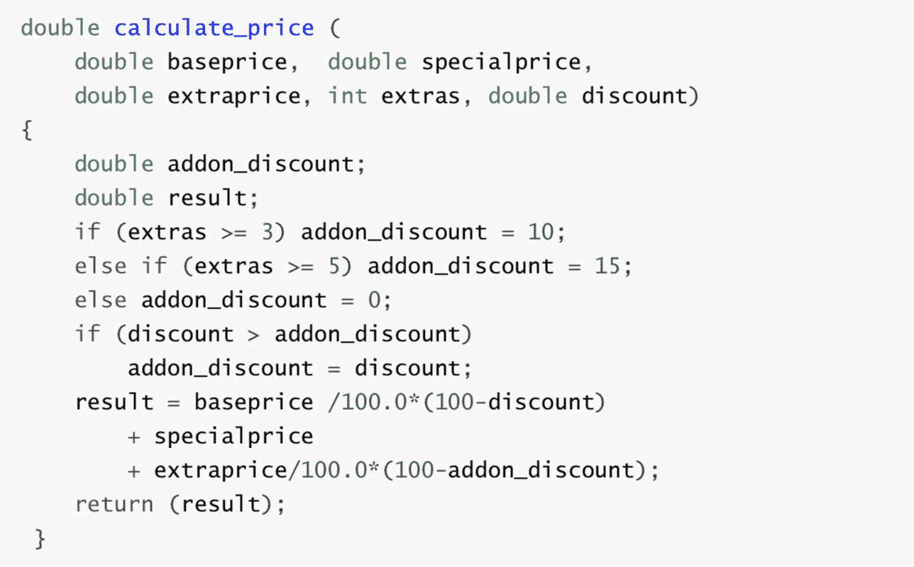
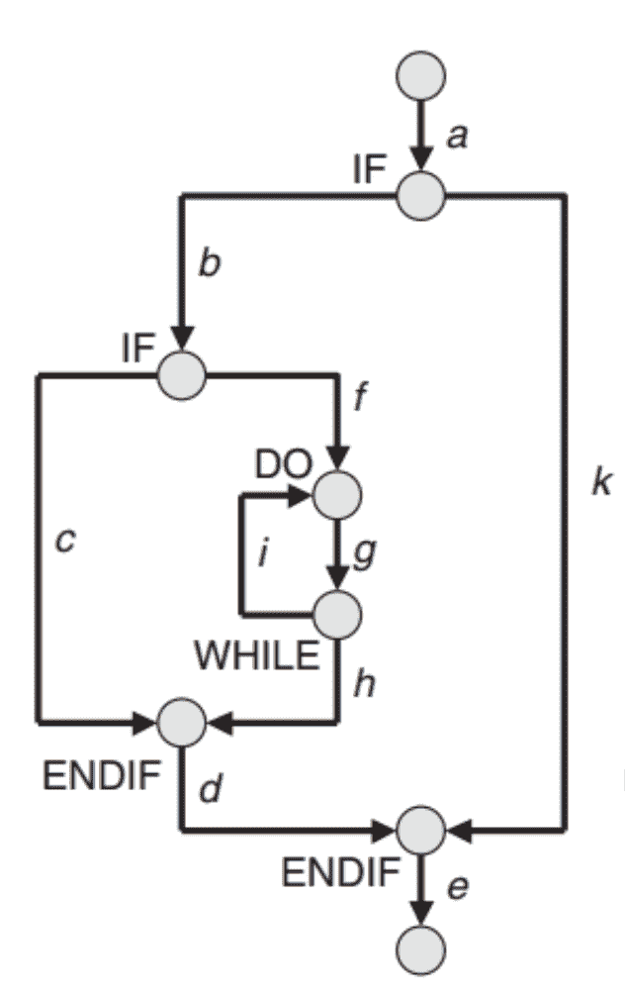

# 搜狗 2020 校招【测试】笔试（第一场）

## 1

搜狗 APP 可以搜索一些内容，用户通常会把搜索到的结果页面分享到微信，QQ，微博等社交 APP 中，请针对分享功能进行测试，分享结果样式如下

你的答案

本题知识点

测试工程师 搜狗 2020

讨论

[LikeApple](https://www.nowcoder.com/profile/534313258)

1.页面展示问题 2.点击分享按钮正确跳转分享页面，展示可分享的 app3.页面默认展示自定义可分享 app，有按钮支持更多 app 选择，过滤部分系统应用 app4.点击 app 分享，校验是否支持分享后打开链接 5.支持取消分享 6.分享内容失败，返回失败信息 7.分享内容成功，可选择留在 app 应用内还是返回浏览器 8.分享内容成功后，进入 app 可看到分享以链接形式展现， 展现内容为搜索标题以及搜索内容，无错别字布局合理 9.点击分享链接可进入浏览器展示链接内容 10.断网或者切换无线 4G 网络，能否正确跳转并且展示内容或者网络中断提示 11.切换不同操作系统以及浏览器能否正确打开，兼容性测试 12.如果用手机打开是否耗流量 13.是否有网络***，安全策略 14.性能测试，分享链接速度，链接打开速度 15.并发性测试，多个同时客户端访问服务器端能否正确展示 16.支持分享成功后撤回功能

发表于 2021-08-16 21:41:34

* * *

[牛客 324719764 号](https://www.nowcoder.com/profile/324719764)

结构性思维 兼容性，系统兼容，ios 和安卓，各厂机型兼容

编辑于 2020-09-11 00:02:37

* * *

## 2

下文一个简单的价格计算函数 calculate_price()，请回答下列问题：
1\. 请在纸上画出控制流程图并拍照上传；请参考示例
2\. 请基于流程图设计测试用例，尽可能覆盖所有分支，并说明对应的覆盖分支；请参考示例
3\. 代码逻辑和健壮性存在哪些问题，请列举；流程图示例：测试示例：
TestCase01:
        price = calculate_price(25500.00, 3450.00, 6000.00, 6,0);
        覆盖分支：a,b,f,g,h,d,e

你的答案

本题知识点

测试工程师 搜狗 2020

讨论

[牛客 324719764 号](https://www.nowcoder.com/profile/324719764)

代码判断覆盖，逻辑路径覆盖

发表于 2020-09-11 00:03:48

* * *

[牛客 977666103 号](https://www.nowcoder.com/profile/977666103)

问题 2 的第一个测试路径里面是不是应该没有 c

发表于 2020-08-22 15:44:48

* * *

## 3

已知 ip 地址的格式定义为：IP 地址的长度为 32 位，分为 4 段，每段 8 位，用十进制数字表示，每段数字范围为 0～255，段与段之间用句点隔开。 有一个程序，其功能是可验证输入的字符串是否为符合上述定义的 ip 地址，如输入 10.129.232.163，程序会输出 1 表示其符合定义，如输入 123456，程序会输出 0 表示其不符合定义。请写出 10 个 case，来验证这个程序的正确性。每个 case 一行，第一个参数为 ip，第二个参数为是否符合定义，符合为 1，不符合为 0，两个参数用空格分隔。

本题知识点

测试工程师 搜狗 2020

讨论

[这是一个昵称呀](https://www.nowcoder.com/profile/689271501)

```cpp
def check_ip(ip_name):
    flag = 1
    if "." in ip_name:
        tip = ip_name.split(".")
        if len(tip) == 4:
            i = 0
            while i < len(tip):
                if int(tip[i]) <= 255 and int(tip[i]) >= 0:
                    flag = 1
                    i += 1
                else:
                    flag = 0
        else:
            flag = 0
    else:
        flag = 0
    return flag

ip_value = input()
print(ip_value,check_ip(ip_value))
```

发表于 2020-08-13 17:32:50

* * *

## 4

【题干描述】：我们共有 n 台服务器，每台服务器可以和若干个子服务器传输数据，n 台服务器组成一个树状结构。现在要将一份数据从 root 节点开始分发给所有服务器。一次数据传输需要一个小时时间，一个节点可以同时对 k 个儿子节点进行并行传输，不同节点可以并行分发。问，全部分发完成，最短需要多少小时？【示例】：当共有 5 台服务器，其树状结构为       0     /     \   1      2  /   \ 3    4 假设每一台服务器同时可以对 1 个儿子节点（k=1）并行传输，最优的数据传输过程示例如下：    第一个小时，0 -> 1；    第二个小时，1->3 & 0->2；    第三个小时，1 -> 4;所以当 k=1 时，全部分发完成最短需要 3 个小时。假设每一台服务器同时可以对 2 个儿子节点（k=2）并行传输，最优的数据传输过程示例如下：    第一个小时，0 -> 1 & 0 -> 2;    第二个小时，1 -> 3 & 1 -> 4;所以当 k=2 时，全部分发完成最短需要 2 个小时。 本题知识点

测试工程师 搜狗 2020 Java 工程师 C++工程师 前端工程师 算法工程师 大数据开发工程师

讨论

[石郎](https://www.nowcoder.com/profile/181241898)

见[`zhuanlan.zhihu.com/p/159329854`](https://zhuanlan.zhihu.com/p/159329854)

```cpp
#include <iostream>
#include <queue>
#include <vector>
#include <math.h>
#include <algorithm>
using  namespace std;

const  int MAX_V=1000005;
//用于存储树
vector<int> tree[MAX_V];
int cmp(int a,int b){
    return a>b;
}
int k;
int get_result(int root){
    // 如果当前节点没有孩子，即使叶子节点，那么它就不需要分发，直接返回 0
    if (tree[root].empty()){
        return 0;
    }
    //用于存储每个孩子节点分发完的时间
    vector<int>tres;
    for (int v : tree[root]) {
        tres.push_back(get_result(v));
    }
    // 计算 root 节点的分发时间
    // root 分发的时候，先发给，那些分发完所需时间最长的子节点
    sort(tres.begin(),tres.end(),cmp);
    int ares=0;
    for (int i = 0; i <tres.size() ; ++i) {
        tres[i]=tres[i]+floor(i*1.0/k)+1;
        ares=max(ares,tres[i]);
    }
    return ares;

}
int main(){
    int row_num,num,parent,child;
    //输入
    cin>>k>>row_num;
    for (int i = 0; i <row_num ; ++i) {
        cin>>num>>parent;
        for (int j = 0; j <num-1 ; ++j) {
            cin>>child;
            tree[parent].push_back(child);
        }
    }
    //计算根结点的最短分发时间
    cout<<get_result(0);
    return 0;
}
```

编辑于 2020-07-14 13:46:22

* * *

[奶茶妹夫](https://www.nowcoder.com/profile/6106500)

```cpp
import java.util.*;

/**
 * 	1. 使用 hashmap 构建树形结构
 * 	2. 递归分治法：假设已知 各个子节点的分发时间：
 *     	则： 2.1 对子节点的分发时间进行降序排列
 *     	    2.2 当前节点优先对 子节点分发时间 较长的节点进行分发, 
 * 				如:子节点分发时间 4 2 1 1 1 0, k=2, 则: 先后分发顺序(42)(11)(10),也就是
 *                     (42)+1 (11)+2 (10)+3 => 5 3 3 3 4 3 => 分三轮分发, 最终所需时间为 5 h。
 *             2.3 当节点为叶子结点, 分发时间为 0
 *             2.4 最后使用分治法进行递归分发,相当于从叶子节点向上推。
 */
class Node{

    int id = 0;
    List<Node> sons = new ArrayList<>();
    Node parent = null;
}

public class Main {

    public static void main(String[] args) {
        Scanner sc = new Scanner(System.in);

        HashMap<Integer , Node> hashMap = new HashMap<>();

        int K = sc.nextInt();
        int N = sc.nextInt();

        if(K == 0 || N == 0){
            System.out.println(0);
        }

        sc.nextLine();

        //树形构建
        for(int i = 0;i < N;i++){
            int node_n = sc.nextInt();
            //指定父节点
            int parent_id = sc.nextInt();
            Node my = null;
            if(hashMap.containsKey(parent_id)){
                //父节点存在
                my = hashMap.get(parent_id);
            }else{
                //父节点不存在
                my = new Node();
                my.id = parent_id;
                hashMap.put(parent_id,my);
            }
            //儿子节点
            for(int j = 0;j < node_n - 1;j++){
                int son_id = sc.nextInt();
                if(hashMap.containsKey(son_id)){
                    //儿子节点存在
                    hashMap.get(parent_id).sons.add(hashMap.get(son_id));
                }else{
                    //儿子节点不存在
                    Node son = new Node();
                    son.id = son_id;
                    son.parent = my;
                    hashMap.put(son.id,son);
                    hashMap.get(parent_id).sons.add(son);
                }
            }
            sc.nextLine();
        }

        //根节点存在
        Node root = hashMap.get(0);
        //分治法
        System.out.println(FZ(root , K));

    }

    public static int FZ(Node node , int k){
        int max = 0;
        if(node.sons.size() == 0){
            return 0;
        }else{
            Integer[] sons_time = new Integer[node.sons.size()];
            int i = 0;
            //统计分支时间
            for(Node son:node.sons){
                sons_time[i++] = FZ(son , k);
            }
            //合并分支与当前时间
            //降序排序
            Arrays.sort(sons_time, new Comparator<Integer>() {
                @Override
                public int compare(Integer o1, Integer o2) {
                    return o2 - o1;
                }
            });
            //计算当前节点为 root 所需要的时间
            int add = 1;
            for(int j = 0; j < sons_time.length ; j++){
                if(j!=0 && (j%k) == 0){
                    add++;
                }
                sons_time[j] += add;
                if(sons_time[j] > max){
                    max = sons_time[j];
                }
            }
        }
        return max;
    }
}
```

发表于 2020-08-12 15:56:09

* * *

[北叶影子](https://www.nowcoder.com/profile/387600981)

```cpp
#树结构
import sys
sys.setrecursionlimit(1000000)  # 解释器堆栈的最大深度
k,row_num=[int(v) for v in (sys.stdin.readline().strip('\n').strip().split())]
tree={}
root=0

for i in range(row_num):
    row = [int(v) for v in (sys.stdin.readline().strip('\n').strip().split())]
    if len(row)==0:
        continue
    if row[0]>1:
        tree[row[1]]=row[2:] #sorted(row[2:])

def get_result(root1):
    if len(tree.get(root1, [])) == 0:
        return 0
    tres=[]
    for v in tree.get(root1,[]):
        tres.append(get_result(v))
    tres=sorted(tres,reverse=True)
    for i in range(len(tres)):
        tres[i]=tres[i]+i//k+1
    return max(tres)

print(get_result(root))
```

发表于 2020-09-07 15:20:00

* * *