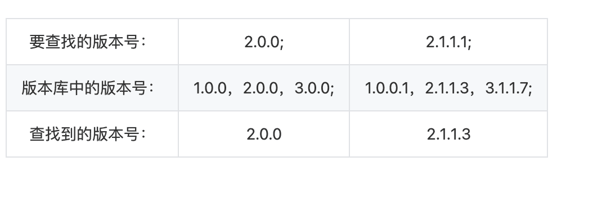
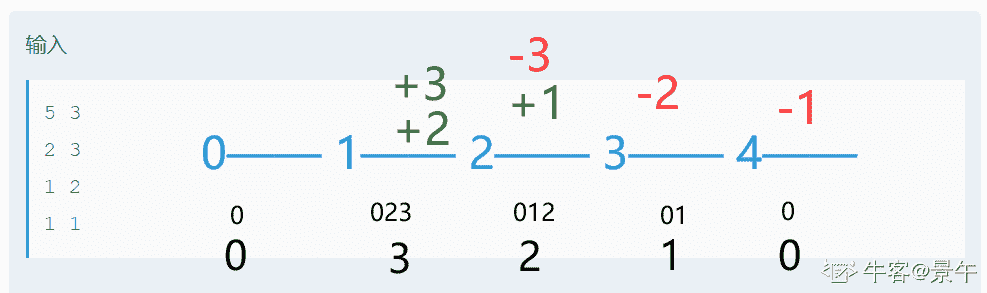
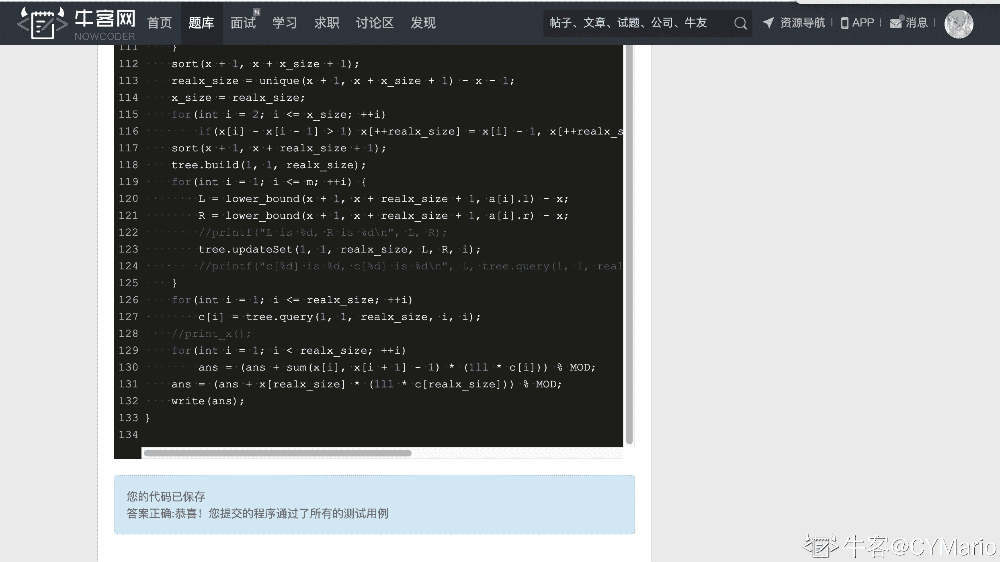

# 搜狗 2020 校招【测试】笔试（第二场）

## 1

以下代码实现求 1 到 10 的和，请指出其中的错误（给出错误的行号并说明原因）：

```cpp
  1 #include <iostream>
  2 using namespace std;
  3 
  4 int func1(int a=0;int b)
  5 {
  6     return a+b;
  7 }
  8 int sum()
  9 {
 10     int sum;
 11     int* const point1;
 12     int const* point2;
 13     point1=&sum
 14     point2=func1(3,4);
 15     int i=1,j=2;
 16     for(i,j;i<10,j<10;i++,j++)
 17     {
 18          sum+=func1(i,j);
 19      }
 20     return *point1;
 21 }
 22 int main(int argc, char *argv[])
 23 {
 24     int ret= sum();
 25     cout << ret;
 26     return 0;
 27 }

```

你的答案

本题知识点

测试工程师 搜狗 2020 Java 工程师 C++工程师

讨论

[Gemini 鑫](https://www.nowcoder.com/profile/986987237)

#include <iostream>using namespace std; 
int func1(int a,int b)
{
    return a + b;
}
int sum()
{
    int sum = 0;
    int* const point1 = &sum;

    int i = 1,j = 2;
    for(i, j; i < 8,j < 11; i = i + 2,j = j + 2)
    {
        sum += func1(i,j);
    }
    return *point1;
 }
 int main(int argc, char *argv[])
{
    int ret= sum();
    cout << ret;
    return 0;
 }sum 必须初始化；

编辑于 2020-11-10 17:52:22

* * *

[艺果](https://www.nowcoder.com/profile/171691115)

第四行：改为 int  func1(int  a=0,int  b),在函数的传参中使用‘，’。第十三行：语法错误，缺少‘；’，且 point1 为常量地址无法修改。第十四行：类型不匹配，point2 的类型为（const int *）而 func 的返回值类型（int）

发表于 2020-09-11 09:55:48

* * *

[江波 ya、](https://www.nowcoder.com/profile/446384016)

在 codeblocks 中实际测试，14 行代码这里如果 i 和 j 之间是逗号则前面 i 的判断条件并不会起作用，起作用的是后面 j 的判断条件，要想循环同时受到 i，j 值的限定，则 14 行代码应该为 ```cpp
for(i,j; i<10&&j<11; i=i+2,j=j+2)
``` 并且，sum 也应该初始化为 0;

发表于 2020-10-13 21:31:54

* * *

## 2

有一售卖电影票的移动 APP，现有个活动，前 1000 张的电影票用户能以原价 20%的价格买入，
但每人限购 1 张。如果你作为该活动的测试负责人，请问如何设计本次测试。

你的答案

本题知识点

测试工程师 搜狗 2020

讨论

[牛客 859718800 号](https://www.nowcoder.com/profile/859718800)

功能测试：1.移动 APP：在网络正常以及非正常的情况下，是否能够正常打开，APP 中的图片、文字以及电影相关信息是否正常显示，有没有缩略图；2.售卖电影票：购买电影票的功能（选电影、选座、支付金额）是否正常，活动是针对某部电影还是全部在售的电影，有活动时，电影票售卖的 app 是否显示有活动，是不是可以自主选择参加活动与否，参加活动是，支付金额是否显示原价的 20%，购买成功后，是否可以查看购票信息；1000 张电影票售完后，是否显示活动已结束，电影价格是否显示原价；3.20%的价格：支付方式是否支持微信、支付宝、网银；是否存在数据异常提交和退款的现象；4.1000 张电影票：1000 张等价划分，并同时处理 n 个人（0<n<1000,n=1000,n>1000）同时购买一张票，是否正常购买或者显示活动已结束，是否存在异常；5.每人限购 1 张：1 个人参加活动购买完一张，是否显示不可重复参与此活动，第二次购买是否无折扣；6\. 支付：是否提示请在一定时间内完成支付，如果在该时间段内没有完成支付，是否显示购票不成功；如果还没超过支付时间段，重新购买是否显示有待支付的订单；兼容性测试：检测在不同设备，不同系统及版本下，活动的兼容性检查。

发表于 2020-08-26 13:42:09

* * *

## 3

版本号是版本的标识号，常见版本号格式为：主版本号.子版本号[.修正版本号[.编译版本号]]，如：1.1、2.0.3.4。我们有时需要在版本库中查找指定版本，那么现在有一个程序实现了该查找功能，如果找到就返回该版本号，如果未找到，返回与指定版本最相近的版本号，如：查找 1.1.1,版本库 1.1.2、1.1.3、1.2.1、2.1.1 中前者最相近，返回可能有多个，异常情况返回-1。 请至少设计 10 个功能用例来测试该程序。 说明：假定版本库中版本号均为 2-4 级，每级间以“.”分隔，每级最大数字为 99，如：1.1.99，再升级则进位为 1.2.0。 答题处提交格式如下，每行一个测试用例，每个用例分为三个部分，要查找的版本号、版本库中的版本号和查找到的版本号，三部分之间用分号“;”分隔，库中及查找到的版本号如果有多个用逗号“,”分隔。 

本题知识点

测试工程师 搜狗 2020

讨论

[HEREISDAVID](https://www.nowcoder.com/profile/864672146)

这题目能不能整点阳间的排版.....题目给的实例是这样的↓↓↓↓↓↓↓↓大家加油吧 | 要查找的版本号：  | 2.0.0;  | 2.1.1.1;  |
| 版本库中的版本号：  | 1.0.0，2.0.0，3.0.0;  | 1.0.0.1，2.1.1.3，3.1.1.7;  |
| 查找到的版本号：  | 2.0.0  | 2.1.1.3  | 

发表于 2020-09-22 19:58:09

* * *

[mxren](https://www.nowcoder.com/profile/729492413)

有效等价类：2 级版本号，3 级版本号，4 级版本号，各级数字不超过 99，每级间以“.”分隔，可以写 3 个测试用例；无效等价类：1 级版本号，5 级版本号，非数字，存在数字大于 99，存在数字小于 0，第一位为 0，每级间不以“.”分隔可以写 7 个测试用例；其他用例：返回 1 个相近版本，返回多个相近版本，返回升级降级的相近版本.
 | 查找的版本号  | 版本库中的版本号  | 查找到的版本号  |
| 1.0 | 1.0 | 1.0 |
| 2.2.3 | 2.2.3 | 2.2.3  |
| 5.3.12.33 | 5.3.12.33  | 5.3.12.33  |
| 1 | 1.0  | -1 |
| 8.33.21.44.5 | 8.33.21.44  | -1 |
| a.1.2 | 1.1.2 | -1  |
| 0.3 | 1.3 | -1  |
| 2;1;2;4 | 2.1.2.4 | -1 |
| 3.12 | 3.11 | 3.11 |
| 6.22.1 | 6.21.99 | 6.21.99  |
| 7.33.97.55 | 7.33.97.50;7.33.97.60   | 7.33.97.50;7.33.97.60   | 

发表于 2020-10-11 16:28:12

* * *

## 4

小汪作为一个有数学天分的程序猿，设计了一套密码生成器来搞定自己的密码问题。
密码生成器由 N 个槽位组成，槽位的下标为 0~N-1 ，每个槽位存储一个数。起初每个槽位都是 0 。
密码生成器会进行 M 轮计算，每轮计算，小汪会输入两个数 L , R (L<=R),密码生成器会将这两个数作为下标，将两个下标之间（包含）的所有槽位赋值为 i（ i 为当前的轮次， i ∈ [1,M]）。
M 轮计算完成后，密码生成器会根据槽位的最终值生成一条密码，密码的生成规则为：
（0*a[0] + 1*a[1] + 2*a[2] + ... + (N-1)*a[N-1]) mod 100000009
其中 a[i]表示第 i 个槽位的最终值。
请帮助小汪把他的密码生成器实现为代码。数据范围：

```cpp
对于前 30%的测试数据，保证 N,M<=10000
对于前 50%的测试数据，保证 N,M<=200000
对于 100%的测试数据，保证 N<=1.5*10⁷,M<=200000
```

本题知识点

测试工程师 搜狗 2020 Java 工程师 C++工程师 PHP 工程师 小米 2021 golang 工程师

讨论

[牛客 58028594 号](https://www.nowcoder.com/profile/58028594)

这阴间用例上来就 10000 还不分行上哪自测去

发表于 2020-09-02 17:44:54

* * *

[景午](https://www.nowcoder.com/profile/739946566)

100 分。非暴力。用差分的思想。创建数组存操作记录，在区间左端记录＋i，区间右端记录－i。创建一个优先队列，从左往右遍历所有操作，遇到＋就 add(i)，遇到－就 remove(i)。每个位置的密码就是这时优先队列大顶端的数。
（用 PriorityQueue 会超时，这里用布尔数组实现了同样的功能） ```cpp
import java.util.Scanner;

public class Main {

    static class Node {
        int i;
        boolean set;
        Node prev;

        public Node(int i, boolean set, Node prev) {
            this.i = i;
            this.set = set;
            this.prev = prev;
        }
    }

    static class PriorityQueue {
        private final boolean[] active;
        private int max;

        public PriorityQueue(int upperBound) {
            active = new boolean[upperBound + 1];
            active[0] = true;
            max = 0;
        }

        public void add(int i) {
            active[i] = true;
            if (i > max)
                max = i;
        }

        public void remove(int i) {
            active[i] = false;
            if (max == i)
                while (!active[max]) max--;
        }

        public int peek() {
            return max;
        }
    }

    public static void main(String[] args) {
        Scanner sc = new Scanner(System.in);
        int n = sc.nextInt();
        int m = sc.nextInt();
        Node[] nodes = new Node[n + 1];
        for (int i = 1; i <= m; i++) {
            int l = sc.nextInt();
            int r = sc.nextInt();
            nodes[l] = new Node(i, true, nodes[l]);
            nodes[r + 1] = new Node(i, false, nodes[r + 1]);
        }
        long res = 0;
        PriorityQueue pq = new PriorityQueue(m);
        for (int index = 0; index < n; index++) {
            Node node = nodes[index];
            while (node != null) {
                if (node.set) {
                    pq.add(node.i);
                } else {
                    pq.remove(node.i);
                }
                node = node.prev;
            }
            int a_i = pq.peek();
            res = (res + (long) index * a_i) % 100000009L;
        }
        System.out.println(res);
    }
}
``` 

编辑于 2021-09-09 20:55:21

* * *

[GoatGirl98](https://www.nowcoder.com/profile/656777391)

C++100 分代码通过，真的太不容易了
那么本题的正解是采用离散化+线段树首先区间赋值很容易想到的是线段树，而纯线段树会爆空间，只能拿到 50 分，如果写动态开点线段树没准会过，先上一个 50 分代码...

```cpp
#include<cstdio>
#include<cstring>
#include<algorithm>
#define Lchild(x) ((x) << 1)
#define Rchild(x) (((x) << 1) + 1)
using namespace std;
typedef long long ll;
const ll MOD = 100000009;
const int maxn = 15000010;
inline void write(ll x) {
    if (x < 0)putchar('-'), x = -x;
    if (x > 9)write(x / 10);
    putchar(x % 10 + 48);
}
inline int read() {
    int k = 0, f = 1;
    char c = getchar();
    while (c < '0' || c>'9') {
        if (c == '-')f = -1;
        c = getchar();
    }
    while (c >= '0' && c <= '9') {
        k = (k << 1) + (k << 3) + c - 48;
        c = getchar();
    }
    return k * f;
}
struct op {
    int l, r, c;
}a[maxn];
//[l, r]的区间和
inline ll sum(ll l, ll r) { return (l + r) * (r - l + 1) / 2; }
int n, m;
int x[maxn << 1], x_size, realx_size, c[maxn << 1];
int L, R;
ll ans;
struct SegmentTree {
    struct Node {
        int value, tag_Set;
    }nodes[maxn << 2];
    SegmentTree() {
        memset(nodes, 0, sizeof(nodes));
    }
    inline void pushup(int root) {
        nodes[root].value = nodes[Lchild(root)].value + nodes[Rchild(root)].value;
    }
    inline void build(int root, int l, int r) {
        nodes[root].tag_Set = 0;
        if (l == r)nodes[root].value = 0;
        else {
            int m = (l + r) >> 1;
            build(Lchild(root), l, m);
            build(Rchild(root), m + 1, r);
            pushup(root);
        }
    }
    inline void pushdown(int root, int l, int r) {
        int m = (l + r) >> 1;
        if (nodes[root].tag_Set) {
            nodes[Lchild(root)].tag_Set = nodes[Rchild(root)].tag_Set = nodes[root].tag_Set;
            nodes[Lchild(root)].value = (m - l + 1) * nodes[root].tag_Set;
            nodes[Rchild(root)].value = (r - m) * nodes[root].tag_Set;
            nodes[root].tag_Set = 0;
        }
    }
    inline void updateSet(int root, int curl, int curr, int tarl, int tarr, int k) {
        if (tarr < curl || curr < tarl)return;
        if (tarl <= curl && curr <= tarr) {
            nodes[root].tag_Set = k;
            nodes[root].value = (curr - curl + 1) * k;
            return;
        }
        pushdown(root, curl, curr);
        int m = (curl + curr) >> 1;
        if (tarl <= m) updateSet(Lchild(root), curl, m, tarl, tarr, k);
        if (tarr > m) updateSet(Rchild(root), m + 1, curr, tarl, tarr, k);
        pushup(root);
    }
    inline int query(int root, int curl, int curr, int tarl, int tarr) {
        if (tarr < curl || curr < tarl)return 0;
        if (tarl <= curl && curr <= tarr) {
            return nodes[root].value;
        }
        pushdown(root, curl, curr);
        int m = (curl + curr) >> 1;
        int ret = 0;
        if (tarl <= m) ret += query(Lchild(root), curl, m, tarl, tarr);
        if (tarr > m) ret += query(Rchild(root), m + 1, curr, tarl, tarr);
        return ret;
    }

};
SegmentTree tree;

int main() {
    n = read(), m = read();
    tree.build(1, 1, n);
    for (int i = 1; i <= m; ++i) {
        L = read() + 1, R = read() + 1;
        tree.updateSet(1, 1, n, L, R, i);
    }
    for (int i = 0; i < n; ++i)
        ans = (ans + 1ll * tree.query(1, 1, n, i + 1, i + 1) * i) % MOD;

    write(ans);
}

```

那么考虑到数据范围，我们需要对区间进行离散化，把所有的端点坐标罗列下来，排序去重比如说一共 4 个坐标点 1 4 6 10000000000 我们就可以映射到 1 2 3 4 然后接下来，只需要在赋值的时候直接在离散化的点上操作就可以但是这样只能拿到 20 分，还有一个小问题就是当我们的赋值是在 1 到 4 和 6 到 10000000000 的时候，就会忽略掉 5 会怎么样所以当相邻两个点 x 和 y 的差大于 1 的时候，我们需要将 x+1 和 y-1 同时加入离散化的坐标数组，再做一次排序去重 100 分代码:

```cpp
#include<cstdio>
#include<cstring>
#include<algorithm>
#define Lchild(x) ((x) << 1)
#define Rchild(x) (((x) << 1) + 1)
using namespace std;
typedef long long ll;
const ll MOD = 100000009;
const int maxn = 1000010;
inline void write(ll x) {
    if (x < 0)putchar('-'), x = -x;
    if (x > 9)write(x / 10);
    putchar(x % 10 + 48);
}
inline int read() {
    int k = 0, f = 1;
    char c = getchar();
    while (c < '0' || c>'9') {
        if (c == '-')f = -1;
        c = getchar();
    }
    while (c >= '0' && c <= '9') {
        k = (k << 1) + (k << 3) + c - 48;
        c = getchar();
    }
    return k * f;
}
struct op {
    int l, r;
}a[maxn];
//[l, r]的区间和
inline ll sum(ll l, ll r) {return (l + r) * (r - l + 1) / 2;}
int n, m;
int x[maxn << 1], x_size, realx_size, c[maxn << 1];
int L, R;
ll ans;
struct SegmentTree {
    struct Node {
        int value, tag_Set;
    }nodes[maxn << 3];
    SegmentTree() {
        memset(nodes, 0, sizeof(nodes));
    }
    inline void pushup(int root) {
        nodes[root].value = nodes[Lchild(root)].value + nodes[Rchild(root)].value;
    }
    inline void build(int root, int l, int r) {
        nodes[root].tag_Set = 0;
        if (l == r)nodes[root].value = 0;
        else {
            int m = (l + r) >> 1;
            build(Lchild(root), l, m);
            build(Rchild(root), m + 1, r);
            pushup(root);
        }
    }
    inline void pushdown(int root, int l, int r) {
        int m = (l + r) >> 1;
        if(nodes[root].tag_Set) {
            nodes[Lchild(root)].tag_Set = nodes[Rchild(root)].tag_Set = nodes[root].tag_Set;
            nodes[Lchild(root)].value = (m - l + 1) * nodes[root].tag_Set;
            nodes[Rchild(root)].value = (r - m) * nodes[root].tag_Set;
            nodes[root].tag_Set = 0;
        }
    }
    inline void updateSet(int root, int curl, int curr, int tarl, int tarr, int k) {
        if (tarr < curl || curr < tarl)return;
        if (tarl <= curl && curr <= tarr) {
            nodes[root].tag_Set = k;
            nodes[root].value = (curr - curl + 1) * k;
            return;
        }
        pushdown(root, curl, curr);
        int m = (curl + curr) >> 1;
        if (tarl <= m) updateSet(Lchild(root), curl, m, tarl, tarr, k);
        if (tarr > m) updateSet(Rchild(root), m + 1, curr, tarl, tarr, k);
        pushup(root);
    }
    inline int query(int root, int curl, int curr, int tarl, int tarr) {
        if (tarr < curl || curr < tarl)return 0;
        if (tarl <= curl && curr <= tarr) {
            return nodes[root].value;
        }
        pushdown(root, curl, curr);
        int m = (curl + curr) >> 1;
        int ret = 0;
        if (tarl <= m) ret += query(Lchild(root), curl, m, tarl, tarr);
        if (tarr > m) ret += query(Rchild(root), m + 1, curr, tarl, tarr);
        return ret;
    }

};
SegmentTree tree;

int main() {
    n = read(), m = read();
    for(int i = 1; i <= m; ++i) {
        x[++x_size] = a[i].l = read();
        x[++x_size] = a[i].r = read();
    }
    sort(x + 1, x + x_size + 1);
    realx_size = unique(x + 1, x + x_size + 1) - x - 1;
    x_size = realx_size;
    for(int i = 2; i <= x_size; ++i)
        if(x[i] - x[i - 1] > 1) x[++realx_size] = x[i] - 1, x[++realx_size] = x[i - 1] + 1;
    x_size = realx_size;
    sort(x + 1, x + x_size + 1);
    realx_size = unique(x + 1, x + x_size + 1) - x - 1;
    tree.build(1, 1, realx_size);
    for(int i = 1; i <= m; ++i) {
        L = lower_bound(x + 1, x + realx_size + 1, a[i].l) - x;
        R = lower_bound(x + 1, x + realx_size + 1, a[i].r) - x;
        tree.updateSet(1, 1, realx_size, L, R, i);
    }
    for(int i = 1; i <= realx_size; ++i)
        c[i] = tree.query(1, 1, realx_size, i, i);
    for(int i = 1; i < realx_size; ++i)
        ans = (ans + sum(x[i], x[i + 1] - 1) * (1ll * c[i])) % MOD;
    ans = (ans + x[realx_size] * (1ll * c[realx_size])) % MOD;
    write(ans);
}

```

编辑于 2020-09-02 19:18:12

* * *</iostream>