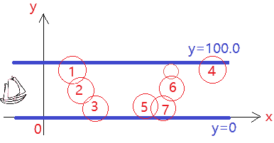

# 搜狗 2020 校招【研究】笔试（第二场）

## 1

编写 Naïve Bayes 分类模型对邮件文本进行分类，判断该邮件是不是垃圾邮件（二分类）。我们已经通过数据预处理，将原始的邮件文本数据转化为分类器可用的数据向量形式，具体：数据表示为整型数向量 x=(x1,x2,…,xd)。d 是数据特征向量的维数，每个输入数据样本的格式为:Label x1 x2 … xd

其中 Label 为 0 或者 1 的整型数字（0 表示正常邮件，1 表示垃圾邮件）；

        x1 x2 … xd 是离散化后的特征，表示为从 0 开始的自然数；

        维度 d 小于 20；

        如果 Label=?，则表示希望输出的预测类别值（需要预测的类别一定已在对应的训练数据中已经出现过）。

本题知识点

算法工程师 大数据开发工程师 搜狗 2020

讨论

[小王博士在马家沟](https://www.nowcoder.com/profile/610436372)

```cpp
import sys 
import math 

first_line =  sys.stdin.readline().rstrip().split('\t')
#M N d，M 是训练集的大小，N 是测试集的大小，d 是数据维数。
train_size = int(first_line[0])
test_size = int(first_line[1])

train_data = []
train_label = []
for i in range(train_size):
    line = sys.stdin.readline().rstrip().split('\t')
    line = [int(x) for x in line]
    train_data.append(line[1:])
    train_label.append(line[0])

test_data = []
for i in range(test_size):
    line = sys.stdin.readline().rstrip().split('\t')
    line = [int(x) for x in line[1:]]
    test_data.append(line)
#print(train_data, train_label, test_data)

def trainNB(train_data, train_label):
    train_size = len(train_data)
    num_feature = len(train_data[0])
    pAbusive = sum(train_label)/float(train_size)
    p0Num = [1] * num_feature
    p1Num = [1] * num_feature
    p0Denom = 2.0 
    p1Denom = 2.0 
    for i in range(train_size):
        if train_label[i] == 1:
            for j in range(num_feature):
                p1Num[j] += train_data[i][j]
            p1Denom += sum(train_data[i])
        else:
            for j in range(num_feature):
                p0Num[j] += train_data[i][j]
            p0Denom += sum(train_data[i])
    p1Vect = [math.log(x/p1Denom) for x in p1Num]
    p0Vect = [math.log(x/p0Denom) for x in p0Num]
    return p0Vect,p1Vect,pAbusive

def classifyNB(vec2Classify, p0Vec, p1Vec, pClass1):
    p1 = 0
    p0 = 0
    for i in range(len(vec2Classify)):
        p1 += vec2Classify[i] * p1Vec[i]
        p0 += vec2Classify[i] * p0Vec[i]

    p1  += math.log(pClass1)    
    p0  +=  math.log(1.0 - pClass1)
    if p1 > p0:
        return 1
    else: 
        return 0

p0V,p1V,pSpam = trainNB( train_data , train_label) 
for i in range(test_size):
    print(classifyNB( test_data[i] ,p0V,p1V,pSpam))

```

习惯了调库，自己手写真的麻烦，连 numpy 都不让用。。。

编辑于 2020-08-08 14:58:24

* * *

[易拉罐 201810071358498](https://www.nowcoder.com/profile/795277988)

这道题第一个测试用例有问题吧？（哭了）[?,2,8]答案显示是 0，我算出来是 1，死活想不通。

发表于 2020-07-23 00:32:42

* * *

## 2

本题分两问，第一问占 20 分，第二问占 10 分。一条小河（在笛卡尔坐标系中，用 y=0 和 y=100.0 表示其两岸），其中被敌人布了若干（**N** 个）电磁水雷，其感应半径为 **R** 。我方一只小船（不计体积和大小，看做一个点）只要和水雷的距离 **L <= R** 就会触发爆炸，那么（第 1 问）小船是否可以不被发现地闯过水雷阵？如果小船可以闯过水雷阵，那么（第二问）敌方最少还需要增补多少个（数量记为 **M**）引爆半径为 **D** 的新型水雷才能对我方小船实时封锁？

如上图，假如只有 1、2、3 三个水雷（圆圈代表其触发范围），那结论为“否”（无法闯过）；假如只有 4、5、6、7 四个水雷，那结论为“是”（可以闯过），如果新型水雷如上图和 6 号水雷相连的小圆，那么再需要 1 个就能封锁住小船了（M 等于 1）。

本题知识点

算法工程师 大数据开发工程师 搜狗 2020

讨论

[石郎](https://www.nowcoder.com/profile/181241898)

```cpp
import sys
from queue import PriorityQueue
import math

def is_pass(R, sorted_locs):
    q = []
    temp_y = 0
    book=[0]*len(sorted_locs)
    for i in range(len(sorted_locs)):
        if sorted_locs[i][1] <= R:
            book[i]=1
            q.append(i)
        else:
            break

    while len(q)>0:
        loc = q.pop(0)
        temp_y = max(temp_y,sorted_locs[loc][1] + R)
        if temp_y>=100.0:
            break
        for i in range(0,len(sorted_locs)):
            if book[i]==1:
                continue
            if ((sorted_locs[loc][0]-sorted_locs[i][0])**2+(sorted_locs[loc][1]-sorted_locs[i][1])**2)**0.5<=2*R:
                q.append(i)
                book[i]=1
            if sorted_locs[i][1]>sorted_locs[loc][1]+2*R:
                break
    if temp_y>=100:
        return 'N'
    return 'Y'

def counter1(R, sorted_locs,D):
    book = [0] * len(sorted_locs)
    q = PriorityQueue()
    temp_y = 0
    res_count= math.ceil(100/(2*D))
    for i in range(len(sorted_locs)):
        if sorted_locs[i][1] < R:
            q.put((0, i))
        else:
            diff= math.ceil((sorted_locs[i][1]-R)/(2*D))
            q.put((diff, i))
    while not q.empty():
        diff, loc = q.get()
        x,y= sorted_locs[loc]
        if y+R>temp_y:
            temp_y = max(temp_y,y + R)
            if temp_y<=100.0:
                res_count = min(res_count, diff + math.ceil((100 - y - R) / (2 * D)))
            else:
                res_count = min(res_count, diff)
            if temp_y >= 100.0:
                break

        if temp_y>=100.0:
            break
        book[loc]=1
        for i in range(len(sorted_locs)):
            if book[i]==1:
                continue
            if ((x - sorted_locs[i][0]) ** 2 + (
                    y - sorted_locs[i][1]) ** 2) ** 0.5 < 2 * R:
                q.put((diff,i))

            else:
                diff_new = math.ceil((((x - sorted_locs[i][0]) ** 2 + (
                            y - sorted_locs[i][1]) ** 2) ** 0.5 - 2 * R) / (2 * D))
                q.put((diff+diff_new,i))
    return res_count

for line in sys.stdin:
    inputs = line.split()
    N, R, D = int(inputs[0]), float(inputs[1]), float(inputs[2])
    locs = [(float(inputs[i]), float(inputs[i + 1])) for i in range(3, len(inputs), 2)]
    sorted_locs = sorted(locs, key=lambda x: x[1])
    res= is_pass(R,sorted_locs)
    if D==0 :
        print(res)
    else:
        if  res=='N':
            print(res)
        else:
            res= counter1(R,sorted_locs,D)
            print(res)

```

```cpp
其实这题就是宽度优先搜索，第一问是看能否搜到对边，第二问是看搜到对面中间需要加多少，注意需要记录以前访问过的，不然会一直循环导致超时，在代码中使用 book 标记访问过的点。Now，show my code！

```

 发表于 2020-09-27 08:38:52

* * *

[牛客 738412773 号](https://www.nowcoder.com/profile/738412773)

。

发表于 2020-08-30 09:38:53

* * *