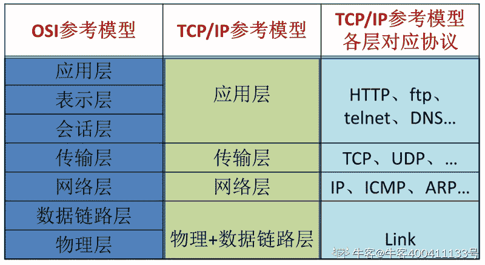
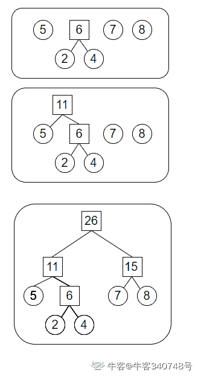

# 声网 2020 校招-通用 C++笔试题

## 1

计算机操作系统出现死锁的原因是什么?

正确答案: D   你的答案: 空 (错误)

```cpp
资源数大大少于进程数，或进程同时申请的资源数大大超过资源总数
```

```cpp
有多个封锁的进程同时存在
```

```cpp
一个进程进入死循环
```

```cpp
若干进程因竞争资源而无休止的等待着其他进程释放已占有的资源
```

本题知识点

C++工程师 声网 Agora 2020

讨论

[lemoko](https://www.nowcoder.com/profile/146566630)

Ｄ死锁的原因在于进程在等待其它进程占有的某些资源，而自身的资源又被其它进程等待着，造成了死循环

发表于 2020-08-24 20:45:25

* * *

[牛客 955503101 号](https://www.nowcoder.com/profile/955503101)

D

发表于 2020-09-24 17:57:06

* * *

[这是什么仨](https://www.nowcoder.com/profile/967354104)

的的 发

发表于 2020-08-27 08:54:56

* * *

## 2

操作系统中两个进程争夺同一个资源会发生什么情况？

正确答案: B   你的答案: 空 (错误)

```cpp
一定死锁或阻塞
```

```cpp
不一定死锁
```

```cpp
不会死锁
```

```cpp
以上说法都不对
```

本题知识点

C++工程师 声网 Agora 2020

讨论

[可乐星](https://www.nowcoder.com/profile/938722766)

B:不一定死锁解析：产生死锁的四个必要条件为（1）互斥条件 （2）不可剥夺条件 （3）请求与保持条件 （4）循环等待条件。 （1） 互斥条件：一个资源每次只能被一个进程使用。（2） 不剥夺条件:进程已获得的资源，在末使用完之前，不能强行剥夺。 （3） 请求与保持条件：一个进程因请求资源而阻塞时，对已获得的资源保持不放。（4） 循环等待条件:若干进程之间形成一种头尾相接的循环等待资源关系 

发表于 2020-08-28 22:43:36

* * *

[slash_man](https://www.nowcoder.com/profile/616138883)

对于 a 答案，还有可能是出现覆盖

发表于 2020-10-15 16:04:46

* * *

## 3

下列有关 NAT 叙述错误的是（ ）

正确答案: C   你的答案: 空 (错误)

```cpp
NAT 是英文“网络地址转换”的缩写
```

```cpp
址转换又称地址翻译，用来实现私有地址和公用网络地址之间的转换
```

```cpp
当内部网络的主机访问外部网络的时候，一定不需要 NAT
```

```cpp
地址转换的提出为解决 IP 地址紧张的问题提供了一个有效途径
```

本题知识点

C++工程师 声网 Agora 2020

讨论

[小郭(^ω^)](https://www.nowcoder.com/profile/788858857)

NAT（Network Address Translation，网络地址转换）是 1994 年提出的。当在专用网内部的一些主机本来已经分配到了本地 IP 地址（即仅在本专用网内使用的专用地址），但现在又想和因特网上的主机通信（并不需要加密）时，可使用 NAT 方法。 ***内部网络的主机想访问外部网络的时候，必须需要 NAT 路由器讲本地地址转为全球 IP 地址，才可以与因特网链接***

发表于 2020-08-22 04:24:21

* * *

## 4

假设 A 为抽象类，下列声明（ ）是正确的

正确答案: B   你的答案: 空 (错误)

```cpp
A fun(int);
```

```cpp
A*p;
```

```cpp
int fun(A);
```

```cpp
A obj;
```

本题知识点

C++工程师 声网 Agora 2020

讨论

[牛客 274646763 号](https://www.nowcoder.com/profile/274646763)

抽象类可以作为父类，想想父类指针指向子类对象

发表于 2020-09-02 15:14:37

* * *

[牛客 788615752 号](https://www.nowcoder.com/profile/788615752)

一个类可以说明多个纯虚函数，对于包含有纯虚函数的类被称为抽象类。一个抽象类只能作为基类来派生新类，不能说明抽象类的对象。因为抽象类中有一个或多个函数没有定义。也不能用作参数类型、函数返回值类型或显示类型转换，但可以说明指向类对象的指针（和引用），以支持运行时的多态性。A.fun(int);//错误，与抽象类声明无关 B.A*p;//正确 C.int fun(A);//错误，抽象类不能用作参数类型 D.A obj;//错误，不能说明抽象类的对象

发表于 2020-09-13 15:51:11

* * *

[伊利湖号](https://www.nowcoder.com/profile/677655062)

抽象类 A 不能实例化。

发表于 2020-08-24 10:36:53

* * *

## 5

若有以下程序段：

……

int a[]={4,0,2,3,1},i,j,t;

for(i=1;i<5;i++)

{

t=a[i];

j=i-1;

while(j>=0&&t>a[j])

{

a[j+1]=a[j];

--j;

}

a[j+1]=t;

}

……

则该程序段的功能是：      

正确答案: B   你的答案: 空 (错误)

```cpp
对数组 a 进行插入排序（升序）
```

```cpp
对数组 a 进行插入排序（降序）
```

```cpp
对数组 a 进行选择排序（升序）
```

```cpp
对数组 a 进行选择排序（降序）
```

本题知识点

C++工程师 声网 Agora 2020

讨论

[广州市民林先生](https://www.nowcoder.com/profile/241061362)

这个题很明显可以看出是插入排序，因为是通过元素后移的方式，空出位置进行插入。而至于降序，可以看到：t = a[i]，j = i - 1，while( j >= 0 && t > a[j])，也就是： a[i] > a[i - 1]的时候，进入循环体：a[j + 1] = a[j]，即让 a[i] = a[i - 1]，也就是让后面的数变成前面的数，而后面的数原本是较大的，因此是降序的

发表于 2020-08-30 17:00:36

* * *

## 6

下述有关网络分层说法错误的是？

正确答案: C   你的答案: 空 (错误)

```cpp
http --- 应用层
```

```cpp
ftp ---- 应用层
```

```cpp
ICMP --- 应用层
```

```cpp
802.2 --- 数据链路层
```

本题知识点

C++工程师 声网 Agora 2020

讨论

[小🐮想去腾讯](https://www.nowcoder.com/profile/400411133)



发表于 2020-10-22 11:39:10

* * *

[奋斗小强吧](https://www.nowcoder.com/profile/324744938)

ICMP 属于网络层协议

发表于 2020-08-21 15:55:59

* * *

[牛客 35 号](https://www.nowcoder.com/profile/58704111)

ICMP，IP 属于网络层协议

发表于 2020-10-02 14:30:33

* * *

## 7

test.c 文件中包括如下语句：

```cpp
#define INT_PTR int*
typedef int*int_ptr;
INT_PTR a,b;
int_ptr c,d;
```

文件中定义的四个变量，哪个变量不是指针类型？

正确答案: B   你的答案: 空 (错误)

```cpp
a
```

```cpp
b
```

```cpp
c
```

```cpp
d
```

```cpp
都是指针
```

```cpp
都不是指针
```

本题知识点

C++工程师 声网 Agora 2020

讨论

[拏云剑涯](https://www.nowcoder.com/profile/1249794)

INT_PTR 会被 int *直接替换，所以最终的结果是 int * a,b;由此可见 a 是指针，而 b 不是。

发表于 2020-08-20 11:31:01

* * *

[lemoko](https://www.nowcoder.com/profile/146566630)

int * a, b;  的含义是：创建一个 int 型指针 a 和一个 int 型变量 b；

编辑于 2020-08-24 20:52:40

* * *

[言 201904141050633](https://www.nowcoder.com/profile/998981358)

宏是字符串在编译器中的替换，所以 INT_PTR a,b;就直接变成了 int* a,b; b 就不是指针，主要没有用过 typedef，不过 EC++中有提到过 typedef 和类定义

发表于 2020-10-13 11:32:34

* * *

## 8

下列不属于 hash 碰撞解决方法的是（）。

正确答案: B   你的答案: 空 (错误)

```cpp
线性探测
```

```cpp
单旋转法
```

```cpp
二次探测
```

```cpp
拉链法
```

```cpp
双重散列
```

```cpp
多重散列
```

本题知识点

C++工程师 声网 Agora 2020

讨论

[李峭鹏](https://www.nowcoder.com/profile/488171917)

线性探测和二次探测的公式:Hi=(H(key)+di) MOD m i=1,2,…,k(k<=m-1)线性探测 di= 1,2,3,...;二次探测 di=1,-1,…k*k,-k*k(k<=m/2)拉链法就是用一个链表把 key 相同的 value 记录下来双重散列和多重散列就是第一个哈希公式冲突后再用第二个或者更多的哈希公式去算地址.

发表于 2020-08-25 18:08:13

* * *

## 9

tcp 三次握手创建连接，双方交互的报文中 SYN 和 ACK 的序列是什么样的（）

正确答案: A   你的答案: 空 (错误)

```cpp
SYN，SYN+ACK，ACK
```

```cpp
SYN，ACK，SYN，ACK
```

```cpp
SYN+ACK，ACK，SYN
```

```cpp
SYN，SYN，ACK
```

本题知识点

C++工程师 声网 Agora 2020

讨论

[shjk](https://www.nowcoder.com/profile/373582869)

A,初始状态已经确定，客户端向服务端请求服务，服务端肯定要回应，所以服务端就也要发送 syn 信号，以及 ACK 对客户端进行同步回应，接下来就是客户端对服务端 syn 的回应

发表于 2020-09-10 23:56:04

* * *

[^天机&二十五^](https://www.nowcoder.com/profile/7438824)

个人认为是 b 答案正确。先确认在发送建立连接的包，a 答案比较含糊不清的。被动请求者的 ack 一定在 syn 前边。答案是网络拥塞情况下，被动请求的 ack 丢失情况下出现这种情况的。三次握手变四次。三次握手是网络状态良好所以 ack 和 syn 一起发送。称为三次握手。但是 ack 一定在 syn 前边

发表于 2020-11-21 12:59:20

* * *

[steam_fight](https://www.nowcoder.com/profile/657092030)

TCP 三次握手：1、客户端向服务器发送 SYN J 请求，进入 SYN_SEND 状态；2、服务器收到客户端请求，返回 ACK J+1 和 SYN M 确认包，进入 SYN_RECV 状态；3、客户端接收到数据，发送 SYN M+1，同时进入 ESTABLISHED 状态

发表于 2020-09-28 10:50:01

* * *

## 10

下面代码会输出什么（）

```cpp
int main(int argc, char **argv)
{
    int a[4] = {1, 2, 3, 4};
    int *ptr = (int *)(&a + 1);
    printf("%d", *(ptr - 1));
}

```

正确答案: D   你的答案: 空 (错误)

```cpp
1
```

```cpp
2
```

```cpp
3
```

```cpp
4
```

本题知识点

C++工程师 声网 Agora 2020

讨论

[lemoko](https://www.nowcoder.com/profile/146566630)

&a+1 不是首地址+1，系统会认为加了一个整个 a 数组，偏移了整个数组 a 的大小。

发表于 2020-08-24 21:04:22

* * *

[牛客 233315688 号](https://www.nowcoder.com/profile/233315688)

加一的话，跳一行

发表于 2020-08-22 01:01:09

* * *

[牛客 340748 号](https://www.nowcoder.com/profile/340748)

打印一下

```cpp
void test7() {

        int a[4] = { 1, 2, 3, 4 };
        printf("a     = %p\n\n", a);

        int* ptr = (int*)(&a + 1);
        printf("ptr   = %p\n", ptr);
        printf("ptr+1 = %p\n", ptr+1);
        printf("ptr+2 = %p\n\n", ptr+2);

        printf("*(ptr - 1) = %d\n", *(ptr - 1));
        printf("*(ptr - 2) = %d\n", *(ptr - 2));
}
```

输出

```cpp
a     = 00BAF800

ptr   = 00BAF810
ptr+1 = 00BAF814
ptr+2 = 00BAF818

*(ptr - 1) = 4
*(ptr - 2) = 3
```

可以看出来，类型不同，指针加的字节数也不同。

发表于 2020-09-07 22:46:32

* * *

## 11

下面程序的输出是（）

```cpp
class A
{
public:
    void foo()
    {
        printf("1");
    }
    virtual void fun()
    {
        printf("2");
    }
};
class B: public A
{
public:
    void foo()
    {
        printf("3");
    }
    void fun()
    {
        printf("4");
    }
};
int main(void)
{
    A a;
    B b;
    A *p = &a;
    p->foo();
    p->fun();
    p = &b;
    p->foo();
    p->fun();
    A *ptr = (A *)&b;
    ptr->foo();
        ptr->fun();
    return 0;
}

```

正确答案: B   你的答案: 空 (错误)

```cpp
121434
```

```cpp
121414
```

```cpp
121232
```

```cpp
123434
```

本题知识点

C++工程师 声网 Agora 2020

讨论

[Dfnonor](https://www.nowcoder.com/profile/255311221)

指针 p 是类 A 的指针，而 A 类是 B 类的父类。使用 p 指针指向 B 类时，一般情况下同名成员都会指向它的父类元素的成员。而使用 virtural 关键字能指定成员函数为虚函数，这样父类的指针能引用到子类的同名函数。

发表于 2020-08-24 11:41:31

* * *

[牛客 274646763 号](https://www.nowcoder.com/profile/274646763)

即使对子类进行类型强转，还是父类指针指向子类对象

发表于 2020-09-02 15:19:46

* * *

[知人不评人](https://www.nowcoder.com/profile/730319140)

    这个题考察的知识点挺细的，做错的同学应该都是以为第三个函数调用调用的是 B 类的 foo 函数，其实不然，C++Primer 第五版 549 页里面有一段关于函数调用的解析过程的解释：**假设我们的调用是 p->mem()，通过指针调用成员函数，或者 obj.mem()，通过对象调用成员函数，编译器会做以下事情。1.首先确认 p 或 obj 的静态类型，编译器会首先在静态类型对应的类中寻找名为 mem 的成员函数（注意，编译器只是判断函数名字是否相同，而不管参数），如果没找到，就依次在直接基类中寻找，直到继承链的顶端，如果没找到，编译器就会报错，如果找到了，就到第二步。2.如果找到了这个成员函数，首先进行类型检查，判断调用是否合法，如果合法，就跳到第三步。3.如果这个函数是虚函数并且我们是通过指针或者引用调用的，那么就会根据对象的动态类型来判断调用虚函数的哪一个版本，如果不是虚函数或者我们是通过对象调用的，那么就执行常规的函数调用。**所以，按照上面的规则，第二个 p->foo()，p 的静态类型是 A*，所以按照第一步，现在 A 类中查找是否有 foo 函数，显然 A 类中有，第二步，也满足合法调用，第三步，由于 foo 不是虚函数，所以只是普通的函数调用，所以总结下来就是调用的 A 类的 foo 函数。

发表于 2022-03-22 23:10:04

* * *

## 12

下面数据结构能够支持随机的插入和删除操作、并具有较好的性能的是 ____。

正确答案: B   你的答案: 空 (错误)

```cpp
数组和链表
```

```cpp
链表和哈希表
```

```cpp
哈希表和队列
```

```cpp
队列和堆栈
```

```cpp
堆栈和双向队列
```

```cpp
双向队列和数组
```

本题知识点

C++工程师 声网 Agora 2020 前端工程师 途虎 2021

讨论

[牛客 133161785 号](https://www.nowcoder.com/profile/133161785)

排除队列和数组

发表于 2020-09-14 16:21:56

* * *

## 13

操作系统中关于竞争和死锁的关系下面描述正确的是？

正确答案: C   你的答案: 空 (错误)

```cpp
竞争一定会导致死锁
```

```cpp
死锁一定由竞争引起
```

```cpp
竞争可能引起死锁
```

```cpp
预防死锁可以防止竞争
```

本题知识点

C++工程师 声网 Agora 2020

讨论

[lemoko](https://www.nowcoder.com/profile/146566630)

造成死锁的原因：

1.竞争不可抢占资源

2.竞争可消耗资源

3.进程推进顺序不当

发表于 2020-08-24 21:08:46

* * *

## 26

计算 24 点是一种扑克牌益智游戏，随机抽出 4 张扑克牌，通过加(+)，减(-)，乘(*), 除(/)四种运算法则计算得到整数 24，本问题中，扑克牌通过如下字符或者字符串表示，其中，小写 joker 表示小王，大写 JOKER 表示大王： 

                   3 4 5 6 7 8 9 10 J Q K A 2 joker JOKER

本程序要求实现：输入 4 张牌，输出一个算式，算式的结果为 24 点。 

详细说明： 

1.运算只考虑加减乘除运算，没有阶乘等特殊运算符号，友情提醒，整数除法要当心； 2.牌面 2~10 对应的权值为 2~10, J、Q、K、A 权值分别为为 11、12、13、1； 3.输入 4 张牌为字符串形式，以一个空格隔开，首尾无空格；如果输入的 4 张牌中包含大小王，则输出字符串“ERROR”，表示无法运算； 4.输出的算式格式为 4 张牌通过+-*/四个运算符相连，中间无空格，4 张牌出现顺序任意，只要结果正确； 5.输出算式的运算顺序从左至右，不包含括号，如 1+2+3*4 的结果为 246.如果存在多种算式都能计算得出 24，只需输出一种即可，如果无法得出 24，则输出“NONE”表示无解。

本题知识点

C++工程师 声网 Agora 2020

讨论

[一个不愿透露姓名的奋斗比](https://www.nowcoder.com/profile/293741846)

就模拟就行了看了前面人没 ac 的代码，这边给一些可能的坑 1.看看回溯有没有完整 2.有没有输出 ERROR 之后又输出了 NONE3.有没有把除法运算按照 double 处理本来我也是 65% 我以为是 1，5，5，5 这种情况会出现  -1/5+5*5，但是并没有这个样例，而是我回溯的代码括号阔错了。。。下面是 AC 代码

```cpp
#include<bits/stdc++.h>
using namespace std;
//根据 k 的不同进行计算
double ff(double a,double b,int k){
    //cout<<"ff"<<endl;
    if (k == 0){
        return a+b;}
    if (k == 1){
        return a-b;}
    if (k == 2){
        return a*b;}
    if (k == 3){
        return a/b;}
}
//根据 k 的不同进行符号打印
string fff(int k){
    if (k == 0){
        return "+";}
    if (k == 1){
        return "-";}
    if (k == 2){
        return "*";}
    if (k == 3){
        return "/";}
}
//根据不同数字翻译牌的字符
string zz(int k){
    if (k == 13){
        return "K";}
    if (k == 12){
        return "Q";}
    if (k == 11){
        return "J";}
    if (k == 1){
        return "A";}
    else{
        return to_string(k);}
}
//计算=24 的可能数字
vector<int> helper(int a,int b,int c,int d){
    //cout<<"!!"<<endl;
    for (int i=0;i<4;i++){
        //cout<<"!!!"<<endl;
        for (int j=0;j<4;j++){
            for (int k=0;k<4;k++){

                double tmp = ff(ff(ff(double(a),double(b),k),double(c),j),double(d),i);
                //cout<<i<<" "<<j<<" "<<k<<" "<<tmp<<endl;
                if (abs(tmp - 24)<0.0001)
                    return {k,j,i};

            }}}
    return {};
}
//回溯情况，这里可以优化重复情况，但是 a 了就算了
vector<vector<int>> pl(vector<int> &nums){
    if (nums.size()==1){
        return {{nums[0]}};}
    vector<vector<int>> tmp ;
    for (int i=0;i<nums.size();i++){
        vector<int> tt;
        for (int j=0;j<i;j++){
            tt.push_back(nums[j]);
        }
        for (int j=i+1;j<nums.size();j++){
            tt.push_back(nums[j]);
        }
        //cout<<"tt.size()"<<tt.size()<<endl;
        auto t = pl(tt);
        for (auto j: t){
            j.insert(j.begin(),nums[i]);
            tmp.push_back(j);
        }
    }
    return tmp;

}

int main(){
    vector<string> a(4,"");
    for (int i=0;i<4;i++){
        cin>>a[i];
    }
    vector<int> aa(4,0);
    int ok = 1;
    int ii = -1;
    for (auto i:a){
        ii++;
        if (i == "J"){
            aa[ii] = 11;
        }
        else if(i == "Q"){
            aa[ii] = 12;
        }
        else if(i == "K"){
            aa[ii] = 13;
        }
        else if(i == "A"){
            aa[ii] = 1;
        }
        else if(i == "joker" || i == "JOKER"){
            cout<<"ERROR";
            ok = 0;
        }
        else{
            aa[ii] = stod(i);
        }
    }

    auto pailie = pl(aa);
    int chenggong=0;
    if (ok==1){
        for (auto i:pailie){
            auto ans= helper(i[0],i[1],i[2],i[3]);
            if (ans.size()>0){
                cout<<zz(i[0])+fff(ans[0])+zz(i[1])+fff(ans[1])+zz(i[2])+fff(ans[2])+zz(i[3])<<endl;
                chenggong = 1;
                break;

            }
        }

    if (chenggong == 0){
        cout<<"NONE"<<endl;
    }
    }

}

```

不得不说，python 用起来真香，只用考虑逻辑，不用考虑句法。。。 编辑于 2020-08-20 15:34:45

* * *

[Demian201907171620752](https://www.nowcoder.com/profile/763404578)

```cpp
#include <bits/stdc++.h>

using namespace std;

unordered_map<int, string> umap = {
    {1, "A"}, {2, "2"}, {3, "3"},   {4, "4"},  {5, "5"},  {6, "6"}, {7, "7"},
    {8, "8"}, {9, "9"}, {10, "10"}, {11, "J"}, {12, "Q"}, {13, "K"}};

void game24(vector<int>& num, string& item, int& total) {
    if (num.empty() && total == 24)
        return;
    else if (num.empty())
        return;
    for (int i = 0; i < num.size(); ++i) {
        int tmp = num[i];
        swap(num[i], *num.rbegin());
        num.pop_back();

        total += tmp;
        item = item + '+' + umap[tmp];
        game24(num, item, total);
        if (num.empty() && total == 24)
            return;
        item = item.substr(0, item.size() - (1 + umap[tmp].size()));
        total -= tmp;

        total -= tmp;
        item = item + '-' + umap[tmp];
        game24(num, item, total);
        if (num.empty() && total == 24)
            return;
        item = item.substr(0, item.size() - (1 + umap[tmp].size()));
        total += tmp;

        total *= tmp;
        item = item + '*' + umap[tmp];
        game24(num, item, total);
        if (num.empty() && total == 24)
            return;
        item = item.substr(0, item.size() - (1 + umap[tmp].size()));
        total /= tmp;

        if (total % tmp == 0) {
            total /= tmp;
            item = item + '/' + umap[tmp];
            game24(num, item, total);
            if (num.empty() && total == 24)
                return;
            item = item.substr(0, item.size() - (1 + umap[tmp].size()));
            total *= tmp;
        }
        num.push_back(tmp);
        swap(num[i], *num.rbegin());
    }

    return;
}

int main(){
    vector<string> nums(4,"");
    for(int i=0;i<4;++i){
        cin>>nums[i];
    }
    vector<int> num;
    for(int i=0; i<nums.size(); ++i){
        if(nums[i]=="A"){
            num.push_back(1);
        }else if(nums[i]=="J"){
            num.push_back(11);
        }else if(nums[i]=="Q"){
            num.push_back(12);
        }else if(nums[i]=="K"){
            num.push_back(13);
        }else if(nums[i]=="joker"||nums[i]=="JOKER"){
            cout << "ERROR" <<endl;
            return 0;
        }else{
            num.push_back(stoi(nums[i].c_str()));
        }
    }

    string item = "";
    for (int i = 0; i < num.size(); ++i) {
        int total = num[i];
        swap(num[i], *num.rbegin());
        num.pop_back();
        item += umap[total];
        game24(num, item, total);
        if (num.empty() && total == 24) {
            cout << item << endl;
            return 0;
        } else {
            num.push_back(total);
            swap(num[i], *num.rbegin());
            item = "";
        }
    }
    cout << "NONE" << endl;

    return 0;
}
```

类似于全排列。

发表于 2022-03-09 21:15:23

* * *

[牛客 577707708 号](https://www.nowcoder.com/profile/577707708)

```cpp
#include<iostream>
#include<cstring>
#include<cmath>
using namespace std;

bool visited[5]={0};
int num[5]={0};
int tempnum[5]={0};
char op[5]={0};
const string card[15]={"zero","A","2","3","4","5","6","7","8","9","10","J","Q","K"};

bool success=false;

void dfs(int level,double res)
{
    if(success)
        return;
    if(level==4&&fabs(res-24)<1e-5)
    {
        success=true;
        cout<<card[tempnum[0]];
        for(int i=1;i<4;i++)
            cout<<op[i]<<card[tempnum[i]];
        cout<<endl;
        return;
    }
    for(int i=0;i<4;i++)
    {
        if(!visited[i])
        {
            tempnum[level]=num[i];
            visited[i]=true;
            op[level]='+';
            dfs(level+1,res+num[i]);
            op[level]='-';
            dfs(level+1,res-num[i]);
            op[level]='*';
            dfs(level+1,res*num[i]);
            op[level]='/';
            dfs(level+1,res/(double)num[i]);
            tempnum[level]=0;
            visited[i]=false;
        }
    }
}

int main()
{
    string s[4];
    for(int i=0;i<4;i++)
        cin>>s[i];
    for(int i=0;i<4;i++)
    {
        if(s[i]=="joker"||s[i]=="JOKER")
        {
            cout<<"ERROR"<<endl;
            return 0;
        }
        else{
            switch(s[i][0]){
                case 'A':num[i]=1;break;
                case 'J':num[i]=11;break;
                case 'Q':num[i]=12;break;
                case 'K':num[i]=13;break;
                case '1':num[i]=10;break;
                default:num[i]=s[i][0]-'0';break;
            }
        }
    }

    for(int i=0;i<4;i++)
    {
        tempnum[0]=num[i];
        visited[i]=true;
        dfs(1,num[i]);

        //tempnum[0]=-num[i];
        //dfs(1,-num[i]);
        //样例没有负数，请不要取消注释。

        visited[i]=false;
        tempnum[0]=0;
    }
    if(!success)
        cout<<"NONE"<<endl;
    return 0;
}

```

简单的 DFS。各位大佬的思路应该都是正确的，主要是输出算式的格式，并不是输出权值，而是输出原来的牌（A,J,Q,K）。题干里给出的 1+2+3*4 有一定误导性，让人以为是输出权值 1 而不是 A。题也不需要考虑首项负数的情况，如-1/5+5*5,考虑了反而会出错吧。

发表于 2022-03-01 19:37:33

* * *

## 27

有 n 座摩天大楼等间距地排成了一排，你对从哪座摩天大楼的顶端欣赏风景这个问题很感兴趣。每一座摩天大楼都可以被抽象为一条在二维平面上的一条线段。你现在知道第 i 座大楼的高度为 hi ，对应在二维平面上就是(i , 0)到(i , hi)的一条线段。

你现在想到能看到最多楼顶的大楼去，从第 i 座大楼能看到第 j 座大楼当且仅当连接这两个楼顶的线段不与任何其他高楼对应的线段接触或相交。现在要请选择一座能看到最多其他楼顶的大楼。

本题知识点

C++工程师 声网 Agora 2020

讨论

[一个不愿透露姓名的奋斗比](https://www.nowcoder.com/profile/293741846)

这道题做的我头皮发麻，1.样例给了一行，然后我想破脑袋也不知道为啥是 4 一直算的是 5，又看了一遍发现第一个数不是楼高。2.看题的情景是高楼看风景，但是看约束条件，好像从下往上看楼顶也算。。。然后发现果然是这样，emm 行吧，去外滩上东方明珠干嘛，站在地上看见楼顶也算呗。。。。题目很简单就是斜率单项变化，python 代码交的，这里写一下 C++的代码许愿声网大大私聊我免笔试

```cpp
#include<bits/stdc++.h>
using namespace std;

int main(){
    int n;
    cin>>n;
    vector<int> a(n,0);
    for (int i=0;i<n;i++){
        cin>>a[i];
    }
    //cout<<a.size()<<" "<<a[13]<<endl;
    int res = 0;
    for (int i=0;i<n;i++){
        int ress= 0;
        int l = i-1;
        double ll1 = 100000000000000;
        while (l>=0){
            double kk =double((a[i]-a[l]))/double((i-l));
            if (kk<ll1){
                ll1 = kk;

                ress ++;

            }
            l --;
        }
        //cout<<i<<" "<<ress<<endl;
        int r = i+1;
        double rr1 = 100000000000000;
        while(r<n){
            double kk = double((a[i]-a[r]))/double((r-i));
            if (kk<rr1){
                rr1 = kk;

                ress ++;
                }
            r ++;

        }
        //cout<<i<<" "<<ress<<endl;

        res = max(res,ress);
    }
    cout<<res;
}

```

编辑于 2020-08-20 14:28:29

* * *

[小桥流水夜景美如画](https://www.nowcoder.com/profile/95751812)

用一个 vector<int> a 记录所有楼，对于 a[n]，n 和 n 左边结点之间直线的斜率，满足升序规律；n 和 n 右边结点之间的直线的斜率，也满足升序规律；当有结点直线的斜率不满足升序规律时，把这个点忽略；如果后面的结点依然满足升序，则能看见。请各位大佬批评指正：#include <iostream>
#include<vector>
using namespace std;
//
int Sort_func(vector<int> a, int n){
    int left = 0, right = 0;
    // 计算 a[n]左边能看到的数量
    if(n==0 || n ==1)
        left = n;
    else{
        double x1 = double(a[n] - a[n-1]);
        for(int i = 1; i<=n-1; i++){
            if (x1 < (double(a[n] - a[n-i-1]) / (i + 1))){
                left++;
                x1 = double(a[n] - a[n-i-1]) / (i + 1);
            }
        }
    }

    // 计算 a[n]右边能看到的数量
    if(n==a.size()-1)
        right = 0;
    else if(n ==a.size()-2)
        right = 1;
    else{
        double x2 = double(a[n]-a[n+1]);
        for(int i = 1; i<=a.size()-n-3; i++){
            if(x2 < (double(a[n]-a[n+i+1]) / (i+1))){
                right++;
                x2 = double(a[n]-a[n+i+1]) / (i+1);
            }
        }
    }
    return left + right;
}

int main()
{
    int n;
    vector<int> a(n, 0);
    while(cin>>n){
        int m;
        for(int i=0; i<n; i++){
            cin>>m;
            a[i] = m;
        }
        // 遍历每个结点的可见数量，求最大值
        int ans = 0;
        for(int i=0; i<n; i++){
            ans = max(ans, Sort_func(a, i));
        }
        cout<<ans<<endl;
    }
    return 0;
}

编辑于 2020-09-02 15:13:01

* * *

[ssrrss](https://www.nowcoder.com/profile/294453282)

模拟的时候需要仔细的考虑**遮挡**问题。以下是没有品位的解法。

```cpp
#include<iostream>
#include <algorithm>
using namespace std;

int solve(int s,int n,const double* v){
    int sum=0;
    double max_k=*max_element(v,v+ n)+1;
    double min_k=*min_element(v,v+ n)-*max_element(v,v+ n)-1;
    double k=max_k;
    for(int i=s-1;i>=0;i--){
        if ( (v[s]-v[i])/(s-i)<k ) {
            k=(v[s]-v[i])/(s-i);
            sum++;
        }
    }
    k=min_k;
    for(int i=s+1;i<n;i++){
        if ( (v[s]-v[i])/(s-i)>k ) {
            k=(v[s]-v[i])/(s-i);
            sum++;
        }
    }
    return sum;
}

int main()
{
    double v[1000];
    int n;
    cin>>n;
    for(int i=0;i<n;i++){
        cin>>v[i];
    }
    int m[1000];
    for (int i=0;i<n;i++){
        m[i]=solve(i,n,v);
    }
    int max=-1;
    for (int i=0;i<n;i++){
        if (max<m[i])max=m[i];
    }
    cout<<max<<endl;
    return 0;
}
```

发表于 2020-12-28 21:49:19

* * *

## 14

数组 a 的定义语句为“float a[3][4];”,下列（）是对数组元素不正确的引用方法。

正确答案: D   你的答案: 空 (错误)

```cpp
a[i][j]
```

```cpp
*(a[i]+j)
```

```cpp
*(*(a+i)+j)
```

```cpp
*(a+i*4+j)
```

本题知识点

C++工程师 声网 Agora 2020

讨论

[吴梦洁是我老婆](https://www.nowcoder.com/profile/223254415)

记住二维数组中元素 a[i][j]的地址为：a[i]+j=*(a+i)+j=&a[i][j]

发表于 2020-09-07 13:28:51

* * *

[有机牛](https://www.nowcoder.com/profile/299910910)

对于 a[row]，a 是一维数组的首地址，*(a+1) = a[1];对于 a[row][col],将其视为(a[row])[col],那么 a[row]就是(a[row])[col]的首地址，*(a[0] + 1) = a[0][1];那么对于(a[row]) [col]，a 代表什么呢？让我们变换一下：(a[row]) [col] = (*(a+row) )[col] =*(*(a+row) + col) 这样看，a[row]是不是很像一个指针数组，它的内部元素全部是指针，a[0]即指向第 0 行的指针，a[1]即指向第一行的指针。这样理解 a 也就比较容易了，可以把它当做数组 a[row]的首地址，即 a = &a[0]，于是乎 *(a+row) = a[row].

发表于 2020-08-25 16:58:45

* * *

[知人不评人](https://www.nowcoder.com/profile/730319140)

这个明明是一个数组的数组，数组元素还是数组，我不是很赞同答案。

发表于 2022-03-22 23:12:50

* * *

## 15

一棵完全二叉树第六层有 9 个叶结点（根为第一层），则结点个数最多有（）

正确答案: D   你的答案: 空 (错误)

```cpp
112
```

```cpp
111
```

```cpp
107
```

```cpp
109
```

本题知识点

C++工程师 声网 Agora 2020

讨论

[康斯坦丁 _s](https://www.nowcoder.com/profile/959653)

方法一:

根据二叉树的性质,第 i 层上的结点数最多为 2^i(i >= 0,所以第一层为 i=0)个,所以第六层的结点数最多为 2⁵=32 个,根据题意第六层有 9 个叶子结点,推测出还有第七层,所以第六层结点数减去 9 个叶子结点,剩下的 23 个结点都有左右子树,故第七层有 23*2=46 个结点,总的结点数=2⁰+2¹+2²+2³+2⁴+2⁵+46=109 个

方法二:

总结点数=七层总结点数-第六层叶子结点数*2=(2⁷-1)-9*2=109 个

发表于 2020-08-21 11:02:10

* * *

[韵阳月流](https://www.nowcoder.com/profile/145009839)

总结点数=七层总结点数-第六层叶子结点数*2=(2⁷-1)-9*2=109 个

发表于 2020-08-19 21:59:25

* * *

## 16

在 TCP/IP 参考模型中 TCP 协议工作在（）

正确答案: B   你的答案: 空 (错误)

```cpp
应用层
```

```cpp
传输层
```

```cpp
互连层
```

```cpp
主机-网络层
```

本题知识点

C++工程师 声网 Agora 2020

讨论

[牛客 152457467 号](https://www.nowcoder.com/profile/152457467)

传输层有两个传输协议：TCP(传输控制协议)和 UDP(用户数据报协议)。其中，TCP 是一个可靠的面向连接的协议，udp 是不可靠的或者说无连接的协议

发表于 2020-09-07 14:05:59

* * *

[Yans67](https://www.nowcoder.com/profile/2535295)

b

发表于 2020-09-06 12:48:35

* * *

## 17

```cpp
OSI（开放系统互联）参考模型的最低层是（）
```

正确答案: C   你的答案: 空 (错误)

```cpp
传输层
```

```cpp
网络层
```

```cpp
物理层
```

```cpp
应用层
```

本题知识点

C++工程师 声网 Agora 2020

讨论

[steam_fight](https://www.nowcoder.com/profile/657092030)

OSI 参考模型：（高到低）应用层，表示层，会话层，传输层，网络层，数据链路层，物理层。

发表于 2020-09-28 10:58:19

* * *

## 18

假设二叉排序树的定义是：1、若它的左子树不为空，则左子树所有节点均小于它的根节点的值；2、若右子树不为空，则右子树所有节点的值均大于根节点的值；3、它的左右子树也分别为二叉排序树。下列哪种遍历之后得到一个递增有序数列（）

正确答案: B   你的答案: 空 (错误)

```cpp
前序遍历
```

```cpp
中序遍历
```

```cpp
后序遍历
```

```cpp
广度遍历
```

本题知识点

C++工程师 声网 Agora 2020

讨论

[牛客 706501215 号](https://www.nowcoder.com/profile/706501215)

1．先（根）序遍历的[递归算法](https://baike.baidu.com/item/%E9%80%92%E5%BD%92%E7%AE%97%E6%B3%95)定义：

若二叉树非空，则依次执行如下操作：

⑴ 访问根结点；

⑵ 遍历左子树；

⑶ 遍历右子树。

2．中（根）序遍历的递归算法定义：

若二叉树非空，则依次执行如下操作：

⑴遍历左子树；

⑵访问根结点；

⑶遍历右子树。

3．后（根）序遍历得递归算法定义：

若二叉树非空，则依次执行如下操作：

⑴遍历左子树；

⑵遍历右子树；

⑶访问根结点。

除了先序遍历、中序遍历、后序遍历外，还可以对二叉树进行层序遍历。设二叉树的根节点所在层数为 1，层序遍历就是从所在二叉树的根节点出发，首先访问第一层的树根节点，然后从左到右访问第 2 层上的节点，接着是第三层的节点，以此类推，自上而下，自左至右逐层访问树的结点的过程就是层序遍历。

发表于 2020-09-14 06:58:43

* * *

[steam_fight](https://www.nowcoder.com/profile/657092030)

可以理解为左子树值发表于 2020-09-28 11:01:41

* * *

[临风回眸](https://www.nowcoder.com/profile/8074412)

二叉搜索树，中序遍历是从小到大

发表于 2020-08-19 14:20:28

* * *

## 19

下列代码的运行结果是（）

```cpp
int a[]={1,2,3,4};
int *b=a;
*b+=2;
*(b+2)=2;
b++; 
printf(“%d,%d\n”,*b,*(b+2));
```

正确答案: C   你的答案: 空 (错误)

```cpp
1,3
```

```cpp
1,2
```

```cpp
2,4
```

```cpp
3,2
```

本题知识点

C++工程师 声网 Agora 2020

讨论

[soohoo](https://www.nowcoder.com/profile/123184)

没有看到 b++

发表于 2020-09-11 14:37:40

* * *

[奋斗小强吧](https://www.nowcoder.com/profile/324744938)

*b+=2 等价于*b = *b+2，此时 a 数组变为{3,2,3,4}*(b+2) = 2 等价于 a[2] = 2，此时数组变为{3,2,2,4}

发表于 2020-08-21 16:13:39

* * *

## 20

假设用于通信的电文由 5 个字母组成，字母在电文中出现的频率分别为 2,4,5,7,8 根为第一层，用这 5 个字母设计哈弗曼树带权路径长度为（）

正确答案: A   你的答案: 空 (错误)

```cpp
58
```

```cpp
105
```

```cpp
96
```

```cpp
84
```

本题知识点

C++工程师 声网 Agora 2020

讨论

[牛客 340748 号](https://www.nowcoder.com/profile/340748)

构成赫夫曼树的步骤：

1)从小到大进行排序, 将每一个数据，每个数据都是一个节点 ， 每个节点可以看成是一颗最简单的二叉树

2)取出根节点权值最小的两颗二叉树

3)组成一颗新的二叉树, 该新的二叉树的根节点的权值是前面两颗二叉树根节点权值的和

4)再将这颗新的二叉树，以根节点的权值大小 再次排序， 不断重复 1-2-3-4 的步骤，直到数列中，所有的数据都被处理，就得到一颗赫夫曼树


不知道画得对不对。
拿出最小的 2 和 4，组合一颗新的二叉树，根节点为 6。
重新排序，得 5,6,7,8。
拿出最小的 5 和 6，组合一颗新的二叉树，根节点为 11。
重新排序，得 7，8，11。
拿出最小的 7 和 8，组合一颗新的二叉树，根节点为 15。
重新排序，得 11,15。
组合 11，15，根节点为 26。

所以我们发现，从根节点到达节点 2 的路径为 3，从根节点到达节点 4 的路径为 3，
从根节点到达节点 5，节点 7，节点 8 的路径为 2，  计算

```cpp
2*3+4*3+（5+7+8）*2 = 58
```

编辑于 2020-09-26 23:56:57

* * *

[支持小言](https://www.nowcoder.com/profile/389501147)

哈夫曼树带权路经计算方法：将树的节点值升序排序，由叶至根构建二叉树，每次选两个最小的节点连接，加法得到其父节点值。最终根节点权为 0，向叶子节点依次递增 1。这道题是 2*7+2*8+2*5+3*4+3*2=58

发表于 2020-08-27 11:51:18

* * *

## 21

在分时操作系统中，进程调度采用（）算法

正确答案: C   你的答案: 空 (错误)

```cpp
先来先服务
```

```cpp
最到优先权
```

```cpp
时间片轮转
```

```cpp
随机
```

本题知识点

C++工程师 声网 Agora 2020

讨论

[刀刀烈火](https://www.nowcoder.com/profile/837029934)

C

发表于 2020-10-16 21:55:38

* * *

[牛客 353792928 号](https://www.nowcoder.com/profile/353792928)

在分时系统中，采用时间片轮转法

发表于 2020-09-01 20:28:26

* * *

[牛客 233315688 号](https://www.nowcoder.com/profile/233315688)

分时调度

发表于 2020-08-22 01:05:41

* * *

## 22

32 位环境下,给定结构体

Struct A

{

Char t:4;

Char k:4;

Unsigned short i:8;

Unsigned long m;

};问 sizeof （ A ） =_____;

正确答案: C   你的答案: 空 (错误)

```cpp
7
```

```cpp
6
```

```cpp
8
```

```cpp
上述答案都不对
```

本题知识点

C++工程师 声网 Agora 2020

讨论

[Double_Li](https://www.nowcoder.com/profile/38215080)

对于结构体，每个成员都有自己独立的地址，他们同时存在，sizeof（struct）是内存对齐后所有成员长度的总和。在 32 位里，char 是 1，short 是 2，long 是 4

发表于 2020-08-22 18:08:56

* * *

[宁旧](https://www.nowcoder.com/profile/718596523)

一般遇到这种题我是这么理解的第一步：先看是 32 位还是 64 位，以本题为例，如果是 32 位，那么可以得到以下信息：(1)内存对齐方式是以 4 字节对齐（也就是说不够 4 字节就补满）；(2)指针是 4 字节（因为 32 位/8 比特=4 字节）第二步：就开始看数据类型，本题中有两个 char，那么就总共占 2 个字节；short 占 2 个字节，和前面的两个 char 一起正好是 4 字节（刚刚好不用补）；long 是 4 字节，也不用补，第三步：计算（这个计算结果一定是 4 字节的整数倍），一个填满的 4 字节+一个 long 的 4 字节=总共 8 字节。因此答案是 8 字节

发表于 2021-05-11 15:32:04

* * *

[牛客 733976669 号](https://www.nowcoder.com/profile/733976669)

所以都在分析，最后答案是多少？24？

发表于 2021-03-10 15:27:24

* * *

## 23

一个西瓜切三次，最多可被分成多少块?

正确答案: B   你的答案: 空 (错误)

```cpp
9
```

```cpp
8
```

```cpp
7
```

```cpp
6
```

本题知识点

C++工程师 声网 Agora 2020

讨论

[码娘](https://www.nowcoder.com/profile/898362090)

西瓜是三维球体 垂直水平面交叉切（两次） 再平行水平面横切（一次） 就有八块

发表于 2020-08-25 22:42:47

* * *

[大大大🍍](https://www.nowcoder.com/profile/70956794)

c'

发表于 2021-06-07 19:47:24

* * *

[牛客 176986860 号](https://www.nowcoder.com/profile/176986860)

每刀能切出两块，2³=8

发表于 2020-09-01 21:09:57

* * *

## 24

关于操作系统内存管理中堆与栈的下列描述，哪一项是错误的（）

正确答案: A   你的答案: 空 (错误)

```cpp
在栈中分配局部变量和全局变量
```

```cpp
栈上的空间是自动分配自动回收的
```

```cpp
堆获得的控件比栈更加灵活，但是容易产生内存碎片
```

```cpp
堆上的数据只要程序员不释放控件，就一直可以访问到
```

本题知识点

C++工程师 声网 Agora 2020

讨论

[Garrett](https://www.nowcoder.com/profile/1072988)

程序的内存分配 1、栈区（stack)——由编译器自动分配和释放，存放函数的参数，局部变量等。2、堆区（heap)——一般由程序员分配和释放，若程序员不释放，程序结束可能由 OS 回收。容易产生内存碎片。3、全局区(静态区)（static)——初始化的全局变量与静态变量在一块区域，未初始化的在相邻的另一块区域。程序结束后由系统释放 4、文字常量区——常量字符串放在这里，程序结束后由系统释放。5、程序代码区——存放函数体的二进制代码。

发表于 2020-10-22 08:58:59

* * *

[卡卡 32767](https://www.nowcoder.com/profile/91940564)

全局变量在静态存储区

发表于 2020-08-22 17:38:36

* * *

[牛客 353792928 号](https://www.nowcoder.com/profile/353792928)

A 错误。

发表于 2020-09-01 20:28:48

* * *

## 25

有 12 个球，外形相同，其中一个小球的质量与其他 11 个不同，给一个天平，最少次数把这个小球找出来并且求出这个小球是比其他的轻还是重（）  

正确答案: D   你的答案: 空 (错误)

```cpp
3
```

```cpp
5
```

```cpp
7
```

```cpp
4
```

本题知识点

C++工程师 声网 Agora 2020

讨论

[有机牛](https://www.nowcoder.com/profile/299910910)

这题的问法含糊不清，应该是最少次数必然能将球分出来。（如果是 “可能的最少次数“的话，随机情况下，随便拿两个球，可能一比就出来了需要 2 次）。我的解法是这样，但是最少是 4 次： 将 12 个求分为三组，每组 4 个，假设 A\B\C。1、第一次比较 A 和 B，假设 AB 相等，那么球必在 C 内。假设 AB 不等，那么比较 AC，如果 AC 相等，那么必然在 B 内，如果 AC 不等，那么必然在 A 内。这里最多 2 次必然确定球的位置和轻重。2、假设球在 C 内，（当然也可以是 A 或 B）将 C 拆成两组假设为 E、F，分两次比较 E 和 F 内的球，因为异常球的轻重已经在上一步确定，所以最多两次就可以将异常球确定出来。加起来一共是 4 次，必然可以确定异常球。

发表于 2020-08-25 16:17:49

* * *

[牛客 152457467 号](https://www.nowcoder.com/profile/152457467)

最少 3 次即可。[`blog.csdn.net/vie0405/article/details/11954135`](https://blog.csdn.net/vie0405/article/details/11954135)

发表于 2020-09-07 14:34:27

* * *

[烟火蛋糕](https://www.nowcoder.com/profile/393930852)

分成 4 堆，每堆 3 个，两堆相比，如果相同，就能找出正常重量，然后把正常重量和其他两堆比就能比出来大小，一共比三次；不相同的话也是一个道理，随便拿出来一堆，换一堆上去继续比，也是 3 次就出来了

发表于 2020-09-05 12:05:48

* * *