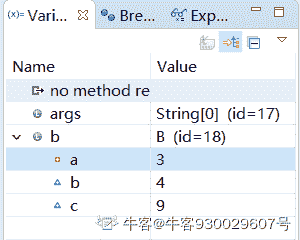
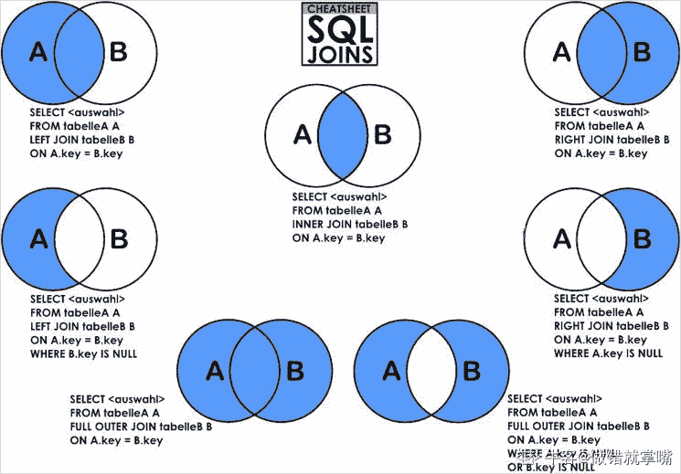
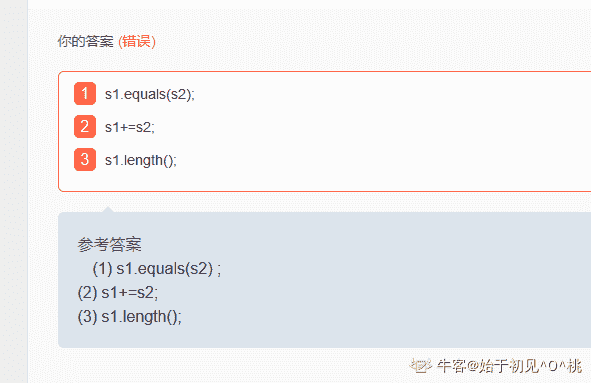
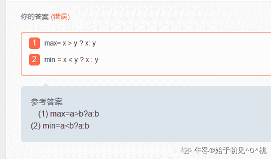
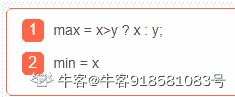
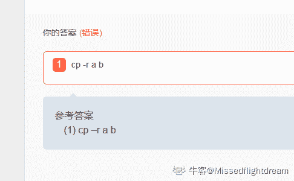

# 格力 2020 秋招后端岗笔试题

## 1

Java 编译器会将 Java 程序转换为（）

正确答案: A   你的答案: 空 (错误)

```cpp
字节码
```

```cpp
可执行代码
```

```cpp
机器代码
```

```cpp
以上所有选项都不正确
```

本题知识点

Java 工程师 C++工程师 PHP 工程师 golang 工程师 格力 2020

讨论

[Missedflightdream](https://www.nowcoder.com/profile/43043127)

.class 就是字节码文件

发表于 2020-09-24 20:23:08

* * *

[牛客 478811242 号](https://www.nowcoder.com/profile/478811242)

*   编译器将 Java 源代码编译成字节码 class 文件
*   类加载到 JVM 里面后，执行引擎把字节码转为可执行代码
*   执行的过程，再把可执行代码转为机器码，由底层的操作系统完成执行

发表于 2020-11-21 14:18:01

* * *

[牛客 566453595 号](https://www.nowcoder.com/profile/566453595)

啊啊啊

发表于 2020-09-15 16:33:51

* * *

## 2

给出如下代码:

```cpp
class Test{
     private int m;
         public static void fun() {
         // some code...
    }
}
```

正确答案: C   你的答案: 空 (错误)

```cpp
将 private int m 改为 protected int m
```

```cpp
将 private int m 改为 public int m
```

```cpp
将 private int m 改为 static int m
```

```cpp
将 private int m 改为 int m
```

本题知识点

Java 工程师 C++工程师 PHP 工程师 golang 工程师 格力 2020

讨论

[corn_zz](https://www.nowcoder.com/profile/646104202)

这下面的才是完整的题静态方法中，只能调用静态的方法或属性

**给出如下代码:**

**class Test{
private int m;
public static void fun() {
// some code...
}
}** 

**如何使成员变量 m 被函数 fun()直接访问?（）**

*   ```cpp
    将 private int m 改为 protected int m
    ```

*   ```cpp
    将 private int m 改为 public int m
    ```

*   ```cpp
    将 private int m 改为 static int m
    ```

*   ```cpp
    将 private int m 改为 int m

    ```

发表于 2020-11-12 13:05:57

* * *

[听风划过指尖](https://www.nowcoder.com/profile/529952021)

这题目不完整吗？什么意思？

发表于 2020-09-16 04:42:46

* * *

[清香的茉莉](https://www.nowcoder.com/profile/934893715)

我看了半天题，人都傻了，我在干什么？？？

发表于 2020-10-08 21:17:55

* * *

## 3

下列叙述正确的是   （  ）

正确答案: D   你的答案: 空 (错误)

```cpp
子类可以访问父类的所有成员。
```

```cpp
除了继承父类的成员以外，子类不可以创建自己的成员。
```

```cpp
当实例化子类时，父类的构造方法不被调用。
```

```cpp
子类只能访问父类的非私有成员。
```

本题知识点

C++工程师 格力 2020

讨论

[奋斗小强吧](https://www.nowcoder.com/profile/324744938)

这题感觉答案有问题啊，子类可以继承父类的私有成员，只是被屏蔽掉了，不能访问而已

发表于 2020-09-21 20:53:08

* * *

[正在奋斗的程序猿](https://www.nowcoder.com/profile/930029607)

实践是验证真理的唯一标准！！父类：A；成员变量 private int a=3；int b=4；子类：B；成员变量 int c=9；生成一个 B 的对象，并调试，结果如下：
可以继承私有变量但是不能访问！！！！

发表于 2020-10-19 19:41:12

* * *

[asdfjj](https://www.nowcoder.com/profile/1564107)

对于特殊的 private 成员。子类仍然可以继承，但是子类此时没有使用权，不能直接访问，这时候若需要访问，只能调用父类的 getter,setter 方法来访问与赋值。

发表于 2020-10-13 18:59:44

* * *

## 4

现有一个整型数组 a [4]，它的所有元素是（）

正确答案: B   你的答案: 空 (错误)

```cpp
a0.a1，a2.a3              
```

```cpp
a[0]，a[1]，a[2]，a[3]   
```

```cpp
 a [1]，a [2]，a[2]，a[4]
```

```cpp
a [0]，a[1]，a [2]，a[3]，a[4]
```

本题知识点

Java 工程师 C++工程师 PHP 工程师 golang 工程师 格力 2020

讨论

[牛牛的 java](https://www.nowcoder.com/profile/643019384)

根据 java 定义整形数组的方式：int a[ ] = new  int[4];int[]这个括号里面传入的整数才代表 a 数组的长度，而题目中的 a[4]里面的 4 是表示的 a 数组的索引可以为 4，那么所以我选择了答案 D，感觉出题者出题不严谨

发表于 2020-10-21 11:15:07

* * *

[—╄OVЁ天游忆‘绝恨★╯](https://www.nowcoder.com/profile/898222228)

错了第二次的路过

发表于 2021-01-07 17:22:31

* * *

[灵异人](https://www.nowcoder.com/profile/578995914)

4 是长度，下标从 0 开始

发表于 2020-09-24 08:53:54

* * *

## 5

正确输出的是（）

```cpp
intx=5,y=7;
void swap ()
{    int z;
     z=x;
     x=y;
   y=z
}
int main (void)
{   
    int x=3,y=8;   
    swap();
    printf ("%d,%d\n"，x,y) ;
}
```

正确答案: A   你的答案: 空 (错误)

```cpp
3,8
```

```cpp
8,3
```

```cpp
5,7
```

```cpp
7,5
```

本题知识点

Java 工程师 C++工程师 PHP 工程师 golang 工程师 格力 2020

讨论

[牛客 109391148 号](https://www.nowcoder.com/profile/109391148)

swap（）只是交换了全局定义的 x 和 y，对主函数重新定义的 x，y 不影响。注意看 x,y 定义的位置。

发表于 2020-09-18 20:01:17

* * *

[好好学习，天天向上的我](https://www.nowcoder.com/profile/461509883)

注意看这个 swap 方法是没有参数的，而且 swap 的实现是实现了全局变量 x 和 y 的交换，而在主方法中使用 swap，虽然创建了 x 和 y 变量。但是执行 swap 方法时不经过主方法中的局部变量，因为输出的还是未交换的局部变量

发表于 2020-10-22 10:10:15

* * *

[牛客 367066614 号](https://www.nowcoder.com/profile/367066614)

陷阱题，没主意参数传递。

发表于 2020-11-07 20:51:03

* * *

## 6

下列关于 B/S 架构软件与 C/S 架构软件的区别描述错误的是？（）

正确答案: D   你的答案: 空 (错误)

```cpp
B/S 属于 C/S，浏览器只是特殊的客户端；
```

```cpp
C/S 可以使用任何通信协议，而 B/S 这个特殊的 C/S 架构规定必须实现 HTTP 协议；
```

```cpp
C/S 架构的劣势还有高昂的维护成本且投资大
```

```cpp
C/S 架构维护和升级方式简单
```

本题知识点

Java 工程师 C++工程师 PHP 工程师 golang 工程师 格力 2020

讨论

[GoodLuck·HQ](https://www.nowcoder.com/profile/400518272)

C/S 和 B/S 结构优势与劣势 1、C/S 架构优势：  数据的储存管理功能较为透明。劣势：  C/S 架构的劣势是高昂的维护成本且投资大。2、B/S 架构优势：  维护和升级方式简单。成本降低，选择更多。 劣势：应用服务器运行数据负荷较重。

编辑于 2020-10-07 16:49:40

* * *

[鹿与折耳猫](https://www.nowcoder.com/profile/240472013)

一、C/S 优点： 1、C/S 架构的界面和操作可以很丰富 2、安全性能容易保证，实现多层认证 3、因为一层交互，因此响应速度较快 缺点： 1、适用面窄，通常用在局域网中 2、用户群固定。由于程序安装需要安装才能使用，因此不适合面向不可知的用户 3、维护成本高，发生一次升级，在所有客户端程序都需要改变 二、B/S 优点： 1、客户端无需安装，有 Web 浏览器即可。 2、B/S 架构可以直接放在广域网上，通过一定的权限控制实现多客户访问的目的，交互性较强。 3、B/S 架构无需升级多个客户端，升级服务器即可。 缺点： 1、在跨浏览器上，BS 架构不尽如人意。 2、表现要达到 CS 程序的程度需要花费不少精力。 3、在速度和安全性上需要花费巨大的设计成本，这是 BS 架构的最大问题。 4、客户端服务器端的交互是请求-响应模式，通常需要刷新页面，这并不是客户乐意看到的。（在 Ajax 风行后此问题得到了一定程度的缓解）

编辑于 2021-03-08 09:00:10

* * *

[？@201905181624998](https://www.nowcoder.com/profile/839353320)

c/s:成本相对高、跨平台相对难、通常需要安装,但体验相对好、性能相对高、定制性相对高。

b/s：

成本相对低、跨平台性相对好、且不用安装,但体验相对弱、性能相对弱、定制性相对弱，功能当然也相对弱，它只能调用 browser 所开放的接口，不是系统级的。

 发表于 2020-11-19 22:48:28

* * *

## 7

下面关于系统调用的描述中,错误的是()

正确答案: B   你的答案: 空 (错误)

```cpp
系统调用把应用程序的请求传输给系统内核执行
```

```cpp
系统调用中被调用的过程运行在”用户态”中
```

```cpp
利用系统调用能够得到操作系统提供的多种服务
```

```cpp
是操作系统提供给编程人员的接口
```

本题知识点

Java 工程师 C++工程师 PHP 工程师 golang 工程师 格力 2020

讨论

[LukaModric](https://www.nowcoder.com/profile/1556300)

用户调用在用户态执行，系统调用在内核态执行

发表于 2020-10-12 15:05:38

* * *

[在下蜗牛小侠](https://www.nowcoder.com/profile/631919985)

```cpp
我的理解是系统调用中被调用的过程运行在“管态”中，被用户调用才是“用户态（目态）”，由系统调度的一般都是“管态”
```

发表于 2020-09-17 09:17:02

* * *

[掘螺姑娘](https://www.nowcoder.com/profile/5986103)

用户空间与系统空间所在的内存区间不一样，同样，对于这两种区间，CPU 的运行状态也不一样。 在用户空间中，CPU 处于"用户态"；在系统空间中，CPU 处于"系统态"。

发表于 2020-10-08 19:56:50

* * *

## 8

设已经有 A,B,C,D4 个类的定义，程序中 A,B,C,D 析构函数调用顺序为？

```cpp
C c;
void main()
{
    A*pa=new A();
    B b;
    static D d;
    delete pa;
} 
```

正确答案: B   你的答案: 空 (错误)

```cpp
A B C D
```

```cpp
A B D C
```

```cpp
A C D B
```

```cpp
A C B D
```

本题知识点

Java 工程师 C++工程师 PHP 工程师 golang 工程师 格力 2020

讨论

[Soccer,soccer,soccer!](https://www.nowcoder.com/profile/396822396)

设已经有 AB,C,D4 个类的定义，程序中 ABCD 析构函数调用顺序为?首先一个个的分析
对于类 A,是建立在堆上的对象指针 pa,手动释放
对于类 B,是建立在栈上的对象 eb, main 函数结束就释放
对类 C 在静态存储区创建了一个对象 c 程序结束时候释放
对类 D 也是在静态存储区建立对象 d 但是局部变量程序结束时候释放析构函数调用顺序
先调用 A 的析构因为 delete pa.A
再释放栈上的对象 b
关键看 CD 的顺序
c 是全局对象对它的初始化是在 main 函数之前所以析构时候要放在最后也就是先析构 d,然后再析构 c

发表于 2020-10-10 20:54:27

* * *

[听风划过指尖](https://www.nowcoder.com/profile/529952021)

有些忘了哈，delete 肯定先析构，然后函数内部声明的这个析构，最后全局域对象和静态对象按后声明的先析构？求大佬指教是不是这样。

发表于 2020-09-16 04:48:31

* * *

[Missedflightdream](https://www.nowcoder.com/profile/43043127)

先构造的后析构，后构造的对象有可能依赖于*先构造的*对象,如果*先构造的*对象先*析构*了,*后*构造的对象就依赖于一个无效的空间。

发表于 2020-09-24 20:37:18

* * *

## 9

mysql 中，结果集满足联结条件。该联接是（）

正确答案: A   你的答案: 空 (错误)

```cpp
内连接
```

```cpp
外连接
```

```cpp
左连接
```

```cpp
右连接
```

本题知识点

Java 工程师 C++工程师 PHP 工程师 golang 工程师 格力 2020

讨论

[刘凡 201904031801358](https://www.nowcoder.com/profile/663528809)

内连接：分为等值连接（连接条件中的值相等）、非等值连接（连接条件中通过非等于号得出结果）、自连接（连接的两个表是同一个），只有满足连接条件的记录才会被包含在查询结果中左连接，左表的数据完全匹配，如果右表中没有数据和它对应，如果是这种情况，就用 null 补充右表中的数据右连接,右表的数据完全匹配，如果左表中没有数据和它对应，如果是这种情况，就用 null 补充左表中的数据

发表于 2020-09-30 00:34:51

* * *

[做错就掌嘴](https://www.nowcoder.com/profile/563768122)



发表于 2020-11-15 09:26:41

* * *

[不负韶华不负卿](https://www.nowcoder.com/profile/877481083)

这是内连接

发表于 2020-09-21 08:36:45

* * *

## 10

```cpp
int left = 0;                                                                       
int right = nums.length - 1;                                      
int mid = left + (right - left) / 2;                      
while(left < right) {
  if (nums[mid] < target) {
    left = mid + 1;                                                        
  } else if (nums[mid] >= target) {
    right = mid;                                                             
  }
  mid = left + (right - left) / 2;
}
return mid;
```

已知有序序列 b c d e f g q r s t,则在二分查找使用如上代码查找关键字 b 的过程中，先后进行比较的关键字依次是多少?()

正确答案: B   你的答案: 空 (错误)

```cpp
f  d   b
```

```cpp
f  d  c  b
```

```cpp
f  c  b
```

```cpp
f  c  d  b
```

本题知识点

Java 工程师 C++工程师 PHP 工程师 golang 工程师 格力 2020

讨论

[NCHUS17207214 高扬](https://www.nowcoder.com/profile/7646393)

二分当遇到偶数时，要么用 n / 2 + 1 定位，要么用 n / 2 - 1 定位，但是不管用哪一种，程序从始至终都是那一种，假如用 n / 2 + 1，那么顺序将会是 g, d, c, b 假如使用 n / 2 - 1，那么顺序将会是 f, c, b

发表于 2020-10-27 19:08:59

* * *

[肖宇亮](https://www.nowcoder.com/profile/8553797)

难道 2 分还有固定写法？ 我就喜欢定位 n/2+1 不行吗

发表于 2020-09-22 14:08:12

* * *

[牛客我是 9527](https://www.nowcoder.com/profile/748344370)

应该多选，题目是死的，代码是活的。

发表于 2020-10-18 11:31:22

* * *

## 11

执行以下程序段后：x =1,  y =2 的值是

```cpp
int x = 5, y=5;
y = ++x * --y;
```

你的答案 (错误)

12 参考答案 (1) 6
(2) 24

本题知识点

C++工程师 格力 2020

讨论

[半卷](https://www.nowcoder.com/profile/587210999)

只有我看到了有空格吗？

发表于 2020-09-21 18:36:25

* * *

[在下蜗牛小侠](https://www.nowcoder.com/profile/631919985)

前置++或-- 的优先级别 比 * 要高，不行就查一下运算符优先级表

| 优先级 | 运算符 | 名称或含义 | 使用形式 | 结合方向 | 说明 |
| 1 | [] | 数组下标 | 数组名[常量表达式] | 左到右 |  |
| () | 圆括号 | （表达式）/函数名(形参表) |  |
| . | 成员选择（对象） | 对象.成员名 |  |
| -> | 成员选择（指针） | 对象指针->成员名 |  |
| ++ | 后置自增运算符 | ++变量名 | 单目运算符 |
| -- | 后置自减运算符 | --变量名 | 单目运算符 |
| 2 | - | 负号运算符 | -表达式 | 右到左 | 单目运算符 |
| (类型) | 强制类型转换 | (数据类型)表达式 |  |
| ++ | 前置自增运算符 | 变量名++ | 单目运算符 |
| -- | 前置自减运算符 | 变量名-- | 单目运算符 |
| * | 取值运算符 | *指针变量 | 单目运算符 |
| & | 取地址运算符 | &变量名 | 单目运算符 |
| ! | 逻辑非运算符 | !表达式 | 单目运算符 |
| ~ | 按位取反运算符 | ~表达式 | 单目运算符 |
| sizeof | 长度运算符 | sizeof(表达式) |  |
| 3 | / | 除 | 表达式/表达式 | 左到右 | 双目运算符 |
| * | 乘 | 表达式*表达式 | 双目运算符 |
| % | 余数（取模） | 整型表达式/整型表达式 | 双目运算符 |
| 4 | + | 加 | 表达式+表达式 | 左到右 | 双目运算符 |
| - | 减 | 表达式-表达式 | 双目运算符 |
| 5 | << | 左移 | 变量<<表达式 | 左到右 | 双目运算符 |
| >> | 右移 | 变量>>表达式 | 双目运算符 |
| 6 | > | 大于 | 表达式>表达式 | 左到右 | 双目运算符 |
| >= | 大于等于 | 表达式>=表达式 | 双目运算符 |
| < | 小于 | 表达式<表达式 | 双目运算符 |
| <= | 小于等于 | 表达式<=表达式 | 双目运算符 |
| 7 | == | 等于 | 表达式==表达式 | 左到右 | 双目运算符 |
| != | 不等于 | 表达式!= 表达式 | 双目运算符 |
| 8 | & | 按位与 | 表达式&表达式 | 左到右 | 双目运算符 |
| 9 | ^ | 按位异或 | 表达式^表达式 | 左到右 | 双目运算符 |
| 10 | &#124; | 按位或 | 表达式&#124;表达式 | 左到右 | 双目运算符 |
| 11 | && | 逻辑与 | 表达式&&表达式 | 左到右 | 双目运算符 |
| 12 | &#124;&#124; | 逻辑或 | 表达式&#124;&#124;表达式 | 左到右 | 双目运算符 |
| 13 | ?: | 条件运算符 | 表达式 1? 表达式 2: 表达式 3 | 右到左 | 三目运算符 |
| 14 | = | 赋值运算符 | 变量=表达式 | 右到左 |  |
| /= | 除后赋值 | 变量/=表达式 |  |
| *= | 乘后赋值 | 变量*=表达式 |  |
| %= | 取模后赋值 | 变量%=表达式 |  |
| += | 加后赋值 | 变量+=表达式 |  |
| -= | 减后赋值 | 变量-=表达式 |  |
| <<= | 左移后赋值 | 变量<<=表达式 |  |
| >>= | 右移后赋值 | 变量>>=表达式 |  |
| &= | 按位与后赋值 | 变量&=表达式 |  |
| ^= | 按位异或后赋值 | 变量^=表达式 |  |
| &#124;= | 按位或后赋值 | 变量&#124;=表达式 |  |
| 15 | , | 逗号运算符 | 表达式,表达式,… | 左到右 | 从左向右顺序运算 |

++x 和--y,都是使用前自增 1 或自减 1，那么++x 之后，x = 6,--y 之后，y = 4,那么 y = ++x * - -y = 6 * 4 = 24

发表于 2020-09-17 09:29:24

* * *

[Rovibin](https://www.nowcoder.com/profile/488926937)

* - -y 又不是  --y 能 24?

发表于 2020-09-16 16:11:31

* * *

## 12

对于下列描述，各写出一条语句完成要求的任务
（1）比较 s1 中的串和 s2 中的串的内容的相等性；1
（2）用+=向串 s1 附加串；2
（3）判断 s1 中串的长度；3
(目前填空题是字符串完全匹配，答案仅供参考)

你的答案 (错误)

123 参考答案 (1) s1.equals(s2) ;
(2) s1+=s2;
(3) s1.length();

本题知识点

Java 工程师 C++工程师 PHP 工程师 golang 工程师 格力 2020

讨论

[始于初见^O^桃](https://www.nowcoder.com/profile/1111943)



发表于 2020-09-25 09:36:52

* * *

[codersnake](https://www.nowcoder.com/profile/2227375)

有问题 第二个也没有说明拼接什么字符串呀

发表于 2020-09-28 18:30:25

* * *

[你男朋友、](https://www.nowcoder.com/profile/236327553)

不打分号全错。。

发表于 2020-10-27 18:50:21

* * *

## 13

 SQL 的 SELECT 语句中，"HAVING 条件表达式"用来筛选满足条件的 1

你的答案 (错误)

1 参考答案 (1) 分组

本题知识点

Java 工程师 C++工程师 PHP 工程师 golang 工程师 格力 2020

讨论

[在下蜗牛小侠](https://www.nowcoder.com/profile/631919985)

SQL 的 SELECT 语句中 HAVING 短语要结合 GROUP BY 使用，用来进一步限定满足分组条件的元组

发表于 2020-09-17 09:31:11

* * *

[牛客 337128199 号](https://www.nowcoder.com/profile/337128199)

group by.... having... 分组查询使用

发表于 2020-12-25 23:52:10

* * *

[yasin_zhou](https://www.nowcoder.com/profile/125258362)

group by ... having...;分组查询使用。

发表于 2020-12-02 22:38:17

* * *

## 14

设 x,y，max,min 均为 int 型变量，x、y 已赋值。用三目条件运算符求 x、y 的最大值和最小值，并分别赋给变量 max 和 min,这两个赋值语句分别是 1 和 2。(填空题目前是字符串完全匹配，答案仅仅是参考)

你的答案 (错误)

12 参考答案 (1) max=x>y?x:y
(2) min=x

本题知识点

Java 工程师 C++工程师 PHP 工程师 golang 工程师 格力 2020

讨论

[始于初见^O^桃](https://www.nowcoder.com/profile/1111943)



发表于 2020-09-25 09:37:22

* * *

[牛客 735478075 号](https://www.nowcoder.com/profile/735478075)

答案错了，哪来的 a 和 b，而且答案也不严谨，加上=号也是对的

发表于 2020-09-16 18:34:08

* * *

[牛客 918581083 号](https://www.nowcoder.com/profile/918581083)

第 2 问写的都给我吞了？

发表于 2020-11-03 20:48:33

* * *

## 15

将 a 下所有目录和文件复制到 b：1 (目前填空题是字符串完全匹配，答案仅供参考)

你的答案 (错误)

1 参考答案 (1) cp –r a b

本题知识点

Java 工程师 C++工程师 PHP 工程师 golang 工程师 格力 2020

讨论

[牛客 101353767 号](https://www.nowcoder.com/profile/101353767)

懵了，原来用 Linux 命令，我他妈以为用 Java 编程

发表于 2020-11-06 11:39:37

* * *

[圆柱马克杯](https://www.nowcoder.com/profile/819521458)

没有写明是用什么 OS 的命令，而且 a 和 b 是两个绝对目录吧？cp -r 是复制指定目录的全部文件，所以 cp -r a b。

发表于 2020-09-23 17:23:27

* * *

[Missedflightdream](https://www.nowcoder.com/profile/43043127)

这是哪里错了？大佬指正一下

发表于 2020-09-24 20:42:56

* * *

## 16

请简述冒泡排序原理

你的答案

本题知识点

Java 工程师 C++工程师 PHP 工程师 golang 工程师 格力 2020

讨论

[皮囊 201907120953195](https://www.nowcoder.com/profile/367210163)

以升序为例：从第 0 个数开始，将相邻两个位置的数据进行比较，如果后面的数据小于前面的数据，则交换它们的位置，最后最大的数会放在数据的末尾。时间复杂度为 O(n²)，空间复杂度为 O(1)

```cpp
		for (int i = 0; i < arr.length; i++) {
			for (int j = 0; j < arr.length-i-1; j++) {
				if (arr[j]>=arr[j+1]) {
					int temp=arr[j];
					arr[j]=arr[j+1];
					arr[j+1]=temp;
				}
			}
		}
```

发表于 2020-09-18 19:42:56

* * *

[牛客 326090204 号](https://www.nowcoder.com/profile/326090204)

每个元素依次和其他元素比较大小,最值放一边.比较过的就不用比了.不用和自己比.

发表于 2020-10-28 19:43:49

* * *

[🐕旺卡](https://www.nowcoder.com/profile/804507757)

冒泡排序就是比较相邻的两个元素,如果前面大就交换他们, 这样每次较大的数就会慢慢向后移动,就像冒泡一样

发表于 2020-11-21 21:29:54

* * *

## 17

简述线程及多线程.

你的答案

本题知识点

Java 工程师 C++工程师 PHP 工程师 golang 工程师 格力 2020

讨论

[量身定做 20191109234766](https://www.nowcoder.com/profile/235932383)

线程是进程内部开辟出来的相互独立的运行流程。各自相互隔离。多线程就是在一个进程内部同时有多个线程在运行，这个时候需要如果不进行合理的线程控制，很可能导致执行结果的不确定性，所以很多时候需要加锁来控制线程。还有就是开辟线程其实很耗费 cpu 资源的，而且线程上下文切换也耗费资源。在需要多个任务并发执行的情况下使用线程可以提高响应速度。在响应式网络请求，如 springboot webflux 中也是基于线程，开辟一个独立于 application 的线程，在微服务中可以最大限度节省服务器入口的线程。

发表于 2020-09-16 10:29:00

* * *

[齐落](https://www.nowcoder.com/profile/522501596)

一个程序在执行的过程中，内部会存在多个线程并发执行。线程的生命周期有五种状态，新建，就绪，执行，阻塞，以及消亡。线程的新建有四种方式，继承 Thread 类，实现 Runnable 接口，实现 Callable 接口，使用线程池。就绪，当执行线程的实例执行 start（）方法之后就处于就绪状态，此时等待分配 CPU。执行，获取 CPU 之后线程就处于执行状态。阻塞，当线程想访问某一个资源的时候，该资源被占用，此时当前线程就阻塞了，释放了 CPU。线程正常执行结束，便消亡了。

发表于 2020-11-13 14:58:04

* * *

[牛客 241963246 号](https://www.nowcoder.com/profile/241963246)

线程是计算机调度的最小单位。正常情况下，一个程序只有一个线程。称为主线程。 当处理一个耗时的动作（读取串口数据），或者不知道什么时候结束的动作时（网络通讯），需要创建的新的线程。 当多个线程访问同一个变量时，会发生异常实现。有效的方式时，进行互斥动作，一次只能有一个线程去访问这个变量。比如：互斥锁和信号量。也有条件变量一说。

发表于 2020-12-14 10:43:34

* * *