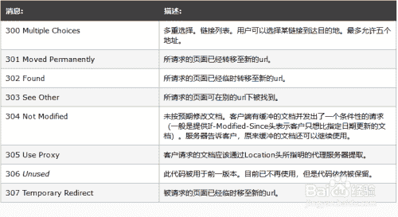

# 格力 2020 秋招前端岗笔试题

## 1

如何为所有<h1>添加背景色（）

正确答案: B   你的答案: 空 (错误)

```cpp
h1.all {background-color: #111111;}
```

```cpp
h1 {background-color: #111111;}
```

```cpp
all.h1 {background-color: #111111;}
```

```cpp
都不对
```

本题知识点

前端工程师 格力 2020

讨论

[ZEOPrear](https://www.nowcoder.com/profile/926215909)

服了 乍一眼根本不知道这是啥   楞了好几秒才发现是 CSS

发表于 2020-09-17 01:06:05

* * *

[自由逐风](https://www.nowcoder.com/profile/496356846)

我还以为这是啥杜撰出来的 js 语法，想都没想就。。。。

发表于 2022-02-15 20:18:23

* * *

## 2

JS 定义方法不正确的是（）

正确答案: D   你的答案: 空 (错误)

```cpp
function a := function(){};
```

```cpp
var a() = function{};
```

```cpp
var string:a = (){};
```

```cpp
都不正确
```

本题知识点

前端工程师 格力 2020

讨论

[HeroHaoJIe](https://www.nowcoder.com/profile/377450739)

**函数的三种定义方式：**1.自定义函数：function name(){}2.匿名函数：var  fn = function(){}3.构造函数：var f = new function(){}

发表于 2020-09-18 17:49:49

* * *

[落魄的寄生虫](https://www.nowcoder.com/profile/508781343)

越简单的题越容易错。。。两道选择都带有 : 还以为真的有这种定义方式只是自己不知道。。。想太多就容易犯错函数自定义的三种方式：1\. 函数声明式：需给函数命名，可声明提前    function 函数名 () {}
2\. 函数表达式/匿名函数：无需给函数命名，不可声明提前（推荐）    var 变量名 = function () {};
3\. 构造函数：    var 函数名 = new Function();
补充：4\. 立即执行函数：    (function () {}) ();    //推荐    (function () {} ());
    !function () {} ();
5\. 箭头函数：ES6 新增    没有参数时：
        ( ) => {  }
    只有一个参数时：
        参数 => {  }
        (单一参数) => {  }
    多参数时：
        (参数 1，参数 2，...，参数 n) => {  }        (参数 1，参数 2，...，参数 n) => 表达式    
//相当于 (参数 1，参数 2，...，参数 n) => {return 表达式} 前三种方式区别：1\. 作用域：函数声明式和函数表达式使用的是局部变量，而 Function()构造函数是全局变量；2\. 执行效率： Function()构造函数的效率要低于其他两种，尤其在循环体中，因为构造函数每执行一次都要重新编译并且生成新的函数对象；3\. 加载顺序：函数声明式在 JavaScript 编译时就加载到作用域中，而其他两种则是在代码执行时才加载，如果在定义之前调用它则会返回 undefined

发表于 2020-11-26 15:35:56

* * *

[牛客 405684799 号](https://www.nowcoder.com/profile/405684799)

题目有问题，问的是 js 方法不正确的是，那么答案四都不正确，那么说明答案一也不正确

发表于 2020-09-30 16:16:45

* * *

## 3

padding: 0 12px 20px 12px; 中的 4 个值按顺序代表的方向是什么（）

正确答案: C   你的答案: 空 (错误)

```cpp
代表：左，右，上，下
```

```cpp
代表：左，上，右，下
```

```cpp
代表：上，右，下，左
```

```cpp
代表：上，下，左，右
```

本题知识点

前端工程师 格力 2020

讨论

[牛客 425858960 号](https://www.nowcoder.com/profile/425858960)

一个值是设置四个边 两个值是先上下，后左右 三个值是先上，然后左右，然后下 四个值是上，右，下，左

发表于 2020-09-22 12:37:48

* * *

[Tiper](https://www.nowcoder.com/profile/485009151)

基本都是顺时针

发表于 2020-11-30 20:55:35

* * *

[落魄的寄生虫](https://www.nowcoder.com/profile/508781343)

padding: 0 12px 20px 12px; （上，右，下，左）padding: 12px 20px 12px; （上，左右，下） padding: 12px 20px; （上下，左右） padding: 12px; （上下左右） margin 同理

发表于 2020-11-26 15:41:57

* * *

## 4

JS 中将数组所有元素放到字符串中，并以","分隔（）

正确答案: B   你的答案: 空 (错误)

```cpp
pop(",")
```

```cpp
join(",")
```

```cpp
slice(",")
```

```cpp
unshift(",")
```

本题知识点

前端工程师 格力 2020

讨论

[落魄的寄生虫](https://www.nowcoder.com/profile/508781343)

pop()    

**定义**：删除并返回数组的最后一个元素。**语法**：arrayObject.pop()**返回值**：arrayObject 的最后一个元素。
**说明**：该方法将删除 arrayObject 的最后一个元素，把数组长度减 1，并且返回它删除的元素。如果数组已经为空，则 pop()不改变数组，并返回 undefined 值。

join()    

**定义**：把数组中的所有元素放入一个字符串，元素通过指定的分隔符进行分隔。**语法**：arrayObject.join(separator)    **参数**：separator 可选。指定要用的分隔符，若省略该参数，则默认使用逗号为分隔符。**返回值**：返回一个字符串。
**说明**：该方法把 arrayObject 的每个元素转换成字符串，然后再把这些字符串连接起来，每个元素之间插入 separator 分隔符。

slice()

**定义**：从已有的数组中返回选定的元素。**语法**：arrayObject.slice(start, end)    arrayObject.slice(start)**参数**：该参数为数组下标，从 0 开始。            start 必需。规定从何处开始选取。若为负数，则从数组尾部开始算，如-1 指的是最后一元素。            end 可选。规定从何处结束选取。若没有指定这个参数，则切分的数组包含从 start 到数组结束的所有元素。若为负数，则从数组尾部开始算起的元素。**返回值**：返回一个新的数组，包含从 start 到 end（不包括该元素）的 arrayObject 中的元素。**说明**：该方法不会修改数组，只是返回一个子数组。如果想删除数组中的一段元素，应该使用方法 Array.splice()。 unshift()

**定义**：向数组的开头添加一个或更多元素，并返回新的长度。**语法**：arrayObject.unshift(newElement1, newElement2, ..., newElementX)**参数**：newElement1 必需。向数组添加的第一个元素。newElement2 可选。向数组添加的第二个元素。**返回值**：返回 arrayObject 的新长度。**说明**：该方法直接修改原有的数组。把参数插入 arrayObject 的头部，并将已存在的元素顺次地移到较高的下标处，以便留出空间。该方法的第一个参数将成为数组的新元素 0，如果还有第二个参数，它将成为新的元素 1，以此类推。 

发表于 2020-11-26 18:40:07

* * *

[晟狐。](https://www.nowcoder.com/profile/244598515)

pop() 方法用于删除并返回数组的最后一个元素。 join(separator) 方法用于把数组中的所有元素放入一个字符串。 元素是通过指定的分隔符进行分隔的。 separator 可选。指定要使用的分隔符。如果省略该参数，则使用逗号作为分隔符。 slice(start,end) 方法可从已有的数组中返回选定的元素。 start 必需 end 可选。 unshift(newelement1,newelement2,....,newelementX) 方法可向数组的开头添加一个或更多元素，并返回新的长度。第一个参数必须，其他可选

编辑于 2020-09-22 14:32:59

* * *

[杯具杀手](https://www.nowcoder.com/profile/321639238)

注意是将数组所有元素放到字符串中

发表于 2021-10-29 21:06:07

* * *

## 5

css 那个不属于尺寸属性（）

正确答案: D   你的答案: 空 (错误)

```cpp
height
```

```cpp
line-height
```

```cpp
min-width
```

```cpp
top
```

本题知识点

前端工程师 格力 2020

讨论

[ZEOPrear](https://www.nowcoder.com/profile/926215909)

top 是距离，而非尺寸

发表于 2020-09-17 01:06:50

* * *

[AMuMu 阿沐沐](https://www.nowcoder.com/profile/693244297)

line-height 属性设置行高

发表于 2020-11-10 23:34:50

* * *

[牛客 417746887 号](https://www.nowcoder.com/profile/417746887)

Top 是定位

发表于 2020-11-20 00:54:55

* * *

## 6

关于 ES6 声明变量，以下哪个代码段不会报错（）

正确答案: C   你的答案: 空 (错误)

```cpp
const a;
```

```cpp
let a = 1;
let a = 2;

```

```cpp
var a = 1;
var a = 2;

```

```cpp
{
  let a = 1;
}
var b = a;

```

本题知识点

前端工程师 格力 2020

讨论

[牛客 645274578 号](https://www.nowcoder.com/profile/645274578)

let 的一个特性是禁止在同一个作用域下重复声明。所以 B 选项排除

发表于 2020-09-23 17:18:01

* * *

[yzl520](https://www.nowcoder.com/profile/936059832)

A.使用 const 声明的变量必须同时初始化为某个值。一经声明，在其生命周期的任何时候都不能再重新赋予新值。 ```cpp
const a; //  SyntaxError: Missing initializer in const declaration
const b = 3;
console.log(b); // 3
b = 4; // TypeError: Assignment to constant variable.
``` D .块级作用域由最近的一对包含花括号{}界定。换句话说，if 块、while 块、function 块，甚至连单独的块也是 let 声明变量的作用域。

发表于 2020-09-20 22:01:39

* * *

[果粒橙加特仑苏](https://www.nowcoder.com/profile/525724499)

A const 必须在定义时赋值 B let 和 const 不能重复定义 D let,const 区块作用域 

发表于 2020-10-13 17:32:22

* * *

## 7

正则里的 $ 描述正确的是（）

正确答案: C   你的答案: 空 (错误)

```cpp
匹配数字
```

```cpp
匹配字符串的开始
```

```cpp
匹配字符串的结束
```

```cpp
都不是
```

本题知识点

前端工程师 格力 2020

讨论

[栓栓最可爱](https://www.nowcoder.com/profile/331118235)

^是正则表达式匹配字符串开始位置

$是正则表达式匹配字符串结束位置

发表于 2020-09-27 16:15:59

* * *

## 8

关于 ES6 解构表达式

```cpp
let [a = 1, b] = []; 
```

描述正确的是（）

正确答案: C   你的答案: 空 (错误)

```cpp
a = undefined, b = undefined
```

```cpp
a = 1, b = 1;
```

```cpp
a = 1, b = undefined;
```

```cpp
语法报错
```

本题知识点

前端工程师 格力 2020

讨论

[禹城人](https://www.nowcoder.com/profile/5598190)

此处 a = 1 相当于给了 a 一个默认值 1，而 b 的默认值就是 undefine

发表于 2020-09-25 18:54:49

* * *

[21 届郑州大学电子商务专业](https://www.nowcoder.com/profile/90974008)

楼上言之有理

发表于 2021-03-20 18:23:18

* * *

[故心 v](https://www.nowcoder.com/profile/629042565)

默认值生效的条件为 undefined 此处 a 了个默认值 1 所以答案为 1 undefined

发表于 2020-10-30 09:13:47

* * *

## 9

关于 ES6 解构表达式

```cpp
let [a,b, c,d, e] = "hello"; 
```

描述正确的是（）

正确答案: B   你的答案: 空 (错误)

```cpp
e = "hello";其它都为 undefined
```

```cpp
当中 a = "h", b = "e";
```

```cpp
语法报错
```

本题知识点

前端工程师 格力 2020

讨论

[CITRUS11](https://www.nowcoder.com/profile/729921285)

字符串也可以解构赋值。这是因为此时，字符串被转换成了一个类似数组的对象。

```cpp
const [a, b, c, d, e] = 'hello'; a // "h" b // "e" c // "l" d // "l" e // "o" 
```

类似数组的对象都有一个 length 属性，因此还可以对这个属性解构赋值。

```cpp
let {length : len} = 'hello'; len // 5
```

发表于 2020-10-04 16:01:22

* * *

[禹城人](https://www.nowcoder.com/profile/5598190)

这个属于字符串的变量解析，具体可以看阮一峰老师的 ES6 教程，字符串会被转化成一个类数组的对象，因此每一个字符都会和左边一一对应

发表于 2020-09-25 19:03:31

* * *

[落魄的寄生虫](https://www.nowcoder.com/profile/508781343)

阮一峰老师的 ECMAScript 6 入门：[`es6.ruanyifeng.com/#docs/destructuring`](https://es6.ruanyifeng.com/#docs/destructuring)字符串的解构赋值字符串也可以解构赋值，因为此时字符串被转换成一个类似数组的对象

```cpp
let [a,b, c,d, e] = "hello"; 
console.log(a);    //h
console.log(b);    //e
console.log(c);    //l
console.log(d);    //l
console.log(e);    //o
```

类似数组的对象都有一个 length 属性，因此还可以对这个属性解构赋值

```cpp
let {length : len} = 'hello';
console.log(len);    //5
```

发表于 2020-11-30 16:56:18

* * *

## 10

关于 ES6 箭头函数 ()=>{} ，描述错误的是（）

正确答案: D   你的答案: 空 (错误)

```cpp
当箭头函数没有参数或有大于等于两个的参数时，必须使用括号，如：let a = ()=>{} 或 let a = (b, c) => {};

```

```cpp
箭头函数没有 arguments 绑定
```

```cpp
箭头函数的 this 是函数定义的对象，而不是使用函数的对象
```

```cpp
var f = v => v;以上语法有误

```

本题知识点

前端工程师 格力 2020

讨论

[TS01](https://www.nowcoder.com/profile/682595654)

D 后面那句话估计很多人都没注意看

发表于 2020-11-03 16:33:44

* * *

[zaozaoya](https://www.nowcoder.com/profile/879049791)

箭头函数不能用于函数的声明

发表于 2020-10-07 23:46:15

* * *

[禹城人](https://www.nowcoder.com/profile/5598190)

看错题了，D 选项箭头函数若函数体只有条表达式会被默认返回；B 的话就是，箭头函数是没有自己的 this，有的话就是指向它的上一级即它的父级元素，且箭头函数是没有 argument 关键字的，argument 关键字是一个数组储存着所有传入其中的形参

编辑于 2020-09-25 19:11:22

* * *

## 11

HTML5 的 Web 存储对象有两个，分别是 1 和 2

你的答案 (错误)

12 参考答案 (1) localStorage
(2) sessionStorage

本题知识点

前端工程师 格力 2020

讨论

[UTDI](https://www.nowcoder.com/profile/498893278)

顺序不对都是错？单词一字不差

发表于 2020-09-22 11:12:36

* * *

[牛客 46508476 号](https://www.nowcoder.com/profile/46508476)

(1)sessionStorage
(2) localStorage 提交顺序不一样就错了。。。。

发表于 2020-09-24 11:09:53

* * *

[CITRUS11](https://www.nowcoder.com/profile/729921285)

草率了，大小写和顺序有误(•́へ•́╬)

发表于 2020-10-04 16:03:24

* * *

## 12

Http 请求返回码（status code）中，代表[未授权的请求]的代码是 1

你的答案 (错误)

1 参考答案 (1) 401

本题知识点

前端工程师 格力 2020

讨论

[牛客 645274578 号](https://www.nowcoder.com/profile/645274578)

400（错误请求） 服务器不理解请求的语法。           401（身份验证错误） 此页要求授权。您可能不希望将此网页纳入索引。           403（禁止） 服务器拒绝请求。          404（未找到） 服务器找不到请求的网页。例如，对于服务器上不存在的网页经常会返回此代码。 

发表于 2020-09-23 17:46:39

* * *

[落魄的寄生虫](https://www.nowcoder.com/profile/508781343)

**常见 HTTP 状态码：**

*   200 —— 请求成功
*   301 —— 资源（网页等）被永久转移到其他 URL
*   404 —— 请求的资源（网页等）不存在
*   500 —— 内部服务器错误

**HTTP 状态码分类：**HTTP 状态码由三个十进制数字组成，第一个十进制数字定义了状态码的类型，后两个数字没有分类的作用。HTTP 状态码共分为 5 种类型：

**HTTP 状态码列表：**



发表于 2020-11-30 18:41:55

* * *

[suejia](https://www.nowcoder.com/profile/868145)

400 Bad Request 请求语法报错 401 Unauthorized 用户没有访问权限，需要进行身份认证 403 Forbidden 禁止访问 404 Not Found 找不到资源

发表于 2020-11-18 13:28:38

* * *

## 13

当 HTML 页面加载完毕时触发的事件是 1

你的答案 (错误)

1 参考答案 (1) window.onload = function(){}

本题知识点

前端工程师 格力 2020

讨论

[牛客 818077951 号](https://www.nowcoder.com/profile/818077951)

onload◊onLoad  这个 好奇葩  我连符号都想不到怎么打出来，只知道 onload

发表于 2020-10-01 10:46:04

* * *

[AngelSum](https://www.nowcoder.com/profile/309639941)

 window.onload =function()｛｝

发表于 2020-10-06 15:22:23

* * *

[成长中的程序猿](https://www.nowcoder.com/profile/376890097)

我写的 window.onload

发表于 2020-10-28 15:19:59

* * *

## 14

JS 中，使用什么属性可以对 Dog 类进行添加方法 eat(   )
提示：
Dog.1.eat = function(   ){}

你的答案 (错误)

1 参考答案 (1) prototype

本题知识点

前端工程师 格力 2020

讨论

[ldgg001](https://www.nowcoder.com/profile/828992389)

为 JS 对象添加属性和方法：

方式一：在定义对象时，直接添加属性和方法
function Person(name,age) {
    this.name = name;
    this.age = age;
    this.say = function() {
        alert(name + ':::' + age);
    }
}
var person = new Person('张三', 24);
person.say();

方式二：通过"对象.属性名"的方式添加
function Person() {}
var person = new Person();
person.name = '张三';
person.say = function() {alert(this.name)};
person.say();

方式三：通过 prototype(原型)属性添加
function Person() {}
var person = new Person();
Person.prototype.name = '张三';
Person.prototype.say = function() {alert(this.name)};
person.say();转载自[`blog.csdn.net/wqh0830/article/details/87880969`](https://blog.csdn.net/wqh0830/article/details/87880969)

发表于 2020-10-18 10:40:31

* * *

[龙飞 2](https://www.nowcoder.com/profile/762895522)

这不是添加原型吗

发表于 2020-10-12 22:00:09

* * *

[Mirko_996](https://www.nowcoder.com/profile/855021749)

感觉题目不严谨：类相关的方法分为 静态方法 和 非静态方法（实例方法，原型方法（也可以用在实例上））如果是静态方法，直接 `ClassName.funcName` 就可以添加原型方法 `ClassName.prototype.funcName`实例方法 `obj.funcName`

发表于 2020-12-17 21:50:53

* * *

## 15

CSS3 中，能使用 div 的宽度变化有 2 秒的过渡效果的属性是
提示：
div {
  1: width 2s;
}

你的答案 (错误)

1 参考答案 (1) transition

本题知识点

前端工程师 格力 2020

讨论

[大西瓜么么哒](https://www.nowcoder.com/profile/638708609)

transition，知道答案，但是单词写错了🤣

编辑于 2020-11-13 17:50:54

* * *

[大米宝宝](https://www.nowcoder.com/profile/427797947)

transition

发表于 2020-10-02 20:32:33

* * *

[Romanty](https://www.nowcoder.com/profile/478219295)

单词不会拼，只记得 trans

发表于 2020-12-01 12:33:31

* * *

## 16

描述一下脚本