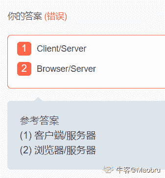

# 格力 2020 秋招软件测试岗笔试题

## 1

因果图/判定表工程方法在以下那种情况下不适用（）

正确答案: D   你的答案: 空 (错误)

```cpp
输入输出明确，或输入输出因果关系明确的情况下
```

```cpp
被分析的特性或功能点复杂，输入项目很多的情况下
```

```cpp
系统输入之间相互约束多，需要做大范围的组合测试情况下
```

```cpp
系统输入之间基本没有相互联系
```

本题知识点

测试开发工程师 测试工程师 格力 2020

讨论

[牛客 396470006 号](https://www.nowcoder.com/profile/396470006)

这题答案是不是错了，我觉得是 D

发表于 2020-09-17 16:30:44

* * *

[牛客 153925111 号](https://www.nowcoder.com/profile/153925111)

B 

因果图和判定表的方法是一种通用的测试设计方法，可以适用于所有类型的业务

以下情况下**不适宜**使用本工程方法：

       1.**输入和输出不明确**，或**输入与输出因果关系不明确**的情况下。例如从开发的相关文档中，无法确定输入的有效范围，输入和输出的对应关系时

       2.被分析的特性或功能点过于**复杂**，**输入项目很多的情况**下。**输入项过多**会造成因果图和判定表非常庞大，没有工具辅助的情况下难以操作

       3.系统**输入之间相互约束少**，不需要做大范围的组合测试时不宜使用本工程方法，不然会产生大量用例冗余

       4.系统输入之间存在**顺序先后上的可变性**，例如两个输入可以交互顺序，并且交互顺序后它们的输出是不一样的。判定表的输入是无法排序的，因此在这种情况下通常不适宜使用本方法

发表于 2020-09-21 09:46:16

* * *

[乱码乱码 1551](https://www.nowcoder.com/profile/884798412)

陷入迷惑。。为什么不选 B？

以下情况下**不适宜**使用本工程方法：

       1.**输入和输出不明确**，或**输入与输出因果关系不明确**的情况下。例如从开发的相关文档中，无法确定输入的有效范围，输入和输出的对应关系时（a 选择项输入输出明确，排除）

       2.被分析的特性或功能点过于**复杂**，**输入项目很多的情况**下。**输入项过多**会造成因果图和判定表非常庞大，没有工具辅助的情况下难以操作（b 选项复杂，输入项目很多）

       3.系统**输入之间相互约束少**，不需要做大范围的组合测试时不宜使用本工程方法，不然会产生大量用例冗余（c 选项相互约束多，需要做大范围的组合测试，排除）

       4.系统输入之间存在**顺序先后上的可变性**，例如两个输入可以交互顺序，并且交互顺序后它们的输出是不一样的。判定表的输入是无法排序的，因此在这种情况下通常不适宜使用本方法（d 选项输入之间基本没有相互联系，只要输入输出有因果关系就好吧，也排除）

发表于 2021-09-14 10:16:43

* * *

## 2

（）不属于程序的基本控制结构

正确答案: D   你的答案: 空 (错误)

```cpp
顺序结构
```

```cpp
分支结构
```

```cpp
循环结构
```

```cpp
递归条件
```

本题知识点

测试开发工程师 测试工程师 格力 2020

讨论

[牛客 414866997 号](https://www.nowcoder.com/profile/414866997)

程序三种基本结构：顺序结果、分支(选择）结构、循环结构。

发表于 2022-01-27 16:43:36

* * *

## 3

软件验收测试不包括（）

正确答案: B   你的答案: 空 (错误)

```cpp
正式验收测试
```

```cpp
白盒测试
```

```cpp
alpha 测试
```

```cpp
beta 测试
```

本题知识点

测试开发工程师 测试工程师 格力 2020

讨论

[牛客 976683169 号](https://www.nowcoder.com/profile/976683169)

答案选 B 白盒测试属于结构化测试验收测试是以用户为主，一般在用户的场地进行测试；其根据合同 验收测试计划 或 需求  
规格说明书为主 alpha 测试又称为测试用户在开发环境下的测试，或者研发部门内部的用户在模拟实际环境下的测试属于验收测试的一种
beta 测试又称测试是在实际的使用环境下进行的测试同样也属于验收测试

发表于 2020-11-06 14:46:02

* * *

[福大馨](https://www.nowcoder.com/profile/651222)

B，其他三项都属验收测试

发表于 2020-11-22 10:44:53

* * *

[代码渣渣球 offer](https://www.nowcoder.com/profile/275726331)

B

发表于 2020-09-16 07:40:11

* * *

## 4

HTTP 请求方法不包括(）

正确答案: D   你的答案: 空 (错误)

```cpp
POST
```

```cpp
OPTIONS
```

```cpp
DELETE
```

```cpp
INSERT
```

本题知识点

测试开发工程师 测试工程师 格力 2020

讨论

[玖拾肆](https://www.nowcoder.com/profile/123608451)

HTTP 请求的方法：

HTTP/1.1 协议***定义了八种方法（有时也叫“动作”），来表明 Request-URL 指定的资源不同的操作方式

HTTP1.0 定义了三种请求方法： GET, POST 和 HEAD 方法。

HTTP1.1 新增了五种请求方法：OPTIONS, PUT, DELETE, TRACE 和 CONNECT 方法

发表于 2020-09-17 09:06:31

* * *

[可乐星](https://www.nowcoder.com/profile/938722766)


发表于 2020-09-25 15:04:54

* * *

[酥窝](https://www.nowcoder.com/profile/4088502)

http1.0 有 get、post、head 请求

http1.1 新增了 put、options、delete、trace 请求

发表于 2020-11-13 23:41:18

* * *

## 5

一个成功的测试是（）

正确答案: B   你的答案: 空 (错误)

```cpp
发现错误码
```

```cpp
发现了至今尚未发现的错误
```

```cpp
没有发现错误码
```

```cpp
证明发现不了错误
```

本题知识点

测试开发工程师 测试工程师 格力 2020

讨论

[我喜欢找 bug](https://www.nowcoder.com/profile/590657975)

至今未发现的错误也分是不是需求要求的 1.不是需求要求的应该及时去沟通，防止漏测 2.是需求要求的，而且很重要的话，那就把开发腿抱住😂😁，这个可能是你涨薪的机会

发表于 2020-10-12 05:17:56

* * *

[牛客 617175344 号](https://www.nowcoder.com/profile/617175344)

发现了至今尚未发现的错误就是成功的测试？ 不合理啊，也许这个错误是有新的需求产生的呢

发表于 2022-02-17 16:07:31

* * *

[Sakira](https://www.nowcoder.com/profile/633059082)

B 发现了之前尚未发现的错误

发表于 2020-10-09 15:56:14

* * *

## 6

软件测试是软件质量保证的重要手段，下述哪种测试是软件测试的最基础环节？（）

正确答案: B   你的答案: 空 (错误)

```cpp
集成测试
```

```cpp
单元测试
```

```cpp
目的测试
```

```cpp
确认测试
```

本题知识点

测试开发工程师 测试工程师 格力 2020

讨论

[晓晓会找到好工作的](https://www.nowcoder.com/profile/213803012)

单元测试，集成测试，确认测试，系统测试，验收测试

发表于 2020-09-16 20:08:52

* * *

[牛客 963702424 号](https://www.nowcoder.com/profile/963702424)

单元测试，集成测试，确认测试，系统测试，验收测试

发表于 2022-03-11 00:54:26

* * *

[牛客 465797355 号](https://www.nowcoder.com/profile/465797355)

a

发表于 2022-01-07 23:32:26

* * *

## 7

编码阶段产生的错误由（）检查出来的

正确答案: A   你的答案: 空 (错误)

```cpp
单元测试
```

```cpp
集成测试
```

```cpp
系统测试
```

```cpp
有效性测试
```

本题知识点

测试开发工程师 测试工程师 格力 2020

讨论

[天子笑坛中](https://www.nowcoder.com/profile/519362906)

编码阶段产生的错误由（单元测试）检查出来的

发表于 2020-10-05 11:58:41

* * *

## 8

下列不适合使用功能测试工具的场合是（）

正确答案: D   你的答案: 空 (错误)

```cpp
回归测试
```

```cpp
需要频繁更改测试用例的测试
```

```cpp
涉及与物理设备交互的测试
```

```cpp
跨平台的测试
```

本题知识点

测试开发工程师 测试工程师 格力 2020

讨论

[Panza](https://www.nowcoder.com/profile/639811123)

[`wenku.baidu.com/view/e81d92c0d5bbfd0a795673db.html`](https://wenku.baidu.com/view/e81d92c0d5bbfd0a795673db.html)百度文库找到的一套题里面的 11 题，选 D.跨平台的测试，有没有大佬解释一下呀？跪求各位大佬了

发表于 2020-10-07 17:04:02

* * *

[王可爱小哪吒](https://www.nowcoder.com/profile/891434607)

功能测试：

又叫黑盒测试，测试对象是产品的各个功能，不需要考虑整个产品的系统结构和代码；按照项目启动时的需求文档和概要设计，对一个个功能点和需求点进行测试。知乎上看到的 我理解的就是测试的是产品每一部分的功能吧 像内部的测试 一个手机摄像头好不好用 麦克风好不好用 键盘好不好用 品谷好不好用这种 然后跨平台就是外部的测试所以不适用

发表于 2020-12-24 15:10:36

* * *

[Robbort](https://www.nowcoder.com/profile/719044)

有没有人可以解释一下：功能测试工具指的是什么？

编辑于 2020-12-22 10:24:51

* * *

## 9

Junit 有两个包，分别为：（）和 Junit.extensions

正确答案: B   你的答案: 空 (错误)

```cpp
Junit.frametest
```

```cpp
Junit.framework
```

```cpp
Junit.assert
```

```cpp
Junit.amework
```

本题知识点

测试开发工程师 测试工程师 格力 2020

讨论

[天子笑坛中](https://www.nowcoder.com/profile/519362906)

Junit 有两个包，分别为：（Junit.framework）和 Junit.extensions

发表于 2020-10-05 11:59:17

* * *

## 10

下面哪些不属于静态测试（）

正确答案: D   你的答案: 空 (错误)

```cpp
代码规则检查
```

```cpp
程序结构分析
```

```cpp
程序复杂度分析
```

```cpp
内存泄露
```

本题知识点

测试开发工程师 测试工程师 格力 2020

讨论

[HEREISDAVID](https://www.nowcoder.com/profile/864672146)

不运行软件，也能泄露内存？意思是电脑太**，以至于代码拷上去就崩了？

发表于 2020-09-21 17:21:59

* * *

[牛客 153925111 号](https://www.nowcoder.com/profile/153925111)

链接：[`www.nowcoder.com/questionTerminal/540ca61b392b4903b6af5b410b78bf08`](https://www.nowcoder.com/questionTerminal/540ca61b392b4903b6af5b410b78bf08)
来源：牛客网
*   静态分析可以由**机器完成**，以自动“遍历”源代码并检测不合规规则。经典的例子是一个编译器，它可以找到词汇，句法甚至一些语义错误。静态分析也可以由**审查代码的人执行**，以确保使用正确的编码标准和约定来构建程序。这通常称为代码审查，由同行开发人员（编写代码的开发人员以外的人）完成。**所以 A 属于静态**。*   当开发人员分析代码时，分析代码行、适当的嵌套、函数调用次数、循环复杂性……所**以 B、C 也属于静态。**

编辑于 2020-09-21 10:02:45

* * *

[牛客 598437792 号](https://www.nowcoder.com/profile/598437792)

D 属于动态分析

发表于 2020-09-24 09:43:26

* * *

## 11

C/S 结构是 1，B/S 结构是 2

你的答案 (错误)

12 参考答案 (1) 客户端/服务器
(2) 浏览器/服务器

本题知识点

测试开发工程师 测试工程师 格力 2020

讨论

[Maobru](https://www.nowcoder.com/profile/911840079)

把我整笑了

发表于 2020-10-13 10:16:58

* * *

[咸鱼想变菜鸟](https://www.nowcoder.com/profile/431372072)


发表于 2020-10-30 21:43:49

* * *

[牛客 730700169 号](https://www.nowcoder.com/profile/730700169)

1 Client/Server 胖客户端。基于软件本身的，如 qq、微信、英雄联盟等的软件系统体系结构。2 Browser/Serve 瘦客户端。基于 web，浏览器架构，非平台的网页布局架构的网络结构模式。

发表于 2021-12-20 14:44:57

* * *

## 12

测试用例是由 1 和预期的 2 两部分组成

你的答案 (错误)

12 参考答案 (1) 测试输入数据
(2) 输出数据

本题知识点

测试开发工程师 测试工程师 格力 2020

讨论

[不会造飞机怎么拧螺丝](https://www.nowcoder.com/profile/397166072)

既然要弄这种填空题，烦请网站把识别功能完善一下，换个顺序都能错？

发表于 2020-11-06 13:52:32

* * *

[牛客 730700169 号](https://www.nowcoder.com/profile/730700169)


发表于 2021-12-20 14:45:59

* * *

[牛客 953989924 号](https://www.nowcoder.com/profile/953989924)

操作步骤和预期结果

发表于 2020-11-19 14:15:21

* * *

## 13

等价类划分有两种不同的情况：1 和 2

你的答案 (错误)

12 参考答案 (1) 有效等价类
(2) 无效等价类

本题知识点

测试开发工程师 测试工程师 格力 2020

讨论

[牛客 730700169 号](https://www.nowcoder.com/profile/730700169)


发表于 2021-12-20 14:46:40

* * *

[牛客 663773261 号](https://www.nowcoder.com/profile/663773261)

有效等价类和无效等价类

发表于 2020-11-02 19:19:52

* * *

[想收 offer](https://www.nowcoder.com/profile/791142757)

有效等价类无效等价类

发表于 2020-09-23 13:21:44

* * *

## 14

白盒测试又称为结构测试，可以分为 1 和 2 两大类

你的答案 (错误)

12 参考答案 (1) 动态测试
(2) 静态测试

本题知识点

测试开发工程师 测试工程师 格力 2020

讨论

[牛客 659891852 号](https://www.nowcoder.com/profile/659891852)

这就很搞笑了

发表于 2020-09-24 10:06:08

* * *

[不知道叫啥 102](https://www.nowcoder.com/profile/469282907)

静态测试 动态测试

发表于 2020-10-16 10:41:35

* * *

[迷茫 i](https://www.nowcoder.com/profile/244681621)

少测试 2 个字都不行吗？😂

发表于 2022-03-11 10:55:33

* * *

## 15

在 Junit 中 3.8 中 testXXX（   ）测试方法必须满足几个条件：1，2 和无方法参数

你的答案 (错误)

12 参考答案 (1) public
(2) void

本题知识点

测试开发工程师 测试工程师 格力 2020

讨论

[谁都不许动我的砖](https://www.nowcoder.com/profile/4677166)

帮大家回忆一下测试类

发表于 2020-10-13 21:22:54

* * *

[牛客 663773261 号](https://www.nowcoder.com/profile/663773261)

public andvoid

发表于 2020-11-02 19:21:03

* * *

## 16

Alpha 测试与 beta 的区别

你的答案

本题知识点

测试开发工程师 测试工程师 格力 2020

讨论

[橘子味的香蕉 young](https://www.nowcoder.com/profile/634139774)

α测试:在受控的环境中进行，由用户在开发者的场所进行，并且在开发者对用户的指导下进行测试，开发者负责记录发现的错误和使用中的问题 β测试:在开发者不能控制的环境中进行，由软件的最终用户在一个或多个客户场所下进行，由用户记录在测试中遇到的问题，并定期报给开发者

发表于 2020-10-07 17:17:13

* * *

[斐斐王 P](https://www.nowcoder.com/profile/380878660)

1.测试时间不同
Alpha 测试简称“α测试”，可以从软件产品编码结束之时开始，或在模块（子系统）测试完成之后开始，也可以在确认测试过程中产品达到一定的稳定和可靠程度之后再开始。
beta 测试是软件产品完成了功能测试和系统测试之后，在产品发布之前所进行的软件测试活动，它是技术测试的最后一个阶段。
2.测试目的
α测试评价软件产品的功能、可使用性、可靠性、性能和支持，尤其注重产品的界面和特色，即为非正式验收测试
beta 测试的主要目标是测试可支持性，是一种验收测试，通过了验收测试，产品就会进入发布阶段
3.测试人员和场所不同
α测试是由一个用户在开发环境下进行的测试，也可以是公司内部的用户在模拟实际操作环境下进行的受控测试，发现的错误可以在测试现场立刻反馈给开发人员，由开发人员及时分析和处理。用户数量相对较少，时间不集中。
bata 测试由软件的最终用户们在一个或多个用户的场所进行。开发者通常不在 beta 测试的现场，不能由程序员或测试员完成。

发表于 2020-10-13 14:33:32

* * *

[牛客 730700169 号](https://www.nowcoder.com/profile/730700169)

Alpha 测试
就是指内测，是在开发者环境进行的测试，环境是可控的，用户少，时间集中。beta 测试
就是指公测，是用户环境进行的测试，环境不可控，用户比较多，时间不集中。 

发表于 2021-12-20 14:52:24

* * *

## 17

黑盒测试中测试用例设计主要有哪些方法并说出依据是什么

你的答案

本题知识点

测试开发工程师 测试工程师 格力 2020

讨论

[牛客 621356867 号](https://www.nowcoder.com/profile/621356867)

等价划分 边界值分析 输入域测试 状态迁移法 流程分析法 判定表驱动法 正交试验法 场景法 错误推断法
因果图法

发表于 2021-03-31 15:38:52

* * *

[牛客 200590025 号](https://www.nowcoder.com/profile/200590025)

黑盒测试中测试用例设计的依据为什么是用户需求规格说明书和详细设计说明书？

发表于 2021-01-28 10:10:42

* * *

[牛客 490263234 号](https://www.nowcoder.com/profile/490263234)

等价类划分、因果图、错误推测、边界值、正交实验、场景法

发表于 2020-10-28 14:05:24

* * *