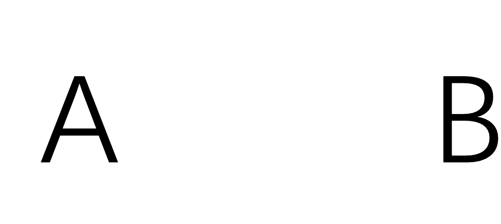

# 途虎养车 2021 秋招 Java 笔试试卷 A

## 1

以下说法正确的是：

正确答案: A B C D E   你的答案: 空 (错误)

```cpp
在并行程度中，当两个并行的线程，在没有任何约束的情况下，访问一个共享变量或者共享对象的一个域，而且至少要有一个操作是写操作，就可能发生数据竞争错误。
```

```cpp
原语 Compare-and-swap(CAS)是实现无锁数据结构的通用原语。
```

```cpp
获得内部锁的唯一途径是：进入这个内部锁保护的同步块或方法。
```

```cpp
volatile 变量具有 synchronized 的可见性特性，但是不具备原子特性。
```

```cpp
减小竞争发生可能性的有效方式是尽可能缩短把持锁的时间
```

本题知识点

并发 迅雷 Java 工程师 途虎 前端工程师 2021 算法工程师 腾讯 2015

讨论

[Sammic](https://www.nowcoder.com/profile/210002)

A: 来自 Thinking in java：如果你正在写一个变量，它可能接下在将被另一个线程读取，或者正在读取上一个已经被另一个线程写过的变量，那么你必须应用同步，并且，读写线程都必须用相同的监视器锁同步。--由此可以想到，如果多个线程都只读数据，则不会造成竞争错误，因为不会出现读脏数据或者数据不同步问题。B. 无锁化编程常用方式之一 C. 当线程企图访问临界资源时，先会查看该临界资源当前是否已被加锁，如果没有被加锁，则对该临界资源加锁，并进入该同步块或方法，加锁后，其他线程也就无法访问该临界资源了。所以判定获取了一个内部锁的标准为：进入该同步区域 D. 保证可见性，调用 volatile 变量时，使用前都会刷新该变量，保证变量的值为最新的。不保证互斥性,所以不具备原子特性 E. 把持锁的时间短了，等待锁的时间也就短了，竞争可能性变小

编辑于 2017-04-01 10:15:11

* * *

[Radar](https://www.nowcoder.com/profile/312842)

volatile 的作用：1、修饰变量说明这个变量会意想不到地改变，优化器每次用到该变量，值都会重新从内存中读取它。2、进行多线程编程, **多任务环境下各任务间共享的标志应该加**volatile.

发表于 2015-08-29 15:24:08

* * *

[小小小努力！](https://www.nowcoder.com/profile/4202260)

C 选项明显有问题！锁都没获得，怎么进入内部锁保护得代码块或者方法！

发表于 2021-11-29 10:56:35

* * *

## 2

一个栈的入栈序列为 ABCDEF，则不可能的出栈序列是

正确答案: D   你的答案: 空 (错误)

```cpp
DEFCBA
```

```cpp
DCEFBA
```

```cpp
FEDCBA
```

```cpp
FECDBA
```

```cpp
ABCDEF
```

```cpp
ADCBFE
```

本题知识点

Java 工程师 途虎 2021

讨论

[流浪成者](https://www.nowcoder.com/profile/6846617)

该题主要是考虑栈的核心思想是先进后出，需要注意入栈和出栈的顺序是未知的，例如你可以先入栈 ABCD，然后出栈 D，然后入栈 E，出栈 E，入栈 F，出栈 F，然后 CBA 依次出栈，即 A 选项的情况。 **这里有一规律可记** 
任何出栈的元素后面出栈的元素必须满足以下三点： 
**1、在原序列中相对位置比它小的，必须是逆序；** 
**2、在原序列中相对位置比它大的，顺序没有要求；** 
**3、以上两点可以间***行。**

我们再看选项 D 的出栈顺序 FECDBA，明显出栈元素 F 后面的元素 C 和 D 不满足上面规律 1，所以选项 D 是错误的，其它答案都是满足的。

发表于 2020-12-14 23:59:34

* * *

[谦虚的刘大哥](https://www.nowcoder.com/profile/45713345)

该题主要是考虑栈的核心思想是先进后出，需要注意入栈和出栈的顺序是未知的，例如你可以先入栈 ABCD，然后出栈 D，然后入栈 E，出栈 E，入栈 F，出栈 F，然后 CBA 依次出栈，即 A 选项的情况。 **这里有一规律可记** 
任何出栈的元素后面出栈的元素必须满足以下三点： 
**1、在原序列中相对位置比它小的，必须是逆序；** 
**2、在原序列中相对位置比它大的，顺序没有要求；** 
**3、以上两点可以间***行。**

我们再看选项 D 的出栈顺序 FECDBA，明显出栈元素 F 后面的元素 C 和 D 不满足上面规律 1，所以选项 D 是错误的，其它答案都是满足的。

发表于 2022-03-12 23:40:47

* * *

[牛客 312430712 号](https://www.nowcoder.com/profile/312430712)

D,先进后出

发表于 2020-12-15 18:35:12

* * *

## 3

在 Java 中类型 ArrayList 中，添加一个元素（add 方法）的时间复杂度是

正确答案: A C   你的答案: 空 (错误)

```cpp
O(1)
```

```cpp
O(logN)
```

```cpp
O(n)
```

```cpp
O(NLogN)
```

本题知识点

Java 工程师 途虎 2021

讨论

[ForeverFly](https://www.nowcoder.com/profile/263915765)

尾部添加 O(1)，其余部位添加 O(n)  

发表于 2020-12-27 15:56:05

* * *

[庆师 17 级王宏盛](https://www.nowcoder.com/profile/676755028)

最好的情况 O（1）

最坏 O（n）

发表于 2020-12-09 11:26:08

* * *

## 4

有 50 个人乘坐一架 50 座的飞机，他们在登机前都被分配好了位置。第一个登上飞机的乘客随机选择了一个位置坐下，之后的乘客会尝试按照自己被分配的位置入座，如果发现该位置已经有人入座，则他会随机的在剩余的位子中选一个坐下。那么，最后一个登上飞机的乘客能够正确坐在自己位置的概率是 1%。

你的答案 (错误)

1 参考答案 (1) 50

本题知识点

Java 工程师 途虎 2021

讨论

[齐跃玉](https://www.nowcoder.com/profile/325856986)

可以使用第一人坐的位置分情况讨论 1.第一人坐对自己位置为 2%，此时所有人都坐对了，最后一位也对 。2.第一人做了最后一人的位置为 2%，此时最后一位位置必定坐错。3.第一人坐了第 N 人的位置为 96%，此时第 N 人只能坐第一人或最后一人位置，机会相等，那么最后一人有一半机会坐对。综合可得 ， 正确概率=2%*1+2%*0+96%*0.5=50%

发表于 2020-12-18 15:59:16

* * *

[任里巴巴](https://www.nowcoder.com/profile/94693862)

假设第一个人的位置是 A，第 50 的位置是 B，这个过程中，只要有人坐在了 A，那么第 50 就可以坐在 B。所以最后剩给第 50 选择的只有 A 和 B 两种情况。而且前面的人留 A 还是 B 给第 50 一直是等概率的。

发表于 2020-12-10 09:58:23

* * *

[牛客 773895186 号](https://www.nowcoder.com/profile/773895186)

坐对还是坐错和自己有关系，要么错要么对，因此 50%

发表于 2020-12-10 19:37:06

* * *

## 5

面向对象程序设计的三个最主要特性是 1、2 及 3

你的答案 (错误)

123 参考答案 (1) 封装
(2) 继承
(3) 多态

本题知识点

Java 工程师 途虎 2021

讨论

[2️⃣0️⃣2️⃣1️⃣](https://www.nowcoder.com/profile/452198343)

就离谱

发表于 2021-10-20 16:34:49

* * *

[香菱儿](https://www.nowcoder.com/profile/942850510)

封装 继承 多态

发表于 2020-12-07 18:43:37

* * *

## 6

请写出以下两者的相同点，至少 5 个

你的答案

本题知识点

Java 工程师 途虎 2021

讨论

[香菱儿](https://www.nowcoder.com/profile/942850510)

都是字母、都是汉语拼音字母

发表于 2020-12-07 18:46:04

* * *

[程序新猿](https://www.nowcoder.com/profile/3434017)

1.都是字母 2.是黑体 3.字母排序前五 4.笔画三笔 5.白色背景

发表于 2021-08-26 15:58:16

* * *

[阿木木木木木](https://www.nowcoder.com/profile/2018420)

1.颜色相同
2.字体相同 3.都是大写字母
4.都是英文字符 5.背景都为白色

发表于 2020-12-16 15:32:52

* * *

## 7

请简要说明：超市的手推车停在电梯上的时候，为什么不往下滑？

你的答案

本题知识点

Java 工程师 途虎 2021

讨论

[香菱儿](https://www.nowcoder.com/profile/942850510)

因为轮椅和电梯上都有对应的卡槽

发表于 2020-12-07 18:47:12

* * *

[jkslfkt](https://www.nowcoder.com/profile/400432655)

合力为 0 根据牛顿第一定律，可知此时物体保持静止，电梯的水平方向摩擦力与重力的分力大小相等方向相反，竖直方向，支持力与重力的分力等大反向，受平衡力作用，相对静止

发表于 2022-02-12 17:48:42

* * *

## 8

对于给定的非负整数 r 和 n（r≤n），请编写程序计算组合数 C(r,n) = n! / r! / (n-r)!。（本题目用于测试的所有用例，都保证结果小于 2³¹-1）

本题知识点

Java 工程师 途虎 2021

讨论

[牛客 73799987 号](https://www.nowcoder.com/profile/73799987)

```cpp
import java.util.*;
public class Solution {
    /**
     * 代码中的类名、方法名、参数名已经指定，请勿修改，直接返回方法规定的值即可
     * calculate combination Number
     * @param r int 整型 
     * @param n int 整型 
     * @return int 整型
     */
    public int combination (int r, int n) {
        // write code here
        long ans = 1L;
        int t = n - r, i = 0;
        while(i < t){
            ans *= (n-i)/(t-i);
            i++;
        }
        return (int)ans;
    }
}
```

```cpp
有啥特殊写法吗,我这疯狂超时,第三个用例就过不去了
```

编辑于 2022-02-23 15:05:58

* * *

[牛客 471114419 号](https://www.nowcoder.com/profile/471114419)

这道题难点在于计算时整形溢出问题😀

发表于 2022-01-23 22:35:31

* * *

[youngwong](https://www.nowcoder.com/profile/710371203)

```cpp
public int combination (int r, int n) {
        int nh = n / 2;
        int answ = 1;
        int r1 = 1;
        if(r > nh)
            r = n -r;
        for(;r>0;) {
            r1 = r1 * r;
            answ *= n;
            if(answ % r1 == 0) {
                answ /= r1;
                r1 = 1;
            }
            n--;
            r--;
        }
        return answ;

    }
```

发表于 2021-08-31 16:58:03

* * *

## 9

现给出两个有序整型数组，其中 array1 按升序（从小到大）排序，array2 按降序排序，请你将 array1 和 array2 合并到一个新的数组中，并保持新中的元素按升序排序。说明:   给出 array1 和 array2 及其元素数量 n 和 m ，返回合并后的新数组。

本题知识点

Java 工程师 途虎 2021

讨论

[牛客 73799987 号](https://www.nowcoder.com/profile/73799987)

```cpp
import java.util.*;

public class Solution {
    public int[] arrayMerge (int[] array1, int n, int[] array2, int m) {
        // write code here
        int [] ans = new int[n + m];
        int ixd = 0, i = 0, j = m - 1;
        while(j >= 0 && i < n && ixd < n + m){
            int num = 0;
            if(array1[i] > array2[j]) {
                num = array2[j--];
            }else{
                num = array1[i++];
            }
            ans[ixd++] = num;
        }
        while(i < n) ans[ixd++] = array1[i++];
        while(j >= 0) ans[ixd++] = array2[j--];
        return ans;
    }
}

```

```cpp
这题的超时都不知道怎么判断的，再快也必须是 O(n+m)呀
```

发表于 2022-02-23 15:08:25

* * *

[行走的造粪机](https://www.nowcoder.com/profile/384171109)

```cpp
不讲码德法
import java.util.*;

public class Solution {
    public int[] arrayMerge (int[] array1, int n, int[] array2, int m) {
        // write code here
        int[]res=new int[m+n];
        int i=0,j=0,k=0;
        while(i<n){
            res[k++]=array1[i]; 
            i++;
        }
        while(j<m){
            res[k++]=array2[j];
            j++;
        }
        Arrays.sort(res);
        return res;
    }
}
```

发表于 2022-03-19 20:46:03

* * *

[wanbf](https://www.nowcoder.com/profile/702609353)

```cpp
说好的 5 秒呢，运行 4 秒你给我说超时
提交时间：2022-01-17 语言：Java 运行时间： 4001 ms 占用内存：9580K 状态：运行超时

import java.util.*;

public class Solution {
    /**
     * 代码中的类名、方法名、参数名已经指定，请勿修改，直接返回方法规定的值即可
     *
     * @param array1 int 整型一维数组
     * @param n int 整型
     * @param array2 int 整型一维数组
     * @param m int 整型
     * @return int 整型一维数组
     */
    public int[] arrayMerge (int[] array1, int n, int[] array2, int m) {
        // write code here
        int[] res = new int[m+n];
        int i=0;
        int j=m-1;
        int index=0;
        while(i<n && j>=0){
            if(array1[i]<array2[j]){
                res[index]=array1[i];
                i++;
            }else{
                res[index]=array2[j];
                j--;
            }
            index++;
        }
        while(i<n){
            res[index]=array1[i];
            i++;
            index++;
        }
        while(j>=0){
            res[index]=array2[j];
            j--;
            index++;
        }
        return res;
    }
}
```

发表于 2022-01-18 00:09:41

* * *