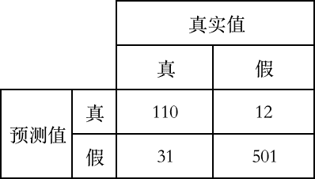

# 途虎养车 2021 秋招算法笔试试卷 A

## 1

计算下列混淆矩阵的 真正例率 TPR： 

正确答案: D   你的答案: 空 (错误)

```cpp
0.78
```

```cpp
0.168
```

```cpp
0.186
```

```cpp
0.9
```

本题知识点

算法工程师 途虎 2021

讨论

[零葬](https://www.nowcoder.com/profile/75718849)

直接代 TPR 的公式：TPR=precision=110/(110+12)=0.9

发表于 2021-01-20 18:01:42

* * *

## 2

决策树中的特征选择有多种方式，现给定一个用潜在户信息表，请根据信息增益准则选择最优特征。

数据集如下：

| 年龄 A1 | 性别 A2 | 有车 A3 | 车辆等级 A4 | 类别 |
| 青年 | 男 | 否 | 一般 | 否 |
| 青年 | 男 | 否 | 好 | 否 |
| 青年 | 女 | 否 | 好 | 是 |
| 青年 | 女 | 是 | 一般 | 是 |
| 青年 | 男 | 否 | 一般 | 否 |
| 中年 | 男 | 否 | 一般 | 否 |
| 中年 | 男 | 否 | 好 | 否 |
| 中年 | 女 | 是 | 好 | 是 |
| 中年 | 男 | 是 | 非常好 | 是 |
| 中年 | 男 | 是 | 非常好 | 是 |
| 老年 | 男 | 是 | 非常好 | 是 |
| 老年 | 男 | 是 | 好 | 是 |
| 老年 | 女 | 否 | 好 | 是 |
| 老年 | 女 | 否 | 非常好 | 是 |
| 老年 | 男 | 否 | 一般 | 否 |

 你的答案

本题知识点

算法工程师 途虎 2021

讨论

[牛客 210113609 号](https://www.nowcoder.com/profile/210113609)


发表于 2021-10-07 11:33:51

* * *

## 3

根据如下数据集，推导 C4.5 算法处理缺失值的过程： | ID | 天气 | 温度 | 湿度 | 刮风 | 是否踢球 |
| 1 | 阴 | 中 | 高 | 是 | 否 |
| 2 | 晴 | 中 | 中 | 是 | 是 |
| 3 | 小雨 | 低 | 高 | 否 | 否 |
| 4 | 小雨 | 高 | 高 | 否 | 否 |
| 5 | 阴 | 高 | 高 | 否 | 是 |
| 6 | 晴 | 高 | 中 | 是 | 否 |
| 7 | 晴 | - | 中 | 否 | 是 | 

你的答案

本题知识点

算法工程师 途虎 2021

## 4

神经网络中常用的激活函数有哪些？其中，relu 有哪些变体，它有什么优势和缺点？

你的答案

本题知识点

算法工程师 途虎 2021

## 5

与 RNN 比较，transformer 解决了什么问题，基本结构是怎样的？

你的答案

本题知识点

算法工程师 途虎 2021

## 6

处理稀疏数据的方式有哪些？

你的答案

本题知识点

算法工程师 途虎 2021

## 7

特征离散化的方式有哪些？什么时候需要离散化？

你的答案

本题知识点

算法工程师 途虎 2021

## 8

L1 正则和 L2 正则分别服从什么分布？

你的答案

本题知识点

算法工程师 途虎 2021

讨论

[零葬](https://www.nowcoder.com/profile/75718849)

L1 正则服从拉普拉斯分布，L2 正则服从高斯分布

发表于 2021-01-20 18:02:20

* * *

## 9

有若干个样本点，每个点包含 2 个数值型特征 X1 和 X2 及其对应的二分类标签 Y。
请采用批量梯度下降法找到 Logistic 回归分类器在此数据集上的最佳回归系数向量 Theta。

本题知识点

算法工程师 途虎 2021

讨论

[牛客 908010274 号](https://www.nowcoder.com/profile/908010274)

这个是要自己写模型吗。。。

发表于 2021-08-30 18:43:38

* * *

[零葬](https://www.nowcoder.com/profile/75718849)

这个题是真难 AC，用给的 case 做模型训练很难收敛。根据我的测试，页面上这个例子如果初始化模型参数为全 1 向量，迭代 3000 步能得到和答案差不多的结果（前 3 位小数相同），迭代 500 步的结果和答案相差巨大，而且如果不用全 1 向量对模型参数进行初始化又会有巨大的改变。

编辑于 2021-01-21 10:54:26

* * *

## 10

给定一个数组 a[0],a[1],a[2],a[3]....a[n]。请问中间加和等于 k 的连续子串有多少个？

本题知识点

算法工程师 途虎 2021

讨论

[ZJYang](https://www.nowcoder.com/profile/266628121)

滑动窗口

```cpp
def solu():
    try:
        n,k = input().split(' ')
    except:
        return False
    n,k = int(n),int(k)
    nums = input().split(' ')
    nums = [int(_) for _ in nums]

    r,l,c,res = 0,0,0,0
    while l<n:
        while c<k and l<n:
            c +=nums[l]
            l+=1
        while c==k and l<n:
            res +=1
            c +=nums[l]
            l +=1
        while c>k and r<l:
            c -= nums[r]
            r +=1
        while c==k and r<l:
            res +=1
            c -=nums[r]
            r +=1
    print(res)
    return True

if __name__=="__main__":
    while solu():
        pass
```

发表于 2021-08-05 02:46:11

* * *

[Simone_](https://www.nowcoder.com/profile/988763861)

怎么代码一直不通过，不是跟 leecode560 差不多吗

发表于 2021-01-21 21:32:29

* * *

[零葬](https://www.nowcoder.com/profile/75718849)

这个题的 case 是不是有问题啊 10 5
0 0 5 0 0 0 0 0 0 0 这个输入得到的答案为什么是 10

发表于 2021-01-20 21:31:14

* * *