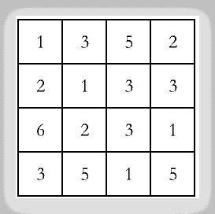
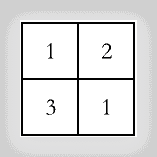

# 途虎养车 2021 秋招算法笔试试卷 B

## 1

神经网络权重有哪些初始化方式？

正确答案: A B C D   你的答案: 空 (错误)

```cpp
正态分布
```

```cpp
均匀分布
```

```cpp
Gamma 分布
```

```cpp
常数初始化
```

本题知识点

算法工程师 途虎 2021

## 2

对下面的输入进行卷积计算。输入为左侧，卷积核为 2x2，步长为 2，则卷积=[1,2,3,4]  

你的答案 (错误)

1234 参考答案 (1) 14
(2) 21
(3) 24
(4) 13

本题知识点

算法工程师 途虎 2021

讨论

[零葬](https://www.nowcoder.com/profile/75718849)

直接将卷积核按步长为 2，从左往右从上到下与输入矩阵对应的部分进行相乘相加即可 1*1+2*3+3*2+1*1=141*5+2*2+3*3+1*3=211*6+2*2+3*3+1*5=241*3+2*1+3*1+1*5=13

发表于 2021-01-20 11:45:33

* * *

## 3

Logistics 回归为什么要使用 Sigmoid 函数？ 这里只讨论二分类的情况，并且假设两个类别的特征服从均值不等、方差相等的高斯分布，也就是：

p(x|y=0) ~ N(μ0, σ)

p(x|y=1) ~ N(μ1, σ)请尝试从**风险最小化**的角度推导其数学原理

你的答案

本题知识点

算法工程师 途虎 2021

## 4

请简易描述下决策树算法中，C4.5 相对 ID3 有哪些优化？

你的答案

本题知识点

算法工程师 途虎 2021

讨论

[食堂在逃干饭王](https://www.nowcoder.com/profile/5786634)

1\. C4.5 天生具有处理连续参数值的能力（ID3 在设计时未考虑连续值，不过改改也可以实现）。2\. ID3 用信息增益，对取值数较多的类别有偏好，而 C4.5 在信息增益超过平均水平的属性上选信息增益率最大的那个属性进行划分，这样做对取值数较少的类别有所偏好。

发表于 2021-03-03 14:07:54

* * *

## 5

生成式模型和判别式模型的区别是什么？分别有哪些代表性的模型？

你的答案

本题知识点

算法工程师 途虎 2021

## 6

什么是结构风险最小化？

你的答案

本题知识点

算法工程师 途虎 2021

## 7

svm 的核技巧是什么原理？

你的答案

本题知识点

算法工程师 途虎 2021

## 8

bert 不能处理哪些任务？与 BERT 相比 ALBERT 在哪方面做了改进？

你的答案

本题知识点

算法工程师 途虎 2021

## 9

求解无序数组最长连续字串的长度，时间复杂度控制在 O(n)

本题知识点

算法工程师 途虎 2021

讨论

[零葬](https://www.nowcoder.com/profile/75718849)

其实就是求上升子序列的最大长度

```cpp
import java.util.*;

public class Solution {
    /**
     * 代码中的类名、方法名、参数名已经指定，请勿修改，直接返回方法规定的值即可
     * 求解无序数组最长连续字串的长度
     * @param input_list int 整型一维数组 输入的数组
     * @return int 整型
     */
    public int search_max_continue_sub (int[] input_list) {
        // write code here
        HashSet<Integer> set = new HashSet<>();
        // 先将所有的数组元素存入 set 中，以便后续的查询达到复杂度 O(1)
        for(int num: input_list) set.add(num);
        int maxLen = 1;
        // 遍历每个元素
        for(int i = 0; i < input_list.length; i++){
            int temp_maxLen = 1;
            int num = input_list[i];
            // 对当前元素不断减 1，查看是否还在数组中，如果还在则更新最大长度
            while(set.contains(num - 1)){
                temp_maxLen ++;
                num --;
            }
            maxLen = Math.max(maxLen, temp_maxLen);
        }
        return maxLen;
    }
}

```

编辑于 2021-01-20 13:56:10

* * *

## 10

途虎养车公司机房中的一台某台服务器的上使用虚拟化技术可以承载多个不同的计算任务，但是因为服务器算力的约束，一台机器能承载的服务量始终是有限的。已知一台服务器的算力为 m，有 w 个不同的任务需要部署，每个任务占用的算力与产生的价值分别为 p[i],v[i],请问在这台服务器上部署任务能产生的最大价值是多少？

本题知识点

算法工程师 途虎 2021

讨论

[零葬](https://www.nowcoder.com/profile/75718849)

一个典型的动规背包问题：一个背包容量有限，怎么装包能使包中的物品价值最大

```cpp
m, w = map(int, input().strip().split())
p, v = [], []
for _ in range(w):
    temp = list(map(int, input().strip().split()))
    p.append(temp[0])
    v.append(temp[1])
# 求解背包问题
dp = [0]*(m + 1)    # dp[i]表示消耗 i 所产生的最大价值，显然 dp[0]=0
for i in range(1, w + 1):
    for j in range(m, p[i - 1] - 1, -1):
        dp[j] = max(dp[j - p[i - 1]] + v[i - 1], dp[j])
print(dp[m])
```

发表于 2021-01-20 13:42:52

* * *

[maoxiaomao](https://www.nowcoder.com/profile/230303195)

```cpp
m,w=map(int, input().strip().split())
A=[]
A.append([0,0])
for i in range(w):
    A.append(list(map(int, input().strip().split()))) 
dp=[[0]*(m+1) for _ in range(w+1)]
for i in range(1,len(dp)):
    for j in range(1,len(dp[0])):
        if j<A[i][0]:      #装不下
            dp[i][j]=dp[i-1][j]
        else:              #最大价值=max(上一个单元格最大价值，当前价值+剩余算力的最大价值) 
            dp[i][j]=max(dp[i-1][j],A[i][1]+dp[i-1][j-A[i][0]])  
print(dp[-1][-1])
```

发表于 2021-06-04 14:45:59

* * *