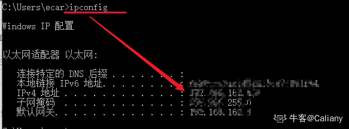

# 途虎养车 2021 秋招测试笔试试卷 A

## 1

在正式测试前，对产品或系统的一次简单的验证性测试称为

正确答案: C   你的答案: 空 (错误)

```cpp
负载测试    
```

```cpp
集成测试
```

```cpp
冒烟测试
```

```cpp
验收测试
```

本题知识点

测试开发工程师 测试工程师 途虎 2021

讨论

[一杯冰冰的牛奶](https://www.nowcoder.com/profile/437259882)

d

发表于 2021-10-13 15:34:13

* * *

[牛客 44100539 号](https://www.nowcoder.com/profile/44100539)

冒烟测试

发表于 2020-12-15 15:17:19

* * *

## 2

用边界值分析法，假定 1<x>正确答案: A   你的答案: 空 (错误)

```cpp
X=1，X=2，X=9，X=10
```

```cpp
X=2，X=9
```

```cpp
X=1，X=10
```

```cpp
X=1，X=5，X=6，X=10
```

本题知识点

测试开发工程师 测试工程师 途虎 2021

## 3

软件修复的代价最高的阶段为

正确答案: D   你的答案: 空 (错误)

```cpp
需求阶段
```

```cpp
编码阶段
```

```cpp
测试阶段
```

```cpp
发布阶段
```

本题知识点

测试开发工程师 测试工程师 途虎 2021

## 4

以下关于性能指标 TPS 的解释，正确的是

正确答案: D   你的答案: 空 (错误)

```cpp
每秒请求数
```

```cpp
每秒点击数
```

```cpp
每秒查询率
```

```cpp
每秒事务数
```

本题知识点

测试开发工程师 测试工程师 途虎 2021

讨论

[某月某日晴](https://www.nowcoder.com/profile/7560952)

一、QPS，每秒查询

QPS：Queries Per Second 意思是“每秒查询率”，是一台服务器每秒能够相应的查询次数，是对一个特定的查询服务器在规定时间内所处理流量多少的衡量标准。

互联网中，作为域名系统服务器的机器的性能经常用每秒查询率来衡量。

二、TPS，每秒事务

TPS：是 TransactionsPerSecond 的缩写，也就是事务数/秒。它是软件测试结果的测量单位。一个事务是指一个客户机向服务器发送请求然后服务器做出反应的过程。客户机在发送请求时开始计时，收到服务器响应后结束计时，以此来计算使用的时间和完成的事务个数。

QPS vs TPS：QPS 基本类似于 TPS，但是不同的是，对于一个页面的一次访问，形成一个 TPS；但一次页面请求，可能产生多次对服务器的请求，服务器对这些请求，就可计入“QPS”之中。如，访问一个页面会请求服务器 2 次，一次访问，产生一个“T”，产生 2 个“Q”。

发表于 2020-12-22 17:24:53

* * *

## 5

网络七层协议按照从上到下的顺序，正确的是

正确答案: B   你的答案: 空 (错误)

```cpp
网络层、应用层、表示层、会话层、数据链路层、传输层、物理层
```

```cpp
应用层、表示层、会话层、传输层、网络层、数据链路层、物理层
```

```cpp
应用层、会话层、数据链路层、传输层、网络层、表示层、物理层
```

```cpp
网络层、应用层、会话层、数据链路层、传输层、物理层、表示层
```

本题知识点

测试开发工程师 测试工程师 途虎 2021

## 6

在 TCP 的三次握手四次挥手中，第二次握手服务器向客户端回应的是什么报文

正确答案: C   你的答案: 空 (错误)

```cpp
SYN
```

```cpp
ACK
```

```cpp
SYN+ACK
```

```cpp
FIN
```

本题知识点

测试开发工程师 测试工程师 途虎 2021

## 7

linux 中如何查看所有 java 进程

正确答案: A   你的答案: 空 (错误)

```cpp
ps-ef | grep java
```

```cpp
ps-ef | find java
```

```cpp
netstat-apn | find java
```

```cpp
netstat-ef | find java
```

本题知识点

测试开发工程师 测试工程师 途虎 2021

讨论

[牛客 183001336 号](https://www.nowcoder.com/profile/183001336)

A

发表于 2021-03-19 19:07:12

* * *

## 8

阅读以下 python 代码，正确的结果是

正确答案: C   你的答案: 空 (错误)

```cpp
[1,3]
```

```cpp
[]
```

```cpp
[2,4]
```

```cpp
[1,2,3,4]
```

本题知识点

测试开发工程师 测试工程师 途虎 2021

讨论

[萝卜儿](https://www.nowcoder.com/profile/236165809)

解释：在运行过程中可以打印以下其索引，查看对应的索引可以看出索引是依次递增的，a 是一个可变数据类型所以会保留其修改的状态

```cpp
a = [1, 2, 3, 4] for i in a: print(a.index(i))
    a.remove(i) print(a)
```

01[2, 4]

发表于 2020-12-10 16:23:57

* * *

[牛客 564430977 号](https://www.nowcoder.com/profile/564430977)

```cpp
a = [1, 2, 3, 4] for i in a:
    a.remove(i)  print(i)  print(a) print(a)
```

对应的输书结果：
1
[2, 3, 4]
3
[2, 4]
[2, 4]

发表于 2020-12-24 11:57:50

* * *

[牛客 388507581 号](https://www.nowcoder.com/profile/388507581)

谁能解答下 i 的值都没有。

发表于 2020-12-10 10:34:21

* * *

## 9

对于 HTTP 状态码，以下描述正确的是

正确答案: A B C D   你的答案: 空 (错误)

```cpp
200（成功）服务器已成功处理了请求。
```

```cpp
403（禁止）服务器拒绝请求。
```

```cpp
404（未找到）服务器找不到请求的网页。
```

```cpp
408（请求超时）服务器等候请求时发生超时。
```

```cpp
503（临时移动）服务器目前从不同位置的网页响应请求，但请求者应继续使用原有位置来进行以后的请求。
```

本题知识点

测试开发工程师 测试工程师 途虎 2021

讨论

[萝卜儿](https://www.nowcoder.com/profile/236165809)

*   200 - 请求成功
*   301 - 资源（网页等）被永久转移到其它 URL
*   404 - 请求的资源（网页等）不存在
*   500 - 内部服务器错误

| 403 | Forbidden | 服务器理解请求客户端的请求，但是拒绝执行此请求 |

| 200 | OK | 请求成功。一般用于 GET 与 POST 请求 |

| 404 | Not Found | 服务器无法根据客户端的请求找到资源（网页）。通过此代码，网站设计人员可设置"您所请求的资源无法找到"的个性页面 |

| 408 | Request Time-out | 服务器等待客户端发送的请求时间过长，超时 |

| 503 | Service Unavailable | 由于超载或系统维护，服务器暂时的无法处理客户端的请求。延时的长度可包含在服务器的 Retry-After 头信息中 |

发表于 2020-12-10 16:27:19

* * *

[已注销](https://www.nowcoder.com/profile/631714656)

302 是临时移动

发表于 2019-06-03 16:16:00

* * *

## 10

POST 请求的提交数据方式有

正确答案: A B C D   你的答案: 空 (错误)

```cpp
application/json
```

```cpp
application/x-www-form-urlencoded
```

```cpp
multipart/form-data
```

```cpp
text/xml
```

本题知识点

测试开发工程师 测试工程师 途虎 2021

讨论

[萝卜儿](https://www.nowcoder.com/profile/236165809)

就用 postman 的表示下吧：

发表于 2020-12-10 16:29:41

* * *

## 11

以下 python 代码中结果为 1.2 的有

正确答案: B D   你的答案: 空 (错误)

```cpp
print(2.3-1.1)
```

```cpp
print(Decimal("2.3")- Decimal("1.1"))
```

```cpp
print(Decimal(2.3)- Decimal(1.1))
```

```cpp
print(round(2.3-1.1,2))
```

本题知识点

测试开发工程师 测试工程师 途虎 2021

讨论

[萝卜儿](https://www.nowcoder.com/profile/236165809)

1.可以传递给 Decimal 整型或者字符串参数，但不能是浮点数据，因为浮点数据本身就不准确。from decimal import * Decimal.from_float(12.222) # 结果为 Decimal('12.2219999999999995310417943983338773250579833984375')

发表于 2020-12-10 17:13:25

* * *

[牛客 564430977 号](https://www.nowcoder.com/profile/564430977)

```cpp
print(2.3-1.1)

```

为啥输出是 1.1999999999999997

发表于 2020-12-24 13:43:57

* * *

## 12

以下关于 linux 命令的描述，正确的是

正确答案: A B D   你的答案: 空 (错误)

```cpp
解压 test.tar.gz 文件：tar -xzvf test.tar.gz
```

```cpp
展示当前路径：pwd
```

```cpp
查看 ip 地址：ipconfig
```

```cpp
查看 log 文件的 50-100 行：catlog | head–n 100 | tail –n +50
```

本题知识点

测试开发工程师 测试工程师 途虎 2021

讨论

[牛客 459558330 号](https://www.nowcoder.com/profile/459558330)

ifconfig

发表于 2020-12-09 12:52:29

* * *

[Caliany](https://www.nowcoder.com/profile/505705286)

ipconfig 哪里错了呢？？？

发表于 2021-02-07 16:26:19

* * *

## 13

软件的缺陷等级应如何划分?请从两个维度来描述

你的答案

本题知识点

测试开发工程师 测试工程师 途虎 2021

讨论

[dofo](https://www.nowcoder.com/profile/612224213)

软件缺陷的等级可以用严重性和优先级来进行描述

*   严重性

    *   致命错误， 可以导致本模块以及其他模块异常， 以及死机的问题

    *   严重错误， 问题局限在本模块， 到是模块功能失常， 或异常退出

    *   一般错误， 模块功能部分失效

    *   件一模块， 有问题提出对测试模块的改进建议

*   优先级

    *   立即解决 ： 缺陷导致系统功能几乎不能使用或者测试不能继续， 需要立即修复

    *   高优先级：缺陷严重， 影响测试， 需要优先考虑

    *   正常排队：缺陷需要正常排队等待修复

    *   低优先级：缺陷可以在由时间的情况下被就纠正；

发表于 2021-03-09 09:24:48

* * *

## 14

如下图是一张途虎养车门店的技师服务评分表 A，请用 SQL 语句实现：①查询出分数倒数第一的技师姓名及对应的服务名；②查询出每项服务都大于等于 8 分的技师姓名

你的答案

本题知识点

测试开发工程师 测试工程师 途虎 2021

讨论

[牛客 320667907 号](https://www.nowcoder.com/profile/320667907)

SELECT Employee,sum(score) FROM A group by Employee limit 1;SELECT Employee FROM A group by Employee having min(score) >= 8;

发表于 2020-12-22 12:25:36

* * *

[Shepherdeen](https://www.nowcoder.com/profile/517729488)

①    select a.姓名,a.服务名  from (select min(Score) as lowest,Employee as 姓名,Service as 服务名 from A) a;②    select distinct Employee from A where Employee not in (select Employee from A where score < 8);

发表于 2021-11-04 10:46:23

* * *

[π_π201911152025203](https://www.nowcoder.com/profile/786208902)

select  Employee,Service from A  where Score =(select min(Score) from A);select distinct Employee from A where Score>=8;

发表于 2020-12-24 20:48:46

* * *

## 15

如下图是【途虎养车】APP 的购物车界面，请根据此界面设计测试用例（从多个角度列出你所能想到的所有测试点）

你的答案

本题知识点

测试开发工程师 测试工程师 途虎 2021

讨论

[Shepherdeen](https://www.nowcoder.com/profile/517729488)

1.能否点击打勾✔或取消 2.上述操作后总金额是否正确变化 3.能否点击领券 4.点击领券后对应单价以及总金额是否自动优惠 5.能否点编辑 6.打开编辑模式，加减后是否满足限购约束，以及编辑后，总金额是否正确变化 7.点击去结算是否好使

发表于 2021-11-04 10:47:13

* * *</x>