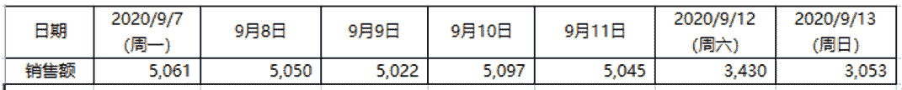
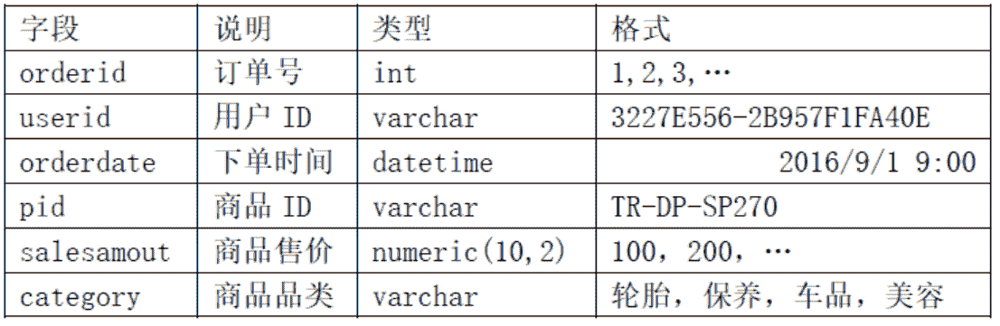
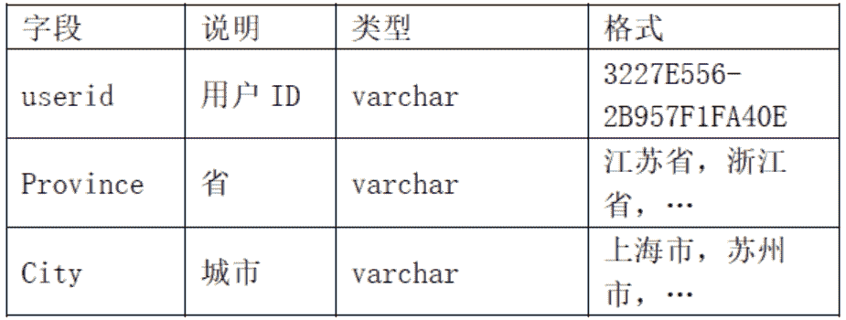

# 途虎养车 2021 秋招数据分析笔试试卷 A

## 1

五月份的商品销售额为 60 万元，该月的季节指数为 120%，则消除季节因素影响后，该月的商品销售额为（    ）万元

正确答案: B   你的答案: 空 (错误)

```cpp
72
```

```cpp
50
```

```cpp
60
```

```cpp
51.2
```

本题知识点

数据分析师 途虎 2021

讨论

[April1998](https://www.nowcoder.com/profile/1331240)

实际销售额=预估销售额（假设季节无影响）*季节指数

发表于 2020-12-09 22:29:37

* * *

[HLsudo](https://www.nowcoder.com/profile/624807814)

消除季节影响后的销售额=该月实际销售额/季节指数=60/120%=50

发表于 2021-03-23 20:40:21

* * *

## 2

有三个企业的年利润额分别是 5000 万元、8000 万元和 3900 万元，则这句话中有（  ）个变量

正确答案: B   你的答案: 空 (错误)

```cpp
0 个
```

```cpp
2 个
```

```cpp
1 个
```

```cpp
3 个
```

本题知识点

数据分析师 途虎 2021

讨论

[April1998](https://www.nowcoder.com/profile/1331240)

应该是企业和利润额两个变量

发表于 2020-12-09 22:30:28

* * *

[丙酮酸](https://www.nowcoder.com/profile/233938142)

不会是企业个数和年利率份额列表两个变量吧

发表于 2020-12-07 20:49:06

* * *

[许愿 offer 呀~](https://www.nowcoder.com/profile/180110967)

难道年份不用算吗 qaq

发表于 2021-08-31 13:48:24

* * *

## 3

下列哪两个变量之间的相关程度高

正确答案: C   你的答案: 空 (错误)

```cpp
商品销售额和商品销售量的相关系数是 0.9
```

```cpp
商品销售额与商业利润率的相关系数是 0.84
```

```cpp
平均流通费用率与商业利润率的相关系数是 0.94
```

```cpp
商品销售价格与销售量的相关系数是 0.91
```

本题知识点

数据分析师 途虎 2021

讨论

[-点横撇捺](https://www.nowcoder.com/profile/843180232)

相关系数是研究变量相关程度的量，相关系数越大，相关程度越高

发表于 2021-02-26 12:46:20

* * *

[April1998](https://www.nowcoder.com/profile/1331240)

真的只看后面的相关洗系数?

发表于 2020-12-10 10:12:59

* * *

[牛客 851811181 号](https://www.nowcoder.com/profile/851811181)

相关系数的绝对值越大，相关程度越高

发表于 2020-12-28 23:01:57

* * *

## 4

周末超市的营销额常常会高于平常，这种波动属于

正确答案: C   你的答案: 空 (错误)

```cpp
长期趋势
```

```cpp
循环变动
```

```cpp
季节变动
```

```cpp
不规则变动
```

本题知识点

数据分析师 途虎 2021

讨论

[牛客 10010195 号、](https://www.nowcoder.com/profile/838229532)

季节性，指的是任何一种周期性变化，不仅是一年之内

发表于 2021-01-25 09:42:26

* * *

[小风铃女侠](https://www.nowcoder.com/profile/462170018)

时间序列的影响因素：长期趋势、季节变动、循环波动、不规则变动：[`www.tjxzj.net/761.html`](http://www.tjxzj.net/761.html)

发表于 2021-01-06 20:00:00

* * *

[牛客 0204 号](https://www.nowcoder.com/profile/588785976)

为什么是季节啊，不应该每个周末都这样吗？

发表于 2020-12-30 00:46:16

* * *

## 5

一名研究人员希望用图形说明 5 月份以来我国每天新增甲型流感确诊病例数的变化趋势，你认为适合的图形是

正确答案: A   你的答案: 空 (错误)

```cpp
线图
```

```cpp
箱线图
```

```cpp
饼图
```

```cpp
茎叶图
```

本题知识点

数据分析师 途虎 2021

讨论

[牛客 819862691 号](https://www.nowcoder.com/profile/819862691)

一般时间序列数据都用线图展示变动趋势，每天确诊人数就是一组时序数据

发表于 2021-04-01 23:59:01

* * *

[热心王某某](https://www.nowcoder.com/profile/219777403)

只有线图可以直观的表现出变化趋势。

发表于 2021-03-16 19:50:36

* * *

## 6

某种股票原价格为 a 元，连续两天上涨，每次涨幅 10%，则该股票两天后的价格为

正确答案: A   你的答案: 空 (错误)

```cpp
1.21a 元
```

```cpp
1.1a 元
```

```cpp
1.2a 元
```

```cpp
 (0.2+a) 元
```

本题知识点

数据分析师 途虎 2021

讨论

[黄大ν](https://www.nowcoder.com/profile/648744172)

110%²

发表于 2021-05-03 08:33:02

* * *

[热心王某某](https://www.nowcoder.com/profile/219777403)

1+1*0.1+（1+1*0.1）*0.1

发表于 2021-03-16 19:52:05

* * *

## 7

下面的例子可以用 Paired-Samples T Test 过程进行分析的是

正确答案: B   你的答案: 空 (错误)

```cpp
家庭主妇和女大学生对同种商品喜好的差异    
```

```cpp
复用某种药物前后病情的改变情况
```

```cpp
复用药物和没有复用药物的病人身体状况的差异
```

```cpp
性别和年龄对雇员薪水的影响
```

本题知识点

数据分析师 途虎 2021

讨论

[牛客 561652228 号](https://www.nowcoder.com/profile/561652228)

首先，T 检验都是用来看两个样本的均值是不是又显著性差异。

1.单一样本 T 检验（One-Sample T Test）,用于比较一个正态总体在方差未知时总体均值与某一已知数是否有显著性差异。或者说，用看比较未知样本总体的均值和已知样本总体的均值（这个是已知的）是否有显著性差异。这里的单一样本是指只有一个样本总体。

2.独立样本 T 检验（Independent-Samples T Test）用于检验两个独立样本是否来自具有相同均值的总体，本质是对两个样本均值之差进行 T 检验。

3.配对样本 T 检验（Paired-Samples T Test）用于检验两个配对总体的均值是否存在显著性差异。这里的配对是指，这两个样本值之间是一一对应的，样本容量相同。

发表于 2020-12-09 22:20:19

* * *

[牛客 819862691 号](https://www.nowcoder.com/profile/819862691)

Paired-Samples T Tes 是对同一个体进行实验，获得前后的数据进行分析。B 就是同一个体服药前后的数据，C 是不同个体。

发表于 2021-04-02 00:01:25

* * *

[offer 进我碗里来](https://www.nowcoder.com/profile/468211726)

强调配对

发表于 2021-09-12 21:15:55

* * *

## 8

用 One-Way ANOVA 进行大、中、小城市 16 岁男性青年平均身高的比较，结果给出 sig.=0,043，说明

正确答案: A   你的答案: 空 (错误)

```cpp
按照 0.05 显著性水平，拒绝 H0，说明三种城市的平均身高有差别
```

```cpp
三种城市身高没有差别的可能性是 0.043
```

```cpp
三种城市身高有差别的可能性是 0.043
```

```cpp
说明城市不是身高的一个影响因素
```

本题知识点

数据分析师 途虎 2021

讨论

[零葬](https://www.nowcoder.com/profile/75718849)

这个说实话有点争议，因为 H0 都没给我

发表于 2020-12-27 14:00:52

* * *

[啊坡糍嘚](https://www.nowcoder.com/profile/93636636)

H0 假设一般都是自己想要得到结果的反面，探究不同地区的身高，从一般来讲，我们想得到的结果都是身高有差异的。因此，H0 就是身高没有差异。p 值我的理解是拒绝原假设犯错误的概率，也就是一类错误的概率。这只是犯错误的概率，并不能说事件发生的概率就是这个。

发表于 2021-09-13 11:37:46

* * *

[peipei111](https://www.nowcoder.com/profile/768208169)

为什么不能选 b，sig 指 p 值，即出现极端结果的概率

发表于 2021-02-11 17:59:05

* * *

## 9

用最小平方法给时间数列配合直线趋势方程 y=a+bt，当 b<0 时，说明现象的发展趋势是

正确答案: B   你的答案: 空 (错误)

```cpp
上升趋势
```

```cpp
下降趋势
```

```cpp
水平态势
```

```cpp
不能确定
```

本题知识点

数据分析师 途虎 2021

讨论

[180 天内只能修改一次？](https://www.nowcoder.com/profile/204687391)

那为什么不考虑 t <0 或 t = 0 的情况呢 ？

发表于 2020-12-18 11:05:21

* * *

[牛客小玮](https://www.nowcoder.com/profile/200045406)

一元一次方程，变量系数小于零单调递减。

发表于 2020-12-11 08:44:41

* * *

## 10

已知甲、乙两班学生统计学考试成绩：甲班平均分为 70 分，标准差为 7.5 分；乙班平均分为 75 分，标准差为 7.5 分。由此可知两个班考试成绩的离散程度

正确答案: A   你的答案: 空 (错误)

```cpp
甲班较大
```

```cpp
乙班较大
```

```cpp
两班相同
```

```cpp
无法作比较
```

本题知识点

数据分析师 途虎 2021

讨论

[数据制片人](https://www.nowcoder.com/profile/969185299)

标准差除以平均值为变异系数，用来观测量纲不同或均值不同的数据。

发表于 2020-12-14 15:03:19

* * *

[Qlimax](https://www.nowcoder.com/profile/862999737)

找到了一个例子：一只 5 斤的猫和一只 15 斤的猫体重差距大，还是一只 500 斤的老虎和一只 520 斤的老虎体重差距大

发表于 2021-02-28 11:35:14

* * *

[牛客 335614702 号](https://www.nowcoder.com/profile/335614702)

计算离散系数判断离散程度，离散系数越大，离散程度越大离散系数=标准差/平均值本题标准差相等，平均值越大，离散系数越小，故乙班离散系数较小。

发表于 2021-01-22 21:26:31

* * *

## 11

某地区今年和去年相比商品零售价格提高 12%，则用同样多的货币今年比去年少购买（     ）的商品

正确答案: A   你的答案: 空 (错误)

```cpp
10.71%
```

```cpp
21.95%
```

```cpp
12%
```

```cpp
13.64%
```

本题知识点

数据分析师 途虎 2021

讨论

[牛客 819862691 号](https://www.nowcoder.com/profile/819862691)

去年的价格 x，今年的价格 1.12x。今年买一单位的货币可以在去年买 1.12 单位。所以今年相比于去年购买：（1-1.12）/1.12=-10.7%

发表于 2021-04-02 00:10:13

* * *

[18 有点甜༂](https://www.nowcoder.com/profile/95693733)

假设一共有 112 元，一件物品一元，那么这 112 元在之前可以购买 112 件物品，而现在物价上升百分之十二，则 112 元可以购买 100 件，相比之下，少购买了十二件，除以之前可以购买的物品数量则得出百分之十点七一

发表于 2020-12-13 14:48:38

* * *

[xxmgh](https://www.nowcoder.com/profile/569125444)

1 块钱(1/x-1/1.12x)/(1/x)=1-1/1.12=0.12/1.12<0.12

发表于 2021-11-14 21:46:21

* * *

## 12

置信概率表达了区间估计的

正确答案: B   你的答案: 空 (错误)

```cpp
精准性
```

```cpp
可靠性
```

```cpp
显著性
```

```cpp
规范性
```

本题知识点

数据分析师 途虎 2021

讨论

[字节跳动的未来实习生](https://www.nowcoder.com/profile/853422800)

置信概率(confidence probability)是用来衡量统计推断可靠程度的概率

发表于 2021-05-27 10:48:23

* * *

## 13

AARRR 模型分别对应用户生命周期中的每个阶段。以下不属于某个阶段的是

正确答案: C   你的答案: 空 (错误)

```cpp
Activation
```

```cpp
Revenue
```

```cpp
Requirement 
```

```cpp
Acquisition
```

本题知识点

数据分析师 途虎 2021

讨论

[向着梦想奔跑的猪](https://www.nowcoder.com/profile/985293119)

AARRR 是 Acquisition、Activation、Retention、Revenue、Referral，五个单词的缩写，分别对应用户生命周期中的 5 个。以下以移动应用为例简单讲解 AARRR 模型每个阶段。用户获取（Acquisition）运营一款移动应用的第一步，毫无疑问是获取用户，也就是大家通常所说的推广。如果没有用户，就谈不上运营。用户激活（Activation）很多用户可能是通过终端预置（刷机）、广告等不同的渠道进入应用的，这些用户是被动地进入应用的。如何把他们转化为活跃用户，是运营者面临的第一个问题。当然，这里面一个重要的因素是推广渠道的质量。差的推广渠道带来的是大量的一次性用户，也就是那种启动一次，但是再也不会使用的那种用户。严格意义上说，这种不能算是真正的用户。好的推广渠道往往是有针对性地圈定了目标人群，他们带来的用户和应用设计时设定的目标人群有很大吻合度，这样的用户通常比较容易成为活跃用户。另外，挑选推广渠道的时候一定要先分析自己应用的特性（例如是否小众应用）以及目标人群。对别人来说是个好的推广渠道，对你却不一定合适。另一个重要的因素是产品本身是否能在最初使用的几十秒钟内抓住用户。再有内涵的应用，如果给人的第一印象不好，也会“相亲”失败，成为“娶不到媳妇的老大难”。此外，还有些应用会通过体验良好的新手教程来吸引新用户，这在游戏行业尤其突出。用户留存（Retention）有些应用在解决了活跃度的问题以后，又发现了另一个问题：“用户来得快、走得也快”。有时候我们也说是这款应用没有用户粘性。我们都知道，通常保留一个老客户的成本要远远低于获取一个新客户的成本。所以狗熊掰玉米（拿一个、丢一个）的情况是应用运营的大忌。但是很多应用确实并不清楚用户是在什么时间流失的，于是一方面他们不断地开拓新用户，另一方面又不断地有大量用户流失。解决这个问题首先需要通过日[留存率](https://baike.baidu.com/item/%E7%95%99%E5%AD%98%E7%8E%87/3609437)、周留存率、月留存率等指标监控应用的用户流失情况，并采取相应的手段在用户流失之前，激励这些用户继续使用应用。留存率跟应用的类型也有很大关系。通常来说，工具类应用的首月留存率可能普遍比游戏类的首月留存率要高。获得收益（Revenue）获取收入其实是应用运营最核心的一块。极少有人开发一款应用只是纯粹出于兴趣，绝大多数开发者最关心的就是收入。即使是免费应用，也应该有其盈利的模式。收入有很多种来源，主要的有三种：付费应用、应用内付费、以及广告。付费应用在国内的接受程度很低，包括 Google Play Store 在中国也只推免费应用。在国内，广告是大部分开发者的收入来源，而应用内付费在游戏行业应用比较多。无论是以上哪一种，收入都直接或间接来自用户。所以，前面所提的提高活跃度、提高[留存率](https://baike.baidu.com/item/%E7%95%99%E5%AD%98%E7%8E%87/3609437)，对获取收入来说，是必需的基础。用户基数大了，收入才有可能上量。推荐传播（Referral）以前的运营模型到第四个层次就结束了，但是社交网络的兴起，使得运营增加了一个方面，就是基于社交网络的[病毒式传播](https://baike.baidu.com/item/%E7%97%85%E6%AF%92%E5%BC%8F%E4%BC%A0%E6%92%AD/4066980)，这已经成为获取用户的一个新途径。这个方式的成本很低，而且效果有可能非常好；唯一的前提是产品自身要足够好，有很好的口碑。从自传播到再次获取新用户，应用运营形成了一个螺旋式上升的轨道。而那些优秀的应用就很好地利用了这个轨道，不断扩大自己的用户群体。通过上述这个 AARRR 模型，我们看到获取用户（推广）只是整个应用运营中的第一步，好戏都还在后头。如果只看推广，不重视运营中的其它几个层次，任由用户自生自灭，那么应用的前景必定是暗淡的。

发表于 2020-12-07 21:23:34

* * *

[热心王某某](https://www.nowcoder.com/profile/219777403)

Acquisition,获取；Activation,激活；Retention,留存；Revenue,收益;Referral,推荐

发表于 2021-03-16 20:07:20

* * *

## 14

下面哪一项是属于用户自主访问流量？

正确答案: B   你的答案: 空 (错误)

```cpp
通过淘宝搜索来的流量
```

```cpp
用户从自己的购物车.收藏夹里来的流量
```

```cpp
通过一套搜索来的流量
```

```cpp
从商城首页来的流量
```

本题知识点

数据分析师 途虎 2021

讨论

[多拿 offer](https://www.nowcoder.com/profile/52157008)

搜索难道不是自主行为？

发表于 2021-03-07 17:14:54

* * *

[yufung](https://www.nowcoder.com/profile/520148374)

1.用户搜索出来的商品，平台会根据用户推荐更符合他偏好的该类别商品 2.从自己的购物车/收藏夹里的商品，虽然之前可能被推荐引流来的，但是那是上个阶段的被动行为。3.用户从自己的购物车/收藏夹里的流量是这个阶段的主动行为

发表于 2021-09-05 09:47:37

* * *

[ZhouHS](https://www.nowcoder.com/profile/187596801)

自主访问我理解应该是用户自己的主动行为，而不是被动推荐的，用户从购物车收藏夹里的流量有可能是之间引流的流量，不一定是自主访问的

发表于 2021-02-02 16:05:42

* * *

## 15

以下哪个指标，是指只访问了入口页面（例如网站首页）就离开的访问量与所产生总访问量的百分比

正确答案: D   你的答案: 空 (错误)

```cpp
页面转化率
```

```cpp
页面二跳率
```

```cpp
页面点击率
```

```cpp
页面跳出率
```

本题知识点

数据分析师 途虎 2021

讨论

[牛客 590065430 号](https://www.nowcoder.com/profile/590065430)

页面转化率；页面点击率：转化率是根据网站性质不同，定义也有所不同。靠卖广告位来盈利的网站，要的就是点击，流量，那么从广告曝光到点击广告，这个转化率通常就叫“点击率”；如果是靠销售来盈利的网站，最终订单的生成为真正有效的转化的话，那么转化率就可以被你定义为一段时间内订单的金额除以广告的花费。页面二跳率：当网站页面展开后，用户在页面上产生的首次点击被称为“二跳”，二跳的次数即为“二跳量”。二跳量与浏览量的比值称为页面的二跳率。页面跳出率：跳出率是指当网站页面展开后，用户仅浏览了该页面就离开该网站的比例。页面退出率：退出率是指从该页面离开网站的次数占该网页总浏览次数的比例。[`blog.sina.com.cn/s/blog_bd19f7750101qdb3.html`](http://blog.sina.com.cn/s/blog_bd19f7750101qdb3.html)

发表于 2020-12-31 10:26:38

* * *

## 16

以下是一家电商网站的一周销售数据，该网站主要用户群是办公室女性，销售额主要集中在 5 种产品上，如果你是这家公司的分析师

a)       从数据中，你看到了什么问题？你觉得背后的原因是什么？

b)       通过数据，你会提出哪些运营改进策略？

表如下：一组每天某网站的销售数据

你的答案

本题知识点

数据分析师 途虎 2021

讨论

[牛客 717435390 号](https://www.nowcoder.com/profile/717435390)

a) 销售额在工作日趋于平稳，在 2020/9/12、2020/9/13 两天下降幅度最大。原因可能是在目标用户群为办公室女性，在周末大家休假的时候他们会选择外出逛街买东西而不是在网络购物 b) 1.增加用户粘度：1）如在特定的时间发放一定数量的优惠券供目标用户抢，并且设置优惠券使用时间只能是周末使用                                 2)  利用 ABtest，选取一小部分目标用户测试不同风格的对点击量的影响     2.增加平均购物车大小：如设置满减优惠，买够多少可以享受满减，适当设置跨店满减     3.增加病毒式增长系数：设置分享奖励，并且划分奖励层级：新老用户点进分享链接为一级，加入购物车并购买和新用户注册为二级，新用户注册并购       买为三级     4.用户调研，了解目标用户周末的行为，询问改进优化方向，完成调查问卷可以设置优惠券等奖励机制     5.挖掘寻找新目标用户，对小部分潜在新群体实行针对他们的 MVP 测试效果，如果效果良好可以加大规模

发表于 2021-02-19 15:35:28

* * *

[无语之](https://www.nowcoder.com/profile/630911882)

a) 可以看出工作日的销售额稳定，周末的销售额明显低于工作日，且周六销售额比周日高 10%以上。背后的原因可能有：    ①用户主要在工作间隙浏览网站并进行购买，这解释了为什么工作日销售额明显高于周末，且周六略高于周日（部分公司周六会上班）    ②办公室女性会在工作间隙互相分享好物，因此在工作日时浏览量更多
b) 根据 a 中的分析，主要要解决的问题是如何让用户在周末也进行更多的浏览与购买，根据漏斗模型，可以从增加浏览网站的用户数出发。可以进行的策略：    ①推出每日打卡任务，略微给予积分奖励，并且保持连续打卡可获得更高的积分，从而促进用户在周末依然保持浏览习惯
    ②推出周末限定的用户之间互相分享的奖励，例如周末打卡后可进行积分雨游戏，分享给好友可多获得一次机会，从而引导用户进行分享；还可对购买成功的用户设置分享领积分的奖励，引导在周末购买的用户将购买记录分享给他们，从而起到一定分享促活跃的效果

发表于 2021-09-07 14:48:21

* * *

[从零开始刷代码](https://www.nowcoder.com/profile/120101881)

1、到周末时，销售数据会显著下降，可能原因是周末网站的主要客户群体办公室女性不太可能再通过网站购物，可能选择其他渠道进行购物消费；或者离开工作岗位后，主要客户群体不太会产生购物消费的需求。2、在工作日进行营销，将一部分用户的消费需求导向周末，比如使用有时限限制的优惠券等。

发表于 2021-02-17 17:14:08

* * *

## 17

订单表 tbl_order 用户表 tbl_user

 1、查询 2017 年上半年（1-6 月），上海地区销售额排名前 10 的商品 ID。需要的字段：商品 ID

2、查询 2017 年 7 月所有订单中，有且仅有轮胎和保养两个品类的订单数 

你的答案

本题知识点

数据分析师 途虎 2021

讨论

[1064 丶 Notfound](https://www.nowcoder.com/profile/367839354)

1、select pid
from tbl_order o 
JOIN tbl_user u 
on o.userid=u.userid
where City = '上海市' and orderdate between '2017/1/1 00:00' and '2017/6/30 23:59'
group by pidorder by sum(salesamout)limit 102、SELECT pid, COUNT(*)

FROM tbl_order 
WHERE category NOT IN ('车品','美容'）and orderdate between '2017/7/1 00:00' and '2017/7/31 23:59'
GROUP BY pid 

发表于 2021-02-08 17:49:14

* * *

[牛客 875451317 号](https://www.nowcoder.com/profile/875451317)

```cpp
1\. 
selcet pid from tbl_order o left join tbl_user u on o.user_id=u.user_id
where u.city='上海' and month(o.order_date)<=6 
order by sum(salesamout)
group by pid
limit 10

2.

	select count(*) from tbl_user

	where category in ('轮胎','保养') and month(order date)=7 and year(order date)=2017  

```

编辑于 2021-08-16 15:14:13

* * *

[牛客 349970922 号](https://www.nowcoder.com/profile/349970922)

1、select pid from(select pid,sum(salesamount) as sfrom tbl_order t1join tbl_user t2on t1.userid =t2.useridwhere to_date(t1.orderdate,'yyyyMMdd')>='2017-01-01' and to_date(t1.orderdate,'yyyyMMdd')<'2017-07-01'and t2.City='上海市'group by 1order by s desc) tlimit 10;2、select count(orderid)from tbl_order where year(orderdate)='2017' and month(orderdate)=7 and category in ('轮胎','保养');

发表于 2022-02-17 14:41:46

* * *