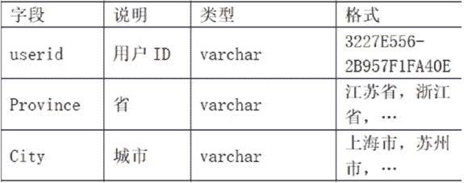

# 途虎养车 2021 秋招数据分析笔试试卷 B

## 1

五月份的商品销售额为 60 万元，该月的季节指数为 120%，则消除季节因素影响后，该月的商品销售额为（    ）万元

正确答案: B   你的答案: 空 (错误)

```cpp
72
```

```cpp
50
```

```cpp
60
```

```cpp
51.2
```

本题知识点

数据分析师 途虎 2021

讨论

[April1998](https://www.nowcoder.com/profile/1331240)

实际销售额=预估销售额（假设季节无影响）*季节指数

发表于 2020-12-09 22:29:37

* * *

[HLsudo](https://www.nowcoder.com/profile/624807814)

消除季节影响后的销售额=该月实际销售额/季节指数=60/120%=50

发表于 2021-03-23 20:40:21

* * *

## 2

有三个企业的年利润额分别是 5000 万元、8000 万元和 3900 万元，则这句话中有（  ）个变量

正确答案: B   你的答案: 空 (错误)

```cpp
0 个
```

```cpp
2 个
```

```cpp
1 个
```

```cpp
3 个
```

本题知识点

数据分析师 途虎 2021

讨论

[April1998](https://www.nowcoder.com/profile/1331240)

应该是企业和利润额两个变量

发表于 2020-12-09 22:30:28

* * *

[丙酮酸](https://www.nowcoder.com/profile/233938142)

不会是企业个数和年利率份额列表两个变量吧

发表于 2020-12-07 20:49:06

* * *

[许愿 offer 呀~](https://www.nowcoder.com/profile/180110967)

难道年份不用算吗 qaq

发表于 2021-08-31 13:48:24

* * *

## 3

下列哪两个变量之间的相关程度高

正确答案: C   你的答案: 空 (错误)

```cpp
商品销售额和商品销售量的相关系数是 0.9
```

```cpp
商品销售额与商业利润率的相关系数是 0.84
```

```cpp
平均流通费用率与商业利润率的相关系数是 0.94
```

```cpp
商品销售价格与销售量的相关系数是 0.91
```

本题知识点

数据分析师 途虎 2021

讨论

[-点横撇捺](https://www.nowcoder.com/profile/843180232)

相关系数是研究变量相关程度的量，相关系数越大，相关程度越高

发表于 2021-02-26 12:46:20

* * *

[April1998](https://www.nowcoder.com/profile/1331240)

真的只看后面的相关洗系数?

发表于 2020-12-10 10:12:59

* * *

[牛客 851811181 号](https://www.nowcoder.com/profile/851811181)

相关系数的绝对值越大，相关程度越高

发表于 2020-12-28 23:01:57

* * *

## 4

周末超市的营销额常常会高于平常，这种波动属于

正确答案: C   你的答案: 空 (错误)

```cpp
长期趋势
```

```cpp
循环变动
```

```cpp
季节变动
```

```cpp
不规则变动
```

本题知识点

数据分析师 途虎 2021

讨论

[牛客 10010195 号、](https://www.nowcoder.com/profile/838229532)

季节性，指的是任何一种周期性变化，不仅是一年之内

发表于 2021-01-25 09:42:26

* * *

[小风铃女侠](https://www.nowcoder.com/profile/462170018)

时间序列的影响因素：长期趋势、季节变动、循环波动、不规则变动：[`www.tjxzj.net/761.html`](http://www.tjxzj.net/761.html)

发表于 2021-01-06 20:00:00

* * *

[牛客 0204 号](https://www.nowcoder.com/profile/588785976)

为什么是季节啊，不应该每个周末都这样吗？

发表于 2020-12-30 00:46:16

* * *

## 5

一名研究人员希望用图形说明 5 月份以来我国每天新增甲型流感确诊病例数的变化趋势，你认为适合的图形是

正确答案: A   你的答案: 空 (错误)

```cpp
线图
```

```cpp
箱线图
```

```cpp
饼图
```

```cpp
茎叶图
```

本题知识点

数据分析师 途虎 2021

讨论

[牛客 819862691 号](https://www.nowcoder.com/profile/819862691)

一般时间序列数据都用线图展示变动趋势，每天确诊人数就是一组时序数据

发表于 2021-04-01 23:59:01

* * *

[热心王某某](https://www.nowcoder.com/profile/219777403)

只有线图可以直观的表现出变化趋势。

发表于 2021-03-16 19:50:36

* * *

## 6

某种股票原价格为 a 元，连续两天上涨，每次涨幅 10%，则该股票两天后的价格为

正确答案: A   你的答案: 空 (错误)

```cpp
1.21a 元
```

```cpp
1.1a 元
```

```cpp
1.2a 元
```

```cpp
 (0.2+a) 元
```

本题知识点

数据分析师 途虎 2021

讨论

[黄大ν](https://www.nowcoder.com/profile/648744172)

110%²

发表于 2021-05-03 08:33:02

* * *

[热心王某某](https://www.nowcoder.com/profile/219777403)

1+1*0.1+（1+1*0.1）*0.1

发表于 2021-03-16 19:52:05

* * *

## 7

下面的例子可以用 Paired-Samples T Test 过程进行分析的是

正确答案: B   你的答案: 空 (错误)

```cpp
家庭主妇和女大学生对同种商品喜好的差异    
```

```cpp
复用某种药物前后病情的改变情况
```

```cpp
复用药物和没有复用药物的病人身体状况的差异
```

```cpp
性别和年龄对雇员薪水的影响
```

本题知识点

数据分析师 途虎 2021

讨论

[牛客 561652228 号](https://www.nowcoder.com/profile/561652228)

首先，T 检验都是用来看两个样本的均值是不是又显著性差异。

1.单一样本 T 检验（One-Sample T Test）,用于比较一个正态总体在方差未知时总体均值与某一已知数是否有显著性差异。或者说，用看比较未知样本总体的均值和已知样本总体的均值（这个是已知的）是否有显著性差异。这里的单一样本是指只有一个样本总体。

2.独立样本 T 检验（Independent-Samples T Test）用于检验两个独立样本是否来自具有相同均值的总体，本质是对两个样本均值之差进行 T 检验。

3.配对样本 T 检验（Paired-Samples T Test）用于检验两个配对总体的均值是否存在显著性差异。这里的配对是指，这两个样本值之间是一一对应的，样本容量相同。

发表于 2020-12-09 22:20:19

* * *

[牛客 819862691 号](https://www.nowcoder.com/profile/819862691)

Paired-Samples T Tes 是对同一个体进行实验，获得前后的数据进行分析。B 就是同一个体服药前后的数据，C 是不同个体。

发表于 2021-04-02 00:01:25

* * *

[offer 进我碗里来](https://www.nowcoder.com/profile/468211726)

强调配对

发表于 2021-09-12 21:15:55

* * *

## 8

用 One-Way ANOVA 进行大、中、小城市 16 岁男性青年平均身高的比较，结果给出 sig.=0,043，说明

正确答案: A   你的答案: 空 (错误)

```cpp
按照 0.05 显著性水平，拒绝 H0，说明三种城市的平均身高有差别
```

```cpp
三种城市身高没有差别的可能性是 0.043
```

```cpp
三种城市身高有差别的可能性是 0.043
```

```cpp
说明城市不是身高的一个影响因素
```

本题知识点

数据分析师 途虎 2021

讨论

[零葬](https://www.nowcoder.com/profile/75718849)

这个说实话有点争议，因为 H0 都没给我

发表于 2020-12-27 14:00:52

* * *

[啊坡糍嘚](https://www.nowcoder.com/profile/93636636)

H0 假设一般都是自己想要得到结果的反面，探究不同地区的身高，从一般来讲，我们想得到的结果都是身高有差异的。因此，H0 就是身高没有差异。p 值我的理解是拒绝原假设犯错误的概率，也就是一类错误的概率。这只是犯错误的概率，并不能说事件发生的概率就是这个。

发表于 2021-09-13 11:37:46

* * *

[peipei111](https://www.nowcoder.com/profile/768208169)

为什么不能选 b，sig 指 p 值，即出现极端结果的概率

发表于 2021-02-11 17:59:05

* * *

## 9

用最小平方法给时间数列配合直线趋势方程 y=a+bt，当 b<0 时，说明现象的发展趋势是

正确答案: B   你的答案: 空 (错误)

```cpp
上升趋势
```

```cpp
下降趋势
```

```cpp
水平态势
```

```cpp
不能确定
```

本题知识点

数据分析师 途虎 2021

讨论

[180 天内只能修改一次？](https://www.nowcoder.com/profile/204687391)

那为什么不考虑 t <0 或 t = 0 的情况呢 ？

发表于 2020-12-18 11:05:21

* * *

[牛客小玮](https://www.nowcoder.com/profile/200045406)

一元一次方程，变量系数小于零单调递减。

发表于 2020-12-11 08:44:41

* * *

## 10

已知甲、乙两班学生统计学考试成绩：甲班平均分为 70 分，标准差为 7.5 分；乙班平均分为 75 分，标准差为 7.5 分。由此可知两个班考试成绩的离散程度

正确答案: A   你的答案: 空 (错误)

```cpp
甲班较大
```

```cpp
乙班较大
```

```cpp
两班相同
```

```cpp
无法作比较
```

本题知识点

数据分析师 途虎 2021

讨论

[数据制片人](https://www.nowcoder.com/profile/969185299)

标准差除以平均值为变异系数，用来观测量纲不同或均值不同的数据。

发表于 2020-12-14 15:03:19

* * *

[Qlimax](https://www.nowcoder.com/profile/862999737)

找到了一个例子：一只 5 斤的猫和一只 15 斤的猫体重差距大，还是一只 500 斤的老虎和一只 520 斤的老虎体重差距大

发表于 2021-02-28 11:35:14

* * *

[牛客 335614702 号](https://www.nowcoder.com/profile/335614702)

计算离散系数判断离散程度，离散系数越大，离散程度越大离散系数=标准差/平均值本题标准差相等，平均值越大，离散系数越小，故乙班离散系数较小。

发表于 2021-01-22 21:26:31

* * *

## 11

某地区今年和去年相比商品零售价格提高 12%，则用同样多的货币今年比去年少购买（     ）的商品

正确答案: A   你的答案: 空 (错误)

```cpp
10.71%
```

```cpp
21.95%
```

```cpp
12%
```

```cpp
13.64%
```

本题知识点

数据分析师 途虎 2021

讨论

[牛客 819862691 号](https://www.nowcoder.com/profile/819862691)

去年的价格 x，今年的价格 1.12x。今年买一单位的货币可以在去年买 1.12 单位。所以今年相比于去年购买：（1-1.12）/1.12=-10.7%

发表于 2021-04-02 00:10:13

* * *

[18 有点甜༂](https://www.nowcoder.com/profile/95693733)

假设一共有 112 元，一件物品一元，那么这 112 元在之前可以购买 112 件物品，而现在物价上升百分之十二，则 112 元可以购买 100 件，相比之下，少购买了十二件，除以之前可以购买的物品数量则得出百分之十点七一

发表于 2020-12-13 14:48:38

* * *

[xxmgh](https://www.nowcoder.com/profile/569125444)

1 块钱(1/x-1/1.12x)/(1/x)=1-1/1.12=0.12/1.12<0.12

发表于 2021-11-14 21:46:21

* * *

## 12

置信概率表达了区间估计的

正确答案: B   你的答案: 空 (错误)

```cpp
精准性
```

```cpp
可靠性
```

```cpp
显著性
```

```cpp
规范性
```

本题知识点

数据分析师 途虎 2021

讨论

[字节跳动的未来实习生](https://www.nowcoder.com/profile/853422800)

置信概率(confidence probability)是用来衡量统计推断可靠程度的概率

发表于 2021-05-27 10:48:23

* * *

## 13

AARRR 模型分别对应用户生命周期中的每个阶段。以下不属于某个阶段的是

正确答案: C   你的答案: 空 (错误)

```cpp
Activation
```

```cpp
Revenue
```

```cpp
Requirement 
```

```cpp
Acquisition
```

本题知识点

数据分析师 途虎 2021

讨论

[向着梦想奔跑的猪](https://www.nowcoder.com/profile/985293119)

AARRR 是 Acquisition、Activation、Retention、Revenue、Referral，五个单词的缩写，分别对应用户生命周期中的 5 个。以下以移动应用为例简单讲解 AARRR 模型每个阶段。用户获取（Acquisition）运营一款移动应用的第一步，毫无疑问是获取用户，也就是大家通常所说的推广。如果没有用户，就谈不上运营。用户激活（Activation）很多用户可能是通过终端预置（刷机）、广告等不同的渠道进入应用的，这些用户是被动地进入应用的。如何把他们转化为活跃用户，是运营者面临的第一个问题。当然，这里面一个重要的因素是推广渠道的质量。差的推广渠道带来的是大量的一次性用户，也就是那种启动一次，但是再也不会使用的那种用户。严格意义上说，这种不能算是真正的用户。好的推广渠道往往是有针对性地圈定了目标人群，他们带来的用户和应用设计时设定的目标人群有很大吻合度，这样的用户通常比较容易成为活跃用户。另外，挑选推广渠道的时候一定要先分析自己应用的特性（例如是否小众应用）以及目标人群。对别人来说是个好的推广渠道，对你却不一定合适。另一个重要的因素是产品本身是否能在最初使用的几十秒钟内抓住用户。再有内涵的应用，如果给人的第一印象不好，也会“相亲”失败，成为“娶不到媳妇的老大难”。此外，还有些应用会通过体验良好的新手教程来吸引新用户，这在游戏行业尤其突出。用户留存（Retention）有些应用在解决了活跃度的问题以后，又发现了另一个问题：“用户来得快、走得也快”。有时候我们也说是这款应用没有用户粘性。我们都知道，通常保留一个老客户的成本要远远低于获取一个新客户的成本。所以狗熊掰玉米（拿一个、丢一个）的情况是应用运营的大忌。但是很多应用确实并不清楚用户是在什么时间流失的，于是一方面他们不断地开拓新用户，另一方面又不断地有大量用户流失。解决这个问题首先需要通过日[留存率](https://baike.baidu.com/item/%E7%95%99%E5%AD%98%E7%8E%87/3609437)、周留存率、月留存率等指标监控应用的用户流失情况，并采取相应的手段在用户流失之前，激励这些用户继续使用应用。留存率跟应用的类型也有很大关系。通常来说，工具类应用的首月留存率可能普遍比游戏类的首月留存率要高。获得收益（Revenue）获取收入其实是应用运营最核心的一块。极少有人开发一款应用只是纯粹出于兴趣，绝大多数开发者最关心的就是收入。即使是免费应用，也应该有其盈利的模式。收入有很多种来源，主要的有三种：付费应用、应用内付费、以及广告。付费应用在国内的接受程度很低，包括 Google Play Store 在中国也只推免费应用。在国内，广告是大部分开发者的收入来源，而应用内付费在游戏行业应用比较多。无论是以上哪一种，收入都直接或间接来自用户。所以，前面所提的提高活跃度、提高[留存率](https://baike.baidu.com/item/%E7%95%99%E5%AD%98%E7%8E%87/3609437)，对获取收入来说，是必需的基础。用户基数大了，收入才有可能上量。推荐传播（Referral）以前的运营模型到第四个层次就结束了，但是社交网络的兴起，使得运营增加了一个方面，就是基于社交网络的[病毒式传播](https://baike.baidu.com/item/%E7%97%85%E6%AF%92%E5%BC%8F%E4%BC%A0%E6%92%AD/4066980)，这已经成为获取用户的一个新途径。这个方式的成本很低，而且效果有可能非常好；唯一的前提是产品自身要足够好，有很好的口碑。从自传播到再次获取新用户，应用运营形成了一个螺旋式上升的轨道。而那些优秀的应用就很好地利用了这个轨道，不断扩大自己的用户群体。通过上述这个 AARRR 模型，我们看到获取用户（推广）只是整个应用运营中的第一步，好戏都还在后头。如果只看推广，不重视运营中的其它几个层次，任由用户自生自灭，那么应用的前景必定是暗淡的。

发表于 2020-12-07 21:23:34

* * *

[热心王某某](https://www.nowcoder.com/profile/219777403)

Acquisition,获取；Activation,激活；Retention,留存；Revenue,收益;Referral,推荐

发表于 2021-03-16 20:07:20

* * *

## 14

下面哪一项是属于用户自主访问流量？

正确答案: B   你的答案: 空 (错误)

```cpp
通过淘宝搜索来的流量
```

```cpp
用户从自己的购物车.收藏夹里来的流量
```

```cpp
通过一套搜索来的流量
```

```cpp
从商城首页来的流量
```

本题知识点

数据分析师 途虎 2021

讨论

[多拿 offer](https://www.nowcoder.com/profile/52157008)

搜索难道不是自主行为？

发表于 2021-03-07 17:14:54

* * *

[yufung](https://www.nowcoder.com/profile/520148374)

1.用户搜索出来的商品，平台会根据用户推荐更符合他偏好的该类别商品 2.从自己的购物车/收藏夹里的商品，虽然之前可能被推荐引流来的，但是那是上个阶段的被动行为。3.用户从自己的购物车/收藏夹里的流量是这个阶段的主动行为

发表于 2021-09-05 09:47:37

* * *

[ZhouHS](https://www.nowcoder.com/profile/187596801)

自主访问我理解应该是用户自己的主动行为，而不是被动推荐的，用户从购物车收藏夹里的流量有可能是之间引流的流量，不一定是自主访问的

发表于 2021-02-02 16:05:42

* * *

## 15

以下哪个指标，是指只访问了入口页面（例如网站首页）就离开的访问量与所产生总访问量的百分比

正确答案: D   你的答案: 空 (错误)

```cpp
页面转化率
```

```cpp
页面二跳率
```

```cpp
页面点击率
```

```cpp
页面跳出率
```

本题知识点

数据分析师 途虎 2021

讨论

[牛客 590065430 号](https://www.nowcoder.com/profile/590065430)

页面转化率；页面点击率：转化率是根据网站性质不同，定义也有所不同。靠卖广告位来盈利的网站，要的就是点击，流量，那么从广告曝光到点击广告，这个转化率通常就叫“点击率”；如果是靠销售来盈利的网站，最终订单的生成为真正有效的转化的话，那么转化率就可以被你定义为一段时间内订单的金额除以广告的花费。页面二跳率：当网站页面展开后，用户在页面上产生的首次点击被称为“二跳”，二跳的次数即为“二跳量”。二跳量与浏览量的比值称为页面的二跳率。页面跳出率：跳出率是指当网站页面展开后，用户仅浏览了该页面就离开该网站的比例。页面退出率：退出率是指从该页面离开网站的次数占该网页总浏览次数的比例。[`blog.sina.com.cn/s/blog_bd19f7750101qdb3.html`](http://blog.sina.com.cn/s/blog_bd19f7750101qdb3.html)

发表于 2020-12-31 10:26:38

* * *

## 16

订单表 tbl_table用户表 tbl_user
1. 2020 年第一季度（1-3 月），全国整体业务同比下滑最大三个城市是哪几个？（用 sql 实现计算逻辑）2. 公司希望各条业务线完成双十一 100%的订单增长目标，帮助供应链团队计算下 2020 年双十一当天各省不同轮胎需要备多少库存（用 sql 实现轮胎条数计算的逻辑）

你的答案

本题知识点

数据分析师 途虎 2021

讨论

[是咸蛋黄呀](https://www.nowcoder.com/profile/464816781)

```cpp
SELECT DISTINCT city
FROM
  (SELECT b.city,
          sum(CASE
                  WHEN a.orderdate BETWEEN '2020-01-01 00:00:00' AND '2020-03-31 23:59:59' THEN a.salesamount
                  ELSE 0
              END) AS sum_1,
          sum(CASE
                  WHEN a.orderdate BETWEEN '2019-01-01 00:00:00' AND '2019-03-31 23:59:59' THEN a.salesamount
                  ELSE 0
              END) AS sum_0
   FROM tbl_table a
   LEFT JOIN tbl_user b ON a.userid = b.userid
   GROUP BY b.city ) AS c
ORDER BY (sum_1-sum_0)/sum_0
LIMIT 3 ；

```

 编辑于 2021-04-21 12:04:53

* * *

[eggman](https://www.nowcoder.com/profile/538295068)

上面很多答案都运行不了，我专门建表跑了一下，下面的代码在我的测试数据下是 ok 的。我的数据是四个用户分别在四个城市，然后算同比，方便调试代码。 ```cpp
with t1 as (
select  u.*,sum(salesamount) as smt  from tbl_table t join tbl_user u
on t.userid = u.userid
where date(orderdate)  between '2019-01-01' and '2019-03-31' group by City
),   # t1 是 2019 年第一季度的表 
t2 as(
select u.*,sum(salesamount) as smt  from tbl_table t join tbl_user u
on t.userid = u.userid
where date(orderdate)  between '2020-01-01' and '2020-03-31' group by City
)    # t2 是 2020 年第一季度的表 
select City from (
select t2.*,row_number() over(order by t2.smt/t1.smt )  as rk from   t1 join t2 on t1.City= t2.City
) b
where rk<4
``` 

发表于 2021-04-21 11:00:30

* * *

[牛客 10010195 号、](https://www.nowcoder.com/profile/838229532)

1. -- 业务指标 ： 订单量 ，因为 tbl_tabl 没有提供商品销量
  select 
      t_1.city
      ,t_1.oder_num_20- t_2.oder_num_19)/t_2.oder_num_19 as dec_rank 
  from 
  -- 2020 年第一季度（1-3 月）全国各城市订单量
  (select
       c.city
    -- 同比订单下滑量 （20 -19）/19 
      ,count b.oderid as oder_num_20
  from tbl_table b  left join  tbl_user c on b.userid = a.userid 
  where  b.oderdata between ’2020-01-01‘ and ’2020-01-03‘ 
  group by c.City ) as t_1 
  left join 
   -- 2019 年第一季度（1-3 月）全国各城市订单量
  (select
       c.city
      ,count b.oderid as oder_num_19 
  from tbl_table b  left join  tbl_user c on b.userid = a.userid 
  where  b.oderdata between ’2019-01-01‘ and ’2019-01-03‘ 
  group by c.City ) as t_2 
  on t_1.city = t_2.c.ty 
  order by dec_rank 
  limit 3

2. -- 双十一 100%的订单增长 ：2020 各省轮胎数 = 2019 各省轮胎数* 2 。
-- 由于没有具体的销量，只能用订单数代替销量.

selet 
 b.Province
  ,(count a.orderid ) *2 as luntai_predicted_value
from  tbl_table a
left join tbl_user b on a.userid=b.userid 
group by b.Province
having a.orderdata = '2019-11-11' and a.catagory = 轮胎 

发表于 2021-01-26 09:57:59

* * *

## 17

途虎希望在 2021 年开出 3000 家工场店，请针对开店选择城市的问题帮业务方分析。1.若已知城市汽车保有数量、保有量中的车龄与车价等数据，你还需要什么信息？（可随意发挥，列出指标）2.通过什么逻辑测算出城市可以开多少家途虎养车工场店？

你的答案

本题知识点

数据分析师 途虎 2021

讨论

[跳跳虎呀](https://www.nowcoder.com/profile/803624551)

1.开店选择城市还需要考虑到市场需求，市场竞争，开店成本等维度。衡量市场需求的指标：城市人口，城市面积，城市每日上路的汽车数量，平均行驶里程，平均行驶时长。衡量市场竞争的指标：已有工场店数量，工场店平均覆盖面积，工场店平均服务汽车数量。衡量开店成本的指标：城市地价租金，员工薪资。2.可以通过需求供给角度分析，某城市汽车保有量有 m 辆，每日出行率为 x，平均行驶里程为 y，假设平均汽车行驶 1000 千米需要保养一次，保养 1 次的时间为 2 小时，则该城市每日的汽车养护需求时长为 m*x*y/1000*2；假设 1 家工场店有 10 个养护车间，日均工作时间为 10 小时，则该城市需要 m*x*y/1000*2/10/10,即城市汽车保有量*每日出行率*日均行驶里程/50000 家工场店。

编辑于 2021-01-14 12:18:32

* * *

[牛客 10010195 号、](https://www.nowcoder.com/profile/838229532)

一

1.  城市各区人群年龄段分布

2.  各区竞争对手量、价位、服务类目、口碑水平

3.  途虎 工厂点 服务类目、价位

二

1.  目标城市划分为区

    可以按照城市区域划分，便于基本数据收集

2.  计算各区可开工厂店数量

    1.  计算各区市场空白面积

        空白面积= 实际需求面积 - 供给面积 。维度：月、百平米

        1.  实际需求：以工厂店为参照，各区所需要的总工场店面积、价格水平

            数据需求：保养率、途虎店铺月服务车辆数、途虎店铺平均面积、目标城市的服务费用、

            1.  店铺面积需求 = 月需求量 / 月服务能力

                1.  月需求量 = 保有量 * 月需求率（同等级城市同等级区）

                2.  月服务力= 工厂店每月每百平方服务车量数。 以途虎店为参照，

        2.  实际供给：

            1.  目标区总工场店面积 =累加（ 各区各级别店店铺面积* 各级店铺服务力水平)

                1.  各级店铺服务力水平= 实际各级店服务力/工厂店服务力

            2.  价格水平 = 主要车型的服务费用水平 / 同等级城市的服务费用水平

                1.  主要车型的服务费用水平 = 目标城市各店铺同等服务价格的价格水平

    2.  计算开店量

        1.  空白面积远大于平均店铺面积

            1.  开店量 = 空白面积/工厂店平均店铺面积

        2.  空白面积 近似 工厂店

            参考服务 价格水平、服务评价 等水平确定是否开店

        3.  其他开店考量

            1.  考虑目标区开店是否有特殊意义：战略目的、特殊优势等

            2.  目标区域有大变动 影响开店

3.  汇总

发表于 2021-01-26 11:49:00

* * *

[牛客 971469428 号](https://www.nowcoder.com/profile/971469428)

1、（1）城市中同行中的养车店数量      （2）城市每年新增汽车数量
2、（1）城市汽车保有数量

发表于 2021-04-25 12:53:26

* * *