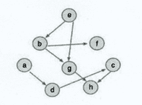

# 映客 2020 春招算法 C 卷

## 1

一根木棒，截成三段，可以组成三角形的概率是()

正确答案: B   你的答案: 空 (错误)

```cpp
1/2
```

```cpp
1/4
```

```cpp
1/8
```

```cpp
1/16
```

本题知识点

算法工程师 映客 2020

讨论

[菜比转业男](https://www.nowcoder.com/profile/746907180)

面积法，在满足截取三段的基础上，三段满足构成三角形的概率。

发表于 2021-08-30 15:35:49

* * *

[RonZhouTW](https://www.nowcoder.com/profile/421270094)

1/4

发表于 2021-03-07 10:25:47

* * *

## 2

应用 PCA 后，以下哪项可以是前两个主成分？(D)(1).(0.5,0.5,0.5,0.5)和(0.71,0.71,0,0)(2).(0.5,0.5,0.5,0.5)和(0,0，-0.71,0.71)(3).(0.5,0.5,0.5,0.5)和(0.5,0.5,-0.5,-0.5)(4).(0.5,0.5,0.5,0.5)和(-0.5,-0.5,0.5,0.5)

正确答案: D   你的答案: 空 (错误)

```cpp
1 和 2
```

```cpp
1 和 3
```

```cpp
2 和 4
```

```cpp
3 和 4
```

本题知识点

算法工程师 映客 2020

## 3

下面哪一项对梯度下降（GD）和随机梯度下降（SGD）的描述是正确的？(1) 在 GD 和 SGD 中，每一次迭代中都是更新一组参数以最小化损失函数。(2) 在 SGD 中，每一次迭代都需要遍历训练集中的所有样本以更新一次参数。(3) 在 GD 中，每一次迭代需要使用整个训练集或子训练集的数据更新一个参数。

正确答案: A   你的答案: 空 (错误)

```cpp
只有 1
```

```cpp
只有 2
```

```cpp
只有 3
```

```cpp
都正确
```

本题知识点

算法工程师 映客 2020

## 4

以下是目标变量在训练集上的 8 个实际值[0,0,0,1,1,1,1,1]，目标变量的熵是所少？

正确答案: A   你的答案: 空 (错误)

```cpp
-(5/8 log(5/8) + 3/8 log(3/8))
```

```cpp
5/8 log(5/8) + 3/8 log(3/8)
```

```cpp
3/8 log(5/8) + 5/8 log(3/8)
```

```cpp
5/8 log(3/8) – 3/8 log(5/8)
```

本题知识点

算法工程师 映客 2020

讨论

[牛客 146124708 号](https://www.nowcoder.com/profile/146124708)


发表于 2022-03-05 17:42:21

* * *

## 5

设关系数据库中一个表 S 的结构为:S(SN,CN,grade),其中 SN 为学生名,CN 为课程名,二者均为字符型;grade 为成绩,数值型,取值范围 0-100.若要更正王二的化学成绩为 85 分,则可用() .

正确答案: A   你的答案: 空 (错误)

```cpp
UPDATE S SET grade=85 WHERE SN=’王二’ AND CN='化学’
```

```cpp
UPDATE S SET grade=‘85’ WHERE SN=‘王二’ AND CN='化学’
```

```cpp
UPDATE grade=85 WHERE SN=’王二’ AND CN='化学’
```

```cpp
UPDATE grade=‘85’ WHERE SN=‘王二’ AND CN=‘化学’
```

本题知识点

算法工程师 映客 2020

## 6

按照二叉树的定义,具有 3 个结点的二叉树有() 种。

正确答案: C   你的答案: 空 (错误)

```cpp
3
```

```cpp
4
```

```cpp
5
```

```cpp
6
```

本题知识点

算法工程师 映客 2020

## 7

下面哪个序列不是此图的一个拓扑排序？

正确答案: C   你的答案: 空 (错误)

```cpp
ebfgadch
```

```cpp
aebdgfch
```

```cpp
adchebfg
```

```cpp
aedbfgch
```

本题知识点

算法工程师 映客 2020

讨论

[牛客 416475866 号](https://www.nowcoder.com/profile/416475866)

C，g 不应该在 h 的后面

发表于 2020-12-26 15:38:44

* * *

[真的不想起名](https://www.nowcoder.com/profile/151366527)

c

发表于 2020-12-24 08:55:22

* * *

## 8

解决散列法中出现冲突问题常采用的方法是()

正确答案: D   你的答案: 空 (错误)

```cpp
数字分析法、除余法、平方取中法
```

```cpp
数字分析法、除余法、线性探测法
```

```cpp
数字分析法、线性探测法、多重散列法
```

```cpp
线性探测法、多重散列法、链地址法
```

本题知识点

算法工程师 映客 2020

## 9

如果你想列出当前目录以及子目录下所有扩展名为“.txt”的文件，那么你可以使用的命令是()

正确答案: A   你的答案: 空 (错误)

```cpp
find . -name "*.txt"
```

```cpp
ls *.txt
```

```cpp
find . ".txt"
```

```cpp
ls -d txt
```

本题知识点

算法工程师 映客 2020

## 15

（多选题）下列说法正确的是？（）

正确答案: A B   你的答案: 空 (错误)

```cpp
AdaGrad 使用的是一阶导数
```

```cpp
L-BFGS 使用的是二阶导数
```

```cpp
AdaGrad 使用的是二阶导数
```

```cpp
L-BFGS 使用的是一阶导数
```

本题知识点

算法工程师 映客 2020

## 16

(多选题)下列哪种方法可以用来减小过拟合？

正确答案: A B C D   你的答案: 空 (错误)

```cpp
更多的训练数据
```

```cpp
L1 正则化
```

```cpp
L2 正则化
```

```cpp
减小模型的复杂度
```

本题知识点

算法工程师 映客 2020

## 17

（多选题）下列方法中，可以用于特征降维的方法包括？

正确答案: A B C D   你的答案: 空 (错误)

```cpp
主成分分析 PCA
```

```cpp
线性判别分析 LDA
```

```cpp
AutoEncoder
```

```cpp
矩阵奇异值分解 SVD
```

```cpp
最小二乘法 LeastSquares
```

本题知识点

算法工程师 映客 2020

## 18

（多选题）以下说法正确的是（）

正确答案: A D   你的答案: 空 (错误)

```cpp
二叉树的特点是每个结点至多只有两棵子树。
```

```cpp
二叉树的子树无左右之分。
```

```cpp
二叉树只能进行链式存储。
```

```cpp
树的结点包含一个数据元素及若干指向其子树的分支。
```

本题知识点

算法工程师 映客 2020

## 19

(多选题)以下几种模型方法属于判别式模型(Discriminative Model)的有（）

正确答案: B C   你的答案: 空 (错误)

```cpp
混合高斯模型
```

```cpp
条件随机场模型
```

```cpp
支持向量机
```

```cpp
隐马尔科夫模型
```

本题知识点

算法工程师 映客 2020

## 10

SVM 对噪声（如来自其他分布的噪声样本）鲁棒。

正确答案: B   你的答案: 空 (错误)

```cpp
正确
```

```cpp
错误
```

本题知识点

算法工程师 映客 2020

## 11

在 AdaBoost 算法中，所有被分错的样本的权重更新比例相同。

正确答案: A   你的答案: 空 (错误)

```cpp
正确
```

```cpp
错误
```

本题知识点

算法工程师 映客 2020

## 12

Boost 和 Bagging 都是组合多个分类器投票的方法，二者均是根据单个分类器的正确率决定其权重。

正确答案: B   你的答案: 空 (错误)

```cpp
正确
```

```cpp
错误
```

本题知识点

算法工程师 映客 2020

讨论

[食堂在逃干饭王](https://www.nowcoder.com/profile/5786634)

Bagging 只是简***均，Boosting 才会根据每个分类器的错误率计算其权重

发表于 2021-01-15 11:00:30

* * *

## 13

给定 n 个数据点，如果其中一半用于训练，一半用于测试，则训练误差与测试误差之间的差别会随着 n 的增加而减少。

正确答案: A   你的答案: 空 (错误)

```cpp
正确
```

```cpp
错误
```

本题知识点

算法工程师 映客 2020

## 14

在决策树中，随着树中结点数变多，即使模型的训练误差还在继续减低，但是检验误差开始增大，这是出现了模型欠拟合的问题。

正确答案: B   你的答案: 空 (错误)

```cpp
正确
```

```cpp
错误
```

本题知识点

算法工程师 映客 2020

## 20

试推导数据集严格线性可分的二分类问题的 SVM 的原始形式（除了显然的事实外，请详细说明每一步推导的依据）。

你的答案

本题知识点

算法工程师 映客 2020

## 21

简述生成模型和判别模型的特点，并分别从生成模型和判别模型的角度叙述用于二分类问题的 Logistic Regression（提示：只需分别从这两个角度推导出 LR 的损失函数）.

你的答案

本题知识点

算法工程师 映客 2020

## 22

请叙述并推导 Back-Propagation 算法（提示：只需说明 BP 算法是如何计算损失函数对全部参数的偏导数的）。

你的答案

本题知识点

算法工程师 映客 2020

## 23

为什么 xgboost 要用泰勒展开，优势在哪里？

你的答案

本题知识点

算法工程师 映客 2020

## 24

给定一个长度为 n 的数组 A，它的每一个元素是一个正整数，表示一条绳子的长度，现在想要把这些绳子剪成不少于 m 段的短绳，并且要求这 m 段短绳的长度都是 x，求 x 的最大值。注意绳子只能被剪，不能被粘贴, x 的值精确到小数点后两位。

本题知识点

算法工程师 映客 2020

讨论

[零葬](https://www.nowcoder.com/profile/75718849)

这个题我实在没懂为什么要输出浮点类型，其实只是寻找一个 x，使得长度大于等于 x 的绳子不少于 m 条，而要剪的就是这些绳子

```cpp
import java.io.BufferedReader;
import java.io.InputStreamReader;
import java.io.IOException;
import java.util.Arrays;

public class Main {
    public static void main(String[] args) throws IOException {
        BufferedReader br = new BufferedReader(new InputStreamReader(System.in));
        String[] strMN = br.readLine().trim().split(" ");
        int m = Integer.parseInt(strMN[0]), n = Integer.parseInt(strMN[1]);
        String[] strArr = br.readLine().trim().split(" ");
        int[] strings = new int[n];
        for(int i = 0; i < n; i++) strings[i] = Integer.parseInt(strArr[i]);
        // 先对绳子进行排序
        Arrays.sort(strings);
        int pos;
        // 然后遍历，直到长度大于等于 strings[pos]的绳子不足 m 条
        for(pos = 0; pos < n; pos++)
            if(n - pos < m) break;
        System.out.printf("%.2f", (double)strings[pos - 1]);
    }
}
```

发表于 2021-02-07 16:13:57

* * *

[Sake201910131608327](https://www.nowcoder.com/profile/532871367)

来个 Python 版本 import sysif__name__=='__main__':        arr1=sys.stdin.readline().strip()        arr1=arr1.split()        m=int(arr1[0])        n=int(arr1[1])        arr2=sys.stdin.readline().strip()        arr2=arr2.split()        arr2=list(map(float,arr2))        arr2.sort()        print(arr2[-m])

编辑于 2021-10-27 13:38:28

* * *

[牛客 482912637 号](https://www.nowcoder.com/profile/482912637)

没想到这道题是这样写的吗...还在想着如果 m>n 的话，一根绳子可能要切好几段呢...

发表于 2021-10-25 12:24:27

* * *

## 25

给定一个整数序列 ，计算该序列中最大的连续子序列的乘积（该序列至少包含一个数）。

本题知识点

算法工程师 映客 2020

讨论

[零葬](https://www.nowcoder.com/profile/75718849)

使用动态规划，但注意负负得正的情况，防止负负得正之后逆袭正数的连乘，因此需要同时保存连乘过程中能使得结果变大和变小的中间结果。

```cpp
import java.util.*;

public class Solution {
    /**
     * 
     * @param nums int 整型一维数组 
     * @return int 整型
     */
    public int maxProduct (int[] nums) {
        // write code here
        int tmin = nums[0];
        int tmax = nums[0];
        int result = nums[0];
        for(int i = 1; i < nums.length; i++){
            tmax = Math.max(nums[i], nums[i]*tmax);    // 看是乘了大还是不乘大，不乘大就从 nums[i]重新开始
            tmin = Math.min(nums[i], nums[i]*tmin);    // 看是乘了小还是不乘小，不乘小就从 nums[i]重新开始
            result = Math.max(result, Math.max(tmax, tmin));
        }
        return result;
    }
}
```

发表于 2021-02-07 16:15:51

* * *

[Sake201910131608327](https://www.nowcoder.com/profile/532871367)

#动态规划，dp 记录   i 到 j 子序列相乘最大结果 class Solution:    def maxProduct(self, nums ):        # write code here        dp=[[0 for i in range(len(nums))]for j in range(len(nums))]        for i in range(len(nums)):            dp[i][i]=nums[i]        temp=1        for i in range(len(nums)):            temp=nums[i]            for j in range(i+1,len(nums)):                temp*=nums[j]                dp[i][j]=max(dp[i][j-1],temp)        for i  in range(len(nums)):            temp=max(temp,dp[i][len(nums)-1])        return temp

发表于 2021-10-27 13:42:27

* * *

## 26

实现一个函数检查一棵树是否平衡。对于这个问题而言，平衡指的是这棵树任意两个叶子结点到根结点的距离之差不大于 1

本题知识点

算法工程师 映客 2020

讨论

[零葬](https://www.nowcoder.com/profile/75718849)

检查左右子树的高度差是否小于等于 1 即可

```cpp
import java.util.*;

/*
 * public class TreeNode {
 *   int val = 0;
 *   TreeNode left = null;
 *   TreeNode right = null;
 * }
 */

public class Solution {
    /**
     * 
     * @param root TreeNode 类 树的根节点
     * @return bool 布尔型
     */
    public boolean isBalanced (TreeNode root) {
        // write code here
        if(root == null)
            return true;       // 空树也是平衡数
        else  // 否则计算左右子树的高度差是否<=1
            return Math.abs(treeDepth(root.left) - treeDepth(root.right)) <= 1;
    }

    private int treeDepth(TreeNode root) {
        if(root == null) return 0;
        int left = treeDepth(root.left);
        int right = treeDepth(root.right);
        return Math.max(left, right) + 1;
    }
}
```

发表于 2021-02-07 16:16:38

* * *

[Sake201910131608327](https://www.nowcoder.com/profile/532871367)

# class TreeNode:#     def __init__(self, x):#         self.val = x#         self.left = None#         self.right = None### @param root TreeNode 类 树的根节点# @return bool 布尔型#class Solution:    def isBalanced(self, root ):        # write code here        head=root        nums=0        dict1={}        stack=[]        stack.append(head)        while stack:            nextstack=[]            nums+=1            for i in stack:                if i.left:                    nextstack.append(i.left)                if i.right:                    nextstack.append(i.right)                #将叶子节点加入字典，并记录层数，叶子节点在同一层字典长度为 1
                if not i.left and not i.right and nums not in dict1:                    dict1[nums]=i            stack=nextstack        if len(dict1)!=1:            returnTrue        else:            returnFalse

发表于 2021-10-27 13:44:51

* * *