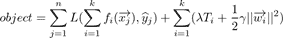

# 映客 2020 春招算法 E 卷

## 1

图的广度优先遍历算法类似于二叉树的()

正确答案: D   你的答案: 空 (错误)

```cpp
先序遍历
```

```cpp
中序遍历
```

```cpp
后序遍历
```

```cpp
层序遍历
```

本题知识点

算法工程师 映客 2020

## 2

下列关于核函数的表述正确的是（）

正确答案: C   你的答案: 空 (错误)

```cpp
核函数即特征的映射关系。
```

```cpp
多项式核函数只是将原始特征映射，并没有升维
```

```cpp
高斯核函数将特征映射到无穷维
```

```cpp
使用线性核函数的 SVM 是非线性分类器
```

本题知识点

算法工程师 映客 2020

## 3

假定所有变量均已正确定义，则下列程序段运行后 x 的值是（）a=b=c=0;  x=35;if(!a) x--;else if(b);if(c) x=3;else x=4;

正确答案: B   你的答案: 空 (错误)

```cpp
3
```

```cpp
4
```

```cpp
35
```

```cpp
34
```

本题知识点

算法工程师 映客 2020

## 4

以下是目标变量在训练集上的 8 个实际值[0,0,0,1,1,1,1,1]，目标变量的熵是多少？( )

正确答案: A   你的答案: 空 (错误)

```cpp
-(5/8 log(5/8) + 3/8 log(3/8))
```

```cpp
5/8 log(5/8) + 3/8 log(3/8)
```

```cpp
3/8 log(5/8) + 5/8 log(3/8)
```

```cpp
5/8 log(3/8) – 3/8 log(5/8)
```

本题知识点

算法工程师 映客 2020

## 5

设关系数据库中一个表 S 的结构为:S(SN,CN,grade),其中 SN 为学生名,CN 为课程名,二者均为字符型;grade 为成绩,数值型,取值范围 0-100.若要更正王二的化学成绩为 85 分,则可用( ) .

正确答案: A   你的答案: 空 (错误)

```cpp
UPDATE S SET grade=85 WHERE SN=’王二’ AND CN='化学’
```

```cpp
UPDATE S SET grade=‘85’ WHERE SN=‘王二’ AND CN='化学’
```

```cpp
UPDATE grade=85 WHERE SN=’王二’ AND CN='化学’
```

```cpp
UPDATE grade=‘85’ WHERE SN=‘王二’ AND CN=‘化学’
```

本题知识点

算法工程师 映客 2020

## 6

下列关于线性表，平衡二叉树，哈希表存储数据的优劣描述错误的是？（）

正确答案: D   你的答案: 空 (错误)

```cpp
哈希表是一个在时间和空间上做出权衡的经典例子。如果没有内存限制，那么可以直接将键作为数组的索引。那么所有的查找时间复杂度为 O(1)；
```

```cpp
线性表实现相对比较简单
```

```cpp
平衡二叉树的各项操作的时间复杂度为 O（logn）
```

```cpp
平衡二叉树的插入节点比较快
```

本题知识点

算法工程师 映客 2020

## 7

下列算法段中，时间复杂度为（）for(i=1;i<=n;i++){for(j=1;j<=i;j++){x=0;for(k=1;k<=n;k++)x+=a*b;}}

正确答案: D   你的答案: 空 (错误)

```cpp
O(n²)
```

```cpp
O(n²*(n+1))
```

```cpp
O(n*(n+1))
```

```cpp
O(n³)
```

本题知识点

算法工程师 映客 2020

## 8

在有监督学习中， 我们如何使用聚类方法？（）(1).我们可以先创建聚类类别, 然后在每个类别上用监督学习分别进行学习(2).我们可以使用聚类“类别 id”作为一个新的特征项，然后再用监督学习分别进行学习(3).在进行监督学习之前，我们不能新建聚类类别(4).我们不可以使用聚类“类别 id”作为一个新的特征项， 然后再用监督学习分别进行学习

正确答案: B   你的答案: 空 (错误)

```cpp
2 和 4
```

```cpp
1 和 2
```

```cpp
3 和 4
```

```cpp
1 和 3
```

本题知识点

算法工程师 映客 2020

## 9

以下哪个命令可以设置 linux 定时执行任务？

正确答案: B   你的答案: 空 (错误)

```cpp
atq
```

```cpp
cron
```

```cpp
batch
```

```cpp
at
```

本题知识点

算法工程师 映客 2020

## 10

使用 kill 命令来中止进程时候，最强信号值是多少？

正确答案: B   你的答案: 空 (错误)

```cpp
15
```

```cpp
9
```

```cpp
1
```

```cpp
0
```

本题知识点

算法工程师 映客 2020

## 11

假设你在卷积神经网络的第一层中有 5 个卷积核，每个卷积核尺寸为 7×7，具有零填充且步幅为 1。该层的输入图片的维度是 224×224×3。那么该层输出的维度是多少？（）

正确答案: C   你的答案: 空 (错误)

```cpp
217 x 217 x 3
```

```cpp
217 x 217 x 8
```

```cpp
218 x 218 x 5
```

```cpp
220 x 220 x 7
```

本题知识点

算法工程师 映客 2020

## 12

卷积神经网络一般应用于图像，一般不使用在文本分类任务上

正确答案: B   你的答案: 空 (错误)

```cpp
正确
```

```cpp
错误
```

本题知识点

算法工程师 映客 2020

## 13

使用高斯核训练的 SVM 中，若训练集不存两个点在同一位置，存在一组参数使得 SVM 训练误差为 0

正确答案: A   你的答案: 空 (错误)

```cpp
正确
```

```cpp
错误
```

本题知识点

算法工程师 映客 2020

## 14

XGB 中决策树分裂采用的是 leaf-wise 的分裂方式

正确答案: B   你的答案: 空 (错误)

```cpp
正确
```

```cpp
错误
```

本题知识点

算法工程师 映客 2020

## 15

为了防止过拟合，随机森林应该对每一颗子树进行剪枝

正确答案: A   你的答案: 空 (错误)

```cpp
正确
```

```cpp
错误
```

本题知识点

算法工程师 映客 2020

## 16

深度学习中求取损失函数最优解时，目前无法完全避免局部最优解的情况出现

正确答案: A   你的答案: 空 (错误)

```cpp
正确
```

```cpp
错误
```

本题知识点

算法工程师 映客 2020

讨论

[牛客 853318845 号](https://www.nowcoder.com/profile/853318845)

A 吧。一是局部最优解有时已经足够好了。第二就是网络越复杂，损失函数表示就越复杂，理想中的损失函数的极值点很多，而且还会出更多的鞍点之类的梯度为 0 的点。本身优化大部分用的都是小批梯度下降，损失函数就只是我们要优化函数的一部分，反向传播过程更新梯度也是一步一步走的，那么多的梯度为 0 的点很容易就进去出不来了。而且深度网络的损失函数复杂，又不是传统优化算法直接去找梯度为 0 的点直接求出结果，所以大部分情况都是局部最优，能不卡鞍点上就不错了。

发表于 2021-08-02 07:40:55

* * *

## 17

(多选)机器学习中做特征选择时，可能用到的方法有（）

正确答案: A B C D   你的答案: 空 (错误)

```cpp
卡方
```

```cpp
信息增益
```

```cpp
平均互信息
```

```cpp
期望交叉熵
```

本题知识点

算法工程师 映客 2020

## 18

（多选题） 逻辑回归有哪些处理非线性关系特征的方法？

正确答案: A B C D   你的答案: 空 (错误)

```cpp
特征离散化
```

```cpp
特征交叉
```

```cpp
引入高阶项
```

```cpp
引入核函数
```

本题知识点

算法工程师 映客 2020

## 19

（多选题）线性回归中多重共线性可以用哪些方法处理：

正确答案: A B C D   你的答案: 空 (错误)

```cpp
PCA
```

```cpp
逐步回归
```

```cpp
正则
```

```cpp
偏最小二乘
```

本题知识点

算法工程师 映客 2020

## 20

（多选题）以下哪几种聚类算法在训练的时候不需要设定聚类个数：

正确答案: B C D   你的答案: 空 (错误)

```cpp
K-means
```

```cpp
AP 聚类
```

```cpp
DBSCAN
```

```cpp
层次聚类
```

本题知识点

算法工程师 映客 2020

## 21

简述下你在机器学习项目中的开发流程

你的答案

本题知识点

算法工程师 映客 2020

## 22

给出生成式模型和判别式模型的区别。列举常见机器学习模型中，哪些是生成式模型，哪些是判别式模型？

你的答案

本题知识点

算法工程师 映客 2020

## 23

请叙述并推导 Back-Propagation 算法（提示：只需说明 BP 算法是如何计算损失函数对全部参数的偏导数的）。

你的答案

本题知识点

算法工程师 映客 2020

## 24

假设 XGB 损失函数为 ,其中 L 表示损失函数，n 为观测个数，k 为迭代器个数，fi(x)为第 i 颗决策树，xj 为第 j 个观测特征，yj 为第 j 个观测对应的真实标签，T 为第 i 颗决策树节点数，wi 表示第 i 颗决策树所有叶子结点值。请由上式推导 XGB 决策树节点分裂时参考的损失值公式。

你的答案

本题知识点

算法工程师 映客 2020

## 25

求取一个数组最大 K 个数，返回 K 个数结果为有序数组。假设数组有 N 个元素，要求算法时间复杂度不超过 O(N*log(K))，空间复杂度为 O（1）。如：input：[3, 2, 1, 4, 5]2output：[4, 5]

本题知识点

算法工程师 映客 2020

讨论

[牛客 263943037 号](https://www.nowcoder.com/profile/263943037)

```cpp
nums = input()
k = input()

nums = [int(x) for x in nums.replace("[", "").replace("]", "").split(",")]
k = int(k)

def partition(nums, l, r):
    pivot = nums[r]
    i, j = l, l
    while j < r:
        if nums[j] < pivot:
            nums[i], nums[j] = nums[j], nums[i]
            i += 1
        j += 1
    nums[i], nums[r] = nums[r], nums[i]

    return i

def quickSelection(nums, k, l, r):
    """
        The goal is to use the partition algo of qsort to 
        find the pivot that has k elements behind it 
        (including pivot itself) which means there are
        k larger elements in the left part, and that's the result.
        once we found that, we just return the nums[pivot_idx:].

        Using while loop rather than recursion to make
        the space complexity drop to O(1)
    """
    # Actual index of the k-th largetest number when nums is sorted in increasing order
    # aka. the index where there are k elements at&nbs***bsp;behind it.
    # When nums is partitioned by k, the result is just nums[k:]
    k = len(nums) - k
    if k < 0:
        return nums
    while l <= r:
        pivot_idx = partition(nums, l, r)
        if pivot_idx == k:
            # the result is found
            return nums[pivot_idx:]
        elif pivot_idx < k:
            # the target pivot must be in the right half
            l = pivot_idx + 1
        else:  # pivot_idx > k
            # the target pivot must be in the left half
            r = pivot_idx - 1

print(quickSelection(nums, k, 0, len(nums) - 1))
```

发表于 2021-09-04 23:04:49

* * *

[牛客 260047603 号](https://www.nowcoder.com/profile/260047603)

本来想着直接 sort 之后从尾部取 n 个数。但这样时间复杂度至少是 O(N log(N))了。于是想到了下面的算法：

```cpp
import re
import bisect

ls = input()
ls = re.sub("[^\-0-9,]", "", ls)
ls_int = list(map(int, ls.split(',')))

n = int(input())
res = list()
for i in ls_int:
    # 二分法插入
    bisect.insort(res, i)

    # 如果 res 已经有 n 个数字在里面了
    if(len(res)>n):
        # 最小的那个被挤掉了
        del res[0]

print(res)
```

空间复杂度 O(1)。时间复杂度：首先遍历一遍整个 list，O(N)对于每一个元素，进行一次二分法插入（插入长度至多为 K 的 res 这个 list），所以每一次插入的复杂度是 O(log K)。整个算法就是上面两步的结合，所以时间复杂度 O(N log K)

发表于 2021-04-11 15:49:35

* * *

## 26

判断一个字符串在任意位置(包括最前面和最后面)插入一个字符后能不能构成一个回文串。输入为一个由字母和数字组成的字符串 s，如果在插入一个字符之后可以构成回文串，则输出 Yes, 否则输出 No。（回文串:一个正读和反读都一样的字符串，如 a, aba, abccba 都是回文串） 本题知识点

算法工程师 映客 2020

讨论

[零葬](https://www.nowcoder.com/profile/75718849)

双指针求解，左指针先指向字符串的开头，右指针指向字符串的末尾，检查两个指针所指的字符是否相等，如果相等，则左指针向右移，右指针向左移，否则只移动左指针或右指针（因为从题中所给的示例可以看出，只要能变为回文串，无论是在偏左的位置还是偏右的位置插入一个字符都可以使得字符串变成回文串，碰到不相等的情况就跳过左右两边的任意一边即可，相当于去掉了这个影响对称性的字符，继续检查字符串剩下的部分是否满足回文），并计数一下不相等的次数。如果不相等的次数不超过 1，就可以通过插入一个字符使得字符串回文，否则是不可能完成的。

```cpp
import java.io.BufferedReader;
import java.io.InputStreamReader;
import java.io.IOException;

public class Main {
    public static void main(String[] args) throws IOException {
        BufferedReader br = new BufferedReader(new InputStreamReader(System.in));
        String str = br.readLine().trim();
        int n = str.length();
        int left = 0, right = n - 1;
        int count = 0;
        while(left < right) {
            if(str.charAt(left) == str.charAt(right)){
                left ++;
                right --;
            }else{
                left++;
                count ++;
            }
        }
        if(count <= 1)
            System.out.println("Yes");
        else
            System.out.println("No");
    }
}
```

发表于 2021-02-07 18:14:35

* * *

[有一个地方.](https://www.nowcoder.com/profile/559851324)

双指针如果 s[p1] == s[p2] p1 += 1, p2 -= 1 否则需要在 p1 左侧插入一个 s[p2],或在 p2 右侧插入一个 s[p1]

```cpp
string = list(input())
n = len(string)
p1, p2 = 0, n - 1
def check(arr):
    l, r = 0, len(arr) - 1
    while l <= r:
        if arr[l] == arr[r]:
            l += 1
            r -= 1
        else:
            return False
    return True
while p1 <= p2:
    if string[p1] == string[p2]:
        p1 += 1
        p2 -= 1
    else:
        if check(string[p1 + 1: p2 + 1])&nbs***bsp;check(string[p1:p2]):
            print("Yes")
            exit()
        else:
            print("No")
            exit()
print("Yes")
```

编辑于 2021-07-15 21:52:59

* * *

[大郎，喝药了](https://www.nowcoder.com/profile/431878784)

```cpp
大概原理是这样，有点啰嗦，自己终结一下就 OK
#include<iostream>
using namespace std;
int main()
{
 char name[20]={‘0’};
 int a=0,b=0,len=0;
 cin>>name;
 for（int i=0;i<20;i++）
  {
    if(char[i]!='0')
     {
       len++;//记录真实长度
      }
   }
 for(int j=0;j<len;j++)
  {
    if(a<len/2)//对半比较
     {
       break;
     }
    if(name[j]!=name[len-j])
     {
       b++;//记录有多少个不同字母
     };
   }
if(b<2)//只能插 1 个
 {
    cout<<"Yes"<<endl;
 }
 else
 {    
   cout<<"NO"<<endl;
  }
system("pause");
return 0;
}
```

发表于 2021-01-11 14:50:50

* * *

## 27

给定两个整数数组 preorder 和 inorder，表示一个二叉树的前序遍历和中序遍历，重构出原二叉树。假设二叉树的节点值没有重复，二叉树节点的定义已经给出。 本题知识点

算法工程师 映客 2020

讨论

[零葬](https://www.nowcoder.com/profile/75718849)

《剑指 offer》原题，先寻找先序遍历和中序遍历中根节点的位置，将序列划分为左右子树的序列，然后利用递归的方式重构二叉树。

```cpp
import java.util.*;

/*
 * public class TreeNode {
 *   int val = 0;
 *   TreeNode left = null;
 *   TreeNode right = null;
 * }
 */

public class Solution {
    /**
     * 二叉树构造
     * @param preorder int 整型一维数组 前序遍历
     * @param inorder int 整型一维数组 中序遍历
     * @param length int 整型 节点数量
     * @return TreeNode 类
     */
    public TreeNode constructTree (int[] preorder, int[] inorder, int length) {
        // write code here
        if(preorder.length == 0){
            return null;
        }else if(preorder.length == 1){
            return new TreeNode(preorder[0]);
        }else{
            TreeNode tree = new TreeNode(preorder[0]);
            int idx = indexOfArray(inorder, preorder[0]);     // 找到根节点在中序遍历序列中的索引
            tree.left = constructTree(Arrays.copyOfRange(preorder, 1, idx + 1), Arrays.copyOfRange(inorder, 0, idx), idx);
            tree.right = constructTree(Arrays.copyOfRange(preorder, idx + 1, preorder.length), Arrays.copyOfRange(inorder, idx+1, inorder.length), length - idx);
            return tree;
        }
    }

    public int indexOfArray(int[] array, int target){
        for(int i = 0;i < array.length;i++)
            if(array[i] == target) return i;
        return -1;
    }
}
```

发表于 2021-02-07 18:18:06

* * *