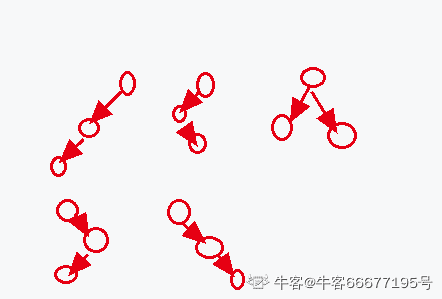

# 映客 2020 春招研发 B 卷

## 1

设栈 S 初始状态为空。元素 1,2,3,4,5,6 依次通过栈 S，若出栈的顺序为 4,6,5,3,2,1，则栈 S 的容量至少应该为（  ）

正确答案: C   你的答案: 空 (错误)

```cpp
3
```

```cpp
4
```

```cpp
5
```

```cpp
6
```

本题知识点

Java 工程师 C++工程师 映客 2020

## 2

进程间的通信方式，下列描述哪项是错误的（  ）

正确答案: C   你的答案: 空 (错误)

```cpp
共享存储
```

```cpp
消息传递
```

```cpp
系统中断
```

```cpp
管道文件
```

本题知识点

Java 工程师 C++工程师 映客 2020

## 3

执行下列代码后，输出是什么（  ）public class  A{public static void main(String args[]){int sum = 0;for(int i=0; i<20; i++){sum +=i;if(i%4 == 0){break;}}System.out.println(sum);}}

正确答案: A   你的答案: 空 (错误)

```cpp
0
```

```cpp
210
```

```cpp
10
```

```cpp
50
```

本题知识点

Java 工程师 C++工程师 映客 2020

讨论

[燕清](https://www.nowcoder.com/profile/537201584)

第一次循环 i=0 i%4=0 跳出循环 sum=0

发表于 2020-12-21 07:16:57

* * *

[我叫小辣鸡](https://www.nowcoder.com/profile/479536698)

第一次循环时，i=0，sum+=i，sum=0，i%4=0,执行 break，直接跳出循环。sum=0

发表于 2020-12-18 20:56:45

* * *

## 4

关于 www 服务，以下哪种说法是错误的（  ）

正确答案: D   你的答案: 空 (错误)

```cpp
www 服务采用的主要传输协议是 http
```

```cpp
www 服务以超文本方式组织网络多媒体信息
```

```cpp
用户访问 web 服务器可以使用统一的图形用户界面
```

```cpp
用户访问 web 服务器不需要知道服务器的 url 地址
```

本题知识点

Java 工程师 C++工程师 映客 2020

讨论

[燕清](https://www.nowcoder.com/profile/537201584)

d 想表达的是 web 浏览器在访问服务器的时候不需要知道服务器的 ip 地址(dns 域名解析协议会帮我们进行域名到 ip 的映射)

发表于 2020-12-21 07:21:29

* * *

## 5

在计算机内部，大写字母“G”的 ASCII 码为“1000111”，大写字母“K”的 ASCII 码为（  ）

正确答案: D   你的答案: 空 (错误)

```cpp
1001001
```

```cpp
1001100
```

```cpp
1001010
```

```cpp
1001011
```

本题知识点

Java 工程师 C++工程师 映客 2020

讨论

[牛客 419150046 号](https://www.nowcoder.com/profile/419150046)

K 与 G 相差 4
4[(d)]=0000100[(b)]
1000111+0000100=1001011

发表于 2021-01-07 13:01:32

* * *

[我叫小辣鸡](https://www.nowcoder.com/profile/479536698)

G-H-I-J-K1000111-1001000-1001001-1001010-1001011

发表于 2020-12-18 20:59:50

* * *

[bukun](https://www.nowcoder.com/profile/514169517)

G(71),K(75)

发表于 2021-03-07 15:21:52

* * *

## 6

具有 3 个节点的二叉树有几种形态（  ）

正确答案: C   你的答案: 空 (错误)

```cpp
3
```

```cpp
4
```

```cpp
5
```

```cpp
6
```

本题知识点

Java 工程师 C++工程师 映客 2020

讨论

[牛客 66677195 号](https://www.nowcoder.com/profile/66677195)

计算公式：C(n)=(1/(n+1))*((2*n)!/(n!*n!))

发表于 2020-12-23 09:56:04

* * *

[zxcv0112358](https://www.nowcoder.com/profile/473856205)

具有 n 个节点的二叉树有多少种形态？

发表于 2021-01-06 18:44:38

* * *

[牛客 705171413 号](https://www.nowcoder.com/profile/705171413)

具有三个节点的二叉树分别依次有有 1  3   5 个接点

发表于 2020-12-20 10:46:30

* * *

## 7

已知一棵二叉树的前序遍历为 CABEFDHG，中序遍历为 BAFECHDG，那么它的后续遍历是（  ）

正确答案: B   你的答案: 空 (错误)

```cpp
BFEACHDG
```

```cpp
BFEAHGDC
```

```cpp
BEFACHDG
```

```cpp
BEFAHGDC
```

本题知识点

Java 工程师 C++工程师 映客 2020

讨论

[jason201811051714941](https://www.nowcoder.com/profile/579475783)

     C
   A    D
B  E   H G
     F

编辑于 2021-01-06 15:03:38

* * *

## 8

观察者模式是非常常用的设计模式，以下关于其说法错误的是（  ）

正确答案: C   你的答案: 空 (错误)

```cpp
观察者和被观察者是多对一的关系
```

```cpp
多个观察者接收状态更新的通知的顺序是不确定的
```

```cpp
观察者可以持有并直接修改被观察者的状态
```

```cpp
观察者可以被动态增加和移除
```

本题知识点

Java 工程师 C++工程师 映客 2020

讨论

[牛客 688694058 号](https://www.nowcoder.com/profile/688694058)

观察者模式：定义对象一对多的依赖关系，使每当一个对象改变状态时，依赖于他的对象都会收到通知

发表于 2021-07-26 17:15:34

* * *

[唐三皮](https://www.nowcoder.com/profile/274763572)

观察者模式：定义对象之间的一对多的依赖关系，使得每当一个对象状态发生改变时，其相关依赖对象都得到通知并被自动更新。 在观察者模式中，发生改变的对象称为观察目标，而被通知的对象称为观察者，一个观察目标可以对应多个观察者，而且这些观察者之间可以没有任何相互联系，可以根据需要增加和删除观察者，使系统更易于拓展

发表于 2020-12-28 20:43:52

* * *

## 9

数据库事务正确执行的四个基本要素不包括（  ）

正确答案: C   你的答案: 空 (错误)

```cpp
隔离性
```

```cpp
持久性
```

```cpp
强制性
```

```cpp
一致性
```

本题知识点

Java 工程师 C++工程师 映客 2020

讨论

[jason201811051714941](https://www.nowcoder.com/profile/579475783)

持久性，隔离性，一致性，原子性

发表于 2021-01-06 15:04:22

* * *

## 10

运算（93&-8）的结果为()

你的答案

本题知识点

Java 工程师 C++工程师 映客 2020

## 11

说说阻塞/非阻塞,同步/异步的理解.

你的答案

本题知识点

Java 工程师 C++工程师 映客 2020

## 12

40 亿个不重复的 uint 整数，没有排序，给定一个整数，如何快速判断是否出现在 40 亿里面？

你的答案

本题知识点

Java 工程师 C++工程师 映客 2020

讨论

[牛客 241963246 号](https://www.nowcoder.com/profile/241963246)

uint 整数，最大值有 40 亿吗？

发表于 2020-12-20 14:08:08

* * *

## 13

有职工表 EMP（ENO，ENAME，SALARY，DNO），其中各属性的含义依次为职工号、姓名、工资和所在部门号，以及部门表 DEPT（DNO，DNAME，MANAGER），其中各属性含义依次为部门号、部门名称、部门经理的职工号，使用 SQL 语句完成以下查询： 列出各部门中工资不低于 600 元的职工的平均工资。

你的答案

本题知识点

Java 工程师 C++工程师 映客 2020

讨论

[牛客 41600353 号](https://www.nowcoder.com/profile/41600353)

```cpp
SELECT t1.dno, t2.dname, avg( t1.salary)
from emp t1
left join dept t2
on t1.dno=t2.dno
where t1.salary>=600
group by t1.dno, t2.dname
;
```

发表于 2020-12-19 12:43:12

* * *

## 14

请简单描述一下 TCP 三次握手和四次挥手的过程，请画图说明?

你的答案

本题知识点

Java 工程师 C++工程师 映客 2020

## 15

设计一个简单的聊天系统，支持常见的单聊和群聊功能，要求考虑消息实时性、离线处理以及系统处理能力，并说明该方案的优势和不足。

你的答案

本题知识点

Java 工程师 C++工程师 映客 2020

## 16

 有这样的一个数组 A，大小为 n，相邻元素差的绝对值都是 1，如：{4，5，6，7，8，9，10，9}，现在给定一个 A 和一个目标整数 t，请找到 t 在 A 中的位置。  

 本题知识点

Java 工程师 C++工程师 映客 2020

讨论

[人海追风](https://www.nowcoder.com/profile/896834337)

这尼马都能过 for(inti=0;i<ALen;i++)        {            if(A[i]==t)    {returni;}        }        return-1;

发表于 2020-12-26 13:40:50

* * *

## 17

给定一个整数数组和一个整数 *k*，判断数组中是否存在两个不同的索引* i* 和* j*，使得 nums [i] = nums [j]，并且 *i* 和 *j* 的差的绝对值最大为 *k*。

本题知识点

Java 工程师 C++工程师 映客 2020

讨论

[人海追风](https://www.nowcoder.com/profile/896834337)

嗯？class Solution {
public:
    /**
     * 判断重复数据间隔距离是否满足
     * @param a int 整型一维数组 给定数组
     * @param aLen int a 数组长度
     * @param k int 整型 整数 k
     * @return bool 布尔型
     */
    bool containsNearbyDuplicate(int* a, int aLen, int k) {
        // write code here
        int left =0, right =k-1;
        while(right<aLen)    
        {
            if(a[left++]==a[right++])    {return true;}
        }
        return false;
    }
};

发表于 2020-12-26 13:43:28

* * *

## 18

给出两个 非空 的链表用来表示两个非负的整数。其中，它们各自的位数是按照 逆序 的方式存储的，并且它们的每个节点只能存储 一位 数字。
如果，我们将这两个数相加起来，则会返回一个新的链表来表示它们的和。
您可以假设除了数字 0 之外，这两个数都不会以 0 开头。

本题知识点

Java 工程师 C++工程师 映客 2020

讨论

[人海追风](https://www.nowcoder.com/profile/896834337)

我个菜机，感觉写的好罗嗦/**
 * struct ListNode {
 *    int val;
 *    struct ListNode *next;
 * };
 */

class Solution {
public:
    /**
     * 
     * @param f1 ListNode 类 
     * @param f2 ListNode 类 
     * @return ListNode 类
     */
    ListNode* addTwoNumbers(ListNode* f1, ListNode* f2) {
        // write code here
        ListNode* head = new ListNode(0);
        ListNode* cur = head;
        bool fu = false;

        while(f1&&f2)
        {
            int sum = f1->val + f2->val;
            if(fu)    {sum++;fu= false;}
            if(sum>=10)    {sum = sum%10; fu=true;}
            cur->next = new ListNode(sum);
            cur = cur->next;
            f1 = f1->next;
            f2 = f2->next;
        }
        ListNode* temp= nullptr;
        if(!f2&&!f1&&fu)    {cur = new ListNode(1);return head->next;}
        temp = f1==nullptr? f2:f1;
        while(temp)    
        {
            int sum = temp->val;
            if(fu)    {sum++;fu=false;}
            if(sum>=10)    {sum=sum%10;fu=true;}
            cur->next = new ListNode(sum);
            cur = cur->next;
            temp = temp->next;
        }
        if(fu)    {cur->next = new ListNode(1);}
        return head->next;
    }
};

发表于 2020-12-26 13:44:59

* * *