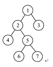

# 映客 2020 春招研发 D 卷

## 1

假设栈的输入序列是 7,6,2,1,4，则以下不可能是其出栈序列（  ）

正确答案: D   你的答案: 空 (错误)

```cpp
6，7，4，1，2
```

```cpp
其他都不是
```

```cpp
7，6，2，1，4
```

```cpp
6，7，4，2，1
```

本题知识点

Java 工程师 C++工程师 映客 2020

讨论

[T-DRAGON](https://www.nowcoder.com/profile/847693497)

A: 7 进 6 进 6 出然后 7 出，2，1，4 都进  出栈即为 6 7 4 1 2B: 看其他 C: 一眼就看出 必对， 刚进就出情况 D: 反向推 6 先出 说明  就是 A 的情况（可推导出）到 4 那里  栈只剩 2，1 所以必是 1 先出， 因为 2 先进后出~~

发表于 2021-03-14 19:16:58

* * *

## 2

对下面代码描述正确的是：int *p1 = new int[10];int *p2 = new int[10]();

正确答案: C   你的答案: 空 (错误)

```cpp
p1 和 p2 申请的空间里面的值都是随机值
```

```cpp
p1 和 p2 申请的空间里的值都已经初始化
```

```cpp
p1 申请的空间里的值是随机值，p2 申请的空间里的值已经初始化
```

```cpp
p1 申请的空间里的值已经初始化，p2 申请的空间里的值是随机值
```

本题知识点

Java 工程师 C++工程师 映客 2020

讨论

[牛客 867941589 号](https://www.nowcoder.com/profile/867941589)

p1 仅声明类型，p2 包括初始化值为 0。

发表于 2021-03-12 10:10:59

* * *

## 3

在 32 位机器中，如下代码的输出是?：void example(char acWelcome[]){printf("%d",sizeof(acWelcome));return;}void main(){char acWelcome[]="Welcome to Inke Test";example(acWelcome);return;}

正确答案: B   你的答案: 空 (错误)

```cpp
0
```

```cpp
4
```

```cpp
20
```

```cpp
21
```

本题知识点

Java 工程师 C++工程师 映客 2020

讨论

[Clannad 丶 Fan](https://www.nowcoder.com/profile/636713593)

退化成指针，32 位机器指针为 4 个字节

发表于 2021-01-31 11:15:47

* * *

[人海追风](https://www.nowcoder.com/profile/896834337)

Md ，连个解析都没有，感觉答案错了

发表于 2020-12-24 16:14:00

* * *

[陌宇潇潇](https://www.nowcoder.com/profile/796234398)

我数的是 20

发表于 2020-12-27 22:40:08

* * *

## 4

给定二叉树如图所示。设 N 代表二叉树的根，L 代表根结点的左子树，R 代表根结点的右子树。若遍历后的结点序列是 3 ，1 ，7 ，5 ，6 ，2 ，4 ，则其遍历方式是:

正确答案: D   你的答案: 空 (错误)

```cpp
LRN
```

```cpp
NRL
```

```cpp
RLN
```

```cpp
RNL
```

本题知识点

Java 工程师 C++工程师 映客 2020

讨论

[T-DRAGON](https://www.nowcoder.com/profile/847693497)

。。3 为右子树节点开始，右根左   中序遍历

发表于 2021-03-14 19:22:27

* * *

## 5

一个链表最常用的操作是在末尾插入结点和删除结点，则选用（）最节省时间。

正确答案: A   你的答案: 空 (错误)

```cpp
带头结点的双循环链表
```

```cpp
单循环链表
```

```cpp
带尾指针的单循环链表
```

```cpp
单链表
```

本题知识点

Java 工程师 C++工程师 映客 2020

讨论

[T-DRAGON](https://www.nowcoder.com/profile/847693497)

就是双向链表？🤣

发表于 2021-03-14 19:26:26

* * *

## 6

同一个进程中的线程不共享的部分是()

正确答案: D   你的答案: 空 (错误)

```cpp
信号
```

```cpp
堆
```

```cpp
文件描述符
```

```cpp
栈空间
```

本题知识点

Java 工程师 C++工程师 映客 2020

讨论

[wonderson](https://www.nowcoder.com/profile/319767782)

如果堆栈能共享，不同线程的数据就会一直被其他线程覆盖，就没办法执行多线程了

发表于 2021-03-29 22:17:47

* * *

## 7

判定一个有向图是否存在回路除了可以利用拓扑排序方法外，还可以用 __

正确答案: D   你的答案: 空 (错误)

```cpp
求关键路径的方法
```

```cpp
求最短路径的方法
```

```cpp
广度优先遍历算法
```

```cpp
深度优先遍历算法
```

本题知识点

Java 工程师 C++工程师 映客 2020

讨论

[心君 D 悦子](https://www.nowcoder.com/profile/278181898)

这题不是 D?

发表于 2021-03-08 01:14:45

* * *

[牛客 584635636 号](https://www.nowcoder.com/profile/584635636)

我觉得是 d

发表于 2021-01-05 12:17:09

* * *

## 8

软件项目存储于/ftproot，允许 apache 用户修改所有程序，设置访问权限的指令？

正确答案: C   你的答案: 空 (错误)

```cpp
chmod 777  /ftproot
```

```cpp
chgrp apache  /ftproot
```

```cpp
chown apahce /ftproot
```

```cpp
chmod apache /ftproot
```

本题知识点

Java 工程师 C++工程师 映客 2020

讨论

[wonderson](https://www.nowcoder.com/profile/319767782)

c 应该错了吧，没有-R 参数，没有写权限的

发表于 2021-03-29 22:19:36

* * *

[星疚](https://www.nowcoder.com/profile/407440050)

[`www.nowcoder.com/questionTerminal/fdaff979cbf9479883344889132a7c46`](https://www.nowcoder.com/questionTerminal/fdaff979cbf9479883344889132a7c46)有毒答案还不一样啊

发表于 2021-02-24 21:03:07

* * *

## 9

写个的 sql 查询语句，如有一张表示英语口语练习每个学员的学时的表 a，字段有 studentid(学号) name(可重复) grade(年级) hours（学时），找出那些学时高于他们同一年级的平均学时的学生。

你的答案

本题知识点

Java 工程师 C++工程师 映客 2020

## 10

举例 Linux 操作系统中的进程间通信方式和特性

你的答案

本题知识点

Java 工程师 C++工程师 映客 2020

讨论

[兵兵最帅](https://www.nowcoder.com/profile/998867889)

1.管道通信：两个进程利用管道通信时，发送信息的进程为写进程，接收信息的进程称为读进程。管道通信方式的中间介质就是文件，这种文件称为管道文件，它向管道一样将一个写进程和一个读进程连接起来，从而实现两个进程之间的通信。特点：半双工通讯，数据只能单向流动，而且只能在具有亲缘关系的进程中使用 2.消息缓冲通信：多个相互独立的进程可通过消息缓冲机制进行相互通信。以消息缓冲区为中间介质，通信双方的发送和接收均已消息为单位，在存储器中，消息缓冲区被组织为消息队列，因此被称为消息队列。特点：不局限于亲缘进程(父子进程)，允许任何进程通过共享消息队列来实像相互间的通信，但信息的复制需要占用大量 CPU 资源，不适合频繁，信息量大的场合 3.共享内存通信：允许多个进程在外部通信协议或同步，互斥机制支持下使用同一个内存段作为中间介质进行通信特点：无需复制，快捷，信息量大

发表于 2021-04-16 15:41:44

* * *

## 11

简要说明 http 和 https 的区别以及 https 连接建立过程？

你的答案

本题知识点

Java 工程师 C++工程师 映客 2020

## 12

请比较循环和递归两种算法的优缺点，是不是所有的递归都能改成循环，举例说明？

你的答案

本题知识点

Java 工程师 C++工程师 映客 2020

## 13

请描述在 web 浏览器访问输入 www.inke.cn 敲完回车到页面完全显示出来，中间发生了什么？

你的答案

本题知识点

Java 工程师 C++工程师 映客 2020

## 14

（加分题）请设计一种通讯录多端同步方案，具体如下 a.设计 Server 端和 Client 端的数据数据交互关系 b.设计一种机制，实现各端之间（多个手机、电脑，网页）对通信录的增、删、改操作能够相互同步并保持一致性 c.考虑设备离线操作的情况 d.考虑通信录在一端改变时，如何向其他端下发通知

你的答案

本题知识点

Java 工程师 C++工程师 映客 2020

讨论

[201901200007737](https://www.nowcoder.com/profile/292879003)

1、服务端与客户端之间采用 JSON 的数据格式，采用 Axios 进行异步通讯 2、服务端与客户端约定一个字段，当客户端某端修改了数据，并上传到了服务端，则服务端修改该字段状态 3、此时服务端将该字段修改状态，下发到同一账号的各端，说明要进行数据的更新 4、各端收到修改信号，回应服务端，服务端向有回应的各端，下发要修改的数据 5、设备离线时，数据缓存在本地的内存上，当有网时，将数据上传服务端

发表于 2021-02-26 23:08:25

* * *

## 15

编写一个 url 解析程序，要求在各种情况下解析出协议头，域名，路径，端口号，查询参数，位置标识，例如：https://www.uvideo.com:8888/watch?v=XG0CFDPGGqc&c=browser#section1  解析结果为：协议:https
域名:www.uvideo.com
端口号:8888
路径:/watch
查询参数:v=XG0CFDPGGqc, c=browser
位置标识:section1

本题知识点

Java 工程师 C++工程师 映客 2020

讨论

[牛客 231881531 号](https://www.nowcoder.com/profile/231881531)

```cpp
#include <stdio.h>
class Solution
{
public:
    /**
     * url 解析
     * @param neturl string 字符串
     * @return string 字符串 vector
     */
    vector<string> UrlParsing(string neturl)
    {
        char http[100];
        char www[255];
        int port;
        char lujing[1024];
        char chaxun[1024];
        char pos[1024];
        sscanf(neturl.c_str(), "%[^:]://%[^:]:%d%[^?]?%[^#]#%s", http, www, &port, lujing, chaxun, pos);
        return { http, www, std::to_string(port), lujing, chaxun, pos };
    }
};
```

 发表于 2021-03-24 00:19:00

* * *

[牛客 656207095 号](https://www.nowcoder.com/profile/656207095)

Java 版：

```cpp
import java.util.*;

public class Solution {
    /**
     * url 解析
     * @param neturl string 字符串
     * @return string 字符串一维数组
     */
    public String[] UrlParsing (String neturl) {
        String[] result = new String[6];
        String [] temp = neturl.split("://");
        result[0] = temp[0];
        result[1] = temp[1].substring(0,temp[1].indexOf(":"));
        result[2] = temp[1].substring(temp[1].indexOf(":")+1,temp[1].indexOf("/"));
        temp = neturl.split("\\?");
        result[3] = temp[0].substring(temp[0].lastIndexOf("/"));
        result[4] = temp[1].substring(0,temp[1].indexOf("#"));
        result[5] = temp[1].substring(temp[1].indexOf("#")+1);
        return result;
    }
}
```

发表于 2021-03-28 22:03:10

* * *

## 16

给定一个只包括 '('，')'，'{'，'}'，'['，']' 的字符串，判断字符串是否有效。

有效字符串需满足：

1.  左括号必须用相同类型的右括号闭合。
2.  左括号必须以正确的顺序闭合。

注意空字符串可被认为是有效字符串。

示例 1:

```cpp
输入: "()" 输出: true

```

示例 2:

```cpp
输入: "()[]{}" 输出: true

```

示例 3:

```cpp
输入: "(]" 输出: false

```

示例 4:

```cpp
输入: "([)]" 输出: false

```

示例 5:

```cpp
输入: "{[]}" 输出: true
```

本题知识点

Java 工程师 C++工程师 映客 2020

讨论

[牛客 656207095 号](https://www.nowcoder.com/profile/656207095)

Java 版：

```cpp
import java.util.*;

public class Solution {
    /**
     * 是否是有效括号
     * @param s string 字符串 
     * @return bool 布尔型
     */
    public boolean isValid (String s) {
       if(s == null || s.isEmpty()){
            return true;
        }
        Stack<Character> stack = new Stack<>();
        char []c = s.toCharArray();
        int l = c.length;
        for (int i = 0; i < l; i++) {
            if(c[i] == '(' || c[i] == '{' || c[i] == '[') {
                stack.push(c[i]);
            }else if((c[i] == ')' && stack.peek() == '(') || (c[i] == '}' && stack.peek() == '{') || (c[i] == ']' && stack.peek() == '[')){
                stack.pop();
            }
        }
        return stack.isEmpty();
    }
}
```

发表于 2021-03-28 22:03:40

* * *

## 17

实现一个基本的计算器来计算一个简单的字符串表达式的值。

字符串表达式仅包含非负整数，+， - ，*，/ 四种运算符和空格  。 整数除法仅保留整数部分。示例 :输入: "3+2*2" 输出: 7 输入:"3+5/2" 输出: 5

本题知识点

Java 工程师 C++工程师 映客 2020

讨论

[牛客 656207095 号](https://www.nowcoder.com/profile/656207095)

没怎么优化的 Java 版本，先压入所有的操作数和运算符，遇到运算符为加减时需要进行特判，因为存在优先级问题。

```cpp
import java.util.*;

public class Solution {
    Stack<Long> num = new Stack<>();
    Stack<Character> ch = new Stack<>();

    public long calculate(String s) {
        char[] c = s.toCharArray();
        int cLen = c.length;
        for (int i = 0; i < cLen; i++) {
            if (Character.isDigit(c[i])) {
                int j = i + 1;
                while (j < cLen && Character.isDigit(c[j])) {
                    ++j;
                }
                num.push(parse(s,i, j));
                i = j - 1;
            } else if (isChar(c, i)) {
                ch.push(c[i]);
            }
        }
        return cal();
    }

    private long parse(String s,int start, int end) {
        return Long.parseLong(s.substring(start,end));
    }

    private boolean isChar(char[] c, int i) {
        return c[i] == '-' || c[i] == '+' || c[i] == '*' || c[i] == '/';
    }

    private long cal() {
        while (!ch.isEmpty()) {
            char c = ch.pop();
            long a = num.pop();
            long b = num.pop();
            if (c == '*') {
                num.push(b * a);
            } else if (c == '/') {
                num.push(b / a);
            } else if (c == '+') {
                if(!ch.isEmpty() && (ch.peek() == '*' || ch.peek() == '/')){
                    long c3 = num.pop();
                    char cc = ch.pop();
                    if(cc == '*'){
                        num.push(c3 * b);
                    }else{
                        num.push(c3 / b);
                    }
                    num.push(a);
                    ch.push(c);
                }else{
                    num.push(b + a);
                }
            } else if (c == '-') {
                if(!ch.isEmpty() && (ch.peek() == '*' || ch.peek() == '/')){
                    long c3 = num.pop();
                    char cc = ch.pop();
                    if(cc == '*'){
                        num.push(c3 * b);
                    }else{
                        num.push(c3 / b);
                    }
                    num.push(a);
                    ch.push(c);
                }else{
                    num.push(b - a);
                }
            }
        }
        return num.pop();
    }
}
```

发表于 2021-03-28 22:04:52

* * *

[牛客 867941589 号](https://www.nowcoder.com/profile/867941589)

直接用这样的方法，在笔试中不是作弊么？

发表于 2021-03-12 10:09:39

* * *