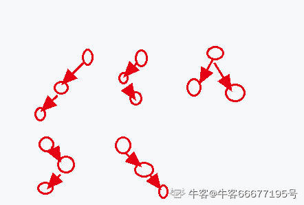

# 映客 2020 春招研发 E 卷

## 1

某团队 2/5 的人会 Java，3/4 的人会 C++，团队里同时会 Java 和 C++的最少有（ ）人。

正确答案: A   你的答案: 空 (错误)

```cpp
3
```

```cpp
4
```

```cpp
5
```

```cpp
8
```

本题知识点

Java 工程师 C++工程师 映客 2020

讨论

[牛客 369558038 号](https://www.nowcoder.com/profile/369558038)

5 和 4 最小公倍数为 20,所以这个团队至少 20 人,按最少计算,2/5 会 Java,则有 8 人会 Java,3/4 会 C++,则有 15 人会 C++假设每个人只会一种语言,则总人数为 8+15=23 人;实际只有 20 人,所以至少 3 人重复,即 3 人即会 Java,也会 C++

发表于 2020-12-21 13:19:17

* * *

[牛客 419150046 号](https://www.nowcoder.com/profile/419150046)

5 和 4 最小公倍数为 20,所以这个团队至少 20 人,按最少计算,2/5 会 Java,则有 12 人不会 java,3/4 会 C++,则有 5 人不会 C++一共 20 人，按最少不会 Java 的与不会 C++的不重复，20-12-5=3，那么 3 人必须会

发表于 2021-01-07 01:17:07

* * *

[牛客 596517309 号](https://www.nowcoder.com/profile/596517309)

题目是说的是最少，所以我们都算出有 20 个人其中会 C++又 15 人，会 java 有 8 人 15+8 = 23 所以剩下 5 个人只会 java 最少有 3 个人都会

发表于 2020-12-19 18:25:32

* * *

## 2

下列哪种方式不能使进程进入等待状态（ ）。

正确答案: D   你的答案: 空 (错误)

```cpp
CPU 调度给优先级更高的线程
```

```cpp
阻塞的线程获得资源或者信号
```

```cpp
在时间片轮转的情况下，如果时间片到了
```

```cpp
获得 spinlock 未果
```

本题知识点

Java 工程师 C++工程师 映客 2020

讨论

[牛客 346998005 号](https://www.nowcoder.com/profile/346998005)

进程分为基本的三个状态：运行、就绪、阻塞/等待。

A. 高优先级的抢占 CPU，使得原来处于运行状态的进程转变为就绪状态。

B. 阻塞的进程等待某件事情的发生，一旦发生则它的运行条件已经满足，从阻塞进入就绪状态。

C. 时间片轮转使得每个进程都有一小片时间来获得 CPU 运行，当时间片到时从运行状态变为就绪状态。

D.

自旋锁（spinlock）是一种保护临界区最常见的技术。在同一时刻只能有一个进程获得自旋锁，其他企图获得自旋锁的任何进程将一直进行尝试（即自旋，不断地测试变量），除此以外不能做任何事情。因此没有获得自旋锁的进程在获取锁之前处于忙等（阻塞状态）。

发表于 2020-12-22 11:18:37

* * *

## 3

软件项目存储于/ftproot，下列命令能保证 apache 用户可以修改所有程序的是（ ）

正确答案: C   你的答案: 空 (错误)

```cpp
chmod apache -R /ftproot
```

```cpp
chgrp apache /frproot
```

```cpp
chown apache -R /ftproot
```

```cpp
chmod apache /ftproot
```

本题知识点

Java 工程师 C++工程师 映客 2020

讨论

[牛客 66677195 号](https://www.nowcoder.com/profile/66677195)

linux 目录默认权限是 rwxr-xr-x，意思是拥有者具备读写执行权限，组用户具有读执行权限，其他用户具有读执行权限。第一个选项，命令错误第二个选项，修改了文件夹的用户组，使其获得了组权限，但是组权限不具备写权限第三个选项，使其成为拥有者，具备所有权限第四个选项，命令错误

发表于 2020-12-23 10:15:17

* * *

## 4

执行下列代码后，输出是什么（  ）public class  A{public static void main(String args[]){int sum = 0;for(int i=0; i<20; i++){sum +=i;if(i%4 == 0){break;}}System.out.println(sum);}}

正确答案: A   你的答案: 空 (错误)

```cpp
0
```

```cpp
210
```

```cpp
10
```

```cpp
50
```

本题知识点

Java 工程师 C++工程师 映客 2020

讨论

[燕清](https://www.nowcoder.com/profile/537201584)

第一次循环 i=0 i%4=0 跳出循环 sum=0

发表于 2020-12-21 07:16:57

* * *

[我叫小辣鸡](https://www.nowcoder.com/profile/479536698)

第一次循环时，i=0，sum+=i，sum=0，i%4=0,执行 break，直接跳出循环。sum=0

发表于 2020-12-18 20:56:45

* * *

## 5

关于 www 服务，以下哪种说法是错误的（  ）

正确答案: D   你的答案: 空 (错误)

```cpp
www 服务采用的主要传输协议是 http
```

```cpp
www 服务以超文本方式组织网络多媒体信息
```

```cpp
用户访问 web 服务器可以使用统一的图形用户界面
```

```cpp
用户访问 web 服务器不需要知道服务器的 url 地址
```

本题知识点

Java 工程师 C++工程师 映客 2020

讨论

[燕清](https://www.nowcoder.com/profile/537201584)

d 想表达的是 web 浏览器在访问服务器的时候不需要知道服务器的 ip 地址(dns 域名解析协议会帮我们进行域名到 ip 的映射)

发表于 2020-12-21 07:21:29

* * *

## 6

在计算机内部，大写字母“G”的 ASCII 码为“1000111”，大写字母“K”的 ASCII 码为（  ）

正确答案: D   你的答案: 空 (错误)

```cpp
1001001
```

```cpp
1001100
```

```cpp
1001010
```

```cpp
1001011
```

本题知识点

Java 工程师 C++工程师 映客 2020

讨论

[牛客 419150046 号](https://www.nowcoder.com/profile/419150046)

K 与 G 相差 4
4[(d)]=0000100[(b)]
1000111+0000100=1001011

发表于 2021-01-07 13:01:32

* * *

[我叫小辣鸡](https://www.nowcoder.com/profile/479536698)

G-H-I-J-K1000111-1001000-1001001-1001010-1001011

发表于 2020-12-18 20:59:50

* * *

[bukun](https://www.nowcoder.com/profile/514169517)

G(71),K(75)

发表于 2021-03-07 15:21:52

* * *

## 7

具有 3 个节点的二叉树有几种形态（  ）

正确答案: C   你的答案: 空 (错误)

```cpp
3
```

```cpp
4
```

```cpp
5
```

```cpp
6
```

本题知识点

Java 工程师 C++工程师 映客 2020

讨论

[牛客 66677195 号](https://www.nowcoder.com/profile/66677195)

计算公式：C(n)=(1/(n+1))*((2*n)!/(n!*n!))

发表于 2020-12-23 09:56:04

* * *

[zxcv0112358](https://www.nowcoder.com/profile/473856205)

具有 n 个节点的二叉树有多少种形态？

发表于 2021-01-06 18:44:38

* * *

[牛客 705171413 号](https://www.nowcoder.com/profile/705171413)

具有三个节点的二叉树分别依次有有 1  3   5 个接点

发表于 2020-12-20 10:46:30

* * *

## 8

并发操作会带来哪些数据不一致性（ ）

正确答案: D   你的答案: 空 (错误)

```cpp
丢失修改、脏读、死锁
```

```cpp
不可重复读、脏读、死锁
```

```cpp
不可修改、不可重复读、脏读、死锁
```

```cpp
丢失修改、不可重复读、脏读
```

本题知识点

Java 工程师 C++工程师 映客 2020

讨论

[我叫杜小建](https://www.nowcoder.com/profile/616447412)

死锁不属于数据不一致性

发表于 2020-12-31 19:10:02

* * *

[bukun](https://www.nowcoder.com/profile/514169517)

丢失修改、脏读、不可重复度、幻读

发表于 2021-03-07 15:20:41

* * *

## 9

找规律 225， 75， 30， 15， 10 ，（  ）

你的答案

本题知识点

Java 工程师 C++工程师 映客 2020

讨论

[L201903291733790](https://www.nowcoder.com/profile/904912780)

答案：10

225 与 75 差 3 倍，75 与 30 差 2.5，30 与 15 差 2 倍，15 与 10 差 1.5 倍。

发表于 2020-12-20 21:24:25

* * *

[菜鸟 zz](https://www.nowcoder.com/profile/551833309)

75 / 225  30 / 75  15 / 30 10 / 15 对应：10 / 30    12 / 30  15 / 30  20 / 30 分子相差都为质数  2  3  5    下一个质数是 7；为 27 / 30  是 9 / 10  所以是 9.  巧合吧。

编辑于 2020-12-25 20:29:28

* * *

## 10

写个的 sql 查询语句，如有一张表示英语口语练习每个学员的学时的表 a，字段有 studentid(学号) name(可重复) grade(年级) hours（学时），找出那些学时高于他们同一年级的平均学时的学生。

你的答案

本题知识点

Java 工程师 C++工程师 映客 2020

讨论

[牛客 41600353 号](https://www.nowcoder.com/profile/41600353)

```cpp
select a.* 
from a
left join
(select grade,avg(hours) avg_hours
from a
group by grade) b
on a.grade = b.grade
where a.hours>b.avg_hours;
```

发表于 2020-12-19 11:54:41

* * *

[黄金大神](https://www.nowcoder.com/profile/6363704)

select id,name from  a  t where t.hours > (select avg(hours) from a） 这样不行吗？

发表于 2020-12-21 17:04:28

* * *

[牛客 327441880 号](https://www.nowcoder.com/profile/327441880)

select studentid，name from a where hours ＞(select avg(hours) from a);

编辑于 2022-03-11 20:42:57

* * *

## 11

说下你对索引的理解，以及数据库索引的数据结构，为什么会被设计为 b 树或者 B+树

你的答案

本题知识点

Java 工程师 C++工程师 映客 2020

讨论

[牛客 242160513 号](https://www.nowcoder.com/profile/242160513)

索引是为了更快的查找效率 b 树 b+树的平均查找长度小，树的左右子树均衡，可以有效的减少磁盘访问次数提高查找速度  (自己的理解）

发表于 2021-01-18 00:04:15

* * *

## 12

请简单描述一下 TCP 三次握手和四次挥手的过程，请画图说明?

你的答案

本题知识点

Java 工程师 C++工程师 映客 2020

## 13

（加分题）请设计一种通讯录多端同步方案，具体如下 a.设计 Server 端和 Client 端的数据数据交互关系 b.设计一种机制，实现各端之间（多个手机、电脑，网页）对通信录的增、删、改操作能够相互同步并保持一致性 c.考虑设备离线操作的情况 d.考虑通信录在一端改变时，如何向其他端下发通知

你的答案

本题知识点

Java 工程师 C++工程师 映客 2020

## 14

给定一个只包括 '('，')'，'{'，'}'，'['，']' 的字符串，判断字符串是否有效。 有效字符串需满足：

1.  左括号必须用相同类型的右括号闭合。
2.  左括号必须以正确的顺序闭合。 

本题知识点

Java 工程师 C++工程师 映客 2020

讨论

[人海追风](https://www.nowcoder.com/profile/896834337)

最佳答案，都散开，让我来 class Solution {
public:
    /**
     * 判断是否满足条件
     * @param s string 字符串 字符串 s
     * @return bool 布尔型
     */
    bool isValid(string s) {
        // write code here
        if(s.size()%2)    {return false;}
        map<char, char> hashMap =
        {
            {'}', '{'},
            {']', '['},
            {')', '('}
        };
        stack<char> st;
        for(auto i:s)
        {
            if(hashMap.count(i))
            {
                if(st.empty()||st.top()!=hashMap[i])    {return false;}
                else st.pop();
            }
            else {st.push(i);}
        }
        return true;
    }
};

编辑于 2020-12-24 11:10:26

* * *

[CodeAntJiang](https://www.nowcoder.com/profile/747769226)

使用栈完成

```cpp
public class Solution {

    public boolean isValid (String s) {

        char[] stack = new char[s.length()];
        int point = 0;
        for(int i=0;i<s.length();i++){
            char c = s.charAt(i);
            if(c == '(' || c == '{' || c == '['){
                stack[point] = c;
                point++;
            }
            if(c == ')' && stack[point-1] == '('
              || c == ']' && stack[point-1] == '['
              || c == '}' && stack[point-1] == '{'){
                stack[point-1] = ' ';
                point--;
            }
        }
        if(point == 0){
            return true;
        }
        return false;
    }
}
```

发表于 2021-01-24 20:02:45

* * *

[Paranoia_l](https://www.nowcoder.com/profile/800543819)

```cpp
import java.util.*;

public class Solution {
    /**
     * 判断是否满足条件
     * @param s string 字符串 字符串 s
     * @return bool 布尔型
     */
    public boolean isValid (String s) {
        // write code here
        if ("".equals(s))
			return true;
		if (s.length() % 2 != 0) {
			return false;
		}
		if (s.length() == 2) {
			if ("()".equals(s) || "[]".equals(s) || "{}".equals(s)) {
				return true;
			} else {
				return false;
			}
		}
		int lCountX = 0; //(
		int lCountY = 0; //[
		int lCountZ = 0; //{

		for (int i = 0; i < s.length(); i++) {
			if (s.charAt(i) == '(')
				lCountX++;
			if (s.charAt(i) == '[')
				lCountY++;
			if (s.charAt(i) == '{')
				lCountZ++;

			if (s.charAt(0) == '(' && s.charAt(i) == ')') {
				lCountX--;
			}
			if (s.charAt(0) == '[' && s.charAt(i) == ']') {
				lCountY--;
			}
			if (s.charAt(0) == '{' && s.charAt(i) == '}') {
				lCountZ--;
			}

			if (s.charAt(0) == '(' && lCountX == 0 || s.charAt(0) == '[' && lCountY == 0
					|| s.charAt(0) == '{' && lCountZ == 0) {
				return isValid(s.substring(1, i)) && isValid(s.substring(i + 1, s.length()));
			}
		}

		return true;
    }
}
```

逻辑简单的消消乐！

发表于 2021-01-08 12:14:28

* * *

## 15

给出两个 非空 的链表用来表示两个非负的整数。其中，它们各自的位数是按照 逆序 的方式存储的，并且它们的每个节点只能存储 一位 数字。
如果，我们将这两个数相加起来，则会返回一个新的链表来表示它们的和。
您可以假设除了数字 0 之外，这两个数都不会以 0 开头。

本题知识点

Java 工程师 C++工程师 映客 2020

讨论

[牛客 710082035 号](https://www.nowcoder.com/profile/710082035)

就是一个简单的大数模拟

发表于 2021-03-10 23:27:55

* * *

[人海追风](https://www.nowcoder.com/profile/896834337)

不用考虑 l1 和 l2 长度不等的情况吗， 随便一提交竟然通过了，垃圾测试案例/**
 * struct ListNode {
 *    int val;
 *    struct ListNode *next;
 * };
 */

class Solution {
public:
    /**
     * .
     * @param l1 ListNode 类 参数 1
     * @param l2 ListNode 类 参数 2
     * @return ListNode 类
     */
    ListNode* addTwoNumbers(ListNode* l1, ListNode* l2) {
        // write code here
        ListNode* newList = new ListNode(0);
        ListNode* cur = newList;
        bool inc=false;
        while(l1&&l2)
        {
            int sum = l1->val + l2->val;
            if(inc)    {sum++;inc= false;}
            if(sum>=10)    {inc= true;sum = sum %10;}
            cur->next= new ListNode(sum);
            cur= cur->next;
            l1=l1->next;
            l2=l2->next;
        }
        return newList->next;
    }
}; 

编辑于 2020-12-24 10:43:37

* * *

[我叫 AC 哥](https://www.nowcoder.com/profile/717380788)

```cpp
import java.util.*;

/*
 * public class ListNode {
 *   int val;
 *   ListNode next = null;
 * }
 */

public class Solution {
    /**
     * .
     * @param l1 ListNode 类 参数 1
     * @param l2 ListNode 类 参数 2
     * @return ListNode 类
     */
    public ListNode addTwoNumbers (ListNode l1, ListNode l2) {
        // write code here
        ListNode res = null,temp = null;
        while(l1!=null||l2!=null){
            int a = l1 == null?0:l1.val;
            int b = l2 == null?0:l2.val;
            ListNode node = new ListNode(a + b);
            if(res == null){
                res = node;
                temp = res;
            }else{
               temp.next = node;
               temp = node;
            }
            l1 = l1 == null ? null : l1.next;
            l2 = l2 == null ? null : l2.next;
        }
        return res;
    }
}
```

发表于 2021-04-08 21:33:47

* * *

## 16

给定一个字符串，判断是否回文串，只考虑字母数字字符和忽略大小写。

本题知识点

Java 工程师 C++工程师 映客 2020

讨论

[朱天霸](https://www.nowcoder.com/profile/326641229)

```cpp
import java.util.*;

public class Solution {
    /**
     * 判断是否为回文串
     * @param s string 字符串 参数 1
     * @return bool 布尔型
     */
    public boolean IsHuiWen (String s) {
        // write code here
        int i = 0,j = s.length() -1;
        while(i < j){
            if(s.charAt(i) == s.charAt(j)){
                i++;
                j--;
            }else{
                return false;
            }
        }
        return true;
    }
}

```

 发表于 2020-12-21 14:23:15

* * *

[空间印记](https://www.nowcoder.com/profile/503024001)

```cpp
class Solution {
    public boolean isPalindrome(int x) {
        if(x<0)
            return false;
        int rem=0,y=0;
        int quo=x;
        while(quo!=0){
            rem=quo%10;
            y=y*10+rem;
            quo=quo/10;
        }
        return y==x;
    }
}
```

发表于 2021-02-11 04:25:51

* * *

[牛客 320521285 号](https://www.nowcoder.com/profile/320521285)

```cpp
class Solution {
public:
    /**
     * 判断是否为回文串
     * @param s string 字符串 参数 1
     * @return bool 布尔型
     */
    bool IsHuiWen(string s) {
        // write code here
        bool flag;
        string s2;
        s2=s;
        reverse(s2.begin(),s2.end());
        if(s2==s){
            flag=true;
        }else{
            flag=false;
        }
        return flag;
    }
};
```

编辑于 2021-04-09 09:18:33

* * *