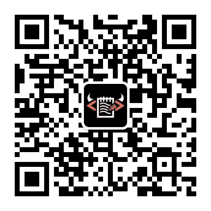

# 网易 2021 校招笔试-数据分析师（提前批）

## 1

花呗分期作为支付宝的一个支付手段，已经普遍被大家使用。网易严选作为网易旗下自营电商品牌，也开通了花呗分期的功能，运营希望通过花呗分期免息的活动，促进销售额的增长、提升用户体验。在前期活动设置的时候，运营同学找到了作为数据分析师的你，希望可以解决下面的问题：
1、分期门槛（如满**元免息）、免息期数（3 期、6 期、12 期等）要如何设置，请列出具体分析的思路和理由。
2、花呗免息的活动效果需要如何评估，请列出具体评估的指标和方向。

你的答案

本题知识点

算法工程师 网易 2021 数据分析师

讨论

[Lucas201903101550253](https://www.nowcoder.com/profile/107187841)

1.对于免息门槛：
方法一、从影响用户是否购买出发。假设：a.免息门槛越低，用户越倾向于分期购买；
b.免息门槛低于某一阈值后，分期不再影响用户是否购买。所以问题的关键是找到这个阈值：从历史数据中计算每个免息门槛对应的购买率，找到购买率不再增加的拐点。方法二、从提高购买用户消费额度出发。假设：a.免息门槛能刺激用户产生更多消费；问题的关键是评估用户日常的消费能力，在这个基础上提高一些，设置为免息门槛：通过用户历史购买行为，计算用户每月平均消费水平，在这个基础上提高特定比例（如 20%），设置为该用户的免息门槛。对于免息期数：免息期越长用户越倾向于分期购买，但平台需要支付更多利息给花呗。如果单纯从营业额增长的角度，选择免息期数最长的方案合适。2.活动效果评估指标上应该比较参与免息活动和不参与免息活动的用户，在活动期间的人均营业额。可选的方案是在活动中随机保留一定比例的用户（如 5%）不参与免息活动，以这部分用户的表现作为对照的标准即可评估活动效果。
或者在活动初期流量平均分配到两组中，确定活动效果好后再将流量全部引入免息活动中。

发表于 2021-01-03 15:50:39

* * *

[DDDDDaemon](https://www.nowcoder.com/profile/787038575)

1、分期门槛及免息期数设置：分析思路一：目的——挽留“价格流失用户”，提升用户体验（1） 从用户消费转化角度确定分期门槛：从用户浏览到消费的转化率入手，分析流失用户（部分因为价格原因）浏览商品价格的各分位数，取 70 或 80 分位数，作为分期门槛参考价格具体口径：选取一段时间，找到进入商品详情页（停留时间长、或多次进入）但未成功支付的用户群，剔除价格过低的部分商品，求剩余商品价格的分位数（2）从“价格流失用户”的消费能力确定免息期数：根据分析“价格流失用户”的月均消费金额，并根据用户画像的相关信息，建立模型预测该用户群体的收入水平，根据预测结果来制定免息期数分析思路二：目的——推广“高利润高销量产品”，促进销售额的增长从想要推广的产品角度出发，取商城内价格偏高的高销量或高利润产品（利润的高转化率产品），具体分析价格分布来制定分期门槛 2、评估指标设置：用花呗支付单数及金额对整个商城的贡献作为指标，对比活动前后贡献比例的变化幅度（1）花呗支付单数/总销售单数（2）花呗支付金额/总支付金额

发表于 2021-01-01 17:49:33

* * *

[牛客 62212898 号](https://www.nowcoder.com/profile/62212898)

一、1、分期门槛假设本着节约成本的原则，我们要选择的是用户能够承受的最高分期门槛。可以通过查看用户的历史订单，列举用户付费金额 用户累计占比 用户占比增长率，查找用户占比增长率的拐点作为分期门槛，在具体实施过程中可以根据实际情况区分分品类门槛，分用户类型门槛；2、免息期数目的是促进销售额的增长。根据已有用户订单数据，调研不同金额的用户所选择的最大分期数，然后对应的将免息期数设置为最大分期数的一半或三分之一（需要做 A/B test 去测试，具体还需要区分品类和用户类型）二、花呗免息活动效果评估 1、活动整体效果活动前后参加花呗免息活动的人数，订单数，销售额，及整个平台使用花呗下单人数，订单数，销售额及前面各指标在整体中的占比。对活动整体的参与情况进行评估 2、活动的促进效果花呗新增使用人数，花呗下单人数在所有下单人数中占比，花呗下单订单数在所有订单数中占比。主要从花呗免息活动的参与人数和销售额两个方面考量活动的效果

发表于 2021-03-09 15:38:10

* * *

## 2

各大平台相继推出和迭代付费会员策略，如优酷会员、京东 PLUS 会员、网易云音乐黑胶 VIP 等，通过提供丰富的权益吸引用户成为付费会员，提升用户黏性和忠诚度。请围绕付费会员回答以下问题：
1.以网易云音乐黑胶 VIP 为例，运营同学希望推出活动吸引用户开卡。一种方式是年卡买一送一，即支付一年的年费享受两年的会员权益；一种方式是年卡费用五折。你认为哪种方式更好？请给出具体的理由。
2.网易云音乐和网易严选推出了联合会员，即购买云音乐的黑胶 VIP，可以赠送一年的严选 Pro 会员。作为分析师，你将如何评估联合会员活动的成本收益？请给出具体的评估指标。

你的答案

本题知识点

算法工程师 网易 2021 数据分析师

讨论

[Lucas201903101550253](https://www.nowcoder.com/profile/107187841)

1.年卡五折好。优势主要有以下几点：a.吸引潜在用户：买一送一更吸引产品的长期忠诚用户购买，但这部分用户本身黏性比较高，我们更应该关注把潜在用户培养成长期忠诚用户，直接打折价格优势更明显。b.突出价格优势：打折是立刻生效的优惠，更能刺激用户消费，相比起第二年才能拿到的权益，用户更容易被眼前的直接利益吸引。2\.收益有两个部分：a.卖会员卡得到的收入；b.成功转化为严选用户节省的获客成本成本有两个部分：a.网易云音乐每个会员平均的成本；b.这部分用户从严选平台薅走的羊毛利润=卖会员卡得到的收入+成功转化为严选用户节省的获客成本-网易云音乐每个会员平均的成本-这部分用户从严选平台薅走的羊毛

发表于 2021-01-03 15:51:21

* * *

[Beryllll 要努力](https://www.nowcoder.com/profile/322319149)

1、年卡买一送一，相当于绑定用户，延长其会员使用年限。年卡费用五折，主要是价格上的优惠，相对而言更适用于新用户。网易云音乐目前在国内音乐市场中发展得相对成熟，需要开拓的新市场较小，因此如何留住用户才是值得思考的问题，使用年卡买一送一的活动有助于提升用户的留存率与忠诚度。2、联合会员活动的面向群体主要是对这两款产品均有依赖，且至少一个平台的深度用户。因此评估收益主要是看开卡人数的多少，同比及环比的增长速度，及严选平台的销售额上是否有相应的提升，主要关注开卡用户是否有进行严选平台上的购买行为及网易云的听歌行为及频率多少，以此评估效果。

发表于 2021-03-27 10:10:34

* * *

[牛客 456746277 号](https://www.nowcoder.com/profile/456746277)

1\. 五折更好原因：a. 对于忠诚用户而言，本来就已经具备了一定的粘度，愿意继续使用产品，并且五折还是买一送一相对于他们来说，成本相同，无明显差别；b. 对于潜在的忠诚用户而言，五折是立即生效的优惠，更能够刺激用户的消费，吸引潜在者的参加。以此方式能够更好地培养潜在用户的用户习惯，增强用户的忠诚度。2. 成本：网易音乐会员成本+会员购买商品所享优惠收益：卖会员卡所得收入+会员购买商品的金额+原本的网易严选获客成本利润：（卖会员卡所得收入+会员购买商品的金额+原本的网易严选获客成本）-（网易音乐会员成本+会员购买商品所享优惠）

发表于 2021-04-17 16:59:37

* * *

## 3

如下有一张商品表（goods），字段依次为：商品 id、商品名、商品质量

| id | name | weight |
| 1 | A1 | 100 |
| 2 | A2 | 20 |
| 3 | B3 | 29 |
| 4 | T1 | 60 |
| 5 | G2 | 33 |
| 6 | C0 | 55 |

还有一张交易表（trans），字段依次为：交易 id、商品 id、这个商品购买个数

| id | goods_id | count |
| 1 | 3 | 10 |
| 2 | 1 | 44 |
| 3 | 6 | 9 |
| 4 | 1 | 2 |
| 5 | 2 | 65 |
| 6 | 5 | 23 |
| 7 | 3 | 20 |
| 8 | 2 | 16 |
| 9 | 4 | 5 |
| 10 | 1 | 3 |

查找购买个数超过 20,质量小于 50 的商品，按照商品 id 升序排序,如:

| id | name | weight | total |
| 2 | A2 | 20 | 81 |
| 3 | B3 | 29 | 30 |
| 5 | G2 | 33 | 23 |

提交的代码

提交时间： 语言： 运行时间： <1 ms 占用内存：0K 状态：

*   添加笔记;)
*   求解答(33);)
*   收藏;)
*   分享;)

本题知识点

算法工程师 网易 2021 数据分析师

共有 83 条讨论 *查看题解* *添加解析;)*

*发表解析;)** 牛客 178763728 号思路：trans 表只需要提供每个商品的购买总数，所以嵌套查询，1 先处理好 trans 表，命名为 b(select 子查询)，2 再结合 goods 表完成任务(外层 select)程序：

```cpp
select id,name,weight,total 
from goods as a,
(select goods_id,sum(count) total
from trans 
group by goods_id) as b
where a.id=b.goods_id and weight<50 and total>20
```

发表于 2021-06-15 23:19:35 回复(2);)****** 零葬 交易表作为主表，直接左关联商品表然后以 goods_id 分组计算每个商品的购买个数，再从结果中过滤出购买个数和商品质量符合要求的商品

```cpp
select
    t.goods_id as id,
    g.name as name,
    g.weight as weight,
    sum(t.count) as total
from trans t
left join goods g on t.goods_id=g.id
group by t.goods_id
having total > 20 and weight < 50;
```

发表于 2021-01-08 17:36:37 回复(14);)****** 狗头蜀黍 select 之后应该只有 group by 后面的字段和聚合函数，left join 后面尽量不要用虚拟表，索引会失效，用 inner join 好一点 select g.id,g.name,g.weight, t.total from goods as g 
inner join (select tr.goods_id,sum(tr.count) as total from trans tr group by tr.goods_id having total >20
) as t 
on g.id = t.goods_id 
where g.weight < 50;
发表于 2021-03-10 16:26:07 回复(0);)*********跳转试题广场查看更多题目或讨论******上一题 下一题 返回顶部;)

做对这道题的人

*   牛客 732681136 号 TA 的设计;)
*   Verbo TA 的设计;)
*   ANGELAMABY_ TA 的设计;)
*   无名的人 TA 的设计;)
*   牛客 93083226 号 TA 的设计;)
*   恪 kkk TA 的设计;)

本题知识点

算法工程师 网易 2021 数据分析师

讨论

[牛客 178763728 号](https://www.nowcoder.com/profile/178763728)

思路：trans 表只需要提供每个商品的购买总数，所以嵌套查询，1 先处理好 trans 表，命名为 b(select 子查询)，2 再结合 goods 表完成任务(外层 select)程序：

```cpp
select id,name,weight,total 
from goods as a,
(select goods_id,sum(count) total
from trans 
group by goods_id) as b
where a.id=b.goods_id and weight<50 and total>20
```

发表于 2021-06-15 23:19:35

* * *

[零葬](https://www.nowcoder.com/profile/75718849)

交易表作为主表，直接左关联商品表然后以 goods_id 分组计算每个商品的购买个数，再从结果中过滤出购买个数和商品质量符合要求的商品

```cpp
select
    t.goods_id as id,
    g.name as name,
    g.weight as weight,
    sum(t.count) as total
from trans t
left join goods g on t.goods_id=g.id
group by t.goods_id
having total > 20 and weight < 50;
```

发表于 2021-01-08 17:36:37

* * *

[狗头蜀黍](https://www.nowcoder.com/profile/749678774)

select 之后应该只有 group by 后面的字段和聚合函数，left join 后面尽量不要用虚拟表，索引会失效，用 inner join 好一点 select g.id,g.name,g.weight, t.total from goods as g 
inner join (select tr.goods_id,sum(tr.count) as total from trans tr group by tr.goods_id having total >20
) as t 
on g.id = t.goods_id 
where g.weight < 50;

发表于 2021-03-10 16:26:07

* * *

## 4

假设云音乐数据库里面现在有几张如下简化的数据表:
关注 follow 表,第一列是关注人的 id,第二列是被关注人的 id,这 2 列的 id 组成主键

| user_id | follower_id |
| 1 | 2 |
| 1 | 4 |
| 2 | 3 |

这张表的第一行代表着用户 id 为 1 的关注着 id 为 2 的用户
这张表的第二行代表着用户 id 为 1 的关注着 id 为 4 的用户
这张表的第三行代表着用户 id 为 2 的关注着 id 为 3 的用户

个人的喜欢的音乐 music_likes 表,第一列是用户 id,第二列是喜欢的音乐 id,这 2 列的 id 组成主键

| user_id  | music_id |
| 1 | 17 |
| 2 | 18 |
| 2 | 19 |
| 3 | 20 |
| 4 | 17 |

这张表的第一行代表着用户 id 为 1 的喜欢 music_id 为 17 的音乐
....
这张表的第五行代表着用户 id 为 4 的喜欢 music_id 为 17 的音乐

音乐 music 表，第一列是音乐 id，第二列是音乐 name,id 是主键

| id | music_name |
| 17 | yueyawang |
| 18 | kong |
| 19 | MOM |
| 20 | Sold Out |

请你编写一个 SQL，查询向 user_id = 1 的用户，推荐其关注的人喜欢的音乐。
不要推荐该用户已经喜欢的音乐，并且按 music 的 id 升序排列。你返回的结果中不应当包含重复项
上面的查询结果如下:

| music_name |
| kong |
| MOM  |

提交的代码

提交时间： 语言： 运行时间： <1 ms 占用内存：0K 状态：

*   添加笔记;)
*   求解答(27);)
*   收藏;)
*   分享;)

本题知识点

算法工程师 网易 2021 数据分析师

共有 151 条讨论 *查看题解* *添加解析;)*

*发表解析;)** 求求给个 offer 吧好吗

```cpp
第一步：用户 1 关注了哪些人
select follower_id
from follow
where user_id=1
第二步：用户 1 喜欢的音乐
select music_id
from music_likes
where user_id=1
第三步：关注的那些人喜欢的音乐
select music_id
from music_likes
where user_id in (
    select follower_id
    from follow
    where user_id=1
)
第四步：除了用户 1 喜欢的音乐外，关注的那些人喜欢的其他音乐
select music_id
from music_likes
where user_id in (
    select follower_id
    from follow
    where user_id=1
) and music_id not in(
select music_id
from music_likes
where user_id=1
)
第五步：与音乐表联结
select distinct m.music_name
from music m join 
(
    select music_id
    from music_likes
    where user_id in (
        select follower_id
        from follow
        where user_id=1
    ) and music_id not in(
    select music_id
    from music_likes
    where user_id=1
)
)a
on a.music_id=m.id
order by m.id
```

编辑于 2021-05-28 22:22:15 回复(4);)****** 牛客 845115516 号分别查找 用户 1 及其关注者喜欢的音乐，则最终的结果使用  IN 、NOT IN 寻找并排除 SELECT music_nameFROM musicWHERE id IN (SELECT DISTINCT music_id            FROM music_likes            WHERE user_id IN (SELECT follower_id                                 FROM follow                                 WHERE user_id=1))      AND id NOT IN (SELECT DISTINCT music_id                     FROM music_likes                     WHERE user_id=1)发表于 2021-03-11 22:54:13 回复(4);)****** 360 内推-佳佳 注意要去重！前面做的获得积分最多的人系列的题做到自闭，这道题很快做出来了，开心！刷题下来有一个经验就是：一定要想好再写！确定思路了再写！千万不要在自己对题目的理解都一知半解的情况下胡乱写~这道题的思路：先确定下我关注的人和我喜欢的音乐的 id，并去掉我和关注的人都喜欢的 id，再用 music 表将 id 对上名字，需要注意的是，可能我关注的人中喜欢的音乐有重叠，因此要对 music_name 去重~

```cpp
select distinct t3.music_name
from follow t1, music_likes t2, music t3
where t1.follower_id = t2.user_id
and t2.music_id = t3.id
and t1.user_id =1 
and t2.music_id not in 
(select music_id
from music_likes
where user_id =1)
order by t3.id
```

发表于 2021-10-06 20:56:09 回复(3);)*********跳转试题广场查看更多题目或讨论******上一题 返回 返回顶部;)

做对这道题的人

*   好运气都用来找工作 TA 的设计;)
*   一定会有 offerde TA 的设计;)
*   阿和. TA 的设计;)
*   牛客 937699608 号 TA 的设计;)
*   秋秋秋秋 Miu TA 的设计;)
*   牛客 407839815 号 TA 的设计;)****  *****   

    扫描二维码，关注牛客网

*   [意见反馈](https://www.nowcoder.com/subject/index/b211632d69fd42f7b55aae38d4242fda)
*   

    下载牛客 APP，随时随地刷题


扫一扫，把题目装进口袋

求职之前，先上牛客

[](javascript:void(0););) [](javascript:void(0););) 

*   关于我们
*   加入我们
*   [意见反馈](https://www.nowcoder.com/subject/index/b211632d69fd42f7b55aae38d4242fda)
*   [企业服务](https://hr.nowcoder.com)
*   校企合作
*   联系我们
*   免责声明
*   友情链接

*   公司地址：北京市朝阳区北苑路北美国际商务中心 K2 座一层-北京牛客科技有限公司
*   联系方式：010-60728802 投诉举报电话：010-57596212（朝阳人力社保局）
*   牛客科技© All rights reserved admin@nowcoder.com
*   京 ICP 备 14055008 号-4 增值电信业务经营许可证 营业执照 人力资源服务许可证
*    [京公网安备 11010502036488 号](http://www.beian.gov.cn/portal/registerSystemInfo?recordcode=11010502036488)

[](../../C%3A/Users/Administrator/Desktop/out/27972207.html) *本题知识点

算法工程师 网易 2021 数据分析师

讨论

[求求给个 offer 吧好吗](https://www.nowcoder.com/profile/381842976)

```cpp
第一步：用户 1 关注了哪些人
select follower_id
from follow
where user_id=1
第二步：用户 1 喜欢的音乐
select music_id
from music_likes
where user_id=1
第三步：关注的那些人喜欢的音乐
select music_id
from music_likes
where user_id in (
    select follower_id
    from follow
    where user_id=1
)
第四步：除了用户 1 喜欢的音乐外，关注的那些人喜欢的其他音乐
select music_id
from music_likes
where user_id in (
    select follower_id
    from follow
    where user_id=1
) and music_id not in(
select music_id
from music_likes
where user_id=1
)
第五步：与音乐表联结
select distinct m.music_name
from music m join 
(
    select music_id
    from music_likes
    where user_id in (
        select follower_id
        from follow
        where user_id=1
    ) and music_id not in(
    select music_id
    from music_likes
    where user_id=1
)
)a
on a.music_id=m.id
order by m.id
```

编辑于 2021-05-28 22:22:15

* * *

[牛客 845115516 号](https://www.nowcoder.com/profile/845115516)

分别查找 用户 1 及其关注者喜欢的音乐，则最终的结果使用  IN 、NOT IN 寻找并排除 SELECT music_nameFROM musicWHERE id IN (SELECT DISTINCT music_id            FROM music_likes            WHERE user_id IN (SELECT follower_id                                 FROM follow                                 WHERE user_id=1))      AND id NOT IN (SELECT DISTINCT music_id                     FROM music_likes                     WHERE user_id=1)

发表于 2021-03-11 22:54:13

* * *

[360 内推-佳佳](https://www.nowcoder.com/profile/615269901)

注意要去重！前面做的获得积分最多的人系列的题做到自闭，这道题很快做出来了，开心！刷题下来有一个经验就是：一定要想好再写！确定思路了再写！千万不要在自己对题目的理解都一知半解的情况下胡乱写~这道题的思路：先确定下我关注的人和我喜欢的音乐的 id，并去掉我和关注的人都喜欢的 id，再用 music 表将 id 对上名字，需要注意的是，可能我关注的人中喜欢的音乐有重叠，因此要对 music_name 去重~

```cpp
select distinct t3.music_name
from follow t1, music_likes t2, music t3
where t1.follower_id = t2.user_id
and t2.music_id = t3.id
and t1.user_id =1 
and t2.music_id not in 
(select music_id
from music_likes
where user_id =1)
order by t3.id
```

发表于 2021-10-06 20:56:09

* * **********