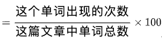
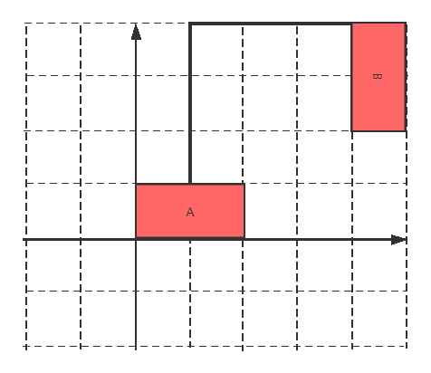

# 网易 2021 校招笔试-计算机视觉算法工程师（提前批）

## 1

现在有 n 个物品，每一个物品都有一个价值，现在想将这些物品分给两个人，要求这两个人每一个人分到的物品的价值总和相同（个数可以不同，总价值相同即可），剩下的物品就需要扔掉，现在想知道最少需要扔多少价值的物品才能满足要求分给两个人。要求：时间复杂度，空间复杂度 

本题知识点

算法工程师 网易 2021 Java 工程师 大数据开发工程师 游戏研发工程师 运维工程师 C++工程师 测试工程师 测试开发工程师

讨论

[郭威找个好工作](https://www.nowcoder.com/profile/993116081)

```cpp
T = int(input()) #取出循环组数
for x in range(T):
    n = int(input()) #取出一组内数字个数
    a = list(map(int,input().split())) #遍历数组保存至 list
    ans = 10000000000
    def DFS(x, n, A, B, C):
        global ans
        if C > ans:return #递归终止条件
        if x>=n:
            if A == B:
                ans = min(ans,C) #取 C 的最小值
            return
        DFS(x+1,n,A+a[x],B,C)
        DFS(x+1,n,A,B+a[x],C)
        DFS(x+1,n,A,B,C+a[x])
    DFS(0, n, 0, 0, 0)
    print(ans)

```

A：第一个人的背包，B：第二个人的背包，C：丢弃背包循环将每一种可能性加入 ABC 当最终添加所有背包后，找出 A == B 背包的情况，并将其得到的 C 取最小值

发表于 2021-08-21 14:34:24

* * *

[牛客 636841603 号](https://www.nowcoder.com/profile/636841603)

这道题我认为是选择问题 通过 dfs 每一种可能的选择，找到所有可能的解法

**题意转换**

将题意转换很重要，题目是求最少丢掉多少物品能够平分给两个人，转换为两个人从 0 开始拿，计算出所有满足平分条件的最值（最少丢弃）

**具体步骤**

1.  首先将题目转换为两个人从 0 开始拿物品，对于每一件物品开始进行选择，对于每个物品有三种选择，给第一个人、给第二个人、丢掉。

2.参数说明：nums 记录 n 个物品的价值 ；result1、result2 记录两个人目前分别拿了多少；sum 记录所有元素总和，index 记录选择进行到哪个元素了，n 记录总共有多少个需要选择的物品

3.选择结束条件：搜索到最后一个物品 判断两者是否相等 相等则记录此时的最值 ```cpp
#include<iostream>
using namespace std;
#include<vector>
#include<algorithm>
#include<bits/stdc++.h>
//定义两组数据的累加和  从 0 开始 dfs 每种可能，遇到两者相同的情况，就记录此时需要扔掉
//选择问题  两个人从 0 开始拿物品，遇到一个物品有三种选择，给第一个人，给第二个人，扔掉。
//走到结尾就找到舍弃价值最小的那一个节点

int res = INT_MAX;//最小扔掉的价值
void dfs(vector<int>& nums,int result1,int result2,int sum,int index,int n)
{
    //一直选择到最后一个数字才返回
    if (index == n)
    {
        if (result1 == result2)
        {
            res = min(res, sum - result1 - result2);
        }
        return;
    }

    //选择环节  每次进入选择环节都有三种选择 
    dfs(nums,result1 + nums[index], result2, sum, index + 1,n);
    dfs(nums,result1,result2 + nums[index], sum, index + 1,n);
    dfs(nums,result1,result2,sum,index+1,n);
}

int main()
{
    int t;
    cin >> t;
    while (t--)//一个 while 输出一个答案
    {
        int n;
        cin >> n;
        int temp;

        vector<int> nums;//输入数组
        for (int i = 0; i < n; i++)
        {
            cin >> temp;
            nums.push_back(temp);
        }

        int sum = 0;
        for (auto i : nums)
        {
            sum += i;
        }

        dfs(nums, 0, 0, sum, 0, n);
        cout << res << endl;
        res = INT_MAX;

    }
}
```  发表于 2021-07-14 14:09:08

* * *

[loveling](https://www.nowcoder.com/profile/7237115)

dfs 找出物品能组成的不大于物品总价值一半的所有价值，再判断此时剩余的其他物品能不能组出这个价值，如果能组出就用这个价值去更新最大价值，物品总价值和减去最大价值的两倍就是答案。

```cpp
#include<iostream>
#include<stdio.h>
#include<vector>
using namespace std;

bool judge(vector<int>& v, vector<int>& mark, int n, int tsum)
{     
        bool ret = false;
    vector<int> tv(1,0);
    for(int i=0; i<n; i++)
    {
        if(mark[i]==0)
        {
            int len = tv.size();
            for(int j=0;j<len;j++)
            {
                if(tv[j]+v[i]==tsum)
                {
                    ret = true;
                    break;
                }
                else
                    tv.push_back(tv[j]+v[i]);
            }
        }
        if(ret)
            break;
    }
    return ret;
}

void search(vector<int>& v, vector<int>& mark, int i, int n, int tsum, int sum, int& ans)
{
    if(i>n || tsum*2>sum)
        return;
    if(i==n)
    {
        if(judge(v, mark, n ,tsum))
        {
            if(tsum>ans)
                ans=tsum;
        }
        return;
    }
    mark[i]=1;
    search(v, mark, i+1, n, tsum + v[i], sum, ans);
    mark[i]=0;
    search(v, mark, i+1, n, tsum, sum, ans);
}

int main()
{
    int T;
    scanf("%d",&T);
    while(T--)
    {
        int n,sum=0,ans=0;
        scanf("%d",&n);
        vector<int> v(n);
        vector<int> mark(n,0);
        for(int i=0;i<n;i++)
        {
            scanf("%d",&v[i]);
            sum+=v[i];
        }
        search(v, mark, 0, n, 0, sum, ans);
        printf("%d\n",sum-2*ans);
    }
    return 0;
}
```

发表于 2021-03-04 10:21:56

* * *

## 2

现在有 n 个人排队买票，已知是早上 8 点开始卖票，这 n 个人买票有两种方式：

第一种是每一个人都可以单独去买自己的票，第 i 个人花费 a[i] 秒。

第二种是每一个人都可以选择和自己后面的人一起买票，第 i 个人和第 i+1 个人一共花费 b[i] 秒。

最后一个人只能和前面的人一起买票或单独买票。

由于卖票的地方想早些关门，所以他想知道他最早几点可以关门，请输出一个时间格式形如：08:00:40 am/pm

时间的数字要保持 2 位，若是上午结束，是 am ，下午结束是 pm 进阶：时间复杂度,空间复杂度 

本题知识点

算法工程师 网易 2021 游戏研发工程师 C++工程师 测试开发工程师 数据库工程师

讨论

[骑士王的孤傲](https://www.nowcoder.com/profile/408516748)

这个题最难的地方：中午 12 点是 am

发表于 2021-04-18 03:19:01

* * *

[零葬](https://www.nowcoder.com/profile/75718849)

直接用动态规划模拟买票的过程，但是要注意 a 中只有一个元素的情况，此时 b 会输入个空串，贼坑！

```cpp
T = int(input())
while T:
    str_n = input()
    if not str_n:
        continue
    n = int(str_n)
    a = list(map(int, input().split()))
    if len(a) == 1:
        h = a[0] // 3600 + 8       # 小时
        m = a[0] % 3600 // 60      # 分钟
        s = a[0] % 60              # 秒
    else:
        b = list(map(int, input().split()))
        # f[i]为到第 i 个人为止，一共花费了多长时间
        f = [0]*n
        f[0] = a[0]
        f[1] = min(f[0] + a[1], b[0])
        for i in range(2, n):
            # 比较第 i 个人单独买票和与第 i-1 个人一起买票的时间，选择用时少的
            f[i] = min(f[i - 1] + a[i], f[i - 2] + b[i - 1])
        h = f[-1] // 3600 + 8       # 小时
        m = f[-1] % 3600 // 60      # 分钟
        s = f[-1] % 60              # 秒
    is_am = True
    if h > 12:
        h -= 12
        is_am = False
    am_or_pm = "am" if is_am else "pm"
    print("%02d:%02d:%02d %s" % (h, m, s, am_or_pm))
    T -= 1
```

发表于 2021-01-16 22:43:13

* * *

[不偷不抢安度因 _](https://www.nowcoder.com/profile/275523507)

简单的 dp

```cpp
#include <bits/stdc++.h>

using namespace std;

int main() {
    int T;
    cin >> T;
    while (T--) {
        int n;
        cin >> n;
        vector<int> dp(n + 1, 0);
        vector<int> single(n);
        for (int i = 0; i < n; ++i) {
            cin >> single[i];
        }
        dp[1] = single[0];
        for (int i = 2; i <= n; ++i) {
            int twoSum;
            cin >> twoSum;
            dp[i] = min(dp[i - 1] + single[i - 1], dp[i - 2] + twoSum);
        }

        int seconds = dp[n];
        int hh, mm, ss;
        ss = seconds % 60;
        mm = (seconds / 60) % 60;
        hh = seconds / 3600;
        hh += 8;
        char s[3] = "am";
        if (hh > 12) {
            hh -= 12;
            s[0] = 'p';
        }
        printf("%02d:%02d:%02d %s\n", hh, mm, ss, s);

    }

    return 0;
}
```

发表于 2021-03-10 18:20:55

* * *

## 3

小易今天读了一篇英语文章，他现在想从里面找出一个单词作为这篇文章的关键词，一个单词可以作为关键词当且仅当它在这篇文章中出现的频率不低于 1% ，现在他想知道有多少个不同的单词可以作为关键词。
一个单词出现的频率%

本题知识点

算法工程师 网易 2021 安卓工程师 iOS 工程师 游戏研发工程师 前端工程师 C++工程师 运维工程师 Java 工程师 安全工程师 测试工程师 数据库工程师

讨论

[零葬](https://www.nowcoder.com/profile/75718849)

非常简单，直接统计词频，然后看哪些词的词频达到了关键词的标准即可

```cpp
n = int(input())
wc = dict()
for _ in range(n):
    word = input().strip()
    if word not in wc:
        wc[word] = 1
    else:
        wc[word] += 1
count = 0
for w in wc:
    if wc[w] / n >= 0.01:
        count += 1
print(count)
```

发表于 2021-01-17 23:12:17

* * *

[八首翻唱](https://www.nowcoder.com/profile/7830670)

```cpp
class num_nn(): def __init__(self): self.num_n = [] self.count_m = 0  def play(self): self.n = input("请输入单词数: ") for i in range(0,int(self.n)):
            num = input("请输入单词: ") self.num_n.append(num) self.num_n_set = set(self.num_n) for item in self.num_n_set: print("the %s has found %s" %(item,self.num_n.count(item))) if int(self.num_n.count(item))/int(self.n) >= 0.01: self.count_m = self.count_m + 1  print(self.count_m) if __name__ == '__main__':
    numnn = num_nn()
    numnn.play()
```

发表于 2021-02-28 15:14:28

* * *

[＆liu](https://www.nowcoder.com/profile/942232363)

```cpp
import java.util.HashMap;
import java.util.Scanner;

public class Main {
    public static void main(String args[]) {
        HashMap<String,Integer> hm=new HashMap<String,Integer>();
        Scanner sc=new Scanner(System.in);
        int n=sc.nextInt();
        sc.nextLine();
        int res=0;
        for(int i=0;i<n;i++){
            String tmp=sc.nextLine();
            if(hm.get(tmp)==null){
                hm.put(tmp,1);
            }else{
                hm.put(tmp,hm.get(tmp)+1);
            }
        }
        for(String key:hm.keySet()){
            if((hm.get(key)*100)>=n){
                res++;
            }
        }
        System.out.println(res);
    }
}

```

发表于 2021-01-21 00:16:25

* * *

## 4

牛牛生活在网格世界中，在网格世界中人们出行只能**通过网格上的边来进行**。现在牛牛管理着 n 个城市，每个城市在网格世界中都以一个矩形来表示，牛牛想在这 n 个城市之间铺上水泥路方便人们出行，网格上一条边铺上水泥所需要的花费为 1 。但是为了节约预算，牛牛给你这 n 个城市的左下坐标(x[0],y[0])和右上坐标(x[1],y[1])，牛牛想让你告诉他让这 n 个城市联通所需要的最小花费是多少呢。(如图花费为 6) 

本题知识点

算法工程师 网易 2021

讨论

[蓝色夏天↙@_@↘★](https://www.nowcoder.com/profile/2392703)

先算每个城市两两之间的距离（4 个坐标两两相减的最小值），构建完全无向图，然后使用最小生成树算法？？n 数据较小，2s 限制，应该能行吧

发表于 2022-03-12 17:04:27

* * *

[VanChilly](https://www.nowcoder.com/profile/35524123)

这题没人会吗？我怎么感觉这题有毛病

发表于 2022-03-06 22:04:07

* * *