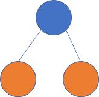
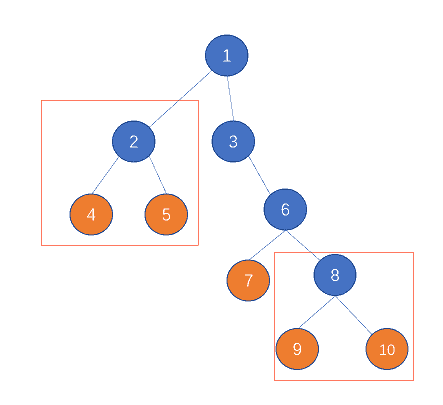

# 网易 2021 校招笔试-Java 开发工程师（正式第一批）

## 1

wait 方法和 sleep 方法区别是什么？

你的答案

本题知识点

算法工程师 网易 2021 Java 工程师

讨论

[无情的小调皮](https://www.nowcoder.com/profile/624717955)

sleep()属于 Thread 类，调用会导致线程暂停执行，把执行机会让给其他线程，但是线程监控状态依旧会保持，到时候会自动恢复。调用 sleep（）不会释放对象锁。wait()属于 object 类，调用 wait()导致本线程放弃对象锁，进入等待锁定池，只有调用 notify()或者 notifyAll()之后，线程才会进入等待状态。sleep 方法必须抛出异常，wait 不需要 sleep 方法可以在任何地方使用，wait 只能在同步方法或者同步代码块中使用

发表于 2021-03-09 10:54:34

* * *

[牛客 970204454 号](https://www.nowcoder.com/profile/970204454)

1.属于的类不同             wait()属于 object 类，sleep()属于 Thread 类 2.是否会释放线程          sleep(）不会，wait（）会 3.使用范围                     sleep()可以在任何线程，wait 只能在同步代码块或者方法中 4.是否能够按时获得锁  sleep()可以，wait(）不一定 5.是否需要抛出异常       sleep()要抛出中断异常（InterruptException），wait（）不用

发表于 2021-09-17 17:28:06

* * *

[陌路人 35 号](https://www.nowcoder.com/profile/420617252)

    sleep()方法是线程类（Thread）的静态方法，让调用线程进入睡眠状态，让出执行机会给其他线程，等到休眠时间结束后，
    线程进入就绪状态和其他线程一起竞争 CPU 的执行时间。
    wait()方法是 Object 类的方法，当一个线程执行到 wait()方法时，它就进入到一个和该对象相关的等待池，同时释放对象的
    机锁，使得其他线程能够访问，可以通过 notify，notifyAll 方法来唤醒等待的线程。
    区别：
    1）sleep()方法来自 thread 类。wait()方法来自 Object 类。
    2）sleep()方法没有释放对象的锁。而 wait()方法释放了锁，使得其他线程可以使用同步控制块或者方法。
    3）wait，notify 和 notifyAll 只能在同步控制方法或者同步控制块里面使用，而 sleep 可以在任何地方使用。

发表于 2022-03-15 16:41:15

* * *

## 2

请描述 BlockingQueue 的原理和特点

你的答案

本题知识点

算法工程师 网易 2021 Java 工程师

讨论

[陌路人 35 号](https://www.nowcoder.com/profile/420617252)

阻塞队列解决了多线程中，高效安全“传输”数据的问题。

    阻塞队列的最常使用的例子就是生产者消费者模式。

    当队列中没有数据的情况下，消费者端的所有线程都会被自动阻塞（挂起），直到有数据放入队列。
    当队列中填满数据的情况下，生产者端的所有线程都会被自动阻塞（挂起），直到队列中有空的位置，线程被自动唤醒。

    特点：当将数据入队的时候，如果队列满了，则线程会被阻塞，队列出现空余时，线程被唤醒，并加入数据。
          当从队列中读取数据的时候，如果队列为空，线程会被阻塞，直至队列出现数据，线程才被唤醒，并读取数据。

    BlockingQueue 的实现有五种：
        ArrayBlockingQueue
        LinkedBlockingQueue
        PriorityBlockingQueue
        SynchronousQueue
        DelayQueue

发表于 2022-03-16 11:14:59

* * *

[Aerospike](https://www.nowcoder.com/profile/488419365)

BlockingQueue 是一个带阻塞的队列 Blocking 是一个接口，同 jdk 的接口 Quene 兼容，但是增加了阻塞功能

发表于 2021-03-27 09:49:35

* * *

## 3

有一棵二叉树，树上的叶子节点定义为“樱桃”。现在需要找出树上有多少个满足如下子结构的“樱桃”串，即一串上刚好有两颗“樱桃”。
比如如下的一棵树，红框标示的有两个符合要求的结构，答案就是 2
又比如下面的这颗树，没有任何符合要求的子结构，则答案是 0

本题知识点

算法工程师 网易 2021 Java 工程师 C++工程师 前端工程师 安卓工程师 iOS 工程师 安全工程师

讨论

[烟雨仔](https://www.nowcoder.com/profile/686030081)

```cpp
const readline = require("readline")

const rl = readline.createInterface({
  input:process.stdin,
  output: process.stdout
})

const rows = []
let m, n// 节点数 边数
const obj = {}
let result = 0

rl.on("line", line => {
  rows.push(line)
  if (rows.length === 1) {
    const arr1 = line.trim().split(" ").map(item => parseInt(item))
    m = arr1[0]
  } else {
    const arr2 = line.trim().split(" ").map(item => parseInt(item))
    if (!obj[arr2[0]]) obj[arr2[0]] = []
    obj[arr2[0]].push(arr2[2])
  }
  if (rows.length === m) {
    // console.log(obj)
    for(let key in obj) {
      if (obj[key].length == 2 && obj[obj[key][0]] != 0 && !obj[obj[key][1]] != 0) {
        result += 1
      }
    }
    console.log(result)
    rows.length = 0
  }
})
```

发表于 2021-02-08 13:52:23

* * *

[April1604](https://www.nowcoder.com/profile/81680356)

```cpp
#include<iostream>
#include<vector>
#include<string>
using namespace std;

class Node{
public:
    Node *left = NULL, *right = NULL;
};

int numOfCherries(Node* root){
    if(!root) return 0;
    if(!root->left) return numOfCherries(root->right);
    if(!root->right) return numOfCherries(root->left);
    if(!root->left->left && !root->left->right && !root->right->left && !root->right->right) return 1;
    return numOfCherries(root->left) + numOfCherries(root->right);
}

int main(){
    int m, n;
    cin >> m >> n;
    //用 vector 里的 index 表示 id，因为 id 从 1 开始，所以 size 为 m+1
    vector<Node*> a(m+1);
    for(int i = 0; i < m+1; i++){
        a[i] = new Node();
    }
    for(int i = 0; i < n; i++){
        int id;
        cin >> id;
        string position;
        cin >> position;
        int child;
        cin >> child;
        if(position[0] == 'l'){
            a[id]->left = a[child];
        }
        else{
            a[id]->right = a[child];
        }
    }
    cout << numOfCherries(a[1]);
    return 0;
}
```

发表于 2021-08-20 23:45:13

* * *

[牛客 93930297 号](https://www.nowcoder.com/profile/93930297)

let mn = readline().split(' ')
let m = mn[0],n = mn[1]
let line
let arr = []
let j = 0
while(line = readline()) {
    arr[j++] = line.trim().split(' ')//变成一个二维数据
}
let count = 0
let map = new Map()
for(let i = 0;i<arr.length;i++) {
    let j = 0
    map.has(arr[i][j]) ? map.set(arr[i][j],map.get(arr[i][j])+1):map.set(arr[i][j],1)
}
let x = 0
for(let i = 0;i<arr.length -1;i++) {
    let j  = 2
    if(!map.has(arr[i][j]) && !map.has(arr[i+1][j]) && (arr[i][0] == arr[i+1][0])) {
        count++
    }
}
console.log(count)

发表于 2021-07-08 21:52:16

* * *

## 4

给定一个字符串，请返回满足以下条件的最长字符串的长度：“a”、"b"、“c”、“x”、"y"、“z”在字符串中都恰好出现了偶数次（0 也是偶数）

本题知识点

算法工程师 网易 2021 Java 工程师 大数据开发工程师 游戏研发工程师 前端工程师 安卓工程师 iOS 工程师 运维工程师

讨论

[alaa](https://www.nowcoder.com/profile/293830529)

leetcode 1371.状态压缩＋哈希表。

```cpp
import java.util.*;
public class Main{
    public static void main(String[] args) {
        // write your code here
        Scanner scanner = new Scanner(System.in);
        String next = scanner.next();
        System.out.println(findTheLongestSubstring(next));

    }

    private static int findTheLongestSubstring(String s) {
        Map<Integer, Integer> map = new HashMap<>();

        int state = 0;
        int maxlen = 0;

        // 初始化
        map.put(0, -1);

        // a b c x y z 分别在第 123456 个 bit，来表示出现次数的奇偶性
        for (int i = 0; i < s.length(); i++) {
            if (s.charAt(i) == 'a') state ^= 0x000001;
            if (s.charAt(i) == 'b') state ^= 0x000010;
            if (s.charAt(i) == 'c') state ^= 0x000100;
            if (s.charAt(i) == 'x') state ^= 0x001000;
            if (s.charAt(i) == 'y') state ^= 0x010000;
            if (s.charAt(i) == 'z') state ^= 0x100000;
            if (map.containsKey(state)) {
                maxlen = Math.max(maxlen, i - map.get(state));
            } else {
                map.put(state, i);
            }
        }
        return maxlen;
    }
}
```

编辑于 2021-01-04 14:17:36

* * *

[雨尘 ovo](https://www.nowcoder.com/profile/170989909)

```cpp
//位运算+dp
import java.util.Scanner;

public class Main{
    public static void main(String[] args){
        Scanner cin=new Scanner(System.in);
        while(cin.hasNext()){
            String str=cin.nextLine();
            int[] dp=new int[str.length()];
            dp[0]=judge(str.charAt(0));
            for(int i=1;i<str.length();++i){
                int temp=judge(str.charAt(i));
                if(temp==0)
                    dp[i]=dp[i-1];
                else
                    dp[i]=dp[i-1]^temp;
            }
            int ans=0;
            for(int i=0;i<str.length();++i){
                for(int j=i;j<str.length();++j){
                    if((dp[j]^dp[j-i]^judge(str.charAt(j-i)))==0){
                        ans=i+1;
                        break;
                    }
                }
            }
            System.out.println(ans);
        }
    }

    public static int judge(char cr){
        if(cr=='a')
            return 1;
        if(cr=='b')
            return 2;
        if(cr=='c')
            return 4;
        if(cr=='x')
            return 8;
        if(cr=='y')
            return 16;
        if(cr=='z')
            return 32;
        return 0;
    }
}

```

发表于 2022-03-15 18:07:03

* * *

[皮克斯儿](https://www.nowcoder.com/profile/71048863)

以下是 js 的，思路不对，输入 let at = "ooooooaobobobo"的时候结果不对，也跑过了 70%，我再好好好想想这个思路
while(line=readline()){
    let at=line
let zimu = 
["a", "b", "c", "x", "y", "z"]
let a1 = at.split("")
function jie(a, b) {
  let a1 = a.split("")
  let shu = 0
  a1.forEach(item => {
    // console.log(item);
    if(item == b) {
      shu++
    }
  })
  // console.log(shu);
  // 如果出现了单数次
  // console.log(shu, b);
  if(shu % 2 == 1) {
    let d1 = a.indexOf(b)
    let d9 = a.lastIndexOf(b)
    if(d1 >= a.length - 1 - d9) {
      let cun = a.slice(0, d9)
      at = cun
      // console.log(at);
      return cun
    } else{
      let cun = a.slice(d1 + 1)
      at = cun
      // console.log(at);
      return cun
    }
    // console.log(d1,d9);
  } else{
    return a
  }

}
// jie("amabchhchhahh","a")
// console.log(jie(a1,"a"));
while(1) {
  let o = 
[]
  let oo
  // o 存入这时的 at

  at.split("").forEach(item => {
    o.push(item)
  })
  for(let i = 0; i < zimu.length; i++) {

    // console.log(at,zimu[i]);
    oo = jie(at, zimu
[i])   //oo 是操作完了之后的 a1 字符串
    // console.log(oo);

  }
  if(oo.length == o.length) {
    // kk = 1
    // console.log(oo,oo.length," kk=1");
    break
  }
}
console.log(at.length);
}

发表于 2022-01-17 19:47:56

* * *

## 5

严选的快递员每天需要送很多个包裹，在货物装车后，需要开着电动车先到 0 号用户家。送完货后从 0 号出发，再送到 1 号用户。然后快递员可以从 1 号直接到 2 号用户家，完成送货。但有时候由于路不通的原因，需要先折返回 0 号，再去 2 号，如此循环，完成送货。
由于路况复杂，每个用户家只有一条路通往附近的其他一户邻居家，假设每条通路都是 1 公里。另外快递员的电动车的电是有限的，最多只能开有限的 k 公里。现在快递员已经在 0 号用户家送完快递，问快递员最多可以送多少个不重复的用户

本题知识点

算法工程师 网易 2021 Java 工程师 测试开发工程师 测试工程师 大数据开发工程师 数据库工程师 运维工程师

讨论

[Wonder2021](https://www.nowcoder.com/profile/958589703)

```cpp
import java.util.Scanner;

public class Main {
    public static void main(String[] args) {
        Scanner s = new Scanner(System.in);
        String[] nk = s.nextLine().split(" ");
        String[] link = s.nextLine().split(" ");
        s.close();
        int k = Integer.parseInt(nk[1]);
        int dpt = dpt(link);
        if (dpt >= k) {
            System.out.println(k + 1);
        } else {
            System.out.println(Math.min(link.length + 1, dpt + 1 + (k - dpt) / 2));
        }
    }

    public static int dpt(String[] link) {
        Node[] nodes = new Node[link.length + 1];
        nodes[0] = new Node(0);
        int ind = 0;
        for (String parrent : link) {
            Node pn = nodes[Integer.parseInt(parrent)];
            nodes[++ind] = new Node(pn.dpt + 1);
        }
        ind = 0;
        for (Node node : nodes) {
            ind = Math.max(ind, node.dpt);
        }
        return ind;
    }
}

class Node {
    public int dpt = 1;

    public Node(int dpt) {
        this.dpt = dpt;
    }
}
```

发表于 2021-08-21 09:19:07

* * *

[丶小二上酒](https://www.nowcoder.com/profile/924283833)

```cpp
import java.util.*;

public class Main {
    public static void main(String[] args) {
        Scanner sc = new Scanner(System.in);
        String[] str = sc.nextLine().split(" ");
        int n = Integer.parseInt(str[0]);
        int k = Integer.parseInt(str[1]);
        String[] num = sc.nextLine().split(" ");
        int[] s = new int[num.length];
        for (int i = 0; i < num.length; i++) {
            s[i] = Integer.parseInt(num[i]);
        }
        boolean[][] dp = new boolean[n][n];
        for (int i = 1; i < n; i++) {
            dp[s[i-1]][i] = true;
            dp[i][s[i-1]] = true;
        }
        int depth = depthOfTree(dp);
        if (k < depth) {
            System.out.println(k + 1);
        }else {
            int res = Math.min(n,depth + (k - depth + 1) / 2);
            System.out.println(res);
        }
    }

    /*
    利用树的邻接表的层次遍历求出树的深度
     */
    public static int depthOfTree(boolean[][] adjacentMatrix) {
        LinkedList<Integer> queue = new LinkedList<>();
        int nodeNumber = adjacentMatrix.length;
        boolean[] visited = new boolean[nodeNumber];
        int depth = 0;
        queue.add(0);
        visited[0] = true;
        int layerNodes = 1;
        int nextLayerNodes = 0;
        while (queue.size() != 0) {
            while (layerNodes-- > 0) {
                int curNode = queue.poll();
                for (int i = 1; i < nodeNumber; i++) {
                    if (adjacentMatrix[curNode][i] && !visited[i]) {
                        nextLayerNodes ++;
                        visited[i] = true;
                        queue.add(i);
                    }
                }
            }
            layerNodes = nextLayerNodes;
            nextLayerNodes = 0;
            depth++;
        }
        return depth;
    }
}

```

发表于 2021-07-30 16:58:09

* * *

[牛客 68604898 号](https://www.nowcoder.com/profile/68604898)

```cpp
#include<bits/stdc++.h>
#include<stack>
#include<vector>
#include<unordered_set>

using std::endl;
typedef std::vector< std::vector<int> > ErweiMatrix;
typedef std::unordered_set<int> Hashset;

int FanHuiXiaoBiao(std::vector<int> ShuZu, int Zhi) {
    int XiaoBiao = -1;
    for (int counter_1 = 0;counter_1 < ShuZu.size();counter_1++) {
        if (ShuZu[counter_1] == Zhi) {
            XiaoBiao = counter_1;
            break;

        }

    }
    return XiaoBiao;

}

bool ISLianJie(int Node_1, int Node_2, ErweiMatrix NodeArray) {
    for (int nextNodes : NodeArray[Node_1]) {
        if (nextNodes == Node_2) {
            return true;
            break;
        }

    }

    return false;

}

int GetMaxIndex_XianZhi(std::vector<int> ShuZu, int XianZhi) {

    int GetMaxValue = 0;
    for (int counter_1 = 0;counter_1 < ShuZu.size();counter_1++) {
        if ((ShuZu[counter_1] > 0) && ((XianZhi - 2 * ShuZu[counter_1]) >= 0)) {

            GetMaxValue = ShuZu[counter_1] > GetMaxValue ? ShuZu[counter_1] : GetMaxValue;

        }

    }
    return FanHuiXiaoBiao(ShuZu, GetMaxValue);

}

int main() {

    std::ios_base::sync_with_stdio(false);
    std::cin.tie(0);
    std::cout.tie(0);

    int DianShu = 0;
    int MP = 0;

    std::cin >> DianShu >> MP;
    std::vector<int> input(DianShu - 1);
    for (int counter_1 = 0;counter_1 < DianShu - 1;counter_1++) {
        std::cin >> input[counter_1];

    }
    ErweiMatrix NodeArray(DianShu);
    for (int counter_1 = 0;counter_1 < DianShu - 1;counter_1++) {
        NodeArray[input[counter_1]].push_back(counter_1 + 1);
        NodeArray[counter_1 + 1].push_back(input[counter_1]);

    }
    std::vector<int> DaYing(DianShu);
    Hashset ChaChong;
    std::stack<int> Mystack;
    Mystack.push(0);

    ChaChong.insert(0);
    DaYing[0] = 0;
    int DaYingIndex = 1;
    std::vector<int> WhoLongest(DianShu, -1);
    WhoLongest[0] = 0;

    while (!Mystack.empty()) {
        int Cur = Mystack.top();
        if (NodeArray[Cur].size() == 1) WhoLongest[Cur] = Mystack.size();
        Mystack.pop();
        for (int NextNodes : NodeArray[Cur]) {
            if (ChaChong.count(NextNodes) == 0) {
                Mystack.push(Cur);
                Mystack.push(NextNodes);
                DaYing[DaYingIndex] = NextNodes;
                DaYingIndex++;
                ChaChong.insert(NextNodes);
                break;

            }

        }

    }

    int GetLongest = 0;
    for (int counter_1 = 0;counter_1 < DianShu;counter_1++) {
        GetLongest = WhoLongest[counter_1] > GetLongest ? WhoLongest[counter_1] : GetLongest;

    }
    int GetLongestNode = FanHuiXiaoBiao(WhoLongest, GetLongest);//具体节点号
    GetLongestNode = FanHuiXiaoBiao(DaYing, GetLongestNode);

    std::stack<int> fuzhu_CurLuJin;
    int ChuShiIndex = GetLongestNode;
    fuzhu_CurLuJin.push(ChuShiIndex);
    for (int counter_1 = ChuShiIndex - 1;counter_1 >= 0;counter_1--) {
        int DangQianNode = fuzhu_CurLuJin.top();//是下标
        if (ISLianJie(DaYing[DangQianNode], DaYing[counter_1], NodeArray)) {

            fuzhu_CurLuJin.push(counter_1);

        }

    }
    std::vector<int> DpValue(DianShu, -1);

    while (!fuzhu_CurLuJin.empty()) {

        DpValue[fuzhu_CurLuJin.top()] = 0;
        fuzhu_CurLuJin.pop();

    }

    for (int counter_1 = 0;counter_1 < DianShu;counter_1++) {
        if (DpValue[counter_1] != 0) {
            for (int counter_2 = counter_1 - 1;counter_2 >= 0;counter_2--) {

                if (ISLianJie(DaYing[counter_2], DaYing[counter_1], NodeArray)) {
                    DpValue[counter_1] = DpValue[counter_2] + 1;
                    break;
                }

            }

        }

    }
    int TongJi = 0;
    for (int counter_1 = 0;counter_1 < DianShu;counter_1++) {
        if (DpValue[counter_1] == 0) TongJi++;

    }

    MP -= (TongJi - 1);

    if (MP <= 1 && MP >= 0) {
        std::cout << TongJi;
        return 0;
    }

    if (MP < 0) {
        std::cout << MP + TongJi;
        return 0;

    }

    std::stack<int> HelpMeChange;
    while (MP > 1) {

        int Cur_Change = GetMaxIndex_XianZhi(DpValue, MP);

        if (Cur_Change == 0) break;
        if (DpValue[Cur_Change] == 0) break;
        MP -= DpValue[Cur_Change] * 2;

        DpValue[Cur_Change] = 0;
        HelpMeChange.push(DaYing[Cur_Change]);
        for (int counter_1 = Cur_Change - 1;counter_1 >= 0;counter_1--) {
            if (DpValue[counter_1] != 0 && ISLianJie(DaYing[counter_1], HelpMeChange.top(), NodeArray)) {
                DpValue[counter_1] = 0;
                HelpMeChange.pop();
                HelpMeChange.push(DaYing[counter_1]);

            }

        }
        HelpMeChange.pop();

        for (int counter_1 = 0;counter_1 < DianShu;counter_1++) {
        if (DpValue[counter_1] != 0) {
            for (int counter_2 = counter_1 - 1;counter_2 >= 0;counter_2--) {

                if (ISLianJie(DaYing[counter_2], DaYing[counter_1], NodeArray)) {
                    DpValue[counter_1] = DpValue[counter_2] + 1;
                    break;
                }

            }

        }

      }

    }
    int counterZeros = 0;
    for (int counter_1 = 0;counter_1 < DianShu;counter_1++) {
        if (DpValue[counter_1] == 0) counterZeros++;

    }
    std::cout << counterZeros;

    return 0;
}
```

发表于 2021-03-21 09:59:26

* * *

## 6

网易公司在七夕节前后内部都会组织相亲活动，但是由于人数众多，为了提高效率，主办方设计了一个系统。所有男生先登录系统，观看女生资料，然后在系统中登记他们自己有初步意向的女生，可以登记多个。反之女生也可以在系统中登记多个有初步意向的男生。如果某个女生和某个男生同时互相都有意向，则认定为匹配。最终系统会取出所有系统互相都初步匹配成功的男生女生，尽量地促成他们的真实约会，约会形式是互相匹配的一男与一女单独约会，但是被选中的男生女生最多只能约会一次。问该系统最多能够促成多少次约会，让尽可能多的男生女生得到约会机会。

本题知识点

算法工程师 网易 2021 安卓工程师 iOS 工程师 Java 工程师 运维工程师 游戏研发工程师

讨论

[零葬](https://www.nowcoder.com/profile/75718849)

通过深搜进行匹配

```cpp
from collections import defaultdict

male_ids = list(map(int, input().strip().split()))
female_ids = list(map(int, input().strip().split()))
n = int(input())
# 男女嘉宾的匹配映射
like = defaultdict(lambda: [])
for _ in range(n):
    m, f = map(int, input().strip().split())
    like[m].append(f)     # 男嘉宾 m 可以匹配的女嘉宾列表
    like[f].append(m)     # 女嘉宾 f 可以匹配的男嘉宾列表
match = dict()

def dfs(m):
    # 遍历可以和男嘉宾 m 配对的女嘉宾
    for f in like[m]:
        # 跳过已经访问过的女嘉宾
        if f in visit:
            continue
        visit.add(f)
        # 如果女嘉宾 f 还未配对，则记录 m 和 f 配对
        if f not in match:
            match[m] = f
            match[f] = m
            return True
        # 如果和女嘉宾 f 配对的男嘉宾还能和其他女嘉宾配对，就把女嘉宾 f 让给男嘉宾 m，以保证更多人能够配对成功
        if dfs(match[f]):
            match[m] = f
            match[f] = m
            return True
    return False

pairs = 0
for idm in male_ids:
    visit = set()
    # 男嘉宾 idm 还没有配对过，则对其进行匹配
    if idm not in match:
        # 匹配成功了，对数+1
        if dfs(idm):
            pairs += 1
print(pairs)
```

发表于 2021-01-18 21:02:35

* * *

[Wonder2021](https://www.nowcoder.com/profile/958589703)

```cpp
import java.util.ArrayList;
import java.util.Arrays;
import java.util.Scanner;

public class Main {

    static boolean[][] line;
    static boolean[] used;
    static int[] matchs;

    public static void main(String[] args) {
        Scanner s = new Scanner(System.in);
        ArrayList<String> boys = new ArrayList<String>(Arrays.asList(s.nextLine().split(" ")));
        ArrayList<String> girls = new ArrayList<String>(Arrays.asList(s.nextLine().split(" ")));
        line = new boolean[boys.size()][girls.size()];
        used = new boolean[girls.size()];
        matchs = new int[girls.size()];
        int lineCount = s.nextInt();
        s.nextLine();
        for (int i = 0; i < lineCount; i++) {
            String couple[] = s.nextLine().split(" ");
            line[boys.indexOf(couple[0])][girls.indexOf(couple[1])] = true;
        }
        s.close();
        System.out.println(match(boys.size()));
    }

    public static int match(int nBoys) {
        int sum = 0;
        Arrays.fill(matchs, -1);
        for (int i = 0; i < nBoys; i++) {
            Arrays.fill(used, false);
            if (find(i)) {
                sum++;
            }
        }
        return sum;
    }

    public static boolean find(int boy) {
        for (int i = 0; i < matchs.length; i++) {
            if (line[boy][i] && !used[i]) {
                used[i] = true;
                if (matchs[i] == -1 || find(matchs[i])) {
                    matchs[i] = boy;
                    return true;
                }
            }
        }
        return false;
    }

}

```

发表于 2021-08-21 10:54:11

* * *

[Euphonium♫](https://www.nowcoder.com/profile/627376110)

二分图匹配

```cpp
#include <algorithm>
#include <cmath>
#include <cstdio>
#include <cstdlib>
#include <cstring>
#include <iostream>
#include <map>
#include <queue>
#include <set>
#include <stack>
#include <string>
#include <vector>
#include <ctime>
#include <numeric>
#include <sstream>
using namespace std;
typedef long long ll;
#define __IN__ freopen("in.txt", "r", stdin);
#define __OUT__ freopen("out.txt", "w", stdout);
#define __FAST__                 \
    ios::sync_with_stdio(false); \
    cin.tie(0);                  \
    cout.tie(0);

#define N 10010

set<int> vis;
map<int, int> choosed;
set<int> b, g;
map<int, set<int> >mp;

bool dfs(int bid) {
    for(int gid : mp[bid]) {
        if(!vis.count(gid)) {
            vis.insert(gid);
            if(!choosed.count(gid) || dfs(choosed[gid])) {
                choosed[gid] = bid;
                return true;
            }
        }
    }
    return false;
}

int main() {
    // __FAST__
    // __IN__
    // __OUT__

    string s;
    stringstream ss;
    int x;

    getline(cin, s);
    ss << s;
    while(ss >> x)
        b.insert(x);
    getline(cin, s);
    ss.clear();
    ss << s;
    while(ss >> x)
        g.insert(x);

    int n;
    cin >> n;

    for(int i = 0; i < n; i++) {
        int u, v;
        cin >> u >> v;
        mp[u].insert(v);
    }

    int ans = 0;
    for(int bid : b) {
        vis.clear();
        if(dfs(bid))
            ans++;
    }
    cout << ans << endl;
    return 0;
}

```

发表于 2021-08-07 16:19:00

* * *