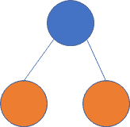
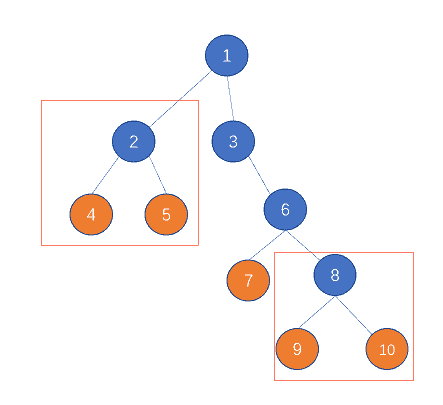
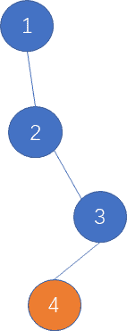

# 网易 2021 校招笔试-Windows 开发工程师-(杭研)（正式第一批）

## 1

请你描述下 Windows 下的 UAC 是什么，有什么作用？

你的答案

本题知识点

Java 工程师 C++工程师 网易 2021

## 2

请描述把目标 DLL 远程注入目标进程的方法.

你的答案

本题知识点

Java 工程师 C++工程师 网易 2021

## 3

有一棵二叉树，树上的叶子节点定义为“樱桃”。现在需要找出树上有多少个满足如下子结构的“樱桃”串，即一串上刚好有两颗“樱桃”。
比如如下的一棵树，红框标示的有两个符合要求的结构，答案就是 2
又比如下面的这颗树，没有任何符合要求的子结构，则答案是 0

本题知识点

算法工程师 网易 2021 Java 工程师 C++工程师 前端工程师 安卓工程师 iOS 工程师 安全工程师

讨论

[烟雨仔](https://www.nowcoder.com/profile/686030081)

```cpp
const readline = require("readline")

const rl = readline.createInterface({
  input:process.stdin,
  output: process.stdout
})

const rows = []
let m, n// 节点数 边数
const obj = {}
let result = 0

rl.on("line", line => {
  rows.push(line)
  if (rows.length === 1) {
    const arr1 = line.trim().split(" ").map(item => parseInt(item))
    m = arr1[0]
  } else {
    const arr2 = line.trim().split(" ").map(item => parseInt(item))
    if (!obj[arr2[0]]) obj[arr2[0]] = []
    obj[arr2[0]].push(arr2[2])
  }
  if (rows.length === m) {
    // console.log(obj)
    for(let key in obj) {
      if (obj[key].length == 2 && obj[obj[key][0]] != 0 && !obj[obj[key][1]] != 0) {
        result += 1
      }
    }
    console.log(result)
    rows.length = 0
  }
})
```

发表于 2021-02-08 13:52:23

* * *

[April1604](https://www.nowcoder.com/profile/81680356)

```cpp
#include<iostream>
#include<vector>
#include<string>
using namespace std;

class Node{
public:
    Node *left = NULL, *right = NULL;
};

int numOfCherries(Node* root){
    if(!root) return 0;
    if(!root->left) return numOfCherries(root->right);
    if(!root->right) return numOfCherries(root->left);
    if(!root->left->left && !root->left->right && !root->right->left && !root->right->right) return 1;
    return numOfCherries(root->left) + numOfCherries(root->right);
}

int main(){
    int m, n;
    cin >> m >> n;
    //用 vector 里的 index 表示 id，因为 id 从 1 开始，所以 size 为 m+1
    vector<Node*> a(m+1);
    for(int i = 0; i < m+1; i++){
        a[i] = new Node();
    }
    for(int i = 0; i < n; i++){
        int id;
        cin >> id;
        string position;
        cin >> position;
        int child;
        cin >> child;
        if(position[0] == 'l'){
            a[id]->left = a[child];
        }
        else{
            a[id]->right = a[child];
        }
    }
    cout << numOfCherries(a[1]);
    return 0;
}
```

发表于 2021-08-20 23:45:13

* * *

[牛客 93930297 号](https://www.nowcoder.com/profile/93930297)

let mn = readline().split(' ')
let m = mn[0],n = mn[1]
let line
let arr = []
let j = 0
while(line = readline()) {
    arr[j++] = line.trim().split(' ')//变成一个二维数据
}
let count = 0
let map = new Map()
for(let i = 0;i<arr.length;i++) {
    let j = 0
    map.has(arr[i][j]) ? map.set(arr[i][j],map.get(arr[i][j])+1):map.set(arr[i][j],1)
}
let x = 0
for(let i = 0;i<arr.length -1;i++) {
    let j  = 2
    if(!map.has(arr[i][j]) && !map.has(arr[i+1][j]) && (arr[i][0] == arr[i+1][0])) {
        count++
    }
}
console.log(count)

发表于 2021-07-08 21:52:16

* * *

## 4

在自然语言处理的过程中，经常需要判断一个字符串和另外一个字符串之间的一个相似程度，其中常见的一个指标就是编辑距离，即一个字符串最少经过多少次“增删改”某个字符，可以变为另一个字符串。如“abc”与“ac”的编辑距离为 1，是因为在 a 和 c 中间“增加”一个 b 即可。如“abcd”与“axc”的编辑距离为 2，是因为把“abcd”的 b 修改为 x，然后再删除 d 即可，共 2 次操作。但是在某种场景中，编辑距离定义为词粒度的。比如句子 A “I am a coder”与句子 B “hello ,  I am a singer”之间，对于句子 A 可以通过添加"hello"和符号",",  并替换"coder"为"singer"，共 3 个操作得到句子 B。所以可得其基本的编辑距离为 3。在本题中，特别地，对于部分词，比如标点符号“, ”、"hello"对于句子语义的影响并不重要，这部分称之为停用词，这部分可以在匹配的过程中被跳过。比如对于句子 A “I am a coder”与句子 B “hello ,  I am a singer”，如果加入了停用词的影响，那编辑距离从 3 降到 1。所以目标是可以有选择性地跳过停用词的情况下，问最小的编辑距离是多少。

本题知识点

算法工程师 网易 2021 C++工程师 Java 工程师 测试开发工程师 测试工程师 大数据开发工程师 安卓工程师 iOS 工程师 安全工程师

讨论

[零葬](https://www.nowcoder.com/profile/75718849)

1.先将句子中的停用词去除掉；2.然后按空格将句子划分为词的粒度；3.最后用常规的动态规划方法计算编辑距离即可。

```cpp
stop_words = input().split()
sentence1 = input()
sentence2 = input()
# 先将句子中的停用词去除
for word in stop_words:
    sentence1 = sentence1.replace(word, "")
    sentence2 = sentence2.replace(word, "")
s1 = sentence1.split()
s2 = sentence2.split()
# 计算句子中的单词数
word_num1 = len(s1)
word_num2 = len(s2)
# 动态规划计算编辑距离
dp = [[0] * (word_num2 + 1) for _ in range(word_num1 + 1)]
for i in range(word_num1 + 1):
    for j in range(word_num2 + 1):
        if i == 0 and j == 0:
            dp[i][j] = 0
        elif i == 0 and j > 0:
            dp[0][j] = j
        elif i > 0 and j == 0:
            dp[i][0] = i
        elif s1[i - 1] == s2[j - 1]:
            dp[i][j] = min(dp[i - 1][j - 1], dp[i][j - 1] + 1, dp[i - 1][j] + 1)
        else:
            dp[i][j] = min(dp[i - 1][j - 1] + 1, dp[i][j - 1] + 1, dp[i - 1][j] + 1)
print(dp[word_num1][word_num2])
```

编辑于 2021-01-18 14:34:56

* * *

[talkking](https://www.nowcoder.com/profile/812488803)

//dp 求编辑裸题#include<bits/stdc++.h>using namespace std;
int dp[1001][1001];
vector<string>d,a,b,anew,bnew;
unordered_map<string,int>mp;
int levenshtein(vector<string> a ,vector<string> b)//编辑距离 O(n²)
{
    dp[0][0]=0;
    for(int i=1;i<=a.size();i++) dp[i][0]=i;
    for(int j=1;j<=b.size();j++) dp[0][j]=j;
    for(int i=1;i<=a.size();i++)
        for(int j=1;j<=b.size();j++){
           dp[i][j]=min(dp[i-1][j]+1,dp[i][j-1]+1);
           if(a[i-1]!=b[j-1]) dp[i][j]=min(dp[i][j],dp[i-1][j-1]+1);
           else dp[i][j]=min(dp[i][j],dp[i-1][j-1]);
        }
    return dp[a.size()][b.size()];
}
int main()
{
    ios::sync_with_stdio(false);
    cin.tie(0),cout.tie(0);
    string disableword,s1,s2;
    getline(cin,disableword);
    stringstream ss;
    ss<<disableword;
    while(ss>>disableword){
        d.emplace_back(disableword);
    }
    getline(cin,s1);
    ss.clear();
    ss.str("");
    ss<<s1;
    while(ss>>s1){
        a.emplace_back(s1);
    }
    getline(cin,s2);
    ss.clear();
    ss.str("");
    ss<<s2;
    while(ss>>s2){
        b.emplace_back(s2);
    }
    for(int i=0;i<d.size();i++)
        mp[d[i]]=1;
    for(int i=0;i<a.size();i++)
        if(!mp[a[i]])
           anew.emplace_back(a[i]);
    for(int i=0;i<b.size();i++)
        if(!mp[b[i]])
           bnew.emplace_back(b[i]);
    cout<<levenshtein(anew,bnew)<<endl;
    return 0;
}

发表于 2021-01-10 11:21:25

* * *

## 5

给定一个字符串 s，问该字符串里有多少个长度大于 1 的连续子串都是回文？回文：正序的文本内容与倒序的文本内容相同，比如 aa，aba

本题知识点

安卓工程师 iOS 工程师 网易 2021 Java 工程师 C++工程师 测试开发工程师 测试工程师 前端工程师 算法工程师 运维工程师 安全工程师 游戏研发工程师

讨论

[零葬](https://www.nowcoder.com/profile/75718849)

外层固定右边界，改变左边界，内层固定左边界，改变右边界，对所有子串进行回文检验

```cpp
import java.io.BufferedReader;
import java.io.InputStreamReader;
import java.io.IOException;
import java.util.HashMap;

public class Main {
    public static void main(String[] args) throws IOException {
        BufferedReader br = new BufferedReader(new InputStreamReader(System.in));
        String str = br.readLine();
        int count = 0;
        for(int i = 0; i < str.length(); i++){
            // 固定右边界
            int left = i, right = str.length() - 1;
            while(left < right){
                // 固定左边界
                int temp_l = left, temp_r = right;
                // 检查 str[temp_l:temp_r]是否是回文串
                while(temp_l < temp_r){
                    if(str.charAt(temp_l) != str.charAt(temp_r))
                        break;        // 以 temp_l 开头 temp_r 结尾的子串不是回文串
                    temp_l++;
                    temp_r--;
                }
                // 如果右边界到左边界的左边了，说明此时抓出来一个回文串
                if(temp_l >= temp_r) count ++;
                right --;
            }
        }
        System.out.println(count);
    }
}
```

发表于 2021-01-18 21:00:21

* * *

[寒冰-侠客](https://www.nowcoder.com/profile/442275737)

仅从数据层面看，O(N²)的算法应无法通过，但实际上数据不强，平方级仍可通过。此处介绍一种字符串哈希结合二分的方法，复杂度 O(N*logN)。其实此方法的基础是求字符串最长回文子串。（1）对字符串正反两向做哈希处理（2）回文串长度有奇数和偶数两种，求以 pos 为中心的最长回文子串和以（pos，pos+1）为中心的最长回文子串。例如以 pos 为中心最长回文子串长度为 2x+1，那么可以得到 x 个长度超过 2 的回文子串，例如子串 bbabb，那么 bab，bbabb 为解。（3）求 pos 为中心的最长回文子串可以用二分法来降低复杂度。

```cpp
#include <bits/stdc++.h>
typedef long long ll;
using namespace std;
string s;
ll n,p=131,hx[100005]={1},hx2[100005],pw[100005]={1},ans=0;
int check1(ll pos)/**< 求以 pos 为中点的回文串最大长度 */
{
    int l=0,r=min(pos-1,n-pos),mid,best=0;
    while(l<=r)
    {
        mid=(l+r)>>1;/**< 左半段 p-mid~p，右半段 p~p+mid */
        if(hx[pos-1]-hx[pos-mid-1]*pw[mid]==hx2[pos+1]-hx2[pos+mid+1]*pw[mid])
          l=mid+1,best=mid;
        else
            r=mid-1;
    }
    return best;
}
int check2(ll pos)/**< 求以 pos 和 pos+1 为中点的回文串最大长度 */
{
    if(pos==n||s[pos-1]!=s[pos])
        return 0;
    int l=1,r=min(pos,n-pos),mid,best=1;
    while(l<=r)
    {
        mid=(l+r)/2;/**< 左半段 p-mid+1~p 开始，右半段 p+1~p+1+mid */
        if(hx[pos]-hx[pos-mid]*pw[mid]==hx2[pos+1]-hx2[pos+1+mid]*pw[mid])
          l=mid+1,best=mid;
        else
            r=mid-1;
    }
    return best;
}
int main()
{

    int i,j;
    cin>>s;
    n=s.size();
    for(i=1;i<=100000;i++)
        pw[i]=pw[i-1]*p;
    for(i=0;i<s.size();i++)
        hx[i+1]=hx[i]*p+s[i]-'a'+1;
    for(i=n-1;i>=0;i--)
        hx2[i+1]=hx2[i+2]*p+s[i]-'a'+1;
    for(i=1;i<=n;i++)
    {
        int len1=check1(i),len2=check2(i);
        ans+=len1+len2;
    }
    cout<<ans;
    return 0;
}

```

发表于 2022-01-14 12:15:05

* * *

[maoxiaomao](https://www.nowcoder.com/profile/230303195)

```cpp
#牛客 405350751 号的 python 实现
s=input()
count=0
for i in range(len(s)):
    k=i-1
    r=i+1
    while(k>=0 and r<=len(s)-1 and s[k]==s[r]):   #以当前字符为对称轴向左右扩展
        count=count+1
        k=k-1
        r=r+1
    k=i
    r=i+1
    while(k>=0 and r<=len(s)-1 and s[k]==s[r]):  #以两个字符的中间对称轴
        count=count+1
        k=k-1
        r=r+1
print(count)

```

发表于 2021-05-17 18:36:38

* * *

## 6

网易内部开了一家水果店，最近推出了一个水果礼盒的产品。礼盒总的目标重量是固定的，水果店的工人需要从 N 个不同重量的水果中，挑选出合适的一些水果，使尽量装满这个礼盒。但是礼盒比较脆弱，所以水果的重量总和不能超过礼盒的目标重量。问每一次工人装水果的时候，这个礼盒最多能装多少。

本题知识点

安卓工程师 iOS 工程师 网易 2021 Java 工程师 C++工程师 算法工程师 安全工程师 游戏研发工程师

讨论

[零葬](https://www.nowcoder.com/profile/75718849)

和 2021 年网易笔试题中那道“小易的考试成绩”的思路如出一辙，都是先求解 01 背包问题，然后降序遍历能得到的重量并输出最大的。但这个方法我在使用 python 的时候会超时。

```cpp
import java.io.BufferedReader;
import java.io.InputStreamReader;
import java.io.IOException;

public class Main {
    public static void main(String[] args) throws IOException {
        BufferedReader br = new BufferedReader(new InputStreamReader(System.in));
        int C = Integer.parseInt(br.readLine());
        String[] strArr = br.readLine().split(" ");
        int n = strArr.length;
        int[] weights = new int[n];
        int sum = 0;
        for(int i = 0; i < n; i++){
            weights[i] = Integer.parseInt(strArr[i]);
            sum += weights[i];
        }
        // 求解背包问题
        int[] dp = new int[sum + 1];
        dp[0] = 1;
        dp[sum] = 1;
        for(int i = 0; i < n; i++){
            dp[weights[i]] = 1;
            for(int j = 0; j <= sum; j++){
                if(dp[j] == 1 && j - weights[i] >= 0)
                    dp[j - weights[i]] = 1;
            }
        }
        // 降序依次检测满足要求的重量哪个最大
        for(int weight = sum; weight >= 0; weight--){
            if(dp[weight] == 1 && weight <= C){
                System.out.println(weight);
                break;
            }
        }
    }
}
```

当然，直接求解背包问题也是可以的

```cpp
import java.io.BufferedReader;
import java.io.InputStreamReader;
import java.io.IOException;

public class Main {
    public static void main(String[] args) throws IOException {
        BufferedReader br = new BufferedReader(new InputStreamReader(System.in));
        int C = Integer.parseInt(br.readLine());
        String[] strArr = br.readLine().split(" ");
        int n = strArr.length;
        int[] weights = new int[n];
        int sum = 0;
        for(int i = 0; i < n; i++)
            weights[i] = Integer.parseInt(strArr[i]);
        // 求解背包问题
        int[] dp = new int[C + 1];
        for(int i = 0; i < n; i++){
            for(int j = C; j >= 0; j--){
                if(j >= weights[i])
                    dp[j] = Math.max(dp[j], dp[j - weights[i]] + weights[i]);
                else
                    break;
            }
        }
        System.out.println(dp[C]);
    }
}
```

编辑于 2021-01-18 15:21:36

* * *

[人海追风](https://www.nowcoder.com/profile/896834337)

#include<vector>
#include<iostream>
using namespace std;
int main(){
    int n;
    vector<int> a;
    cin>>n;
    int num=0;
    while(1){
      num++;
      int temp;
      cin>>temp;
      a.push_back(temp);
      if(cin.get()=='\n') break;
  }
    vector<int> dp(n+1,0);
    for(int i=0;i<num;i++){
        for(int j=n;j>0;j--){
            if(j>=a[i]) dp[j]=max(dp[j],dp[j-a[i]]+a[i]);
            else break;
        }
    }
    cout<<dp[n]<<endl;
    return 0;
}

编辑于 2021-01-18 15:11:06

* * *