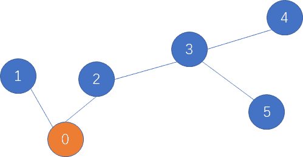

# 网易 2021 校招笔试-测试测开工程师（正式第一批）

## 1

请从用户体验的视角尽量多的列举 Android 与 iOS 系统的差异。

你的答案

本题知识点

测试开发工程师 测试工程师 网易 2021

讨论

[wjy990326](https://www.nowcoder.com/profile/961736597)

1.从流畅性的角度来说，IOS 更有优势，因为 Android 系统采用了虚拟机的的运行机制，这样的运行机制需要消耗更多的系统资源。Android 系统使用一段时间之后会出现卡顿的现象，而 IOS 几乎不会，并且 Android 系统的桌面滑动灵敏性    不然 IOS 系统。2.从省电的角度来说，如果相同容量的电池，Android 系统用的时间会更少，因为它比 IOS 会消耗更多资源。3.从后台执行程序的角度来说，IOS 系统基本不需要清理后台。IOS 有独特的任务管理机制，当程序不在前台运行时，除了 GPS，音频播放服务和 VOIP 服务以外，其他的应用都是会被系统挂起的，从技术上说，挂起并代表不执行，只是数据驻留在内存上而已。4.从系统更新的角度来说，如果 IOS 出了新版本，搭载其系统的苹果机都能及时进行升级。而 Android 出了新版本，普通用户是享受不到的，因为它不能自动更新到新版本。5.从安全的角度来说，IOS 系统更安全。6.从桌面界面来说，IOS 的界面毕竟经典和单一，Android 界面可以根据用户自己的喜好更改。7.从价格方面来说，IOS 是苹果公司的专利，价格相对来说毕竟高昂，Android 是谷歌公司的，但是是免费开源的，许多公司都有各自特色的 API，产品种类更多，价格相对来说比较低，性价比高。

发表于 2021-03-20 10:20:04

* * *

[许愿 offer 多多呀](https://www.nowcoder.com/profile/324508814)

1.从流畅性的角度来说，IOS 更有优势，因为 Android 系统采用了虚拟机的的运行机制，这样的运行机制需要消耗更多的系统资源。Android 系统使用一段时间之后会出现卡顿的现象，而 IOS 几乎不会，并且 Android 系统的桌面滑动灵敏性    不然 IOS 系统。2.从省电的角度来说，如果相同容量的电池，Android 系统用的时间会更少，因为它比 IOS 会消耗更多资源。3.从后台执行程序的角度来说，IOS 系统基本不需要清理后台。IOS 有独特的任务管理机制，当程序不在前台运行时，除了 GPS，音频播放服务和 VOIP 服务以外，其他的应用都是会被系统挂起的，从技术上说，挂起并代表不执行，只是数据驻留在内存上而已。4.从系统更新的角度来说，如果 IOS 出了新版本，搭载其系统的苹果机都能及时进行升级。而 Android 出了新版本，普通用户是享受不到的，因为它不能自动更新到新版本。5.从安全的角度来说，IOS 系统更安全。6.从桌面界面来说，IOS 的界面毕竟经典和单一，Android 界面可以根据用户自己的喜好更改。7.从价格方面来说，IOS 是苹果公司的专利，价格相对来说毕竟高昂，Android 是谷歌公司的，但是是免费开源的，许多公司都有各自特色的 API，产品种类更多，价格相对来说比较低，性价比高。

发表于 2020-12-31 15:43:29

* * *

## 2

请设计稳定且低成本的全自动化方案，将一本纸质书籍存储为电子版 txt 格式。

你的答案

本题知识点

测试开发工程师 测试工程师 网易 2021

讨论

[wjy990326](https://www.nowcoder.com/profile/961736597)

1。去除书钉、书胶、绑书绳等无关材料，将纸质书籍拆解成一页页，以便于下一步扫描；2。将上一步处理过的散装书籍放入扫描机，扫描机自动化扫描每一页，并将图片传到电脑，当扫描机监测所有页面已完成扫描，发送 FIN 信息给电脑；3。电脑接收到图片，自动 OCR 文本转换，并将文本存储为 txt 格式。当电脑接收到扫描机的 FIN 信息，将 txt 保存。

发表于 2021-03-20 10:20:56

* * *

[海贼豆](https://www.nowcoder.com/profile/8362499)

1。去除书钉、书胶、绑书绳等无关材料，将纸质书籍拆解成一页页，以便于下一步扫描；2。将上一步处理过的散装书籍放入扫描机，扫描机自动化扫描每一页，并将图片传到电脑，当扫描机监测所有页面已完成扫描，发送 FIN 信息给电脑；3。电脑接收到图片，自动 OCR 文本转换，并将文本存储为 txt 格式。当电脑接收到扫描机的 FIN 信息，将 txt 保存。

发表于 2021-01-03 21:50:09

* * *

## 3

机器学习问题中，经常有很多抽取的特征，而特征之间往往可以通过组合，得到更抽象有用的特征。比如性别特征-(男，女)，和职业特征（程序员，美工，策划），可以交叉出（男-程序员，男-美工，男-策划，女-程序员，女-美工，女-策划），更抽象的特征可以表达出一些复合的语义和对数据的刻画，往往在模型中会获得意想不到的作用。本题需要你也开发一个类似的功能，将输入的各种特征进行自动的排列组合。

本题知识点

算法工程师 网易 2021 C++工程师 测试开发工程师 测试工程师

讨论

[捞一下吧](https://www.nowcoder.com/profile/5465511)

```cpp
#include <iostream>
using namespace std;
#include <vector>
#include <string>
#include <map>
#include <boost/algorithm/string.hpp>

vector<string>Split(const string&s,const string c)
{
    vector<string>res;
    int pos1=0,pos2=s.find_first_of(c);
    while(pos2!=string::npos)
    {
        if(pos2!=pos1)
            res.push_back(s.substr(pos1,pos2-pos1));
        pos1=pos2+1;
        pos2=s.find_first_of(c,pos1);
    }
    if(pos1!=s.size()){
        res.push_back(s.substr(pos1));
    }
    return res;
}
void zuhe(vector<string>&res,map<int,vector<string>> mp,string cur,int index){
    if(index<0)
    {
        res.push_back(cur);
        return;
    }
    for(int i=0;i<mp[index].size();i++)
    {
        string t=cur;
        cur=mp[index][i]+cur;
        if(index>0)
            cur='-'+cur;
        zuhe(res,mp,cur,index-1);
        cur=t;
    }
}

int main()
{
    int N;
    cin>>N;

    map<int,vector<string>> mp;
    string line;
    int i=0;
    string t;
    cin.ignore();
   for(int i=0;i<N;i++)
    {
       getline(cin,line);
       mp[i]=Split(line," ");

    }

    vector<string>res;

    string cur;
    zuhe(res,mp,cur,mp.size()-1);

    for(auto &x:res)
        cout<<x<<endl;

}
```

发表于 2021-04-10 11:59:02

* * *

[媚笑呀](https://www.nowcoder.com/profile/79694651)

```cpp
#include<bits/stdc++.h>
using namespace std;
void bfs(vector<vector<string>> &data,int pos,vector<string> &ans,string tmp){
    if(pos == -1){
        int t = tmp.size();
        tmp = tmp.substr(0,t-1);
        ans.push_back(tmp);
        return;
    }
    for(int i=0;i<data[pos].size();i++){
        bfs(data,pos-1,ans,data[pos][i]+"-"+tmp);
    }
}
int main(){
    int n;
    cin>>n;
    cin.ignore();
    vector<vector<string>> data(n);
    for(int i=0;i<n;i++){
        string s1,tmp;
        getline(cin,s1);
        stringstream ss(s1);
        while(ss>>tmp){
            data[i].push_back(tmp);
        }
    }
    vector<string> ans;
    bfs(data,n-1,ans,"");
    for(string &s:ans)
        cout<<s<<endl;
    system("pause");
    return 0;
}

```

由于是 BFS 的顺序，所以倒序 DFS。

发表于 2021-03-29 21:21:00

* * *

[牛客 706601682 号](https://www.nowcoder.com/profile/706601682)

```cpp
#include<iostream>
#include<string>
#include<vector>

using namespace std;

int main(){
    int n, amount = 1;
    cin>>n;
    vector> helper(n);
    for(int i = 0; i < n; ++i){
        string str;
        char c;
        int count = 0;
        while((cin>>str).get(c)){
            ++count;
            helper[i].push_back(str);
            if(c == '\n')
                break;
        }
        amount *= count;
    }
    vector ans(amount);
    for(int index = 0; index < amount; ++index){
        int prod = 1;
        for(int i = 0; i < n; ++i){
            int sz = helper[i].size();
            ans[index] += helper[i][index / prod % sz];
            ans[index] += '-';
            prod *= sz;
        }
    }
    for(int i = 0; i < amount; ++i){
        string str = ans[i];
        str.erase(str.size() - 1);
        cout<<str<<endl;
    }
    return 0;
}
```

编辑于 2021-02-28 19:20:27

* * *

## 4

在自然语言处理的过程中，经常需要判断一个字符串和另外一个字符串之间的一个相似程度，其中常见的一个指标就是编辑距离，即一个字符串最少经过多少次“增删改”某个字符，可以变为另一个字符串。如“abc”与“ac”的编辑距离为 1，是因为在 a 和 c 中间“增加”一个 b 即可。如“abcd”与“axc”的编辑距离为 2，是因为把“abcd”的 b 修改为 x，然后再删除 d 即可，共 2 次操作。但是在某种场景中，编辑距离定义为词粒度的。比如句子 A “I am a coder”与句子 B “hello ,  I am a singer”之间，对于句子 A 可以通过添加"hello"和符号",",  并替换"coder"为"singer"，共 3 个操作得到句子 B。所以可得其基本的编辑距离为 3。在本题中，特别地，对于部分词，比如标点符号“, ”、"hello"对于句子语义的影响并不重要，这部分称之为停用词，这部分可以在匹配的过程中被跳过。比如对于句子 A “I am a coder”与句子 B “hello ,  I am a singer”，如果加入了停用词的影响，那编辑距离从 3 降到 1。所以目标是可以有选择性地跳过停用词的情况下，问最小的编辑距离是多少。

本题知识点

算法工程师 网易 2021 C++工程师 Java 工程师 测试开发工程师 测试工程师 大数据开发工程师 安卓工程师 iOS 工程师 安全工程师

讨论

[零葬](https://www.nowcoder.com/profile/75718849)

1.先将句子中的停用词去除掉；2.然后按空格将句子划分为词的粒度；3.最后用常规的动态规划方法计算编辑距离即可。

```cpp
stop_words = input().split()
sentence1 = input()
sentence2 = input()
# 先将句子中的停用词去除
for word in stop_words:
    sentence1 = sentence1.replace(word, "")
    sentence2 = sentence2.replace(word, "")
s1 = sentence1.split()
s2 = sentence2.split()
# 计算句子中的单词数
word_num1 = len(s1)
word_num2 = len(s2)
# 动态规划计算编辑距离
dp = [[0] * (word_num2 + 1) for _ in range(word_num1 + 1)]
for i in range(word_num1 + 1):
    for j in range(word_num2 + 1):
        if i == 0 and j == 0:
            dp[i][j] = 0
        elif i == 0 and j > 0:
            dp[0][j] = j
        elif i > 0 and j == 0:
            dp[i][0] = i
        elif s1[i - 1] == s2[j - 1]:
            dp[i][j] = min(dp[i - 1][j - 1], dp[i][j - 1] + 1, dp[i - 1][j] + 1)
        else:
            dp[i][j] = min(dp[i - 1][j - 1] + 1, dp[i][j - 1] + 1, dp[i - 1][j] + 1)
print(dp[word_num1][word_num2])
```

编辑于 2021-01-18 14:34:56

* * *

[talkking](https://www.nowcoder.com/profile/812488803)

//dp 求编辑裸题#include<bits/stdc++.h>using namespace std;
int dp[1001][1001];
vector<string>d,a,b,anew,bnew;
unordered_map<string,int>mp;
int levenshtein(vector<string> a ,vector<string> b)//编辑距离 O(n²)
{
    dp[0][0]=0;
    for(int i=1;i<=a.size();i++) dp[i][0]=i;
    for(int j=1;j<=b.size();j++) dp[0][j]=j;
    for(int i=1;i<=a.size();i++)
        for(int j=1;j<=b.size();j++){
           dp[i][j]=min(dp[i-1][j]+1,dp[i][j-1]+1);
           if(a[i-1]!=b[j-1]) dp[i][j]=min(dp[i][j],dp[i-1][j-1]+1);
           else dp[i][j]=min(dp[i][j],dp[i-1][j-1]);
        }
    return dp[a.size()][b.size()];
}
int main()
{
    ios::sync_with_stdio(false);
    cin.tie(0),cout.tie(0);
    string disableword,s1,s2;
    getline(cin,disableword);
    stringstream ss;
    ss<<disableword;
    while(ss>>disableword){
        d.emplace_back(disableword);
    }
    getline(cin,s1);
    ss.clear();
    ss.str("");
    ss<<s1;
    while(ss>>s1){
        a.emplace_back(s1);
    }
    getline(cin,s2);
    ss.clear();
    ss.str("");
    ss<<s2;
    while(ss>>s2){
        b.emplace_back(s2);
    }
    for(int i=0;i<d.size();i++)
        mp[d[i]]=1;
    for(int i=0;i<a.size();i++)
        if(!mp[a[i]])
           anew.emplace_back(a[i]);
    for(int i=0;i<b.size();i++)
        if(!mp[b[i]])
           bnew.emplace_back(b[i]);
    cout<<levenshtein(anew,bnew)<<endl;
    return 0;
}

发表于 2021-01-10 11:21:25

* * *

## 5

严选的快递员每天需要送很多个包裹，在货物装车后，需要开着电动车先到 0 号用户家。送完货后从 0 号出发，再送到 1 号用户。然后快递员可以从 1 号直接到 2 号用户家，完成送货。但有时候由于路不通的原因，需要先折返回 0 号，再去 2 号，如此循环，完成送货。
由于路况复杂，每个用户家只有一条路通往附近的其他一户邻居家，假设每条通路都是 1 公里。另外快递员的电动车的电是有限的，最多只能开有限的 k 公里。现在快递员已经在 0 号用户家送完快递，问快递员最多可以送多少个不重复的用户

本题知识点

算法工程师 网易 2021 Java 工程师 测试开发工程师 测试工程师 大数据开发工程师 数据库工程师 运维工程师

讨论

[Wonder2021](https://www.nowcoder.com/profile/958589703)

```cpp
import java.util.Scanner;

public class Main {
    public static void main(String[] args) {
        Scanner s = new Scanner(System.in);
        String[] nk = s.nextLine().split(" ");
        String[] link = s.nextLine().split(" ");
        s.close();
        int k = Integer.parseInt(nk[1]);
        int dpt = dpt(link);
        if (dpt >= k) {
            System.out.println(k + 1);
        } else {
            System.out.println(Math.min(link.length + 1, dpt + 1 + (k - dpt) / 2));
        }
    }

    public static int dpt(String[] link) {
        Node[] nodes = new Node[link.length + 1];
        nodes[0] = new Node(0);
        int ind = 0;
        for (String parrent : link) {
            Node pn = nodes[Integer.parseInt(parrent)];
            nodes[++ind] = new Node(pn.dpt + 1);
        }
        ind = 0;
        for (Node node : nodes) {
            ind = Math.max(ind, node.dpt);
        }
        return ind;
    }
}

class Node {
    public int dpt = 1;

    public Node(int dpt) {
        this.dpt = dpt;
    }
}
```

发表于 2021-08-21 09:19:07

* * *

[丶小二上酒](https://www.nowcoder.com/profile/924283833)

```cpp
import java.util.*;

public class Main {
    public static void main(String[] args) {
        Scanner sc = new Scanner(System.in);
        String[] str = sc.nextLine().split(" ");
        int n = Integer.parseInt(str[0]);
        int k = Integer.parseInt(str[1]);
        String[] num = sc.nextLine().split(" ");
        int[] s = new int[num.length];
        for (int i = 0; i < num.length; i++) {
            s[i] = Integer.parseInt(num[i]);
        }
        boolean[][] dp = new boolean[n][n];
        for (int i = 1; i < n; i++) {
            dp[s[i-1]][i] = true;
            dp[i][s[i-1]] = true;
        }
        int depth = depthOfTree(dp);
        if (k < depth) {
            System.out.println(k + 1);
        }else {
            int res = Math.min(n,depth + (k - depth + 1) / 2);
            System.out.println(res);
        }
    }

    /*
    利用树的邻接表的层次遍历求出树的深度
     */
    public static int depthOfTree(boolean[][] adjacentMatrix) {
        LinkedList<Integer> queue = new LinkedList<>();
        int nodeNumber = adjacentMatrix.length;
        boolean[] visited = new boolean[nodeNumber];
        int depth = 0;
        queue.add(0);
        visited[0] = true;
        int layerNodes = 1;
        int nextLayerNodes = 0;
        while (queue.size() != 0) {
            while (layerNodes-- > 0) {
                int curNode = queue.poll();
                for (int i = 1; i < nodeNumber; i++) {
                    if (adjacentMatrix[curNode][i] && !visited[i]) {
                        nextLayerNodes ++;
                        visited[i] = true;
                        queue.add(i);
                    }
                }
            }
            layerNodes = nextLayerNodes;
            nextLayerNodes = 0;
            depth++;
        }
        return depth;
    }
}

```

发表于 2021-07-30 16:58:09

* * *

[牛客 68604898 号](https://www.nowcoder.com/profile/68604898)

```cpp
#include<bits/stdc++.h>
#include<stack>
#include<vector>
#include<unordered_set>

using std::endl;
typedef std::vector< std::vector<int> > ErweiMatrix;
typedef std::unordered_set<int> Hashset;

int FanHuiXiaoBiao(std::vector<int> ShuZu, int Zhi) {
    int XiaoBiao = -1;
    for (int counter_1 = 0;counter_1 < ShuZu.size();counter_1++) {
        if (ShuZu[counter_1] == Zhi) {
            XiaoBiao = counter_1;
            break;

        }

    }
    return XiaoBiao;

}

bool ISLianJie(int Node_1, int Node_2, ErweiMatrix NodeArray) {
    for (int nextNodes : NodeArray[Node_1]) {
        if (nextNodes == Node_2) {
            return true;
            break;
        }

    }

    return false;

}

int GetMaxIndex_XianZhi(std::vector<int> ShuZu, int XianZhi) {

    int GetMaxValue = 0;
    for (int counter_1 = 0;counter_1 < ShuZu.size();counter_1++) {
        if ((ShuZu[counter_1] > 0) && ((XianZhi - 2 * ShuZu[counter_1]) >= 0)) {

            GetMaxValue = ShuZu[counter_1] > GetMaxValue ? ShuZu[counter_1] : GetMaxValue;

        }

    }
    return FanHuiXiaoBiao(ShuZu, GetMaxValue);

}

int main() {

    std::ios_base::sync_with_stdio(false);
    std::cin.tie(0);
    std::cout.tie(0);

    int DianShu = 0;
    int MP = 0;

    std::cin >> DianShu >> MP;
    std::vector<int> input(DianShu - 1);
    for (int counter_1 = 0;counter_1 < DianShu - 1;counter_1++) {
        std::cin >> input[counter_1];

    }
    ErweiMatrix NodeArray(DianShu);
    for (int counter_1 = 0;counter_1 < DianShu - 1;counter_1++) {
        NodeArray[input[counter_1]].push_back(counter_1 + 1);
        NodeArray[counter_1 + 1].push_back(input[counter_1]);

    }
    std::vector<int> DaYing(DianShu);
    Hashset ChaChong;
    std::stack<int> Mystack;
    Mystack.push(0);

    ChaChong.insert(0);
    DaYing[0] = 0;
    int DaYingIndex = 1;
    std::vector<int> WhoLongest(DianShu, -1);
    WhoLongest[0] = 0;

    while (!Mystack.empty()) {
        int Cur = Mystack.top();
        if (NodeArray[Cur].size() == 1) WhoLongest[Cur] = Mystack.size();
        Mystack.pop();
        for (int NextNodes : NodeArray[Cur]) {
            if (ChaChong.count(NextNodes) == 0) {
                Mystack.push(Cur);
                Mystack.push(NextNodes);
                DaYing[DaYingIndex] = NextNodes;
                DaYingIndex++;
                ChaChong.insert(NextNodes);
                break;

            }

        }

    }

    int GetLongest = 0;
    for (int counter_1 = 0;counter_1 < DianShu;counter_1++) {
        GetLongest = WhoLongest[counter_1] > GetLongest ? WhoLongest[counter_1] : GetLongest;

    }
    int GetLongestNode = FanHuiXiaoBiao(WhoLongest, GetLongest);//具体节点号
    GetLongestNode = FanHuiXiaoBiao(DaYing, GetLongestNode);

    std::stack<int> fuzhu_CurLuJin;
    int ChuShiIndex = GetLongestNode;
    fuzhu_CurLuJin.push(ChuShiIndex);
    for (int counter_1 = ChuShiIndex - 1;counter_1 >= 0;counter_1--) {
        int DangQianNode = fuzhu_CurLuJin.top();//是下标
        if (ISLianJie(DaYing[DangQianNode], DaYing[counter_1], NodeArray)) {

            fuzhu_CurLuJin.push(counter_1);

        }

    }
    std::vector<int> DpValue(DianShu, -1);

    while (!fuzhu_CurLuJin.empty()) {

        DpValue[fuzhu_CurLuJin.top()] = 0;
        fuzhu_CurLuJin.pop();

    }

    for (int counter_1 = 0;counter_1 < DianShu;counter_1++) {
        if (DpValue[counter_1] != 0) {
            for (int counter_2 = counter_1 - 1;counter_2 >= 0;counter_2--) {

                if (ISLianJie(DaYing[counter_2], DaYing[counter_1], NodeArray)) {
                    DpValue[counter_1] = DpValue[counter_2] + 1;
                    break;
                }

            }

        }

    }
    int TongJi = 0;
    for (int counter_1 = 0;counter_1 < DianShu;counter_1++) {
        if (DpValue[counter_1] == 0) TongJi++;

    }

    MP -= (TongJi - 1);

    if (MP <= 1 && MP >= 0) {
        std::cout << TongJi;
        return 0;
    }

    if (MP < 0) {
        std::cout << MP + TongJi;
        return 0;

    }

    std::stack<int> HelpMeChange;
    while (MP > 1) {

        int Cur_Change = GetMaxIndex_XianZhi(DpValue, MP);

        if (Cur_Change == 0) break;
        if (DpValue[Cur_Change] == 0) break;
        MP -= DpValue[Cur_Change] * 2;

        DpValue[Cur_Change] = 0;
        HelpMeChange.push(DaYing[Cur_Change]);
        for (int counter_1 = Cur_Change - 1;counter_1 >= 0;counter_1--) {
            if (DpValue[counter_1] != 0 && ISLianJie(DaYing[counter_1], HelpMeChange.top(), NodeArray)) {
                DpValue[counter_1] = 0;
                HelpMeChange.pop();
                HelpMeChange.push(DaYing[counter_1]);

            }

        }
        HelpMeChange.pop();

        for (int counter_1 = 0;counter_1 < DianShu;counter_1++) {
        if (DpValue[counter_1] != 0) {
            for (int counter_2 = counter_1 - 1;counter_2 >= 0;counter_2--) {

                if (ISLianJie(DaYing[counter_2], DaYing[counter_1], NodeArray)) {
                    DpValue[counter_1] = DpValue[counter_2] + 1;
                    break;
                }

            }

        }

      }

    }
    int counterZeros = 0;
    for (int counter_1 = 0;counter_1 < DianShu;counter_1++) {
        if (DpValue[counter_1] == 0) counterZeros++;

    }
    std::cout << counterZeros;

    return 0;
}
```

发表于 2021-03-21 09:59:26

* * *

## 6

给定一个字符串 s，问该字符串里有多少个长度大于 1 的连续子串都是回文？回文：正序的文本内容与倒序的文本内容相同，比如 aa，aba

本题知识点

安卓工程师 iOS 工程师 网易 2021 Java 工程师 C++工程师 测试开发工程师 测试工程师 前端工程师 算法工程师 运维工程师 安全工程师 游戏研发工程师

讨论

[零葬](https://www.nowcoder.com/profile/75718849)

外层固定右边界，改变左边界，内层固定左边界，改变右边界，对所有子串进行回文检验

```cpp
import java.io.BufferedReader;
import java.io.InputStreamReader;
import java.io.IOException;
import java.util.HashMap;

public class Main {
    public static void main(String[] args) throws IOException {
        BufferedReader br = new BufferedReader(new InputStreamReader(System.in));
        String str = br.readLine();
        int count = 0;
        for(int i = 0; i < str.length(); i++){
            // 固定右边界
            int left = i, right = str.length() - 1;
            while(left < right){
                // 固定左边界
                int temp_l = left, temp_r = right;
                // 检查 str[temp_l:temp_r]是否是回文串
                while(temp_l < temp_r){
                    if(str.charAt(temp_l) != str.charAt(temp_r))
                        break;        // 以 temp_l 开头 temp_r 结尾的子串不是回文串
                    temp_l++;
                    temp_r--;
                }
                // 如果右边界到左边界的左边了，说明此时抓出来一个回文串
                if(temp_l >= temp_r) count ++;
                right --;
            }
        }
        System.out.println(count);
    }
}
```

发表于 2021-01-18 21:00:21

* * *

[寒冰-侠客](https://www.nowcoder.com/profile/442275737)

仅从数据层面看，O(N²)的算法应无法通过，但实际上数据不强，平方级仍可通过。此处介绍一种字符串哈希结合二分的方法，复杂度 O(N*logN)。其实此方法的基础是求字符串最长回文子串。（1）对字符串正反两向做哈希处理（2）回文串长度有奇数和偶数两种，求以 pos 为中心的最长回文子串和以（pos，pos+1）为中心的最长回文子串。例如以 pos 为中心最长回文子串长度为 2x+1，那么可以得到 x 个长度超过 2 的回文子串，例如子串 bbabb，那么 bab，bbabb 为解。（3）求 pos 为中心的最长回文子串可以用二分法来降低复杂度。

```cpp
#include <bits/stdc++.h>
typedef long long ll;
using namespace std;
string s;
ll n,p=131,hx[100005]={1},hx2[100005],pw[100005]={1},ans=0;
int check1(ll pos)/**< 求以 pos 为中点的回文串最大长度 */
{
    int l=0,r=min(pos-1,n-pos),mid,best=0;
    while(l<=r)
    {
        mid=(l+r)>>1;/**< 左半段 p-mid~p，右半段 p~p+mid */
        if(hx[pos-1]-hx[pos-mid-1]*pw[mid]==hx2[pos+1]-hx2[pos+mid+1]*pw[mid])
          l=mid+1,best=mid;
        else
            r=mid-1;
    }
    return best;
}
int check2(ll pos)/**< 求以 pos 和 pos+1 为中点的回文串最大长度 */
{
    if(pos==n||s[pos-1]!=s[pos])
        return 0;
    int l=1,r=min(pos,n-pos),mid,best=1;
    while(l<=r)
    {
        mid=(l+r)/2;/**< 左半段 p-mid+1~p 开始，右半段 p+1~p+1+mid */
        if(hx[pos]-hx[pos-mid]*pw[mid]==hx2[pos+1]-hx2[pos+1+mid]*pw[mid])
          l=mid+1,best=mid;
        else
            r=mid-1;
    }
    return best;
}
int main()
{

    int i,j;
    cin>>s;
    n=s.size();
    for(i=1;i<=100000;i++)
        pw[i]=pw[i-1]*p;
    for(i=0;i<s.size();i++)
        hx[i+1]=hx[i]*p+s[i]-'a'+1;
    for(i=n-1;i>=0;i--)
        hx2[i+1]=hx2[i+2]*p+s[i]-'a'+1;
    for(i=1;i<=n;i++)
    {
        int len1=check1(i),len2=check2(i);
        ans+=len1+len2;
    }
    cout<<ans;
    return 0;
}

```

发表于 2022-01-14 12:15:05

* * *

[maoxiaomao](https://www.nowcoder.com/profile/230303195)

```cpp
#牛客 405350751 号的 python 实现
s=input()
count=0
for i in range(len(s)):
    k=i-1
    r=i+1
    while(k>=0 and r<=len(s)-1 and s[k]==s[r]):   #以当前字符为对称轴向左右扩展
        count=count+1
        k=k-1
        r=r+1
    k=i
    r=i+1
    while(k>=0 and r<=len(s)-1 and s[k]==s[r]):  #以两个字符的中间对称轴
        count=count+1
        k=k-1
        r=r+1
print(count)

```

发表于 2021-05-17 18:36:38

* * *