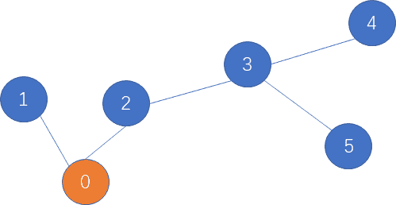

# 网易 2021 校招笔试-大数据开发工程师（正式第一批）

## 1

歌曲播放事实表名是 dim_song_detail

你的答案

本题知识点

大数据开发工程师 网易 2021

讨论

[Deamer_he](https://www.nowcoder.com/profile/276737494)

问题一：

// ①找出 2020 年 8 月份的歌曲
SELECT * FROM dim_song_detail
WHERE DATE_FORMAT(dt, '%Y-%m') = '2020-08';

// ②找出被播放次数最多的 top10 歌曲并按新字段 rank 排序
SELECT *, RANK() OVER(ORDER BY t.play_cnt DESC) AS rank
FROM (
    SELECT song_id, COUNT(play_cnt) AS play_cnt
    FROM dim_song_detail
    GROUP BY song_id ) AS t
LIMIT 10;

// ③结合①②找出 2020 年 8 月份被播放次数最多的 top10 歌曲并按新字段 rank 排序
SELECT *, RANK() OVER(ORDER BY t.play_cnt DESC) AS rank
FROM (
    SELECT song_id, COUNT(play_cnt) AS play_cnt
    FROM 
        (SELECT * FROM dim_song_detail
        WHERE DATE_FORMAT(dt, '%Y-%m') = '2020-08')
        GROUP BY song_id 
) AS t
LIMIT 10;

// 最后结合③找出 2020 年 8 月份被播放次数最多的 top10 歌手
SELECT a.artist_id, b.play_cnt, b.rank
FROM dim_song_meta AS a
JOIN (
            SELECT *, RANK() OVER(ORDER BY t.play_cnt DESC) AS rank
            FROM (
                SELECT song_id, COUNT(play_cnt) AS play_cnt
                FROM 
                    (SELECT * FROM dim_song_detail
                    WHERE DATE_FORMAT(dt, '%Y-%m') = '2020-08')
                    GROUP BY song_id 
            ) AS t
            LIMIT 10
) AS b 
ON a.song_id = b.song_id;

发表于 2021-03-12 21:10:46

* * *

[找工作的小牛牛](https://www.nowcoder.com/profile/555263926)

select a.artist_id,play_cnt,
rank()  over(order by play_cnt desc) as rankfrom(select a.artist_id,sum(play_cnt) as play_cnt from dim_song_meta aleft join dim_song_detail bon a.song_id=b.song_idwhere subString(dt)='2020-8'groupby a.artist_id)cwhere rank<=10;select style_id,song_id,song_name,rank() over(partition by style,song_id,song_name order by play_cnt desc) as rankfrom(select a.style,a.song_id,a.song_name,sum(b.play_cnt) as play_cntfrom dim_song_meta aleft join dim_song_detail bon a.song_id=b.song_idgroupby a.style,a.song_id,a,song_name)cwhere rank<=10;

发表于 2021-04-05 16:30:04

* * *

[JacksonWangFighting](https://www.nowcoder.com/profile/674094590)

问题一：select a.artist_id, b.play_cntfrom dim_song_meta aleft join  dim_song_detailon a.song_id = b.song_idwhere b.dt between 2020-8-01 and 2020-8-31order by b.play_cnt desclimit 10;问题二：select a.artist_id, a.song_id,a.song_name,b.play_cntfrom dim_song_meta aleft join  dim_song_detailon a.song_id = b.song_idgroup by a.styleorder by b.play_cnt desclimit 10;

发表于 2021-03-08 06:55:05

* * *

## 2

给定一个字符串，请返回满足以下条件的最长字符串的长度：“a”、"b"、“c”、“x”、"y"、“z”在字符串中都恰好出现了偶数次（0 也是偶数）

本题知识点

算法工程师 网易 2021 Java 工程师 大数据开发工程师 游戏研发工程师 前端工程师 安卓工程师 iOS 工程师 运维工程师

讨论

[alaa](https://www.nowcoder.com/profile/293830529)

leetcode 1371.状态压缩＋哈希表。

```cpp
import java.util.*;
public class Main{
    public static void main(String[] args) {
        // write your code here
        Scanner scanner = new Scanner(System.in);
        String next = scanner.next();
        System.out.println(findTheLongestSubstring(next));

    }

    private static int findTheLongestSubstring(String s) {
        Map<Integer, Integer> map = new HashMap<>();

        int state = 0;
        int maxlen = 0;

        // 初始化
        map.put(0, -1);

        // a b c x y z 分别在第 123456 个 bit，来表示出现次数的奇偶性
        for (int i = 0; i < s.length(); i++) {
            if (s.charAt(i) == 'a') state ^= 0x000001;
            if (s.charAt(i) == 'b') state ^= 0x000010;
            if (s.charAt(i) == 'c') state ^= 0x000100;
            if (s.charAt(i) == 'x') state ^= 0x001000;
            if (s.charAt(i) == 'y') state ^= 0x010000;
            if (s.charAt(i) == 'z') state ^= 0x100000;
            if (map.containsKey(state)) {
                maxlen = Math.max(maxlen, i - map.get(state));
            } else {
                map.put(state, i);
            }
        }
        return maxlen;
    }
}
```

编辑于 2021-01-04 14:17:36

* * *

[雨尘 ovo](https://www.nowcoder.com/profile/170989909)

```cpp
//位运算+dp
import java.util.Scanner;

public class Main{
    public static void main(String[] args){
        Scanner cin=new Scanner(System.in);
        while(cin.hasNext()){
            String str=cin.nextLine();
            int[] dp=new int[str.length()];
            dp[0]=judge(str.charAt(0));
            for(int i=1;i<str.length();++i){
                int temp=judge(str.charAt(i));
                if(temp==0)
                    dp[i]=dp[i-1];
                else
                    dp[i]=dp[i-1]^temp;
            }
            int ans=0;
            for(int i=0;i<str.length();++i){
                for(int j=i;j<str.length();++j){
                    if((dp[j]^dp[j-i]^judge(str.charAt(j-i)))==0){
                        ans=i+1;
                        break;
                    }
                }
            }
            System.out.println(ans);
        }
    }

    public static int judge(char cr){
        if(cr=='a')
            return 1;
        if(cr=='b')
            return 2;
        if(cr=='c')
            return 4;
        if(cr=='x')
            return 8;
        if(cr=='y')
            return 16;
        if(cr=='z')
            return 32;
        return 0;
    }
}

```

发表于 2022-03-15 18:07:03

* * *

[皮克斯儿](https://www.nowcoder.com/profile/71048863)

以下是 js 的，思路不对，输入 let at = "ooooooaobobobo"的时候结果不对，也跑过了 70%，我再好好好想想这个思路
while(line=readline()){
    let at=line
let zimu = 
["a", "b", "c", "x", "y", "z"]
let a1 = at.split("")
function jie(a, b) {
  let a1 = a.split("")
  let shu = 0
  a1.forEach(item => {
    // console.log(item);
    if(item == b) {
      shu++
    }
  })
  // console.log(shu);
  // 如果出现了单数次
  // console.log(shu, b);
  if(shu % 2 == 1) {
    let d1 = a.indexOf(b)
    let d9 = a.lastIndexOf(b)
    if(d1 >= a.length - 1 - d9) {
      let cun = a.slice(0, d9)
      at = cun
      // console.log(at);
      return cun
    } else{
      let cun = a.slice(d1 + 1)
      at = cun
      // console.log(at);
      return cun
    }
    // console.log(d1,d9);
  } else{
    return a
  }

}
// jie("amabchhchhahh","a")
// console.log(jie(a1,"a"));
while(1) {
  let o = 
[]
  let oo
  // o 存入这时的 at

  at.split("").forEach(item => {
    o.push(item)
  })
  for(let i = 0; i < zimu.length; i++) {

    // console.log(at,zimu[i]);
    oo = jie(at, zimu
[i])   //oo 是操作完了之后的 a1 字符串
    // console.log(oo);

  }
  if(oo.length == o.length) {
    // kk = 1
    // console.log(oo,oo.length," kk=1");
    break
  }
}
console.log(at.length);
}

发表于 2022-01-17 19:47:56

* * *

## 3

在自然语言处理的过程中，经常需要判断一个字符串和另外一个字符串之间的一个相似程度，其中常见的一个指标就是编辑距离，即一个字符串最少经过多少次“增删改”某个字符，可以变为另一个字符串。如“abc”与“ac”的编辑距离为 1，是因为在 a 和 c 中间“增加”一个 b 即可。如“abcd”与“axc”的编辑距离为 2，是因为把“abcd”的 b 修改为 x，然后再删除 d 即可，共 2 次操作。但是在某种场景中，编辑距离定义为词粒度的。比如句子 A “I am a coder”与句子 B “hello ,  I am a singer”之间，对于句子 A 可以通过添加"hello"和符号",",  并替换"coder"为"singer"，共 3 个操作得到句子 B。所以可得其基本的编辑距离为 3。在本题中，特别地，对于部分词，比如标点符号“, ”、"hello"对于句子语义的影响并不重要，这部分称之为停用词，这部分可以在匹配的过程中被跳过。比如对于句子 A “I am a coder”与句子 B “hello ,  I am a singer”，如果加入了停用词的影响，那编辑距离从 3 降到 1。所以目标是可以有选择性地跳过停用词的情况下，问最小的编辑距离是多少。

本题知识点

算法工程师 网易 2021 C++工程师 Java 工程师 测试开发工程师 测试工程师 大数据开发工程师 安卓工程师 iOS 工程师 安全工程师

讨论

[零葬](https://www.nowcoder.com/profile/75718849)

1.先将句子中的停用词去除掉；2.然后按空格将句子划分为词的粒度；3.最后用常规的动态规划方法计算编辑距离即可。

```cpp
stop_words = input().split()
sentence1 = input()
sentence2 = input()
# 先将句子中的停用词去除
for word in stop_words:
    sentence1 = sentence1.replace(word, "")
    sentence2 = sentence2.replace(word, "")
s1 = sentence1.split()
s2 = sentence2.split()
# 计算句子中的单词数
word_num1 = len(s1)
word_num2 = len(s2)
# 动态规划计算编辑距离
dp = [[0] * (word_num2 + 1) for _ in range(word_num1 + 1)]
for i in range(word_num1 + 1):
    for j in range(word_num2 + 1):
        if i == 0 and j == 0:
            dp[i][j] = 0
        elif i == 0 and j > 0:
            dp[0][j] = j
        elif i > 0 and j == 0:
            dp[i][0] = i
        elif s1[i - 1] == s2[j - 1]:
            dp[i][j] = min(dp[i - 1][j - 1], dp[i][j - 1] + 1, dp[i - 1][j] + 1)
        else:
            dp[i][j] = min(dp[i - 1][j - 1] + 1, dp[i][j - 1] + 1, dp[i - 1][j] + 1)
print(dp[word_num1][word_num2])
```

编辑于 2021-01-18 14:34:56

* * *

[talkking](https://www.nowcoder.com/profile/812488803)

//dp 求编辑裸题#include<bits/stdc++.h>using namespace std;
int dp[1001][1001];
vector<string>d,a,b,anew,bnew;
unordered_map<string,int>mp;
int levenshtein(vector<string> a ,vector<string> b)//编辑距离 O(n²)
{
    dp[0][0]=0;
    for(int i=1;i<=a.size();i++) dp[i][0]=i;
    for(int j=1;j<=b.size();j++) dp[0][j]=j;
    for(int i=1;i<=a.size();i++)
        for(int j=1;j<=b.size();j++){
           dp[i][j]=min(dp[i-1][j]+1,dp[i][j-1]+1);
           if(a[i-1]!=b[j-1]) dp[i][j]=min(dp[i][j],dp[i-1][j-1]+1);
           else dp[i][j]=min(dp[i][j],dp[i-1][j-1]);
        }
    return dp[a.size()][b.size()];
}
int main()
{
    ios::sync_with_stdio(false);
    cin.tie(0),cout.tie(0);
    string disableword,s1,s2;
    getline(cin,disableword);
    stringstream ss;
    ss<<disableword;
    while(ss>>disableword){
        d.emplace_back(disableword);
    }
    getline(cin,s1);
    ss.clear();
    ss.str("");
    ss<<s1;
    while(ss>>s1){
        a.emplace_back(s1);
    }
    getline(cin,s2);
    ss.clear();
    ss.str("");
    ss<<s2;
    while(ss>>s2){
        b.emplace_back(s2);
    }
    for(int i=0;i<d.size();i++)
        mp[d[i]]=1;
    for(int i=0;i<a.size();i++)
        if(!mp[a[i]])
           anew.emplace_back(a[i]);
    for(int i=0;i<b.size();i++)
        if(!mp[b[i]])
           bnew.emplace_back(b[i]);
    cout<<levenshtein(anew,bnew)<<endl;
    return 0;
}

发表于 2021-01-10 11:21:25

* * *

## 4

严选的快递员每天需要送很多个包裹，在货物装车后，需要开着电动车先到 0 号用户家。送完货后从 0 号出发，再送到 1 号用户。然后快递员可以从 1 号直接到 2 号用户家，完成送货。但有时候由于路不通的原因，需要先折返回 0 号，再去 2 号，如此循环，完成送货。
由于路况复杂，每个用户家只有一条路通往附近的其他一户邻居家，假设每条通路都是 1 公里。另外快递员的电动车的电是有限的，最多只能开有限的 k 公里。现在快递员已经在 0 号用户家送完快递，问快递员最多可以送多少个不重复的用户

本题知识点

算法工程师 网易 2021 Java 工程师 测试开发工程师 测试工程师 大数据开发工程师 数据库工程师 运维工程师

讨论

[Wonder2021](https://www.nowcoder.com/profile/958589703)

```cpp
import java.util.Scanner;

public class Main {
    public static void main(String[] args) {
        Scanner s = new Scanner(System.in);
        String[] nk = s.nextLine().split(" ");
        String[] link = s.nextLine().split(" ");
        s.close();
        int k = Integer.parseInt(nk[1]);
        int dpt = dpt(link);
        if (dpt >= k) {
            System.out.println(k + 1);
        } else {
            System.out.println(Math.min(link.length + 1, dpt + 1 + (k - dpt) / 2));
        }
    }

    public static int dpt(String[] link) {
        Node[] nodes = new Node[link.length + 1];
        nodes[0] = new Node(0);
        int ind = 0;
        for (String parrent : link) {
            Node pn = nodes[Integer.parseInt(parrent)];
            nodes[++ind] = new Node(pn.dpt + 1);
        }
        ind = 0;
        for (Node node : nodes) {
            ind = Math.max(ind, node.dpt);
        }
        return ind;
    }
}

class Node {
    public int dpt = 1;

    public Node(int dpt) {
        this.dpt = dpt;
    }
}
```

发表于 2021-08-21 09:19:07

* * *

[丶小二上酒](https://www.nowcoder.com/profile/924283833)

```cpp
import java.util.*;

public class Main {
    public static void main(String[] args) {
        Scanner sc = new Scanner(System.in);
        String[] str = sc.nextLine().split(" ");
        int n = Integer.parseInt(str[0]);
        int k = Integer.parseInt(str[1]);
        String[] num = sc.nextLine().split(" ");
        int[] s = new int[num.length];
        for (int i = 0; i < num.length; i++) {
            s[i] = Integer.parseInt(num[i]);
        }
        boolean[][] dp = new boolean[n][n];
        for (int i = 1; i < n; i++) {
            dp[s[i-1]][i] = true;
            dp[i][s[i-1]] = true;
        }
        int depth = depthOfTree(dp);
        if (k < depth) {
            System.out.println(k + 1);
        }else {
            int res = Math.min(n,depth + (k - depth + 1) / 2);
            System.out.println(res);
        }
    }

    /*
    利用树的邻接表的层次遍历求出树的深度
     */
    public static int depthOfTree(boolean[][] adjacentMatrix) {
        LinkedList<Integer> queue = new LinkedList<>();
        int nodeNumber = adjacentMatrix.length;
        boolean[] visited = new boolean[nodeNumber];
        int depth = 0;
        queue.add(0);
        visited[0] = true;
        int layerNodes = 1;
        int nextLayerNodes = 0;
        while (queue.size() != 0) {
            while (layerNodes-- > 0) {
                int curNode = queue.poll();
                for (int i = 1; i < nodeNumber; i++) {
                    if (adjacentMatrix[curNode][i] && !visited[i]) {
                        nextLayerNodes ++;
                        visited[i] = true;
                        queue.add(i);
                    }
                }
            }
            layerNodes = nextLayerNodes;
            nextLayerNodes = 0;
            depth++;
        }
        return depth;
    }
}

```

发表于 2021-07-30 16:58:09

* * *

[牛客 68604898 号](https://www.nowcoder.com/profile/68604898)

```cpp
#include<bits/stdc++.h>
#include<stack>
#include<vector>
#include<unordered_set>

using std::endl;
typedef std::vector< std::vector<int> > ErweiMatrix;
typedef std::unordered_set<int> Hashset;

int FanHuiXiaoBiao(std::vector<int> ShuZu, int Zhi) {
    int XiaoBiao = -1;
    for (int counter_1 = 0;counter_1 < ShuZu.size();counter_1++) {
        if (ShuZu[counter_1] == Zhi) {
            XiaoBiao = counter_1;
            break;

        }

    }
    return XiaoBiao;

}

bool ISLianJie(int Node_1, int Node_2, ErweiMatrix NodeArray) {
    for (int nextNodes : NodeArray[Node_1]) {
        if (nextNodes == Node_2) {
            return true;
            break;
        }

    }

    return false;

}

int GetMaxIndex_XianZhi(std::vector<int> ShuZu, int XianZhi) {

    int GetMaxValue = 0;
    for (int counter_1 = 0;counter_1 < ShuZu.size();counter_1++) {
        if ((ShuZu[counter_1] > 0) && ((XianZhi - 2 * ShuZu[counter_1]) >= 0)) {

            GetMaxValue = ShuZu[counter_1] > GetMaxValue ? ShuZu[counter_1] : GetMaxValue;

        }

    }
    return FanHuiXiaoBiao(ShuZu, GetMaxValue);

}

int main() {

    std::ios_base::sync_with_stdio(false);
    std::cin.tie(0);
    std::cout.tie(0);

    int DianShu = 0;
    int MP = 0;

    std::cin >> DianShu >> MP;
    std::vector<int> input(DianShu - 1);
    for (int counter_1 = 0;counter_1 < DianShu - 1;counter_1++) {
        std::cin >> input[counter_1];

    }
    ErweiMatrix NodeArray(DianShu);
    for (int counter_1 = 0;counter_1 < DianShu - 1;counter_1++) {
        NodeArray[input[counter_1]].push_back(counter_1 + 1);
        NodeArray[counter_1 + 1].push_back(input[counter_1]);

    }
    std::vector<int> DaYing(DianShu);
    Hashset ChaChong;
    std::stack<int> Mystack;
    Mystack.push(0);

    ChaChong.insert(0);
    DaYing[0] = 0;
    int DaYingIndex = 1;
    std::vector<int> WhoLongest(DianShu, -1);
    WhoLongest[0] = 0;

    while (!Mystack.empty()) {
        int Cur = Mystack.top();
        if (NodeArray[Cur].size() == 1) WhoLongest[Cur] = Mystack.size();
        Mystack.pop();
        for (int NextNodes : NodeArray[Cur]) {
            if (ChaChong.count(NextNodes) == 0) {
                Mystack.push(Cur);
                Mystack.push(NextNodes);
                DaYing[DaYingIndex] = NextNodes;
                DaYingIndex++;
                ChaChong.insert(NextNodes);
                break;

            }

        }

    }

    int GetLongest = 0;
    for (int counter_1 = 0;counter_1 < DianShu;counter_1++) {
        GetLongest = WhoLongest[counter_1] > GetLongest ? WhoLongest[counter_1] : GetLongest;

    }
    int GetLongestNode = FanHuiXiaoBiao(WhoLongest, GetLongest);//具体节点号
    GetLongestNode = FanHuiXiaoBiao(DaYing, GetLongestNode);

    std::stack<int> fuzhu_CurLuJin;
    int ChuShiIndex = GetLongestNode;
    fuzhu_CurLuJin.push(ChuShiIndex);
    for (int counter_1 = ChuShiIndex - 1;counter_1 >= 0;counter_1--) {
        int DangQianNode = fuzhu_CurLuJin.top();//是下标
        if (ISLianJie(DaYing[DangQianNode], DaYing[counter_1], NodeArray)) {

            fuzhu_CurLuJin.push(counter_1);

        }

    }
    std::vector<int> DpValue(DianShu, -1);

    while (!fuzhu_CurLuJin.empty()) {

        DpValue[fuzhu_CurLuJin.top()] = 0;
        fuzhu_CurLuJin.pop();

    }

    for (int counter_1 = 0;counter_1 < DianShu;counter_1++) {
        if (DpValue[counter_1] != 0) {
            for (int counter_2 = counter_1 - 1;counter_2 >= 0;counter_2--) {

                if (ISLianJie(DaYing[counter_2], DaYing[counter_1], NodeArray)) {
                    DpValue[counter_1] = DpValue[counter_2] + 1;
                    break;
                }

            }

        }

    }
    int TongJi = 0;
    for (int counter_1 = 0;counter_1 < DianShu;counter_1++) {
        if (DpValue[counter_1] == 0) TongJi++;

    }

    MP -= (TongJi - 1);

    if (MP <= 1 && MP >= 0) {
        std::cout << TongJi;
        return 0;
    }

    if (MP < 0) {
        std::cout << MP + TongJi;
        return 0;

    }

    std::stack<int> HelpMeChange;
    while (MP > 1) {

        int Cur_Change = GetMaxIndex_XianZhi(DpValue, MP);

        if (Cur_Change == 0) break;
        if (DpValue[Cur_Change] == 0) break;
        MP -= DpValue[Cur_Change] * 2;

        DpValue[Cur_Change] = 0;
        HelpMeChange.push(DaYing[Cur_Change]);
        for (int counter_1 = Cur_Change - 1;counter_1 >= 0;counter_1--) {
            if (DpValue[counter_1] != 0 && ISLianJie(DaYing[counter_1], HelpMeChange.top(), NodeArray)) {
                DpValue[counter_1] = 0;
                HelpMeChange.pop();
                HelpMeChange.push(DaYing[counter_1]);

            }

        }
        HelpMeChange.pop();

        for (int counter_1 = 0;counter_1 < DianShu;counter_1++) {
        if (DpValue[counter_1] != 0) {
            for (int counter_2 = counter_1 - 1;counter_2 >= 0;counter_2--) {

                if (ISLianJie(DaYing[counter_2], DaYing[counter_1], NodeArray)) {
                    DpValue[counter_1] = DpValue[counter_2] + 1;
                    break;
                }

            }

        }

      }

    }
    int counterZeros = 0;
    for (int counter_1 = 0;counter_1 < DianShu;counter_1++) {
        if (DpValue[counter_1] == 0) counterZeros++;

    }
    std::cout << counterZeros;

    return 0;
}
```

发表于 2021-03-21 09:59:26

* * *

## 5

小易的幸运数字是 7，现有一个整数数组 nums，请你找出并返回能被七整除的子集合的最大和，如果找不到则返回-1。

本题知识点

算法工程师 网易 2021 安卓工程师 iOS 工程师 C++工程师 大数据开发工程师 游戏研发工程师 前端工程师

讨论

[人海追风](https://www.nowcoder.com/profile/896834337)

抄小冬瓜的，稍微改了点优化了下#include<iostream>
#include<vector>
#include<algorithm>

using namespace std;

int main()
{
    vector<int> nums;
    int t;
    while(cin>>t)    {nums.push_back(t);}
    sort(nums.begin(), nums.end());
    int sum =0;
    for(auto i:nums)    {sum +=i;}
    if(sum%7==0)    {cout<<sum<<endl;return 0;}
    vector<int> te;te.push_back(sum);
    for(int i =0;i<nums.size();i++)
    {
        int size_te = te.size();
        for(int j =0;j<size_te;j++)
        {
            int temp = te[j] -nums[i];
            if(temp!=0&&temp%7==0)     {cout<<temp<<endl;return 0;}
            else {te.push_back(temp);}
        }
    }

    cout<<"-1"<<endl;
    return 0;
}

发表于 2021-01-19 10:08:32

* * *

[cloudKing](https://www.nowcoder.com/profile/588719556)

#include <bits>using namespace std;
int main()
{
vector<int> data;
int num;
while(cin>>num)
data.push_back(num);
vector<int> dp(7,0); //dp[i] 除以 7 余 i 的累加和
for (int &a : data)
for (int &i : vector<int>(dp))
dp[(i + a) % 7] = max(dp[(i + a) % 7], i + a);//不用和用
cout<< dp[0];
return 0;
}

编辑于 2021-04-06 22:25:20

* * *

[零葬](https://www.nowcoder.com/profile/75718849)

同样可以先求解背包问题，判断哪些和能够凑出来，然后降序遍历输出能被 7 整除的最大的那个和，跟 2021 网易另一道题“小易的考试成绩”如出一辙

```cpp
import java.io.BufferedReader;
import java.io.InputStreamReader;
import java.io.IOException;

public class Main {
    public static void main(String[] args) throws IOException {
        BufferedReader br = new BufferedReader(new InputStreamReader(System.in));
        String[] strArr = br.readLine().split(" ");
        int[] arr = new int[strArr.length];
        int sum = 0;
        for(int i = 0; i < strArr.length; i++) {
            arr[i] = Integer.parseInt(strArr[i]);
            sum += arr[i];
        }
        // 求解背包问题
        int[] dp = new int[sum + 1];        // dp[i]用来记录 i 是否能得到
        dp[0] = 1;
        dp[sum] = 1;
        for(int i = 0; i < arr.length; i++){
            dp[i] = 1;
            for(int j = 0; j <= sum; j++)
                if(dp[j] == 1 && j >= arr[i]) dp[j - arr[i]] = 1;
        }
        // 降序遍历能取到的总和，输出最大的
        for(int lucky = sum; lucky >= 0; lucky--){
            if(dp[lucky] == 1 && lucky % 7 == 0){
                System.out.println(lucky);
                break;
            }
        }
    }
}
```

编辑于 2021-03-12 17:51:59

* * *</bits>