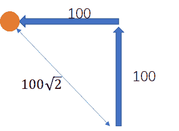
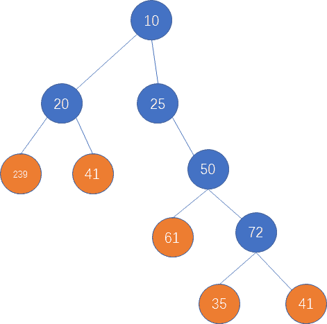

# 网易 2021 校招笔试-国际化游戏拓展专员-技术（企业发展部）（正式第一批）

## 1

现在有一个机器人，可以给它 N 个指令，每一个指令都是让他往特定一个方向走一个距离，比如“上 100”，再“左 100”，则其最终会到达一个点，求该点到原点的直线距离

本题知识点

游戏研发工程师 网易 2021

讨论

[泡泡哒哟](https://www.nowcoder.com/profile/382110965)

```cpp
#include<bits/stdc++.h>
using namespace std;
class kilometer
{
public:
    int x;
    int y;
    kilometer()
    {
        x=0;
        y=0;
    }
    kilometer(int a,int b):x(a),y(b){};
};
int main()
{
    int n;
    cin>>n;
    kilometer temp(0,0);
    for(int i=0;i<n;i++)
    {
        string str;
        int a;
        cin>>str;
        if(str=="right")
        {
            cin>>str;
            a=atoi(str.c_str());
            temp.y+=a;
        }
        else if(str == "left")
        {
            cin>>str;
            a=atoi(str.c_str());
            temp.y-=a;
        }
        else if(str == "up")
        {
            cin>>str;
            a=atoi(str.c_str());
            temp.x+=a;
        }
        else if(str == "down")
        {
            cin>>str;
            a=atoi(str.c_str());
            temp.x-=a;
        }
    }
    double re;
    int x=abs(temp.x-0);
    int y=abs(temp.y-0);
    re=sqrt(x*x+y*y);
    cout <<fixed<< setprecision(2)<< re << endl;
    return 0;
}
```

发表于 2021-01-08 10:59:53

* * *

## 2

在公司的工作安排中，不同的工作可能是互相独立的，也可能是有依赖的。一个任务 A 是另外一个任务 B 的前置任务，要 A 完成后才能进行 B，特别地，每个任务可能最多有 2 个前置任务，而前置任务本身可能也有前置任务。这样的前置依赖结构可以用树表示，子节点是父节点的前置任务 当有一系列任务分配下来后，由于项目规划的需要，问当最后一个任务（根节点）完成，最少需要多少时间

本题知识点

游戏研发工程师 网易 2021 运维工程师

讨论

[LiuGuohui](https://www.nowcoder.com/profile/958555540)

都是算法问题吗

发表于 2021-02-23 22:18:35

* * *

## 3

给定一个字符串，请返回满足以下条件的最长字符串的长度：“a”、"b"、“c”、“x”、"y"、“z”在字符串中都恰好出现了偶数次（0 也是偶数）

本题知识点

算法工程师 网易 2021 Java 工程师 大数据开发工程师 游戏研发工程师 前端工程师 安卓工程师 iOS 工程师 运维工程师

讨论

[alaa](https://www.nowcoder.com/profile/293830529)

leetcode 1371.状态压缩＋哈希表。

```cpp
import java.util.*;
public class Main{
    public static void main(String[] args) {
        // write your code here
        Scanner scanner = new Scanner(System.in);
        String next = scanner.next();
        System.out.println(findTheLongestSubstring(next));

    }

    private static int findTheLongestSubstring(String s) {
        Map<Integer, Integer> map = new HashMap<>();

        int state = 0;
        int maxlen = 0;

        // 初始化
        map.put(0, -1);

        // a b c x y z 分别在第 123456 个 bit，来表示出现次数的奇偶性
        for (int i = 0; i < s.length(); i++) {
            if (s.charAt(i) == 'a') state ^= 0x000001;
            if (s.charAt(i) == 'b') state ^= 0x000010;
            if (s.charAt(i) == 'c') state ^= 0x000100;
            if (s.charAt(i) == 'x') state ^= 0x001000;
            if (s.charAt(i) == 'y') state ^= 0x010000;
            if (s.charAt(i) == 'z') state ^= 0x100000;
            if (map.containsKey(state)) {
                maxlen = Math.max(maxlen, i - map.get(state));
            } else {
                map.put(state, i);
            }
        }
        return maxlen;
    }
}
```

编辑于 2021-01-04 14:17:36

* * *

[雨尘 ovo](https://www.nowcoder.com/profile/170989909)

```cpp
//位运算+dp
import java.util.Scanner;

public class Main{
    public static void main(String[] args){
        Scanner cin=new Scanner(System.in);
        while(cin.hasNext()){
            String str=cin.nextLine();
            int[] dp=new int[str.length()];
            dp[0]=judge(str.charAt(0));
            for(int i=1;i<str.length();++i){
                int temp=judge(str.charAt(i));
                if(temp==0)
                    dp[i]=dp[i-1];
                else
                    dp[i]=dp[i-1]^temp;
            }
            int ans=0;
            for(int i=0;i<str.length();++i){
                for(int j=i;j<str.length();++j){
                    if((dp[j]^dp[j-i]^judge(str.charAt(j-i)))==0){
                        ans=i+1;
                        break;
                    }
                }
            }
            System.out.println(ans);
        }
    }

    public static int judge(char cr){
        if(cr=='a')
            return 1;
        if(cr=='b')
            return 2;
        if(cr=='c')
            return 4;
        if(cr=='x')
            return 8;
        if(cr=='y')
            return 16;
        if(cr=='z')
            return 32;
        return 0;
    }
}

```

发表于 2022-03-15 18:07:03

* * *

[皮克斯儿](https://www.nowcoder.com/profile/71048863)

以下是 js 的，思路不对，输入 let at = "ooooooaobobobo"的时候结果不对，也跑过了 70%，我再好好好想想这个思路
while(line=readline()){
    let at=line
let zimu = 
["a", "b", "c", "x", "y", "z"]
let a1 = at.split("")
function jie(a, b) {
  let a1 = a.split("")
  let shu = 0
  a1.forEach(item => {
    // console.log(item);
    if(item == b) {
      shu++
    }
  })
  // console.log(shu);
  // 如果出现了单数次
  // console.log(shu, b);
  if(shu % 2 == 1) {
    let d1 = a.indexOf(b)
    let d9 = a.lastIndexOf(b)
    if(d1 >= a.length - 1 - d9) {
      let cun = a.slice(0, d9)
      at = cun
      // console.log(at);
      return cun
    } else{
      let cun = a.slice(d1 + 1)
      at = cun
      // console.log(at);
      return cun
    }
    // console.log(d1,d9);
  } else{
    return a
  }

}
// jie("amabchhchhahh","a")
// console.log(jie(a1,"a"));
while(1) {
  let o = 
[]
  let oo
  // o 存入这时的 at

  at.split("").forEach(item => {
    o.push(item)
  })
  for(let i = 0; i < zimu.length; i++) {

    // console.log(at,zimu[i]);
    oo = jie(at, zimu
[i])   //oo 是操作完了之后的 a1 字符串
    // console.log(oo);

  }
  if(oo.length == o.length) {
    // kk = 1
    // console.log(oo,oo.length," kk=1");
    break
  }
}
console.log(at.length);
}

发表于 2022-01-17 19:47:56

* * *

## 4

小易的幸运数字是 7，现有一个整数数组 nums，请你找出并返回能被七整除的子集合的最大和，如果找不到则返回-1。

本题知识点

算法工程师 网易 2021 安卓工程师 iOS 工程师 C++工程师 大数据开发工程师 游戏研发工程师 前端工程师

讨论

[人海追风](https://www.nowcoder.com/profile/896834337)

抄小冬瓜的，稍微改了点优化了下#include<iostream>
#include<vector>
#include<algorithm>

using namespace std;

int main()
{
    vector<int> nums;
    int t;
    while(cin>>t)    {nums.push_back(t);}
    sort(nums.begin(), nums.end());
    int sum =0;
    for(auto i:nums)    {sum +=i;}
    if(sum%7==0)    {cout<<sum<<endl;return 0;}
    vector<int> te;te.push_back(sum);
    for(int i =0;i<nums.size();i++)
    {
        int size_te = te.size();
        for(int j =0;j<size_te;j++)
        {
            int temp = te[j] -nums[i];
            if(temp!=0&&temp%7==0)     {cout<<temp<<endl;return 0;}
            else {te.push_back(temp);}
        }
    }

    cout<<"-1"<<endl;
    return 0;
}

发表于 2021-01-19 10:08:32

* * *

[cloudKing](https://www.nowcoder.com/profile/588719556)

#include <bits>using namespace std;
int main()
{
vector<int> data;
int num;
while(cin>>num)
data.push_back(num);
vector<int> dp(7,0); //dp[i] 除以 7 余 i 的累加和
for (int &a : data)
for (int &i : vector<int>(dp))
dp[(i + a) % 7] = max(dp[(i + a) % 7], i + a);//不用和用
cout<< dp[0];
return 0;
}

编辑于 2021-04-06 22:25:20

* * *

[零葬](https://www.nowcoder.com/profile/75718849)

同样可以先求解背包问题，判断哪些和能够凑出来，然后降序遍历输出能被 7 整除的最大的那个和，跟 2021 网易另一道题“小易的考试成绩”如出一辙

```cpp
import java.io.BufferedReader;
import java.io.InputStreamReader;
import java.io.IOException;

public class Main {
    public static void main(String[] args) throws IOException {
        BufferedReader br = new BufferedReader(new InputStreamReader(System.in));
        String[] strArr = br.readLine().split(" ");
        int[] arr = new int[strArr.length];
        int sum = 0;
        for(int i = 0; i < strArr.length; i++) {
            arr[i] = Integer.parseInt(strArr[i]);
            sum += arr[i];
        }
        // 求解背包问题
        int[] dp = new int[sum + 1];        // dp[i]用来记录 i 是否能得到
        dp[0] = 1;
        dp[sum] = 1;
        for(int i = 0; i < arr.length; i++){
            dp[i] = 1;
            for(int j = 0; j <= sum; j++)
                if(dp[j] == 1 && j >= arr[i]) dp[j - arr[i]] = 1;
        }
        // 降序遍历能取到的总和，输出最大的
        for(int lucky = sum; lucky >= 0; lucky--){
            if(dp[lucky] == 1 && lucky % 7 == 0){
                System.out.println(lucky);
                break;
            }
        }
    }
}
```

编辑于 2021-03-12 17:51:59

* * *</bits>