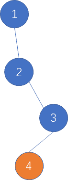

# 网易 2021 校招笔试-计算机视觉算法工程师（正式第一批）

## 1

请选择一个你最熟悉的计算机视觉算法领域，例如通用目标检测、图像特征检索、短视频分类、文本检测或文本识别、人脸检测或人脸识别等 1、简明扼要地谈谈近几年该领域算法的主要发展脉络； 2、选择该领域中一到两个目前应用最广泛的算法，简要介绍一下该算法的核心思想。 以上问题建议根据自己的个人理解来阐述。

你的答案

本题知识点

算法工程师 网易 2021

## 2

数据增强是深度学习模型训练的重要技巧，随着深度学习在视觉领域的应用不断发展，数据增强方面也涌现了很多新方法新思路，请介绍一下几种近期流行数据增强策略及其特点，如果有相关实践经验，请分享通过数据增强提升项目效果的案例。

你的答案

本题知识点

算法工程师 网易 2021

## 3

有一棵二叉树，树上的叶子节点定义为“樱桃”。现在需要找出树上有多少个满足如下子结构的“樱桃”串，即一串上刚好有两颗“樱桃”。
比如如下的一棵树，红框标示的有两个符合要求的结构，答案就是 2
又比如下面的这颗树，没有任何符合要求的子结构，则答案是 0

本题知识点

算法工程师 网易 2021 Java 工程师 C++工程师 前端工程师 安卓工程师 iOS 工程师 安全工程师

讨论

[烟雨仔](https://www.nowcoder.com/profile/686030081)

```cpp
const readline = require("readline")

const rl = readline.createInterface({
  input:process.stdin,
  output: process.stdout
})

const rows = []
let m, n// 节点数 边数
const obj = {}
let result = 0

rl.on("line", line => {
  rows.push(line)
  if (rows.length === 1) {
    const arr1 = line.trim().split(" ").map(item => parseInt(item))
    m = arr1[0]
  } else {
    const arr2 = line.trim().split(" ").map(item => parseInt(item))
    if (!obj[arr2[0]]) obj[arr2[0]] = []
    obj[arr2[0]].push(arr2[2])
  }
  if (rows.length === m) {
    // console.log(obj)
    for(let key in obj) {
      if (obj[key].length == 2 && obj[obj[key][0]] != 0 && !obj[obj[key][1]] != 0) {
        result += 1
      }
    }
    console.log(result)
    rows.length = 0
  }
})
```

发表于 2021-02-08 13:52:23

* * *

[April1604](https://www.nowcoder.com/profile/81680356)

```cpp
#include<iostream>
#include<vector>
#include<string>
using namespace std;

class Node{
public:
    Node *left = NULL, *right = NULL;
};

int numOfCherries(Node* root){
    if(!root) return 0;
    if(!root->left) return numOfCherries(root->right);
    if(!root->right) return numOfCherries(root->left);
    if(!root->left->left && !root->left->right && !root->right->left && !root->right->right) return 1;
    return numOfCherries(root->left) + numOfCherries(root->right);
}

int main(){
    int m, n;
    cin >> m >> n;
    //用 vector 里的 index 表示 id，因为 id 从 1 开始，所以 size 为 m+1
    vector<Node*> a(m+1);
    for(int i = 0; i < m+1; i++){
        a[i] = new Node();
    }
    for(int i = 0; i < n; i++){
        int id;
        cin >> id;
        string position;
        cin >> position;
        int child;
        cin >> child;
        if(position[0] == 'l'){
            a[id]->left = a[child];
        }
        else{
            a[id]->right = a[child];
        }
    }
    cout << numOfCherries(a[1]);
    return 0;
}
```

发表于 2021-08-20 23:45:13

* * *

[牛客 93930297 号](https://www.nowcoder.com/profile/93930297)

let mn = readline().split(' ')
let m = mn[0],n = mn[1]
let line
let arr = []
let j = 0
while(line = readline()) {
    arr[j++] = line.trim().split(' ')//变成一个二维数据
}
let count = 0
let map = new Map()
for(let i = 0;i<arr.length;i++) {
    let j = 0
    map.has(arr[i][j]) ? map.set(arr[i][j],map.get(arr[i][j])+1):map.set(arr[i][j],1)
}
let x = 0
for(let i = 0;i<arr.length -1;i++) {
    let j  = 2
    if(!map.has(arr[i][j]) && !map.has(arr[i+1][j]) && (arr[i][0] == arr[i+1][0])) {
        count++
    }
}
console.log(count)

发表于 2021-07-08 21:52:16

* * *

## 4

在自然语言处理的过程中，经常需要判断一个字符串和另外一个字符串之间的一个相似程度，其中常见的一个指标就是编辑距离，即一个字符串最少经过多少次“增删改”某个字符，可以变为另一个字符串。如“abc”与“ac”的编辑距离为 1，是因为在 a 和 c 中间“增加”一个 b 即可。如“abcd”与“axc”的编辑距离为 2，是因为把“abcd”的 b 修改为 x，然后再删除 d 即可，共 2 次操作。但是在某种场景中，编辑距离定义为词粒度的。比如句子 A “I am a coder”与句子 B “hello ,  I am a singer”之间，对于句子 A 可以通过添加"hello"和符号",",  并替换"coder"为"singer"，共 3 个操作得到句子 B。所以可得其基本的编辑距离为 3。在本题中，特别地，对于部分词，比如标点符号“, ”、"hello"对于句子语义的影响并不重要，这部分称之为停用词，这部分可以在匹配的过程中被跳过。比如对于句子 A “I am a coder”与句子 B “hello ,  I am a singer”，如果加入了停用词的影响，那编辑距离从 3 降到 1。所以目标是可以有选择性地跳过停用词的情况下，问最小的编辑距离是多少。

本题知识点

算法工程师 网易 2021 C++工程师 Java 工程师 测试开发工程师 测试工程师 大数据开发工程师 安卓工程师 iOS 工程师 安全工程师

讨论

[零葬](https://www.nowcoder.com/profile/75718849)

1.先将句子中的停用词去除掉；2.然后按空格将句子划分为词的粒度；3.最后用常规的动态规划方法计算编辑距离即可。

```cpp
stop_words = input().split()
sentence1 = input()
sentence2 = input()
# 先将句子中的停用词去除
for word in stop_words:
    sentence1 = sentence1.replace(word, "")
    sentence2 = sentence2.replace(word, "")
s1 = sentence1.split()
s2 = sentence2.split()
# 计算句子中的单词数
word_num1 = len(s1)
word_num2 = len(s2)
# 动态规划计算编辑距离
dp = [[0] * (word_num2 + 1) for _ in range(word_num1 + 1)]
for i in range(word_num1 + 1):
    for j in range(word_num2 + 1):
        if i == 0 and j == 0:
            dp[i][j] = 0
        elif i == 0 and j > 0:
            dp[0][j] = j
        elif i > 0 and j == 0:
            dp[i][0] = i
        elif s1[i - 1] == s2[j - 1]:
            dp[i][j] = min(dp[i - 1][j - 1], dp[i][j - 1] + 1, dp[i - 1][j] + 1)
        else:
            dp[i][j] = min(dp[i - 1][j - 1] + 1, dp[i][j - 1] + 1, dp[i - 1][j] + 1)
print(dp[word_num1][word_num2])
```

编辑于 2021-01-18 14:34:56

* * *

[talkking](https://www.nowcoder.com/profile/812488803)

//dp 求编辑裸题#include<bits/stdc++.h>using namespace std;
int dp[1001][1001];
vector<string>d,a,b,anew,bnew;
unordered_map<string,int>mp;
int levenshtein(vector<string> a ,vector<string> b)//编辑距离 O(n²)
{
    dp[0][0]=0;
    for(int i=1;i<=a.size();i++) dp[i][0]=i;
    for(int j=1;j<=b.size();j++) dp[0][j]=j;
    for(int i=1;i<=a.size();i++)
        for(int j=1;j<=b.size();j++){
           dp[i][j]=min(dp[i-1][j]+1,dp[i][j-1]+1);
           if(a[i-1]!=b[j-1]) dp[i][j]=min(dp[i][j],dp[i-1][j-1]+1);
           else dp[i][j]=min(dp[i][j],dp[i-1][j-1]);
        }
    return dp[a.size()][b.size()];
}
int main()
{
    ios::sync_with_stdio(false);
    cin.tie(0),cout.tie(0);
    string disableword,s1,s2;
    getline(cin,disableword);
    stringstream ss;
    ss<<disableword;
    while(ss>>disableword){
        d.emplace_back(disableword);
    }
    getline(cin,s1);
    ss.clear();
    ss.str("");
    ss<<s1;
    while(ss>>s1){
        a.emplace_back(s1);
    }
    getline(cin,s2);
    ss.clear();
    ss.str("");
    ss<<s2;
    while(ss>>s2){
        b.emplace_back(s2);
    }
    for(int i=0;i<d.size();i++)
        mp[d[i]]=1;
    for(int i=0;i<a.size();i++)
        if(!mp[a[i]])
           anew.emplace_back(a[i]);
    for(int i=0;i<b.size();i++)
        if(!mp[b[i]])
           bnew.emplace_back(b[i]);
    cout<<levenshtein(anew,bnew)<<endl;
    return 0;
}

发表于 2021-01-10 11:21:25

* * *

## 5

严选的快递员每天需要送很多个包裹，在货物装车后，需要开着电动车先到 0 号用户家。送完货后从 0 号出发，再送到 1 号用户。然后快递员可以从 1 号直接到 2 号用户家，完成送货。但有时候由于路不通的原因，需要先折返回 0 号，再去 2 号，如此循环，完成送货。
由于路况复杂，每个用户家只有一条路通往附近的其他一户邻居家，假设每条通路都是 1 公里。另外快递员的电动车的电是有限的，最多只能开有限的 k 公里。现在快递员已经在 0 号用户家送完快递，问快递员最多可以送多少个不重复的用户

本题知识点

算法工程师 网易 2021 Java 工程师 测试开发工程师 测试工程师 大数据开发工程师 数据库工程师 运维工程师

讨论

[Wonder2021](https://www.nowcoder.com/profile/958589703)

```cpp
import java.util.Scanner;

public class Main {
    public static void main(String[] args) {
        Scanner s = new Scanner(System.in);
        String[] nk = s.nextLine().split(" ");
        String[] link = s.nextLine().split(" ");
        s.close();
        int k = Integer.parseInt(nk[1]);
        int dpt = dpt(link);
        if (dpt >= k) {
            System.out.println(k + 1);
        } else {
            System.out.println(Math.min(link.length + 1, dpt + 1 + (k - dpt) / 2));
        }
    }

    public static int dpt(String[] link) {
        Node[] nodes = new Node[link.length + 1];
        nodes[0] = new Node(0);
        int ind = 0;
        for (String parrent : link) {
            Node pn = nodes[Integer.parseInt(parrent)];
            nodes[++ind] = new Node(pn.dpt + 1);
        }
        ind = 0;
        for (Node node : nodes) {
            ind = Math.max(ind, node.dpt);
        }
        return ind;
    }
}

class Node {
    public int dpt = 1;

    public Node(int dpt) {
        this.dpt = dpt;
    }
}
```

发表于 2021-08-21 09:19:07

* * *

[丶小二上酒](https://www.nowcoder.com/profile/924283833)

```cpp
import java.util.*;

public class Main {
    public static void main(String[] args) {
        Scanner sc = new Scanner(System.in);
        String[] str = sc.nextLine().split(" ");
        int n = Integer.parseInt(str[0]);
        int k = Integer.parseInt(str[1]);
        String[] num = sc.nextLine().split(" ");
        int[] s = new int[num.length];
        for (int i = 0; i < num.length; i++) {
            s[i] = Integer.parseInt(num[i]);
        }
        boolean[][] dp = new boolean[n][n];
        for (int i = 1; i < n; i++) {
            dp[s[i-1]][i] = true;
            dp[i][s[i-1]] = true;
        }
        int depth = depthOfTree(dp);
        if (k < depth) {
            System.out.println(k + 1);
        }else {
            int res = Math.min(n,depth + (k - depth + 1) / 2);
            System.out.println(res);
        }
    }

    /*
    利用树的邻接表的层次遍历求出树的深度
     */
    public static int depthOfTree(boolean[][] adjacentMatrix) {
        LinkedList<Integer> queue = new LinkedList<>();
        int nodeNumber = adjacentMatrix.length;
        boolean[] visited = new boolean[nodeNumber];
        int depth = 0;
        queue.add(0);
        visited[0] = true;
        int layerNodes = 1;
        int nextLayerNodes = 0;
        while (queue.size() != 0) {
            while (layerNodes-- > 0) {
                int curNode = queue.poll();
                for (int i = 1; i < nodeNumber; i++) {
                    if (adjacentMatrix[curNode][i] && !visited[i]) {
                        nextLayerNodes ++;
                        visited[i] = true;
                        queue.add(i);
                    }
                }
            }
            layerNodes = nextLayerNodes;
            nextLayerNodes = 0;
            depth++;
        }
        return depth;
    }
}

```

发表于 2021-07-30 16:58:09

* * *

[牛客 68604898 号](https://www.nowcoder.com/profile/68604898)

```cpp
#include<bits/stdc++.h>
#include<stack>
#include<vector>
#include<unordered_set>

using std::endl;
typedef std::vector< std::vector<int> > ErweiMatrix;
typedef std::unordered_set<int> Hashset;

int FanHuiXiaoBiao(std::vector<int> ShuZu, int Zhi) {
    int XiaoBiao = -1;
    for (int counter_1 = 0;counter_1 < ShuZu.size();counter_1++) {
        if (ShuZu[counter_1] == Zhi) {
            XiaoBiao = counter_1;
            break;

        }

    }
    return XiaoBiao;

}

bool ISLianJie(int Node_1, int Node_2, ErweiMatrix NodeArray) {
    for (int nextNodes : NodeArray[Node_1]) {
        if (nextNodes == Node_2) {
            return true;
            break;
        }

    }

    return false;

}

int GetMaxIndex_XianZhi(std::vector<int> ShuZu, int XianZhi) {

    int GetMaxValue = 0;
    for (int counter_1 = 0;counter_1 < ShuZu.size();counter_1++) {
        if ((ShuZu[counter_1] > 0) && ((XianZhi - 2 * ShuZu[counter_1]) >= 0)) {

            GetMaxValue = ShuZu[counter_1] > GetMaxValue ? ShuZu[counter_1] : GetMaxValue;

        }

    }
    return FanHuiXiaoBiao(ShuZu, GetMaxValue);

}

int main() {

    std::ios_base::sync_with_stdio(false);
    std::cin.tie(0);
    std::cout.tie(0);

    int DianShu = 0;
    int MP = 0;

    std::cin >> DianShu >> MP;
    std::vector<int> input(DianShu - 1);
    for (int counter_1 = 0;counter_1 < DianShu - 1;counter_1++) {
        std::cin >> input[counter_1];

    }
    ErweiMatrix NodeArray(DianShu);
    for (int counter_1 = 0;counter_1 < DianShu - 1;counter_1++) {
        NodeArray[input[counter_1]].push_back(counter_1 + 1);
        NodeArray[counter_1 + 1].push_back(input[counter_1]);

    }
    std::vector<int> DaYing(DianShu);
    Hashset ChaChong;
    std::stack<int> Mystack;
    Mystack.push(0);

    ChaChong.insert(0);
    DaYing[0] = 0;
    int DaYingIndex = 1;
    std::vector<int> WhoLongest(DianShu, -1);
    WhoLongest[0] = 0;

    while (!Mystack.empty()) {
        int Cur = Mystack.top();
        if (NodeArray[Cur].size() == 1) WhoLongest[Cur] = Mystack.size();
        Mystack.pop();
        for (int NextNodes : NodeArray[Cur]) {
            if (ChaChong.count(NextNodes) == 0) {
                Mystack.push(Cur);
                Mystack.push(NextNodes);
                DaYing[DaYingIndex] = NextNodes;
                DaYingIndex++;
                ChaChong.insert(NextNodes);
                break;

            }

        }

    }

    int GetLongest = 0;
    for (int counter_1 = 0;counter_1 < DianShu;counter_1++) {
        GetLongest = WhoLongest[counter_1] > GetLongest ? WhoLongest[counter_1] : GetLongest;

    }
    int GetLongestNode = FanHuiXiaoBiao(WhoLongest, GetLongest);//具体节点号
    GetLongestNode = FanHuiXiaoBiao(DaYing, GetLongestNode);

    std::stack<int> fuzhu_CurLuJin;
    int ChuShiIndex = GetLongestNode;
    fuzhu_CurLuJin.push(ChuShiIndex);
    for (int counter_1 = ChuShiIndex - 1;counter_1 >= 0;counter_1--) {
        int DangQianNode = fuzhu_CurLuJin.top();//是下标
        if (ISLianJie(DaYing[DangQianNode], DaYing[counter_1], NodeArray)) {

            fuzhu_CurLuJin.push(counter_1);

        }

    }
    std::vector<int> DpValue(DianShu, -1);

    while (!fuzhu_CurLuJin.empty()) {

        DpValue[fuzhu_CurLuJin.top()] = 0;
        fuzhu_CurLuJin.pop();

    }

    for (int counter_1 = 0;counter_1 < DianShu;counter_1++) {
        if (DpValue[counter_1] != 0) {
            for (int counter_2 = counter_1 - 1;counter_2 >= 0;counter_2--) {

                if (ISLianJie(DaYing[counter_2], DaYing[counter_1], NodeArray)) {
                    DpValue[counter_1] = DpValue[counter_2] + 1;
                    break;
                }

            }

        }

    }
    int TongJi = 0;
    for (int counter_1 = 0;counter_1 < DianShu;counter_1++) {
        if (DpValue[counter_1] == 0) TongJi++;

    }

    MP -= (TongJi - 1);

    if (MP <= 1 && MP >= 0) {
        std::cout << TongJi;
        return 0;
    }

    if (MP < 0) {
        std::cout << MP + TongJi;
        return 0;

    }

    std::stack<int> HelpMeChange;
    while (MP > 1) {

        int Cur_Change = GetMaxIndex_XianZhi(DpValue, MP);

        if (Cur_Change == 0) break;
        if (DpValue[Cur_Change] == 0) break;
        MP -= DpValue[Cur_Change] * 2;

        DpValue[Cur_Change] = 0;
        HelpMeChange.push(DaYing[Cur_Change]);
        for (int counter_1 = Cur_Change - 1;counter_1 >= 0;counter_1--) {
            if (DpValue[counter_1] != 0 && ISLianJie(DaYing[counter_1], HelpMeChange.top(), NodeArray)) {
                DpValue[counter_1] = 0;
                HelpMeChange.pop();
                HelpMeChange.push(DaYing[counter_1]);

            }

        }
        HelpMeChange.pop();

        for (int counter_1 = 0;counter_1 < DianShu;counter_1++) {
        if (DpValue[counter_1] != 0) {
            for (int counter_2 = counter_1 - 1;counter_2 >= 0;counter_2--) {

                if (ISLianJie(DaYing[counter_2], DaYing[counter_1], NodeArray)) {
                    DpValue[counter_1] = DpValue[counter_2] + 1;
                    break;
                }

            }

        }

      }

    }
    int counterZeros = 0;
    for (int counter_1 = 0;counter_1 < DianShu;counter_1++) {
        if (DpValue[counter_1] == 0) counterZeros++;

    }
    std::cout << counterZeros;

    return 0;
}
```

发表于 2021-03-21 09:59:26

* * *

## 6

网易内部开了一家水果店，最近推出了一个水果礼盒的产品。礼盒总的目标重量是固定的，水果店的工人需要从 N 个不同重量的水果中，挑选出合适的一些水果，使尽量装满这个礼盒。但是礼盒比较脆弱，所以水果的重量总和不能超过礼盒的目标重量。问每一次工人装水果的时候，这个礼盒最多能装多少。

本题知识点

安卓工程师 iOS 工程师 网易 2021 Java 工程师 C++工程师 算法工程师 安全工程师 游戏研发工程师

讨论

[零葬](https://www.nowcoder.com/profile/75718849)

和 2021 年网易笔试题中那道“小易的考试成绩”的思路如出一辙，都是先求解 01 背包问题，然后降序遍历能得到的重量并输出最大的。但这个方法我在使用 python 的时候会超时。

```cpp
import java.io.BufferedReader;
import java.io.InputStreamReader;
import java.io.IOException;

public class Main {
    public static void main(String[] args) throws IOException {
        BufferedReader br = new BufferedReader(new InputStreamReader(System.in));
        int C = Integer.parseInt(br.readLine());
        String[] strArr = br.readLine().split(" ");
        int n = strArr.length;
        int[] weights = new int[n];
        int sum = 0;
        for(int i = 0; i < n; i++){
            weights[i] = Integer.parseInt(strArr[i]);
            sum += weights[i];
        }
        // 求解背包问题
        int[] dp = new int[sum + 1];
        dp[0] = 1;
        dp[sum] = 1;
        for(int i = 0; i < n; i++){
            dp[weights[i]] = 1;
            for(int j = 0; j <= sum; j++){
                if(dp[j] == 1 && j - weights[i] >= 0)
                    dp[j - weights[i]] = 1;
            }
        }
        // 降序依次检测满足要求的重量哪个最大
        for(int weight = sum; weight >= 0; weight--){
            if(dp[weight] == 1 && weight <= C){
                System.out.println(weight);
                break;
            }
        }
    }
}
```

当然，直接求解背包问题也是可以的

```cpp
import java.io.BufferedReader;
import java.io.InputStreamReader;
import java.io.IOException;

public class Main {
    public static void main(String[] args) throws IOException {
        BufferedReader br = new BufferedReader(new InputStreamReader(System.in));
        int C = Integer.parseInt(br.readLine());
        String[] strArr = br.readLine().split(" ");
        int n = strArr.length;
        int[] weights = new int[n];
        int sum = 0;
        for(int i = 0; i < n; i++)
            weights[i] = Integer.parseInt(strArr[i]);
        // 求解背包问题
        int[] dp = new int[C + 1];
        for(int i = 0; i < n; i++){
            for(int j = C; j >= 0; j--){
                if(j >= weights[i])
                    dp[j] = Math.max(dp[j], dp[j - weights[i]] + weights[i]);
                else
                    break;
            }
        }
        System.out.println(dp[C]);
    }
}
```

编辑于 2021-01-18 15:21:36

* * *

[人海追风](https://www.nowcoder.com/profile/896834337)

#include<vector>
#include<iostream>
using namespace std;
int main(){
    int n;
    vector<int> a;
    cin>>n;
    int num=0;
    while(1){
      num++;
      int temp;
      cin>>temp;
      a.push_back(temp);
      if(cin.get()=='\n') break;
  }
    vector<int> dp(n+1,0);
    for(int i=0;i<num;i++){
        for(int j=n;j>0;j--){
            if(j>=a[i]) dp[j]=max(dp[j],dp[j-a[i]]+a[i]);
            else break;
        }
    }
    cout<<dp[n]<<endl;
    return 0;
}

编辑于 2021-01-18 15:11:06

* * *