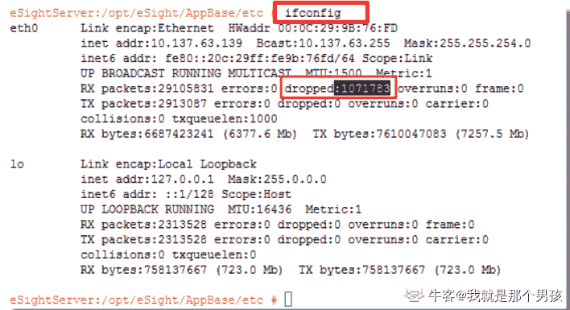

# 网易 2021 校招笔试-系统运维工程师（正式第一批）

## 1

1. 查看当前系统文件系统 inode 使用量，需要怎么输入命令

正确答案: A   你的答案: 空 (错误)

```cpp
df -i
```

```cpp
df -h
```

```cpp
du -h
```

```cpp
du -i
```

本题知识点

运维工程师 网易 2021

讨论

[牛客 43462370 号](https://www.nowcoder.com/profile/43462370)

df [option]-h 以容易理解的格式(给人看的格式)输出文件系统分区使用情况，例如 10kB、10MB、10GB 等。-k 以 kB 为单位输出文件系统分区使用情况。-m 以 mB 为单位输出文件系统分区使用情况。-a 列出所有的文件系统分区，包含大小为 0 的文件系统分区。-i 列出文件系统分区的 inodes 信息。-T 显示磁盘分区的文件系统类型。du [option] 文件/目录-h 以容易理解的格式(给人看的格式)输出文件系统分区使用情况，例如 10kB、10MB、10GB 等。-s 显示文件或整个目录的大小，默认单位为 kB。

发表于 2021-02-20 18:21:10

* * *

[我就是那个男孩](https://www.nowcoder.com/profile/102701777)

du 和 df 命令都被用于获得文件系统大小的信息

du，disk usage 能看到的文件只是一些当前存在的，没有被删除的。他计算的大小就是当前他认为存在的所有文件大小的累加和。
df,disk free 记录的是通过文件系统获取到的文件的大小，他比 du 强的地方就是能够看到已经删除的文件，而且统计在内

 发表于 2022-03-11 09:19:41

* * *

## 2

Linux 进程调度的时候，以下哪个进程状态转化是不会发生的

正确答案: C   你的答案: 空 (错误)

```cpp
S -> R
```

```cpp
R -> S
```

```cpp
D -> T
```

```cpp
D -> R
```

本题知识点

运维工程师 网易 2021

讨论

[牛客 43462370 号](https://www.nowcoder.com/profile/43462370)

R(runing)：进程处于运行或就绪状态。也就是上面提到的运行态和就绪态进程的综合。一个进程处于 RUNNING 状态，并不代表他一定在被执行。由于在多任务系统中，各个就绪进程需要并发执行，所以在某个特定时刻，这些处于 RUNNING 状态的进程之中，只有一个能得到处理器，而其他进程必须在一个就绪队列中等待。即使是在多处理器的系统中，Linux 也只能同时让一个处理器执行任务。D(disk sleep)UNINTERRUPTABLE:不可中断阻塞状态。被阻断而等待一个事件，不会被信号激活,除了 I/O 信号，处于这种状态的进程正在等待队列中，当资源有效时，可由操作系统进行唤醒，否则，将一直处于等待状态。S(sleeping)INTERRUPTABLE：可中断阻塞状态。被阻断而等待一个事件，可能会被一个信号激活,与不可中断阻塞状态一样，处于这种状态的进程在等待队列中，当资源有效时，可以有操作系统进行唤醒。与不可中断阻塞状态有所区别的是，处于此状态中的进程亦可被其他进程的信号唤醒。T(stopped)：挂起状态。进程被暂停，需要通过其它进程的信号才能被唤醒。导致这种状态的原因有两种。其一是受到相关信号(SIGSTOP,SIGSTP,SIGTTIN 或 SIGTTOU)的反应。其二是受到父进程 ptrace 调用的控制，而暂时将处理器交给控制进程。t(tracing stop)：追踪停止 X(dead) ： 进程已经完全死掉, 这个永远看不见 Z(zombie)：僵尸状态。表示进程结束但尚未消亡的一种状态。此时进程已经结束运行并释放掉大部分资源，但尚未释放进程控制块。

发表于 2021-02-20 18:20:48

* * *

## 3

linux 系统中如果要设置 test.sh 权限为用户只读，该如何修改

正确答案: D   你的答案: 空 (错误)

```cpp
chown 444 test.sh
```

```cpp
chmod 400 test.sh
```

```cpp
chattr +a test.sh
```

```cpp
chattr +i test.sh
```

本题知识点

运维工程师 网易 2021

讨论

[牛客 43462370 号](https://www.nowcoder.com/profile/43462370)

chmod 变更文件或目录权限 chmod #对所有权限组添加权限\ chmod 444chown 更改文档的所有者和所属组，使用权限为 root，一般使用者没有权限    格式：chown [选项] 文档    -c 作用与-v 相似，只传回修改的部分    -f 不显示错误信息    -h 只对符号链接的文件做修改，不更改其他任何文件    -R 递归处理，对子目录一并处理    -v 显示指令执行过程 chattr 命令用来修改文件系统的权限属性，只有 root 用户可以使用，凌驾于 rwx 之上授权    chattr [选项] 文件或目录名    + 增加权限    - 删除权限    = 等于权限    i 对文件设置 i 属性，不允许对文件删除、改名、添加和修改数据，对目录设置 i 属性，只能修改目录下文件的数据，不允许建立和删除文件    a 对文件设置 a 属性，只能在文件中增加数据，但是不能删除和修改数据，对目录设置 a 属性，只允许在目录中建立和修改文件，不允许删除文件    e linux 中大部分文件默认拥有 e 属性，表示文件使用 ext 文件系统进行存储，而且不        能使用 chattr -e 取消 e 属性    chattr +i test.txt #增加 i 属性，root 不能强制删除

发表于 2021-02-20 18:36:57

* * *

[我就是那个男孩](https://www.nowcoder.com/profile/102701777)

chown 444 test.sh  对 root 用户来说不是只读，而是具有所以权限，所以使用 chattr，可以限制 root 用户对文件的操作

发表于 2022-03-11 09:27:30

* * *

## 4

服务器上有 aa.sh,bb.sh,确认脚本编写语法没有问题，执行 bash aa.sh || bash bb.sh 的时候，以下哪个说法正确

正确答案: B   你的答案: 空 (错误)

```cpp
aa.sh 执行成功，执行 bb.sh
```

```cpp
aa.sh 执行不成功，执行 bb.sh
```

```cpp
aa.sh 执行结果会输出给 bb.sh
```

```cpp
shell 语句不合法
```

本题知识点

运维工程师 网易 2021

讨论

[郭牧眠](https://www.nowcoder.com/profile/181430796)

command1 || command2 逻辑**或** -->  如果这个命令执行失败了||那么就执行这个命令
command1 && command2 逻辑**与**  -->  如果这个命令执行成功&&那么执行这个命令

发表于 2021-03-01 16:07:32

* * *

## 5

server 端接受 TCP 包的时候，发现 1，2，3，4，5 顺序中丢了 2，会触发

正确答案: C   你的答案: 空 (错误)

```cpp
回 rst
```

```cpp
回 syn+ack
```

```cpp
回 ack
```

```cpp
不响应
```

本题知识点

运维工程师 网易 2021

讨论

[郭牧眠](https://www.nowcoder.com/profile/181430796)

考快重传。快重传是指，比如接收端在接收到报文段 1 和报文段 2 后都发出了确认，但是没收到报文段 3 就收到了报文段 4，他会**重复发送报文段 2 对应的 ack 码**，再收到报文段 5，报文段 6 之后仍然会发送报文段 2 的 ack 码，这样发送端连续收到 3 个重复的 ack 码时，就能很快速的意识到报文段 3 丢失了，会重新发送报文段 3

发表于 2021-03-01 16:11:27

* * *

## 6

bash 下如何获得当前进程的 pid

正确答案: A   你的答案: 空 (错误)

```cpp
echo $$
```

```cpp
echo $1
```

```cpp
echo $?
```

```cpp
echo $0
```

本题知识点

运维工程师 网易 2021

讨论

[牛客 43462370 号](https://www.nowcoder.com/profile/43462370)

echo $$ 返回登录 shell 的 PIDecho $? 返回上一个命令的状态，0 表示没有错误，其它任何值表明有错误 echo $# 返回传递到脚本的参数个数 echo $* 以一个单字符串显示所有向脚本传递的参数，与位置变量不同，此选项参数可超过 9 个 echo $! 返回后台运行的最后一个进程的进程 ID 号 echo $@ 返回传递到脚本的参数个数，但是使用时加引号，并在引号中返回每个参数 echo $- 显示 shell 使用的当前选项 echo $0 是脚本本身的名字 echo $_ 是保存之前执行的命令的最后一个参数 echo $1 传入脚本的第一个参数

发表于 2021-02-20 19:47:00

* * *

## 7

linux 下管道数据进出是哪种模式

正确答案: A   你的答案: 空 (错误)

```cpp
fifo
```

```cpp
filo
```

```cpp
lilo
```

```cpp
lifo
```

本题知识点

运维工程师 网易 2021

讨论

[郭牧眠](https://www.nowcoder.com/profile/181430796)

First In First Out 先进先出

发表于 2021-03-01 16:16:16

* * *

## 8

如果在 Linux 下执行对一个可执行文件，执行 chmod u+s /usr/local/bin/htg，有什么副作用？

正确答案: B   你的答案: 空 (错误)

```cpp
文件不可修改
```

```cpp
文件提权 root
```

```cpp
文件授权给 root 用户
```

```cpp
文件标记为不可删除
```

本题知识点

运维工程师 网易 2021

讨论

[牛客 43462370 号](https://www.nowcoder.com/profile/43462370)

-s :在文件执行时把进程的属主或组 ID 置为该文件的文件属主。chmod u+s 就是给某个程序的所有者以 suid 权限，可以像 root 用户一样操作

发表于 2021-02-20 19:46:34

* * *

## 9

以下哪个命令可以看到 linux 内核版本信息

正确答案: D   你的答案: 空 (错误)

```cpp
uname
```

```cpp
uname -i
```

```cpp
uname -s
```

```cpp
uname -a
```

本题知识点

运维工程师 网易 2021

讨论

[牛客 43462370 号](https://www.nowcoder.com/profile/43462370)

uname #uname 默认为 uname-s （--sysname 或--kernel-name 显示 OS 内核名称）uname -i #--hardware-platform 显示硬件平台 uname -a #--all 显示以上全部信息 uname -r #--release 显示内核发行号(或--kernel release)uname -v #显示内核版本详细信息(--kernel version，不是版本号，是内核#建立时间和 CPU 架构-SMP"对称多处理"（Symmetrical Multi-#Processing）)uname -p #--processor 显示处理器类型或”unknown”uname -m #--machine 显示机器硬件名称或”unknown”uname -o #--operating-system 显示 OS 名称 uname -n #--nodename 显示网络中主机名称（节点名）

发表于 2021-02-20 20:27:34

* * *

[理想 E 锅盖](https://www.nowcoder.com/profile/401303695)

D  uname -a 查看系统内核版本号及系统名称

发表于 2021-01-09 20:41:58

* * *

## 10

网卡丢包情况可以用哪个命令可以看

正确答案: A   你的答案: 空 (错误)

```cpp
ifconfig
```

```cpp
netstat -ant
```

```cpp
ip addr
```

```cpp
vmstat
```

本题知识点

运维工程师 网易 2021

讨论

[我就是那个男孩](https://www.nowcoder.com/profile/102701777)



发表于 2022-03-11 09:32:58

* * *

## 11

1．导致机械硬盘 io 速度差异的点

正确答案: A B   你的答案: 空 (错误)

```cpp
硬盘转速
```

```cpp
硬盘协议
```

```cpp
磁盘容量
```

```cpp
硬盘功率
```

本题知识点

运维工程师 网易 2021

## 12

以下哪个命令能显示父子进程关系

正确答案: B C   你的答案: 空 (错误)

```cpp
ps -aux
```

```cpp
ps axjf
```

```cpp
ps -ejH
```

```cpp
ps -aeF
```

本题知识点

运维工程师 网易 2021

讨论

[quanfine](https://www.nowcoder.com/profile/86914979)

man psB C 输出进程树

发表于 2021-03-16 14:55:43

* * *

## 13

以下哪些缩写和 io 调度算法相关

正确答案: A B D   你的答案: 空 (错误)

```cpp
cfq
```

```cpp
noop
```

```cpp
cfs
```

```cpp
deadline
```

本题知识点

运维工程师 网易 2021

## 14

文件系统启用 journal 的作用

正确答案: C D   你的答案: 空 (错误)

```cpp
提升文件读写性能
```

```cpp
提升文件一致性
```

```cpp
为了故障恢复
```

```cpp
提示 fsck 能力
```

本题知识点

运维工程师 网易 2021

讨论

[我就是那个男孩](https://www.nowcoder.com/profile/102701777)

journal 文件系统是一个文件系统可以追踪一些没有 dump 到文件系统的修改， journal 以一种数据存储的方式把这些修改操作记录下来。 在系统事故，或者掉电的情况下， journal 可以帮助文件系统找回丢失的文件。Linux fsck（英文全拼：file system check）命令用于检查与修复 Linux 档案系统，可以同时检查一个或多个 Linux 档案系统。

发表于 2022-03-11 10:12:10

* * *

## 15

grub 不支持的操作

正确答案: D   你的答案: 空 (错误)

```cpp
修改启动内核
```

```cpp
修改用户模式
```

```cpp
修改分区
```

```cpp
修改 sysctl 配置参数
```

本题知识点

运维工程师 网易 2021

讨论

[我就是那个男孩](https://www.nowcoder.com/profile/102701777)

grup 引导装入器 ，它负责装入内核并引导 Linux 系统。

发表于 2022-03-11 10:16:04

* * *

## 16

编写脚本，找出/usr/src 目录下所有的.c 文件，然后将这些.c 文件打包成一个 tgz 文件

你的答案

本题知识点

运维工程师 网易 2021

讨论

[牛客 275514714 号](https://www.nowcoder.com/profile/275514714)

find /usr/src -name "*.c" -type f |xargs tar zcvf backup.tar.gz

发表于 2022-03-16 16:15:01

* * *

## 17

如何在非图形界面下抓取来自 eth0 的目标地址为 123.13.1.3 的 80 端口 tcp 数据包，对应的 tcpdump 命令怎么写

你的答案

本题知识点

运维工程师 网易 2021

## 18

请描述运维的工作内容及核心目标，为达成目标最需要具备的因素有哪些？

你的答案

本题知识点

运维工程师 网易 2021

## 19

讲述一下 4/7 层负载均衡的区别和适用场景。

你的答案

本题知识点

运维工程师 网易 2021

## 20

给定一个字符串 s，问该字符串里有多少个长度大于 1 的连续子串都是回文？回文：正序的文本内容与倒序的文本内容相同，比如 aa，aba

本题知识点

安卓工程师 iOS 工程师 网易 2021 Java 工程师 C++工程师 测试开发工程师 测试工程师 前端工程师 算法工程师 运维工程师 安全工程师 游戏研发工程师

讨论

[零葬](https://www.nowcoder.com/profile/75718849)

外层固定右边界，改变左边界，内层固定左边界，改变右边界，对所有子串进行回文检验

```cpp
import java.io.BufferedReader;
import java.io.InputStreamReader;
import java.io.IOException;
import java.util.HashMap;

public class Main {
    public static void main(String[] args) throws IOException {
        BufferedReader br = new BufferedReader(new InputStreamReader(System.in));
        String str = br.readLine();
        int count = 0;
        for(int i = 0; i < str.length(); i++){
            // 固定右边界
            int left = i, right = str.length() - 1;
            while(left < right){
                // 固定左边界
                int temp_l = left, temp_r = right;
                // 检查 str[temp_l:temp_r]是否是回文串
                while(temp_l < temp_r){
                    if(str.charAt(temp_l) != str.charAt(temp_r))
                        break;        // 以 temp_l 开头 temp_r 结尾的子串不是回文串
                    temp_l++;
                    temp_r--;
                }
                // 如果右边界到左边界的左边了，说明此时抓出来一个回文串
                if(temp_l >= temp_r) count ++;
                right --;
            }
        }
        System.out.println(count);
    }
}
```

发表于 2021-01-18 21:00:21

* * *

[寒冰-侠客](https://www.nowcoder.com/profile/442275737)

仅从数据层面看，O(N²)的算法应无法通过，但实际上数据不强，平方级仍可通过。此处介绍一种字符串哈希结合二分的方法，复杂度 O(N*logN)。其实此方法的基础是求字符串最长回文子串。（1）对字符串正反两向做哈希处理（2）回文串长度有奇数和偶数两种，求以 pos 为中心的最长回文子串和以（pos，pos+1）为中心的最长回文子串。例如以 pos 为中心最长回文子串长度为 2x+1，那么可以得到 x 个长度超过 2 的回文子串，例如子串 bbabb，那么 bab，bbabb 为解。（3）求 pos 为中心的最长回文子串可以用二分法来降低复杂度。

```cpp
#include <bits/stdc++.h>
typedef long long ll;
using namespace std;
string s;
ll n,p=131,hx[100005]={1},hx2[100005],pw[100005]={1},ans=0;
int check1(ll pos)/**< 求以 pos 为中点的回文串最大长度 */
{
    int l=0,r=min(pos-1,n-pos),mid,best=0;
    while(l<=r)
    {
        mid=(l+r)>>1;/**< 左半段 p-mid~p，右半段 p~p+mid */
        if(hx[pos-1]-hx[pos-mid-1]*pw[mid]==hx2[pos+1]-hx2[pos+mid+1]*pw[mid])
          l=mid+1,best=mid;
        else
            r=mid-1;
    }
    return best;
}
int check2(ll pos)/**< 求以 pos 和 pos+1 为中点的回文串最大长度 */
{
    if(pos==n||s[pos-1]!=s[pos])
        return 0;
    int l=1,r=min(pos,n-pos),mid,best=1;
    while(l<=r)
    {
        mid=(l+r)/2;/**< 左半段 p-mid+1~p 开始，右半段 p+1~p+1+mid */
        if(hx[pos]-hx[pos-mid]*pw[mid]==hx2[pos+1]-hx2[pos+1+mid]*pw[mid])
          l=mid+1,best=mid;
        else
            r=mid-1;
    }
    return best;
}
int main()
{

    int i,j;
    cin>>s;
    n=s.size();
    for(i=1;i<=100000;i++)
        pw[i]=pw[i-1]*p;
    for(i=0;i<s.size();i++)
        hx[i+1]=hx[i]*p+s[i]-'a'+1;
    for(i=n-1;i>=0;i--)
        hx2[i+1]=hx2[i+2]*p+s[i]-'a'+1;
    for(i=1;i<=n;i++)
    {
        int len1=check1(i),len2=check2(i);
        ans+=len1+len2;
    }
    cout<<ans;
    return 0;
}

```

发表于 2022-01-14 12:15:05

* * *

[maoxiaomao](https://www.nowcoder.com/profile/230303195)

```cpp
#牛客 405350751 号的 python 实现
s=input()
count=0
for i in range(len(s)):
    k=i-1
    r=i+1
    while(k>=0 and r<=len(s)-1 and s[k]==s[r]):   #以当前字符为对称轴向左右扩展
        count=count+1
        k=k-1
        r=r+1
    k=i
    r=i+1
    while(k>=0 and r<=len(s)-1 and s[k]==s[r]):  #以两个字符的中间对称轴
        count=count+1
        k=k-1
        r=r+1
print(count)

```

发表于 2021-05-17 18:36:38

* * *