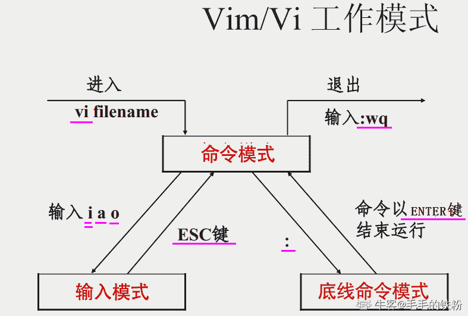

# 网易 2021 校招笔试-测试测开工程师-有道（正式第二批）

## 1

验收测试后表明测试已经结束

正确答案: B   你的答案: 空 (错误)

```cpp
正确
```

```cpp
不正确
```

本题知识点

测试开发工程师 测试工程师 网易 2021

讨论

[毛毛的铁粉](https://www.nowcoder.com/profile/115211167)

如果客户验收测试时，发现了部分缺陷，就可以针对性的修改缺陷后，验证通过后递交客户，相应测试也可以结束。------来自百度的一种说法

发表于 2021-10-03 21:31:10

* * *

[Qutieee 想找工作](https://www.nowcoder.com/profile/384634545)

难道是因为还要回归测试吗？

发表于 2021-03-05 20:12:17

* * *

[lwt1997](https://www.nowcoder.com/profile/702165656)

验收测试完成后表明测试已经结束。而不是验收测试后。

发表于 2021-03-04 20:18:14

* * *

## 2

测试人员需要坚持原则，在没有修复完所有 bug 的情况下坚决不能通过允许上线

正确答案: B   你的答案: 空 (错误)

```cpp
正确
```

```cpp
不正确
```

本题知识点

测试开发工程师 测试工程师 网易 2021

讨论

[入城何定时](https://www.nowcoder.com/profile/769590008)

对于严重的缺陷坚决不能上线，对于优先级不高，严重程度较低的可以上线

发表于 2021-02-14 20:32:39

* * *

## 3

代码 review 一般由测试员担任

正确答案: B   你的答案: 空 (错误)

```cpp
正确
```

```cpp
不正确
```

本题知识点

测试开发工程师 测试工程师 网易 2021

讨论

[求求给我一个 offer 叭](https://www.nowcoder.com/profile/8996768)

错误的

发表于 2021-02-23 13:47:59

* * *

[快乐阿拉蕾](https://www.nowcoder.com/profile/745586725)

测试和开发人员组成的小组

发表于 2021-02-23 10:00:44

* * *

## 4

所有的软件测试必须在实际使用环境下进行，否则结果无任何意义

正确答案: B   你的答案: 空 (错误)

```cpp
正确
```

```cpp
不正确
```

本题知识点

测试开发工程师 测试工程师 网易 2021

讨论

[牛客 1829637 号](https://www.nowcoder.com/profile/1829637)

压测不能在生产环境上进行

发表于 2021-03-24 11:06:52

* * *

## 5

有一堆石子共 100 枚，甲乙轮流从该堆中取石子，每次可取 2、4 或 6 枚，若取得最后的石子的玩家为赢，若甲先取，则甲必胜

正确答案: A   你的答案: 空 (错误)

```cpp
正确
```

```cpp
不正确
```

本题知识点

测试开发工程师 测试工程师 网易 2021

讨论

[牛客 646080682 号](https://www.nowcoder.com/profile/646080682)

这话太绝对了，我选的时候 我就是想万一甲送掉了呢。

发表于 2022-03-21 18:03:27

* * *

[sisul](https://www.nowcoder.com/profile/814130)

甲先取 4 个，然后甲保证乙甲取的总和等于 8，即乙取 2，那么甲取 6；乙取 4，那么甲取 4；乙取 6，则甲取 2，这样甲必胜

发表于 2022-02-20 17:39:11

* * *

[毛毛的铁粉](https://www.nowcoder.com/profile/115211167)

甲乙每次最多取 12 个石子，最终还会剩下 4 个石子，因此，甲先取的时候，应该先取 4 个，每次取的时候，甲要保证甲乙两个人取出的石子的总和是 12 的因数。

编辑于 2021-10-03 21:38:13

* * *

## 6

1、下列四项中，不属于关系数据库特点的是

正确答案: A   你的答案: 空 (错误)

```cpp
多用户访问
```

```cpp
数据独立性高
```

```cpp
数据共享性好
```

```cpp
数据冗余小
```

本题知识点

测试开发工程师 测试工程师 网易 2021

讨论

[牛客 30806433 号](https://www.nowcoder.com/profile/30806433)

关系数据库具有数据冗余度小、数据共享以及较高数据独立性等特点，对单用户数据库系统而言，不支持多用户访问。

发表于 2021-04-18 11:58:44

* * *

[Lyn 永远要开心](https://www.nowcoder.com/profile/751116213)

关系数据库的主要特点： 1\. 数据集中控制。在文件管理方法中，文件是分散的，每个用户或每种处理都有各自的文件，这些文件之间一般是没有联系的，因此，不能按照统一的方法来控制、维护和管理。而数据库则很好地克服了这一缺点，可以集中控制、维护和管理有关数据。 2\. 数据独立性高。数据库中的数据独立于应用程序，包括数据的物理独立性和逻辑独立性，给数据库的使用、调整、优化和进一步扩充提供了方便，提高了数据库应用系统的稳定性。 3\. 数据共享性好。数据库中的数据可以供多个用户使用，每个用户只与库中的一部分数据发生联系；用户数据可以重叠，用户可以同时存取数据而互不影响，大大提高了数据库的使用效率。 4\. 数据冗余度小。数据库中的数据不是面向应用，而是面向系统。数据统一定义、组织和存储，集中管理，避免了不必要的数据冗余，也提高了数据的一致性。 5\. 数据结构化。整个数据库按一定的结构形式构成，数据在记录内部和记录类型之间相互关联，用户可通过不同的路径存取数据。 6\. 统一的数据保护功能。在多用户共享数据资源的情况下，对用户使用数据有严格的检查，对数据库规定密码或存取权限，拒绝非法用户进入数据库，以确保数据的安全性、一致性和并发控制。

发表于 2021-08-21 11:53:04

* * *

[林司桐](https://www.nowcoder.com/profile/230743637)

我感觉是多用户访问是错的呀

发表于 2021-01-10 02:05:33

* * *

## 7

4，6，5，7，7，9，11，13，19，21，（ ），（ ）

正确答案: C   你的答案: 空 (错误)

```cpp
27 29
```

```cpp
32 33
```

```cpp
35 37
```

```cpp
41 43
```

本题知识点

测试开发工程师 测试工程师 网易 2021

讨论

[王玉松](https://www.nowcoder.com/profile/266867829)

4     5    7     11      19
   6     7    9       13      21 奇数项（偶数项）两数之间依次相差 1，2，4，8 自然推出 2⁴ = 1619 + 16 = 3521 + 16 = 37

发表于 2021-01-11 20:03:35

* * *

[毛毛的铁粉](https://www.nowcoder.com/profile/115211167)

先看奇数项  4 5 7 11 19 每次相差的是 1，2，4，8，那么下一个奇数项和 19 应该相差 16，应为 35 再看偶数项 6 7 9 13  每次相差的也是 1，2，4，8，那么下一个偶数项和 21 应相差 16，所以应为 37（或者是相邻两项相差 2）

发表于 2021-10-03 21:50:40

* * *

[快乐阿拉蕾](https://www.nowcoder.com/profile/745586725)

相临两数相加组成新数列 差数成对且相等出现

发表于 2021-01-26 16:32:34

* * *

## 8

访问一个 url，返回 400 错误，最有可能的原因是

正确答案: C   你的答案: 空 (错误)

```cpp
当前用户没有登录认证
```

```cpp
资源没有在服务器上发现
```

```cpp
请求参数有错误
```

```cpp
请求超时
```

本题知识点

测试开发工程师 测试工程师 网易 2021

讨论

[大鹏呀](https://www.nowcoder.com/profile/631010945)

可能会发生 400 错误的请求错误，因为请求中有一个简单的错误。 也许您输入了错误的 URL，并且服务器由于某种原因无法返回[404 错误](https://www.howtogeek.com/353486/how-to-fix-a-404-not-found-error/)。 也许您的 Web 浏览器正在尝试使用过期或无效的[cookie](https://www.howtogeek.com/327268/why-do-some-websites-have-pop-up-warnings-about-cookies/) 。 在某些情况下，某些未正确配置的服务器也可能引发 400 错误，而不是更多有用的错误

发表于 2021-08-19 20:39:33

* * *

[小孩的羔羊](https://www.nowcoder.com/profile/735781111)

C

发表于 2020-12-29 14:13:38

* * *

## 9

下列关于描述 XML 和 HTML 的差异不正确的是

正确答案: C   你的答案: 空 (错误)

```cpp
解析 XML 的性能优于 HTML
```

```cpp
XML 与 HTML 互补
```

```cpp
XML 的语法比 HTML 严格
```

```cpp
XML 扩展性比 HTML 强
```

本题知识点

测试开发工程师 测试工程师 网易 2021

讨论

[Lyn 永远要开心](https://www.nowcoder.com/profile/751116213)

（一）、语法要求不同： 1\. 在 html 中不区分大小写，在 xml 中严格区分。 2\. 在 HTML 中，有时不严格，如果上下文清楚地显示出段落或者列表键在何处结尾，那么你可以省略或者之类的结束标记。在 XML 中，是严格的树状结构，绝对不能省略掉结束标记。 3\. 在 XML 中，拥有单个标记而没有匹配的结束标记的元素必须用一个/ 字符作为结尾。这样分析器就知道不用查找结束标记了。 4\. 在 XML 中，属性值必须分装在引号中。在 HTML 中，引号是可用可不用的。 5\. 在 HTML 中，可以拥有不带值的属性名。在 XML 中，所有的属性都必须带有相应的值。 6\. 在 XML 文档中，空白部分不会被解析器自动删除；但是 html 是过滤掉空格的。 （二）、标记不同： 1、html 使用固有的标记；而 xml 没有固有的标记。 2、Html 标签是预定义的；XML 标签是免费的、自定义的、可扩展的。 （三）、作用不同： 1\. html 是用来显示数据的；xml 是用来描述数据、存放数据的，所以可以作为持久化的介质！Html 将数据和显示结合在一起，在页面中把这数据显示出来；xml 则将数据和显示分开。 XML 被设计用来描述数据，其焦点是数据的内容。HTML 被设计用来显示数据，其焦点是数据的外观。 2\. xml 不是 HTML 的替代品，xml 和 html 是两种不同用途的语言。 XML 不是要替换 HTML；实际上 XML 可以视作对 HTML 的补充。XML 和 HTML 的目标不同 HTML 的设计目标是显示数据并集中于数据外观，而 XML 的设计目标是描述数据并集中于数据的内容。 3\. 没有任何行为的 XML。与 HTML 相似，XML 不进行任何操作。（共同点） 4\. 对于 XML 最好的形容可能是: XML 是一种跨平台的，与软、硬件无关的，处理与传输信息的工具。 5\. XML 未来将会无所不在。XML 将成为最普遍的数据处理和数据传输的工具。

发表于 2021-08-21 11:55:21

* * *

[毛毛的铁粉](https://www.nowcoder.com/profile/115211167)

[`zhuanlan.zhihu.com/p/38355440`](https://zhuanlan.zhihu.com/p/38355440)

发表于 2021-10-03 21:54:30

* * *

## 10

Linux 文件权限一共 10 位长度，分成四段，第三段表示的内容是

正确答案: C   你的答案: 空 (错误)

```cpp
文件类型
```

```cpp
文件所有者的权限
```

```cpp
文件所有者所在组的权限
```

```cpp
其他用户的权限
```

本题知识点

测试开发工程师 测试工程师 网易 2021 硬件工程师 浩鲸云 2020

讨论

[毛毛的铁粉](https://www.nowcoder.com/profile/115211167)

第一位表示文件类型  - 表示普通文件  d 表示目录文件  接下来的 9 为 3 个 1 组分为 3 组，分别表示文件创建者的权限，同组用户用户拥有的权限，其他用户的权限  rwx 分别表示可读可写可执行

发表于 2021-10-03 21:57:57

* * *

[牛客 962075879 号](https://www.nowcoder.com/profile/962075879)

例如 ：drwxr-xr-xd :第一段，表示文件类型（文件？目录）rwx: 第二段，文件所有者权限 r-x:第三段，文件所有者所在组权限 r-x:第四段，其他用户权限

发表于 2021-02-26 03:16:06

* * *

## 11

Linux 有三个查看文件的命令，若希望在查看文件内容过程中可以用光标上下移动来查看文件内容，应使用（）命令

正确答案: C   你的答案: 空 (错误)

```cpp
cat
```

```cpp
more
```

```cpp
less
```

```cpp
menu
```

本题知识点

测试开发工程师 测试工程师 网易 2021

讨论

[牛客 962075879 号](https://www.nowcoder.com/profile/962075879)

less 可以让光标上下移动，more 只能用 enter 键往下翻，cat 的话直接跳到最后一页了

发表于 2021-02-26 03:17:31

* * *

[大鹏呀](https://www.nowcoder.com/profile/631010945)

 cat（英文全拼：concatenate）命令用于连接文件并打印到标准输出设备上。more 命令类似 cat ，不过会以一页一页的形式显示，更方便使用者逐页阅读，而最基本的指令就是按空白键（space）就往下一页显示，按 b 键就会往回（back）一页显示，而且还有搜寻字串的功能（与 vi 相似），使用中的说明文件，请按 hless 与 more 类似，less 可以随意浏览文件，支持翻页和搜索，支持向上翻页和向下翻页

发表于 2021-08-19 20:46:04

* * *

[Lyn 永远要开心](https://www.nowcoder.com/profile/751116213)

cat 命令：将文件内容一次全输出显示在屏幕上。 more 命令：分屏显示文件内容，每次只显示一屏，只允许向前浏览。 less 命令：与 more 相似，并且支持向前，向后浏览， 查看文件内容过程中可以用光标上下移动来查看文件内容。

发表于 2021-08-21 12:00:40

* * *

## 12

软件测试哪个阶段修复缺陷的成本最低？

正确答案: A   你的答案: 空 (错误)

```cpp
需求分析阶段
```

```cpp
系统测试阶段
```

```cpp
集成测试阶段
```

```cpp
编码阶段
```

本题知识点

测试开发工程师 测试工程师 网易 2021

讨论

[牛客 71699356 号](https://www.nowcoder.com/profile/71699356)

这就离谱

发表于 2021-04-22 22:34:24

* * *

## 13

既可以用于黑盒测试，也可以用于白盒测试的方法是？

正确答案: B   你的答案: 空 (错误)

```cpp
逻辑覆盖法
```

```cpp
边界值法
```

```cpp
基本路径法
```

```cpp
正交试验设计法
```

本题知识点

测试开发工程师 测试工程师 网易 2021

讨论

[大 K201906302000615](https://www.nowcoder.com/profile/469475677)

逻辑覆盖——白盒测试；边界值法——黑盒测试、白盒测试均可；基本路径法——白盒测试；正交试验设计法——黑盒测试；

发表于 2021-03-28 23:55:04

* * *

## 14

使用软件测试工具的目的是？

正确答案: A B C   你的答案: 空 (错误)

```cpp
帮助测试寻找问题
```

```cpp
协助问题的诊断
```

```cpp
节省测试时间
```

```cpp
提高 Bug 的发现率
```

本题知识点

测试开发工程师 测试工程师 网易 2021

讨论

[牛客 668581564 号](https://www.nowcoder.com/profile/668581564)

提高 bug 发现率不对吗

发表于 2021-07-13 07:05:18

* * *

## 15

以下属于 http 请求方法的是？

正确答案: A B C   你的答案: 空 (错误)

```cpp
get
```

```cpp
head
```

```cpp
put
```

```cpp
join
```

本题知识点

测试开发工程师 测试工程师 网易 2021

讨论

[Lyn 永远要开心](https://www.nowcoder.com/profile/751116213)

HTTP 请求的常用方法有：1、GET 方法；2、POST 方法；3、HEAD 方法；4、PUT 方法；5、DELETE 方法；6、CONNECT 方法；7、OPTIONS 方法；8、TRACE 方法。

发表于 2021-08-21 12:01:59

* * *

## 16

以下排序算法中，哪些是稳定的排序算法？

正确答案: A B C   你的答案: 空 (错误)

```cpp
冒泡
```

```cpp
插入
```

```cpp
合并
```

```cpp
希尔
```

本题知识点

测试开发工程师 测试工程师 网易 2021

讨论

[大鹏呀](https://www.nowcoder.com/profile/631010945)

[堆排序](https://baike.baidu.com/item/%E5%A0%86%E6%8E%92%E5%BA%8F)、[快速排序](https://baike.baidu.com/item/%E5%BF%AB%E9%80%9F%E6%8E%92%E5%BA%8F)、[希尔排序](https://baike.baidu.com/item/%E5%B8%8C%E5%B0%94%E6%8E%92%E5%BA%8F)、[直接选择排序](https://baike.baidu.com/item/%E7%9B%B4%E6%8E%A5%E9%80%89%E6%8B%A9%E6%8E%92%E5%BA%8F)是不稳定的排序算法，而[冒泡排序](https://baike.baidu.com/item/%E5%86%92%E6%B3%A1%E6%8E%92%E5%BA%8F)、[直接插入排序](https://baike.baidu.com/item/%E7%9B%B4%E6%8E%A5%E6%8F%92%E5%85%A5%E6%8E%92%E5%BA%8F)、[折半插入排序](https://baike.baidu.com/item/%E6%8A%98%E5%8D%8A%E6%8F%92%E5%85%A5%E6%8E%92%E5%BA%8F)、[归并排序](https://baike.baidu.com/item/%E5%BD%92%E5%B9%B6%E6%8E%92%E5%BA%8F)是稳定的排序算法。

发表于 2021-08-19 20:48:41

* * *

## 17

下面不是有效明确的功能需求？

正确答案: A C D   你的答案: 空 (错误)

```cpp
后台记录用户最近 10 次的登录数据
```

```cpp
用户签到后账户积分+5
```

```cpp
页面设计符合用户审美
```

```cpp
确保登录过程易用
```

本题知识点

测试开发工程师 测试工程师 网易 2021

讨论

[markhoo](https://www.nowcoder.com/profile/4069913)

A 为啥不对

发表于 2021-09-12 21:31:03

* * *

[uter](https://www.nowcoder.com/profile/942559467)

积分的实效性呢

发表于 2021-03-23 21:39:17

* * *

## 18

关于自动化测试与手工测试的比较，不正确的是？

正确答案: A B D   你的答案: 空 (错误)

```cpp
自动化测试能做的，手工测试不能做
```

```cpp
手工测试能做的，自动化测试都能做
```

```cpp
谁也不能完全代替对方
```

```cpp
自动化测试能做的，手工测试都能做
```

本题知识点

测试开发工程师 测试工程师 网易 2021

讨论

[白木华](https://www.nowcoder.com/profile/385692969)

自动化能做的，手工都能做吧，ad 两个选项矛盾了

发表于 2021-07-19 14:47:42

* * *

[章小山](https://www.nowcoder.com/profile/500419620)

A,D 不矛盾吗？

发表于 2021-03-20 13:10:59

* * *

## 19

以下属于关系型数据库的有？

正确答案: A B C   你的答案: 空 (错误)

```cpp
mysql
```

```cpp
sql server
```

```cpp
oracle
```

```cpp
mongodb
```

本题知识点

测试开发工程师 测试工程师 网易 2021

讨论

[大鹏呀](https://www.nowcoder.com/profile/631010945)

关系型数据库是指采用了关系模型来组织数据的数据库。简单来说，关系模式就是二维表格模型。

主要代表：SQL Server，Oracle,Mysql,PostgreSQL。

非关系型数据库，主要指那些非关系型的、分布式的，且一般不保证 ACID 的数据存储系统，主要代表 MongoDB，Redis、CouchDB

发表于 2021-08-19 20:50:40

* * *

## 20

以下属于 SSID 的加密方式有？

正确答案: A B C D   你的答案: 空 (错误)

```cpp
wep
```

```cpp
wpa2
```

```cpp
open system
```

```cpp
tkip
```

本题知识点

测试开发工程师 测试工程师 网易 2021

讨论

[毛毛的铁粉](https://www.nowcoder.com/profile/115211167)

**参考文档：**[`baike.baidu.com/item/SSID/10823867`](https://baike.baidu.com/item/SSID/10823867)    [`blog.csdn.net/wangzhen_csdn/article/details/78998813`](https://blog.csdn.net/wangzhen_csdn/article/details/78998813)**SSID**是**Service Set Identifier**的缩写，意思是：服务集标识。SSID 技术可以将一个[无线局域网](https://baike.baidu.com/item/%E6%97%A0%E7%BA%BF%E5%B1%80%E5%9F%9F%E7%BD%91/176200)分为几个需要不同身份验证的子网络，每一个子网络都需要独立的身份验证，只有通过身份验证的用户才可以进入相应的子网络，防止未被授权的用户进入本网络。
安全性排序：wpa2 > wep >open system 

发表于 2021-08-23 21:37:09

* * *

## 21

以下说法中，关于 HTTP 与 HTTPS 说法不正确的有？

正确答案: A C D   你的答案: 空 (错误)

```cpp
HTTP 比 HTTPS 更安全
```

```cpp
HTTP 比 HTTPS 页面响应速度更快
```

```cpp
HTTP 比 HTTPS 要更耗费服务器资源
```

```cpp
HTTP 与 HTTPS 使用的连接方式相同
```

本题知识点

测试开发工程师 测试工程师 网易 2021

讨论

[毛毛的铁粉](https://www.nowcoder.com/profile/115211167)

*   HTTP 明文传输，数据都是未加密的，安全性较差，HTTPS（SSL+HTTP） 数据传输过程是加密的，安全性较好。
*   使用 HTTPS 协议需要到 CA（Certificate Authority，数字证书认证机构） 申请证书，一般免费证书较少，因而需要一定费用。证书颁发机构如：Symantec、Comodo、GoDaddy 和 GlobalSign 等。
*   HTTP 页面响应速度比 HTTPS 快，主要是因为 HTTP 使用 TCP 三次握手建立连接，客户端和服务器需要交换 3 个包，而 HTTPS 除了 TCP 的三个包，还要加上 ssl 握手需要的 9 个包，所以一共是 12 个包。
*   http 和 https 使用的是完全不同的连接方式，用的端口也不一样，前者是 80，后者是 443。
*   HTTPS 其实就是建构在 SSL/TLS 之上的 HTTP 协议，所以，要比较 HTTPS 比 HTTP 要更耗费服务器资源。

发表于 2021-08-23 21:24:58

* * *

## 22

十进制的 16，是十六进制的 1

你的答案 (错误)

1 参考答案 (1) 10

本题知识点

测试开发工程师 测试工程师 网易 2021

讨论

[牛客 966146963 号](https://www.nowcoder.com/profile/966146963)

十六进制前面不是要加 x 吗

发表于 2022-03-15 16:20:21

* * *

[月亮 z](https://www.nowcoder.com/profile/235075514)

混了 16 的次方

发表于 2021-10-18 22:54:04

* * *

## 23

代表临时重定向的 HTTP 状态码是 1

你的答案 (错误)

1 参考答案 (1) 302

本题知识点

测试开发工程师 测试工程师 网易 2021

讨论

[毛毛的铁粉](https://www.nowcoder.com/profile/115211167)

*   200 - 请求成功
*   301 - 资源（网页等）被永久转移到其它 URL
*   404 - 请求的资源（网页等）不存在
*   400 - 请求参数有误
*   500 - 内部服务器错误

发表于 2021-08-23 21:19:01

* * *

[大鹏呀](https://www.nowcoder.com/profile/631010945)

304 特殊重定向

发表于 2021-08-19 20:53:33

* * *

[牛客 380821200 号](https://www.nowcoder.com/profile/380821200)

| 302 | Found | 临时移动。与 301 类似。但资源只是临时被移动。客户端应继续使用原有 URI 

&#124; 307 &#124; Temporary Redirect &#124; 临时重定向。与 302 类似。使用 GET 请求重定向 &#124;

 |

发表于 2021-07-20 15:25:19

* * *

## 24

Vim 中共有 1 种状态，退出编辑器的命令是 2，删除当前光标所在行开始计 5 行内容的命令是 3。

你的答案 (错误)

123 参考答案 (1) 3
(2) :q
(3) 5dd

本题知识点

测试开发工程师 测试工程师 网易 2021

讨论

[毛毛的铁粉](https://www.nowcoder.com/profile/115211167)

**参考文档：[`www.runoob.com/linux/linux-vim.html`](http://www.runoob.com/linux/linux-vim.html)****vim 共有 3 种状态命令模式（Command mode）**，**输入模式（Insert mode）**和**底线命令模式（Last line mode）****** 

发表于 2021-08-23 21:13:12

* * *

## 25

给定两个字符串 s 和 t ，判断 s 是否为 t 的子序列。

你可以认为 s 和 t 中仅包含英文小写字母。字符串 t 可能会很长（长度 n ~= 500,000），而 s 是个短字符串（长度 <=100）。

字符串的一个子序列是原始字符串删除一些（也可以不删除）字符而不改变剩余字符相对位置形成的新字符串。（例如，"ace"是"abcde"的一个子序列，而"aec"不是）。进阶：时间复杂度，空间复杂度 

本题知识点

测试开发工程师 测试工程师 网易 2021 游戏研发工程师 前端工程师 运维工程师 安卓工程师 iOS 工程师

讨论

[无限落后](https://www.nowcoder.com/profile/665328456)

```cpp
var boolen = function(str1,str2) {
  if (str1.length > str2.length) {
    return false
  }
  var first = str1.split('')[0]
  for (let a = 0; a <= str2.length; a++) {
    if (str2[a] === first) {
      if (str1.length > 0) {
        var strNew1 = str1.slice(1)
        var strNew2 = str2.slice(a)
        return boolen(strNew1,strNew2)
      } else {
        return true
      }
    }
  }
  return false
} 
```

发表于 2021-03-16 15:15:40

* * *

[牛客 334796982 号](https://www.nowcoder.com/profile/334796982)

短的字符串和长的字符串进行比较，如果相等，两个都接着比较下一个，如果不等，长的移动到下一个，短的指针停留在原位置，直到遇到再次相等短的再动，一次遍历是从短的第一个开始，二此遍历从短的第二个开始，直到短的每个字母作为起始遍历完，才算结束。

发表于 2021-08-20 11:12:26

* * *

[ccbbs](https://www.nowcoder.com/profile/688123147)

js 解法：正则表达式

```cpp
let _lines=[];
while(line=readline()){
    _lines.push(line);
}
let _str=_lines[0].split('').join('[a-z]*')
console.log(new RegExp(_str).test(_lines[1]));
```

发表于 2021-02-22 14:12:24

* * *